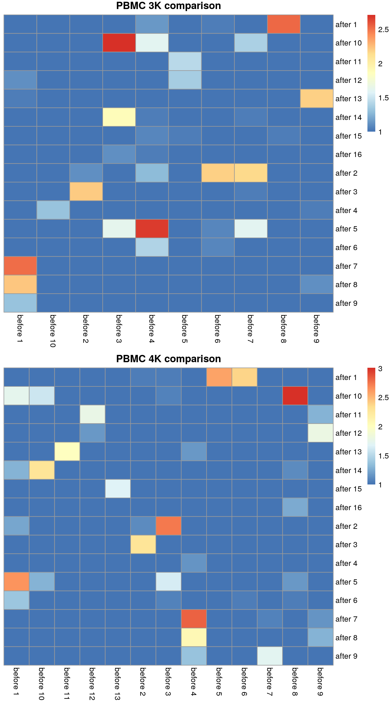
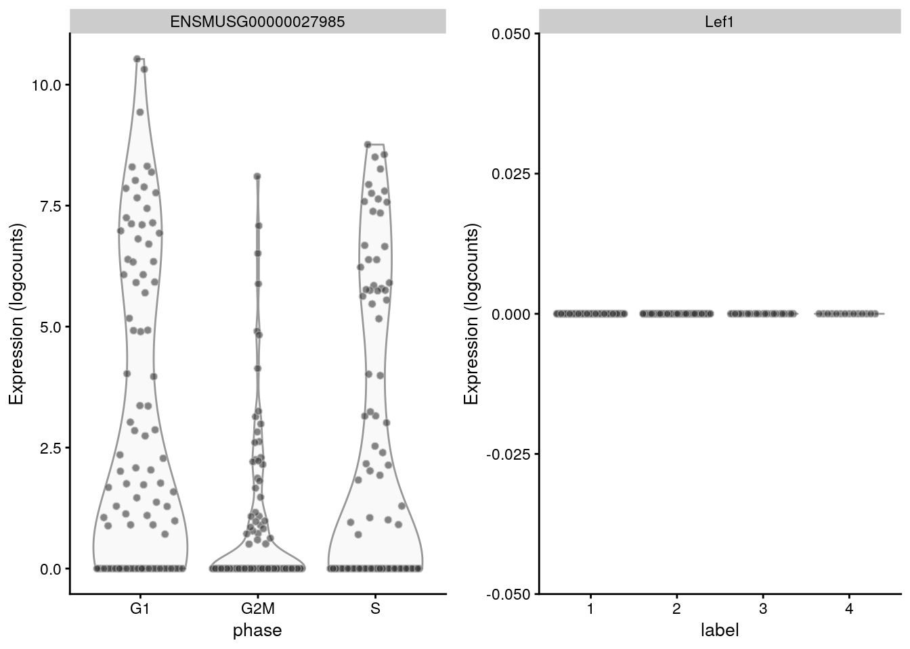
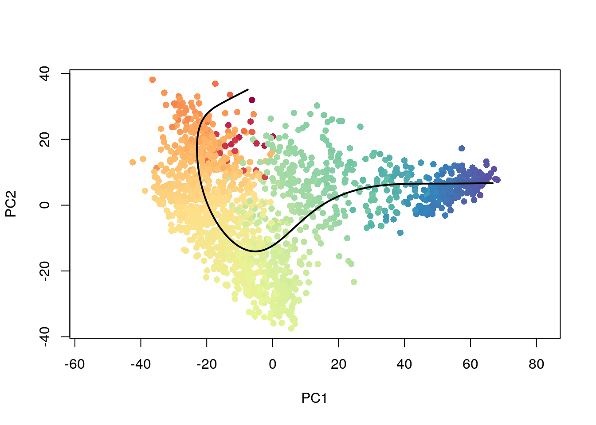
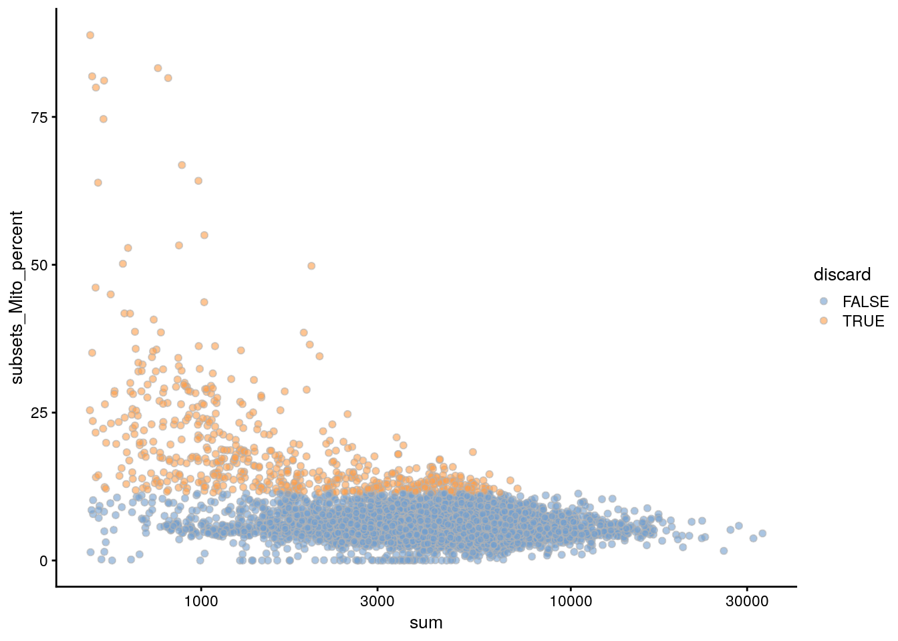
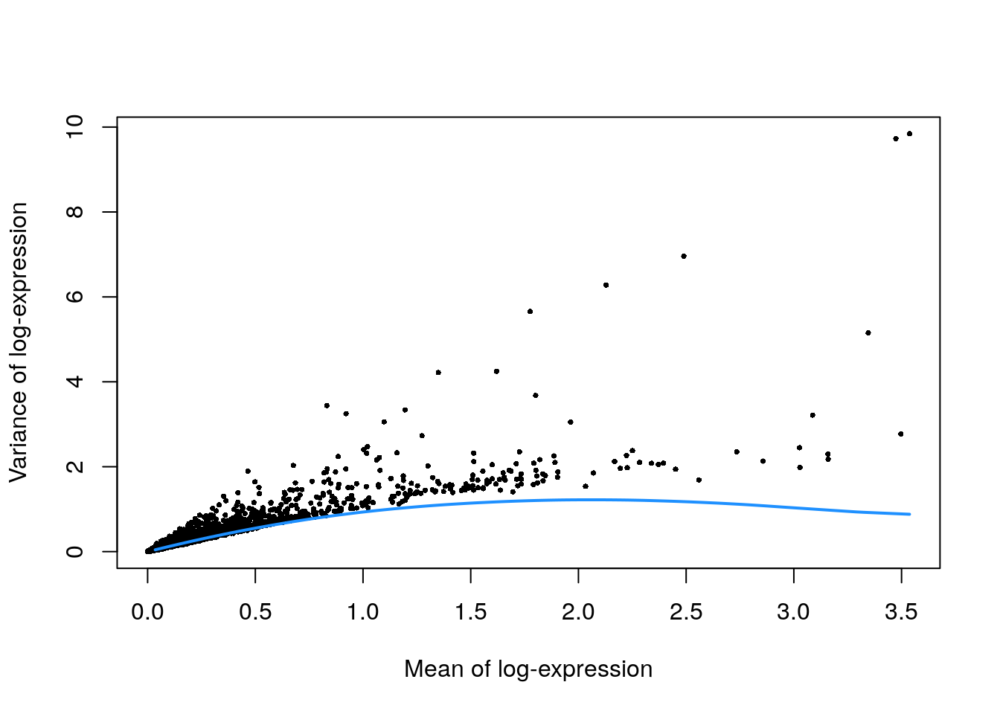
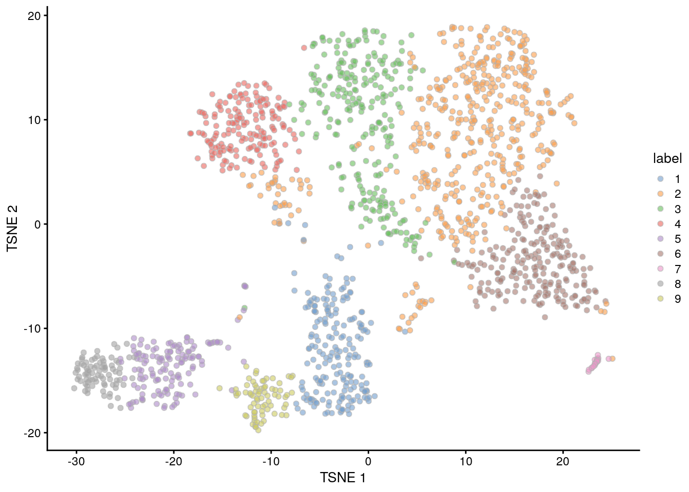

--- 
title: "Orchestrating Single-Cell Analysis with Bioconductor"
date: "2020-05-07"
site: bookdown::bookdown_site
documentclass: book
bibliography: [ref.bib, packages.bib]
biblio-style: apalike
link-citations: yes
favicon: "favicon.ico"
description: "Online companion to 'Orchestrating Single-Cell Analysis with Bioconductor' manuscript by the Bioconductor team."
---

# Welcome {-}

<a href="https://bioconductor.org"></a> 

This is the website for __"Orchestrating Single-Cell Analysis with Bioconductor"__, a book that teaches users some common workflows for the analysis of single-cell RNA-seq data (scRNA-seq). This book will teach you how to make use of cutting-edge Bioconductor tools to process, analyze, visualize, and explore scRNA-seq data. Additionally, it serves as an online companion for the manuscript __"Orchestrating Single-Cell Analysis with Bioconductor"__. 

While we focus here on scRNA-seq data, a newer technology that profiles transcriptomes at the single-cell level, many of the tools, conventions, and analysis strategies utilized throughout this book are broadly applicable to other types of assays. By learning the grammar of Bioconductor workflows, we hope to provide you a starting point for the exploration of your own data, whether it be scRNA-seq or otherwise. 

This book is organized into three parts. In the _Preamble_, we introduce the book and dive into resources for learning R and Bioconductor (both at a beginner and developer level). Part I ends with a tutorial for a key data infrastructure, the _SingleCellExperiment_ class, that is used throughout Bioconductor for single-cell analysis and in the subsequent section. 

The second part, _Focus Topics_, begins with an overview of the framework for analysis of scRNA-seq data, with deeper dives into specific topics are presented in each subsequent chapter. 

The third part, _Workflows_, provides primarily code detailing the analysis of various datasets throughout the book.

Finally, the _Appendix_ highlights our contributors.

If you would like to cite this work, please use the reference [__"Orchestrating Single-Cell Analysis with Bioconductor"__](https://www.nature.com/articles/s41592-019-0654-x). 

---

The book is written in [RMarkdown](https://rmarkdown.rstudio.com) with [bookdown](https://bookdown.org). OSCA is a collaborative effort, supported by various folks from the Bioconductor team who have contributed workflows, fixes, and improvements.

This website is __free to use__, and is licensed under the [Creative Commons Attribution-NonCommercial-NoDerivs 3.0](http://creativecommons.org/licenses/by-nc-nd/3.0/us/) License.


_Version 0.0.1.9999_
_Built on 2020-05-07_

<!--chapter:end:index.Rmd-->

--- 
title: "Orchestrating Single-Cell Analysis with Bioconductor"
date: "2020-05-07"
site: bookdown::bookdown_site
documentclass: book
bibliography: [ref.bib, packages.bib]
biblio-style: apalike
link-citations: yes
favicon: "favicon.ico"
description: "Online companion to 'Orchestrating Single-Cell Analysis with Bioconductor' manuscript by the Bioconductor team."
---

# Welcome {-}

Placeholder


<!--chapter:end:index.Rmd-->


# (PART) Preamble {-}
# Introduction

Placeholder


## What you will learn
### Preliminaries
### Workflows
## What you won't learn
## Who we wrote this for
## Why we wrote this
## Acknowledgements

<!--chapter:end:P1_W01.introduction.Rmd-->


# Learning R and Bioconductor {#learning-r-and-more}

Placeholder


## The Benefits of R and Bioconductor
## Learning R Online {#getting-started-with-r}
## Running R Locally
### Installing R
#### For MacOS/Linux Users
### Installing R & Bioconductor Packages
## Getting Help In (and Out) of R
## Bioconductor Help {#bioconductor-documentation}
### Bioconductor Packages
### biocViews
### Bioconductor Forums

<!--chapter:end:P1_W02.learning-r-and-bioconductor.Rmd-->


# Data Infrastructure {#data-infrastructure}

Placeholder


## Background
## Storing primary experimental data 
### Filling the `assays` slot
### Adding more `assays`
## Handling metadata
### On the columns
### On the rows
### Other metadata 
## Single-cell-specific fields
### Background
### Dimensionality reduction results
### Alternative Experiments
### Size factors 
### Column labels
## Conclusion 

<!--chapter:end:P1_W04.data-infrastructure.Rmd-->


# (PART) Focus Topics {-}
# Overview

Placeholder


## Introduction
## Experimental Design
## Obtaining a count matrix 
## Data processing and downstream analysis
## Quick start
## Session Info {-}

<!--chapter:end:P2_W01.overview.Rmd-->


# Quality Control

Placeholder


## Motivation {#quality-control-motivation}
## Choice of QC metrics
## Identifying low-quality cells
### With fixed thresholds {#fixed-qc}
### With adaptive thresholds {#quality-control-outlier}
#### Identifying outliers
#### Assumptions of outlier detection {#outlier-assumptions}
#### Considering experimental factors {#qc-batch}
### Other approaches
## Checking diagnostic plots {#quality-control-plots}
## Cell calling for droplet data {#qc-droplets}
### Background
### Testing for empty droplets
### Relationship with other QC metrics
## Removing low-quality cells {#quality-control-discarded}
## Marking low-quality cells {#marking-qc}
## Session Info {-}

<!--chapter:end:P2_W02.quality-control.Rmd-->


# Normalization 

Placeholder


## Motivation
## Library size normalization
## Normalization by deconvolution
## Normalization by spike-ins {#spike-norm}
## Applying the size factors
### Scaling and log-transforming {#normalization-transformation}
### Downsampling and log-transforming
### Other options
## Session Info {-}

<!--chapter:end:P2_W03.normalization.Rmd-->

---
output:
  html_document
bibliography: ../ref.bib
---


# Feature selection 

<script>
document.addEventListener("click", function (event) {
    if (event.target.classList.contains("aaron-collapse")) {
        event.target.classList.toggle("active");
        var content = event.target.nextElementSibling;
        if (content.style.display === "block") {
          content.style.display = "none";
        } else {
          content.style.display = "block";
        }
    }
})
</script>

<style>
.aaron-collapse {
  background-color: #eee;
  color: #444;
  cursor: pointer;
  padding: 18px;
  width: 100%;
  border: none;
  text-align: left;
  outline: none;
  font-size: 15px;
}

.aaron-content {
  padding: 0 18px;
  display: none;
  overflow: hidden;
  background-color: #f1f1f1;
}
</style>

## Motivation

We often use scRNA-seq data in exploratory analyses to characterize heterogeneity across cells.
Procedures like clustering and dimensionality reduction compare cells based on their gene expression profiles, which involves aggregating per-gene differences into a single (dis)similarity metric between a pair of cells.
The choice of genes to use in this calculation has a major impact on the behavior of the metric and the performance of downstream methods.
We want to select genes that contain useful information about the biology of the system while removing genes that contain random noise.
This aims to preserve interesting biological structure without the variance that obscures that structure, and to reduce the size of the data to improve computational efficiency of later steps.

The simplest approach to feature selection is to select the most variable genes based on their expression across the population.
This assumes that genuine biological differences will manifest as increased variation in the affected genes, compared to other genes that are only affected by technical noise or a baseline level of "uninteresting" biological variation (e.g., from transcriptional bursting).
Several methods are available to quantify the variation per gene and to select an appropriate set of highly variable genes (HVGs).
We will discuss these below using the 10X PBMC dataset for demonstration:

<button class="aaron-collapse">View history</button>
<div class="aaron-content">
   
```r
#--- loading ---#
library(BiocFileCache)
bfc <- BiocFileCache("raw_data", ask = FALSE)
raw.path <- bfcrpath(bfc, file.path("http://cf.10xgenomics.com/samples",
    "cell-exp/2.1.0/pbmc4k/pbmc4k_raw_gene_bc_matrices.tar.gz"))
untar(raw.path, exdir=file.path(tempdir(), "pbmc4k"))

library(DropletUtils)
fname <- file.path(tempdir(), "pbmc4k/raw_gene_bc_matrices/GRCh38")
sce.pbmc <- read10xCounts(fname, col.names=TRUE)

#--- gene-annotation ---#
library(scater)
rownames(sce.pbmc) <- uniquifyFeatureNames(
    rowData(sce.pbmc)$ID, rowData(sce.pbmc)$Symbol)

library(EnsDb.Hsapiens.v86)
location <- mapIds(EnsDb.Hsapiens.v86, keys=rowData(sce.pbmc)$ID, 
    column="SEQNAME", keytype="GENEID")

#--- cell-detection ---#
set.seed(100)
e.out <- emptyDrops(counts(sce.pbmc))
sce.pbmc <- sce.pbmc[,which(e.out$FDR <= 0.001)]

#--- quality-control ---#
stats <- perCellQCMetrics(sce.pbmc, subsets=list(Mito=which(location=="MT")))
high.mito <- isOutlier(stats$subsets_Mito_percent, type="higher")
sce.pbmc <- sce.pbmc[,!high.mito]

#--- normalization ---#
library(scran)
set.seed(1000)
clusters <- quickCluster(sce.pbmc)
sce.pbmc <- computeSumFactors(sce.pbmc, cluster=clusters)
sce.pbmc <- logNormCounts(sce.pbmc)
```

</div>


```r
sce.pbmc
```

```
## class: SingleCellExperiment 
## dim: 33694 3922 
## metadata(1): Samples
## assays(2): counts logcounts
## rownames(33694): RP11-34P13.3 FAM138A ... AC213203.1 FAM231B
## rowData names(2): ID Symbol
## colnames(3922): AAACCTGAGAAGGCCT-1 AAACCTGAGACAGACC-1 ...
##   TTTGTCACAGGTCCAC-1 TTTGTCATCCCAAGAT-1
## colData names(3): Sample Barcode sizeFactor
## reducedDimNames(0):
## altExpNames(0):
```

As well as the 416B dataset:

<button class="aaron-collapse">View history</button>
<div class="aaron-content">
   
```r
#--- loading ---#
library(scRNAseq)
sce.416b <- LunSpikeInData(which="416b") 
sce.416b$block <- factor(sce.416b$block)

#--- gene-annotation ---#
library(AnnotationHub)
ens.mm.v97 <- AnnotationHub()[["AH73905"]]
rowData(sce.416b)$ENSEMBL <- rownames(sce.416b)
rowData(sce.416b)$SYMBOL <- mapIds(ens.mm.v97, keys=rownames(sce.416b),
    keytype="GENEID", column="SYMBOL")
rowData(sce.416b)$SEQNAME <- mapIds(ens.mm.v97, keys=rownames(sce.416b),
    keytype="GENEID", column="SEQNAME")

library(scater)
rownames(sce.416b) <- uniquifyFeatureNames(rowData(sce.416b)$ENSEMBL, 
    rowData(sce.416b)$SYMBOL)

#--- quality-control ---#
mito <- which(rowData(sce.416b)$SEQNAME=="MT")
stats <- perCellQCMetrics(sce.416b, subsets=list(Mt=mito))
qc <- quickPerCellQC(stats, percent_subsets=c("subsets_Mt_percent",
    "altexps_ERCC_percent"), batch=sce.416b$block)
sce.416b <- sce.416b[,!qc$discard]

#--- normalization ---#
library(scran)
sce.416b <- computeSumFactors(sce.416b)
sce.416b <- logNormCounts(sce.416b)
```

</div>


```r
sce.416b
```

```
## class: SingleCellExperiment 
## dim: 46604 185 
## metadata(0):
## assays(2): counts logcounts
## rownames(46604): 4933401J01Rik Gm26206 ... CAAA01147332.1
##   CBFB-MYH11-mcherry
## rowData names(4): Length ENSEMBL SYMBOL SEQNAME
## colnames(185): SLX-9555.N701_S502.C89V9ANXX.s_1.r_1
##   SLX-9555.N701_S503.C89V9ANXX.s_1.r_1 ...
##   SLX-11312.N712_S507.H5H5YBBXX.s_8.r_1
##   SLX-11312.N712_S517.H5H5YBBXX.s_8.r_1
## colData names(10): Source Name cell line ... block sizeFactor
## reducedDimNames(0):
## altExpNames(2): ERCC SIRV
```

## Quantifying per-gene variation

### Variance of the log-counts

The simplest approach to quantifying per-gene variation is to simply compute the variance of the log-normalized expression values (referred to as "log-counts" for simplicity) for each gene across all cells in the population [@lun2016step].
This has an advantage in that the feature selection is based on the same log-values that are used for later downstream steps.
In particular, genes with the largest variances in log-values will contribute the most to the Euclidean distances between cells.
By using log-values here, we ensure that our quantitative definition of heterogeneity is consistent throughout the entire analysis.

Calculation of the per-gene variance is simple but feature selection requires modelling of the mean-variance relationship. 
As discussed briefly in Section \@ref(normalization-transformation), the log-transformation does not achieve perfect variance stabilization, which means that the variance of a gene is driven more by its abundance than its underlying biological heterogeneity. 
To account for this effect, we use the `modelGeneVar()` function to fit a trend to the variance with respect to abundance across all genes (Figure \@ref(fig:trend-plot-pbmc)).


```r
library(scran)
dec.pbmc <- modelGeneVar(sce.pbmc)

# Visualizing the fit:
fit.pbmc <- metadata(dec.pbmc)
plot(fit.pbmc$mean, fit.pbmc$var, xlab="Mean of log-expression",
    ylab="Variance of log-expression")
curve(fit.pbmc$trend(x), col="dodgerblue", add=TRUE, lwd=2)
```

<div class="figure">

<p class="caption">(\#fig:trend-plot-pbmc)Variance in the PBMC data set as a function of the mean. Each point represents a gene while the blue line represents the trend fitted to all genes.</p>
</div>

At any given abundance, we assume that the expression profiles of most genes are dominated by random technical noise (see Section \@ref(sec:spikeins) for details).
Under this assumption, our trend represents an estimate of the technical noise as a function of abundance.
We then break down the total variance of each gene into the technical component, i.e., the fitted value of the trend at that gene's abundance;
and the biological component, defined as the difference between the total variance and the technical component.
This biological component represents the "interesting" variation for each gene and can be used as the metric for HVG selection.


```r
# Ordering by most interesting genes for inspection.
dec.pbmc[order(dec.pbmc$bio, decreasing=TRUE),] 
```

```
## DataFrame with 33694 rows and 6 columns
##              mean     total      tech       bio      p.value          FDR
##         <numeric> <numeric> <numeric> <numeric>    <numeric>    <numeric>
## LYZ       1.97770   5.11595  0.827277   4.28867 7.03213e-271 6.90907e-267
## S100A9    1.94951   4.58859  0.827542   3.76105 9.35449e-209 6.12719e-205
## S100A8    1.71828   4.45723  0.819402   3.63783 2.60467e-199 1.27954e-195
## HLA-DRA   2.09694   3.72690  0.823663   2.90324 1.69875e-126 2.38432e-123
## CD74      2.89840   3.30912  0.793203   2.51592 7.30210e-103 6.83267e-100
## ...           ...       ...       ...       ...          ...          ...
## PTMA      3.83013  0.471105  0.740525 -0.269420     0.993177            1
## HLA-B     4.50161  0.475348  0.755807 -0.280459     0.994059            1
## EIF1      3.24261  0.478352  0.771316 -0.292963     0.994987            1
## TMSB4X    6.08483  0.408394  0.742840 -0.334446     0.998864            1
## B2M       5.95481  0.304437  0.714661 -0.410224     0.999950            1
```

(Careful readers will notice that some genes have negative biological components, which have no obvious interpretation and can be ignored in most applications.
They are inevitable when fitting a trend to the per-gene variances as approximately half of the genes will lie below the trend.)

### Coefficient of variation

An alternative approach to quantification uses the squared coefficient of variation (CV^2^) of the normalized expression values prior to log-transformation.
The CV^2^ is a widely used metric for describing variation in non-negative data and is closely related to the dispersion parameter of the negative binomial distribution in packages like *[edgeR](https://bioconductor.org/packages/3.12/edgeR)* and *[DESeq2](https://bioconductor.org/packages/3.12/DESeq2)*.
We compute the CV^2^ for each gene in the PBMC dataset using the `modelGeneCV2()` function, which provides a robust implementation of the approach described by @brennecke2013accounting.


```r
dec.cv2.pbmc <- modelGeneCV2(sce.pbmc)
```

This allows us to model the mean-variance relationship when considering the relevance of each gene (Figure \@ref(fig:cv2-pbmc)).
Again, our assumption is that most genes contain random noise and that the trend captures mostly technical variation.
Large CV^2^ values that deviate strongly from the trend are likely to represent genes affected by biological structure.


```r
fit.cv2.pbmc <- metadata(dec.cv2.pbmc)
plot(fit.cv2.pbmc$mean, fit.cv2.pbmc$cv2, log="xy")
curve(fit.cv2.pbmc$trend(x), col="dodgerblue", add=TRUE, lwd=2)
```

<div class="figure">

<p class="caption">(\#fig:cv2-pbmc)CV^2^ in the PBMC data set as a function of the mean. Each point represents a gene while the blue line represents the fitted trend.</p>
</div>

For each gene, we quantify the deviation from the trend in terms of the ratio of its CV^2^ to the fitted value of trend at its abundance.
This is more appropriate than the directly subtracting the trend from the CV^2^, as the magnitude of the ratio is not affected by the mean.


```r
dec.cv2.pbmc[order(dec.cv2.pbmc$ratio, decreasing=TRUE),]
```

```
## DataFrame with 33694 rows and 6 columns
##                 mean     total     trend     ratio   p.value       FDR
##            <numeric> <numeric> <numeric> <numeric> <numeric> <numeric>
## HIST1H2AC  0.9045169   267.718   1.55979  171.6372         0         0
## GNG11      0.6905688   219.323   1.98064  110.7334         0         0
## PRTFDC1    0.0412511  3034.952  29.98682  101.2096         0         0
## TNNC2      0.1021577  1210.585  12.22872   98.9952         0         0
## PF4        1.1083758   128.809   1.30995   98.3316         0         0
## ...              ...       ...       ...       ...       ...       ...
## AC023491.2         0       NaN       Inf       NaN       NaN       NaN
## AC233755.2         0       NaN       Inf       NaN       NaN       NaN
## AC233755.1         0       NaN       Inf       NaN       NaN       NaN
## AC213203.1         0       NaN       Inf       NaN       NaN       NaN
## FAM231B            0       NaN       Inf       NaN       NaN       NaN
```

Both the CV^2^ and the variance of log-counts are effective metrics for quantifying variation in gene expression.
The CV^2^ tends to give higher rank to low-abundance HVGs driven by upregulation in rare subpopulations, for which the increase in variance on the raw scale is stronger than that on the log-scale.
However, the variation described by the CV^2^ is less directly relevant to downstream procedures operating on the log-counts, and the reliance on the ratio can assign high rank to uninteresting genes with low absolute variance.
We generally prefer the use of the variance of log-counts and will use it in the following sections, though the many of the same principles apply to procedures based on the CV^2^.

### Quantifying technical noise {#sec:spikeins}

Strictly speaking, the use of a trend fitted to endogenous genes assumes that the expression profiles of most genes are dominated by random technical noise.
In practice, all expressed genes will exhibit some non-zero level of biological variability due to events like transcriptional bursting.
This suggests that our estimates of the technical component are likely to be inflated. 
It would be more appropriate to consider these estimates as technical noise plus "uninteresting" biological variation, under the assumption that most genes are unaffected by the relevant heterogeneity in the population.

This revised assumption is generally reasonable but may be problematic in some scenarios where many genes at a particular abundance are affected by a biological process.
For example, strong upregulation of cell type-specific genes may result in an enrichment of HVGs at high abundances.
This would inflate the fitted trend in that abundance interval and compromise the detection of the relevant genes.
We can avoid this problem by fitting a mean-dependent trend to the variance of the spike-in transcripts (Figure \@ref(fig:spike-416b)), if they are available.
The premise here is that spike-ins should not be affected by biological variation, so the fitted value of the spike-in trend should represent a better estimate of the technical component for each gene.


```r
dec.spike.416b <- modelGeneVarWithSpikes(sce.416b, "ERCC")
dec.spike.416b[order(dec.spike.416b$bio, decreasing=TRUE),]
```

```
## DataFrame with 46604 rows and 6 columns
##               mean     total      tech       bio      p.value          FDR
##          <numeric> <numeric> <numeric> <numeric>    <numeric>    <numeric>
## Lyz2       6.61097   13.8497   1.57131   12.2784 1.48993e-186 1.54156e-183
## Ccl9       6.67846   13.1869   1.50035   11.6866 2.21856e-185 2.19979e-182
## Top2a      5.81024   14.1787   2.54776   11.6310  3.80016e-65  1.13040e-62
## Cd200r3    4.83180   15.5613   4.22984   11.3314  9.46221e-24  6.08574e-22
## Ccnb2      5.97776   13.1393   2.30177   10.8375  3.68706e-69  1.20193e-66
## ...            ...       ...       ...       ...          ...          ...
## Rpl5-ps2   3.60625  0.612623   6.32853  -5.71590     0.999616     0.999726
## Gm11942    3.38768  0.798570   6.51473  -5.71616     0.999459     0.999726
## Gm12816    2.91276  0.838670   6.57364  -5.73497     0.999422     0.999726
## Gm13623    2.72844  0.708071   6.45448  -5.74641     0.999544     0.999726
## Rps12l1    3.15420  0.746615   6.59332  -5.84670     0.999522     0.999726
```

```r
plot(dec.spike.416b$mean, dec.spike.416b$total, xlab="Mean of log-expression",
    ylab="Variance of log-expression")
fit.spike.416b <- metadata(dec.spike.416b)
points(fit.spike.416b$mean, fit.spike.416b$var, col="red", pch=16)
curve(fit.spike.416b$trend(x), col="dodgerblue", add=TRUE, lwd=2)
```

<div class="figure">

<p class="caption">(\#fig:spike-416b)Variance in the 416B data set as a function of the mean. Each point represents a gene (black) or spike-in transcript (red) and the blue line represents the trend fitted to all spike-ins.</p>
</div>

In the absence of spike-in data, one can attempt to create a trend by making some distributional assumptions about the noise.
For example, UMI counts typically exhibit near-Poisson variation if we only consider technical noise from library preparation and sequencing.
This can be used to construct a mean-variance trend in the log-counts (Figure \@ref(fig:tech-pbmc)) with the `modelGeneVarByPoisson()` function.
Note the increased residuals of the high-abundance genes, which can be interpreted as the amount of biological variation that was assumed to be "uninteresting" when fitting the gene-based trend in Figure \@ref(fig:trend-plot-pbmc).


```r
set.seed(0010101)
dec.pois.pbmc <- modelGeneVarByPoisson(sce.pbmc)
dec.pois.pbmc <- dec.pois.pbmc[order(dec.pois.pbmc$bio, decreasing=TRUE),]
head(dec.pois.pbmc)
```

```
## DataFrame with 6 rows and 6 columns
##              mean     total      tech       bio   p.value       FDR
##         <numeric> <numeric> <numeric> <numeric> <numeric> <numeric>
## LYZ       1.97770   5.11595  0.621547   4.49440         0         0
## S100A9    1.94951   4.58859  0.627306   3.96128         0         0
## S100A8    1.71828   4.45723  0.669428   3.78781         0         0
## HLA-DRA   2.09694   3.72690  0.596372   3.13053         0         0
## CD74      2.89840   3.30912  0.422624   2.88650         0         0
## CST3      1.49285   2.97369  0.695367   2.27833         0         0
```

```r
plot(dec.pois.pbmc$mean, dec.pois.pbmc$total, pch=16, xlab="Mean of log-expression",
    ylab="Variance of log-expression")
curve(metadata(dec.pois.pbmc)$trend(x), col="dodgerblue", add=TRUE)
```

<div class="figure">

<p class="caption">(\#fig:tech-pbmc)Variance of normalized log-expression values for each gene in the PBMC dataset, plotted against the mean log-expression. The blue line represents represents the mean-variance relationship corresponding to Poisson noise.</p>
</div>

Interestingly, trends based purely on technical noise tend to yield large biological components for highly-expressed genes.
This often includes so-called "house-keeping" genes coding for essential cellular components such as ribosomal proteins, which are considered uninteresting for characterizing cellular heterogeneity.
These observations suggest that a more accurate noise model does not necessarily yield a better ranking of HVGs, though one should keep an open mind - house-keeping genes are regularly DE in a variety of conditions [@glare2002betaactin;@nazari2015gapdh;@guimaraes2016patterns], and the fact that they have large biological components indicates that there is strong variation across cells that may not be completely irrelevant.

### Accounting for blocking factors

#### Fitting block-specific trends {#variance-batch}

Data containing multiple batches will often exhibit batch effects (see Chapter \@ref(data-integration) for more details).
We are usually not interested in HVGs that are driven by batch effects.
Rather, we want to focus on genes that are highly variable within each batch.
This is naturally achieved by performing trend fitting and variance decomposition separately for each batch.
We demonstrate this approach by treating each plate (`block`) in the 416B dataset as a different batch, using the `modelGeneVarWithSpikes()` function.
(The same argument is available in all other variance-modelling functions.)


```r
dec.block.416b <- modelGeneVarWithSpikes(sce.416b, "ERCC", block=sce.416b$block)
head(dec.block.416b[order(dec.block.416b$bio, decreasing=TRUE),1:6])
```

```
## DataFrame with 6 rows and 6 columns
##              mean     total      tech       bio      p.value          FDR
##         <numeric> <numeric> <numeric> <numeric>    <numeric>    <numeric>
## Lyz2      6.61235   13.8619   1.58416   12.2777  0.00000e+00  0.00000e+00
## Ccl9      6.67841   13.2599   1.44553   11.8143  0.00000e+00  0.00000e+00
## Top2a     5.81275   14.0192   2.74571   11.2734 3.89855e-137 8.43398e-135
## Cd200r3   4.83305   15.5909   4.31892   11.2719  1.17783e-54  7.00721e-53
## Ccnb2     5.97999   13.0256   2.46647   10.5591 1.20380e-151 2.98405e-149
## Hbb-bt    4.91683   14.6539   4.12156   10.5323  2.52639e-49  1.34197e-47
```

The use of a batch-specific trend fit is useful as it accommodates differences in the mean-variance trends between batches.
This is especially important if batches exhibit systematic technical differences, e.g., differences in coverage or in the amount of spike-in RNA added.
In this case, there are only minor differences between the trends in Figure \@ref(fig:blocked-fit), which indicates that the experiment was tightly replicated across plates.
The analysis of each plate yields estimates of the biological and technical components for each gene, which are averaged across plates to take advantage of information from multiple batches. 


```r
par(mfrow=c(1,2))
blocked.stats <- dec.block.416b$per.block
for (i in colnames(blocked.stats)) {
    current <- blocked.stats[[i]]
    plot(current$mean, current$total, main=i, pch=16, cex=0.5,
        xlab="Mean of log-expression", ylab="Variance of log-expression")
    curfit <- metadata(current)
    points(curfit$mean, curfit$var, col="red", pch=16)
    curve(curfit$trend(x), col='dodgerblue', add=TRUE, lwd=2) 
}
```

<div class="figure">

<p class="caption">(\#fig:blocked-fit)Variance in the 416B data set as a function of the mean after blocking on the plate of origin. Each plot represents the results for a single plate, each point represents a gene (black) or spike-in transcript (red) and the blue line represents the trend fitted to all spike-ins.</p>
</div>

As an aside, the wave-like shape observed above is typical of the mean-variance trend for log-expression values.
(The same wave is present but much less pronounced for UMI data.)
A linear increase in the variance is observed as the mean increases from zero, as larger variances are obviously possible when the counts are not all equal to zero.
In contrast, the relative contribution of sampling noise decreases at high abundances, resulting in a downward trend.
The peak represents the point at which these two competing effects cancel each other out.

#### Using a design matrix

The use of block-specific trends is the recommended approach for experiments with a single blocking factor.
However, this is not practical for studies involving a large number of blocking factors and/or covariates.
In such cases, we can use the `design=` argument to specify a design matrix with uninteresting factors of variation.
We illustrate again with the 416B data set, blocking on the plate of origin and oncogene induction.
(The same argument is available in `modelGeneVar()` when spike-ins are not available.)


```r
design <- model.matrix(~factor(block) + phenotype, colData(sce.416b))
dec.design.416b <- modelGeneVarWithSpikes(sce.416b, "ERCC", design=design)
dec.design.416b[order(dec.design.416b$bio, decreasing=TRUE),]
```

```
## DataFrame with 46604 rows and 6 columns
##               mean     total      tech       bio      p.value          FDR
##          <numeric> <numeric> <numeric> <numeric>    <numeric>    <numeric>
## Lyz2       6.61097   8.90513   1.50405   7.40107 1.78185e-172 1.28493e-169
## Ccnb2      5.97776   9.54373   2.24180   7.30192  7.77223e-77  1.44497e-74
## Gem        5.90225   9.54358   2.35175   7.19183  5.49587e-68  8.12330e-66
## Cenpa      5.81349   8.65622   2.48792   6.16830  2.08035e-45  1.52796e-43
## Idh1       5.99343   8.32113   2.21965   6.10148  2.42819e-55  2.41772e-53
## ...            ...       ...       ...       ...          ...          ...
## Gm5054     2.90434  0.463698   6.77000  -6.30630            1            1
## Gm12191    3.55920  0.170709   6.53285  -6.36214            1            1
## Gm7429     3.45394  0.248351   6.63458  -6.38623            1            1
## Gm16378    2.83987  0.208215   6.74663  -6.53841            1            1
## Rps2-ps2   3.11324  0.202307   6.78484  -6.58253            1            1
```

This strategy is simple but somewhat inaccurate as it does not consider the mean expression in each blocking level.
Recall that the technical component is estimated as the fitted value of the trend at the average abundance for each gene.
However, the true technical component is the average of the fitted values at the per-block means, which may be quite different for strong batch effects and non-linear mean-variance relationships.
The `block=` approach is safer and should be preferred in all situations where it is applicable.

## Selecting highly variable genes {#hvg-selection}

### Overview

Once we have quantified the per-gene variation, the next step is to select the subset of HVGs to use in downstream analyses.
A larger subset will reduce the risk of discarding interesting biological signal by retaining more potentially relevant genes, at the cost of increasing noise from irrelevant genes that might obscure said signal.
It is difficult to determine the optimal trade-off for any given application as noise in one context may be useful signal in another.
For example, heterogeneity in T cell activation responses is an interesting phenomena [@richard2018tcell] but may be irrelevant noise in studies that only care about distinguishing the major immunophenotypes.
That said, there are several common strategies that are routinely used to guide HVG selection, which we shall discuss here.

### Based on the largest metrics

The simplest HVG selection strategy is to take the top $X$ genes with the largest values for the relevant variance metric.
The main advantage of this approach is that the user can directly control the number of genes retained, which ensures that the computational complexity of downstream calculations is easily predicted.
For `modelGeneVar()` and `modelGeneVarWithSpikes()`, we would select the genes with the largest biological components:


```r
# Taking the top 1000 genes here:
hvg.pbmc.var <- getTopHVGs(dec.pbmc, n=1000)
str(hvg.pbmc.var)
```

```
##  chr [1:1000] "LYZ" "S100A9" "S100A8" "HLA-DRA" "CD74" "CST3" "TYROBP" ...
```

For `modelGeneCV2()` (and its relative, `modelGeneCV2WithSpikes()`), this would instead be the genes with the largest ratios:


```r
hvg.pbmc.cv2 <- getTopHVGs(dec.cv2.pbmc, var.field="ratio", n=1000)
str(hvg.pbmc.cv2)
```

```
##  chr [1:1000] "HIST1H2AC" "GNG11" "PRTFDC1" "TNNC2" "PF4" "HGD" "PPBP" ...
```

The choice of $X$ also has a fairly straightforward biological interpretation.
Recall our trend-fitting assumption that most genes do not exhibit biological heterogeneity; this implies that they are not differentially expressed between cell types or states in our population.
If we quantify this assumption into a statement that, e.g., no more than 5% of genes are differentially expressed, we can naturally set $X$ to 5% of the number of genes.
In practice, we usually do not know the proportion of DE genes beforehand so this interpretation just exchanges one unknown for another.
Nonetheless, it is still useful as it implies that we should lower $X$ for less heterogeneous datasets, retaining most of the biological signal without unnecessary noise from irrelevant genes.
Conversely, more heterogeneous datasets should use larger values of $X$ to preserve secondary factors of variation beyond those driving the most obvious HVGs.

The main disadvantage of this approach that it turns HVG selection into a competition between genes, whereby a subset of very highly variable genes can push other informative genes out of the top set.
This can be problematic for analyses of highly heterogeneous populations if the loss of important markers prevents the resolution of certain subpopulations.
In the most extreme example, consider a situation where a single subpopulation is very different from the others.
In such cases, the top set will be dominated by differentially expressed genes involving that distinct subpopulation, compromising resolution of heterogeneity between the other populations.
(This can salvaged with a nested analysis, as discussed in Section \@ref(subclustering), but we would prefer to avoid the problem in the first place.)

<!--
Similarly, abundance-dependent changes in the magnitude of the chosen variance metric can introduce unexpected biases in competitive gene selection. 
For example, the wave shape in Figure \@ref(fig:blocked-fit) means that the largest biological components usually occur around the peak and will be preferentially selected, while an upper bound on the CV^2^ discriminates against selection of low-abundance genes.
-->

Another possible concern with this approach is the fact that the choice of $X$ is fairly arbitrary, with any value from 500 to 5000 considered "reasonable". 
We have chosen $X=1000$ in the code above though there is no particular _a priori_ reason for doing so.
Our recommendation is to simply pick an arbitrary $X$ and proceed with the rest of the analysis, with the intention of testing other choices later, rather than spending much time worrying about obtaining the "optimal" value.

### Based on significance

Another approach to feature selection is to set a fixed threshold of one of the metrics.
This is most commonly done with the (adjusted) $p$-value reported by each of the above methods.
The $p$-value for each gene is generated by testing against the null hypothesis that the variance is equal to the trend.
For example, we might define our HVGs as all genes that have adjusted $p$-values below 0.05.


```r
hvg.pbmc.var.2 <- getTopHVGs(dec.pbmc, fdr.threshold=0.05)
length(hvg.pbmc.var.2)
```

```
## [1] 651
```

This approach is simple to implement and - if the test holds its size - it controls the false discovery rate (FDR).
That is, it returns a subset of genes where the proportion of false positives is expected to be below the specified threshold.
This can occasionally be useful in applications where the HVGs themselves are of interest.
For example, if we were to use the list of HVGs in further experiments to verify the existence of heterogeneous expression for some of the genes, we would want to control the FDR in that list.

The downside of this approach is that it is less predictable than the top $X$ strategy.
The number of genes returned depends on the type II error rate of the test and the severity of the multiple testing correction.
One might obtain no genes or every gene at a given FDR threshold, depending on the circumstances.
Moreover, control of the FDR is usually not helpful at this stage of the analysis.
We are not interpreting the individual HVGs themselves but are only using them for feature selection prior to downstream steps.
There is no reason to think that a 5% threshold on the FDR yields a more suitable compromise between bias and noise compared to the top $X$ selection.

As an aside, we might consider ranking genes by the $p$-value instead of the biological component for use in a top $X$ approach.
This results in some counterintuitive behavior due to the nature of the underlying hypothesis test, which is based on the ratio of the total variance to the expected technical variance.
Ranking based on $p$-value tends to prioritize HVGs that are more likely to be true positives but, at the same time, less likely to be biologically interesting.
Many of the largest ratios are observed in high-abundance genes and are driven by very low technical variance; the total variance is typically modest for such genes, and they do not contribute much to population heterogeneity in absolute terms.
(Note that the same can be said of the ratio of CV^2^ values, as briefly discussed above.)

### Keeping all genes above the trend {#feature-selection-positive}

Here, the aim is to only remove the obviously uninteresting genes with variances below the trend.
By doing so, we avoid the need to make any judgement calls regarding what level of variation is interesting enough to retain.
This approach represents one extreme of the bias-variance trade-off where bias is minimized at the cost of maximizing noise.
For `modelGeneVar()`, it equates to keeping all positive biological components:


```r
hvg.pbmc.var.3 <- getTopHVGs(dec.pbmc, var.threshold=0)
length(hvg.pbmc.var.3)
```

```
## [1] 12791
```

For `modelGeneCV2()`, this involves keeping all ratios above 1:


```r
hvg.pbmc.cv2.3 <- getTopHVGs(dec.cv2.pbmc, var.field="ratio", var.threshold=1)
length(hvg.pbmc.cv2.3)
```

```
## [1] 9295
```

By retaining all potential biological signal, we give secondary population structure the chance to manifest.
This is most useful for rare subpopulations where the relevant markers will not exhibit strong overdispersion owing to the small number of affected cells.
It will also preserve a weak but consistent effect across many genes with small biological components; admittedly, though, this is not of major interest in most scRNA-seq studies given the difficulty of experimentally validating population structure in the absence of strong marker genes.

The obvious cost is that more noise is also captured, which can reduce the resolution of otherwise well-separated populations and mask the secondary signal that we were trying to preserve.
The use of more genes also introduces more computational work in each downstream step.
This strategy is thus best suited to very heterogeneous populations containing many different cell types (possibly across many datasets that are to be merged, as in Chapter \@ref(integrating-datasets)) where there is a justified fear of ignoring marker genes for low-abundance subpopulations under a competitive top $X$ approach.

## Selecting _a priori_ genes of interest {#apriori-hvgs}

A blunt yet effective feature selection strategy is to use pre-defined sets of interesting genes.
The aim is to focus on specific aspects of biological heterogeneity that may be masked by other factors when using unsupervised methods for HVG selection.
One example application lies in the dissection of transcriptional changes during the earliest stages of cell fate commitment [@messmer2019transcriptional], which may be modest relative to activity in other pathways (e.g., cell cycle, metabolism).
Indeed, if our aim is to show that there is no meaningful heterogeneity in a given pathway, we would - at the very least - be obliged to repeat our analysis using only the genes in that pathway to maximize power for detecting such heterogeneity.

Using scRNA-seq data in this manner is conceptually equivalent to a fluorescence activated cell sorting (FACS) experiment, with the convenience of being able to (re)define the features of interest at any time.
For example, in the PBMC dataset, we might use some of the C7 immunologic signatures from MSigDB [@godec2016compendium] to improve resolution of the various T cell subtypes.
We stress that there is no shame in leveraging prior biological knowledge to address specific hypotheses in this manner.
We say this because a common refrain in genomics is that the data analysis should be "unbiased", i.e., free from any biological preconceptions.
Attempting to derive biological insight _ab initio_ is admirable but such "biases" are already present at every stage, starting from experimental design (why are we interested in this cell population in the first place?) and continuing through to interpretation of marker genes (Section \@ref(marker-detection)).


```r
library(msigdbr)
c7.sets <- msigdbr(species = "Homo sapiens", category = "C7")
head(unique(c7.sets$gs_name))
```

```
## [1] "GOLDRATH_EFF_VS_MEMORY_CD8_TCELL_DN"  
## [2] "GOLDRATH_EFF_VS_MEMORY_CD8_TCELL_UP"  
## [3] "GOLDRATH_NAIVE_VS_EFF_CD8_TCELL_DN"   
## [4] "GOLDRATH_NAIVE_VS_EFF_CD8_TCELL_UP"   
## [5] "GOLDRATH_NAIVE_VS_MEMORY_CD8_TCELL_DN"
## [6] "GOLDRATH_NAIVE_VS_MEMORY_CD8_TCELL_UP"
```

```r
# Using the Goldrath sets to distinguish CD8 subtypes
cd8.sets <- c7.sets[grep("GOLDRATH", c7.sets$gs_name),]
cd8.genes <- rowData(sce.pbmc)$Symbol %in% cd8.sets$human_gene_symbol
summary(cd8.genes)
```

```
##    Mode   FALSE    TRUE 
## logical   32866     828
```

```r
# Using GSE11924 to distinguish between T helper subtypes
th.sets <- c7.sets[grep("GSE11924", c7.sets$gs_name),]
th.genes <- rowData(sce.pbmc)$Symbol %in% th.sets$human_gene_symbol
summary(th.genes)
```

```
##    Mode   FALSE    TRUE 
## logical   31781    1913
```

```r
# Using GSE11961 to distinguish between B cell subtypes
b.sets <- c7.sets[grep("GSE11961", c7.sets$gs_name),]
b.genes <- rowData(sce.pbmc)$Symbol %in% b.sets$human_gene_symbol
summary(b.genes)
```

```
##    Mode   FALSE    TRUE 
## logical   28158    5536
```

Of course, the downside of focusing on pre-defined genes is that it will limit our capacity to detect novel or unexpected aspects of variation.
Thus, this kind of focused analysis should be complementary to (rather than a replacement for) the unsupervised feature selection strategies discussed previously.

Alternatively, we can also invert this reasoning to remove genes that are unlikely to be of interest prior to downstream analyses, thus avoiding unwanted variation that interferes with downstream interpretation.
Common candidates for removal include ribosomal protein genes or mitochondrial genes; for immune cell subsets, we might also be inclined to remove immunoglobulin genes and T cell receptor genes, where clonal expression introduces (possibly irrelevant) population structure.


```r
# Identifying ribosomal proteins:
ribo.discard <- grepl("^RP[SL]\\d+", rownames(sce.pbmc))
sum(ribo.discard)
```

```
## [1] 99
```

```r
# A more curated approach for identifying ribosomal protein genes:
c2.sets <- msigdbr(species = "Homo sapiens", category = "C2")
ribo.set <- c2.sets[c2.sets$gs_name=="KEGG_RIBOSOME",]$human_gene_symbol
ribo.discard <- rownames(sce.pbmc) %in% ribo.set
sum(ribo.discard)
```

```
## [1] 86
```

```r
library(AnnotationHub)
edb <- AnnotationHub()[["AH73881"]]
anno <- select(edb, keys=rowData(sce.pbmc)$ID, keytype="GENEID", 
    columns="TXBIOTYPE")

# Removing immunoglobulin variable chains:
igv.set <- anno$GENEID[anno$TXBIOTYPE %in% c("IG_V_gene", "IG_V_pseudogene")]
igv.discard <- rowData(sce.pbmc)$ID %in% igv.set
sum(igv.discard)
```

```
## [1] 326
```

```r
# Removing TCR variable chains:
tcr.set <- anno$GENEID[anno$TXBIOTYPE %in% c("TR_V_gene", "TR_V_pseudogene")]
tcr.discard <- rowData(sce.pbmc)$ID %in% tcr.set
sum(tcr.discard)
```

```
## [1] 138
```

In practice, we tend to err on the side of caution and abstain from preemptive filtering on biological function until these genes are demonstrably problematic in downstream analyses.

## Putting it all together {#feature-selection-subsetting}

The few lines of code below will select the top 10% of genes with the highest biological components.


```r
dec.pbmc <- modelGeneVar(sce.pbmc)
chosen <- getTopHVGs(dec.pbmc, prop=0.1)
str(chosen)
```

```
##  chr [1:1279] "LYZ" "S100A9" "S100A8" "HLA-DRA" "CD74" "CST3" "TYROBP" ...
```

We then have several options to enforce our HVG selection on the rest of the analysis.

1. We can subset the `SingleCellExperiment` to only retain our selection of HVGs.
This ensures that downstream methods will only use these genes for their calculations.
The downside is that the non-HVGs are discarded from the new `SingleCellExperiment`, making it slightly more inconvenient to interrogate the full dataset for interesting genes that are not HVGs.

    
    ```r
    sce.pbmc.hvg <- sce.pbmc[chosen,]
    dim(sce.pbmc.hvg)
    ```
    
    ```
    ## [1] 1279 3922
    ```

2. We can keep the original `SingleCellExperiment` object and specify the genes to use for downstream functions via an extra argument like `subset.row=`.
This is useful if the analysis uses multiple sets of HVGs at different steps, whereby one set of HVGs can be easily swapped for another in specific steps.
However, it can be inconvenient to repeatedly specify the same HVG set across steps.

    
    ```r
    # Performing PCA only on the chosen HVGs.
    library(scater)
    sce.pbmc <- runPCA(sce.pbmc, subset_row=chosen)
    reducedDimNames(sce.pbmc)
    ```
    
    ```
    ## [1] "PCA"
    ```

3. We can have our cake and eat it too by (ab)using the "alternative Experiment" system in the `SingleCellExperiment` class.
Initially designed for storing alternative features like spike-ins or antibody tags, we can instead use it to hold our full dataset while we perform our downstream operations conveniently on the HVG subset.
This avoids book-keeping problems in long analyses when the original dataset is not synchronized with the HVG subsetted data. 

    
    ```r
    # Recycling the class above.
    altExp(sce.pbmc.hvg, "original") <- sce.pbmc
    altExpNames(sce.pbmc.hvg)
    ```
    
    ```
    ## [1] "original"
    ```
    
    ```r
    # No need for explicit subset_row= specification in downstream operations.
    sce.pbmc.hvg <- runPCA(sce.pbmc.hvg)
    
    # Recover original data:
    sce.pbmc.original <- altExp(sce.pbmc.hvg, "original", withColData=TRUE)
    ```

## Session Info {-}

<button class="aaron-collapse">View session info</button>
<div class="aaron-content">
```
R version 4.0.0 Patched (2020-05-01 r78341)
Platform: x86_64-pc-linux-gnu (64-bit)
Running under: Ubuntu 18.04.4 LTS

Matrix products: default
BLAS:   /home/luna/Software/R/R-4-0-branch-dev/lib/libRblas.so
LAPACK: /home/luna/Software/R/R-4-0-branch-dev/lib/libRlapack.so

locale:
 [1] LC_CTYPE=en_US.UTF-8       LC_NUMERIC=C              
 [3] LC_TIME=en_US.UTF-8        LC_COLLATE=en_US.UTF-8    
 [5] LC_MONETARY=en_US.UTF-8    LC_MESSAGES=en_US.UTF-8   
 [7] LC_PAPER=en_US.UTF-8       LC_NAME=C                 
 [9] LC_ADDRESS=C               LC_TELEPHONE=C            
[11] LC_MEASUREMENT=en_US.UTF-8 LC_IDENTIFICATION=C       

attached base packages:
[1] parallel  stats4    stats     graphics  grDevices utils     datasets 
[8] methods   base     

other attached packages:
 [1] scater_1.17.0               ggplot2_3.3.0              
 [3] ensembldb_2.13.0            AnnotationFilter_1.13.0    
 [5] GenomicFeatures_1.41.0      AnnotationDbi_1.51.0       
 [7] AnnotationHub_2.21.0        BiocFileCache_1.13.0       
 [9] dbplyr_1.4.3                msigdbr_7.0.1              
[11] scran_1.17.0                SingleCellExperiment_1.11.1
[13] SummarizedExperiment_1.19.2 DelayedArray_0.15.1        
[15] matrixStats_0.56.0          Biobase_2.49.0             
[17] GenomicRanges_1.41.1        GenomeInfoDb_1.25.0        
[19] IRanges_2.23.4              S4Vectors_0.27.4           
[21] BiocGenerics_0.35.1         OSCAUtils_0.0.2            
[23] BiocStyle_2.17.0           

loaded via a namespace (and not attached):
 [1] ggbeeswarm_0.6.0              colorspace_1.4-1             
 [3] ellipsis_0.3.0                XVector_0.29.0               
 [5] BiocNeighbors_1.7.0           bit64_0.9-7                  
 [7] interactiveDisplayBase_1.27.0 codetools_0.2-16             
 [9] knitr_1.28                    Rsamtools_2.5.0              
[11] shiny_1.4.0.2                 BiocManager_1.30.10          
[13] compiler_4.0.0                httr_1.4.1                   
[15] dqrng_0.2.1                   lazyeval_0.2.2               
[17] assertthat_0.2.1              Matrix_1.2-18                
[19] fastmap_1.0.1                 limma_3.45.0                 
[21] later_1.0.0                   BiocSingular_1.5.0           
[23] htmltools_0.4.0               prettyunits_1.1.1            
[25] tools_4.0.0                   rsvd_1.0.3                   
[27] igraph_1.2.5                  gtable_0.3.0                 
[29] glue_1.4.0                    GenomeInfoDbData_1.2.3       
[31] dplyr_0.8.5                   rappdirs_0.3.1               
[33] Rcpp_1.0.4.6                  vctrs_0.2.4                  
[35] Biostrings_2.57.0             rtracklayer_1.49.1           
[37] DelayedMatrixStats_1.11.0     xfun_0.13                    
[39] stringr_1.4.0                 ps_1.3.2                     
[41] mime_0.9                      lifecycle_0.2.0              
[43] irlba_2.3.3                   statmod_1.4.34               
[45] XML_3.99-0.3                  edgeR_3.31.0                 
[47] zlibbioc_1.35.0               scales_1.1.0                 
[49] ProtGenerics_1.21.0           hms_0.5.3                    
[51] promises_1.1.0                yaml_2.2.1                   
[53] curl_4.3                      memoise_1.1.0                
[55] gridExtra_2.3                 biomaRt_2.45.0               
[57] stringi_1.4.6                 RSQLite_2.2.0                
[59] BiocVersion_3.12.0            highr_0.8                    
[61] BiocParallel_1.23.0           rlang_0.4.6                  
[63] pkgconfig_2.0.3               bitops_1.0-6                 
[65] evaluate_0.14                 lattice_0.20-41              
[67] purrr_0.3.4                   GenomicAlignments_1.25.0     
[69] bit_1.1-15.2                  processx_3.4.2               
[71] tidyselect_1.0.0              magrittr_1.5                 
[73] bookdown_0.18                 R6_2.4.1                     
[75] DBI_1.1.0                     withr_2.2.0                  
[77] pillar_1.4.4                  RCurl_1.98-1.2               
[79] tibble_3.0.1                  crayon_1.3.4                 
[81] rmarkdown_2.1                 viridis_0.5.1                
[83] progress_1.2.2                locfit_1.5-9.4               
[85] grid_4.0.0                    blob_1.2.1                   
[87] callr_3.4.3                   digest_0.6.25                
[89] xtable_1.8-4                  httpuv_1.5.2                 
[91] openssl_1.4.1                 munsell_0.5.0                
[93] beeswarm_0.2.3                viridisLite_0.3.0            
[95] vipor_0.4.5                   askpass_1.1                  
```
</div>

<!--chapter:end:P2_W04.feature-selection.Rmd-->


# Dimensionality reduction

Placeholder


## Overview
## Principal components analysis
## Choosing the number of PCs
### Motivation
### Using the elbow point
### Using the technical noise
#### Method description
#### Additional comments
### Based on population structure
### Putting it together
## Non-negative matrix factorization
## Dimensionality reduction for visualization
### Motivation
### Visualizing with PCA
### $t$-stochastic neighbor embedding
### Uniform manifold approximation and projection
### Interpreting the plots {#visualization-interpretation}
## Session Info {-}

<!--chapter:end:P2_W05.reduced-dimensions.Rmd-->


# Clustering

Placeholder


## Motivation
## What is the "true clustering"?
## Graph-based clustering {#clustering-graph}
### Background
### Implementation
### Other parameters
### Assessing cluster separation
## $k$-means clustering 
### Background
### Base implementation 
### Assessing cluster separation
### In two-step procedures
## Hierarchical clustering
### Background
### Implementation
### Assessing cluster separation
## Evaluating cluster stability {#cluster-bootstrapping}
## Subclustering {#subclustering}
## Session Info {-}

<!--chapter:end:P2_W06.clustering.Rmd-->


# Marker gene detection {#marker-detection}

Placeholder


## Motivation
## Using pairwise $t$-tests
### Standard application
### Using the log-fold change 
### Finding cluster-specific markers 
## Alternative testing regimes
### Using the Wilcoxon rank sum test
### Using a binomial test
### Using custom DE methods
### Combining multiple marker statistics
## Handling blocking factors {#marker-batch}
### Using the `block=` argument
### Using the `design=` argument
## Invalidity of $p$-values
### From data snooping
### Nature of replication {#false-replicates}
## Further comments
## Session Info {-}

<!--chapter:end:P2_W07.marker-detection.Rmd-->


# Cell type annotation

Placeholder


## Motivation
## Assigning cell labels from reference data
### Overview
### Using the in-built references
### Using custom references
## Assigning cell labels from gene sets
## Assigning cluster labels from markers
## Computing gene set activities
## Session Info {-}

<!--chapter:end:P2_W08.cell-annotation.Rmd-->


# Integrating Datasets

Placeholder


## Motivation
## Setting up the data
## Diagnosing batch effects {#batch-diagnosis}
## Linear regression
## Performing MNN correction
### Algorithm overview
### Application to the PBMC data
### Correction diagnostics 
## Preserving biological heterogeneity
### Comparison to within-batch clusters
### Encouraging consistency with marker genes {#integration-with-markers}
## Using the corrected values {#using-corrected-values}
## Session Info {-}

<!--chapter:end:P2_W09.data-integration.Rmd-->


# Multi-sample comparisons

Placeholder


## Motivation
## Setting up the data
## Differential expression between conditions
### Creating pseudo-bulk samples
### Performing the DE analysis
#### Introduction
#### Pre-processing
#### Statistical modelling
### Putting it all together
## Differential abundance between conditions {#differential-abundance}
### Overview
### Performing the DA analysis
### Handling composition effects {#composition-effects}
#### Background
#### Assuming most labels do not change
#### Removing the offending labels
#### Testing against a log-fold change threshold
## Comments on interpretation
### DE or DA? Two sides of the same coin {#de-da-duality}
### Sacrificing biology by integration {#sacrificing-differences}
## Avoiding problems with ambient RNA {#ambient-problems}
### Motivation
### Discarding ambient DEGs
### Subtracting ambient counts
## Session Info {-}

<!--chapter:end:P2_W10.sample-comparisons.Rmd-->


# Doublet detection 

Placeholder


## Overview
## Doublet detection with clusters
## Doublet detection by simulation {#doublet-simulation}
## Doublet detection in multiplexed experiments
### Background
### Identifying inter-sample doublets
### Guilt by association for unmarked doublets
## Further comments 
## Session Info {-}

<!--chapter:end:P2_W11.doublet-detection.Rmd-->


# Cell cycle assignment

Placeholder


## Motivation
## Using the cyclins
## Using reference profiles
## Using the `cyclone()` classifier
## Regressing out cell cycle phase
## Session Info {-}

<!--chapter:end:P2_W12.cell-cycle.Rmd-->


# Trajectory Analysis

Placeholder


## Overview
## Obtaining pseudo-times
### Cluster-based minimum spanning tree
### Principal curves
## Characterizing trajectories
### Changes along a trajectory
### Changes between lineages
## Finding the root
### Overview
### Entropy-based methods
### RNA velocity
## Session information {-}

<!--chapter:end:P2_W13.trajectory.Rmd-->


# Integrating with protein abundance

Placeholder


## Motivation
## Preprocessing 
### Setting up the data
### Quality control
### Normalization
## Clustering and interpretation
## Integration with gene expression data
### By subclustering
### By combined clustering
### By differential testing 
## Session Info {-}

<!--chapter:end:P2_W14.protein-abundance.Rmd-->


# Analyzing repertoire sequencing data {#repertoire-seq}

Placeholder


## Motivation
## Analyzing the T cell receptor repertoire
### Data processing
### Basic diagnostics
### Complex diagnostics
### Quantifying clonal expansion
### Quantifying gene expression and properties
## Analyzing the immunoglobulin repertoire
## Multi-sample analyses
## Session Info {-}

<!--chapter:end:P2_W15.repertoire-seq.Rmd-->


# Interactive data exploration {#interactive-sharing}

Placeholder


## Motivation
## Quick start {#interactive-quickstart}
## Usage examples {#isee-examples}
### Quality control
### Annotation of cell populations
### Querying features of interest
## Reproducible visualizations
## Dissemination of analysis results {#dissemination}
## Additional resources
## Session Info {-}

<!--chapter:end:P2_W16.interactive.Rmd-->


# Dealing with big data

Placeholder


## Motivation 
## Fast approximations
### Nearest neighbor searching
### Singular value decomposition {#big-data-svd}
## Parallelization
## Out of memory representations
## Session Info {-}

<!--chapter:end:P2_W17.big-data.Rmd-->


# Interoperability

Placeholder


## Motivation
## Interchanging with _Seurat_
## Interchanging with _scanpy_
## Session Info {-}

<!--chapter:end:P2_W18.interoperability.Rmd-->


# (PART) Workflows {-}
# Lun 416B cell line (Smart-seq2)

Placeholder


## Introduction
## Data loading
## Quality control
## Normalization
## Variance modelling
## Batch correction
## Dimensionality reduction
## Clustering
## Interpretation
## Session Info {-}

<!--chapter:end:P3_W01.lun-416b.Rmd-->


# Zeisel mouse brain (STRT-Seq)

Placeholder


## Introduction
## Data loading
## Quality control
## Normalization
## Variance modelling
## Dimensionality reduction
## Clustering
## Interpretation
## Session Info {-}

<!--chapter:end:P3_W02.zeisel-brain.Rmd-->


# Unfiltered human PBMCs (10X Genomics)

Placeholder


## Introduction
## Data loading
## Quality control
## Normalization
## Variance modelling
## Dimensionality reduction
## Clustering
## Interpretation
## Session Info {-}

<!--chapter:end:P3_W03.tenx-unfiltered-pbmc4k.Rmd-->


# Filtered human PBMCs (10X Genomics)

Placeholder


## Introduction
## Data loading
## Quality control
## Normalization
## Variance modelling
## Dimensionality reduction
## Clustering
## Data integration
## Session Info {-}

<!--chapter:end:P3_W04.tenx-filtered-pbmc3k-4k-8k.Rmd-->


# Human PBMC 10X dataset (surface proteins)

Placeholder


## Introduction
## Analysis code
### Data loading
### Quality control
### Normalization
### Dimensionality reduction
### Clustering
## Session Info {-}

<!--chapter:end:P3_W05.tenx-repertoire-pbmc8k.Rmd-->


# Grun human pancreas (CEL-seq2) 

Placeholder


## Introduction
## Data loading
## Quality control
## Normalization 
## Variance modelling
## Data integration
## Dimensionality reduction
## Clustering
## Session Info {-}

<!--chapter:end:P3_W06.grun-pancreas.Rmd-->


# Muraro human pancreas (CEL-seq)

Placeholder


## Introduction
## Data loading
## Quality control
## Normalization
### Variance modelling
## Data integration
## Dimensionality reduction
## Clustering
## Session Info {-}

<!--chapter:end:P3_W07.muraro-pancreas.Rmd-->


# Lawlor human pancreas (SMARTer)

Placeholder


## Introduction
## Data loading
## Quality control
## Normalization
## Variance modelling
## Dimensionality reduction
## Clustering
## Session Info {-}

<!--chapter:end:P3_W08.lawlor-pancreas.Rmd-->


# Segerstolpe human pancreas (Smart-seq2)

Placeholder


## Introduction
## Data loading
## Quality control
### Normalization
### Variance modelling
### Dimensionality reduction
### Clustering
## Session Info {-}

<!--chapter:end:P3_W09.segerstolpe-pancreas.Rmd-->


# Merged human pancreas datasets {#merged-pancreas}

Placeholder


## Introduction
## The good
## The bad
## The ugly
## Session Info {-}

<!--chapter:end:P3_W10.merged-pancreas.Rmd-->


# Grun mouse HSC (CEL-seq) {#merged-hcsc}

Placeholder


## Introduction
## Data loading
## Quality control
## Normalization
## Variance modelling
## Dimensionality reduction
## Clustering
## Marker gene detection
## Session Info {-}

<!--chapter:end:P3_W11.grun-hsc.Rmd-->


# Nestorowa mouse HSC (Smart-seq2) 

Placeholder


## Introduction
## Data loading
## Quality control
## Normalization
## Variance modelling
## Dimensionality reduction
## Clustering
## Marker gene detection
## Cell type annotation
## Miscellaneous analyses
## Session Info {-}

<!--chapter:end:P3_W12.nestorowa-hsc.Rmd-->


# Pijuan-Sala chimeric mouse embryo (10X Genomics)

Placeholder


## Introduction
## Data loading
## Quality control
## Normalization
## Variance modelling
## Merging
## Clustering
## Dimensionality reduction
## Session Info {-}

<!--chapter:end:P3_W13.pijuan-embryo.Rmd-->


# Bach mouse mammary gland (10X Genomics)

Placeholder


## Introduction
## Data loading
## Quality control
## Normalization 
## Variance modelling
## Dimensionality reduction
## Clustering 
## Session Info {-}

<!--chapter:end:P3_W14.bach-mammary.Rmd-->


# HCA human bone marrow (10X Genomics) 

Placeholder


## Introduction
## Data loading
## Quality control
## Normalization
### Variance modeling
## Data integration
## Dimensionality reduction
## Clustering
## Differential expression
## Cell type classification
## Gene set Enrichment Analysis
### Trajectory analysis
## Session Info {-}

<!--chapter:end:P3_W15.hca-bone-marrow.Rmd-->


# (PART) Appendix {-}
# Contributors

Placeholder


### *Aaron Lun, PhD* {-}
### *Robert Amezquita, PhD* {-}
### *Stephanie Hicks, PhD* {-}
### *Raphael Gottardo, PhD* {-}
### Other notable entities {-}

<!--chapter:end:P4_W01.about-the-contributors.Rmd-->


# Bibliography

<!--chapter:end:P4_W02.bibliography.Rmd-->


<!--chapter:end:OSCA.Rmd-->

# (PART) Preamble {-}

# Introduction

[Bioconductor](https://bioconductor.org) is an open source, open development software project to provide tools for the analysis and comprehension of high-throughput genomic data. It is based primarily on the [R](http://www.r-project.org/) programming language.

## What you will learn

The goal of this book is to provide a solid foundation in the usage of Bioconductor tools for single-cell RNA-seq analysis by walking through various steps of typical workflows using example datasets. We strive to tackle key concepts covered in the manuscript, __"Orchestrating Single-Cell Analysis with Bioconductor"__, with each workflow covering these in varying detail, as well as essential preliminaries that are important for following along with the workflows on your own.

### Preliminaries

For those unfamiliar with R (and those looking to learn more), we recommend reading the  [_Learning R and More_](#learning-r-and-more) chapter, which first and foremost covers how to get started with R. We point to many great online resources for learning R, as well as related tools that are nice to know for bioinformatic analysis. For advanced users, we also point to some extra resources that go beyond the basics. While we provide an extensive list of learning resources for the interested audience in this chapter, we only ask for [some familiarity with R](#getting-started-with-r) before going to the next section.

We then briefly cover getting started with [_Using R and Bioconductor_](#using-r-and-bioconductor). Bioconductor, being its own repository, has a unique set of tools, documentation, resources, and practices that benefit from some extra explanation.

[_Data Infrastructure_](#data-infrastructure) merits a separate chapter. The reason for this is that common data containers are an essential part of Bioconductor workflows because they enable interoperability across packages, allowing for "plug and play" usage of cutting-edge tools. Specifically, here we cover the _SingleCellExperiment_ class in depth, as it has become the working standard for Bioconductor based single-cell analysis packages.

Finally, before diving into the various workflows, armed with knowledge about the _SingleCellExperiment_ class, we briefly discuss the datasets that will be used throughout the book in [_About the Data_](#about-the-data). 


### Workflows

All workflows begin with data import and subsequent _quality control and normalization_, going from a raw (count) expression matrix to a clean one. This includes adjusting for experimental factors and possibly even latent factors. Using the clean expression matrix, _feature selection_ strategies can be applied to select the features (genes) driving heterogeneity. Furthermore, these features can then be used to perform _dimensionality reduction_, which enables downstream analysis that would not otherwise be possible and visualization in 2 or 3 dimensions. 

From there, the workflows largely focus on differing downstream analyses. _Clustering_ details how to segment a scRNA-seq dataset, and _differential expression_  provides a means to determine what drives the differences between different groups of cells. _Integrating datasets_ walks through merging scRNA-seq datasets, an area of need as the number of scRNA-seq datasets continues to grow and comparisons between datasets must be done. Finally, we touch upon how to work with _large scale data_, specifically where it becomes impractical or impossible to work with data solely in-memory. 

As an added bonus, we dedicate a chapter to _interactive visualization_, which focuses on using the _iSEE_ package to enable active exploration of a single cell experiment's data.


## What you won't learn

The field of bioinformatic analysis is large and filled with many potential trajectories depending on the biological system being studied and technology being deployed. Here, we only briefly survey some of the many tools available for the analysis of scRNA-seq, focusing on Bioconductor packages. It is impossible to thoroughly review the plethora of tools available through R and Bioconductor for biological analysis in one book, but we hope to provide the means for further exploration on your own.

Thus, it goes without saying that you may not learn the optimal workflow for your own data from our examples - while we strive to provide high quality templates, they should be treated as just that - a template from which to extend upon for your own analyses. 


## Who we wrote this for

We've written this book with the interested experimental biologist in mind, and do our best to make few assumptions on previous programming or statistical experience. Likewise, we also welcome more seasoned bioinformaticians who are looking for a starting point from which to dive into single-cell RNA-seq analysis. As such, we welcome any and all feedback for improving this book to help increase accessibility and refine technical details.


## Why we wrote this

This book was conceived in the fall of 2018, as single-cell RNA-seq analysis continued its rise in prominence in the field of biology. With its rapid growth, and the ongoing developments within Bioconductor tailored specifically for scRNA-seq, it became apparent that an update to the [Orchestrating high-throughput genomic analysis with Bioconductor](https://www.nature.com/articles/nmeth.3252) paper was necessary for the age of single-cell studies.

We strive to highlight the fantastic software by people who call Bioconductor home for their tools, and in the process hope to showcase the Bioconductor community at large in continually pushing forward the field of biological analysis. 

## Acknowledgements

We would like to thank all Bioconductor contributors for their efforts in creating the definitive leading-edge repository of software for biological analysis. It is truly extraordinary to chart the growth of Bioconductor over the years. We are thankful for the wonderful community of scientists and developers alike that together make the Bioconductor community special.

We would first and foremost like to thank the Bioconductor core team and the emerging targets subcommittee for commissioning this work, Stephanie Hicks and Raphael Gottardo for their continuous mentorship, and all our contributors to the companion manuscript of this book.

We'd also like to thank Garret Grolemund and Hadley Wickham for their book, [R for Data Science](https://r4ds.had.co.nz/index.html), from which we drew stylistic and teaching inspiration. We also thank Levi Waldron and Aaron Lun for advice on the code-related aspects of managing the online version of this book.


<!--chapter:end:P1_W01.introduction.Rmd-->

# Learning R and Bioconductor {#learning-r-and-more}

In this chapter, we outline various resources for learning R and Bioconductor. We provide a brief set of instructions for installing R on your own machine, and then cover how to get help for functions, packages, and Bioconductor-specific resources for learning more. 

## The Benefits of R and Bioconductor

[R](http://www.r-project.org/) is a high-level programming language that was initially designed for statistical applications. While there is much to be said [about R](https://www.r-project.org/about.html) as a programming language, one of the key advantages of using R is that it is highly extensible through _packages_. Packages are collections of functions, data, and documentation that extend the capabilities of base R. The ease of development and distribution of packages for R has made it a rich environment for many fields of study and application.

One of the primary ways in which packages are distributed is through centralized repositories. The first R repository a user typically runs into is the [Comprehensive R Archive Network](https://cran.r-project.org/mirrors.html) (CRAN), which hosts over 13,000 packages to date, and is home to many of the most popular R packages. 

Similar to CRAN, [Bioconductor](https://bioconductor.org) is a repository of R packages as well. However, whereas CRAN is a general purpose repository, Bioconductor focuses on software tailored for genomic analysis. Furthermore, Bioconductor has stricter requirements for a package to be accepted into the repository. Of particular interest to us is the inclusion of [high quality documentation](#learning-more) and the use of common [data infrastructure](#data-infrastructure) to promote package interoperability.

In order to use these packages from CRAN and Bioconductor, and start programming with R to follow along in these workflows, some knowledge of R is helpful. Here we outline resources to guide you through learning the basics. 


## Learning R Online {#getting-started-with-r}

To learn more about programming with R, we highly recommend checking out online courses offered by groups such as [Codecademy](https://www.codecademy.com), specifically the [Learn R series](https://www.codecademy.com/learn/learn-r). Codecademy is completely web-based, with a code editor/console that promotes an interactive learning experience. This makes it easy to get started without worrying about installing any software.

Beyond just Codecademy, a foundational textbook resource for learning R is the [R for Data Science](https://r4ds.had.co.nz/) book. This book illustrates R programming through the exploration of various data science concepts - transformation, visualization, exploration, and more. While it primarily focuses on the [tidyverse](https://www.tidyverse.org/) ecosystem of packages, the concepts are translatable to any programming style.


## Running R Locally

While learning R through online resources is a great way to start with R, as it requires minimal knowledge to start up, at some point, it will be desirable to have a local installation - on your own hardware - of R. This will allow you to install and maintain your own software and code, and furthermore allow you to create a personalized workspace.

### Installing R

Prior to getting started with this book, some prior programming experience with R is helpful. Check out the [_Learning R and More_](#learning-r-and-more) chapter for a list of resources to get started with R and other useful tools for bioinformatic analysis.

To follow along with the analysis workflows in this book on your personal computer, it is first necessary to install the [R](http://www.r-project.org/) programming language. Additionally, we recommend a graphical user interface such as [RStudio](http://www.rstudio.com/download) for programming in R and visualization. RStudio features many helpful tools, such as code completion and an interactive data viewer to name but two. For more details, please see the online book [_R for Data Science_ prerequisites](https://r4ds.had.co.nz/introduction.html#prerequisites) section for more information about installing R and using RStudio.

#### For MacOS/Linux Users

A special note for MacOS/Linux users: we highly recommend using a package manager to manage your R installation. This differs across different Linux distributions, but for MacOS we highly recommend the [Homebrew](https://brew.sh/) package manager. Follow the website directions to install homebrew, and install R via the commandline with `brew install R`, and it will automatically configure your installation for you. Upgrading to new R versions can be done by running `brew upgrade`.

### Installing R & Bioconductor Packages

After installing R, the next step is to install R packages. In the R console, you can install packages from CRAN via the `install.packages()` function. In order to [install Bioconductor packages](https://www.bioconductor.org/install/), we will first need the _BiocManager_ package which is hosted on CRAN. This can be done by running:


```r
install.packages("BiocManager")
```

The _BiocManager_ package makes it easy to install packages from the Bioconductor repository. For example, to install the [_SingleCellExperiment_](https://bioconductor.org/packages/release/bioc/html/SingleCellExperiment.html) package, we run:


```r
## the command below is a one-line shortcut for:
## library(BiocManager)
## install("SingleCellExperiment")
BiocManager::install("SingleCellExperiment")
```

Throughout the book, we can load packages via the `library()` function, which by convention usually comes at the top of scripts to alert readers as to what packages are required. For example, to load the _SingleCellExperiment_ package, we run:


```r
library(SingleCellExperiment)
```

Many packages will be referenced throughout the book within the workflows, and similar to the above, can be installed using the `BiocManager::install()` function. 


## Getting Help In (and Out) of R

One of the most helpful parts of R is being able to get help _inside_ of R. For example, to get the manual associated with a function, class, dataset, or package, you can prepend the code of interest with a `?` to retrieve the relevant help page. For example, to get information about the `data.frame()` function, the _SingleCellExperiment_ class, the in-built _iris_ dataset, or for the _BiocManager_ package, you can type:


```r
?data.frame
?SingleCellExperiment
?iris
?BiocManager
```

Beyond the R console, there are myriad online resources to get help. The R for Data Science book has a great section dedicated to looking for help [outside of R](https://r4ds.had.co.nz/introduction.html#getting-help-and-learning-more). In particular, [Stackoverflow's R tag](https://stackoverflow.com/questions/tagged/r) is a helpful resource for asking and exploring general R programming questions.


## Bioconductor Help {#bioconductor-documentation}

One of the key tenets of Bioconductor software that makes it stand out from CRAN is the required documentation of packages and workflows. In addition, Bioconductor hosts a Bioconductor-specific support site that has grown into a valuable resource of its own, thanks to the work of dedicated volunteers. 

### Bioconductor Packages

Each package hosted on Bioconductor has a dedicated page with various resources. For an example, looking at the [`scater`](https://bioconductor.org/packages/release/bioc/html/scater.html) package page on Bioconductor, we see that it contains:

* a brief description of the package at the top, in addition to the authors, maintainer, and an associated citation
* installation instructions that can be cut and paste into your R console
* documentation - vignettes, reference manual, news

Here, the most important information comes from the documentation section. Every package in Bioconductor is _required_ to be submitted with a _vignette_ - a document showcasing basic functionality of the package. Typically, these vignettes have a descriptive title that summarizes the main objective of the vignette. These vignettes are a great resource for learning how to operate the essential functionality of the package.

The _reference manual_ contains a comprehensive listing of all the functions available in the package. This is a compilation of each function's _manual_, aka help pages, which can be accessed programmatically in the R console via `?<function>`. 

Finally, the _NEWS_ file contains notes from the authors which highlight changes across different versions of the package. This is a great way of tracking changes, especially functions that are added, removed, or deprecated, in order to keep your scripts current with new versions of dependent packages.

Below this, the _Details_ section covers finer nuances of the package, mostly relating to its relationship to other packages: 

* upstream dependencies (_Depends_, _Imports_, _Suggests_ fields): packages that are imported upon loading the given package
* downstream dependencies (_Depends On Me_, _Imports Me_, _Suggests Me_): packages that import the given package when loaded

For example, we can see that an entry called [_simpleSingle_](https://bioconductor.org/packages/release/workflows/html/simpleSingleCell.html) in the _Depends On Me_ field on the `scater` page takes us to a step-by-step workflow for low-level analysis of single-cell RNA-seq data. 

One additional _Details_ entry, the _biocViews_, is helpful for looking at how the authors annotate their package. For example, for the `scater` package, we see that it is associated with `DataImport`, `DimensionReduction`, `GeneExpression`, `RNASeq`, and `SingleCell`, to name but some of its many annotations. We cover _biocViews_ in more detail.

### biocViews

To find packages via the Bioconductor website, one useful resource is the [BiocViews](https://bioconductor.org/packages/release/BiocViews.html) page, which provides a hierarchically organized view of annotations associated with Bioconductor packages. 

Under the ["Software"](https://bioconductor.org/packages/release/BiocViews.html#___Software) label for example (which is comprised of most of the Bioconductor packages), there exist many different views to explore packages. For example, we can inspect based on the associated ["Technology"](https://bioconductor.org/packages/release/BiocViews.html#___Technology), and explore ["Sequencing"](https://bioconductor.org/packages/release/BiocViews.html#___Sequencing) associated packages, and furthermore subset based on ["RNASeq"](https://bioconductor.org/packages/release/BiocViews.html#___RNASeq).

Another area of particular interest is the ["Workflow"](https://bioconductor.org/packages/release/BiocViews.html#___Workflow) view, which provides Bioconductor packages that illustrate an analytical workflow. For example, the ["SingleCellWorkflow"](https://bioconductor.org/packages/release/BiocViews.html#___SingleCellWorkflow) contains the aforementioned tutorial, encapsulated in the _simpleSingleCell_ package.

### Bioconductor Forums

The [Bioconductor support site](https://support.bioconductor.org/) contains a Stackoverflow-style question and answer support site that is actively contributed to from both users and package developers. Thanks to the work of dedicated volunteers, there are ample questions to explore to learn more about Bioconductor specific workflows. 

Another way to connect with the Bioconductor community is through [Slack](https://bioc-community.herokuapp.com), which hosts various channels dedicated to packages and workflows. The Bioc-community Slack is a great way to stay in the loop on the latest developments happening across Bioconductor, and we recommend exploring the "Channels" section to find topics of interest. 

<!--chapter:end:P1_W02.learning-r-and-bioconductor.Rmd-->

# Beyond R Basics

Here we briefly outline resources for taking your R programming to the next level, including resources for learning about package development. We also outline some companions to R that are good to know not only for package development, but also for running your own bioinformatic pipelines, enabling you to use a broader array of tools to go from raw data to preprocessed data before working in R.


## Becoming an R Expert {#becoming-an-r-expert}

A deeper dive into the finer details of the R programming language is provided by the book [Advanced R](https://adv-r.hadley.nz/). While targeted at more experienced R users and programmers, this book represents a comprehensive compendium of more advanced concepts, and touches on some of the paradigms used extensively by developers throughout Bioconductor, specifically [programming with S4](https://adv-r.hadley.nz/s4.html). 

Eventually, you'll reach the point where you have your own collection of functions and datasets, and where you will be writing your own packages. Luckily, there's a guide for just that, with the book [R Packages](http://r-pkgs.had.co.nz/). Packages are great even if just for personal use, and of course, with some polishing, can eventually become available on CRAN or Bioconductor. Furthermore, they are also a great way of putting together code associated with a manuscript, promoting reproducible, accessible computing practices, something we all strive for in our work.

For many of the little details that are oft forgotten learning about R, the aptly named [What They Forgot to Teach You About R](https://whattheyforgot.org/) is a great read for learning about the little things such as file naming, maintaining an R installation, and reproducible analysis habits.

Finally, we save the most intriguing resource for last - another book for those on the road to becoming an R expert is [R Inferno](https://www.burns-stat.com/pages/Tutor/R_inferno.pdf), which dives into many of the unique quirks of R. _Warning: this book goes *very* deep into the painstaking details of R._


## Becoming an R/Bioconductor Developer {#becoming-a-bioconductor-developer}

While [learning to use Bioconductor](#bioconductor-documentation) tools is a very welcoming experience, unfortunately there is no central resource for navigating the plethora of gotchas and paradigms associated with developing for Bioconductor. Based on conversations with folks involved in developing for Bioconductor, much of this knowledge is hard won and fairly spread out. This however is beginning to change with more recent efforts led by the Bioconductor team, and while this book represents an earnest effort towards addressing the user perspective, it is currently out of scope to include a deep dive about the developer side.

For those looking to get started with developing packages for Bioconductor, it is important to first become acquainted with developing standalone R packages. To this end, the [R Packages](https://r-pkgs.org/) book provides a deep dive into the details of constructing your own package, as well as details regarding submission of a package to CRAN. For programming practices, 

With that, some resources that are worth looking into to get started are the [BiocWorkshops](https://github.com/Bioconductor/BiocWorkshops) repository under the [Bioconductor Github](https://github.com/Bioconductor/) provides a book composed of workshops that have been hosted by Bioconductor team members and contributors. These workshops center around learning, using, and developing for Bioconductor. A host of topics are also available via the [Learn](http://bioconductor.org/help/course-materials/) module on the Bioconductor website. Finally, the Bioconductor [developers portal](https://www.bioconductor.org/developers/) contains a bevy of individual resources and guides for experienced R developers. 


## Nice Companions for R {#nice-companions-for-r}

While not essential for our purposes, many bioinformatic tools for processing raw sequencing data require knowledge beyond just R to install, run, and import their results into R for further analysis. The most important of which are basic knowledge of the Shell/Bash utilities, for working with bioinformatic pipelines and troubleshooting (R package) installation issues. 

Additionally, for working with packages or software that are still in development and not hosted on an official repository like CRAN or Bioconductor, knowledge of Git - a version control system - and the popular GitHub hosting service is helpful. This enables you to not only work with other people's code, but also better manage your own code to keep track of changes.

### Shell/Bash 

Datacamp and other interactive online resources such as [Codecademy](https://www.codecademy.com/catalog/subject/all) are great places to learn some of these extra skills. We highly recommend learning [Shell/Bash](https://www.datacamp.com/courses/tech:shell), as it is the starting point for most bioinformatic processing pipelines. 

### Git 

We would recommend learning [Git](https://www.datacamp.com/courses/tech:git) next, a system for code versioning control which underlies the popular [GitHub](https://Github.com) hosting service, where many of the most popular open source tools are hosted. Learning Git is essential not only for keeping track of your own code, but also for using, managing, and contributing to open source software projects. 

For a more R centric look at using Git (and Github), we highly recommend checking out [Happy Git and Github for the useR](https://happygitwithr.com/).

### Other Languages

A frequent question that comes up is "What else should I learn besides R?" Firstly, we believe that [honing your R skills](#getting-started-with-r) is first and foremost, and beyond just R, learning Shell/Bash and Git covered in the [_Nice Companions for R_](#nice-companions-for-r) section are already a great start. For those just getting started, these skills should become comfortable in practice before moving on.

However, there are indeed benefits to going beyond just R. At a basic level, learning other programming languages helps broaden one's perspective - similar to learning multiple spoken or written languages, learning about other programming languages (even if only in a cursory manner) helps one identify broader patterns that may be applicable across languages. 

At an applied level, work within and outside of R has made it ever more friendly now than ever before with multi-lingual setups and teams, enabling the use of the best tool for the job at hand. For example, [Python](https://www.python.org/) is another popular language used in both data science and a broader array of applications as well. R now supports a native Python interface via the [_reticulate_](https://github.com/rstudio/reticulate) package, enabling access to tools developed originally in Python such as the popular [TensorFlow](https://tensorflow.rstudio.com/) framework for machine learning applications. [C++](http://www.cplusplus.com/) is frequently used natively in R as well via [Rcpp](http://www.rcpp.org/) in packages to massively accelerate computations. Finally, multiple languages are supported in code documents and reports through [R Markdown](https://rmarkdown.rstudio.com/lesson-5.html).

<!--chapter:end:P1_W03.beyond-r-basics.Rmd-->

# Data Infrastructure {#data-infrastructure}


## Background

One of the main strengths of the Bioconductor project lies in the use of a common data infrastructure that powers interoperability across packages.
Users should be able to analyze their data using functions from different Bioconductor packages without the need to convert between formats. 
To this end, the `SingleCellExperiment` class (from the *[SingleCellExperiment](https://bioconductor.org/packages/3.12/SingleCellExperiment)* package) serves as the common currency for data exchange across 70+ single-cell-related Bioconductor packages.
This class implements a data structure that stores all aspects of our single-cell data - gene-by-cell expression data, per-cell metadata and per-gene annotation (Figure \@ref(fig:sce-structure)) - and manipulate them in a synchronized manner.

<div class="figure">

<p class="caption">(\#fig:sce-structure)Overview of the structure of the `SingleCellExperiment` class. Each row of the assays corresponds to a row of the `rowData` (pink shading), while each column of the assays corresponds to a column of the `colData` and `reducedDims` (yellow shading).</p>
</div>

The *[SingleCellExperiment](https://bioconductor.org/packages/3.12/SingleCellExperiment)* package is implicitly installed and loaded when using any package that depends on the `SingleCellExperiment` class, but it can also be explicitly installed (and loaded) as follows:


```r
BiocManager::install('SingleCellExperiment')
```

Additionally, we use some functions from the *[scater](https://bioconductor.org/packages/3.12/scater)* and *[scran](https://bioconductor.org/packages/3.12/scran)* packages, as well as the CRAN package *[uwot](https://CRAN.R-project.org/package=uwot)* (which conveniently can also be installed through `BiocManager::install`). 
These functions will be accessed through the `<package>::<function>` convention as needed.


```r
BiocManager::install(c('scater', 'scran', 'uwot'))
```

We then load the _SingleCellExperiment_ package into our R session.
This avoids the need to prefix our function calls with `::`, especially for packages that are heavily used throughout a workflow.


```r
library(SingleCellExperiment)
```

Each piece of (meta)data in the `SingleCellExperiment` is represented by a separate "slot".
(This terminology comes from the [S4 class system](https://adv-r.hadley.nz/s4.html), but that's not important right now.)
If we imagine the `SingleCellExperiment` object to be a cargo ship, the slots can be thought of as individual cargo boxes with different contents, e.g., certain slots expect numeric matrices whereas others may expect data frames.
In the rest of this chapter, we will discuss the available slots, their expected formats, and how we can interact with them.
More experienced readers may note the similarity with the `SummarizedExperiment` class, and if you are such a reader, you may wish to jump directly to the end of this chapter for the single-cell-specific aspects of this class.

## Storing primary experimental data 

### Filling the `assays` slot

To construct a rudimentary `SingleCellExperiment` object, we only need to fill the `assays` slot.
This contains primary data such as a matrix of sequencing counts where rows correspond to features (genes) and columns correspond to samples (cells) (Figure \@ref(fig:sce-structure), blue box).
Let's start simple by generating three cells' worth of count data across ten genes:


```r
counts_matrix <- data.frame(cell_1 = rpois(10, 10), 
                    cell_2 = rpois(10, 10), 
                    cell_3 = rpois(10, 30))
rownames(counts_matrix) <- paste0("gene_", 1:10)
counts_matrix <- as.matrix(counts_matrix) # must be a matrix object!
```

From this, we can now construct our first `SingleCellExperiment` object using the `SingleCellExperiment()` function.
Note that we provide our data as a named list where each entry of the list is a matrix. 
Here, we name the `counts_matrix` entry as simply `"counts"`.


```r
sce <- SingleCellExperiment(assays = list(counts = counts_matrix))
```

To inspect the object, we can simply type `sce` into the console to see some pertinent information, which will display an overview of the various slots available to us (which may or may not have any data).


```r
sce
```

```
## class: SingleCellExperiment 
## dim: 10 3 
## metadata(0):
## assays(1): counts
## rownames(10): gene_1 gene_2 ... gene_9 gene_10
## rowData names(0):
## colnames(3): cell_1 cell_2 cell_3
## colData names(0):
## reducedDimNames(0):
## altExpNames(0):
```

To access the count data we just supplied, we can do any one of the following:

* `assay(sce, "counts")` - this is the most general method, where we can supply the name of the assay as the second argument.
* `counts(sce)` - this is a short-cut for the above, but *only* works for assays with the special name `"counts"`.


```r
counts(sce)
```

```
##         cell_1 cell_2 cell_3
## gene_1      12     15     31
## gene_2       9      8     35
## gene_3      11     15     30
## gene_4       5     10     39
## gene_5       8      5     38
## gene_6      11     11     31
## gene_7       5     11     37
## gene_8      11      8     31
## gene_9       6      9     29
## gene_10     10      6     25
```

### Adding more `assays`

What makes the `assays` slot especially powerful is that it can hold multiple representations of the primary data. 
This is especially useful for storing the raw count matrix as well as a normalized version of the data. 
We can do just that as shown below, using the *[scater](https://bioconductor.org/packages/3.12/scater)* package to compute a normalized and log-transformed representation of the initial primary data.


```r
sce <- scater::logNormCounts(sce)
```

Note that, at each step, we overwrite our previous `sce` by reassigning the results back to `sce`.
This is possible because these particular functions return a `SingleCellExperiment` object that contains the results in addition to original data.
(Some functions - especially those outside of single-cell oriented Bioconductor packages - do not, in which case you will need to append your results to the `sce` object - see below for an example.)
Viewing the object again, we see that these functions added some new entries:


```r
sce
```

```
## class: SingleCellExperiment 
## dim: 10 3 
## metadata(0):
## assays(2): counts logcounts
## rownames(10): gene_1 gene_2 ... gene_9 gene_10
## rowData names(0):
## colnames(3): cell_1 cell_2 cell_3
## colData names(1): sizeFactor
## reducedDimNames(0):
## altExpNames(0):
```

Specifically, we see that the `assays` slot has grown to contain two entries: `"counts"` (our initial data) and `"logcounts"` (the log-transformed normalized data). 
Similar to `"counts"`, the `"logcounts"` name can be conveniently accessed using `logcounts(sce)`, although the longhand version works just as well.


```r
logcounts(sce)
```

```
##           cell_1   cell_2   cell_3
## gene_1  4.601264 4.761416 4.106770
## gene_2  4.205904 3.900333 4.272255
## gene_3  4.481127 4.761416 4.062253
## gene_4  3.419130 4.202807 4.420696
## gene_5  4.045718 3.279097 4.384993
## gene_6  4.481127 4.333171 4.106770
## gene_7  3.419130 4.333171 4.348384
## gene_8  4.481127 3.900333 4.106770
## gene_9  3.659509 4.059482 4.016318
## gene_10 4.350069 3.517147 3.816388
```

To look at all the available assays within `sce`, we can use the `assays()` accessor.
By comparison, `assay()` only returns a single assay of interest.


```r
assays(sce)
```

```
## List of length 2
## names(2): counts logcounts
```

While the functions above automatically add assays to our `sce` object, there may be cases where we want to perform our own calculations and save the result into the `assays` slot. 
This is often necessary when using functions that do _not_ return a `SingleCellExperiment` object. 
To illustrate, let's append a new version of the data that has been offset by adding 100 to all values.


```r
counts_100 <- counts(sce) + 100
assay(sce, "counts_100") <- counts_100 # assign a new entry to assays slot
assays(sce) # new assay has now been added.
```

```
## List of length 3
## names(3): counts logcounts counts_100
```

## Handling metadata

### On the columns

To further annotate our `SingleCellExperiment` object, we can add metadata to describe the columns of our primary data, e.g., the samples or cells of our experiment. 
This data is entered into the `colData` slot, a `data.frame` or `DataFrame` object where rows correspond to cells and columns correspond to metadata fields, e.g., batch of origin, treatment condition (Figure \@ref(fig:sce-structure), orange box).
Let's come up with some metadata for the cells, starting with a batch variable where cells 1 and 2 are in batch 1 and cell 3 is from batch 2.


```r
cell_metadata <- data.frame(batch = c(1, 1, 2))
rownames(cell_metadata) <- paste0("cell_", 1:3)
```

Now, we can take two approaches - either append the `cell_metadata` to our existing `sce`, or start from scratch via the `SingleCellExperiment()` constructor.
We'll start from scratch for now:


```r
sce <- SingleCellExperiment(assays = list(counts = counts_matrix),
    colData = cell_metadata)
```

Similar to `assays`, we can see our `colData` is now populated:


```r
sce
```

```
## class: SingleCellExperiment 
## dim: 10 3 
## metadata(0):
## assays(1): counts
## rownames(10): gene_1 gene_2 ... gene_9 gene_10
## rowData names(0):
## colnames(3): cell_1 cell_2 cell_3
## colData names(1): batch
## reducedDimNames(0):
## altExpNames(0):
```

We can access our column data with the `colData()` function:


```r
colData(sce)
```

```
## DataFrame with 3 rows and 1 column
##            batch
##        <numeric>
## cell_1         1
## cell_2         1
## cell_3         2
```

Or even more simply, we can extract a single field using the `$` shortcut:


```r
sce$batch
```

```
## [1] 1 1 2
```

Some functions automatically add column metadata by returning a `SingleCellExperiment` with extra fields in the `colData` slot.
For example, the *[scater](https://bioconductor.org/packages/3.12/scater)* package contains the `addPerCellQC()` function that appends a lot of quality control data. 
Here, we show the first five columns of `colData(sce)` with the quality control metrics appended to it.


```r
sce <- scater::addPerCellQC(sce)
colData(sce)[, 1:5]
```

```
## DataFrame with 3 rows and 5 columns
##            batch       sum  detected percent_top_50 percent_top_100
##        <numeric> <integer> <integer>      <numeric>       <numeric>
## cell_1         1        88        10            100             100
## cell_2         1        98        10            100             100
## cell_3         2       326        10            100             100
```

Alternatively, we might want to manually add more fields to the column metadata:


```r
sce$more_stuff <- runif(ncol(sce))
colnames(colData(sce))
```

```
## [1] "batch"           "sum"             "detected"        "percent_top_50" 
## [5] "percent_top_100" "percent_top_200" "percent_top_500" "total"          
## [9] "more_stuff"
```

A common operation with `colData` is to use its values for subsetting. 
For example, if we only wanted cells within batch 1, we could subset our `sce` object as shown below.
(Remember, we subset on the columns in this case because we are filtering by cells/samples here.)


```r
sce[, sce$batch == 1]
```

```
## class: SingleCellExperiment 
## dim: 10 2 
## metadata(0):
## assays(1): counts
## rownames(10): gene_1 gene_2 ... gene_9 gene_10
## rowData names(0):
## colnames(2): cell_1 cell_2
## colData names(9): batch sum ... total more_stuff
## reducedDimNames(0):
## altExpNames(0):
```

### On the rows

To store feature-level annotation, the `SingleCellExperiment` has the `rowData` slot containing a `DataFrame` where each row corresponds to a gene and contains annotations like the transcript length or gene symbol.
Furthermore, there is a special `rowRanges` slot to hold genomic coordinates in the form of a `GRanges` or `GRangesList`.
This stores describes the chromosome, start, and end coordinates of the features (genes, genomic regions) in a manner that is easy to query and manipulate via the *[GenomicRanges](https://bioconductor.org/packages/3.12/GenomicRanges)* framework.

Both of these slots can be accessed via their respective accessors, `rowRanges()` and `rowData()`. 
In our case, `rowRanges(sce)` produces an empty list because we did not fill it with any coordinate information.


```r
rowRanges(sce) # empty
```

```
## GRangesList object of length 10:
## $gene_1
## GRanges object with 0 ranges and 0 metadata columns:
##    seqnames    ranges strand
##       <Rle> <IRanges>  <Rle>
##   -------
##   seqinfo: no sequences
## 
## $gene_2
## GRanges object with 0 ranges and 0 metadata columns:
##    seqnames    ranges strand
##       <Rle> <IRanges>  <Rle>
##   -------
##   seqinfo: no sequences
## 
## $gene_3
## GRanges object with 0 ranges and 0 metadata columns:
##    seqnames    ranges strand
##       <Rle> <IRanges>  <Rle>
##   -------
##   seqinfo: no sequences
## 
## ...
## <7 more elements>
```

Currently the `rowData` slot is also empty. 
However, analogous to our call to `addPerCellQC()` in the prior section, the `addPerFeatureQC()` function will insert values in the `rowData` slot of our `sce` object:


```r
sce <- scater::addPerFeatureQC(sce)
rowData(sce)
```

```
## DataFrame with 10 rows and 2 columns
##              mean  detected
##         <numeric> <numeric>
## gene_1    19.3333       100
## gene_2    17.3333       100
## gene_3    18.6667       100
## gene_4    18.0000       100
## gene_5    17.0000       100
## gene_6    17.6667       100
## gene_7    17.6667       100
## gene_8    16.6667       100
## gene_9    14.6667       100
## gene_10   13.6667       100
```

In a similar fashion to the `colData` slot, such feature metadata could be provided at the onset when creating the `SingleCellExperiment` object.
Exactly how this is done depends on the organism and annotation available during alignment and quantification; 
for example, given Ensembl identifiers, we might use *[AnnotationHub](https://bioconductor.org/packages/3.12/AnnotationHub)* resources to pull down an Ensembl anotation object and extract the gene bodies to store in the `rowRanges` of our `SingleCellExperiment`.


```r
library(AnnotationHub)
edb <- AnnotationHub()[["AH73881"]] # Human, Ensembl v97.
genes(edb)[,2]
```

```
## GRanges object with 67667 ranges and 1 metadata column:
##                   seqnames            ranges strand |   gene_name
##                      <Rle>         <IRanges>  <Rle> | <character>
##   ENSG00000223972        1       11869-14409      + |     DDX11L1
##   ENSG00000227232        1       14404-29570      - |      WASH7P
##   ENSG00000278267        1       17369-17436      - |   MIR6859-1
##   ENSG00000243485        1       29554-31109      + | MIR1302-2HG
##   ENSG00000284332        1       30366-30503      + |   MIR1302-2
##               ...      ...               ...    ... .         ...
##   ENSG00000224240        Y 26549425-26549743      + |     CYCSP49
##   ENSG00000227629        Y 26586642-26591601      - |  SLC25A15P1
##   ENSG00000237917        Y 26594851-26634652      - |     PARP4P1
##   ENSG00000231514        Y 26626520-26627159      - |      CCNQP2
##   ENSG00000235857        Y 56855244-56855488      + |     CTBP2P1
##   -------
##   seqinfo: 424 sequences from GRCh38 genome
```

To subset a `SingleCellExperiment` object at the feature/gene level, we can do a row subsetting operation similar to other R objects, by supplying either numeric indices or a vector of names:


```r
sce[c("gene_1", "gene_4"), ]
```

```
## class: SingleCellExperiment 
## dim: 2 3 
## metadata(0):
## assays(1): counts
## rownames(2): gene_1 gene_4
## rowData names(2): mean detected
## colnames(3): cell_1 cell_2 cell_3
## colData names(9): batch sum ... total more_stuff
## reducedDimNames(0):
## altExpNames(0):
```

```r
sce[c(1, 4), ] # same as above in this case
```

```
## class: SingleCellExperiment 
## dim: 2 3 
## metadata(0):
## assays(1): counts
## rownames(2): gene_1 gene_4
## rowData names(2): mean detected
## colnames(3): cell_1 cell_2 cell_3
## colData names(9): batch sum ... total more_stuff
## reducedDimNames(0):
## altExpNames(0):
```

### Other metadata 

Some analyses contain results or annotations that do not fit into the aforementioned slots, e.g., study metadata.
Thankfully, there is a slot just for this type of messy data - the `metadata` slot, a named list of entries where each entry in the list can be anything you want it to be.
For example, say we have some favorite genes (e.g.,  highly variable genes) that we want to store inside of `sce` for use in our analysis at a later point. 
We can do this simply by appending to the metadata slot as follows:


```r
my_genes <- c("gene_1", "gene_5")
metadata(sce) <- list(favorite_genes = my_genes)
metadata(sce)
```

```
## $favorite_genes
## [1] "gene_1" "gene_5"
```

Similarly, we can append more information via the `$` operator:


```r
your_genes <- c("gene_4", "gene_8")
metadata(sce)$your_genes <- your_genes
metadata(sce)
```

```
## $favorite_genes
## [1] "gene_1" "gene_5"
## 
## $your_genes
## [1] "gene_4" "gene_8"
```

## Single-cell-specific fields

### Background

So far, we have covered the `assays` (primary data), `colData` (cell metadata), `rowData`/`rowRanges` (feature metadata), and `metadata` slots (other) of the `SingleCellExperiment` class.
These slots are actually inherited from the `SummarizedExperiment` parent class (see [here](https://bioconductor.org/packages/3.12/SummarizedExperiment/vignettes/SummarizedExperiment.html) for details), so any method that works on a `SummarizedExperiment` will also work on a `SingleCellExperiment` object.
But why do we need a separate `SingleCellExperiment` class?
This is motivated by the desire to streamline some single-cell-specific operations, which we will discuss in the rest of this section.

### Dimensionality reduction results

The `reducedDims` slot is specially designed to store reduced dimensionality representations of the primary data obtained by methods such as PCA and $t$-SNE (see Chapter \@ref(dimensionality-reduction) for more details).
This slot contains a list of numeric matrices of low-reduced representations of the primary data, where the rows represent the columns of the primary data (i.e., cells), and columns represent the dimensions.
As this slot holds a list, we can store multiple PCA/$t$-SNE/etc. results for the same dataset.

In our example, we can calculate a PCA representation of our data using the `runPCA()` function from *[scater](https://bioconductor.org/packages/3.12/scater)*. 
We see that the `sce` now shows a new `reducedDim` that can be retrieved with the accessor `reducedDim()`.


```r
sce <- scater::logNormCounts(sce)
sce <- scater::runPCA(sce)
reducedDim(sce, "PCA")
```

```
##               PC1        PC2
## cell_1 -1.0707748 -0.1706459
## cell_2  0.7128358 -0.6869721
## cell_3  0.3579391  0.8576180
## attr(,"percentVar")
## [1] 59.04583 40.95417
## attr(,"rotation")
##                 PC1         PC2
## gene_5  -0.23840686  0.66120216
## gene_7   0.55203568  0.13668953
## gene_4   0.51442966  0.25926558
## gene_10 -0.44018124  0.09259559
## gene_3   0.02797190 -0.44622538
## gene_1  -0.03524608 -0.43192945
## gene_8  -0.30738337  0.06302520
## gene_9   0.23156140  0.02525999
## gene_2  -0.10885747  0.21577845
## gene_6  -0.13431866 -0.17743834
```

We can also calculate a tSNE representation using the `scater` package function `runTSNE()`:


```r
sce <- scater::runTSNE(sce, perplexity = 0.1)
```

```
## Perplexity should be lower than K!
```

```r
reducedDim(sce, "TSNE")
```

```
##             [,1]         [,2]
## cell_1 -2848.957 -4931.199820
## cell_2 -2846.139  4932.786628
## cell_3  5695.096    -1.586808
```

We can view the names of all our entries in the `reducedDims` slot via the accessor, `reducedDims()`.
Note that this is plural and returns a list of all results, whereas `reducedDim()` only returns a single result.


```r
reducedDims(sce)
```

```
## List of length 2
## names(2): PCA TSNE
```

We can also manually add content to the `reducedDims()` slot, much like how we added matrices to the `assays` slot previously.
To illustrate, we run the `umap()` function directly from the *[uwot](https://CRAN.R-project.org/package=uwot)* package to generate a matrix of UMAP coordinates that is added to the `reducedDims` of our `sce` object.
(In practice, *[scater](https://bioconductor.org/packages/3.12/scater)* has a `runUMAP()` wrapper function that adds the results for us, but we will manually call `umap()` here for demonstration purposes.)


```r
u <- uwot::umap(t(logcounts(sce)), n_neighbors = 2)
reducedDim(sce, "UMAP_uwot") <- u
reducedDims(sce) # Now stored in the object.
```

```
## List of length 3
## names(3): PCA TSNE UMAP_uwot
```

```r
reducedDim(sce, "UMAP_uwot") 
```

```
##               [,1]        [,2]
## cell_1 -0.63715076 -0.01011626
## cell_2  0.54495335 -0.33902280
## cell_3  0.09219742  0.34913905
## attr(,"scaled:center")
## [1] 13.365911 -6.631342
```

### Alternative Experiments

The `SingleCellExperiment` class provides the concept of "alternative Experiments" where we have data for a distinct set of features but the same set of samples/cells.
The classic application would be to store the per-cell counts for spike-in transcripts; this allows us to retain this data for downstream use but separate it from the `assays` holding the counts for endogenous genes.
The separation is particularly important as such alternative features often need to be processed separately, see Chapter \@ref(integrating-with-protein-abundance) for examples on antibody-derived tags.

If we have data for alternative feature sets, we can store it in our `SingleCellExperiment` as an alternative Experiment.
For example, if we have some data for spike-in transcripts, we first create a separate `SummarizedExperiment` object:


```r
spike_counts <- cbind(cell_1 = rpois(5, 10), 
    cell_2 = rpois(5, 10), 
    cell_3 = rpois(5, 30))
rownames(spike_counts) <- paste0("spike_", 1:5)
spike_se <- SummarizedExperiment(list(counts=spike_counts))
spike_se
```

```
## class: SummarizedExperiment 
## dim: 5 3 
## metadata(0):
## assays(1): counts
## rownames(5): spike_1 spike_2 spike_3 spike_4 spike_5
## rowData names(0):
## colnames(3): cell_1 cell_2 cell_3
## colData names(0):
```

Then we store this `SummarizedExperiment` in our `sce` object via the `altExp()` setter.
Like `assays()` and `reducedDims()`, we can also retrieve all of the available alternative Experiments with `altExps()`.


```r
altExp(sce, "spike") <- spike_se
altExps(sce)
```

```
## List of length 1
## names(1): spike
```

The alternative Experiment concept ensures that all relevant aspects of a single-cell dataset can be held in a single object.
It is also convenient as it ensures that our spike-in data is synchronized with the data for the endogenous genes.
For example, if we subsetted `sce`, the spike-in data would be subsetted to match:


```r
sub <- sce[,1:2] # retain only two samples.
altExp(sub, "spike")
```

```
## class: SummarizedExperiment 
## dim: 5 2 
## metadata(0):
## assays(1): counts
## rownames(5): spike_1 spike_2 spike_3 spike_4 spike_5
## rowData names(0):
## colnames(2): cell_1 cell_2
## colData names(0):
```

Any `SummarizedExperiment` object can be stored as an alternative Experiment, including another `SingleCellExperiment`!
This allows power users to perform tricks like those described in Section \@ref(feature-selection-subsetting).

### Size factors 

The `sizeFactors()` function allows us to get or set a numeric vector of per-cell scaling factors used for normalization (see Chapter \@ref(normalization) for more details).
This is typically automatically added by normalization functions, as shown below for *[scran](https://bioconductor.org/packages/3.12/scran)*'s deconvolution-based size factors:


```r
sce <- scran::computeSumFactors(sce)
sizeFactors(sce)
```

```
## [1] 0.5156250 0.5742188 1.9101562
```

Alternatively, we can manually add the size factors, as shown below for library size-derived factors:


```r
sizeFactors(sce) <- scater::librarySizeFactors(sce)
sizeFactors(sce)
```

```
##    cell_1    cell_2    cell_3 
## 0.5156250 0.5742188 1.9101562
```

Technically speaking, the `sizeFactors` concept is not unique to single-cell analyses.
Nonetheless, we mention it here as it is an extension beyond what is available in the `SummarizedExperiment` parent class.

### Column labels

The `colLabels()` function allows us to get or set a vector or factor of per-cell labels,
typically corresponding to groupings assigned by unsupervised clustering (see Chapter \@ref(clustering))
or predicted cell type identities from classification algorithms (Chapter \@ref(cell-type-annotation)).


```r
colLabels(sce) <- LETTERS[1:3]
colLabels(sce)
```

```
## [1] "A" "B" "C"
```

This is a convenient field to set as several functions (e.g., `scran::findMarkers`) will attempt to automatically retrieve the labels via `colLabels()`.
We can thus avoid the few extra keystrokes that would otherwise be necessary to specify, say, the cluster assignments in the function call.

## Conclusion 

The widespread use of the `SingleCellExperiment` class provides the foundation for interoperability between single-cell-related packages in the Bioconductor ecosystem.
`SingleCellExperiment` objects generated by one package can be used as input into another package, encouraging synergies that enable our analysis to be greater than the sum of its parts.
Each step of the analysis will also add new entries to the `assays`, `colData`, `reducedDims`, etc.,
meaning that the final `SingleCellExperiment` object effectively serves as a self-contained record of the analysis.
This is convenient as the object can be saved for future use or transferred to collaborators for further analysis.
Thus, for the rest of this book, we will be using the `SingleCellExperiment` as our basic data structure.

<!-- ## Multimodal Data: _MultiAssayExperiment_ -->

<!-- Recent advances in technology and protocols allow the simultaneous collection of DNA and RNA from the same cells, enabling single-cell multi-modal analysis. These data present new challenges in the complexity of statistical analyses, which are addressed in Bioconductor through the *MultiAssayExperiment* container. The *MultiAssayExperiment* class integrates all major Bioconductor experimental data containers, and any containers derived from those, including *SingleCellExperiment*. It provides harmonized data management for heterogeneous assays, including subsetting by genomic identifiers, genomic coordinates, or sample/cell attributes such as cell type. The user interface mimics that of *SingleCellExperiment*, with comparable actions working across all assays. -->

<!-- Multi-modal profiling is an emergent area of single-cell biology with many exciting technologies coming online, such as gene expression profiling in tandem with protein via CITE-seq/REAP-seq and adaptive repertoire sequencing. While we won't cover multimodal data analysis further in this online book as of this writing, we anticipate infrastructure and statistical methodology advances in this area in the near future. -->

<!-- \cite{Macaulay2016gtseq, Dey2015-eh, Stoeckius2017-se} -->


<!--  -->

<!-- ```{r, include=FALSE, eval=FALSE} -->
<!-- ## Script used to generate above image -->
<!-- library(tidyverse) -->
<!-- library(BiocPkgTools) -->
<!-- library(igraph) -->
<!-- library(tidygraph) -->
<!-- library(ggraph) -->

<!-- tt <- read_tsv('table-package-types.txt', col_names = FALSE) %>% -->
<!--     dplyr::rename(Category = X1, Package = X2) %>% -->
<!--     unique() %>% -->
<!--     filter(!duplicated(Package)) -->

<!-- bpl = biocPkgList() -->
<!-- bpl_sc = bpl[grepl('SingleCell', bpl$biocViews),] -->

<!-- dep_df = buildPkgDependencyDataFrame() %>%  -->
<!--     filter(Package %in% bpl_sc$Package & dependency %in% bpl_sc$Package) %>% -->
<!--     filter(dependency %in% bpl$Package) -->

<!-- tbl_graph <- as_tbl_graph(dep_df[, 1:3], directed = TRUE) %>% -->
<!--     left_join(tt, by = c("name" = "Package")) %>% -->
<!--     mutate(Category = as.factor(ifelse(is.na(Category), 'Other', Category)), -->
<!--            degree = degree(.)) -->

<!-- ggraph(tbl_graph) + #, layout = 'kk', kkconst = sqrt(vcount(tbl_graph))) + -->
<!--     geom_edge_fan2(edge_width = 0.05, alpha = 0.5) + -->
<!--     geom_node_point(aes(colour = Category, size = degree^2)) + -->
<!-- ##    geom_node_point(aes(color = Category), size = 10) + -->
<!--     geom_node_text(aes(label = name), size = 4, repel=TRUE) + #1.6 is good -->
<!--     theme_graph(base_family = 'Helvetica') + -->
<!-- #    theme(legend.position = 'none') + -->
<!--     scale_colour_brewer(type = 'qual', palette = 2) -->
<!-- ``` -->

<!--chapter:end:P1_W04.data-infrastructure.Rmd-->

# (PART) Focus Topics {-}

# Overview

<script>
document.addEventListener("click", function (event) {
    if (event.target.classList.contains("aaron-collapse")) {
        event.target.classList.toggle("active");
        var content = event.target.nextElementSibling;
        if (content.style.display === "block") {
          content.style.display = "none";
        } else {
          content.style.display = "block";
        }
    }
})
</script>

<style>
.aaron-collapse {
  background-color: #eee;
  color: #444;
  cursor: pointer;
  padding: 18px;
  width: 100%;
  border: none;
  text-align: left;
  outline: none;
  font-size: 15px;
}

.aaron-content {
  padding: 0 18px;
  display: none;
  overflow: hidden;
  background-color: #f1f1f1;
}
</style>

## Introduction

This chapter provides an overview of the framework of a typical scRNA-seq analysis workflow (Figure \@ref(fig:scworkflow)).
Subsequent chapters will describe each analysis step in more detail.

<div class="figure">

<p class="caption">(\#fig:scworkflow)Schematic of a typical scRNA-seq analysis workflow. Each stage (separated by dashed lines) consists of a number of specific steps, many of which operate on and modify a `SingleCellExperiment` instance.</p>
</div>

## Experimental Design

Before starting the analysis itself, some comments on experimental design may be helpful.
The most obvious question is the choice of technology, which can be roughly divided into:

- Droplet-based: 10X Genomics, inDrop, Drop-seq
- Plate-based with unique molecular identifiers (UMIs): CEL-seq, MARS-seq
- Plate-based with reads: Smart-seq2
- Other: sci-RNA-seq, Seq-Well

Each of these methods have their own advantages and weaknesses that are discussed extensively elsewhere [@mereu2019benchmarking;@ziegenhain2017comparative].
In practical terms, droplet-based technologies are the current _de facto_ standard due to their throughput and low cost per cell.
Plate-based methods can capture other phenotypic information (e.g., morphology) and are more amenable to customization.
Read-based methods provide whole-transcript coverage, which is useful in some applications (e.g., splicing, exome mutations); otherwise, UMI-based methods are more popular as they mitigate the effects of PCR amplification noise.
The choice of method is left to the reader's circumstances - we will simply note that most aspects of our analysis pipeline are technology-agnostic.

The next question is how many cells should be captured, and to what depth they should be sequenced.
The short answer is "as much as you can afford to spend".
The long answer is that it depends on the aim of the analysis.
If we are aiming to discover rare cell subpopulations, then we need more cells.
If we are aiming to characterize subtle differences, then we need more sequencing depth.
As of time of writing, an informal survey of the literature suggests that typical droplet-based experiments would capture anywhere from 10,000 to 100,000 cells, sequenced at anywhere from 1,000 to 10,000 UMIs per cell (usually in inverse proportion to the number of cells).
Droplet-based methods also have a trade-off between throughput and doublet rate that affects the true efficiency of sequencing.

For studies involving multiple samples or conditions, the design considerations are the same as those for bulk RNA-seq experiments.
There should be multiple biological replicates for each condition and conditions should not be confounded with batch.
Note that individual cells are not replicates; rather, we are referring to samples derived from replicate donors or cultures.

## Obtaining a count matrix 

Sequencing data from scRNA-seq experiments must be converted into a matrix of expression values that can be used for statistical analysis.
Given the discrete nature of sequencing data, this is usually a count matrix containing the number of UMIs or reads mapped to each gene in each cell.
The exact procedure for quantifying expression tends to be technology-dependent:

* For 10X Genomics data, the `CellRanger` software suite provides a custom pipeline to obtain a count matrix.
This uses _STAR_ to align reads to the reference genome and then counts the number of unique UMIs mapped to each gene.
* Pseudo-alignment methods such as `alevin` can be used to obtain a count matrix from the same data with greater efficiency.
This avoids the need for explicit alignment, which reduces the compute time and memory usage.
* For other highly multiplexed protocols, the *[scPipe](https://bioconductor.org/packages/3.12/scPipe)* package provides a more general pipeline for processing scRNA-seq data.
This uses the *[Rsubread](https://bioconductor.org/packages/3.12/Rsubread)* aligner to align reads and then counts UMIs per gene.
* For CEL-seq or CEL-seq2 data, the *[scruff](https://bioconductor.org/packages/3.12/scruff)* package provides a dedicated pipeline for quantification.
* For read-based protocols, we can generally re-use the same pipelines for processing bulk RNA-seq data.
* For any data involving spike-in transcripts, the spike-in sequences should be included as part of the reference genome during alignment and quantification.

After quantification, we import the count matrix into R and create a `SingleCellExperiment` object.
This can be done with base methods (e.g., `read.table()`) followed by applying the `SingleCellExperiment()` constructor.
Alternatively, for specific file formats, we can use dedicated methods from the *[DropletUtils](https://bioconductor.org/packages/3.12/DropletUtils)* (for 10X data) or *[tximport](https://bioconductor.org/packages/3.12/tximport)*/*[tximeta](https://bioconductor.org/packages/3.12/tximeta)* packages (for pseudo-alignment methods).
Depending on the origin of the data, this requires some vigilance:

- Some feature-counting tools will report mapping statistics in the count matrix (e.g., the number of unaligned or unassigned reads).
While these values can be useful for quality control, they would be misleading if treated as gene expression values.
Thus, they should be removed (or at least moved to the `colData`) prior to further analyses.
- Be careful of using the `^ERCC` regular expression to detect spike-in rows in human data where the row names of the count matrix are gene symbols.
An ERCC gene family actually exists in human annotation, so this would result in incorrect identification of genes as spike-in transcripts.
This problem can be avoided by using count matrices with standard identifiers (e.g., Ensembl, Entrez).

## Data processing and downstream analysis

In the simplest case, the workflow has the following form:

1. We compute quality control metrics to remove low-quality cells that would interfere with downstream analyses.
These cells may have been damaged during processing or may not have been fully captured by the sequencing protocol.
Common metrics includes the total counts per cell, the proportion of spike-in or mitochondrial reads and the number of detected features.
2. We convert the counts into normalized expression values to eliminate cell-specific biases (e.g., in capture efficiency).
This allows us to perform explicit comparisons across cells in downstream steps like clustering.
We also apply a transformation, typically log, to adjust for the mean-variance relationship. 
3. We perform feature selection to pick a subset of interesting features for downstream analysis.
This is done by modelling the variance across cells for each gene and retaining genes that are highly variable.
The aim is to reduce computational overhead and noise from uninteresting genes.
4. We apply dimensionality reduction to compact the data and further reduce noise.
Principal components analysis is typically used to obtain an initial low-rank representation for more computational work,
followed by more aggressive methods like $t$-stochastic neighbor embedding for visualization purposes.
5. We cluster cells into groups according to similarities in their (normalized) expression profiles.
This aims to obtain groupings that serve as empirical proxies for distinct biological states.
We typically interpret these groupings by identifying differentially expressed marker genes between clusters.

Additional steps such as data integration and cell annotation will be discussed in their respective chapters.

## Quick start

Here, we use the a droplet-based retina dataset from @macosko2015highly, provided in the *[scRNAseq](https://bioconductor.org/packages/3.12/scRNAseq)* package.
This starts from a count matrix and finishes with clusters (Figure \@ref(fig:quick-start-umap)) in preparation for biological interpretation.
Similar workflows are available in abbreviated form in the Workflows.,


```r
library(scRNAseq)
sce <- MacoskoRetinaData()

# Quality control.
library(scater)
is.mito <- grepl("^MT-", rownames(sce))
qcstats <- perCellQCMetrics(sce, subsets=list(Mito=is.mito))
filtered <- quickPerCellQC(qcstats, percent_subsets="subsets_Mito_percent")
sce <- sce[, !filtered$discard]

# Normalization.
sce <- logNormCounts(sce)

# Feature selection.
library(scran)
dec <- modelGeneVar(sce)
hvg <- getTopHVGs(dec, prop=0.1)

# Dimensionality reduction.
set.seed(1234)
sce <- runPCA(sce, ncomponents=25, subset_row=hvg)
sce <- runUMAP(sce, dimred = 'PCA', external_neighbors=TRUE)

# Clustering.
g <- buildSNNGraph(sce, use.dimred = 'PCA')
colLabels(sce) <- factor(igraph::cluster_louvain(g)$membership)

# Visualization.
plotUMAP(sce, colour_by="label")
```

<div class="figure">

<p class="caption">(\#fig:quick-start-umap)UMAP plot of the retina dataset, where each point is a cell and is colored by the cluster identity.</p>
</div>

## Session Info {-}

<button class="aaron-collapse">View session info</button>
<div class="aaron-content">
```
R version 4.0.0 Patched (2020-05-01 r78341)
Platform: x86_64-pc-linux-gnu (64-bit)
Running under: Ubuntu 18.04.4 LTS

Matrix products: default
BLAS:   /home/luna/Software/R/R-4-0-branch-dev/lib/libRblas.so
LAPACK: /home/luna/Software/R/R-4-0-branch-dev/lib/libRlapack.so

locale:
 [1] LC_CTYPE=en_US.UTF-8       LC_NUMERIC=C              
 [3] LC_TIME=en_US.UTF-8        LC_COLLATE=en_US.UTF-8    
 [5] LC_MONETARY=en_US.UTF-8    LC_MESSAGES=en_US.UTF-8   
 [7] LC_PAPER=en_US.UTF-8       LC_NAME=C                 
 [9] LC_ADDRESS=C               LC_TELEPHONE=C            
[11] LC_MEASUREMENT=en_US.UTF-8 LC_IDENTIFICATION=C       

attached base packages:
[1] parallel  stats4    stats     graphics  grDevices utils     datasets 
[8] methods   base     

other attached packages:
 [1] scran_1.17.0                scater_1.17.0              
 [3] ggplot2_3.3.0               scRNAseq_2.3.0             
 [5] SingleCellExperiment_1.11.1 SummarizedExperiment_1.19.2
 [7] DelayedArray_0.15.1         matrixStats_0.56.0         
 [9] Biobase_2.49.0              GenomicRanges_1.41.1       
[11] GenomeInfoDb_1.25.0         IRanges_2.23.4             
[13] S4Vectors_0.27.4            BiocGenerics_0.35.1        
[15] OSCAUtils_0.0.2             BiocStyle_2.17.0           

loaded via a namespace (and not attached):
 [1] bitops_1.0-6                  bit64_0.9-7                  
 [3] httr_1.4.1                    tools_4.0.0                  
 [5] R6_2.4.1                      irlba_2.3.3                  
 [7] vipor_0.4.5                   uwot_0.1.8                   
 [9] DBI_1.1.0                     colorspace_1.4-1             
[11] withr_2.2.0                   tidyselect_1.0.0             
[13] gridExtra_2.3                 processx_3.4.2               
[15] bit_1.1-15.2                  curl_4.3                     
[17] compiler_4.0.0                BiocNeighbors_1.7.0          
[19] labeling_0.3                  bookdown_0.18                
[21] scales_1.1.0                  callr_3.4.3                  
[23] rappdirs_0.3.1                stringr_1.4.0                
[25] digest_0.6.25                 rmarkdown_2.1                
[27] XVector_0.29.0                pkgconfig_2.0.3              
[29] htmltools_0.4.0               limma_3.45.0                 
[31] dbplyr_1.4.3                  fastmap_1.0.1                
[33] highr_0.8                     rlang_0.4.6                  
[35] RSQLite_2.2.0                 shiny_1.4.0.2                
[37] DelayedMatrixStats_1.11.0     farver_2.0.3                 
[39] BiocParallel_1.23.0           dplyr_0.8.5                  
[41] RCurl_1.98-1.2                magrittr_1.5                 
[43] BiocSingular_1.5.0            GenomeInfoDbData_1.2.3       
[45] Matrix_1.2-18                 Rcpp_1.0.4.6                 
[47] ggbeeswarm_0.6.0              munsell_0.5.0                
[49] viridis_0.5.1                 lifecycle_0.2.0              
[51] edgeR_3.31.0                  stringi_1.4.6                
[53] yaml_2.2.1                    zlibbioc_1.35.0              
[55] BiocFileCache_1.13.0          AnnotationHub_2.21.0         
[57] grid_4.0.0                    blob_1.2.1                   
[59] dqrng_0.2.1                   promises_1.1.0               
[61] ExperimentHub_1.15.0          crayon_1.3.4                 
[63] lattice_0.20-41               cowplot_1.0.0                
[65] locfit_1.5-9.4                knitr_1.28                   
[67] ps_1.3.2                      pillar_1.4.4                 
[69] igraph_1.2.5                  codetools_0.2-16             
[71] glue_1.4.0                    BiocVersion_3.12.0           
[73] evaluate_0.14                 BiocManager_1.30.10          
[75] vctrs_0.2.4                   httpuv_1.5.2                 
[77] gtable_0.3.0                  purrr_0.3.4                  
[79] assertthat_0.2.1              xfun_0.13                    
[81] rsvd_1.0.3                    mime_0.9                     
[83] xtable_1.8-4                  RSpectra_0.16-0              
[85] later_1.0.0                   viridisLite_0.3.0            
[87] tibble_3.0.1                  AnnotationDbi_1.51.0         
[89] beeswarm_0.2.3                memoise_1.1.0                
[91] statmod_1.4.34                ellipsis_0.3.0               
[93] interactiveDisplayBase_1.27.0
```
</div>

<!--chapter:end:P2_W01.overview.Rmd-->

---
output:
  html_document
bibliography: ../ref.bib
---

# Quality Control

<script>
document.addEventListener("click", function (event) {
    if (event.target.classList.contains("aaron-collapse")) {
        event.target.classList.toggle("active");
        var content = event.target.nextElementSibling;
        if (content.style.display === "block") {
          content.style.display = "none";
        } else {
          content.style.display = "block";
        }
    }
})
</script>

<style>
.aaron-collapse {
  background-color: #eee;
  color: #444;
  cursor: pointer;
  padding: 18px;
  width: 100%;
  border: none;
  text-align: left;
  outline: none;
  font-size: 15px;
}

.aaron-content {
  padding: 0 18px;
  display: none;
  overflow: hidden;
  background-color: #f1f1f1;
}
</style>

## Motivation {#quality-control-motivation}

Low-quality libraries in scRNA-seq data can arise from a variety of sources such as cell damage during dissociation or failure in library preparation (e.g., inefficient reverse transcription or PCR amplification).
These usually manifest as "cells" with low total counts, few expressed genes and high mitochondrial or spike-in proportions.
These low-quality libraries are problematic as they can contribute to misleading results in downstream analyses:

- They form their own distinct cluster(s), complicating interpretation of the results.
This is most obviously driven by increased mitochondrial proportions or enrichment for nuclear RNAs after cell damage.
In the worst case, low-quality libraries generated from different cell types can cluster together based on similarities in the damage-induced expression profiles, creating artificial intermediate states or trajectories between otherwise distinct subpopulations. 
Additionally, very small libraries can form their own clusters due to shifts in the mean upon transformation [@lun2018overcoming].
- They distort the characterization of population heterogeneity during variance estimation or principal components analysis.
The first few principal components will capture differences in quality rather than biology, reducing the effectiveness of dimensionality reduction.
Similarly, genes with the largest variances will be driven by differences between low- and high-quality cells.
The most obvious example involves low-quality libraries with very low counts where scaling normalization inflates the apparent variance of genes that happen to have a non-zero count in those libraries.
- They contain genes that appear to be strongly "upregulated" due to aggressive scaling to normalize for small library sizes.
This is most problematic for contaminating transcripts (e.g., from the ambient solution) that are present in all libraries at low but constant levels.
Increased scaling in low-quality libraries transforms small counts for these transcripts in large normalized expression values, resulting in apparent upregulation compared to other cells.
This can be misleading as the affected genes are often biologically sensible but are actually expressed in another subpopulation.

To avoid - or at least mitigate - these problems, we need to remove these cells at the start of the analysis.
This step is commonly referred to as quality control (QC) on the cells.
(We will use "library" and "cell" rather interchangeably here, though the distinction will become important when dealing with droplet-based data.)
We will demonstrate using a small scRNA-seq dataset from @lun2017assessing, which is provided with no prior QC so that we can apply our own procedures.

<button class="aaron-collapse">View history</button>
<div class="aaron-content">
   
```r
#--- loading ---#
library(scRNAseq)
sce.416b <- LunSpikeInData(which="416b") 
sce.416b$block <- factor(sce.416b$block)
```

</div>


```r
sce.416b
```

```
## class: SingleCellExperiment 
## dim: 46604 192 
## metadata(0):
## assays(1): counts
## rownames(46604): ENSMUSG00000102693 ENSMUSG00000064842 ...
##   ENSMUSG00000095742 CBFB-MYH11-mcherry
## rowData names(1): Length
## colnames(192): SLX-9555.N701_S502.C89V9ANXX.s_1.r_1
##   SLX-9555.N701_S503.C89V9ANXX.s_1.r_1 ...
##   SLX-11312.N712_S508.H5H5YBBXX.s_8.r_1
##   SLX-11312.N712_S517.H5H5YBBXX.s_8.r_1
## colData names(9): Source Name cell line ... spike-in addition block
## reducedDimNames(0):
## altExpNames(2): ERCC SIRV
```

## Choice of QC metrics

We use several common QC metrics to identify low-quality cells based on their expression profiles.
These metrics are described below in terms of reads for SMART-seq2 data, but the same definitions apply to UMI data generated by other technologies like MARS-seq and droplet-based protocols.

- The library size is defined as the total sum of counts across all relevant features for each cell.
Here, we will consider the relevant features to be the endogenous genes.
Cells with small library sizes are of low quality as the RNA has been lost at some point during library preparation,
either due to cell lysis or inefficient cDNA capture and amplification.
- The number of expressed features in each cell is defined as the number of endogenous genes with non-zero counts for that cell.
Any cell with very few expressed genes is likely to be of poor quality as the diverse transcript population has not been successfully captured.
- The proportion of reads mapped to spike-in transcripts is calculated relative to the total count across all features (including spike-ins) for each cell.
As the same amount of spike-in RNA should have been added to each cell, any enrichment in spike-in counts is symptomatic of loss of endogenous RNA.
Thus, high proportions are indicative of poor-quality cells where endogenous RNA has been lost due to, e.g., partial cell lysis or RNA degradation during dissociation.
- In the absence of spike-in transcripts, the proportion of reads mapped to genes in the mitochondrial genome can be used.
High proportions are indicative of poor-quality cells [@islam2014quantitative;@ilicic2016classification], presumably because of loss of cytoplasmic RNA from perforated cells.
The reasoning is that, in the presence of modest damage, the holes in the cell membrane permit efflux of individual transcript molecules but are too small to allow mitochondria to escape, leading to a relative enrichment of mitochondrial transcripts.

For each cell, we calculate these QC metrics using the `perCellQCMetrics()` function from the *[scater](https://bioconductor.org/packages/3.12/scater)* package [@mccarthy2017scater].
The `sum` column contains the total count for each cell and the `detected` column contains the number of detected genes.
The `subsets_Mito_percent` column contains the percentage of reads mapped to mitochondrial transcripts.
(For demonstration purposes, we show two different approaches of determining the genomic location of each transcript.)
Finally, the `altexps_ERCC_percent` column contains the percentage of reads mapped to ERCC transcripts.


```r
# Retrieving the mitochondrial transcripts using genomic locations included in
# the row-level annotation for the SingleCellExperiment.
location <- rowRanges(sce.416b)
is.mito <- any(seqnames(location)=="MT")

# ALTERNATIVELY: using resources in AnnotationHub to retrieve chromosomal
# locations given the Ensembl IDs. Same result.
library(AnnotationHub)
ens.mm.v97 <- AnnotationHub()[["AH73905"]]
chr.loc <- mapIds(ens.mm.v97, keys=rownames(sce.416b),
    keytype="GENEID", column="SEQNAME")
is.mito <- which(chr.loc=="MT")

library(scater)
df <- perCellQCMetrics(sce.416b, subsets=list(Mito=is.mito))
df
```

```
## DataFrame with 192 rows and 16 columns
##           sum  detected percent_top_50 percent_top_100 percent_top_200
##     <integer> <integer>      <numeric>       <numeric>       <numeric>
## 1      865936      7618        26.7218         32.2773         39.7208
## 2     1076277      7521        29.4043         35.0354         42.2581
## 3     1180138      8306        27.3454         32.4770         39.3296
## 4     1342593      8143        35.8092         40.2666         46.2460
## 5     1668311      7154        34.1198         39.0901         45.6660
## ...       ...       ...            ...             ...             ...
## 188    776622      8174        45.9362         49.7010         54.6101
## 189   1299950      8956        38.0829         42.8930         49.0622
## 190   1800696      9530        30.6675         35.5839         41.8550
## 191     46731      6649        32.2998         37.9149         44.5999
## 192   1866692     10964        26.6632         31.2584         37.5608
##     percent_top_500 subsets_Mito_sum subsets_Mito_detected subsets_Mito_percent
##           <numeric>        <integer>             <integer>            <numeric>
## 1           52.9038            78790                    20              9.09882
## 2           55.7454            98613                    20              9.16242
## 3           51.9337           100341                    19              8.50248
## 4           57.1210           104882                    20              7.81190
## 5           58.2004           129559                    22              7.76588
## ...             ...              ...                   ...                  ...
## 188         64.4249            48126                    20              6.19684
## 189         60.6675           112225                    25              8.63302
## 190         53.6781           135693                    23              7.53559
## 191         56.5235             3505                    16              7.50037
## 192         48.9489           150375                    29              8.05569
##     altexps_ERCC_sum altexps_ERCC_detected altexps_ERCC_percent
##            <integer>             <integer>            <numeric>
## 1              65278                    39              6.80658
## 2              74748                    40              6.28030
## 3              60878                    42              4.78949
## 4              60073                    42              4.18567
## 5             136810                    44              7.28887
## ...              ...                   ...                  ...
## 188            61575                    39              7.17620
## 189            94982                    41              6.65764
## 190           113707                    40              5.81467
## 191             7580                    44             13.48898
## 192            48664                    39              2.51930
##     altexps_SIRV_sum altexps_SIRV_detected altexps_SIRV_percent     total
##            <integer>             <integer>            <numeric> <integer>
## 1              27828                     7              2.90165    959042
## 2              39173                     7              3.29130   1190198
## 3              30058                     7              2.36477   1271074
## 4              32542                     7              2.26741   1435208
## 5              71850                     7              3.82798   1876971
## ...              ...                   ...                  ...       ...
## 188            19848                     7             2.313165    858045
## 189            31729                     7             2.224004   1426661
## 190            41116                     7             2.102562   1955519
## 191             1883                     7             3.350892     56194
## 192            16289                     7             0.843271   1931645
```

Alternatively, users may prefer to use the `addPerCellQC()` function.
This computes and appends the per-cell QC statistics to the `colData` of the `SingleCellExperiment` object,
allowing us to retain all relevant information in a single object for later manipulation.


```r
sce.416b <- addPerCellQC(sce.416b, subsets=list(Mito=is.mito))
colnames(colData(sce.416b))
```

```
##  [1] "Source Name"              "cell line"               
##  [3] "cell type"                "single cell well quality"
##  [5] "genotype"                 "phenotype"               
##  [7] "strain"                   "spike-in addition"       
##  [9] "block"                    "sum"                     
## [11] "detected"                 "percent_top_50"          
## [13] "percent_top_100"          "percent_top_200"         
## [15] "percent_top_500"          "subsets_Mito_sum"        
## [17] "subsets_Mito_detected"    "subsets_Mito_percent"    
## [19] "altexps_ERCC_sum"         "altexps_ERCC_detected"   
## [21] "altexps_ERCC_percent"     "altexps_SIRV_sum"        
## [23] "altexps_SIRV_detected"    "altexps_SIRV_percent"    
## [25] "total"
```


A key assumption here is that the QC metrics are independent of the biological state of each cell.
Poor values (e.g., low library sizes, high mitochondrial proportions) are presumed to be driven by technical factors rather than biological processes, meaning that the subsequent removal of cells will not misrepresent the biology in downstream analyses.
Major violations of this assumption would potentially result in the loss of cell types that have, say, systematically low RNA content or high numbers of mitochondria.
We can check for such violations using some diagnostics described in Sections \@ref(quality-control-plots) and \@ref(quality-control-discarded).

## Identifying low-quality cells

### With fixed thresholds {#fixed-qc}

The simplest approach to identifying low-quality cells is to apply thresholds on the QC metrics.
For example, we might consider cells to be low quality if they have library sizes below 100,000 reads; express fewer than 5,000 genes; have spike-in proportions above 10%; or have mitochondrial proportions above 10%.


```r
qc.lib <- df$sum < 1e5
qc.nexprs <- df$detected < 5e3
qc.spike <- df$altexps_ERCC_percent > 10
qc.mito <- df$subsets_Mito_percent > 10
discard <- qc.lib | qc.nexprs | qc.spike | qc.mito

# Summarize the number of cells removed for each reason.
DataFrame(LibSize=sum(qc.lib), NExprs=sum(qc.nexprs),
    SpikeProp=sum(qc.spike), MitoProp=sum(qc.mito), Total=sum(discard))
```

```
## DataFrame with 1 row and 5 columns
##     LibSize    NExprs SpikeProp  MitoProp     Total
##   <integer> <integer> <integer> <integer> <integer>
## 1         3         0        19        14        33
```

While simple, this strategy requires considerable experience to determine appropriate thresholds for each experimental protocol and biological system.
Thresholds for read count-based data are simply not applicable for UMI-based data, and vice versa.
Differences in mitochondrial activity or total RNA content require constant adjustment of the mitochondrial and spike-in thresholds, respectively, for different biological systems.
Indeed, even with the same protocol and system, the appropriate threshold can vary from run to run due to the vagaries of cDNA capture efficiency and sequencing depth per cell.

### With adaptive thresholds {#quality-control-outlier}

#### Identifying outliers

To obtain an adaptive threshold, we assume that most of the dataset consists of high-quality cells.
We then identify cells that are outliers for the various QC metrics, based on the median absolute deviation (MAD) from the median value of each metric across all cells.
Specifically, a value is considered an outlier if it is more than 3 MADs from the median in the "problematic" direction.
This is loosely motivated by the fact that such a filter will retain 99% of non-outlier values that follow a normal distribution.

For the 416B data, we identify cells with log-transformed library sizes that are more than 3 MADs below the median. 
A log-transformation is used to improve resolution at small values when `type="lower"`.
Specifically, it guarantees that the threshold is not a negative value, which would be meaningless for a non-negative metric.
Furthermore, it is not uncommon for the distribution of library sizes to exhibit a heavy right tail; 
the log-transformation avoids inflation of the MAD in a manner that might compromise outlier detection on the left tail.
(More generally, it makes the distribution seem more normal to justify the 99% rationale mentioned above.)


```r
qc.lib2 <- isOutlier(df$sum, log=TRUE, type="lower")
```

We do the same for the log-transformed number of expressed genes. 


```r
qc.nexprs2 <- isOutlier(df$detected, log=TRUE, type="lower")
```

`isOutlier()` will also return the exact filter thresholds for each metric in the attributes of the output vector.
These are useful for checking whether the automatically selected thresholds are appropriate.


```r
attr(qc.lib2, "thresholds")
```

```
##    lower   higher 
## 434082.9      Inf
```

```r
attr(qc.nexprs2, "thresholds")
```

```
##    lower   higher 
## 5231.468      Inf
```

We identify outliers for the proportion-based metrics with the same function.
These distributions frequently exhibit a heavy right tail, but unlike the two previous metrics, it is the right tail itself that contains the putative low-quality cells.
Thus, we do not perform any transformation to shrink the tail - rather, our hope is that the cells in the tail are identified as large outliers.
(While it is theoretically possible to obtain a meaningless threshold above 100%, this is rare enough to not be of practical concern.)


```r
qc.spike2 <- isOutlier(df$altexps_ERCC_percent, type="higher")
attr(qc.spike2, "thresholds")
```

```
##    lower   higher 
##     -Inf 14.15371
```

```r
qc.mito2 <- isOutlier(df$subsets_Mito_percent, type="higher")
attr(qc.mito2, "thresholds")
```

```
##    lower   higher 
##     -Inf 11.91734
```

A cell that is an outlier for any of these metrics is considered to be of low quality and discarded.


```r
discard2 <- qc.lib2 | qc.nexprs2 | qc.spike2 | qc.mito2

# Summarize the number of cells removed for each reason.
DataFrame(LibSize=sum(qc.lib2), NExprs=sum(qc.nexprs2),
    SpikeProp=sum(qc.spike2), MitoProp=sum(qc.mito2), Total=sum(discard2))
```

```
## DataFrame with 1 row and 5 columns
##     LibSize    NExprs SpikeProp  MitoProp     Total
##   <integer> <integer> <integer> <integer> <integer>
## 1         4         0         1         2         6
```

Alternatively, this entire process can be done in a single step using the `quickPerCellQC()` function.
This is a wrapper that simply calls `isOutlier()` with the settings described above.


```r
reasons <- quickPerCellQC(df, percent_subsets=c("subsets_Mito_percent",
    "altexps_ERCC_percent"))
colSums(as.matrix(reasons))
```

```
##              low_lib_size            low_n_features high_subsets_Mito_percent 
##                         4                         0                         2 
## high_altexps_ERCC_percent                   discard 
##                         1                         6
```

With this strategy, the thresholds adapt to both the location and spread of the distribution of values for a given metric.
This allows the QC procedure to adjust to changes in sequencing depth, cDNA capture efficiency, mitochondrial content, etc. without requiring any user intervention or prior experience.
However, it does require some implicit assumptions that are discussed below in more detail.

#### Assumptions of outlier detection {#outlier-assumptions}

Outlier detection assumes that most cells are of acceptable quality.
This is usually reasonable and can be experimentally supported in some situations by visually checking that the cells are intact, e.g., on the microwell plate.
If most cells are of (unacceptably) low quality, the adaptive thresholds will obviously fail as they cannot remove the majority of cells.
Of course, what is acceptable or not is in the eye of the beholder - neurons, for example, are notoriously difficult to dissociate, and we would often retain cells in a neuronal scRNA-seq dataset with QC metrics that would be unacceptable in a more amenable system like embryonic stem cells.

Another assumption discussed earlier is that the QC metrics are independent of the biological state of each cell.
This assumption is most likely to be violated in highly heterogeneous cell populations where cell types that naturally have less RNA or more mitochondria are more likely to be considered outliers and removed, even if they are of high quality.
The use of the MAD mitigates this problem to some extent by accounting for biological variability in the QC metrics.
A heterogeneous population should have higher variability in the metrics among high-quality cells, increasing the MAD and reducing the chance of incorrectly removing particular cell types (at the cost of reducing power to remove low-quality cells).

In general, these assumptions are either reasonable or their violations have little effect on downstream conclusions.
Nonetheless, it is helpful to keep them in mind when interpreting the results.

#### Considering experimental factors {#qc-batch}

More complex studies may involve batches of cells generated with different experimental parameters (e.g., sequencing depth).
In such cases, the adaptive strategy should be applied to each batch separately. 
It makes little sense to compute medians and MADs from a mixture distribution containing samples from multiple batches.
For example, if the sequencing coverage is lower in one batch compared to the others, it will drag down the median and inflate the MAD.
This will reduce the suitability of the adaptive threshold for the other batches.

If each batch is represented by its own `SingleCellExperiment`, the `isOutlier()` function can be directly applied to each batch as shown above.
However, if cells from all batches have been merged into a single `SingleCellExperiment`, the `batch=` argument should be used to ensure that outliers are identified _within_ each batch.
This allows `isOutlier()` to accommodate systematic differences in the QC metrics across batches.

We will again illustrate using the 416B dataset, which contains two experimental factors - plate of origin and oncogene induction status.
We combine these factors together and use this in the `batch=` argument to `isOutlier()` via `quickPerCellQC()`.
This results in the removal of more cells as the MAD is no longer inflated by (i) systematic differences in sequencing depth between batches and (ii) differences in number of genes expressed upon oncogene induction.


```r
batch <- paste0(sce.416b$phenotype, "-", sce.416b$Plate)
batch.reasons <- quickPerCellQC(df, percent_subsets=c("subsets_Mito_percent",
    "altexps_ERCC_percent"), batch=batch)
colSums(as.matrix(batch.reasons))
```

```
##              low_lib_size            low_n_features high_subsets_Mito_percent 
##                         4                         2                         2 
## high_altexps_ERCC_percent                   discard 
##                         4                         7
```

That said, the use of `batch=` involves the stronger assumption that most cells in each batch are of high quality.
If an entire batch failed, outlier detection will not be able to act as an appropriate QC filter for that batch.
For example, two batches in the @grun2016denovo human pancreas dataset contain a substantial proportion of putative damaged cells with higher ERCC content than the other batches (Figure \@ref(fig:qc-plot-pancreas)).
This inflates the median and MAD within those batches, resulting in a failure to remove the assumed low-quality cells.
In such cases, it is better to compute a shared median and MAD from the other batches and use those estimates to obtain an appropriate filter threshold for cells in the problematic batches, as shown below.


```r
library(scRNAseq)
sce.grun <- GrunPancreasData()
sce.grun <- addPerCellQC(sce.grun)

# First attempt with batch-specific thresholds.
discard.ercc <- isOutlier(sce.grun$altexps_ERCC_percent,
    type="higher", batch=sce.grun$donor)
with.blocking <- plotColData(sce.grun, x="donor", y="altexps_ERCC_percent",
    colour_by=I(discard.ercc))

# Second attempt, sharing information across batches
# to avoid dramatically different thresholds for unusual batches.
discard.ercc2 <- isOutlier(sce.grun$altexps_ERCC_percent,
    type="higher", batch=sce.grun$donor,
    subset=sce.grun$donor %in% c("D17", "D2", "D7"))
without.blocking <- plotColData(sce.grun, x="donor", y="altexps_ERCC_percent",
    colour_by=I(discard.ercc2))

gridExtra::grid.arrange(with.blocking, without.blocking, ncol=2)
```

<div class="figure">

<p class="caption">(\#fig:qc-plot-pancreas)Distribution of the proportion of ERCC transcripts in each donor of the Grun pancreas dataset. Each point represents a cell and is coloured according to whether it was identified as an outlier within each batch (left) or using a common threshold (right).</p>
</div>

To identify problematic batches, one useful rule of thumb is to find batches with QC thresholds that are _themselves_ outliers compared to the thresholds of other batches.
The assumption here is that most batches consist of a majority of high quality cells such that the threshold value should follow some unimodal distribution across "typical" batches.
If we observe a batch with an extreme threshold value, we may suspect that it contains a large number of low-quality cells that inflate the per-batch MAD.
We demonstrate this process below for the @grun2016denovo data.


```r
ercc.thresholds <- attr(discard.ercc, "thresholds")["higher",]
ercc.thresholds
```

```
##        D10        D17         D2         D3         D7 
##  73.610696   7.599947   6.010975 113.105828  15.216956
```

```r
names(ercc.thresholds)[isOutlier(ercc.thresholds, type="higher")]
```

```
## [1] "D10" "D3"
```


If we cannot assume that most batches contain a majority of high-quality cells, then all bets are off; we must revert to the approach of picking an arbitrary threshold value (Section \@ref(fixed-qc)) and hoping for the best.

### Other approaches

Another strategy is to identify outliers in high-dimensional space based on the QC metrics for each cell.
We use methods from *[robustbase](https://CRAN.R-project.org/package=robustbase)* to quantify the "outlyingness" of each cells based on their QC metrics, and then use `isOutlier()` to identify low-quality cells that exhibit unusually high levels of outlyingness.


```r
stats <- cbind(log10(df$sum), log10(df$detected),
    df$subsets_Mito_percent, df$altexps_ERCC_percent)

library(robustbase)
outlying <- adjOutlyingness(stats, only.outlyingness = TRUE)
multi.outlier <- isOutlier(outlying, type = "higher")
summary(multi.outlier)
```

```
##    Mode   FALSE    TRUE 
## logical     182      10
```

This and related approaches like PCA-based outlier detection and support vector machines can provide more power to distinguish low-quality cells from high-quality counterparts [@ilicic2016classification] as they can exploit patterns across many QC metrics. 
However, this comes at some cost to interpretability, as the reason for removing a given cell may not always be obvious.

For completeness, we note that outliers can also be identified from the gene expression profiles, rather than QC metrics.
We consider this to be a risky strategy as it can remove high-quality cells in rare populations.

## Checking diagnostic plots {#quality-control-plots}

It is good practice to inspect the distributions of QC metrics (Figure \@ref(fig:qc-dist-416b)) to identify possible problems.
In the most ideal case, we would see normal distributions that would justify the 3 MAD threshold used in outlier detection.
A large proportion of cells in another mode suggests that the QC metrics might be correlated with some biological state, potentially leading to the loss of distinct cell types during filtering.
Batches with systematically poor values for any metric can also be quickly identified for further troubleshooting or outright removal, as done in Figure \@ref(fig:qc-plot-pancreas) above.


```r
colData(sce.416b) <- cbind(colData(sce.416b), df)
sce.416b$block <- factor(sce.416b$block)
sce.416b$phenotype <- ifelse(grepl("induced", sce.416b$phenotype),
    "induced", "wild type")
sce.416b$discard <- reasons$discard

gridExtra::grid.arrange(
    plotColData(sce.416b, x="block", y="sum", colour_by="discard",
        other_fields="phenotype") + facet_wrap(~phenotype) + 
        scale_y_log10() + ggtitle("Total count"),
    plotColData(sce.416b, x="block", y="detected", colour_by="discard", 
        other_fields="phenotype") + facet_wrap(~phenotype) + 
        scale_y_log10() + ggtitle("Detected features"),
    plotColData(sce.416b, x="block", y="subsets_Mito_percent", 
        colour_by="discard", other_fields="phenotype") + 
        facet_wrap(~phenotype) + ggtitle("Mito percent"),
    plotColData(sce.416b, x="block", y="altexps_ERCC_percent", 
        colour_by="discard", other_fields="phenotype") + 
        facet_wrap(~phenotype) + ggtitle("ERCC percent"),
    ncol=1
)
```

<div class="figure">

<p class="caption">(\#fig:qc-dist-416b)Distribution of QC metrics for each batch and phenotype in the 416B dataset. Each point represents a cell and is colored according to whether it was discarded, respectively.</p>
</div>

Another useful diagnostic involves plotting the proportion of mitochondrial counts against some of the other QC metrics.
The aim is to confirm that there are no cells with both large total counts and large mitochondrial counts, to ensure that we are not inadvertently removing high-quality cells that happen to be highly metabolically active (e.g., hepatocytes).
In this case, we do not observe any points in the top-right corner in Figure \@ref(fig:qc-mito-416b).


```r
plotColData(sce.416b, x="sum", y="subsets_Mito_percent", 
    colour_by="discard", other_fields=c("block", "phenotype")) +
    facet_grid(block~phenotype) +
    theme(panel.border = element_rect(color = "grey"))
```

<div class="figure">

<p class="caption">(\#fig:qc-mito-416b)Percentage of reads assigned to mitochondrial transcripts, plotted against the library size for each phenotype and batch.</p>
</div>

Comparison of the ERCC and mitochondrial percentages can also be informative (Figure \@ref(fig:qc-mito2-416b)).
Low-quality cells with small mitochondrial percentages, large spike-in percentages and small library sizes are likely to be stripped nuclei, i.e., they have been so extensively damaged that they have lost all cytoplasmic content.
Conversely, cells with high mitochondrial percentages and low ERCC percentages may represent undamaged cells that are metabolically active. 


```r
plotColData(sce.416b, x="altexps_ERCC_percent", y="subsets_Mito_percent",
    colour_by="discard", other_fields=c("block", "phenotype")) +
    facet_grid(block~phenotype) + 
    theme(panel.border = element_rect(color = "grey"))
```

<div class="figure">

<p class="caption">(\#fig:qc-mito2-416b)Percentage of reads assigned to mitochondrial transcripts, plotted against the percentage of reads assigned to ERCC transcripts for each phenotype and batch.</p>
</div>

For larger experiments, a more typical example of such plots is provided in Figure \@ref(fig:qc-mito-spike-zeisel) using data from a mouse brain dataset [@zeisel2015brain].
We can see that these metrics exhibit weak correlations to each other, 
presumably a manifestation of a common underlying effect of cell damage.
The weakness of the correlations highlights the utility of using several metrics to capture different aspects of technical quality.
(Of course, the flipside is that these metrics may also represent different aspects of biology,
increasing the risk of discarding entire cell types as discussed in Section \@ref(outlier-assumptions).)

<button class="aaron-collapse">View history</button>
<div class="aaron-content">
   
```r
#--- loading ---#
library(scRNAseq)
sce.zeisel <- ZeiselBrainData()

library(scater)
sce.zeisel <- aggregateAcrossFeatures(sce.zeisel, 
    id=sub("_loc[0-9]+$", "", rownames(sce.zeisel)))

#--- gene-annotation ---#
library(org.Mm.eg.db)
rowData(sce.zeisel) <- mapIds(org.Mm.eg.db, keys=rownames(sce.zeisel),
    keytype="SYMBOL", column="ENSEMBL")

#--- quality-control ---#
stats <- perCellQCMetrics(sce.zeisel, subsets=list(
    Mt=rowData(sce.zeisel)$featureType=="mito"))
qc <- quickPerCellQC(stats, percent_subsets=c("altexps_ERCC_percent", 
    "subsets_Mt_percent"))
sce.zeisel <- sce.zeisel[,!qc$discard]

#--- normalization ---#
library(scran)
set.seed(1000)
clusters <- quickCluster(sce.zeisel)
sce.zeisel <- computeSumFactors(sce.zeisel, cluster=clusters) 
sce.zeisel <- logNormCounts(sce.zeisel)

#--- variance-modelling ---#
dec.zeisel <- modelGeneVarWithSpikes(sce.zeisel, "ERCC")
top.hvgs <- getTopHVGs(dec.zeisel, prop=0.1)
```

</div>


```r
sce.zeisel <- addPerCellQC(sce.zeisel, 
    subsets=list(Mt=rowData(sce.zeisel)$featureType=="mito"))
qc <- quickPerCellQC(colData(sce.zeisel), 
    percent_subsets=c("altexps_ERCC_percent", "subsets_Mt_percent"))
sce.zeisel$discard <- qc$discard

gridExtra::grid.arrange(
    plotColData(sce.zeisel, x="sum", y="subsets_Mt_percent",
        colour_by="discard"),
    plotColData(sce.zeisel, x="altexps_ERCC_percent", y="subsets_Mt_percent",
        colour_by="discard")
)
```

<div class="figure">

<p class="caption">(\#fig:qc-mito-spike-zeisel)Percentage of UMIs assigned to mitochondrial transcripts in the Zeisel brain dataset, plotted against the total number of UMIs (top) or the percentage assigned to spike-in transcripts (bottom). Each point represents a cell and is colored according to whether it was considered low-quality and discarded.</p>
</div>

## Cell calling for droplet data {#qc-droplets}

### Background

An unique aspect of droplet-based data is that we have no prior knowledge about whether a particular library (i.e., cell barcode) corresponds to cell-containing or empty droplets.
Thus, we need to call cells from empty droplets based on the observed expression profiles.
This is not entirely straightforward as empty droplets can contain ambient (i.e., extracellular) RNA that can be captured and sequenced, resulting in non-zero counts for libraries that do not contain any cell.
To demonstrate, we obtain the **unfiltered** count matrix for the PBMC dataset from 10X Genomics.


```r
library(BiocFileCache)
bfc <- BiocFileCache("raw_data", ask = FALSE)
raw.path <- bfcrpath(bfc, file.path("http://cf.10xgenomics.com/samples",
    "cell-exp/2.1.0/pbmc4k/pbmc4k_raw_gene_bc_matrices.tar.gz"))
untar(raw.path, exdir=file.path(tempdir(), "pbmc4k"))

library(DropletUtils)
library(Matrix)
fname <- file.path(tempdir(), "pbmc4k/raw_gene_bc_matrices/GRCh38")
sce.pbmc <- read10xCounts(fname, col.names=TRUE)
sce.pbmc
```

```
## class: SingleCellExperiment 
## dim: 33694 737280 
## metadata(1): Samples
## assays(1): counts
## rownames(33694): ENSG00000243485 ENSG00000237613 ... ENSG00000277475
##   ENSG00000268674
## rowData names(2): ID Symbol
## colnames(737280): AAACCTGAGAAACCAT-1 AAACCTGAGAAACCGC-1 ...
##   TTTGTCATCTTTAGTC-1 TTTGTCATCTTTCCTC-1
## colData names(2): Sample Barcode
## reducedDimNames(0):
## altExpNames(0):
```

The distribution of total counts exhibits a sharp transition between barcodes with large and small total counts (Figure \@ref(fig:rankplot)), probably corresponding to cell-containing and empty droplets respectively.
A simple approach would be to apply a threshold on the total count to only retain those barcodes with large totals.
However, this unnecessarily discards libraries derived from cell types with low RNA content.


```r
bcrank <- barcodeRanks(counts(sce.pbmc))

# Only showing unique points for plotting speed.
uniq <- !duplicated(bcrank$rank)
plot(bcrank$rank[uniq], bcrank$total[uniq], log="xy",
    xlab="Rank", ylab="Total UMI count", cex.lab=1.2)

abline(h=metadata(bcrank)$inflection, col="darkgreen", lty=2)
abline(h=metadata(bcrank)$knee, col="dodgerblue", lty=2)

legend("bottomleft", legend=c("Inflection", "Knee"), 
        col=c("darkgreen", "dodgerblue"), lty=2, cex=1.2)
```

<div class="figure">

<p class="caption">(\#fig:rankplot)Total UMI count for each barcode in the PBMC dataset, plotted against its rank (in decreasing order of total counts). The inferred locations of the inflection and knee points are also shown.</p>
</div>

### Testing for empty droplets

We use the `emptyDrops()` function to test whether the expression profile for each cell barcode is significantly different from the ambient RNA pool [@lun2018distinguishing].
Any significant deviation indicates that the barcode corresponds to a cell-containing droplet.
This allows us to discriminate between well-sequenced empty droplets and droplets derived from cells with little RNA, both of which would have similar total counts in Figure \@ref(fig:rankplot).
We call cells at a false discovery rate (FDR) of 0.1%, meaning that no more than 0.1% of our called barcodes should be empty droplets on average.


```r
# emptyDrops performs Monte Carlo simulations to compute p-values,
# so we need to set the seed to obtain reproducible results.
set.seed(100)
e.out <- emptyDrops(counts(sce.pbmc))

# See ?emptyDrops for an explanation of why there are NA values.
summary(e.out$FDR <= 0.001)
```

```
##    Mode   FALSE    TRUE    NA's 
## logical    1056    4233  731991
```

`emptyDrops()` uses Monte Carlo simulations to compute $p$-values for the multinomial sampling transcripts from the ambient pool.
The number of Monte Carlo iterations determines the lower bound for the $p$-values [@phipson2010permutation].
The `Limited` field in the output indicates whether or not the computed $p$-value for a particular barcode is bounded by the number of iterations.
If any non-significant barcodes are `TRUE` for `Limited`, we may need to increase the number of iterations.
A larger number of iterations will result in a lower $p$-value for these barcodes, which may allow them to be detected after correcting for multiple testing.


```r
table(Sig=e.out$FDR <= 0.001, Limited=e.out$Limited)
```

```
##        Limited
## Sig     FALSE TRUE
##   FALSE  1056    0
##   TRUE   1661 2572
```

As mentioned above, `emptyDrops()` assumes that barcodes with low total UMI counts are empty droplets.
Thus, the null hypothesis should be true for all of these barcodes. 
We can check whether the hypothesis testing procedure holds its size by examining the distribution of $p$-values for low-total barcodes with `test.ambient=TRUE`.
Ideally, the distribution should be close to uniform (Figure \@ref(fig:ambientpvalhist)).
Large peaks near zero indicate that barcodes with total counts below `lower` are not all ambient in origin.
This can be resolved by decreasing `lower` further to ensure that barcodes corresponding to droplets with very small cells are not used to estimate the ambient profile.


```r
set.seed(100)
limit <- 100   
all.out <- emptyDrops(counts(sce.pbmc), lower=limit, test.ambient=TRUE)
hist(all.out$PValue[all.out$Total <= limit & all.out$Total > 0],
    xlab="P-value", main="", col="grey80") 
```

<div class="figure">

<p class="caption">(\#fig:ambientpvalhist)Distribution of $p$-values for the assumed empty droplets.</p>
</div>

Once we are satisfied with the performance of `emptyDrops()`, we subset our `SingleCellExperiment` object to retain only the detected cells.
Discerning readers will notice the use of `which()`, which conveniently removes the `NA`s prior to the subsetting.
 

```r
sce.pbmc <- sce.pbmc[,which(e.out$FDR <= 0.001)]
```

It is worth pointing out that, at this point, we do not attempt to remove the ambient contamination from each library.
Accurate quantification of the contamination rate in each cell is difficult as it generally requires some prior biological knowledge about genes that are expected to have mutually exclusive expression profiles _and_ are highly abundant in the ambient solution [@young2018soupx].
Fortunately, ambient contamination usually has little effect on the downstream conclusions for routine analyses; cell type identities are usually easy enough to determine from the affected genes, notwithstanding a (mostly harmless) low background level of expression for marker genes that should be unique to a cell type.
However, more susceptible analyses may require specific remedies like those discussed in Section \@ref(ambient-problems).

### Relationship with other QC metrics

While `emptyDrops()` will distinguish cells from empty droplets, it makes no statement about the quality of the cells.
It is entirely possible for droplets to contain damaged or dying cells, which need to be removed prior to downstream analysis.
This is achieved using the same outlier-based strategy described in Section \@ref(quality-control-outlier).
Filtering on the mitochondrial proportion provides the most additional benefit in this situation, provided that we check that we are not removing a subpopulation of metabolically active cells (Figure \@ref(fig:qc-mito-pbmc)). 


```r
is.mito <- grep("^MT-", rowData(sce.pbmc)$Symbol)
pbmc.qc <- perCellQCMetrics(sce.pbmc, subsets=list(MT=is.mito))
discard.mito <- isOutlier(pbmc.qc$subsets_MT_percent, type="higher")
summary(discard.mito)
```

```
##    Mode   FALSE    TRUE 
## logical    3922     311
```

```r
plot(pbmc.qc$sum, pbmc.qc$subsets_MT_percent, log="x",
    xlab="Total count", ylab='Mitochondrial %')
abline(h=attr(discard.mito, "thresholds")["higher"], col="red")
```

<div class="figure">

<p class="caption">(\#fig:qc-mito-pbmc)Percentage of reads assigned to mitochondrial transcripts, plotted against the library size. The red line represents the upper threshold used for QC filtering.</p>
</div>

`emptyDrops()` already removes cells with very low library sizes or (by association) low numbers of expressed genes.
Thus, further filtering on these metrics is not strictly necessary.
It may still be desirable to filter on both of these metrics to remove non-empty droplets containing cell fragments or stripped nuclei that were not caught by the mitochondrial filter.
However, this should be weighed against the risk of losing genuine cell types as discussed in Section \@ref(outlier-assumptions).

Note that _CellRanger_ version 3 automatically performs cell calling using an algorithm similar to `emptyDrops()`.
If we had started our analysis with the **filtered** count matrix, we could go straight to computing other QC metrics.
We would not need to run `emptyDrops()` manually as shown here, and indeed, attempting to do so would lead to nonsensical results if not outright software errors.
Nonetheless, it may still be desirable to load the **unfiltered** matrix and apply `emptyDrops()` ourselves, on occasions where more detailed inspection or control of the cell-calling statistics is desired.

## Removing low-quality cells {#quality-control-discarded}

Once low-quality cells have been identified, we can choose to either remove them or mark them.
Removal is the most straightforward option and is achieved by subsetting the `SingleCellExperiment` by column.
In this case, we use the low-quality calls from Section \@ref(qc-batch) to generate a subsetted `SingleCellExperiment` that we would use for downstream analyses.


```r
# Keeping the columns we DON'T want to discard.
filtered <- sce.416b[,!reasons$discard]
```

The biggest practical concern during QC is whether an entire cell type is inadvertently discarded.
There is always some risk of this occurring as the QC metrics are never fully independent of biological state.
We can diagnose cell type loss by looking for systematic differences in gene expression between the discarded and retained cells.
To demonstrate, we compute the average count across the discarded and retained pools in the 416B data set, and we compute the log-fold change between the pool averages.


```r
# Using the 'discard' vector for demonstration, 
# as it has more cells for stable calculation of 'lost'.
lost <- calculateAverage(counts(sce.416b)[,!discard])
kept <- calculateAverage(counts(sce.416b)[,discard])

library(edgeR)
logged <- cpm(cbind(lost, kept), log=TRUE, prior.count=2)
logFC <- logged[,1] - logged[,2]
abundance <- rowMeans(logged)
```

If the discarded pool is enriched for a certain cell type, we should observe increased expression of the corresponding marker genes.
No systematic upregulation of genes is apparent in the discarded pool in Figure \@ref(fig:discardplot416b), suggesting that the QC step did not inadvertently filter out a cell type in the 416B dataset.


```r
plot(abundance, logFC, xlab="Average count", ylab="Log-FC (lost/kept)", pch=16)
points(abundance[is.mito], logFC[is.mito], col="dodgerblue", pch=16)
```

<div class="figure">

<p class="caption">(\#fig:discardplot416b)Log-fold change in expression in the discarded cells compared to the retained cells in the 416B dataset. Each point represents a gene with mitochondrial transcripts in blue.</p>
</div>

For comparison, let's pretend that we applied a fixed threshold on the library size to filter cells in the PBMC data set.
Specifically, we remove all libraries with a library size below 500.


```r
alt.discard <- colSums(counts(sce.pbmc)) < 500
lost <- calculateAverage(counts(sce.pbmc)[,alt.discard])
kept <- calculateAverage(counts(sce.pbmc)[,!alt.discard])

logged <- edgeR::cpm(cbind(lost, kept), log=TRUE, prior.count=2)
logFC <- logged[,1] - logged[,2]
abundance <- rowMeans(logged)
```

The presence of a distinct population in the discarded pool manifests in Figure \@ref(fig:discardplotpbmc) as a set of genes that are strongly upregulated in `lost`.
This includes _PF4_, _PPBP_ and _CAVIN2_, which (spoiler alert!) indicates that there is a platelet population that has been discarded by `alt.discard`.


```r
plot(abundance, logFC, xlab="Average count", ylab="Log-FC (lost/kept)", pch=16)
platelet <- c("PF4", "PPBP", "CAVIN2")

library(org.Hs.eg.db)
ids <- mapIds(org.Hs.eg.db, keys=platelet, column="ENSEMBL", keytype="SYMBOL")
points(abundance[ids], logFC[ids], col="orange", pch=16)
```

<div class="figure">

<p class="caption">(\#fig:discardplotpbmc)Average counts across all discarded and retained cells in the PBMC dataset, after using a more stringent filter on the total UMI count. Each point represents a gene, with platelet-related genes highlighted in orange.</p>
</div>

If we suspect that cell types have been incorrectly discarded by our QC procedure, the most direct solution is to relax the QC filters for metrics that are associated with genuine biological differences.
For example, outlier detection can be relaxed by increasing `nmads=` in the `isOutlier()` calls.
Of course, this increases the risk of retaining more low-quality cells and encountering the problems discussed in Section \@ref(quality-control-motivation).
The logical endpoint of this line of reasoning is to avoid filtering altogether, as discussed in Section \@ref(marking-qc).

As an aside, it is worth mentioning that the true technical quality of a cell may also be correlated with its type.
(This differs from a correlation between the cell type and the QC metrics, as the latter are our imperfect proxies for quality.)
This can arise if some cell types are not amenable to dissociation or microfluidics handling during the scRNA-seq protocol.
In such cases, it is possible to "correctly" discard an entire cell type during QC if all of its cells are damaged.
Indeed, concerns over the computational removal of cell types during QC are probably minor compared to losses in the experimental protocol.

## Marking low-quality cells {#marking-qc}

The other option is to simply mark the low-quality cells as such and retain them in the downstream analysis.
The aim here is to allow clusters of low-quality cells to form, and then to identify and ignore such clusters during interpretation of the results.
This approach avoids discarding cell types that have poor values for the QC metrics, giving users an opportunity to decide whether a cluster of such cells represents a genuine biological state.


```r
marked <- sce.416b
marked$discard <- batch.reasons$discard
```

The downside is that it shifts the burden of QC to the interpretation of the clusters, which is already the bottleneck in scRNA-seq data analysis (Chapters \@ref(clustering), \@ref(marker-detection) and \@ref(cell-type-annotation)).
Indeed, if we do not trust the QC metrics, we would have to distinguish between genuine cell types and low-quality cells based only on marker genes, and this is not always easy due to the tendency of the latter to "express" interesting genes (Section \@ref(quality-control-motivation)).
Retention of low-quality cells also compromises the accuracy of the variance modelling, requiring, e.g., use of more PCs to offset the fact that the early PCs are driven by differences between low-quality and other cells.

For routine analyses, we suggest performing removal by default to avoid complications from low-quality cells.
This allows most of the population structure to be characterized with no - or, at least, fewer - concerns about its validity.
Once the initial analysis is done, and if there are any concerns about discarded cell types (Section \@ref(quality-control-discarded)), a more thorough re-analysis can be performed where the low-quality cells are only marked.
This recovers cell types with low RNA content, high mitochondrial proportions, etc. that only need to be interpreted insofar as they "fill the gaps" in the initial analysis.

## Session Info {-}

<button class="aaron-collapse">View session info</button>
<div class="aaron-content">
```
R version 4.0.0 Patched (2020-05-01 r78341)
Platform: x86_64-pc-linux-gnu (64-bit)
Running under: Ubuntu 18.04.4 LTS

Matrix products: default
BLAS:   /home/luna/Software/R/R-4-0-branch-dev/lib/libRblas.so
LAPACK: /home/luna/Software/R/R-4-0-branch-dev/lib/libRlapack.so

locale:
 [1] LC_CTYPE=en_US.UTF-8       LC_NUMERIC=C              
 [3] LC_TIME=en_US.UTF-8        LC_COLLATE=en_US.UTF-8    
 [5] LC_MONETARY=en_US.UTF-8    LC_MESSAGES=en_US.UTF-8   
 [7] LC_PAPER=en_US.UTF-8       LC_NAME=C                 
 [9] LC_ADDRESS=C               LC_TELEPHONE=C            
[11] LC_MEASUREMENT=en_US.UTF-8 LC_IDENTIFICATION=C       

attached base packages:
[1] parallel  stats4    stats     graphics  grDevices utils     datasets 
[8] methods   base     

other attached packages:
 [1] org.Hs.eg.db_3.11.1         edgeR_3.31.0               
 [3] limma_3.45.0                Matrix_1.2-18              
 [5] DropletUtils_1.9.0          robustbase_0.93-6          
 [7] scRNAseq_2.3.0              scater_1.17.0              
 [9] ggplot2_3.3.0               ensembldb_2.13.0           
[11] AnnotationFilter_1.13.0     GenomicFeatures_1.41.0     
[13] AnnotationDbi_1.51.0        AnnotationHub_2.21.0       
[15] BiocFileCache_1.13.0        dbplyr_1.4.3               
[17] SingleCellExperiment_1.11.1 SummarizedExperiment_1.19.2
[19] DelayedArray_0.15.1         matrixStats_0.56.0         
[21] Biobase_2.49.0              GenomicRanges_1.41.1       
[23] GenomeInfoDb_1.25.0         IRanges_2.23.4             
[25] S4Vectors_0.27.4            BiocGenerics_0.35.1        
[27] OSCAUtils_0.0.2             BiocStyle_2.17.0           

loaded via a namespace (and not attached):
  [1] ggbeeswarm_0.6.0              colorspace_1.4-1             
  [3] ellipsis_0.3.0                XVector_0.29.0               
  [5] BiocNeighbors_1.7.0           farver_2.0.3                 
  [7] bit64_0.9-7                   interactiveDisplayBase_1.27.0
  [9] R.methodsS3_1.8.0             codetools_0.2-16             
 [11] knitr_1.28                    Rsamtools_2.5.0              
 [13] R.oo_1.23.0                   HDF5Array_1.17.0             
 [15] shiny_1.4.0.2                 BiocManager_1.30.10          
 [17] compiler_4.0.0                httr_1.4.1                   
 [19] dqrng_0.2.1                   assertthat_0.2.1             
 [21] fastmap_1.0.1                 lazyeval_0.2.2               
 [23] later_1.0.0                   BiocSingular_1.5.0           
 [25] htmltools_0.4.0               prettyunits_1.1.1            
 [27] tools_4.0.0                   igraph_1.2.5                 
 [29] rsvd_1.0.3                    gtable_0.3.0                 
 [31] glue_1.4.0                    GenomeInfoDbData_1.2.3       
 [33] dplyr_0.8.5                   rappdirs_0.3.1               
 [35] Rcpp_1.0.4.6                  vctrs_0.2.4                  
 [37] Biostrings_2.57.0             ExperimentHub_1.15.0         
 [39] rtracklayer_1.49.1            DelayedMatrixStats_1.11.0    
 [41] xfun_0.13                     stringr_1.4.0                
 [43] ps_1.3.2                      mime_0.9                     
 [45] lifecycle_0.2.0               irlba_2.3.3                  
 [47] statmod_1.4.34                XML_3.99-0.3                 
 [49] DEoptimR_1.0-8                zlibbioc_1.35.0              
 [51] scales_1.1.0                  hms_0.5.3                    
 [53] promises_1.1.0                ProtGenerics_1.21.0          
 [55] rhdf5_2.33.0                  yaml_2.2.1                   
 [57] curl_4.3                      memoise_1.1.0                
 [59] gridExtra_2.3                 biomaRt_2.45.0               
 [61] stringi_1.4.6                 RSQLite_2.2.0                
 [63] BiocVersion_3.12.0            highr_0.8                    
 [65] scran_1.17.0                  BiocParallel_1.23.0          
 [67] rlang_0.4.6                   pkgconfig_2.0.3              
 [69] bitops_1.0-6                  evaluate_0.14                
 [71] lattice_0.20-41               Rhdf5lib_1.11.0              
 [73] purrr_0.3.4                   GenomicAlignments_1.25.0     
 [75] labeling_0.3                  cowplot_1.0.0                
 [77] bit_1.1-15.2                  processx_3.4.2               
 [79] tidyselect_1.0.0              magrittr_1.5                 
 [81] bookdown_0.18                 R6_2.4.1                     
 [83] DBI_1.1.0                     pillar_1.4.4                 
 [85] withr_2.2.0                   RCurl_1.98-1.2               
 [87] tibble_3.0.1                  crayon_1.3.4                 
 [89] rmarkdown_2.1                 viridis_0.5.1                
 [91] progress_1.2.2                locfit_1.5-9.4               
 [93] grid_4.0.0                    blob_1.2.1                   
 [95] callr_3.4.3                   digest_0.6.25                
 [97] xtable_1.8-4                  httpuv_1.5.2                 
 [99] R.utils_2.9.2                 openssl_1.4.1                
[101] munsell_0.5.0                 beeswarm_0.2.3               
[103] viridisLite_0.3.0             vipor_0.4.5                  
[105] askpass_1.1                  
```
</div>

<!--chapter:end:P2_W02.quality-control.Rmd-->

---
output:
  html_document
bibliography: ../ref.bib
---

# Normalization 

<script>
document.addEventListener("click", function (event) {
    if (event.target.classList.contains("aaron-collapse")) {
        event.target.classList.toggle("active");
        var content = event.target.nextElementSibling;
        if (content.style.display === "block") {
          content.style.display = "none";
        } else {
          content.style.display = "block";
        }
    }
})
</script>

<style>
.aaron-collapse {
  background-color: #eee;
  color: #444;
  cursor: pointer;
  padding: 18px;
  width: 100%;
  border: none;
  text-align: left;
  outline: none;
  font-size: 15px;
}

.aaron-content {
  padding: 0 18px;
  display: none;
  overflow: hidden;
  background-color: #f1f1f1;
}
</style>

## Motivation

Systematic differences in sequencing coverage between libraries are often observed in single-cell RNA sequencing data [@stegle2015computational].
They typically arise from technical differences in cDNA capture or PCR amplification efficiency across cells, attributable to the difficulty of achieving consistent library preparation with minimal starting material.
Normalization aims to remove these differences such that they do not interfere with comparisons of the expression profiles between cells.
This ensures that any observed heterogeneity or differential expression within the cell population are driven by biology and not technical biases.

At this point, it is worth noting the difference between normalization and batch correction (Chapter \@ref(data-integration)).
Normalization occurs regardless of the batch structure and only considers technical biases, while batch correction - as the name suggests - only occurs across batches and must consider both technical biases and biological differences.
Technical biases tend to affect genes in a similar manner, or at least in a manner related to their biophysical properties (e.g., length, GC content), while biological differences between batches can be highly unpredictable.
As such, these two tasks involve different assumptions and generally involve different computational methods (though some packages aim to perform both steps at once, e.g., *[zinbwave](https://bioconductor.org/packages/3.12/zinbwave)*).
Thus, it is important to avoid conflating "normalized" and "batch-corrected" data, as these usually refer to different things.

We will mostly focus our attention on scaling normalization, which is the simplest and most commonly used class of normalization strategies. 
This involves dividing all counts for each cell by a cell-specific scaling factor, often called a "size factor" [@anders2010differential].
The assumption here is that any cell-specific bias (e.g., in capture or amplification efficiency) affects all genes equally via scaling of the expected mean count for that cell.
The size factor for each cell represents the estimate of the relative bias in that cell, so division of its counts by its size factor should remove that bias.
The resulting "normalized expression values" can then be used for downstream analyses such as clustering and dimensionality reduction.
To demonstrate, we will use the @zeisel2015brain dataset from the *[scRNAseq](https://bioconductor.org/packages/3.12/scRNAseq)* package.

<button class="aaron-collapse">View history</button>
<div class="aaron-content">
   
```r
#--- loading ---#
library(scRNAseq)
sce.zeisel <- ZeiselBrainData()

library(scater)
sce.zeisel <- aggregateAcrossFeatures(sce.zeisel, 
    id=sub("_loc[0-9]+$", "", rownames(sce.zeisel)))

#--- gene-annotation ---#
library(org.Mm.eg.db)
rowData(sce.zeisel) <- mapIds(org.Mm.eg.db, keys=rownames(sce.zeisel),
    keytype="SYMBOL", column="ENSEMBL")

#--- quality-control ---#
stats <- perCellQCMetrics(sce.zeisel, subsets=list(
    Mt=rowData(sce.zeisel)$featureType=="mito"))
qc <- quickPerCellQC(stats, percent_subsets=c("altexps_ERCC_percent", 
    "subsets_Mt_percent"))
sce.zeisel <- sce.zeisel[,!qc$discard]
```

</div>


```r
sce.zeisel 
```

```
## class: SingleCellExperiment 
## dim: 19839 2937 
## metadata(0):
## assays(1): counts
## rownames(19839): 0610005C13Rik 0610007N19Rik ... Zzef1 Zzz3
## rowData names(1): value
## colnames(2937): 1772071015_C02 1772071017_G12 ... 1772066098_A12
##   1772058148_F03
## colData names(10): tissue group # ... level1class level2class
## reducedDimNames(0):
## altExpNames(2): ERCC repeat
```

## Library size normalization

Library size normalization is the simplest strategy for performing scaling normalization.
We define the library size as the total sum of counts across all genes for each cell, the expected value of which is assumed to scale with any cell-specific biases.
The "library size factor" for each cell is then directly proportional to its library size where the proportionality constant is defined such that the mean size factor across all cells is equal to 1.
This definition ensures that the normalized expression values are on the same scale as the original counts, which is useful for interpretation - especially when dealing with transformed data (see Section \@ref(normalization-transformation)).


```r
library(scater)
lib.sf.zeisel <- librarySizeFactors(sce.zeisel)
summary(lib.sf.zeisel)
```

```
##    Min. 1st Qu.  Median    Mean 3rd Qu.    Max. 
##  0.1797  0.5571  0.8648  1.0000  1.2827  4.1778
```

In the Zeisel brain data, the library size factors differ by up to 10-fold across cells (Figure \@ref(fig:histlib)).
This is typical of the variability in coverage in scRNA-seq data. 


```r
hist(log10(lib.sf.zeisel), xlab="Log10[Size factor]", col='grey80')
```

<div class="figure">

<p class="caption">(\#fig:histlib)Distribution of size factors derived from the library size in the Zeisel brain dataset.</p>
</div>

Strictly speaking, the use of library size factors assumes that there is no "imbalance" in the differentially expressed (DE) genes between any pair of cells.
That is, any upregulation for a subset of genes is cancelled out by the same magnitude of downregulation in a different subset of genes.
This ensures that the library size is an unbiased estimate of the relative cell-specific bias by avoiding composition effects [@robinson2010scaling].
However, balanced DE is not generally present in scRNA-seq applications, which means that library size normalization may not yield accurate normalized expression values for downstream analyses.

In practice, normalization accuracy is not a major consideration for exploratory scRNA-seq data analyses.
Composition biases do not usually affect the separation of clusters, only the magnitude - and to a lesser extent, direction - of the log-fold changes between clusters or cell types.
As such, library size normalization is usually sufficient in many applications where the aim is to identify clusters and the top markers that define each cluster.

## Normalization by deconvolution

As previously mentioned, composition biases will be present when any unbalanced differential expression exists between samples.
Consider the simple example of two cells where a single gene $X$ is upregulated in one cell $A$ compared to the other cell $B$.
This upregulation means that either (i) more sequencing resources are devoted to $X$ in $A$, thus decreasing coverage of all other non-DE genes when the total library size of each cell is experimentally fixed (e.g., due to library quantification);
or (ii) the library size of $A$ increases when $X$ is assigned more reads or UMIs, increasing the library size factor and yielding smaller normalized expression values for all non-DE genes.
In both cases, the net effect is that non-DE genes in $A$ will incorrectly appear to be downregulated compared to $B$.

The removal of composition biases is a well-studied problem for bulk RNA sequencing data analysis.
Normalization can be performed with the `estimateSizeFactorsFromMatrix()` function in the *[DESeq2](https://bioconductor.org/packages/3.12/DESeq2)* package [@anders2010differential;@love2014moderated] or with the `calcNormFactors()` function [@robinson2010scaling] in the *[edgeR](https://bioconductor.org/packages/3.12/edgeR)* package.
These assume that most genes are not DE between cells.
Any systematic difference in count size across the non-DE majority of genes between two cells is assumed to represent bias that is used to compute an appropriate size factor for its removal.

However, single-cell data can be problematic for these bulk normalization methods due to the dominance of low and zero counts.
To overcome this, we pool counts from many cells to increase the size of the counts for accurate size factor estimation [@lun2016pooling].
Pool-based size factors are then "deconvolved" into cell-based factors for normalization of each cell's expression profile.
This is performed using the `calculateSumFactors()` function from *[scran](https://bioconductor.org/packages/3.12/scran)*, as shown below.


```r
library(scran)
set.seed(100)
clust.zeisel <- quickCluster(sce.zeisel) 
table(clust.zeisel)
```

```
## clust.zeisel
##   1   2   3   4   5   6   7   8   9  10  11  12 
## 243 386 147 322 179 401 362 158 105 222 173 239
```

```r
deconv.sf.zeisel <- calculateSumFactors(sce.zeisel, cluster=clust.zeisel)
summary(deconv.sf.zeisel)
```

```
##    Min. 1st Qu.  Median    Mean 3rd Qu.    Max. 
##  0.1349  0.4664  0.8182  1.0000  1.3195  4.6872
```

We use a pre-clustering step with `quickCluster()` where cells in each cluster are normalized separately and the size factors are rescaled to be comparable across clusters.
This avoids the assumption that most genes are non-DE across the entire population - only a non-DE majority is required between pairs of clusters, which is a weaker assumption for highly heterogeneous populations.
By default, `quickCluster()` will use an approximate algorithm for PCA based on methods from the *[irlba](https://CRAN.R-project.org/package=irlba)* package.
The approximation relies on stochastic initialization so we need to set the random seed (via `set.seed()`) for reproducibility.

We see that the deconvolution size factors exhibit cell type-specific deviations from the library size factors in Figure \@ref(fig:deconv-zeisel).
This is consistent with the presence of composition biases that are introduced by strong differential expression between cell types.
Use of the deconvolution size factors adjusts for these biases to improve normalization accuracy for downstream applications.


```r
plot(lib.sf.zeisel, deconv.sf.zeisel, xlab="Library size factor",
    ylab="Deconvolution size factor", log='xy', pch=16,
    col=as.integer(factor(sce.zeisel$level1class)))
abline(a=0, b=1, col="red")
```

<div class="figure">

<p class="caption">(\#fig:deconv-zeisel)Deconvolution size factor for each cell in the Zeisel brain dataset, compared to the equivalent size factor derived from the library size. The red line corresponds to identity between the two size factors.</p>
</div>

Accurate normalization is most important for procedures that involve estimation and interpretation of per-gene statistics.
For example, composition biases can compromise DE analyses by systematically shifting the log-fold changes in one direction or another.
However, it tends to provide less benefit over simple library size normalization for cell-based analyses such as clustering.
The presence of composition biases already implies strong differences in expression profiles, so changing the normalization strategy is unlikely to affect the outcome of a clustering procedure.

## Normalization by spike-ins {#spike-norm}

Spike-in normalization is based on the assumption that the same amount of spike-in RNA was added to each cell [@lun2017assessing].
Systematic differences in the coverage of the spike-in transcripts can only be due to cell-specific biases, e.g., in capture efficiency or sequencing depth.
To remove these biases, we equalize spike-in coverage across cells by scaling with "spike-in size factors".
Compared to the previous methods, spike-in normalization requires no assumption about the biology of the system (i.e., the absence of many DE genes).
Instead, it assumes that the spike-in transcripts were (i) added at a constant level to each cell, and (ii) respond to biases in the same relative manner as endogenous genes.

Practically, spike-in normalization should be used if differences in the total RNA content of individual cells are of interest and must be preserved in downstream analyses.
For a given cell, an increase in its overall amount of endogenous RNA will not increase its spike-in size factor.
This ensures that the effects of total RNA content on expression across the population will not be removed upon scaling.
By comparison, the other normalization methods described above will simply interpret any change in total RNA content as part of the bias and remove it.

We demonstrate the use of spike-in normalization on a different dataset involving T cell activation after stimulation with T cell recepter ligands of varying affinity [@richard2018tcell].


```r
library(scRNAseq)
sce.richard <- RichardTCellData()
sce.richard <- sce.richard[,sce.richard$`single cell quality`=="OK"]
sce.richard
```

```
## class: SingleCellExperiment 
## dim: 46603 528 
## metadata(0):
## assays(1): counts
## rownames(46603): ENSMUSG00000102693 ENSMUSG00000064842 ...
##   ENSMUSG00000096730 ENSMUSG00000095742
## rowData names(0):
## colnames(528): SLX-12611.N701_S502. SLX-12611.N702_S502. ...
##   SLX-12612.i712_i522. SLX-12612.i714_i522.
## colData names(13): age individual ... stimulus time
## reducedDimNames(0):
## altExpNames(1): ERCC
```

We apply the `computeSpikeFactors()` method to estimate spike-in size factors for all cells.
This is defined by converting the total spike-in count per cell into a size factor, using the same reasoning as in `librarySizeFactors()`.
Scaling will subsequently remove any differences in spike-in coverage across cells.


```r
sce.richard <- computeSpikeFactors(sce.richard, "ERCC")
summary(sizeFactors(sce.richard))
```

```
##    Min. 1st Qu.  Median    Mean 3rd Qu.    Max. 
##  0.1247  0.4282  0.6274  1.0000  1.0699 23.3161
```

We observe a positive correlation between the spike-in size factors and deconvolution size factors within each treatment condition (Figure \@ref(fig:norm-spike-t)), indicating that they are capturing similar technical biases in sequencing depth and capture efficiency.
However, we also observe that increasing stimulation of the T cell receptor - in terms of increasing affinity or time - results in a decrease in the spike-in factors relative to the library size factors.
This is consistent with an increase in biosynthetic activity and total RNA content during stimulation, which reduces the relative spike-in coverage in each library (thereby decreasing the spike-in size factors) but increases the coverage of endogenous genes (thus increasing the library size factors).


```r
to.plot <- data.frame(
    DeconvFactor=calculateSumFactors(sce.richard),
    SpikeFactor=sizeFactors(sce.richard),
    Stimulus=sce.richard$stimulus, 
    Time=sce.richard$time
)

ggplot(to.plot, aes(x=DeconvFactor, y=SpikeFactor, color=Time)) +
    geom_point() + facet_wrap(~Stimulus) + scale_x_log10() + 
    scale_y_log10() + geom_abline(intercept=0, slope=1, color="red")
```

<div class="figure">

<p class="caption">(\#fig:norm-spike-t)Size factors from spike-in normalization, plotted against the library size factors for all cells in the T cell dataset. Each plot represents a different ligand treatment and each point is a cell coloured according by time from stimulation.</p>
</div>

The differences between these two sets of size factors have real consequences for downstream interpretation.
If the spike-in size factors were applied to the counts, the expression values in unstimulated cells would be scaled up while expression in stimulated cells would be scaled down.
However, the opposite would occur if the deconvolution size factors were used. 
This can manifest as shifts in the magnitude and direction of DE between conditions when we switch between normalization strategies, as shown below for _Malat1_ (Figure \@ref(fig:norm-effect-malat)).


```r
# See below for explanation of logNormCounts().
sce.richard.deconv <- logNormCounts(sce.richard, size_factors=to.plot$DeconvFactor)
sce.richard.spike <- logNormCounts(sce.richard, size_factors=to.plot$SpikeFactor)

gridExtra::grid.arrange(
    plotExpression(sce.richard.deconv, x="stimulus", 
        colour_by="time", features="ENSMUSG00000092341") + 
        theme(axis.text.x = element_text(angle = 90)) + 
        ggtitle("After deconvolution"),
    plotExpression(sce.richard.spike, x="stimulus", 
        colour_by="time", features="ENSMUSG00000092341") + 
        theme(axis.text.x = element_text(angle = 90)) +
        ggtitle("After spike-in normalization"),
    ncol=2
)
```

<div class="figure">

<p class="caption">(\#fig:norm-effect-malat)Distribution of log-normalized expression values for _Malat1_ after normalization with the deconvolution size factors (left) or spike-in size factors (right). Cells are stratified by the ligand affinity and colored by the time after stimulation.</p>
</div>


Whether or not total RNA content is relevant -- and thus, the choice of normalization strategy -- depends on the biological hypothesis. 
In most cases, changes in total RNA content are not interesting and can be normalized out by applying the library size or deconvolution factors. 
However, this may not always be appropriate if differences in total RNA are associated with a biological process of interest, e.g., cell cycle activity or T cell activation.
Spike-in normalization will preserve these differences such that any changes in expression between biological groups have the correct sign.

**However!** 
Regardless of whether we care about total RNA content, it is critical that the spike-in transcripts are normalized using the spike-in size factors.
Size factors computed from the counts for endogenous genes should not be applied to the spike-in transcripts, precisely because the former captures differences in total RNA content that are not experienced by the latter.
Attempting to normalize the spike-in counts with the gene-based size factors will lead to over-normalization and incorrect quantification.
Thus, if normalized spike-in data is required, we must compute a separate set of size factors for the spike-in transcripts; this is automatically performed by functions such as `modelGeneVarWithSpikes()`.

## Applying the size factors

### Scaling and log-transforming {#normalization-transformation}

Once we have computed the size factors, we use the `logNormCounts()` function from *[scater](https://bioconductor.org/packages/3.12/scater)* to compute normalized expression values for each cell.
This is done by dividing the count for each gene/spike-in transcript with the appropriate size factor for that cell.
The function also log-transforms the normalized values, creating a new assay called `"logcounts"`.
(Technically, these are "log-transformed normalized expression values", but that's too much of a mouthful to fit into the assay name.)
These log-values will be the basis of our downstream analyses in the following chapters.


```r
set.seed(100)
clust.zeisel <- quickCluster(sce.zeisel) 
sce.zeisel <- computeSumFactors(sce.zeisel, cluster=clust.zeisel, min.mean=0.1)
sce.zeisel <- logNormCounts(sce.zeisel)
assayNames(sce.zeisel)
```

```
## [1] "counts"    "logcounts"
```

The log-transformation is useful as differences in the log-values represent log-fold changes in expression.
This is important in downstream procedures based on Euclidean distances, which includes many forms of clustering and dimensionality reduction.
By operating on log-transformed data, we ensure that these procedures are measuring distances between cells based on log-fold changes in expression.
Or in other words, which is more interesting - a gene that is expressed at an average count of 50 in cell type $A$ and 10 in cell type $B$, or a gene that is expressed at an average count of 1100 in $A$ and 1000 in $B$?
Log-transformation focuses on the former by promoting contributions from genes with strong relative differences.

When log-transforming, we typically add a pseudo-count to avoid undefined values at zero.
Larger pseudo-counts will effectively shrink the log-fold changes between cells towards zero for low-abundance genes, meaning that downstream high-dimensional analyses will be driven more by differences in expression for high-abundance genes.
Conversely, smaller pseudo-counts will increase the relative contribution of low-abundance genes.
Common practice is to use a pseudo-count of 1, for the simple pragmatic reason that it preserves sparsity in the original matrix (i.e., zeroes in the input remain zeroes after transformation).
This works well in all but the most pathological scenarios [@lun2018overcoming].

Incidentally, the addition of the pseudo-count is the motivation for the centering of the size factors at unity.
This ensures that both the pseudo-count and the normalized expression values are on the same scale; a pseudo-count of 1 can be interpreted as an extra read or UMI for each gene.
In practical terms, centering means that the shrinkage effect of the pseudo-count diminishes as sequencing depth improves.
This correctly ensures that estimates of the log-fold change in expression (e.g., from differences in the log-values between groups of cells) become increasingly accurate with deeper coverage.
In contrast, if we applied a constant pseudo-count to some count-per-million-like measure, accuracy of the subsequent log-fold changes would never improve regardless of how much additional sequencing we performed.

### Downsampling and log-transforming

In rare cases, direct scaling of the counts is not appropriate due to the effect described by @lun2018overcoming.
Briefly, this is caused by the fact that the mean of the log-normalized counts is not the same as the log-transformed mean of the normalized counts.
The difference between them depends on the mean and variance of the original counts, such that there is a systematic trend in the mean of the log-counts with respect to the count size.
This typically manifests as trajectories correlated strongly with library size even after library size normalization, as shown in Figure \@ref(fig:cellbench-lognorm-fail) for synthetic scRNA-seq data generated with a pool-and-split approach [@tian2019benchmarking].


```r
# TODO: move to scRNAseq.
library(BiocFileCache)
bfc <- BiocFileCache(ask=FALSE)
qcdata <- bfcrpath(bfc, "https://github.com/LuyiTian/CellBench_data/blob/master/data/mRNAmix_qc.RData?raw=true")

env <- new.env()
load(qcdata, envir=env)
sce.8qc <- env$sce8_qc

# Library size normalization and log-transformation.
sce.8qc <- logNormCounts(sce.8qc)
sce.8qc <- runPCA(sce.8qc)
gridExtra::grid.arrange(
    plotPCA(sce.8qc, colour_by=I(factor(sce.8qc$mix))),
    plotPCA(sce.8qc, colour_by=I(librarySizeFactors(sce.8qc))),
    ncol=2
)
```

<div class="figure">

<p class="caption">(\#fig:cellbench-lognorm-fail)PCA plot of all pool-and-split libraries in the SORT-seq CellBench data, computed from the log-normalized expression values with library size-derived size factors. Each point represents a library and is colored by the mixing ratio used to construct it (left) or by the size factor (right).</p>
</div>

As the problem arises from differences in the sizes of the counts, the most straightforward solution is to downsample the counts of the high-coverage cells to match those of low-coverage cells.
This uses the size factors to determine the amount of downsampling for each cell required to reach the 1st percentile of size factors.
(The small minority of cells with smaller size factors are simply scaled up.
We do not attempt to downsample to the smallest size factor, as this would result in excessive loss of information for one aberrant cell with very low size factors.)
We can see that this eliminates the library size factor-associated trajectories from the first two PCs, improving resolution of the known differences based on mixing ratios (Figure \@ref(fig:cellbench-lognorm-downsample)).
The log-transformation is still necessary but no longer introduces a shift in the means when the sizes of the counts are similar across cells.


```r
sce.8qc2 <- logNormCounts(sce.8qc, downsample=TRUE)
sce.8qc2 <- runPCA(sce.8qc2)
gridExtra::grid.arrange(
    plotPCA(sce.8qc2, colour_by=I(factor(sce.8qc2$mix))),
    plotPCA(sce.8qc2, colour_by=I(librarySizeFactors(sce.8qc2))),
    ncol=2
)
```

<div class="figure">

<p class="caption">(\#fig:cellbench-lognorm-downsample)PCA plot of pool-and-split libraries in the SORT-seq CellBench data, computed from the log-transformed counts after downsampling in proportion to the library size factors. Each point represents a library and is colored by the mixing ratio used to construct it (left) or by the size factor (right).</p>
</div>


While downsampling is an expedient solution, it is statistically inefficient as it needs to increase the noise of high-coverage cells in order to avoid differences with low-coverage cells.
It is also slower than simple scaling.
Thus, we would only recommend using this approach after an initial analysis with scaled counts reveals suspicious trajectories that are strongly correlated with the size factors.
In such cases, it is a simple matter to re-normalize by downsampling to determine whether the trajectory is an artifact of the log-transformation.

### Other options

Of course, log-transformation is not the only possible transformation. 
More sophisticated approaches can be used such as dedicated variance stabilizing transformations (e.g., from the *[DESeq2](https://bioconductor.org/packages/3.12/DESeq2)* or *[sctransform](https://CRAN.R-project.org/package=sctransform)* packages), which out-perform the log-transformation for removal of the mean-variance trend.
In practice, though, the log-transformation is a good default choice due to its simplicity (a.k.a., reliability, predictability and computational efficiency) and interpretability.

## Session Info {-}

<button class="aaron-collapse">View session info</button>
<div class="aaron-content">
```
R version 4.0.0 Patched (2020-05-01 r78341)
Platform: x86_64-pc-linux-gnu (64-bit)
Running under: Ubuntu 18.04.4 LTS

Matrix products: default
BLAS:   /home/luna/Software/R/R-4-0-branch-dev/lib/libRblas.so
LAPACK: /home/luna/Software/R/R-4-0-branch-dev/lib/libRlapack.so

locale:
 [1] LC_CTYPE=en_US.UTF-8       LC_NUMERIC=C              
 [3] LC_TIME=en_US.UTF-8        LC_COLLATE=en_US.UTF-8    
 [5] LC_MONETARY=en_US.UTF-8    LC_MESSAGES=en_US.UTF-8   
 [7] LC_PAPER=en_US.UTF-8       LC_NAME=C                 
 [9] LC_ADDRESS=C               LC_TELEPHONE=C            
[11] LC_MEASUREMENT=en_US.UTF-8 LC_IDENTIFICATION=C       

attached base packages:
[1] parallel  stats4    stats     graphics  grDevices utils     datasets 
[8] methods   base     

other attached packages:
 [1] BiocFileCache_1.13.0        dbplyr_1.4.3               
 [3] ensembldb_2.13.0            AnnotationFilter_1.13.0    
 [5] GenomicFeatures_1.41.0      AnnotationDbi_1.51.0       
 [7] scRNAseq_2.3.0              scran_1.17.0               
 [9] scater_1.17.0               ggplot2_3.3.0              
[11] SingleCellExperiment_1.11.1 SummarizedExperiment_1.19.2
[13] DelayedArray_0.15.1         matrixStats_0.56.0         
[15] Biobase_2.49.0              GenomicRanges_1.41.1       
[17] GenomeInfoDb_1.25.0         IRanges_2.23.4             
[19] S4Vectors_0.27.4            BiocGenerics_0.35.1        
[21] OSCAUtils_0.0.2             BiocStyle_2.17.0           

loaded via a namespace (and not attached):
  [1] ggbeeswarm_0.6.0              colorspace_1.4-1             
  [3] ellipsis_0.3.0                XVector_0.29.0               
  [5] BiocNeighbors_1.7.0           farver_2.0.3                 
  [7] bit64_0.9-7                   interactiveDisplayBase_1.27.0
  [9] R.methodsS3_1.8.0             codetools_0.2-16             
 [11] knitr_1.28                    Rsamtools_2.5.0              
 [13] R.oo_1.23.0                   HDF5Array_1.17.0             
 [15] shiny_1.4.0.2                 BiocManager_1.30.10          
 [17] compiler_4.0.0                httr_1.4.1                   
 [19] dqrng_0.2.1                   lazyeval_0.2.2               
 [21] assertthat_0.2.1              Matrix_1.2-18                
 [23] fastmap_1.0.1                 limma_3.45.0                 
 [25] later_1.0.0                   BiocSingular_1.5.0           
 [27] htmltools_0.4.0               prettyunits_1.1.1            
 [29] tools_4.0.0                   rsvd_1.0.3                   
 [31] igraph_1.2.5                  gtable_0.3.0                 
 [33] glue_1.4.0                    GenomeInfoDbData_1.2.3       
 [35] dplyr_0.8.5                   rappdirs_0.3.1               
 [37] Rcpp_1.0.4.6                  vctrs_0.2.4                  
 [39] Biostrings_2.57.0             rtracklayer_1.49.1           
 [41] ExperimentHub_1.15.0          DelayedMatrixStats_1.11.0    
 [43] xfun_0.13                     stringr_1.4.0                
 [45] ps_1.3.2                      mime_0.9                     
 [47] lifecycle_0.2.0               irlba_2.3.3                  
 [49] statmod_1.4.34                XML_3.99-0.3                 
 [51] AnnotationHub_2.21.0          edgeR_3.31.0                 
 [53] zlibbioc_1.35.0               scales_1.1.0                 
 [55] ProtGenerics_1.21.0           hms_0.5.3                    
 [57] promises_1.1.0                rhdf5_2.33.0                 
 [59] yaml_2.2.1                    curl_4.3                     
 [61] memoise_1.1.0                 gridExtra_2.3                
 [63] biomaRt_2.45.0                stringi_1.4.6                
 [65] RSQLite_2.2.0                 BiocVersion_3.12.0           
 [67] highr_0.8                     BiocParallel_1.23.0          
 [69] rlang_0.4.6                   pkgconfig_2.0.3              
 [71] bitops_1.0-6                  evaluate_0.14                
 [73] lattice_0.20-41               Rhdf5lib_1.11.0              
 [75] purrr_0.3.4                   labeling_0.3                 
 [77] GenomicAlignments_1.25.0      cowplot_1.0.0                
 [79] bit_1.1-15.2                  processx_3.4.2               
 [81] tidyselect_1.0.0              magrittr_1.5                 
 [83] bookdown_0.18                 R6_2.4.1                     
 [85] DBI_1.1.0                     pillar_1.4.4                 
 [87] withr_2.2.0                   RCurl_1.98-1.2               
 [89] tibble_3.0.1                  crayon_1.3.4                 
 [91] DropletUtils_1.9.0            rmarkdown_2.1                
 [93] viridis_0.5.1                 progress_1.2.2               
 [95] locfit_1.5-9.4                grid_4.0.0                   
 [97] blob_1.2.1                    callr_3.4.3                  
 [99] digest_0.6.25                 xtable_1.8-4                 
[101] httpuv_1.5.2                  R.utils_2.9.2                
[103] openssl_1.4.1                 munsell_0.5.0                
[105] beeswarm_0.2.3                viridisLite_0.3.0            
[107] vipor_0.4.5                   askpass_1.1                  
```
</div>

<!--chapter:end:P2_W03.normalization.Rmd-->

---
output:
  html_document
bibliography: ../ref.bib
---

# Feature selection 

<script>
document.addEventListener("click", function (event) {
    if (event.target.classList.contains("aaron-collapse")) {
        event.target.classList.toggle("active");
        var content = event.target.nextElementSibling;
        if (content.style.display === "block") {
          content.style.display = "none";
        } else {
          content.style.display = "block";
        }
    }
})
</script>

<style>
.aaron-collapse {
  background-color: #eee;
  color: #444;
  cursor: pointer;
  padding: 18px;
  width: 100%;
  border: none;
  text-align: left;
  outline: none;
  font-size: 15px;
}

.aaron-content {
  padding: 0 18px;
  display: none;
  overflow: hidden;
  background-color: #f1f1f1;
}
</style>

## Motivation

We often use scRNA-seq data in exploratory analyses to characterize heterogeneity across cells.
Procedures like clustering and dimensionality reduction compare cells based on their gene expression profiles, which involves aggregating per-gene differences into a single (dis)similarity metric between a pair of cells.
The choice of genes to use in this calculation has a major impact on the behavior of the metric and the performance of downstream methods.
We want to select genes that contain useful information about the biology of the system while removing genes that contain random noise.
This aims to preserve interesting biological structure without the variance that obscures that structure, and to reduce the size of the data to improve computational efficiency of later steps.

The simplest approach to feature selection is to select the most variable genes based on their expression across the population.
This assumes that genuine biological differences will manifest as increased variation in the affected genes, compared to other genes that are only affected by technical noise or a baseline level of "uninteresting" biological variation (e.g., from transcriptional bursting).
Several methods are available to quantify the variation per gene and to select an appropriate set of highly variable genes (HVGs).
We will discuss these below using the 10X PBMC dataset for demonstration:

<button class="aaron-collapse">View history</button>
<div class="aaron-content">
   
```r
#--- loading ---#
library(BiocFileCache)
bfc <- BiocFileCache("raw_data", ask = FALSE)
raw.path <- bfcrpath(bfc, file.path("http://cf.10xgenomics.com/samples",
    "cell-exp/2.1.0/pbmc4k/pbmc4k_raw_gene_bc_matrices.tar.gz"))
untar(raw.path, exdir=file.path(tempdir(), "pbmc4k"))

library(DropletUtils)
fname <- file.path(tempdir(), "pbmc4k/raw_gene_bc_matrices/GRCh38")
sce.pbmc <- read10xCounts(fname, col.names=TRUE)

#--- gene-annotation ---#
library(scater)
rownames(sce.pbmc) <- uniquifyFeatureNames(
    rowData(sce.pbmc)$ID, rowData(sce.pbmc)$Symbol)

library(EnsDb.Hsapiens.v86)
location <- mapIds(EnsDb.Hsapiens.v86, keys=rowData(sce.pbmc)$ID, 
    column="SEQNAME", keytype="GENEID")

#--- cell-detection ---#
set.seed(100)
e.out <- emptyDrops(counts(sce.pbmc))
sce.pbmc <- sce.pbmc[,which(e.out$FDR <= 0.001)]

#--- quality-control ---#
stats <- perCellQCMetrics(sce.pbmc, subsets=list(Mito=which(location=="MT")))
high.mito <- isOutlier(stats$subsets_Mito_percent, type="higher")
sce.pbmc <- sce.pbmc[,!high.mito]

#--- normalization ---#
library(scran)
set.seed(1000)
clusters <- quickCluster(sce.pbmc)
sce.pbmc <- computeSumFactors(sce.pbmc, cluster=clusters)
sce.pbmc <- logNormCounts(sce.pbmc)
```

</div>


```r
sce.pbmc
```

```
## class: SingleCellExperiment 
## dim: 33694 3922 
## metadata(1): Samples
## assays(2): counts logcounts
## rownames(33694): RP11-34P13.3 FAM138A ... AC213203.1 FAM231B
## rowData names(2): ID Symbol
## colnames(3922): AAACCTGAGAAGGCCT-1 AAACCTGAGACAGACC-1 ...
##   TTTGTCACAGGTCCAC-1 TTTGTCATCCCAAGAT-1
## colData names(3): Sample Barcode sizeFactor
## reducedDimNames(0):
## altExpNames(0):
```

As well as the 416B dataset:

<button class="aaron-collapse">View history</button>
<div class="aaron-content">
   
```r
#--- loading ---#
library(scRNAseq)
sce.416b <- LunSpikeInData(which="416b") 
sce.416b$block <- factor(sce.416b$block)

#--- gene-annotation ---#
library(AnnotationHub)
ens.mm.v97 <- AnnotationHub()[["AH73905"]]
rowData(sce.416b)$ENSEMBL <- rownames(sce.416b)
rowData(sce.416b)$SYMBOL <- mapIds(ens.mm.v97, keys=rownames(sce.416b),
    keytype="GENEID", column="SYMBOL")
rowData(sce.416b)$SEQNAME <- mapIds(ens.mm.v97, keys=rownames(sce.416b),
    keytype="GENEID", column="SEQNAME")

library(scater)
rownames(sce.416b) <- uniquifyFeatureNames(rowData(sce.416b)$ENSEMBL, 
    rowData(sce.416b)$SYMBOL)

#--- quality-control ---#
mito <- which(rowData(sce.416b)$SEQNAME=="MT")
stats <- perCellQCMetrics(sce.416b, subsets=list(Mt=mito))
qc <- quickPerCellQC(stats, percent_subsets=c("subsets_Mt_percent",
    "altexps_ERCC_percent"), batch=sce.416b$block)
sce.416b <- sce.416b[,!qc$discard]

#--- normalization ---#
library(scran)
sce.416b <- computeSumFactors(sce.416b)
sce.416b <- logNormCounts(sce.416b)
```

</div>


```r
sce.416b
```

```
## class: SingleCellExperiment 
## dim: 46604 185 
## metadata(0):
## assays(2): counts logcounts
## rownames(46604): 4933401J01Rik Gm26206 ... CAAA01147332.1
##   CBFB-MYH11-mcherry
## rowData names(4): Length ENSEMBL SYMBOL SEQNAME
## colnames(185): SLX-9555.N701_S502.C89V9ANXX.s_1.r_1
##   SLX-9555.N701_S503.C89V9ANXX.s_1.r_1 ...
##   SLX-11312.N712_S507.H5H5YBBXX.s_8.r_1
##   SLX-11312.N712_S517.H5H5YBBXX.s_8.r_1
## colData names(10): Source Name cell line ... block sizeFactor
## reducedDimNames(0):
## altExpNames(2): ERCC SIRV
```

## Quantifying per-gene variation

### Variance of the log-counts

The simplest approach to quantifying per-gene variation is to simply compute the variance of the log-normalized expression values (referred to as "log-counts" for simplicity) for each gene across all cells in the population [@lun2016step].
This has an advantage in that the feature selection is based on the same log-values that are used for later downstream steps.
In particular, genes with the largest variances in log-values will contribute the most to the Euclidean distances between cells.
By using log-values here, we ensure that our quantitative definition of heterogeneity is consistent throughout the entire analysis.

Calculation of the per-gene variance is simple but feature selection requires modelling of the mean-variance relationship. 
As discussed briefly in Section \@ref(normalization-transformation), the log-transformation does not achieve perfect variance stabilization, which means that the variance of a gene is driven more by its abundance than its underlying biological heterogeneity. 
To account for this effect, we use the `modelGeneVar()` function to fit a trend to the variance with respect to abundance across all genes (Figure \@ref(fig:trend-plot-pbmc)).


```r
library(scran)
dec.pbmc <- modelGeneVar(sce.pbmc)

# Visualizing the fit:
fit.pbmc <- metadata(dec.pbmc)
plot(fit.pbmc$mean, fit.pbmc$var, xlab="Mean of log-expression",
    ylab="Variance of log-expression")
curve(fit.pbmc$trend(x), col="dodgerblue", add=TRUE, lwd=2)
```

<div class="figure">

<p class="caption">(\#fig:trend-plot-pbmc)Variance in the PBMC data set as a function of the mean. Each point represents a gene while the blue line represents the trend fitted to all genes.</p>
</div>

At any given abundance, we assume that the expression profiles of most genes are dominated by random technical noise (see Section \@ref(sec:spikeins) for details).
Under this assumption, our trend represents an estimate of the technical noise as a function of abundance.
We then break down the total variance of each gene into the technical component, i.e., the fitted value of the trend at that gene's abundance;
and the biological component, defined as the difference between the total variance and the technical component.
This biological component represents the "interesting" variation for each gene and can be used as the metric for HVG selection.


```r
# Ordering by most interesting genes for inspection.
dec.pbmc[order(dec.pbmc$bio, decreasing=TRUE),] 
```

```
## DataFrame with 33694 rows and 6 columns
##              mean     total      tech       bio      p.value          FDR
##         <numeric> <numeric> <numeric> <numeric>    <numeric>    <numeric>
## LYZ       1.97770   5.11595  0.827277   4.28867 7.03213e-271 6.90907e-267
## S100A9    1.94951   4.58859  0.827542   3.76105 9.35449e-209 6.12719e-205
## S100A8    1.71828   4.45723  0.819402   3.63783 2.60467e-199 1.27954e-195
## HLA-DRA   2.09694   3.72690  0.823663   2.90324 1.69875e-126 2.38432e-123
## CD74      2.89840   3.30912  0.793203   2.51592 7.30210e-103 6.83267e-100
## ...           ...       ...       ...       ...          ...          ...
## PTMA      3.83013  0.471105  0.740525 -0.269420     0.993177            1
## HLA-B     4.50161  0.475348  0.755807 -0.280459     0.994059            1
## EIF1      3.24261  0.478352  0.771316 -0.292963     0.994987            1
## TMSB4X    6.08483  0.408394  0.742840 -0.334446     0.998864            1
## B2M       5.95481  0.304437  0.714661 -0.410224     0.999950            1
```

(Careful readers will notice that some genes have negative biological components, which have no obvious interpretation and can be ignored in most applications.
They are inevitable when fitting a trend to the per-gene variances as approximately half of the genes will lie below the trend.)

### Coefficient of variation

An alternative approach to quantification uses the squared coefficient of variation (CV^2^) of the normalized expression values prior to log-transformation.
The CV^2^ is a widely used metric for describing variation in non-negative data and is closely related to the dispersion parameter of the negative binomial distribution in packages like *[edgeR](https://bioconductor.org/packages/3.12/edgeR)* and *[DESeq2](https://bioconductor.org/packages/3.12/DESeq2)*.
We compute the CV^2^ for each gene in the PBMC dataset using the `modelGeneCV2()` function, which provides a robust implementation of the approach described by @brennecke2013accounting.


```r
dec.cv2.pbmc <- modelGeneCV2(sce.pbmc)
```

This allows us to model the mean-variance relationship when considering the relevance of each gene (Figure \@ref(fig:cv2-pbmc)).
Again, our assumption is that most genes contain random noise and that the trend captures mostly technical variation.
Large CV^2^ values that deviate strongly from the trend are likely to represent genes affected by biological structure.


```r
fit.cv2.pbmc <- metadata(dec.cv2.pbmc)
plot(fit.cv2.pbmc$mean, fit.cv2.pbmc$cv2, log="xy")
curve(fit.cv2.pbmc$trend(x), col="dodgerblue", add=TRUE, lwd=2)
```

<div class="figure">

<p class="caption">(\#fig:cv2-pbmc)CV^2^ in the PBMC data set as a function of the mean. Each point represents a gene while the blue line represents the fitted trend.</p>
</div>

For each gene, we quantify the deviation from the trend in terms of the ratio of its CV^2^ to the fitted value of trend at its abundance.
This is more appropriate than the directly subtracting the trend from the CV^2^, as the magnitude of the ratio is not affected by the mean.


```r
dec.cv2.pbmc[order(dec.cv2.pbmc$ratio, decreasing=TRUE),]
```

```
## DataFrame with 33694 rows and 6 columns
##                 mean     total     trend     ratio   p.value       FDR
##            <numeric> <numeric> <numeric> <numeric> <numeric> <numeric>
## HIST1H2AC  0.9045169   267.718   1.55979  171.6372         0         0
## GNG11      0.6905688   219.323   1.98064  110.7334         0         0
## PRTFDC1    0.0412511  3034.952  29.98682  101.2096         0         0
## TNNC2      0.1021577  1210.585  12.22872   98.9952         0         0
## PF4        1.1083758   128.809   1.30995   98.3316         0         0
## ...              ...       ...       ...       ...       ...       ...
## AC023491.2         0       NaN       Inf       NaN       NaN       NaN
## AC233755.2         0       NaN       Inf       NaN       NaN       NaN
## AC233755.1         0       NaN       Inf       NaN       NaN       NaN
## AC213203.1         0       NaN       Inf       NaN       NaN       NaN
## FAM231B            0       NaN       Inf       NaN       NaN       NaN
```

Both the CV^2^ and the variance of log-counts are effective metrics for quantifying variation in gene expression.
The CV^2^ tends to give higher rank to low-abundance HVGs driven by upregulation in rare subpopulations, for which the increase in variance on the raw scale is stronger than that on the log-scale.
However, the variation described by the CV^2^ is less directly relevant to downstream procedures operating on the log-counts, and the reliance on the ratio can assign high rank to uninteresting genes with low absolute variance.
We generally prefer the use of the variance of log-counts and will use it in the following sections, though the many of the same principles apply to procedures based on the CV^2^.

### Quantifying technical noise {#sec:spikeins}

Strictly speaking, the use of a trend fitted to endogenous genes assumes that the expression profiles of most genes are dominated by random technical noise.
In practice, all expressed genes will exhibit some non-zero level of biological variability due to events like transcriptional bursting.
This suggests that our estimates of the technical component are likely to be inflated. 
It would be more appropriate to consider these estimates as technical noise plus "uninteresting" biological variation, under the assumption that most genes are unaffected by the relevant heterogeneity in the population.

This revised assumption is generally reasonable but may be problematic in some scenarios where many genes at a particular abundance are affected by a biological process.
For example, strong upregulation of cell type-specific genes may result in an enrichment of HVGs at high abundances.
This would inflate the fitted trend in that abundance interval and compromise the detection of the relevant genes.
We can avoid this problem by fitting a mean-dependent trend to the variance of the spike-in transcripts (Figure \@ref(fig:spike-416b)), if they are available.
The premise here is that spike-ins should not be affected by biological variation, so the fitted value of the spike-in trend should represent a better estimate of the technical component for each gene.


```r
dec.spike.416b <- modelGeneVarWithSpikes(sce.416b, "ERCC")
dec.spike.416b[order(dec.spike.416b$bio, decreasing=TRUE),]
```

```
## DataFrame with 46604 rows and 6 columns
##               mean     total      tech       bio      p.value          FDR
##          <numeric> <numeric> <numeric> <numeric>    <numeric>    <numeric>
## Lyz2       6.61097   13.8497   1.57131   12.2784 1.48993e-186 1.54156e-183
## Ccl9       6.67846   13.1869   1.50035   11.6866 2.21856e-185 2.19979e-182
## Top2a      5.81024   14.1787   2.54776   11.6310  3.80016e-65  1.13040e-62
## Cd200r3    4.83180   15.5613   4.22984   11.3314  9.46221e-24  6.08574e-22
## Ccnb2      5.97776   13.1393   2.30177   10.8375  3.68706e-69  1.20193e-66
## ...            ...       ...       ...       ...          ...          ...
## Rpl5-ps2   3.60625  0.612623   6.32853  -5.71590     0.999616     0.999726
## Gm11942    3.38768  0.798570   6.51473  -5.71616     0.999459     0.999726
## Gm12816    2.91276  0.838670   6.57364  -5.73497     0.999422     0.999726
## Gm13623    2.72844  0.708071   6.45448  -5.74641     0.999544     0.999726
## Rps12l1    3.15420  0.746615   6.59332  -5.84670     0.999522     0.999726
```

```r
plot(dec.spike.416b$mean, dec.spike.416b$total, xlab="Mean of log-expression",
    ylab="Variance of log-expression")
fit.spike.416b <- metadata(dec.spike.416b)
points(fit.spike.416b$mean, fit.spike.416b$var, col="red", pch=16)
curve(fit.spike.416b$trend(x), col="dodgerblue", add=TRUE, lwd=2)
```

<div class="figure">

<p class="caption">(\#fig:spike-416b)Variance in the 416B data set as a function of the mean. Each point represents a gene (black) or spike-in transcript (red) and the blue line represents the trend fitted to all spike-ins.</p>
</div>

In the absence of spike-in data, one can attempt to create a trend by making some distributional assumptions about the noise.
For example, UMI counts typically exhibit near-Poisson variation if we only consider technical noise from library preparation and sequencing.
This can be used to construct a mean-variance trend in the log-counts (Figure \@ref(fig:tech-pbmc)) with the `modelGeneVarByPoisson()` function.
Note the increased residuals of the high-abundance genes, which can be interpreted as the amount of biological variation that was assumed to be "uninteresting" when fitting the gene-based trend in Figure \@ref(fig:trend-plot-pbmc).


```r
set.seed(0010101)
dec.pois.pbmc <- modelGeneVarByPoisson(sce.pbmc)
dec.pois.pbmc <- dec.pois.pbmc[order(dec.pois.pbmc$bio, decreasing=TRUE),]
head(dec.pois.pbmc)
```

```
## DataFrame with 6 rows and 6 columns
##              mean     total      tech       bio   p.value       FDR
##         <numeric> <numeric> <numeric> <numeric> <numeric> <numeric>
## LYZ       1.97770   5.11595  0.621547   4.49440         0         0
## S100A9    1.94951   4.58859  0.627306   3.96128         0         0
## S100A8    1.71828   4.45723  0.669428   3.78781         0         0
## HLA-DRA   2.09694   3.72690  0.596372   3.13053         0         0
## CD74      2.89840   3.30912  0.422624   2.88650         0         0
## CST3      1.49285   2.97369  0.695367   2.27833         0         0
```

```r
plot(dec.pois.pbmc$mean, dec.pois.pbmc$total, pch=16, xlab="Mean of log-expression",
    ylab="Variance of log-expression")
curve(metadata(dec.pois.pbmc)$trend(x), col="dodgerblue", add=TRUE)
```

<div class="figure">

<p class="caption">(\#fig:tech-pbmc)Variance of normalized log-expression values for each gene in the PBMC dataset, plotted against the mean log-expression. The blue line represents represents the mean-variance relationship corresponding to Poisson noise.</p>
</div>

Interestingly, trends based purely on technical noise tend to yield large biological components for highly-expressed genes.
This often includes so-called "house-keeping" genes coding for essential cellular components such as ribosomal proteins, which are considered uninteresting for characterizing cellular heterogeneity.
These observations suggest that a more accurate noise model does not necessarily yield a better ranking of HVGs, though one should keep an open mind - house-keeping genes are regularly DE in a variety of conditions [@glare2002betaactin;@nazari2015gapdh;@guimaraes2016patterns], and the fact that they have large biological components indicates that there is strong variation across cells that may not be completely irrelevant.

### Accounting for blocking factors

#### Fitting block-specific trends {#variance-batch}

Data containing multiple batches will often exhibit batch effects (see Chapter \@ref(data-integration) for more details).
We are usually not interested in HVGs that are driven by batch effects.
Rather, we want to focus on genes that are highly variable within each batch.
This is naturally achieved by performing trend fitting and variance decomposition separately for each batch.
We demonstrate this approach by treating each plate (`block`) in the 416B dataset as a different batch, using the `modelGeneVarWithSpikes()` function.
(The same argument is available in all other variance-modelling functions.)


```r
dec.block.416b <- modelGeneVarWithSpikes(sce.416b, "ERCC", block=sce.416b$block)
head(dec.block.416b[order(dec.block.416b$bio, decreasing=TRUE),1:6])
```

```
## DataFrame with 6 rows and 6 columns
##              mean     total      tech       bio      p.value          FDR
##         <numeric> <numeric> <numeric> <numeric>    <numeric>    <numeric>
## Lyz2      6.61235   13.8619   1.58416   12.2777  0.00000e+00  0.00000e+00
## Ccl9      6.67841   13.2599   1.44553   11.8143  0.00000e+00  0.00000e+00
## Top2a     5.81275   14.0192   2.74571   11.2734 3.89855e-137 8.43398e-135
## Cd200r3   4.83305   15.5909   4.31892   11.2719  1.17783e-54  7.00721e-53
## Ccnb2     5.97999   13.0256   2.46647   10.5591 1.20380e-151 2.98405e-149
## Hbb-bt    4.91683   14.6539   4.12156   10.5323  2.52639e-49  1.34197e-47
```

The use of a batch-specific trend fit is useful as it accommodates differences in the mean-variance trends between batches.
This is especially important if batches exhibit systematic technical differences, e.g., differences in coverage or in the amount of spike-in RNA added.
In this case, there are only minor differences between the trends in Figure \@ref(fig:blocked-fit), which indicates that the experiment was tightly replicated across plates.
The analysis of each plate yields estimates of the biological and technical components for each gene, which are averaged across plates to take advantage of information from multiple batches. 


```r
par(mfrow=c(1,2))
blocked.stats <- dec.block.416b$per.block
for (i in colnames(blocked.stats)) {
    current <- blocked.stats[[i]]
    plot(current$mean, current$total, main=i, pch=16, cex=0.5,
        xlab="Mean of log-expression", ylab="Variance of log-expression")
    curfit <- metadata(current)
    points(curfit$mean, curfit$var, col="red", pch=16)
    curve(curfit$trend(x), col='dodgerblue', add=TRUE, lwd=2) 
}
```

<div class="figure">

<p class="caption">(\#fig:blocked-fit)Variance in the 416B data set as a function of the mean after blocking on the plate of origin. Each plot represents the results for a single plate, each point represents a gene (black) or spike-in transcript (red) and the blue line represents the trend fitted to all spike-ins.</p>
</div>

As an aside, the wave-like shape observed above is typical of the mean-variance trend for log-expression values.
(The same wave is present but much less pronounced for UMI data.)
A linear increase in the variance is observed as the mean increases from zero, as larger variances are obviously possible when the counts are not all equal to zero.
In contrast, the relative contribution of sampling noise decreases at high abundances, resulting in a downward trend.
The peak represents the point at which these two competing effects cancel each other out.

#### Using a design matrix

The use of block-specific trends is the recommended approach for experiments with a single blocking factor.
However, this is not practical for studies involving a large number of blocking factors and/or covariates.
In such cases, we can use the `design=` argument to specify a design matrix with uninteresting factors of variation.
We illustrate again with the 416B data set, blocking on the plate of origin and oncogene induction.
(The same argument is available in `modelGeneVar()` when spike-ins are not available.)


```r
design <- model.matrix(~factor(block) + phenotype, colData(sce.416b))
dec.design.416b <- modelGeneVarWithSpikes(sce.416b, "ERCC", design=design)
dec.design.416b[order(dec.design.416b$bio, decreasing=TRUE),]
```

```
## DataFrame with 46604 rows and 6 columns
##               mean     total      tech       bio      p.value          FDR
##          <numeric> <numeric> <numeric> <numeric>    <numeric>    <numeric>
## Lyz2       6.61097   8.90513   1.50405   7.40107 1.78185e-172 1.28493e-169
## Ccnb2      5.97776   9.54373   2.24180   7.30192  7.77223e-77  1.44497e-74
## Gem        5.90225   9.54358   2.35175   7.19183  5.49587e-68  8.12330e-66
## Cenpa      5.81349   8.65622   2.48792   6.16830  2.08035e-45  1.52796e-43
## Idh1       5.99343   8.32113   2.21965   6.10148  2.42819e-55  2.41772e-53
## ...            ...       ...       ...       ...          ...          ...
## Gm5054     2.90434  0.463698   6.77000  -6.30630            1            1
## Gm12191    3.55920  0.170709   6.53285  -6.36214            1            1
## Gm7429     3.45394  0.248351   6.63458  -6.38623            1            1
## Gm16378    2.83987  0.208215   6.74663  -6.53841            1            1
## Rps2-ps2   3.11324  0.202307   6.78484  -6.58253            1            1
```

This strategy is simple but somewhat inaccurate as it does not consider the mean expression in each blocking level.
Recall that the technical component is estimated as the fitted value of the trend at the average abundance for each gene.
However, the true technical component is the average of the fitted values at the per-block means, which may be quite different for strong batch effects and non-linear mean-variance relationships.
The `block=` approach is safer and should be preferred in all situations where it is applicable.

## Selecting highly variable genes {#hvg-selection}

### Overview

Once we have quantified the per-gene variation, the next step is to select the subset of HVGs to use in downstream analyses.
A larger subset will reduce the risk of discarding interesting biological signal by retaining more potentially relevant genes, at the cost of increasing noise from irrelevant genes that might obscure said signal.
It is difficult to determine the optimal trade-off for any given application as noise in one context may be useful signal in another.
For example, heterogeneity in T cell activation responses is an interesting phenomena [@richard2018tcell] but may be irrelevant noise in studies that only care about distinguishing the major immunophenotypes.
That said, there are several common strategies that are routinely used to guide HVG selection, which we shall discuss here.

### Based on the largest metrics

The simplest HVG selection strategy is to take the top $X$ genes with the largest values for the relevant variance metric.
The main advantage of this approach is that the user can directly control the number of genes retained, which ensures that the computational complexity of downstream calculations is easily predicted.
For `modelGeneVar()` and `modelGeneVarWithSpikes()`, we would select the genes with the largest biological components:


```r
# Taking the top 1000 genes here:
hvg.pbmc.var <- getTopHVGs(dec.pbmc, n=1000)
str(hvg.pbmc.var)
```

```
##  chr [1:1000] "LYZ" "S100A9" "S100A8" "HLA-DRA" "CD74" "CST3" "TYROBP" ...
```

For `modelGeneCV2()` (and its relative, `modelGeneCV2WithSpikes()`), this would instead be the genes with the largest ratios:


```r
hvg.pbmc.cv2 <- getTopHVGs(dec.cv2.pbmc, var.field="ratio", n=1000)
str(hvg.pbmc.cv2)
```

```
##  chr [1:1000] "HIST1H2AC" "GNG11" "PRTFDC1" "TNNC2" "PF4" "HGD" "PPBP" ...
```

The choice of $X$ also has a fairly straightforward biological interpretation.
Recall our trend-fitting assumption that most genes do not exhibit biological heterogeneity; this implies that they are not differentially expressed between cell types or states in our population.
If we quantify this assumption into a statement that, e.g., no more than 5% of genes are differentially expressed, we can naturally set $X$ to 5% of the number of genes.
In practice, we usually do not know the proportion of DE genes beforehand so this interpretation just exchanges one unknown for another.
Nonetheless, it is still useful as it implies that we should lower $X$ for less heterogeneous datasets, retaining most of the biological signal without unnecessary noise from irrelevant genes.
Conversely, more heterogeneous datasets should use larger values of $X$ to preserve secondary factors of variation beyond those driving the most obvious HVGs.

The main disadvantage of this approach that it turns HVG selection into a competition between genes, whereby a subset of very highly variable genes can push other informative genes out of the top set.
This can be problematic for analyses of highly heterogeneous populations if the loss of important markers prevents the resolution of certain subpopulations.
In the most extreme example, consider a situation where a single subpopulation is very different from the others.
In such cases, the top set will be dominated by differentially expressed genes involving that distinct subpopulation, compromising resolution of heterogeneity between the other populations.
(This can salvaged with a nested analysis, as discussed in Section \@ref(subclustering), but we would prefer to avoid the problem in the first place.)

<!--
Similarly, abundance-dependent changes in the magnitude of the chosen variance metric can introduce unexpected biases in competitive gene selection. 
For example, the wave shape in Figure \@ref(fig:blocked-fit) means that the largest biological components usually occur around the peak and will be preferentially selected, while an upper bound on the CV^2^ discriminates against selection of low-abundance genes.
-->

Another possible concern with this approach is the fact that the choice of $X$ is fairly arbitrary, with any value from 500 to 5000 considered "reasonable". 
We have chosen $X=1000$ in the code above though there is no particular _a priori_ reason for doing so.
Our recommendation is to simply pick an arbitrary $X$ and proceed with the rest of the analysis, with the intention of testing other choices later, rather than spending much time worrying about obtaining the "optimal" value.

### Based on significance

Another approach to feature selection is to set a fixed threshold of one of the metrics.
This is most commonly done with the (adjusted) $p$-value reported by each of the above methods.
The $p$-value for each gene is generated by testing against the null hypothesis that the variance is equal to the trend.
For example, we might define our HVGs as all genes that have adjusted $p$-values below 0.05.


```r
hvg.pbmc.var.2 <- getTopHVGs(dec.pbmc, fdr.threshold=0.05)
length(hvg.pbmc.var.2)
```

```
## [1] 651
```

This approach is simple to implement and - if the test holds its size - it controls the false discovery rate (FDR).
That is, it returns a subset of genes where the proportion of false positives is expected to be below the specified threshold.
This can occasionally be useful in applications where the HVGs themselves are of interest.
For example, if we were to use the list of HVGs in further experiments to verify the existence of heterogeneous expression for some of the genes, we would want to control the FDR in that list.

The downside of this approach is that it is less predictable than the top $X$ strategy.
The number of genes returned depends on the type II error rate of the test and the severity of the multiple testing correction.
One might obtain no genes or every gene at a given FDR threshold, depending on the circumstances.
Moreover, control of the FDR is usually not helpful at this stage of the analysis.
We are not interpreting the individual HVGs themselves but are only using them for feature selection prior to downstream steps.
There is no reason to think that a 5% threshold on the FDR yields a more suitable compromise between bias and noise compared to the top $X$ selection.

As an aside, we might consider ranking genes by the $p$-value instead of the biological component for use in a top $X$ approach.
This results in some counterintuitive behavior due to the nature of the underlying hypothesis test, which is based on the ratio of the total variance to the expected technical variance.
Ranking based on $p$-value tends to prioritize HVGs that are more likely to be true positives but, at the same time, less likely to be biologically interesting.
Many of the largest ratios are observed in high-abundance genes and are driven by very low technical variance; the total variance is typically modest for such genes, and they do not contribute much to population heterogeneity in absolute terms.
(Note that the same can be said of the ratio of CV^2^ values, as briefly discussed above.)

### Keeping all genes above the trend {#feature-selection-positive}

Here, the aim is to only remove the obviously uninteresting genes with variances below the trend.
By doing so, we avoid the need to make any judgement calls regarding what level of variation is interesting enough to retain.
This approach represents one extreme of the bias-variance trade-off where bias is minimized at the cost of maximizing noise.
For `modelGeneVar()`, it equates to keeping all positive biological components:


```r
hvg.pbmc.var.3 <- getTopHVGs(dec.pbmc, var.threshold=0)
length(hvg.pbmc.var.3)
```

```
## [1] 12791
```

For `modelGeneCV2()`, this involves keeping all ratios above 1:


```r
hvg.pbmc.cv2.3 <- getTopHVGs(dec.cv2.pbmc, var.field="ratio", var.threshold=1)
length(hvg.pbmc.cv2.3)
```

```
## [1] 9295
```

By retaining all potential biological signal, we give secondary population structure the chance to manifest.
This is most useful for rare subpopulations where the relevant markers will not exhibit strong overdispersion owing to the small number of affected cells.
It will also preserve a weak but consistent effect across many genes with small biological components; admittedly, though, this is not of major interest in most scRNA-seq studies given the difficulty of experimentally validating population structure in the absence of strong marker genes.

The obvious cost is that more noise is also captured, which can reduce the resolution of otherwise well-separated populations and mask the secondary signal that we were trying to preserve.
The use of more genes also introduces more computational work in each downstream step.
This strategy is thus best suited to very heterogeneous populations containing many different cell types (possibly across many datasets that are to be merged, as in Chapter \@ref(integrating-datasets)) where there is a justified fear of ignoring marker genes for low-abundance subpopulations under a competitive top $X$ approach.

## Selecting _a priori_ genes of interest {#apriori-hvgs}

A blunt yet effective feature selection strategy is to use pre-defined sets of interesting genes.
The aim is to focus on specific aspects of biological heterogeneity that may be masked by other factors when using unsupervised methods for HVG selection.
One example application lies in the dissection of transcriptional changes during the earliest stages of cell fate commitment [@messmer2019transcriptional], which may be modest relative to activity in other pathways (e.g., cell cycle, metabolism).
Indeed, if our aim is to show that there is no meaningful heterogeneity in a given pathway, we would - at the very least - be obliged to repeat our analysis using only the genes in that pathway to maximize power for detecting such heterogeneity.

Using scRNA-seq data in this manner is conceptually equivalent to a fluorescence activated cell sorting (FACS) experiment, with the convenience of being able to (re)define the features of interest at any time.
For example, in the PBMC dataset, we might use some of the C7 immunologic signatures from MSigDB [@godec2016compendium] to improve resolution of the various T cell subtypes.
We stress that there is no shame in leveraging prior biological knowledge to address specific hypotheses in this manner.
We say this because a common refrain in genomics is that the data analysis should be "unbiased", i.e., free from any biological preconceptions.
Attempting to derive biological insight _ab initio_ is admirable but such "biases" are already present at every stage, starting from experimental design (why are we interested in this cell population in the first place?) and continuing through to interpretation of marker genes (Section \@ref(marker-detection)).


```r
library(msigdbr)
c7.sets <- msigdbr(species = "Homo sapiens", category = "C7")
head(unique(c7.sets$gs_name))
```

```
## [1] "GOLDRATH_EFF_VS_MEMORY_CD8_TCELL_DN"  
## [2] "GOLDRATH_EFF_VS_MEMORY_CD8_TCELL_UP"  
## [3] "GOLDRATH_NAIVE_VS_EFF_CD8_TCELL_DN"   
## [4] "GOLDRATH_NAIVE_VS_EFF_CD8_TCELL_UP"   
## [5] "GOLDRATH_NAIVE_VS_MEMORY_CD8_TCELL_DN"
## [6] "GOLDRATH_NAIVE_VS_MEMORY_CD8_TCELL_UP"
```

```r
# Using the Goldrath sets to distinguish CD8 subtypes
cd8.sets <- c7.sets[grep("GOLDRATH", c7.sets$gs_name),]
cd8.genes <- rowData(sce.pbmc)$Symbol %in% cd8.sets$human_gene_symbol
summary(cd8.genes)
```

```
##    Mode   FALSE    TRUE 
## logical   32866     828
```

```r
# Using GSE11924 to distinguish between T helper subtypes
th.sets <- c7.sets[grep("GSE11924", c7.sets$gs_name),]
th.genes <- rowData(sce.pbmc)$Symbol %in% th.sets$human_gene_symbol
summary(th.genes)
```

```
##    Mode   FALSE    TRUE 
## logical   31781    1913
```

```r
# Using GSE11961 to distinguish between B cell subtypes
b.sets <- c7.sets[grep("GSE11961", c7.sets$gs_name),]
b.genes <- rowData(sce.pbmc)$Symbol %in% b.sets$human_gene_symbol
summary(b.genes)
```

```
##    Mode   FALSE    TRUE 
## logical   28158    5536
```

Of course, the downside of focusing on pre-defined genes is that it will limit our capacity to detect novel or unexpected aspects of variation.
Thus, this kind of focused analysis should be complementary to (rather than a replacement for) the unsupervised feature selection strategies discussed previously.

Alternatively, we can also invert this reasoning to remove genes that are unlikely to be of interest prior to downstream analyses, thus avoiding unwanted variation that interferes with downstream interpretation.
Common candidates for removal include ribosomal protein genes or mitochondrial genes; for immune cell subsets, we might also be inclined to remove immunoglobulin genes and T cell receptor genes, where clonal expression introduces (possibly irrelevant) population structure.


```r
# Identifying ribosomal proteins:
ribo.discard <- grepl("^RP[SL]\\d+", rownames(sce.pbmc))
sum(ribo.discard)
```

```
## [1] 99
```

```r
# A more curated approach for identifying ribosomal protein genes:
c2.sets <- msigdbr(species = "Homo sapiens", category = "C2")
ribo.set <- c2.sets[c2.sets$gs_name=="KEGG_RIBOSOME",]$human_gene_symbol
ribo.discard <- rownames(sce.pbmc) %in% ribo.set
sum(ribo.discard)
```

```
## [1] 86
```

```r
library(AnnotationHub)
edb <- AnnotationHub()[["AH73881"]]
anno <- select(edb, keys=rowData(sce.pbmc)$ID, keytype="GENEID", 
    columns="TXBIOTYPE")

# Removing immunoglobulin variable chains:
igv.set <- anno$GENEID[anno$TXBIOTYPE %in% c("IG_V_gene", "IG_V_pseudogene")]
igv.discard <- rowData(sce.pbmc)$ID %in% igv.set
sum(igv.discard)
```

```
## [1] 326
```

```r
# Removing TCR variable chains:
tcr.set <- anno$GENEID[anno$TXBIOTYPE %in% c("TR_V_gene", "TR_V_pseudogene")]
tcr.discard <- rowData(sce.pbmc)$ID %in% tcr.set
sum(tcr.discard)
```

```
## [1] 138
```

In practice, we tend to err on the side of caution and abstain from preemptive filtering on biological function until these genes are demonstrably problematic in downstream analyses.

## Putting it all together {#feature-selection-subsetting}

The few lines of code below will select the top 10% of genes with the highest biological components.


```r
dec.pbmc <- modelGeneVar(sce.pbmc)
chosen <- getTopHVGs(dec.pbmc, prop=0.1)
str(chosen)
```

```
##  chr [1:1279] "LYZ" "S100A9" "S100A8" "HLA-DRA" "CD74" "CST3" "TYROBP" ...
```

We then have several options to enforce our HVG selection on the rest of the analysis.

1. We can subset the `SingleCellExperiment` to only retain our selection of HVGs.
This ensures that downstream methods will only use these genes for their calculations.
The downside is that the non-HVGs are discarded from the new `SingleCellExperiment`, making it slightly more inconvenient to interrogate the full dataset for interesting genes that are not HVGs.

    
    ```r
    sce.pbmc.hvg <- sce.pbmc[chosen,]
    dim(sce.pbmc.hvg)
    ```
    
    ```
    ## [1] 1279 3922
    ```

2. We can keep the original `SingleCellExperiment` object and specify the genes to use for downstream functions via an extra argument like `subset.row=`.
This is useful if the analysis uses multiple sets of HVGs at different steps, whereby one set of HVGs can be easily swapped for another in specific steps.
However, it can be inconvenient to repeatedly specify the same HVG set across steps.

    
    ```r
    # Performing PCA only on the chosen HVGs.
    library(scater)
    sce.pbmc <- runPCA(sce.pbmc, subset_row=chosen)
    reducedDimNames(sce.pbmc)
    ```
    
    ```
    ## [1] "PCA"
    ```

3. We can have our cake and eat it too by (ab)using the "alternative Experiment" system in the `SingleCellExperiment` class.
Initially designed for storing alternative features like spike-ins or antibody tags, we can instead use it to hold our full dataset while we perform our downstream operations conveniently on the HVG subset.
This avoids book-keeping problems in long analyses when the original dataset is not synchronized with the HVG subsetted data. 

    
    ```r
    # Recycling the class above.
    altExp(sce.pbmc.hvg, "original") <- sce.pbmc
    altExpNames(sce.pbmc.hvg)
    ```
    
    ```
    ## [1] "original"
    ```
    
    ```r
    # No need for explicit subset_row= specification in downstream operations.
    sce.pbmc.hvg <- runPCA(sce.pbmc.hvg)
    
    # Recover original data:
    sce.pbmc.original <- altExp(sce.pbmc.hvg, "original", withColData=TRUE)
    ```

## Session Info {-}

<button class="aaron-collapse">View session info</button>
<div class="aaron-content">
```
R version 4.0.0 Patched (2020-05-01 r78341)
Platform: x86_64-pc-linux-gnu (64-bit)
Running under: Ubuntu 18.04.4 LTS

Matrix products: default
BLAS:   /home/luna/Software/R/R-4-0-branch-dev/lib/libRblas.so
LAPACK: /home/luna/Software/R/R-4-0-branch-dev/lib/libRlapack.so

locale:
 [1] LC_CTYPE=en_US.UTF-8       LC_NUMERIC=C              
 [3] LC_TIME=en_US.UTF-8        LC_COLLATE=en_US.UTF-8    
 [5] LC_MONETARY=en_US.UTF-8    LC_MESSAGES=en_US.UTF-8   
 [7] LC_PAPER=en_US.UTF-8       LC_NAME=C                 
 [9] LC_ADDRESS=C               LC_TELEPHONE=C            
[11] LC_MEASUREMENT=en_US.UTF-8 LC_IDENTIFICATION=C       

attached base packages:
[1] parallel  stats4    stats     graphics  grDevices utils     datasets 
[8] methods   base     

other attached packages:
 [1] scater_1.17.0               ggplot2_3.3.0              
 [3] ensembldb_2.13.0            AnnotationFilter_1.13.0    
 [5] GenomicFeatures_1.41.0      AnnotationDbi_1.51.0       
 [7] AnnotationHub_2.21.0        BiocFileCache_1.13.0       
 [9] dbplyr_1.4.3                msigdbr_7.0.1              
[11] scran_1.17.0                SingleCellExperiment_1.11.1
[13] SummarizedExperiment_1.19.2 DelayedArray_0.15.1        
[15] matrixStats_0.56.0          Biobase_2.49.0             
[17] GenomicRanges_1.41.1        GenomeInfoDb_1.25.0        
[19] IRanges_2.23.4              S4Vectors_0.27.4           
[21] BiocGenerics_0.35.1         OSCAUtils_0.0.2            
[23] BiocStyle_2.17.0           

loaded via a namespace (and not attached):
 [1] ggbeeswarm_0.6.0              colorspace_1.4-1             
 [3] ellipsis_0.3.0                XVector_0.29.0               
 [5] BiocNeighbors_1.7.0           bit64_0.9-7                  
 [7] interactiveDisplayBase_1.27.0 codetools_0.2-16             
 [9] knitr_1.28                    Rsamtools_2.5.0              
[11] shiny_1.4.0.2                 BiocManager_1.30.10          
[13] compiler_4.0.0                httr_1.4.1                   
[15] dqrng_0.2.1                   lazyeval_0.2.2               
[17] assertthat_0.2.1              Matrix_1.2-18                
[19] fastmap_1.0.1                 limma_3.45.0                 
[21] later_1.0.0                   BiocSingular_1.5.0           
[23] htmltools_0.4.0               prettyunits_1.1.1            
[25] tools_4.0.0                   rsvd_1.0.3                   
[27] igraph_1.2.5                  gtable_0.3.0                 
[29] glue_1.4.0                    GenomeInfoDbData_1.2.3       
[31] dplyr_0.8.5                   rappdirs_0.3.1               
[33] Rcpp_1.0.4.6                  vctrs_0.2.4                  
[35] Biostrings_2.57.0             rtracklayer_1.49.1           
[37] DelayedMatrixStats_1.11.0     xfun_0.13                    
[39] stringr_1.4.0                 ps_1.3.2                     
[41] mime_0.9                      lifecycle_0.2.0              
[43] irlba_2.3.3                   statmod_1.4.34               
[45] XML_3.99-0.3                  edgeR_3.31.0                 
[47] zlibbioc_1.35.0               scales_1.1.0                 
[49] ProtGenerics_1.21.0           hms_0.5.3                    
[51] promises_1.1.0                yaml_2.2.1                   
[53] curl_4.3                      memoise_1.1.0                
[55] gridExtra_2.3                 biomaRt_2.45.0               
[57] stringi_1.4.6                 RSQLite_2.2.0                
[59] BiocVersion_3.12.0            highr_0.8                    
[61] BiocParallel_1.23.0           rlang_0.4.6                  
[63] pkgconfig_2.0.3               bitops_1.0-6                 
[65] evaluate_0.14                 lattice_0.20-41              
[67] purrr_0.3.4                   GenomicAlignments_1.25.0     
[69] bit_1.1-15.2                  processx_3.4.2               
[71] tidyselect_1.0.0              magrittr_1.5                 
[73] bookdown_0.18                 R6_2.4.1                     
[75] DBI_1.1.0                     withr_2.2.0                  
[77] pillar_1.4.4                  RCurl_1.98-1.2               
[79] tibble_3.0.1                  crayon_1.3.4                 
[81] rmarkdown_2.1                 viridis_0.5.1                
[83] progress_1.2.2                locfit_1.5-9.4               
[85] grid_4.0.0                    blob_1.2.1                   
[87] callr_3.4.3                   digest_0.6.25                
[89] xtable_1.8-4                  httpuv_1.5.2                 
[91] openssl_1.4.1                 munsell_0.5.0                
[93] beeswarm_0.2.3                viridisLite_0.3.0            
[95] vipor_0.4.5                   askpass_1.1                  
```
</div>

<!--chapter:end:P2_W04.feature-selection.Rmd-->

---
output:
  html_document
bibliography: ../ref.bib
---

# Dimensionality reduction

<script>
document.addEventListener("click", function (event) {
    if (event.target.classList.contains("aaron-collapse")) {
        event.target.classList.toggle("active");
        var content = event.target.nextElementSibling;
        if (content.style.display === "block") {
          content.style.display = "none";
        } else {
          content.style.display = "block";
        }
    }
})
</script>

<style>
.aaron-collapse {
  background-color: #eee;
  color: #444;
  cursor: pointer;
  padding: 18px;
  width: 100%;
  border: none;
  text-align: left;
  outline: none;
  font-size: 15px;
}

.aaron-content {
  padding: 0 18px;
  display: none;
  overflow: hidden;
  background-color: #f1f1f1;
}
</style>

## Overview

Many scRNA-seq analysis procedures involve comparing cells based on their expression values across multiple genes.
For example, clustering aims to identify cells with similar transcriptomic profiles by computing Euclidean distances across genes.
In these applications, each individual gene represents a dimension of the data.
More intuitively, if we had a scRNA-seq data set with two genes, we could make a two-dimensional plot where each axis represents the expression of one gene and each point in the plot represents a cell.
This concept can be extended to data sets with thousands of genes where each cell's expression profile defines its location in the high-dimensional expression space.

As the name suggests, dimensionality reduction aims to reduce the number of separate dimensions in the data.
This is possible because different genes are correlated if they are affected by the same biological process.
Thus, we do not need to store separate information for individual genes, but can instead compress multiple features into a single dimension, e.g., an "eigengene" [@langfelder2007eigengene].
This reduces computational work in downstream analyses like clustering, as calculations only need to be performed for a few dimensions rather than thousands of genes;
reduces noise by averaging across multiple genes to obtain a more precise representation of the patterns in the data;
and enables effective plotting of the data, for those of us who are not capable of visualizing more than 3 dimensions.

We will use the @zeisel2015brain dataset to demonstrate the applications of various dimensionality reduction methods in this chapter.

<button class="aaron-collapse">View history</button>
<div class="aaron-content">
   
```r
#--- loading ---#
library(scRNAseq)
sce.zeisel <- ZeiselBrainData()

library(scater)
sce.zeisel <- aggregateAcrossFeatures(sce.zeisel, 
    id=sub("_loc[0-9]+$", "", rownames(sce.zeisel)))

#--- gene-annotation ---#
library(org.Mm.eg.db)
rowData(sce.zeisel) <- mapIds(org.Mm.eg.db, keys=rownames(sce.zeisel),
    keytype="SYMBOL", column="ENSEMBL")

#--- quality-control ---#
stats <- perCellQCMetrics(sce.zeisel, subsets=list(
    Mt=rowData(sce.zeisel)$featureType=="mito"))
qc <- quickPerCellQC(stats, percent_subsets=c("altexps_ERCC_percent", 
    "subsets_Mt_percent"))
sce.zeisel <- sce.zeisel[,!qc$discard]

#--- normalization ---#
library(scran)
set.seed(1000)
clusters <- quickCluster(sce.zeisel)
sce.zeisel <- computeSumFactors(sce.zeisel, cluster=clusters) 
sce.zeisel <- logNormCounts(sce.zeisel)

#--- variance-modelling ---#
dec.zeisel <- modelGeneVarWithSpikes(sce.zeisel, "ERCC")
top.hvgs <- getTopHVGs(dec.zeisel, prop=0.1)
```

</div>


```r
sce.zeisel
```

```
## class: SingleCellExperiment 
## dim: 19839 2937 
## metadata(0):
## assays(2): counts logcounts
## rownames(19839): 0610005C13Rik 0610007N19Rik ... Zzef1 Zzz3
## rowData names(1): value
## colnames(2937): 1772071015_C02 1772071017_G12 ... 1772066098_A12
##   1772058148_F03
## colData names(11): tissue group # ... level2class sizeFactor
## reducedDimNames(0):
## altExpNames(2): ERCC repeat
```

## Principal components analysis

Principal components analysis (PCA) discovers axes in high-dimensional space that capture the largest amount of variation.
This is best understood by imagining each axis as a line.
Say we draw a line anywhere, and we move all cells in our data set onto this line by the shortest path.
The variance captured by this axis is defined as the variance across cells along that line.
In PCA, the first axis (or "principal component", PC) is chosen such that it captures the greatest variance across cells.
The next PC is chosen such that it is orthogonal to the first and captures the greatest remaining amount of variation, and so on.

By definition, the top PCs capture the dominant factors of heterogeneity in the data set.
Thus, we can perform dimensionality reduction by restricting downstream analyses to the top PCs.
This strategy is simple, highly effective and widely used throughout the data sciences.
It takes advantage of the well-studied theoretical properties of the PCA - namely, that a low-rank approximation formed from the top PCs is the optimal approximation of the original data for a given matrix rank.
It also allows us to use a wide range of fast PCA implementations for scalable and efficient data analysis.

When applying PCA to scRNA-seq data, our assumption is that biological processes affect multiple genes in a coordinated manner.
This means that the earlier PCs are likely to represent biological structure as more variation can be captured by considering the correlated behavior of many genes.
By comparison, random technical or biological noise is expected to affect each gene independently.
There is unlikely to be an axis that can capture random variation across many genes, meaning that noise should mostly be concentrated in the later PCs.
This motivates the use of the earlier PCs in our downstream analyses, which concentrates the biological signal to simultaneously reduce computational work and remove noise. 

We perform the PCA on the log-normalized expression values using the `runPCA()` function from *[scater](https://bioconductor.org/packages/3.12/scater)*.
By default, `runPCA()` will compute the first 50 PCs and store them in the `reducedDims()` of the output `SingleCellExperiment` object, as shown below.
Here, we use only the top 2000 genes with the largest biological components to reduce both computational work and high-dimensional random noise.
In particular, while PCA is robust to random noise, an excess of it may cause the earlier PCs to capture noise instead of biological structure [@johnstone2009consistency].
This effect can be mitigated by restricting the PCA to a subset of HVGs, for which we can use any of the strategies described in Chapter \@ref(feature-selection).


```r
library(scran)
top.zeisel <- getTopHVGs(dec.zeisel, n=2000)

library(scater)
set.seed(100) # See below.
sce.zeisel <- runPCA(sce.zeisel, subset_row=top.zeisel) 
reducedDimNames(sce.zeisel)
```

```
## [1] "PCA"
```

```r
dim(reducedDim(sce.zeisel, "PCA"))
```

```
## [1] 2937   50
```

For large data sets, greater efficiency is obtained by using approximate SVD algorithms that only compute the top PCs.
By default, most PCA-related functions in *[scater](https://bioconductor.org/packages/3.12/scater)* and *[scran](https://bioconductor.org/packages/3.12/scran)* will use methods from the *[irlba](https://CRAN.R-project.org/package=irlba)* or *[rsvd](https://CRAN.R-project.org/package=rsvd)* packages to perform the SVD.
We can explicitly specify the SVD algorithm to use by passing an `BiocSingularParam` object (from the *[BiocSingular](https://bioconductor.org/packages/3.12/BiocSingular)* package) to the `BSPARAM=` argument (see Section \@ref(big-data-svd) for more details).
Many of these approximate algorithms are based on randomization and thus require `set.seed()` to obtain reproducible results.


```r
library(BiocSingular)
set.seed(1000)
sce.zeisel <- runPCA(sce.zeisel, subset_row=top.zeisel, 
    BSPARAM=RandomParam(), name="IRLBA")
reducedDimNames(sce.zeisel)
```

```
## [1] "PCA"   "IRLBA"
```

## Choosing the number of PCs

### Motivation

How many of the top PCs should we retain for downstream analyses?
The choice of the number of PCs $d$ is a decision that is analogous to the choice of the number of HVGs to use.
Using more PCs will avoid discarding biological signal in later PCs, at the cost of retaining more noise.
Most practitioners will simply set $d$ to a "reasonable" but arbitrary value, typically ranging from 10 to 50.
This is often satisfactory provided it is coupled with sufficient testing of alternative values to explore other perspectives of the data at a different bias-variance trade-off.
Nonetheless, we will describe some more data-driven strategies to guide a suitable choice of $d$.

### Using the elbow point

A simple heuristic for choosing $d$ involves identifying the elbow point in the percentage of variance explained by successive PCs.
This refers to the "elbow" in the curve of a scree plot as shown in Figure \@ref(fig:elbow).


```r
# Percentage of variance explained is tucked away in the attributes.
percent.var <- attr(reducedDim(sce.zeisel), "percentVar")
chosen.elbow <- PCAtools::findElbowPoint(percent.var)
chosen.elbow
```

```
## [1] 7
```

```r
plot(percent.var, xlab="PC", ylab="Variance explained (%)")
abline(v=chosen.elbow, col="red")
```

<div class="figure">

<p class="caption">(\#fig:elbow)Percentage of variance explained by successive PCs in the Zeisel brain data. The identified elbow point is marked with a red line.</p>
</div>

Our assumption is that each of the top PCs capturing biological signal should explain much more variance than the remaining PCs.
Thus, there should be a sharp drop in the percentage of variance explained when we move past the last "biological" PC.
This manifests as an elbow in the scree plot, the location of which serves as a natural choice for $d$.

From a practical perspective, the use of the elbow point tends to retain fewer PCs compared to other methods.
The definition of "much more variance" is relative so, in order to be retained, later PCs must explain a amount of variance that is comparable to that explained by the first few PCs.
Strong biological variation in the early PCs will shift the elbow to the left, potentially excluding weaker (but still interesting) variation in the next PCs immediately following the elbow.

### Using the technical noise

#### Method description

Another strategy is to retain all PCs until the percentage of total variation explained reaches some threshold $T$.
For example, we might retain the top set of PCs that explains 80% of the total variation in the data.
Of course, it would be pointless to swap one arbitrary parameter $d$ for another $T$.
Instead, we derive a suitable value for $T$ by calculating the proportion of variance in the data that is attributed to the biological component.
This is done using the `denoisePCA()` function with the variance modelling results from `modelGeneVarWithSpikes()` or related functions, where $T$ is defined as the ratio of the sum of the biological components to the sum of total variances.
To illustrate, we use this strategy to pick the number of PCs in the 10X PBMC dataset.

<button class="aaron-collapse">View history</button>
<div class="aaron-content">
   
```r
#--- loading ---#
library(BiocFileCache)
bfc <- BiocFileCache("raw_data", ask = FALSE)
raw.path <- bfcrpath(bfc, file.path("http://cf.10xgenomics.com/samples",
    "cell-exp/2.1.0/pbmc4k/pbmc4k_raw_gene_bc_matrices.tar.gz"))
untar(raw.path, exdir=file.path(tempdir(), "pbmc4k"))

library(DropletUtils)
fname <- file.path(tempdir(), "pbmc4k/raw_gene_bc_matrices/GRCh38")
sce.pbmc <- read10xCounts(fname, col.names=TRUE)

#--- gene-annotation ---#
library(scater)
rownames(sce.pbmc) <- uniquifyFeatureNames(
    rowData(sce.pbmc)$ID, rowData(sce.pbmc)$Symbol)

library(EnsDb.Hsapiens.v86)
location <- mapIds(EnsDb.Hsapiens.v86, keys=rowData(sce.pbmc)$ID, 
    column="SEQNAME", keytype="GENEID")

#--- cell-detection ---#
set.seed(100)
e.out <- emptyDrops(counts(sce.pbmc))
sce.pbmc <- sce.pbmc[,which(e.out$FDR <= 0.001)]

#--- quality-control ---#
stats <- perCellQCMetrics(sce.pbmc, subsets=list(Mito=which(location=="MT")))
high.mito <- isOutlier(stats$subsets_Mito_percent, type="higher")
sce.pbmc <- sce.pbmc[,!high.mito]

#--- normalization ---#
library(scran)
set.seed(1000)
clusters <- quickCluster(sce.pbmc)
sce.pbmc <- computeSumFactors(sce.pbmc, cluster=clusters)
sce.pbmc <- logNormCounts(sce.pbmc)

#--- variance-modelling ---#
set.seed(1001)
dec.pbmc <- modelGeneVarByPoisson(sce.pbmc)
top.pbmc <- getTopHVGs(dec.pbmc, prop=0.1)
```

</div>


```r
library(scran)
set.seed(111001001)
denoised.pbmc <- denoisePCA(sce.pbmc, technical=dec.pbmc, subset.row=top.pbmc)
ncol(reducedDim(denoised.pbmc))
```

```
## [1] 8
```


The dimensionality of the output represents the lower bound on the number of PCs required to retain all biological variation.
This choice of $d$ is motivated by the fact that any fewer PCs will definitely discard some aspect of biological signal.
(Of course, the converse is not true; there is no guarantee that the retained PCs capture all of the signal, which is only generally possible if no dimensionality reduction is performed at all.)
From a practical perspective, the `denoisePCA()` approach usually retains more PCs than the elbow point method as the former does not compare PCs to each other and is less likely to discard PCs corresponding to secondary factors of variation.
The downside is that many minor aspects of variation may not be interesting (e.g., transcriptional bursting) and their retention would only add irrelevant noise.
Thus, whether this is a "better" approach depends on the our willingness to increase noise in order to preserve weaker biological signals.

#### Additional comments

`denoisePCA()` imposes internal caps on the number of PCs that can be chosen in this manner.
By default, the number is bounded within the "reasonable" limits of 5 and 50 to avoid selection of too few PCs (when technical noise is high relative to biological variation) or too many PCs (when technical noise is very low).
For example, applying this function to the Zeisel brain data hits the upper limit:


```r
set.seed(001001001)
denoised.zeisel <- denoisePCA(sce.zeisel, technical=dec.zeisel, 
    subset.row=top.zeisel)
ncol(reducedDim(denoised.zeisel))
```

```
## [1] 50
```

This method also tends to perform best when the mean-variance trend reflects the actual technical noise, i.e., estimated by `modelGeneVarByPoisson()` or `modelGeneVarWithSpikes()` instead of `modelGeneVar()` (Chapter \@ref(feature-selection)).
Variance modelling results from `modelGeneVar()` tend to understate the actual biological variation, especially in highly heterogeneous datasets where secondary factors of variation inflate the fitted values of the trend.
Fewer PCs are subsequently retained because $T$ is artificially lowered, as evidenced by `denoisePCA()` returning the lower limit of 5 PCs for the PBMC dataset:


```r
dec.pbmc2 <- modelGeneVar(sce.pbmc)
denoised.pbmc2 <- denoisePCA(sce.pbmc, technical=dec.pbmc2, subset.row=top.pbmc)
ncol(reducedDim(denoised.pbmc2))
```

```
## [1] 5
```


### Based on population structure

Yet another method to choose $d$ uses information about the number of subpopulations in the data.
Consider a situation where each subpopulation differs from the others along a different axis in the high-dimensional space
(e.g., because it is defined by a unique set of marker genes).
This suggests that we should set $d$ to the number of unique subpopulations minus 1,
which guarantees separation of all subpopulations while retaining as few dimensions (and noise) as possible.
We can use this reasoning to loosely motivate an _a priori_ choice for $d$ -
for example, if we expect around 10 different cell types in our population, we would set $d \approx 10$.

In practice, the number of subpopulations is usually not known in advance.
Rather, we use a heuristic approach that uses the number of clusters as a proxy for the number of subpopulations.
We perform clustering (graph-based by default, see Chapter \@ref(clustering)) on the first $d^*$ PCs and only consider the values of $d^*$ that yield no more than $d^*+1$ clusters.
If we detect more clusters with fewer dimensions, we consider this to represent overclustering rather than distinct subpopulations, assuming that multiple subpopulations should not be distinguishable on the same axes.
We test a range of $d^*$ and set $d$ to the value that maximizes the number of clusters while satisfying the above condition.
This attempts to capture as many distinct (putative) subpopulations as possible by retaining biological signal in later PCs, up until the point that the additional noise reduces resolution.


```r
pcs <- reducedDim(sce.zeisel)
choices <- getClusteredPCs(pcs)
metadata(choices)$chosen
```

```
## [1] 17
```

```r
plot(choices$n.pcs, choices$n.clusters,
    xlab="Number of PCs", ylab="Number of clusters")
abline(a=1, b=1, col="red")
abline(v=metadata(choices)$chosen, col="grey80", lty=2)
```

<div class="figure">

<p class="caption">(\#fig:cluster-pc-choice)Number of clusters detected in the Zeisel brain dataset as a function of the number of PCs. The red unbroken line represents the theoretical upper constraint on the number of clusters, while the grey dashed line is the number of PCs suggested by `getClusteredPCs()`.</p>
</div>

This strategy is the most pragmatic as it directly addresses the role of the bias-variance trade-off in downstream analyses, specifically clustering.
There is no need to preserve biological signal beyond what is distinguishable in later steps.
However, it involves strong assumptions about the nature of the biological differences between subpopulations - and indeed, discrete subpopulations may not even exist in studies of continuous processes like differentiation.

### Putting it together

Once we have chosen $d$, applying it is as simple as subsetting the PC matrix by column.
We then use the `reducedDim()<-` command to reassign the subsetted matrix back into the `SingleCellExperiment` object.
For example, if we were to take the top 20 PCs, we would do:


```r
reducedDim(sce.zeisel, "PCA") <- reducedDim(sce.zeisel, "PCA")[,1:20]
ncol(reducedDim(sce.zeisel, "PCA"))
```

```
## [1] 20
```

Downstream applications that use the `"PCA"` dimensionality reduction results in `sce.zeisel` will subsequently operate on the first 20 PCs only.
Alternatively, some users may prefer to keep the full set of PCs, in which case the top set can be assigned to another name:


```r
reducedDim(sce.zeisel, "PCA_20") <- reducedDim(sce.zeisel, "PCA")[,1:20]
reducedDimNames(sce.zeisel)
```

```
## [1] "PCA"    "IRLBA"  "PCA_20"
```

Note that this is not necessary if the desired number of PCs is directly specified in the initial call to `runPCA()`.
Similarly, `denoisePCA()` will return its chosen number of PCs without requiring further user intervention.

## Non-negative matrix factorization

Non-negative matrix factorization (NMF) involves approximating a matrix by the product of two lower-rank matrices $W$ and $H$,
all of which can only contain non-negative entries.
This is conceptually similar to PCA in that we are aiming to summarize the major features in our matrix with a smaller matrix,
reducing noise and compacting the data.
However, the NMF coordinates are more interpretable as larger values unambiguously represent greater expression of genes in the corresponding factor; 
the same cannot be said of PCA coordinates, for which negative values could be caused by higher expression if the corresponding entry of the rotation vector is negative.

scRNA-seq expression data is a popular use case for NMF [@shao2017robust;@kotliar2019identifying] as sequencing counts are always non-negative - even after log-transformation, provided that the pseudo-count is greater than 1.
We demonstrate the application of NMF on the @zeisel2015brain dataset using the `runNMF()` function from *[scater](https://bioconductor.org/packages/3.12/scater)* (powered by the *[NNLM](https://CRAN.R-project.org/package=NNLM)* package).
As with the PCA results, `runNMF()` stores the per-cell coordinates in the `"NMF"` entry of the `reducedDims()` of the output, which we could then use directly for downstream steps like clustering.
However, the main benefit of NMF over PCA is that we can directly interpret the individual factors based on the identity of the highly weighted genes in the basis matrix $W$ and the affected cells in the coordinate matrix $H$ (Figure \@ref(fig:heat-nmf-zeisel)).


```r
set.seed(101001)
nmf.zeisel <- runNMF(sce.zeisel, ncomponents=10, subset_row=top.zeisel)

# Extracting the basis matrix of per-gene contributions to each factor.
nmf.out <- reducedDim(nmf.zeisel, "NMF")
nmf.basis <- attr(nmf.out, "basis")
colnames(nmf.out) <- colnames(nmf.basis) <- 1:10

# Creating a heatmap where each row is a cell:
per.cell <- pheatmap::pheatmap(nmf.out, silent=TRUE, 
    main="By cell", show_rownames=FALSE,
    color=rev(viridis::magma(100)), cluster_cols=FALSE) 

# Creating a heatmap where each row is a gene:
per.gene <- pheatmap::pheatmap(nmf.basis, silent=TRUE, 
    main="By gene", cluster_cols=FALSE, show_rownames=FALSE,
    color=rev(viridis::magma(100)))

gridExtra::grid.arrange(per.cell[[4]], per.gene[[4]], ncol=2)
```

<div class="figure">

<p class="caption">(\#fig:heat-nmf-zeisel)Heatmaps of the NMF results in the Zeisel brain dataset. Each column represents a factor while each row represents either a cell (left) or a gene (right).</p>
</div>

Specifically, we examine the top ranking genes for each factor to attempt to assign biological meaning to them.
There are at least a few marker genes here that will be familiar to readers who have studied neuronal cell types,
e.g., _Mog_ for oligodendrocytes and _Gad1_ for interneurons.
A factor with a high basis value for _Mog_ can be treated as a proxy for oligodendrocyte identity;
cells with high NMF coordinates for that factor (Figure \@ref(fig:heat-nmf-zeisel)) are likely to be oligodendrocytes.
Indeed, the concept of "cell type identity" is particularly amenable for NMF as the upregulation of marker genes manifests as large positive values in both $H$ and $W$ matrices, simplifying the process of interpretation for the affected factor.


```r
by.factor <- list()
for (x in colnames(nmf.basis)) {
    by.factor[[x]] <- sort(nmf.basis[,x], decreasing=TRUE)
}
lapply(by.factor, head, n=10)
```


For characterizing population heterogeneity, NMF provides a fast alternative to the relatively circuitous process of clustering (Chapter \@ref(clustering)) and marker gene detection (Chapter \@ref(marker-detection)) 
The continuous nature of the NMF output also lends itself to describing gradients of biological state that are not easily captured by discrete clusters, while the availability of multiple factors allows simultaneous examination of many such gradients compared to a single trajectory.
Of course, we do not entirely avoid clustering in Figure \@ref(fig:heat-nmf-zeisel), but at least the heatmap retains more information about the structure within and between clusters that is usually lost in pure cluster-based interpretations.

On the other hand, NMF output is arguably more difficult to interpret than a conventional list of marker genes for distinguishing between subpopulations.
There is no guarantee that each factor represents an orthogonal biological process, meaning that some care is required to ensure that the interpretation of one factor is not invalidated by other factors affecting the same genes.
NMF also tends to assign higher weight to high-abundance genes to reduce approximation error - as evidenced by the recurrence of _Malat1_ in multiple factors above - even though such genes may not exhibit strong DE between populations.

We tend to prefer PCA for general-purpose dimensionality reduction given that the interpretability of NMF is not a critical feature for most scRNA-seq workflows.
That said, NMF can provide another perspective on our high-dimensional data that can serve as a sanity check for more complicated downstream procedures.
For example, we would hope that any identified clusters and marker genes would correspond to large values in the $W$ and $H$ matrices for the relevant factors.

## Dimensionality reduction for visualization

### Motivation

Another application of dimensionality reduction is to compress the data into 2 (sometimes 3) dimensions for plotting.
This serves a separate purpose to the PCA-based dimensionality reduction described above.
Algorithms are more than happy to operate on 10-50 PCs, but these are still too many dimensions for human comprehension.
Further dimensionality reduction strategies are required to pack the most salient features of the data into 2 or 3 dimensions, which we will discuss below.

### Visualizing with PCA

The simplest visualization approach is to plot the top 2 PCs (Figure \@ref(fig:zeisel-pca)):


```r
plotReducedDim(sce.zeisel, dimred="PCA", colour_by="level1class")
```

<div class="figure">

<p class="caption">(\#fig:zeisel-pca)PCA plot of the first two PCs in the Zeisel brain data. Each point is a cell, coloured according to the annotation provided by the original authors.</p>
</div>

The problem is that PCA is a linear technique, i.e., only variation along a line in high-dimensional space is captured by each PC.
As such, it cannot efficiently pack differences in $d$ dimensions into the first 2 PCs.
This is demonstrated in Figure \@ref(fig:zeisel-pca) where the top two PCs fail to resolve some subpopulations identified by @zeisel2015brain.
If the first PC is devoted to resolving the biggest difference between subpopulations, and the second PC is devoted to resolving the next biggest difference, then the remaining differences will not be visible in the plot.

One workaround is to plot several of the top PCs against each other in pairwise plots (Figure \@ref(fig:zeisel-pca-multi)).
However, it is difficult to interpret multiple plots simultaneously, and even this approach is not sufficient to separate some of the annotated subpopulations.


```r
plotReducedDim(sce.zeisel, dimred="PCA", ncomponents=4,
    colour_by="level1class")
```

<div class="figure">

<p class="caption">(\#fig:zeisel-pca-multi)PCA plot of the first two PCs in the Zeisel brain data. Each point is a cell, coloured according to the annotation provided by the original authors.</p>
</div>

There are some advantages to the PCA for visualization.
It is predictable and will not introduce artificial structure in the visualization.
It is also deterministic and robust to small changes in the input values.
However, as shown above, PCA is usually not satisfactory for visualization of complex populations.

### $t$-stochastic neighbor embedding

The _de facto_ standard for visualization of scRNA-seq data is the $t$-stochastic neighbor embedding ($t$-SNE) method [@van2008visualizing].
This attempts to find a low-dimensional representation of the data that preserves the distances between each point and its neighbors in the high-dimensional space. 
Unlike PCA, it is not restricted to linear transformations, nor is it obliged to accurately represent distances between distant populations.
This means that it has much more freedom in how it arranges cells in low-dimensional space, enabling it to separate many distinct clusters in a complex population (Figure \@ref(fig:tsne-brain)).


```r
set.seed(00101001101)

# runTSNE() stores the t-SNE coordinates in the reducedDims
# for re-use across multiple plotReducedDim() calls.
sce.zeisel <- runTSNE(sce.zeisel, dimred="PCA")
plotReducedDim(sce.zeisel, dimred="TSNE", colour_by="level1class")
```

<div class="figure">

<p class="caption">(\#fig:tsne-brain)$t$-SNE plots constructed from the top PCs in the Zeisel brain dataset. Each point represents a cell, coloured according to the published annotation.</p>
</div>

One of the main disadvantages of $t$-SNE is that it is much more computationally intensive than other visualization methods.
We mitigate this effect by setting `dimred="PCA"` in `runtTSNE()`, which instructs the function to perform the $t$-SNE calculations on the top PCs to exploit the data compaction and noise removal provided by the PCA.
It is possible to run $t$-SNE on the original expression matrix but this is less efficient.

Another issue with $t$-SNE is that it requires the user to be aware of additional parameters (discussed [here](http://distill.pub/2016/misread-tsne/) in some depth).
It involves a random initialization so we need to (i) repeat the visualization several times to ensure that the results are representative and (ii) set the seed to ensure that the chosen results are reproducible.
The "perplexity" is another important parameter that determines the granularity of the visualization (Figure \@ref(fig:tsne-perplexity)).
Low perplexities will favor resolution of finer structure, possibly to the point that the visualization is compromised by random noise.
Thus, it is advisable to test different perplexity values to ensure that the choice of perplexity does not drive the interpretation of the plot.


```r
set.seed(100)
sce.zeisel <- runTSNE(sce.zeisel, dimred="PCA", perplexity=5)
out5 <- plotReducedDim(sce.zeisel, dimred="TSNE",
    colour_by="level1class") + ggtitle("perplexity = 5")

set.seed(100)
sce.zeisel <- runTSNE(sce.zeisel, dimred="PCA", perplexity=20)
out20 <- plotReducedDim(sce.zeisel, dimred="TSNE",
    colour_by="level1class") + ggtitle("perplexity = 20")

set.seed(100)
sce.zeisel <- runTSNE(sce.zeisel, dimred="PCA", perplexity=80)
out80 <- plotReducedDim(sce.zeisel, dimred="TSNE", 
    colour_by="level1class") + ggtitle("perplexity = 80")

multiplot(out5, out20, out80, cols=3)
```

<div class="figure">

<p class="caption">(\#fig:tsne-perplexity)$t$-SNE plots constructed from the top PCs in the Zeisel brain dataset, using a range of perplexity values. Each point represents a cell, coloured according to its annotation.</p>
</div>

Finally, it is tempting to interpret the $t$-SNE results as a "map" of single-cell identities.
This is generally unwise as any such interpretation is easily misled by the size and positions of the visual clusters.
Specifically, $t$-SNE will inflate dense clusters and compress sparse ones, such that we cannot use the size as a measure of subpopulation heterogeneity.
Similarly, $t$-SNE is not obliged to preserve the relative locations of non-neighboring clusters, such that we cannot use their positions to determine relationships between distant clusters.
We provide some suggestions on how to interpret these plots in Section \@ref(visualization-interpretation).

Despite its shortcomings, $t$-SNE is proven tool for general-purpose visualization of scRNA-seq data and remains a popular choice in many analysis pipelines.

### Uniform manifold approximation and projection

The uniform manifold approximation and projection (UMAP) method [@mcInnes2018umap] is an alternative to $t$-SNE for non-linear dimensionality reduction.
It is roughly similar to $t$-SNE in that it also tries to find a low-dimensional representation that preserves relationships between neighbors in high-dimensional space.
However, the two methods are based on different theory, represented by differences in the various graph weighting equations.
This manifests as a different visualization as shown in Figure \@ref(fig:umap-brain).


```r
set.seed(1100101001)
sce.zeisel <- runUMAP(sce.zeisel, dimred="PCA")
plotReducedDim(sce.zeisel, dimred="UMAP", colour_by="level1class")
```

<div class="figure">

<p class="caption">(\#fig:umap-brain)UMAP plots constructed from the top PCs in the Zeisel brain dataset. Each point represents a cell, coloured according to the published annotation.</p>
</div>

Compared to $t$-SNE, the UMAP visualization tends to have more compact visual clusters with more empty space between them.
It also attempts to preserve more of the global structure than $t$-SNE.
From a practical perspective, UMAP is much faster than $t$-SNE, which may be an important consideration for large datasets.
(Nonetheless, we have still run UMAP on the top PCs here for consistency.)
UMAP also involves a series of randomization steps so setting the seed is critical.

Like $t$-SNE, UMAP has its own suite of hyperparameters that affect the visualization.
Of these, the number of neighbors (`n_neighbors`) and the minimum distance between embedded points (`min_dist`) have the greatest effect on the granularity of the output.
If these values are too low, random noise will be incorrectly treated as high-resolution structure, while values that are too high will discard fine structure altogether in favor of obtaining an accurate overview of the entire dataset.
Again, it is a good idea to test a range of values for these parameters to ensure that they do not compromise any conclusions drawn from a UMAP plot.

It is arguable whether the UMAP or $t$-SNE visualizations are more useful or aesthetically pleasing.
UMAP aims to preserve more global structure but this necessarily reduces resolution within each visual cluster.
However, UMAP is unarguably much faster, and for that reason alone, it is increasingly displacing $t$-SNE as the method of choice for visualizing large scRNA-seq data sets.

### Interpreting the plots {#visualization-interpretation}

Dimensionality reduction for visualization necessarily involves discarding information and distorting the distances between cells in order to fit high-dimensional data into a 2-dimensional space.
One might wonder whether the results of such extreme data compression can be trusted.
Some of our more quantitative colleagues consider such visualizations to be more artistic than scientific, fit for little but impressing collaborators and reviewers.
Perhaps this perspective is not entirely invalid, but we suggest that there is some value to be extracted from them provided that they are accompanied by an analysis of a higher-rank representation. 

To illustrate, consider the interaction between clustering and $t$-SNE.
As a general rule, we would not perform clustering on the $t$-SNE coordinates.
Rather, we would cluster on the first 10-50 PCs (Chapter \ref(clustering)) and then visualize the cluster identities on the $t$-SNE plot.
This ensures that clustering makes use of the information that was lost during compression into two dimensions for visualization.
The plot can then be used for a diagnostic inspection of the clustering output, e.g., to check which clusters are close neighbors or whether a cluster can be split into further subclusters; such interpretations of $t$-SNE coordinates are generally safe.

From a naive perspective, using the $t$-SNE coordinates directly for clustering is tempting as it ensures that any results are immediately consistent with the visualization.
Given that clustering is rather arbitrary anyway, there is nothing inherently wrong with this strategy - it can be treated as a rather circuitous implementation of graph-based clustering (Section \@ref(clustering-graph)).
However, the enforced consistency can actually be considered a disservice as it masks the ambiguity of the conclusions, either due to the loss of information from dimensionality reduction or the uncertainty of the clustering.
Rather than being errors, major discrepancies can instead be useful for motivating further investigation into the less obvious aspects of the dataset; conversely, the lack of discrepancies increases trust in the conclusions.

Or perhaps more bluntly: do not let the tail (of visualization) wag the dog (of quantitative analysis).

## Session Info {-}

<button class="aaron-collapse">View session info</button>
<div class="aaron-content">
```
R version 4.0.0 Patched (2020-05-01 r78341)
Platform: x86_64-pc-linux-gnu (64-bit)
Running under: Ubuntu 18.04.4 LTS

Matrix products: default
BLAS:   /home/luna/Software/R/R-4-0-branch-dev/lib/libRblas.so
LAPACK: /home/luna/Software/R/R-4-0-branch-dev/lib/libRlapack.so

locale:
 [1] LC_CTYPE=en_US.UTF-8       LC_NUMERIC=C              
 [3] LC_TIME=en_US.UTF-8        LC_COLLATE=en_US.UTF-8    
 [5] LC_MONETARY=en_US.UTF-8    LC_MESSAGES=en_US.UTF-8   
 [7] LC_PAPER=en_US.UTF-8       LC_NAME=C                 
 [9] LC_ADDRESS=C               LC_TELEPHONE=C            
[11] LC_MEASUREMENT=en_US.UTF-8 LC_IDENTIFICATION=C       

attached base packages:
[1] parallel  stats4    stats     graphics  grDevices utils     datasets 
[8] methods   base     

other attached packages:
 [1] NMF_0.22.0                  cluster_2.1.0              
 [3] rngtools_1.5                pkgmaker_0.31.1            
 [5] registry_0.5-1              BiocSingular_1.5.0         
 [7] scater_1.17.0               ggplot2_3.3.0              
 [9] scran_1.17.0                SingleCellExperiment_1.11.1
[11] SummarizedExperiment_1.19.2 DelayedArray_0.15.1        
[13] matrixStats_0.56.0          Biobase_2.49.0             
[15] GenomicRanges_1.41.1        GenomeInfoDb_1.25.0        
[17] IRanges_2.23.4              S4Vectors_0.27.4           
[19] BiocGenerics_0.35.1         OSCAUtils_0.0.2            
[21] BiocStyle_2.17.0           

loaded via a namespace (and not attached):
 [1] bitops_1.0-6              doParallel_1.0.15        
 [3] RColorBrewer_1.1-2        tools_4.0.0              
 [5] R6_2.4.1                  irlba_2.3.3              
 [7] vipor_0.4.5               uwot_0.1.8               
 [9] colorspace_1.4-1          withr_2.2.0              
[11] tidyselect_1.0.0          gridExtra_2.3            
[13] processx_3.4.2            compiler_4.0.0           
[15] BiocNeighbors_1.7.0       labeling_0.3             
[17] bookdown_0.18             scales_1.1.0             
[19] callr_3.4.3               stringr_1.4.0            
[21] digest_0.6.25             rmarkdown_2.1            
[23] XVector_0.29.0            pkgconfig_2.0.3          
[25] htmltools_0.4.0           bibtex_0.4.2.2           
[27] limma_3.45.0              highr_0.8                
[29] rlang_0.4.6               FNN_1.1.3                
[31] DelayedMatrixStats_1.11.0 farver_2.0.3             
[33] BiocParallel_1.23.0       dplyr_0.8.5              
[35] RCurl_1.98-1.2            magrittr_1.5             
[37] GenomeInfoDbData_1.2.3    Matrix_1.2-18            
[39] Rcpp_1.0.4.6              ggbeeswarm_0.6.0         
[41] munsell_0.5.0             viridis_0.5.1            
[43] PCAtools_2.1.0            lifecycle_0.2.0          
[45] stringi_1.4.6             yaml_2.2.1               
[47] edgeR_3.31.0              zlibbioc_1.35.0          
[49] Rtsne_0.15                plyr_1.8.6               
[51] grid_4.0.0                ggrepel_0.8.2            
[53] dqrng_0.2.1               crayon_1.3.4             
[55] lattice_0.20-41           cowplot_1.0.0            
[57] locfit_1.5-9.4            knitr_1.28               
[59] ps_1.3.2                  pillar_1.4.4             
[61] igraph_1.2.5              reshape2_1.4.4           
[63] codetools_0.2-16          glue_1.4.0               
[65] evaluate_0.14             BiocManager_1.30.10      
[67] foreach_1.5.0             vctrs_0.2.4              
[69] gtable_0.3.0              purrr_0.3.4              
[71] assertthat_0.2.1          gridBase_0.4-7           
[73] xfun_0.13                 rsvd_1.0.3               
[75] xtable_1.8-4              RSpectra_0.16-0          
[77] viridisLite_0.3.0         pheatmap_1.0.12          
[79] tibble_3.0.1              iterators_1.0.12         
[81] beeswarm_0.2.3            statmod_1.4.34           
[83] ellipsis_0.3.0           
```
</div>

<!--chapter:end:P2_W05.reduced-dimensions.Rmd-->

---
output:
  html_document
bibliography: ../ref.bib
---

# Clustering

<script>
document.addEventListener("click", function (event) {
    if (event.target.classList.contains("aaron-collapse")) {
        event.target.classList.toggle("active");
        var content = event.target.nextElementSibling;
        if (content.style.display === "block") {
          content.style.display = "none";
        } else {
          content.style.display = "block";
        }
    }
})
</script>

<style>
.aaron-collapse {
  background-color: #eee;
  color: #444;
  cursor: pointer;
  padding: 18px;
  width: 100%;
  border: none;
  text-align: left;
  outline: none;
  font-size: 15px;
}

.aaron-content {
  padding: 0 18px;
  display: none;
  overflow: hidden;
  background-color: #f1f1f1;
}
</style>

## Motivation

Clustering is an unsupervised learning procedure that is used in scRNA-seq data analysis to empirically define groups of cells with similar expression profiles.
Its primary purpose is to summarize the data in a digestible format for human interpretation. 
This allows us to describe population heterogeneity in terms of discrete labels that are easily understood, rather than attempting to comprehend the high-dimensional manifold on which the cells truly reside.
After annotation based on marker genes, the clusters can be treated as proxies for more abstract biological concepts such as cell types or states.
Clustering is thus a critical step for extracting biological insights from scRNA-seq data.
Here, we demonstrate the application of several commonly used methods with the 10X PBMC dataset. 

<button class="aaron-collapse">View history</button>
<div class="aaron-content">
   
```r
#--- loading ---#
library(BiocFileCache)
bfc <- BiocFileCache("raw_data", ask = FALSE)
raw.path <- bfcrpath(bfc, file.path("http://cf.10xgenomics.com/samples",
    "cell-exp/2.1.0/pbmc4k/pbmc4k_raw_gene_bc_matrices.tar.gz"))
untar(raw.path, exdir=file.path(tempdir(), "pbmc4k"))

library(DropletUtils)
fname <- file.path(tempdir(), "pbmc4k/raw_gene_bc_matrices/GRCh38")
sce.pbmc <- read10xCounts(fname, col.names=TRUE)

#--- gene-annotation ---#
library(scater)
rownames(sce.pbmc) <- uniquifyFeatureNames(
    rowData(sce.pbmc)$ID, rowData(sce.pbmc)$Symbol)

library(EnsDb.Hsapiens.v86)
location <- mapIds(EnsDb.Hsapiens.v86, keys=rowData(sce.pbmc)$ID, 
    column="SEQNAME", keytype="GENEID")

#--- cell-detection ---#
set.seed(100)
e.out <- emptyDrops(counts(sce.pbmc))
sce.pbmc <- sce.pbmc[,which(e.out$FDR <= 0.001)]

#--- quality-control ---#
stats <- perCellQCMetrics(sce.pbmc, subsets=list(Mito=which(location=="MT")))
high.mito <- isOutlier(stats$subsets_Mito_percent, type="higher")
sce.pbmc <- sce.pbmc[,!high.mito]

#--- normalization ---#
library(scran)
set.seed(1000)
clusters <- quickCluster(sce.pbmc)
sce.pbmc <- computeSumFactors(sce.pbmc, cluster=clusters)
sce.pbmc <- logNormCounts(sce.pbmc)

#--- variance-modelling ---#
set.seed(1001)
dec.pbmc <- modelGeneVarByPoisson(sce.pbmc)
top.pbmc <- getTopHVGs(dec.pbmc, prop=0.1)

#--- dimensionality-reduction ---#
set.seed(10000)
sce.pbmc <- denoisePCA(sce.pbmc, subset.row=top.pbmc, technical=dec.pbmc)

set.seed(100000)
sce.pbmc <- runTSNE(sce.pbmc, dimred="PCA")

set.seed(1000000)
sce.pbmc <- runUMAP(sce.pbmc, dimred="PCA")
```

</div>


```r
sce.pbmc
```

```
## class: SingleCellExperiment 
## dim: 33694 3922 
## metadata(1): Samples
## assays(2): counts logcounts
## rownames(33694): RP11-34P13.3 FAM138A ... AC213203.1 FAM231B
## rowData names(2): ID Symbol
## colnames(3922): AAACCTGAGAAGGCCT-1 AAACCTGAGACAGACC-1 ...
##   TTTGTCACAGGTCCAC-1 TTTGTCATCCCAAGAT-1
## colData names(3): Sample Barcode sizeFactor
## reducedDimNames(3): PCA TSNE UMAP
## altExpNames(0):
```

## What is the "true clustering"?

At this point, it is worth stressing the distinction between clusters and cell types.
The former is an empirical construct while the latter is a biological truth (albeit a vaguely defined one).
For this reason, questions like "what is the true number of clusters?" are usually meaningless.
We can define as many clusters as we like, with whatever algorithm we like - each clustering will represent its own partitioning of the high-dimensional expression space, and is as "real" as any other clustering.

A more relevant question is "how well do the clusters approximate the cell types?"
Unfortunately, this is difficult to answer given the context-dependent interpretation of biological truth.
Some analysts will be satisfied with resolution of the major cell types; other analysts may want resolution of subtypes; and others still may require resolution of different states (e.g., metabolic activity, stress) within those subtypes.
Moreover, two clusterings can be highly inconsistent yet both valid, simply partitioning the cells based on different aspects of biology.
Indeed, asking for an unqualified "best" clustering is akin to asking for the best magnification on a microscope without any context.

It is helpful to realize that clustering, like a microscope, is simply a tool to explore the data.
We can zoom in and out by changing the resolution of the clustering parameters, and we can experiment with different clustering algorithms to obtain alternative perspectives of the data.
This iterative approach is entirely permissible for data exploration, which constitutes the majority of all scRNA-seq data analyses.
   
## Graph-based clustering {#clustering-graph}

### Background

Popularized by its use in *[Seurat](https://CRAN.R-project.org/package=Seurat)*, graph-based clustering is a flexible and scalable technique for clustering large scRNA-seq datasets.
We first build a graph where each node is a cell that is connected to its nearest neighbors in the high-dimensional space.
Edges are weighted based on the similarity between the cells involved, with higher weight given to cells that are more closely related.
We then apply algorithms to identify "communities" of cells that are more connected to cells in the same community than they are to cells of different communities.
Each community represents a cluster that we can use for downstream interpretation.

The major advantage of graph-based clustering lies in its scalability.
It only requires a $k$-nearest neighbor search that can be done in log-linear time on average, in contrast to hierachical clustering methods with runtimes that are quadratic with respect to the number of cells.
Graph construction avoids making strong assumptions about the shape of the clusters or the distribution of cells within each cluster, compared to other methods like $k$-means (that favor spherical clusters) or Gaussian mixture models (that require normality).
From a practical perspective, each cell is forcibly connected to a minimum number of neighboring cells, which reduces the risk of generating many uninformative clusters consisting of one or two outlier cells.

The main drawback of graph-based methods is that, after graph construction, no information is retained about relationships beyond the neighboring cells^[Sten Linarrsson talked about this in SCG2018, but I don't know where that work ended up. So this is what passes as a reference for the time being.].
This has some practical consequences in datasets that exhibit differences in cell density, as more steps through the graph are required to move the same distance through a region of higher cell density.
From the perspective of community detection algorithms, this effect "inflates" the high-density regions such that any internal substructure or noise is more likely to cause formation of subclusters.
The resolution of clustering thus becomes dependent on the density of cells, which can occasionally be misleading if it overstates the heterogeneity in the data.


### Implementation

There are several considerations in the practical execution of a graph-based clustering method:

- How many neighbors are considered when constructing the graph.
- What scheme is used to weight the edges.
- Which community detection algorithm is used to define the clusters.

For example, the following code uses the 10 nearest neighbors of each cell to construct a shared nearest neighbor graph.
Two cells are connected by an edge if any of their nearest neighbors are shared,
with the edge weight defined from the highest average rank of the shared neighbors [@xu2015identification].
The Walktrap method from the *[igraph](https://CRAN.R-project.org/package=igraph)* package is then used to identify communities.
All calculations are performed using the top PCs to take advantage of data compression and denoising.


```r
library(scran)
g <- buildSNNGraph(sce.pbmc, k=10, use.dimred = 'PCA')
clust <- igraph::cluster_walktrap(g)$membership
table(clust)
```

```
## clust
##   1   2   3   4   5   6   7   8   9  10  11  12  13  14  15  16  17  18 
## 585 518 364 458 170 791 295 107  45  46 152  84  40  60 142  16  28  21
```

We assign the cluster assignments back into our `SingleCellExperiment` object as a factor in the column metadata.
This allows us to conveniently visualize the distribution of clusters in a $t$-SNE plot (Figure \@ref(fig:tsne-clust-graph)).


```r
library(scater)
colLabels(sce.pbmc) <- factor(clust)
plotReducedDim(sce.pbmc, "TSNE", colour_by="label")
```

<div class="figure">

<p class="caption">(\#fig:tsne-clust-graph)$t$-SNE plot of the 10X PBMC dataset, where each point represents a cell and is coloured according to the identity of the assigned cluster from graph-based clustering.</p>
</div>

One of the most important parameters is `k`, the number of nearest neighbors used to construct the graph.
This controls the resolution of the clustering where higher `k` yields a more inter-connected graph and broader clusters.
Users can exploit this by experimenting with different values of `k` to obtain a satisfactory resolution.


```r
# More resolved.
g.5 <- buildSNNGraph(sce.pbmc, k=5, use.dimred = 'PCA')
clust.5 <- igraph::cluster_walktrap(g.5)$membership
table(clust.5)
```

```
## clust.5
##   1   2   3   4   5   6   7   8   9  10  11  12  13  14  15  16  17  18  19  20 
##  81  45 457 296 168 350  79 432 428 897  64 171  68 135  79  26  18  30  21  16 
##  21  22  23 
##  36   9  16
```

```r
# Less resolved.
g.50 <- buildSNNGraph(sce.pbmc, k=50, use.dimred = 'PCA')
clust.50 <- igraph::cluster_walktrap(g.50)$membership
table(clust.50)
```

```
## clust.50
##   1   2   3   4   5   6   7   8 
## 307 729 789 187 516 524 825  45
```


The graph itself can be visualized using a force-directed layout (Figure \@ref(fig:pbmc-force)).
This yields a dimensionality reduction result that is closely related to $t$-SNE and UMAP, though which of these is the most aesthetically pleasing is left to the eye of the beholder.


```r
set.seed(2000)
reducedDim(sce.pbmc, "force") <- igraph::layout_with_fr(g)
plotReducedDim(sce.pbmc, colour_by="label", dimred="force")
```

<div class="figure">

<p class="caption">(\#fig:pbmc-force)Force-directed layout for the shared nearest-neighbor graph of the PBMC dataset. Each point represents a cell and is coloured according to its assigned cluster identity.</p>
</div>

### Other parameters

Further tweaking can be performed by changing the edge weighting scheme during graph construction.
Setting `type="number"` will weight edges based on the number of nearest neighbors that are shared between two cells.
Similarly, `type="jaccard"` will weight edges according to the Jaccard index of the two sets of neighbors.
We can also disable weighting altogether by using `buildKNNGraph()`, which is occasionally useful for downstream graph operations that do not support weights.


```r
g.num <- buildSNNGraph(sce.pbmc, use.dimred="PCA", type="number")
g.jaccard <- buildSNNGraph(sce.pbmc, use.dimred="PCA", type="jaccard")
g.none <- buildKNNGraph(sce.pbmc, use.dimred="PCA")
```

All of these `g` variables are `graph` objects from the *[igraph](https://CRAN.R-project.org/package=igraph)* package and can be used with any of the community detection algorithms provided by *[igraph](https://CRAN.R-project.org/package=igraph)*.
We have already mentioned the Walktrap approach, but many others are available to choose from:


```r
clust.louvain <- igraph::cluster_louvain(g)$membership
clust.infomap <- igraph::cluster_infomap(g)$membership
clust.fast <- igraph::cluster_fast_greedy(g)$membership
clust.labprop <- igraph::cluster_label_prop(g)$membership
clust.eigen <- igraph::cluster_leading_eigen(g)$membership
```

It is then straightforward to compare two clustering strategies to see how they differ.
For example, Figure \@ref(fig:walktrap-v-others) suggests that Infomap yields finer clusters than Walktrap while fast-greedy yields coarser clusters.


```r
library(pheatmap)

# Using a large pseudo-count for a smoother color transition
# between 0 and 1 cell in each 'tab'.
tab <- table(paste("Infomap", clust.infomap), 
    paste("Walktrap", clust))
ivw <- pheatmap(log10(tab+10), main="Infomap vs Walktrap",
    color=viridis::viridis(100), silent=TRUE)

tab <- table(paste("Fast", clust.fast), 
    paste("Walktrap", clust))
fvw <- pheatmap(log10(tab+10), main="Fast-greedy vs Walktrap",
    color=viridis::viridis(100), silent=TRUE)

gridExtra::grid.arrange(ivw[[4]], fvw[[4]])
```

<div class="figure">

<p class="caption">(\#fig:walktrap-v-others)Number of cells assigned to combinations of cluster labels with different community detection algorithms in the PBMC dataset. Each entry of each heatmap represents a pair of labels, coloured proportionally to the log-number of cells with those labels.</p>
</div>


Some community detection algorithms operate by agglomeration and thus can be used to construct a hierarchical dendrogram based on the pattern of merges between clusters.
The dendrogram itself is not particularly informative as it simply describes the order of merge steps performed by the algorithm; unlike the dendrograms produced by hierarchical clustering (Section \@ref(hierarchical-clustering)), it does not capture the magnitude of differences between subpopulations.
However, it does provide a convenient avenue for manually tuning the clustering resolution by generating nested clusterings using the `cut_at()` function, as shown below.


```r
community.walktrap <- igraph::cluster_walktrap(g)
table(igraph::cut_at(community.walktrap, n=5))
```

```
## 
##    1    2    3    4    5 
## 3612  198   45   46   21
```

```r
table(igraph::cut_at(community.walktrap, n=20))
```

```
## 
##   1   2   3   4   5   6   7   8   9  10  11  12  13  14  15  16  17  18  19  20 
## 533 364 458 442 170 791 295 107  45  46 152  84  40  60 142  76  52  16  28  21
```

Pipelines involving *[scran](https://bioconductor.org/packages/3.12/scran)* default to rank-based weights followed by Walktrap clustering.
In contrast, *[Seurat](https://CRAN.R-project.org/package=Seurat)* uses Jaccard-based weights followed by Louvain clustering.
Both of these strategies work well, and it is likely that the same could be said for many other combinations of weighting schemes and community detection algorithms.

### Assessing cluster separation

When dealing with graphs, the modularity is a natural metric for evaluating the separation between communities/clusters.
This is defined as the (scaled) difference between the observed total weight of edges between nodes in the same cluster and the expected total weight if edge weights were randomly distributed across all pairs of nodes.
Larger modularity values indicate that there most edges occur within clusters, suggesting that the clusters are sufficiently well separated to avoid edges forming between neighboring cells in different clusters.

The standard approach is to report a single modularity value for a clustering on a given graph.
This is useful for comparing different clusterings on the same graph - and indeed, some community detection algorithms are designed with the aim of maximizing the modularity - but it is less helpful for interpreting a given clustering.
Rather, we use the `clusterModularity()` function with `as.ratio=TRUE`, which returns the ratio of the observed to expected sum of weights between each pair of clusters.
We use the ratio instead of the difference as the former is less dependent on the number of cells in each cluster.


```r
ratio <- clusterModularity(g, clust, as.ratio=TRUE)
dim(ratio)
```

```
## [1] 18 18
```

In this matrix, each row/column corresponds to a cluster and each entry contains the ratio of the observed to total weight of edges between cells in the respective clusters.
A dataset containing well-separated clusters should contain most of the observed total weight on the diagonal entries, i.e., most edges occur between cells in the same cluster.
Indeed, concentration of the weight on the diagonal of (Figure \@ref(fig:cluster-mod)) indicates that most of the clusters are well-separated, while some modest off-diagonal entries represent closely related clusters with more inter-connecting edges.


```r
library(pheatmap)
pheatmap(log2(ratio+1), cluster_rows=FALSE, cluster_cols=FALSE,
    color=colorRampPalette(c("white", "blue"))(100))
```

<div class="figure">

<p class="caption">(\#fig:cluster-mod)Heatmap of the log~2~-ratio of the total weight between nodes in the same cluster or in different clusters, relative to the total weight expected under a null model of random links.</p>
</div>

One useful approach is to use the `ratio` matrix to form another graph where the nodes are clusters rather than cells.
Edges between nodes are weighted according to the ratio of observed to expected edge weights between cells in those clusters.
We can then repeat our graph operations on this new cluster-level graph to explore the relationships between clusters.
For example, we could obtain clusters of clusters, or we could simply create a new cluster-based layout for visualization (Figure \@ref(fig:cluster-graph)).
This is analogous to the "graph abstraction" approach described by @wolf2017graph, which can be used to identify trajectories in the data based on high-weight paths between clusters.


```r
cluster.gr <- igraph::graph_from_adjacency_matrix(log2(ratio+1), 
    mode="upper", weighted=TRUE, diag=FALSE)

# Increasing the weight to increase the visibility of the lines.
set.seed(11001010)
plot(cluster.gr, edge.width=igraph::E(cluster.gr)$weight*5,
    layout=igraph::layout_with_lgl)
```

<div class="figure">

<p class="caption">(\#fig:cluster-graph)Force-based layout showing the relationships between clusters based on the log-ratio of observed to expected total weights between nodes in different clusters. The thickness of the edge between a pair of clusters is proportional to the corresponding log-ratio.</p>
</div>

Incidentally, some readers may have noticed that all *[igraph](https://CRAN.R-project.org/package=igraph)* commands were prefixed with `igraph::`.
We have done this deliberately to avoid bringing `igraph::normalize` into the global namespace.
Rather unfortunately, this `normalize` function accepts any argument and returns `NULL`, which causes difficult-to-diagnose bugs when it overwrites `normalize` from *[BiocGenerics](https://bioconductor.org/packages/3.12/BiocGenerics)*.

## $k$-means clustering 

### Background

$k$-means clustering is a classic technique that aims to partition cells into $k$ clusters.
Each cell is assigned to the cluster with the closest centroid, which is done by minimizing the within-cluster sum of squares using a random starting configuration for the $k$ centroids.
The main advantage of this approach lies in its speed, given the simplicity and ease of implementation of the algorithm.
However, it suffers from a number of serious shortcomings that reduce its appeal for obtaining interpretable clusters:

- It implicitly favors spherical clusters of equal radius.
This can lead to unintuitive partitionings on real datasets that contain groupings with irregular sizes and shapes.
- The number of clusters $k$ must be specified beforehand and represents a hard cap on the resolution of the clustering..
For example, setting $k$ to be below the number of cell types will always lead to co-clustering of two cell types, regardless of how well separated they are.
In contrast, other methods like graph-based clustering will respect strong separation even if the relevant resolution parameter is set to a low value.
- It is dependent on the randomly chosen initial coordinates.
This requires multiple runs to verify that the clustering is stable.

That said, $k$-means clustering is still one of the best approaches for sample-based data compression. 
In this application, we set $k$ to a large value such as the square root of the number of cells to obtain fine-grained clusters.
These are not meant to be interpreted directly, but rather, the centroids are treated as "samples" for further analyses.
The idea here is to obtain a single representative of each region of the expression space, reducing the number of samples and computational work in later steps like, e.g., trajectory reconstruction [@ji2016tscan].
This approach will also eliminate differences in cell density across the expression space, ensuring that the most abundant cell type does not dominate downstream results. 

### Base implementation 

Base R provides the `kmeans()` function that does as its name suggests.
We call this on our top PCs to obtain a clustering for a specified number of clusters in the `centers=` argument, after setting the random seed to ensure that the results are reproducible.
In general, the $k$-means clusters correspond to the visual clusters on the $t$-SNE plot in Figure \@ref(fig:tsne-clust-kmeans), though there are some divergences that are not observed in, say, Figure \@ref(fig:tsne-clust-graph).
(This is at least partially due to the fact that $t$-SNE is itself graph-based and so will naturally agree more with a graph-based clustering strategy.)


```r
set.seed(100)
clust.kmeans <- kmeans(reducedDim(sce.pbmc, "PCA"), centers=10)
table(clust.kmeans$cluster)
```

```
## 
##   1   2   3   4   5   6   7   8   9  10 
## 472 200  46 515  90 320 241 865 735 438
```

```r
colLabels(sce.pbmc) <- factor(clust.kmeans$cluster)
plotReducedDim(sce.pbmc, "TSNE", colour_by="label")
```

<div class="figure">

<p class="caption">(\#fig:tsne-clust-kmeans)$t$-SNE plot of the 10X PBMC dataset, where each point represents a cell and is coloured according to the identity of the assigned cluster from $k$-means clustering.</p>
</div>

If we were so inclined, we could obtain a "reasonable" choice of $k$ by computing the gap statistic using methods from the *[cluster](https://CRAN.R-project.org/package=cluster)* package.
This is the log-ratio of the expected to observed within-cluster sum of squares, where the expected value is computed by randomly distributing cells within the minimum bounding box of the original data.
A larger gap statistic represents a lower observed sum of squares - and thus better clustering - compared to a population with no structure.
Ideally, we would choose the $k$ that maximizes the gap statistic, but this is often unhelpful as the tendency of $k$-means to favor spherical clusters drives a large $k$ to capture different cluster shapes.
Instead, we choose the most parsimonious $k$ beyond which the increases in the gap statistic are considered insignificant (Figure \@ref(fig:kmeans-gap)).


```r
library(cluster)
set.seed(110010101)
gaps <- clusGap(reducedDim(sce.pbmc, "PCA"), kmeans, K.max=20)
best.k <- maxSE(gaps$Tab[,"gap"], gaps$Tab[,"SE.sim"])
best.k
```

```
## [1] 9
```

```r
plot(gaps$Tab[,"gap"], xlab="Number of clusters", ylab="Gap statistic")
abline(v=best.k, col="red")
```

<div class="figure">

<p class="caption">(\#fig:kmeans-gap)Gap statistic with respect to increasing number of $k$-means clusters in the 10X PBMC dataset. The red line represents the chosen $k$.</p>
</div>


A more practical use of $k$-means is to deliberately set $k$ to a large value to achieve overclustering.
This will forcibly partition cells inside broad clusters that do not have well-defined internal structure.
For example, we might be interested in the change in expression from one "side" of a cluster to the other, but the lack of any clear separation within the cluster makes it difficult to separate with graph-based methods, even at the highest resolution.
$k$-means has no such problems and will readily split these broad clusters for greater resolution, though obviously one must be prepared for the additional work involved in interpreting a greater number of clusters.


```r
set.seed(100)
clust.kmeans2 <- kmeans(reducedDim(sce.pbmc, "PCA"), centers=20)
table(clust.kmeans2$cluster)
```

```
## 
##   1   2   3   4   5   6   7   8   9  10  11  12  13  14  15  16  17  18  19  20 
## 153 172  47 254 125 207 160 334 204 442 163  68 192 271 113 168 124 420  45 260
```

```r
colLabels(sce.pbmc) <- factor(clust.kmeans2$cluster)
plotTSNE(sce.pbmc, colour_by="label", text_by="label")
```

<div class="figure">

<p class="caption">(\#fig:tsne-clust-kmeans-best)$t$-SNE plot of the 10X PBMC dataset, where each point represents a cell and is coloured according to the identity of the assigned cluster from $k$-means clustering with $k=20$.</p>
</div>

### Assessing cluster separation

The within-cluster sum of squares (WCSS) for each cluster is the most relevant diagnostic for $k$-means, given that the algorithm aims to find a clustering that minimizes the WCSS.
Specifically, we use the WCSS to compute the root-mean-squared deviation (RMSD) that represents the spread of cells within each cluster.
A cluster is more likely to have a low RMSD if it has no internal structure and is separated from other clusters (such that there are not many cells on the boundaries between clusters, which would result in a higher sum of squares from the centroid).


```r
ncells <- tabulate(clust.kmeans2$cluster)
tab <- data.frame(wcss=clust.kmeans2$withinss, ncells=ncells)
tab$rms <- sqrt(tab$wcss/tab$ncells)
tab
```

```
##         wcss ncells      rms
## 1   2872.081    153 4.332641
## 2   4204.124    172 4.943944
## 3   1443.475     47 5.541862
## 4   4275.279    254 4.102659
## 5   1711.482    125 3.700251
## 6   3054.815    207 3.841557
## 7   1632.526    160 3.194259
## 8   2159.987    334 2.543035
## 9   7026.528    204 5.868881
## 10  2858.314    442 2.542985
## 11  4259.492    163 5.111932
## 12  2288.852     68 5.801688
## 13  2111.912    192 3.316555
## 14  6391.151    271 4.856293
## 15  1603.372    113 3.766847
## 16 12399.822    168 8.591185
## 17  1823.082    124 3.834354
## 18  7026.462    420 4.090192
## 19  2590.561     45 7.587359
## 20  3639.745    260 3.741526
```

(As an aside, the RMSDs of the clusters are poorly correlated with their sizes in Figure \@ref(fig:tsne-clust-kmeans-best).
This highlights the risks of attempting to quantitatively interpret the sizes of visual clusters in $t$-SNE plots.)

To explore the relationships between $k$-means clusters, a natural approach is to compute distances between their centroids.
This directly lends itself to visualization as a tree after hierarchical clustering (Figure \@ref(fig:kmeans-tree)). 


```r
cent.tree <- hclust(dist(clust.kmeans2$centers), "ward.D2")
plot(cent.tree)
```

<div class="figure">

<p class="caption">(\#fig:kmeans-tree)Hierarchy of $k$-means cluster centroids, using Ward's minimum variance method.</p>
</div>

### In two-step procedures

As previously mentioned, $k$-means is most effective in its role of vector quantization, 
i.e., compressing adjacent cells into a single representative point.
This allows $k$-means to be used as a prelude to more sophisticated and interpretable (but expensive) clustering algorithms.
For example, the `clusterSNNGraph()` function from *[scran](https://bioconductor.org/packages/3.12/scran)* can use $k$-means as an initial step to obtain representative centroids that are then subjected to graph-based clustering (Figure \@ref(fig:tsne-kmeans-graph-pbmc)).
Each cell is then placed in the same graph-based cluster that its $k$-means centroid was assigned to.


```r
# Setting the seed due to the randomness of k-means.
set.seed(0101010)
kgraph.clusters <- clusterSNNGraph(sce.pbmc, use.dimred="PCA", 
    use.kmeans=TRUE, kmeans.centers=1000, k=5)
table(kgraph.clusters)
```

```
## kgraph.clusters
##   1   2   3   4   5   6   7   8   9  10  11 
## 840 137 550 517 220 528 829  46 127  83  45
```

```r
plotTSNE(sce.pbmc, colour_by=I(kgraph.clusters))
```

<div class="figure">

<p class="caption">(\#fig:tsne-kmeans-graph-pbmc)$t$-SNE plot of the PBMC dataset, where each point represents a cell and is coloured according to the identity of the assigned cluster from combined $k$-means/graph-based clustering.</p>
</div>

The obvious benefit of this approach over direct graph-based clustering is the speed improvement.
We avoid the need to identifying nearest neighbors for each cell and the construction of a large intermediate graph,
while benefiting from the relative interpretability of graph-based clusters compared to those from $k$-means.
This approach also mitigates the "inflation" effect discussed in Section \@ref(clustering-graph).
Each centroid serves as a representative of a region of space that is roughly similar in volume,
ameliorating differences in cell density that can cause (potentially undesirable) differences in resolution.

The choice of the number of $k$-means clusters (defined here by the `kmeans.clusters=` argument) determines the trade-off between speed and fidelity.
Larger values provide a more faithful representation of the underlying distribution of cells,
at the cost of requiring more computational work by the second-stage clustering procedure.
Note that the second step operates on the centroids, so increasing `kmeans.clusters=` may have further implications if the second-stage procedure is sensitive to the total number of input observations. 
For example, increasing the number of centroids would require an concomitant increase in `k=` (the number of neighbors in graph construction) to maintain the same level of resolution in the final output.

## Hierarchical clustering

### Background

Hierarchical clustering is an ancient technique that aims to generate a dendrogram containing a hierarchy of samples.
This is most commonly done by greedily agglomerating samples into clusters, then agglomerating those clusters into larger clusters, and so on until all samples belong to a single cluster. 
Variants of hierarchical clustering methods primarily differ in how they choose to perform the agglomerations.
For example, complete linkage aims to merge clusters with the smallest maximum distance between their elements, while Ward's method aims to minimize the increase in within-cluster variance.

In the context of scRNA-seq, the main advantage of hierarchical clustering lies in the production of the dendrogram.
This is a rich summary that describes the relationships between cells and subpopulations at various resolutions and in a quantitative manner based on the branch lengths.
Users can easily "cut" the tree at different heights to define clusters with different granularity, where clusters defined at high resolution are guaranteed to be nested within those defined at a lower resolution.
(Guaranteed nesting can be helpful for interpretation, as discussed in Section \@ref(subclustering).)
The dendrogram is also a natural representation of the data in situations where cells have descended from a relatively recent common ancestor.

In practice, hierachical clustering is too slow to be used for anything but the smallest scRNA-seq datasets.
Most variants require a cell-cell distance matrix that is prohibitively expensive to compute for many cells.
Greedy agglomeration is also likely to result in a quantitatively suboptimal partitioning (as defined by the agglomeration measure) at higher levels of the dendrogram when the number of cells and merge steps is high.
Nonetheless, we will still demonstrate the application of hierarchical clustering here, as it can occasionally be useful for squeezing more information out of datasets with very few cells.

### Implementation

As the PBMC dataset is too large, we will demonstrate on the 416B dataset instead.

<button class="aaron-collapse">View history</button>
<div class="aaron-content">
   
```r
#--- loading ---#
library(scRNAseq)
sce.416b <- LunSpikeInData(which="416b") 
sce.416b$block <- factor(sce.416b$block)

#--- gene-annotation ---#
library(AnnotationHub)
ens.mm.v97 <- AnnotationHub()[["AH73905"]]
rowData(sce.416b)$ENSEMBL <- rownames(sce.416b)
rowData(sce.416b)$SYMBOL <- mapIds(ens.mm.v97, keys=rownames(sce.416b),
    keytype="GENEID", column="SYMBOL")
rowData(sce.416b)$SEQNAME <- mapIds(ens.mm.v97, keys=rownames(sce.416b),
    keytype="GENEID", column="SEQNAME")

library(scater)
rownames(sce.416b) <- uniquifyFeatureNames(rowData(sce.416b)$ENSEMBL, 
    rowData(sce.416b)$SYMBOL)

#--- quality-control ---#
mito <- which(rowData(sce.416b)$SEQNAME=="MT")
stats <- perCellQCMetrics(sce.416b, subsets=list(Mt=mito))
qc <- quickPerCellQC(stats, percent_subsets=c("subsets_Mt_percent",
    "altexps_ERCC_percent"), batch=sce.416b$block)
sce.416b <- sce.416b[,!qc$discard]

#--- normalization ---#
library(scran)
sce.416b <- computeSumFactors(sce.416b)
sce.416b <- logNormCounts(sce.416b)

#--- variance-modelling ---#
dec.416b <- modelGeneVarWithSpikes(sce.416b, "ERCC", block=sce.416b$block)
chosen.hvgs <- getTopHVGs(dec.416b, prop=0.1)

#--- batch-correction ---#
library(limma)
assay(sce.416b, "corrected") <- removeBatchEffect(logcounts(sce.416b), 
    design=model.matrix(~sce.416b$phenotype), batch=sce.416b$block)

#--- dimensionality-reduction ---#
sce.416b <- runPCA(sce.416b, ncomponents=10, subset_row=chosen.hvgs,
    exprs_values="corrected", BSPARAM=BiocSingular::ExactParam())

set.seed(1010)
sce.416b <- runTSNE(sce.416b, dimred="PCA", perplexity=10)
```

</div>


```r
sce.416b
```

```
## class: SingleCellExperiment 
## dim: 46604 185 
## metadata(0):
## assays(3): counts logcounts corrected
## rownames(46604): 4933401J01Rik Gm26206 ... CAAA01147332.1
##   CBFB-MYH11-mcherry
## rowData names(4): Length ENSEMBL SYMBOL SEQNAME
## colnames(185): SLX-9555.N701_S502.C89V9ANXX.s_1.r_1
##   SLX-9555.N701_S503.C89V9ANXX.s_1.r_1 ...
##   SLX-11312.N712_S507.H5H5YBBXX.s_8.r_1
##   SLX-11312.N712_S517.H5H5YBBXX.s_8.r_1
## colData names(10): Source Name cell line ... block sizeFactor
## reducedDimNames(2): PCA TSNE
## altExpNames(2): ERCC SIRV
```

We compute a cell-cell distance matrix using the top PCs and we apply hierarchical clustering with Ward's method.
The resulting tree in Figure \@ref(fig:dend-416b) shows a clear split in the population caused by oncogene induction. 
While both Ward's method and complete linkage (`hclust()`'s default) yield compact clusters, we prefer the former it is less affected by differences in variance between clusters.


```r
dist.416b <- dist(reducedDim(sce.416b, "PCA"))
tree.416b <- hclust(dist.416b, "ward.D2")

# Making a prettier dendrogram.
library(dendextend)
tree.416b$labels <- seq_along(tree.416b$labels)
dend <- as.dendrogram(tree.416b, hang=0.1)

combined.fac <- paste0(sce.416b$block, ".", 
    sub(" .*", "", sce.416b$phenotype))
labels_colors(dend) <- c(
    `20160113.wild`="blue",
    `20160113.induced`="red",
    `20160325.wild`="dodgerblue",
    `20160325.induced`="salmon"
)[combined.fac][order.dendrogram(dend)]

plot(dend)
```

<div class="figure">

<p class="caption">(\#fig:dend-416b)Hierarchy of cells in the 416B data set after hierarchical clustering, where each leaf node is a cell that is coloured according to its oncogene induction status (red is induced, blue is control) and plate of origin (light or dark).</p>
</div>


To obtain explicit clusters, we "cut" the tree by removing internal branches such that every subtree represents a distinct cluster.
This is most simply done by removing internal branches above a certain height of the tree, as performed by the `cutree()` function.
We generally prefer to use the *[dynamicTreeCut](https://CRAN.R-project.org/package=dynamicTreeCut)* package, which uses the shape of the branches to obtain a more suitable partitioning for complex dendrograms (Figure \@ref(fig:dend-cluster)).


```r
library(dynamicTreeCut)

# minClusterSize needs to be turned down for small datasets.
# deepSplit controls the resolution of the partitioning.
clust.416b <- cutreeDynamic(tree.416b, distM=as.matrix(dist.416b),
    minClusterSize=10, deepSplit=1)
```

```
##  ..cutHeight not given, setting it to 783  ===>  99% of the (truncated) height range in dendro.
##  ..done.
```

```r
table(clust.416b)
```

```
## clust.416b
##  1  2  3  4 
## 78 69 24 14
```

```r
labels_colors(dend) <- clust.416b[order.dendrogram(dend)]
plot(dend)
```

<div class="figure">

<p class="caption">(\#fig:dend-cluster)Hierarchy of cells in the 416B data set after hierarchical clustering, where each leaf node is a cell that is coloured according to its assigned cluster identity from a dynamic tree cut.</p>
</div>

This generally corresponds well to the grouping of cells on a $t$-SNE plot (Figure \@ref(fig:tsne-416b)).
The exception is cluster 2, which is split across two visual clusters in the plot.
We attribute this to a distortion introduced by $t$-SNE rather than inappropriate behavior of the clustering algorithm, based on the examination of some later diagnostics.


```r
colLabels(sce.416b) <- factor(clust.416b)
plotReducedDim(sce.416b, "TSNE", colour_by="label")
```

<div class="figure">

<p class="caption">(\#fig:tsne-416b)$t$-SNE plot of the 416B dataset, where each point represents a cell and is coloured according to the identity of the assigned cluster from hierarchical clustering.</p>
</div>


### Assessing cluster separation

We check the separation of the clusters using the silhouette width (Figure \@ref(fig:silhouette416b)).
For each cell, we compute the average distance to cells in each other cluster.
We then compute the minimum of these average distances across all clusters, as well as the average distance to cells in the same cluster.
The silhouette width for each cell is defined as the difference between these two values divided by their maximum.
Cells with large positive silhouette widths are closer to other cells in the same cluster than to cells in different clusters.

Each cluster would ideally contain large positive silhouette widths, indicating that it is well-separated from other clusters.
This is indeed the case in Figure \@ref(fig:silhouette416b) - and in fact, cluster 2 has the largest width of all, indicating that it is a more coherent cluster than portrayed in Figure \@ref(fig:tsne-416b).
Smaller widths can arise from the presence of internal subclusters, which inflates the within-cluster distance; or overclustering, where cells at the boundary of a partition are closer to the neighboring cluster than their own cluster.


```r
sil <- silhouette(clust.416b, dist = dist.416b)
plot(sil)
```

<div class="figure">

<p class="caption">(\#fig:silhouette416b)Silhouette widths for cells in each cluster in the 416B dataset. Each bar represents a cell, grouped by the cluster to which it is assigned.</p>
</div>


For a more detailed examination, we identify the closest neighboring cluster for cells with negative widths.
This provides a perspective on the relationships between clusters that is closer to the raw data than the dendrogram in Figure \@ref(fig:dend-cluster).


```r
neg.widths <- sil[,3] < 0
table(Cluster=sil[neg.widths,1], Neighbor=sil[neg.widths,2])
```

```
##        Neighbor
## Cluster 1 2 3
##       2 0 0 3
##       3 1 3 0
```

The average silhouette width across all cells can also be used to choose clustering parameters.
The aim is to maximize the average silhouette width in order to obtain well-separated clusters.
This can be helpful to automatically obtain a "reasonable" clustering, though in practice, the clustering that yields the strongest separation often does not provide the most biological insight.

## Evaluating cluster stability {#cluster-bootstrapping}

A desirable property of a given clustering is that it is stable to perturbations to the input data [@luxburg2010clustering].
Stable clusters are logistically convenient as small changes to upstream processing will not change the conclusions;
greater stability also increases the likelihood that those conclusions can be reproduced in an independent replicate study.
*[scran](https://bioconductor.org/packages/3.12/scran)* uses bootstrapping to evaluate the stability of a clustering algorithm on a given dataset - that is, cells are sampled with replacement to create a "bootstrap replicate" dataset, and clustering is repeated on this replicate to see if the same clusters can be reproduced.
We demonstrate below for graph-based clustering on the PBMC dataset.


```r
myClusterFUN <- function(x) {
    g <- buildSNNGraph(x, use.dimred="PCA", type="jaccard")
    igraph::cluster_louvain(g)$membership
}

originals <- myClusterFUN(sce.pbmc)

set.seed(0010010100)
coassign <- bootstrapCluster(sce.pbmc, FUN=myClusterFUN, clusters=originals)
dim(coassign)
```

```
## [1] 19 19
```

The function returns a matrix of coassignment probabilities between every pair of original clusters in `originals` (Figure \@ref(fig:bootstrap-matrix)).
Each coassignment probability between clusters $X$ and $Y$ represents the probability that a randomly chosen cell from $X$ and a randomly chosen from $Y$ are assigned to the same cluster in the bootstrap replicate.
High co-assignment probabilities indicate that $X$ is not stable with respect to its separation from $Y$, given that their cells are liable to cluster together in the replicates.
Ideally, we would hope for high coassignment probabilities on the diagonal (i.e., $X$ cells cluster with themselves) and low probabilities off the diagonal.


```r
pheatmap(coassign, cluster_row=FALSE, cluster_col=FALSE,
    color=rev(viridis::magma(100)))
```

<div class="figure">

<p class="caption">(\#fig:bootstrap-matrix)Heatmap of coassignment probabilities from bootstrapping of graph-based clustering in the PBMC dataset. Each row and column represents an original cluster and each entry is colored according to the value of the coassignment probability between that pair of clusters.</p>
</div>

Bootstrapping is a general approach for evaluating cluster stability that is compatible with any clustering algorithm.
The coassignment probability is also more informative than a single per-cluster stability measure as the former considers the relationships between clusters, e.g., unstable separation between $X$ and $Y$ does not penalize the stability of separation between $X$ and another cluster $Z$.
Of course, one should take these probabilities with a grain of salt, as bootstrapping only considers the effect of sampling noise and ignores other factors that affect reproducibility in an independent study (e.g., batch effects, donor variation).
In addition, it is possible for a poor separation to be highly stable, so highly stable cluster may not necessarily represent some distinct subpopulation.

## Subclustering {#subclustering}

Another simple approach to improving resolution is to repeat the feature selection and clustering _within_ a single cluster.
This aims to select HVGs and PCs that are more relevant to internal structure, improving resolution by avoiding noise from unnecessary features.
Subsetting also encourages clustering methods to separate cells according to more modest heterogeneity in the absence of distinct subpopulations.
We demonstrate with a cluster of putative memory T cells from the PBMC dataset, identified according to several markers (Figure \@ref(fig:ccr7-dist-memory)).


```r
g.full <- buildSNNGraph(sce.pbmc, use.dimred = 'PCA')
clust.full <- igraph::cluster_walktrap(g.full)$membership
plotExpression(sce.pbmc, features=c("CD3E", "CCR7", "CD69", "CD44"),
    x=I(factor(clust.full)), colour_by=I(factor(clust.full)))
```

<div class="figure">

<p class="caption">(\#fig:ccr7-dist-memory)Distribution of log-normalized expression values for several T cell markers within each cluster in the 10X PBMC dataset. Each cluster is color-coded for convenience.</p>
</div>

```r
# Repeating modelling and PCA on the subset.
memory <- 6L
sce.memory <- sce.pbmc[,clust.full==memory]
dec.memory <- modelGeneVar(sce.memory)
sce.memory <- denoisePCA(sce.memory, technical=dec.memory,
    subset.row=getTopHVGs(dec.memory, prop=0.1))
```


We apply graph-based clustering within this memory subset to obtain _CD4_^+^ and _CD8_^+^ subclusters (Figure \@ref(fig:cd48-memory-expression)).
Admittedly, the expression of _CD4_ is so low that the change is rather modest, but the interpretation is clear enough.


```r
g.memory <- buildSNNGraph(sce.memory, use.dimred="PCA")
clust.memory <- igraph::cluster_walktrap(g.memory)$membership
plotExpression(sce.memory, features=c("CD8A", "CD4"),
    x=I(factor(clust.memory)))
```

<div class="figure">

<p class="caption">(\#fig:cd48-memory-expression)Distribution of _CD4_ and _CD8A_ log-normalized expression values within each cluster in the memory T cell subset of the 10X PBMC dataset.</p>
</div>


For subclustering analyses, it is helpful to define a customized function that calls our desired algorithms to obtain a clustering from a given `SingleCellExperiment`.
This function can then be applied multiple times on different subsets without having to repeatedly copy and modify the code for each subset.
For example, `quickSubCluster()` loops over all subsets and executes this user-specified function to generate a list of `SingleCellExperiment` objects containing the subclustering results.
(Of course, the downside is that this assumes that a similar analysis is appropriate for each subset.
If different subsets require extensive reparametrization, copying the code may actually be more straightforward.)


```r
set.seed(1000010)
subcluster.out <- quickSubCluster(sce.pbmc, groups=clust.full,
    prepFUN=function(x) { # Preparing the subsetted SCE for clustering.
        dec <- modelGeneVar(x)
        input <- denoisePCA(x, technical=dec,
            subset.row=getTopHVGs(dec, prop=0.1),
            BSPARAM=BiocSingular::IrlbaParam())
    },
    clusterFUN=function(x) { # Performing the subclustering in the subset.
        g <- buildSNNGraph(x, use.dimred="PCA", k=20)
        igraph::cluster_walktrap(g)$membership
    }
)

# One SingleCellExperiment object per parent cluster:
names(subcluster.out)
```

```
##  [1] "1"  "2"  "3"  "4"  "5"  "6"  "7"  "8"  "9"  "10" "11" "12" "13" "14" "15"
## [16] "16" "17" "18"
```

```r
# Looking at the subclustering for one example:
table(subcluster.out[[1]]$subcluster)
```

```
## 
## 1.1 1.2 1.3 1.4 1.5 
## 179 113  44 117 132
```

Subclustering is a general and conceptually straightforward procedure for increasing resolution. 
It can also simplify the interpretation of the subclusters, which only need to be considered in the context of the parent cluster's identity - for example, we did not have to re-identify the cells in cluster 6 as T cells.
However, this is a double-edged sword as it is difficult for practitioners to consider the uncertainty of identification for parent clusters when working with deep nesting.
If cell types or states span cluster boundaries, conditioning on the putative cell type identity of the parent cluster can encourage the construction of a "house of cards" of cell type assignments, e.g., where a subcluster of one parent cluster is actually contamination from a cell type in a separate parent cluster.

## Session Info {-}

<button class="aaron-collapse">View session info</button>
<div class="aaron-content">
```
R version 4.0.0 Patched (2020-05-01 r78341)
Platform: x86_64-pc-linux-gnu (64-bit)
Running under: Ubuntu 18.04.4 LTS

Matrix products: default
BLAS:   /home/luna/Software/R/R-4-0-branch-dev/lib/libRblas.so
LAPACK: /home/luna/Software/R/R-4-0-branch-dev/lib/libRlapack.so

locale:
 [1] LC_CTYPE=en_US.UTF-8       LC_NUMERIC=C              
 [3] LC_TIME=en_US.UTF-8        LC_COLLATE=en_US.UTF-8    
 [5] LC_MONETARY=en_US.UTF-8    LC_MESSAGES=en_US.UTF-8   
 [7] LC_PAPER=en_US.UTF-8       LC_NAME=C                 
 [9] LC_ADDRESS=C               LC_TELEPHONE=C            
[11] LC_MEASUREMENT=en_US.UTF-8 LC_IDENTIFICATION=C       

attached base packages:
[1] parallel  stats4    stats     graphics  grDevices utils     datasets 
[8] methods   base     

other attached packages:
 [1] dynamicTreeCut_1.63-1       dendextend_1.13.4          
 [3] cluster_2.1.0               pheatmap_1.0.12            
 [5] scater_1.17.0               ggplot2_3.3.0              
 [7] scran_1.17.0                SingleCellExperiment_1.11.1
 [9] SummarizedExperiment_1.19.2 DelayedArray_0.15.1        
[11] matrixStats_0.56.0          Biobase_2.49.0             
[13] GenomicRanges_1.41.1        GenomeInfoDb_1.25.0        
[15] IRanges_2.23.4              S4Vectors_0.27.4           
[17] BiocGenerics_0.35.1         OSCAUtils_0.0.2            
[19] BiocStyle_2.17.0           

loaded via a namespace (and not attached):
 [1] viridis_0.5.1             edgeR_3.31.0             
 [3] BiocSingular_1.5.0        viridisLite_0.3.0        
 [5] DelayedMatrixStats_1.11.0 assertthat_0.2.1         
 [7] statmod_1.4.34            highr_0.8                
 [9] BiocManager_1.30.10       dqrng_0.2.1              
[11] GenomeInfoDbData_1.2.3    vipor_0.4.5              
[13] yaml_2.2.1                pillar_1.4.4             
[15] lattice_0.20-41           glue_1.4.0               
[17] limma_3.45.0              digest_0.6.25            
[19] RColorBrewer_1.1-2        XVector_0.29.0           
[21] colorspace_1.4-1          cowplot_1.0.0            
[23] htmltools_0.4.0           Matrix_1.2-18            
[25] pkgconfig_2.0.3           bookdown_0.18            
[27] zlibbioc_1.35.0           purrr_0.3.4              
[29] scales_1.1.0              processx_3.4.2           
[31] BiocParallel_1.23.0       tibble_3.0.1             
[33] farver_2.0.3              ellipsis_0.3.0           
[35] withr_2.2.0               magrittr_1.5             
[37] crayon_1.3.4              evaluate_0.14            
[39] ps_1.3.2                  beeswarm_0.2.3           
[41] tools_4.0.0               lifecycle_0.2.0          
[43] stringr_1.4.0             munsell_0.5.0            
[45] locfit_1.5-9.4            irlba_2.3.3              
[47] callr_3.4.3               compiler_4.0.0           
[49] rsvd_1.0.3                rlang_0.4.6              
[51] grid_4.0.0                RCurl_1.98-1.2           
[53] BiocNeighbors_1.7.0       igraph_1.2.5             
[55] labeling_0.3              bitops_1.0-6             
[57] rmarkdown_2.1             gtable_0.3.0             
[59] codetools_0.2-16          R6_2.4.1                 
[61] gridExtra_2.3             knitr_1.28               
[63] dplyr_0.8.5               stringi_1.4.6            
[65] ggbeeswarm_0.6.0          Rcpp_1.0.4.6             
[67] vctrs_0.2.4               tidyselect_1.0.0         
[69] xfun_0.13                
```
</div>

<!--chapter:end:P2_W06.clustering.Rmd-->

---
output:
  html_document
bibliography: ../ref.bib
---

# Marker gene detection {#marker-detection}

<script>
document.addEventListener("click", function (event) {
    if (event.target.classList.contains("aaron-collapse")) {
        event.target.classList.toggle("active");
        var content = event.target.nextElementSibling;
        if (content.style.display === "block") {
          content.style.display = "none";
        } else {
          content.style.display = "block";
        }
    }
})
</script>

<style>
.aaron-collapse {
  background-color: #eee;
  color: #444;
  cursor: pointer;
  padding: 18px;
  width: 100%;
  border: none;
  text-align: left;
  outline: none;
  font-size: 15px;
}

.aaron-content {
  padding: 0 18px;
  display: none;
  overflow: hidden;
  background-color: #f1f1f1;
}
</style>

## Motivation

To interpret our clustering results from Chapter \@ref(clustering), we identify the genes that drive separation between clusters.
These marker genes allow us to assign biological meaning to each cluster based on their functional annotation.
In the most obvious case, the marker genes for each cluster are _a priori_ associated with particular cell types, allowing us to treat the clustering as a proxy for cell type identity.
The same principle can be applied to discover more subtle differences between clusters (e.g., changes in activation or differentiation state) based on the behavior of genes in the affected pathways.

Identification of marker genes is usually based around the retrospective detection of differential expression between clusters.
Genes that are more strongly DE are more likely to have caused separate clustering of cells in the first place.
Several different statistical tests are available to quantify the differences in expression profiles, and different approaches can be used to consolidate test results into a single ranking of genes for each cluster.
These choices parametrize the theoretical differences between the various marker detection strategies presented in this chapter.
We will demonstrate using the 10X PBMC dataset:

<button class="aaron-collapse">View history</button>
<div class="aaron-content">
   
```r
#--- loading ---#
library(BiocFileCache)
bfc <- BiocFileCache("raw_data", ask = FALSE)
raw.path <- bfcrpath(bfc, file.path("http://cf.10xgenomics.com/samples",
    "cell-exp/2.1.0/pbmc4k/pbmc4k_raw_gene_bc_matrices.tar.gz"))
untar(raw.path, exdir=file.path(tempdir(), "pbmc4k"))

library(DropletUtils)
fname <- file.path(tempdir(), "pbmc4k/raw_gene_bc_matrices/GRCh38")
sce.pbmc <- read10xCounts(fname, col.names=TRUE)

#--- gene-annotation ---#
library(scater)
rownames(sce.pbmc) <- uniquifyFeatureNames(
    rowData(sce.pbmc)$ID, rowData(sce.pbmc)$Symbol)

library(EnsDb.Hsapiens.v86)
location <- mapIds(EnsDb.Hsapiens.v86, keys=rowData(sce.pbmc)$ID, 
    column="SEQNAME", keytype="GENEID")

#--- cell-detection ---#
set.seed(100)
e.out <- emptyDrops(counts(sce.pbmc))
sce.pbmc <- sce.pbmc[,which(e.out$FDR <= 0.001)]

#--- quality-control ---#
stats <- perCellQCMetrics(sce.pbmc, subsets=list(Mito=which(location=="MT")))
high.mito <- isOutlier(stats$subsets_Mito_percent, type="higher")
sce.pbmc <- sce.pbmc[,!high.mito]

#--- normalization ---#
library(scran)
set.seed(1000)
clusters <- quickCluster(sce.pbmc)
sce.pbmc <- computeSumFactors(sce.pbmc, cluster=clusters)
sce.pbmc <- logNormCounts(sce.pbmc)

#--- variance-modelling ---#
set.seed(1001)
dec.pbmc <- modelGeneVarByPoisson(sce.pbmc)
top.pbmc <- getTopHVGs(dec.pbmc, prop=0.1)

#--- dimensionality-reduction ---#
set.seed(10000)
sce.pbmc <- denoisePCA(sce.pbmc, subset.row=top.pbmc, technical=dec.pbmc)

set.seed(100000)
sce.pbmc <- runTSNE(sce.pbmc, dimred="PCA")

set.seed(1000000)
sce.pbmc <- runUMAP(sce.pbmc, dimred="PCA")

#--- clustering ---#
g <- buildSNNGraph(sce.pbmc, k=10, use.dimred = 'PCA')
clust <- igraph::cluster_walktrap(g)$membership
colLabels(sce.pbmc) <- factor(clust)
```

</div>


```r
sce.pbmc
```

```
## class: SingleCellExperiment 
## dim: 33694 3922 
## metadata(1): Samples
## assays(2): counts logcounts
## rownames(33694): RP11-34P13.3 FAM138A ... AC213203.1 FAM231B
## rowData names(2): ID Symbol
## colnames(3922): AAACCTGAGAAGGCCT-1 AAACCTGAGACAGACC-1 ...
##   TTTGTCACAGGTCCAC-1 TTTGTCATCCCAAGAT-1
## colData names(4): Sample Barcode sizeFactor label
## reducedDimNames(3): PCA TSNE UMAP
## altExpNames(0):
```

## Using pairwise $t$-tests

### Standard application

The Welch $t$-test is an obvious choice of statistical method to test for differences in expression between clusters.
It is quickly computed and has good statistical properties for large numbers of cells [@soneson2018bias].
We use the `findMarkers()` function to perform pairwise comparisons between clusters for each gene, which returns a list of `DataFrame`s containing ranked candidate markers for each cluster.


```r
library(scran)
markers.pbmc <- findMarkers(sce.pbmc)
markers.pbmc
```

```
## List of length 18
## names(18): 1 2 3 4 5 6 7 8 9 10 11 12 13 14 15 16 17 18
```

The function will automatically retrieve the cluster identities from `sce.pbmc` using the `colLabels()` function.
We apply other clustering schemes by explicitly supplying them via the `groups=` argument, as shown below.
This is useful for annotating clusters from different algorithms or parametrizations without requiring modification to `sce.pbmc`.


```r
# Exactly the same as 'markers.pbmc'.
same.markers <- findMarkers(sce.pbmc, groups=colLabels(sce.pbmc))
```


To demonstrate how to interpret the results, we will use cluster 9 as our cluster of interest.
The relevant `DataFrame` contains log~2~-fold changes of expression in cluster 9 over each other cluster, along with several statistics obtained by combining $p$-values [@simes1986improved] across the pairwise comparisons involving 9.


```r
chosen <- "9"
interesting <- markers.pbmc[[chosen]]
colnames(interesting)
```

```
##  [1] "Top"           "p.value"       "FDR"           "summary.logFC"
##  [5] "logFC.1"       "logFC.2"       "logFC.3"       "logFC.4"      
##  [9] "logFC.5"       "logFC.6"       "logFC.7"       "logFC.8"      
## [13] "logFC.10"      "logFC.11"      "logFC.12"      "logFC.13"     
## [17] "logFC.14"      "logFC.15"      "logFC.16"      "logFC.17"     
## [21] "logFC.18"
```

Of particular interest is the `Top` field.
The set of genes with `Top` $\le X$ is the union of the top $X$ genes (ranked by $p$-value) from each pairwise comparison involving cluster 9.
For example, the set of all genes with `Top` values of 1 contains the gene with the lowest $p$-value from each comparison.
Similarly, the set of genes with `Top` values less than or equal to 10 contains the top 10 genes from each comparison.
The `Top` field represents `findMarkers()`'s approach to consolidating multiple pairwise comparisons into a single ranking for each cluster; each `DataFrame` produced by `findMarkers()` will order genes based on the `Top` value by default.


```r
interesting[1:10,1:4]
```

```
## DataFrame with 10 rows and 4 columns
##                Top      p.value          FDR summary.logFC
##          <integer>    <numeric>    <numeric>     <numeric>
## S100A4           1  3.29706e-57  3.05195e-55      -4.52198
## TAGLN2           1  1.65522e-24  3.58425e-23       4.83531
## PF4              1  2.54870e-35  9.99719e-34       5.91366
## GZMA             1 1.41952e-120 7.71441e-118      -1.95444
## HLA-DQA1         1  1.79189e-88  4.75402e-86      -3.64622
## FCN1             1 1.13468e-246 4.77901e-243      -2.81179
## SERPINA1         1  1.12795e-68  1.72751e-66      -2.43278
## RPL23A           1  2.42151e-37  1.04737e-35      -4.07367
## RPL17            1  0.00000e+00  0.00000e+00      -2.82856
## RPS21            1  1.08454e-56  9.90316e-55      -3.99499
```


We use the `Top` field to identify a set of genes that is guaranteed to distinguish cluster 9 from any other cluster.
Here, we examine the top 6 genes from each pairwise comparison (Figure \@ref(fig:heat-basic-pbmc)).
Some inspection of the most upregulated genes suggest that cluster 9 contains platelets or their precursors, based on the expression of platelet factor 4 (_PF4_) and pro-platelet basic protein (_PPBP_).


```r
best.set <- interesting[interesting$Top <= 6,]
logFCs <- getMarkerEffects(best.set)

library(pheatmap)
pheatmap(logFCs, breaks=seq(-5, 5, length.out=101))
```

<div class="figure">

<p class="caption">(\#fig:heat-basic-pbmc)Heatmap of log-fold changes for cluster 9 over all other clusters. Colours are capped at -5 and 5 to preserve dynamic range.</p>
</div>


Each `DataFrame` also contains several other statistics that may be of interest.
The `summary.logFC` field provides a convenient summary of the direction and effect size for each gene, and is defined here as the log-fold change from the comparison with the lowest $p$-value.
The `p.value` field contains the combined $p$-value that is obtained by applying Simes' method to the pairwise $p$-values for each gene and represents the evidence against the joint null hypothesis, i.e., that the gene is not DE between cluster 9 and any other cluster.
Examination of these statistics permits a quick evaluation of the suitability of a candidate marker; if both of these metrics are poor (small log-fold change, large $p$-value), the gene can most likely be dismissed.

We intentionally use pairwise comparisons between clusters rather than comparing each cluster to the average of all other cells.
The latter approach is sensitive to the population composition, potentially resulting in substantially different sets of markers when cell type abundances change in different contexts.
In the worst case, the presence of a single dominant subpopulation will drive the selection of top markers for every other cluster, pushing out useful genes that can resolve the various minor subpopulations.
Moreover, pairwise comparisons naturally provide more information to interpret of the utility of a marker, e.g., by providing log-fold changes to indicate which clusters are distinguished by each gene.

### Using the log-fold change 

Our previous `findMarkers()` call considers both up- and downregulated genes to be potential markers.
However, downregulated genes are less appealing as markers as it is more difficult to interpret and experimentally validate an absence of expression.
To focus on up-regulated markers, we can instead perform a one-sided $t$-test to identify genes that are upregulated in each cluster compared to the others.
This is achieved by setting `direction="up"` in the `findMarkers()` call.


```r
markers.pbmc.up <- findMarkers(sce.pbmc, direction="up")
interesting.up <- markers.pbmc.up[[chosen]]
interesting.up[1:10,1:4]
```

```
## DataFrame with 10 rows and 4 columns
##                 Top     p.value         FDR summary.logFC
##           <integer>   <numeric>   <numeric>     <numeric>
## TAGLN2            1 8.27609e-25 9.29516e-21       4.83531
## PF4               1 1.27435e-35 4.29379e-31       5.91366
## SDPR              2 2.26416e-21 1.90722e-17       4.72820
## GPX1              2 1.79269e-20 1.00671e-16       4.83143
## TMSB4X            2 1.61389e-31 2.71891e-27       3.71343
## PPBP              3 2.67043e-20 1.28539e-16       5.54885
## NRGN              3 1.41986e-20 9.56813e-17       4.18416
## CCL5              5 2.55331e-18 9.55903e-15       4.62327
## GNG11             6 2.06623e-18 8.70243e-15       4.73606
## HIST1H2AC         7 1.05437e-17 3.55260e-14       4.76160
```

The $t$-test also allows us to specify a non-zero log-fold change as the null hypothesis.
This allows us to consider the magnitude of the log-fold change in our $p$-value calculations, in a manner that is more rigorous than simply filtering directly on the log-fold changes [@mccarthy2009treat].
(Specifically, a simple threshold does not consider the variance and can enrich for genes that have both large log-fold changes and large variances.) 
We perform this by setting `lfc=` in our `findMarkers()` call - when combined with `direction=`, this tests for genes with log-fold changes that are significantly greater than 1:


```r
markers.pbmc.up2 <- findMarkers(sce.pbmc, direction="up", lfc=1)
interesting.up2 <- markers.pbmc.up2[[chosen]]
interesting.up2[1:10,1:4]
```

```
## DataFrame with 10 rows and 4 columns
##                 Top     p.value         FDR summary.logFC
##           <integer>   <numeric>   <numeric>     <numeric>
## TAGLN2            1 4.96068e-20 5.57151e-16       4.83531
## PF4               1 7.32681e-31 2.46869e-26       5.91366
## SDPR              2 1.27379e-17 1.07297e-13       4.72820
## TMSB4X            2 6.87689e-23 1.15855e-18       3.71343
## PPBP              3 3.12848e-17 2.10822e-13       5.66420
## NRGN              4 2.87887e-16 1.61668e-12       4.31853
## GPX1              5 4.19071e-16 2.01717e-12       4.83143
## GNG11             5 9.80841e-15 4.13106e-11       4.73606
## CCL5              6 1.71914e-14 6.43609e-11       4.62327
## HIST1H2AC         7 3.79677e-14 1.27928e-10       4.81161
```

These two settings yield a more focused set of candidate marker genes that are upregulated in cluster 9 (Figure \@ref(fig:heat-focused-pbmc)).


```r
best.set <- interesting.up2[interesting.up2$Top <= 5,]
logFCs <- getMarkerEffects(best.set)

library(pheatmap)
pheatmap(logFCs, breaks=seq(-5, 5, length.out=101))
```

<div class="figure">

<p class="caption">(\#fig:heat-focused-pbmc)Heatmap of log-fold changes for cluster 9 over all other clusters. Colours are capped at -5 and 5 to preserve dynamic range.</p>
</div>

Of course, this increased stringency is not without cost.
If only upregulated genes are requested from `findMarkers()`, any cluster defined by downregulation of a marker gene will not contain that gene among the top set of features in its `DataFrame`.
This is occasionally relevant for subtypes or other states that are distinguished by high versus low expression of particular genes^[Standard operating procedure is to (i) experience a brief but crushing bout of disappointment due to the poor quality of upregulated candidate markers, (ii) rage-quit, and (iii) remember to check the genes that are changing in the other direction.].
Similarly, setting an excessively high log-fold change threshold may discard otherwise useful genes.
For example, a gene upregulated in a small proportion of cells of a cluster will have a small log-fold change but can still be an effective marker if the focus is on specificity rather than sensitivity.

### Finding cluster-specific markers 

By default, `findMarkers()` will give a high ranking to genes that are differentially expressed in any pairwise comparison.
This is because a gene only needs a very low $p$-value in a single pairwise comparison to achieve a low `Top` value.
A more stringent approach would only consider genes that are differentially expressed in all pairwise comparisons involving the cluster of interest.
To achieve this, we set `pval.type="all"` in `findMarkers()` to use an intersection-union test [@berger1996bioequivalence] where the combined $p$-value for each gene is the maximum of the $p$-values from all pairwise comparisons.
A gene will only achieve a low combined $p$-value if it is strongly DE in all comparisons to other clusters.


```r
# We can combine this with 'direction='.
markers.pbmc.up3 <- findMarkers(sce.pbmc, pval.type="all", direction="up")
interesting.up3 <- markers.pbmc.up3[[chosen]]
interesting.up3[1:10,1:3]
```

```
## DataFrame with 10 rows and 3 columns
##               p.value         FDR summary.logFC
##             <numeric>   <numeric>     <numeric>
## SDPR      2.89394e-21 9.75083e-17       4.77839
## PF4       5.79594e-21 9.76443e-17       5.83594
## PPBP      3.51586e-20 3.94878e-16       5.62861
## NRGN      9.29995e-20 7.83382e-16       4.01347
## GNG11     2.82509e-18 1.90377e-14       4.62265
## HIST1H2AC 1.34167e-17 7.53437e-14       4.69263
## TUBB1     2.36417e-17 1.13797e-13       4.20414
## TAGLN2    6.10000e-17 2.56917e-13       3.00063
## CLU       7.25940e-12 2.71776e-08       3.30158
## RGS18     1.22730e-10 4.13526e-07       2.97197
```

This strategy will only report genes that are highly specific to the cluster of interest.
When it works, it can be highly effective as it generates a small focused set of candidate markers. 
However, any gene that is expressed at the same level in two or more clusters will simply not be detected. 
This is likely to discard many interesting genes, especially if the clusters are finely resolved with weak separation.
To give a concrete example, consider a mixed population of CD4^+^-only, CD8^+^-only, double-positive and double-negative T cells.
With `pval.type="all"`, neither _Cd4_ or _Cd8_ would be detected as subpopulation-specific markers because each gene is expressed in two subpopulations.
In comparison, `pval.type="any"` will detect both of these genes as they will be DE between at least one pair of subpopulations.

If `pval.type="all"` is too stringent yet `pval.type="any"` is too generous, a compromise is to set `pval.type="some"`.
For each gene, we apply the Holm-Bonferroni correction across its $p$-values and take the middle-most value as the combined $p$-value.
This effectively tests the global null hypothesis that at least 50% of the individual pairwise comparisons exhibit no DE.
We then rank the genes by their combined $p$-values to obtain an ordered set of marker candidates.
The aim is to improve the conciseness of the top markers for defining a cluster while mitigating the risk of discarding useful genes that are not DE to all other clusters.
The downside is that taking this compromise position sacrifices the theoretical guarantees offered at the other two extremes.


```r
markers.pbmc.up4 <- findMarkers(sce.pbmc, pval.type="some", direction="up")
interesting.up4 <- markers.pbmc.up4[[chosen]]
interesting.up4[1:10,1:3]
```

```
## DataFrame with 10 rows and 3 columns
##               p.value         FDR summary.logFC
##             <numeric>   <numeric>     <numeric>
## PF4       1.79357e-30 6.04325e-26       6.10842
## TAGLN2    8.54344e-21 1.43931e-16       4.02798
## SDPR      2.58318e-20 2.90126e-16       4.88092
## NRGN      1.20651e-19 1.01630e-15       4.30117
## PPBP      2.90774e-19 1.95947e-15       5.74738
## TMSB4X    6.03867e-18 3.39111e-14       2.16428
## CCL5      1.49262e-17 7.18461e-14       4.55128
## GNG11     2.31950e-17 9.76915e-14       4.72482
## GPX1      4.41862e-17 1.65423e-13       4.11078
## HIST1H2AC 9.60766e-17 3.23720e-13       4.76584
```

In both cases, a different method is used to compute the summary effect size compared to `pval.type="any"`.
For `pval.type="all"`, the summary log-fold change is defined as that corresponding to the pairwise comparison with the largest $p$-value, while for `pval.type="some"`, it is defined as the log-fold change for the comparison with the middle-most $p$-value.
This reflects the calculation of the combined $p$-value and avoids focusing on genes with strong changes in only one comparison.

## Alternative testing regimes

### Using the Wilcoxon rank sum test

The Wilcoxon rank sum test (also known as the Wilcoxon-Mann-Whitney test, or WMW test) is another widely used method for pairwise comparisons between groups of observations.
Its strength lies in the fact that it directly assesses separation between the expression distributions of different clusters.
The WMW test statistic is proportional to the area-under-the-curve (AUC), i.e., the concordance probability, which is the probability of a random cell from one cluster having higher expression than a random cell from another cluster.
In a pairwise comparison, AUCs of 1 or 0 indicate that the two clusters have perfectly separated expression distributions.
Thus, the WMW test directly addresses the most desirable property of a candidate marker gene, while the $t$ test only does so indirectly via the difference in the means and the intra-group variance.

We perform WMW tests by again using the `findMarkers()` function, this time with `test="wilcox"`.
This returns a list of `DataFrame`s containing ranked candidate markers for each cluster.
The `direction=`, `lfc=` and `pval.type=` arguments can be specified and have the same interpretation as described for $t$-tests.
We demonstrate below by detecting upregulated genes in each cluster with `direction="up"`.


```r
markers.pbmc.wmw <- findMarkers(sce.pbmc, test="wilcox", direction="up")
names(markers.pbmc.wmw)
```

```
##  [1] "1"  "2"  "3"  "4"  "5"  "6"  "7"  "8"  "9"  "10" "11" "12" "13" "14" "15"
## [16] "16" "17" "18"
```

To explore the results in more detail, we focus on the `DataFrame` for cluster 9.
The interpretation of `Top` is the same as described for $t$-tests, and Simes' method is again used to combine $p$-values across pairwise comparisons.
If we want more focused sets, we can also change `pval.type=` as previously described.


```r
interesting.wmw <- markers.pbmc.wmw[[chosen]]
interesting.wmw[1:10,1:4]
```

```
## DataFrame with 10 rows and 4 columns
##                 Top      p.value          FDR summary.AUC
##           <integer>    <numeric>    <numeric>   <numeric>
## PF4               1 3.13749e-164 1.05715e-159    0.988833
## TMSB4X            1  5.07215e-27  2.05905e-24    0.992149
## SDPR              2 2.12114e-145 3.57349e-141    0.955218
## NRGN              2 1.18240e-131 7.96793e-128    0.966119
## TAGLN2            3  1.55560e-28  6.98860e-26    0.967186
## PPBP              3 3.57148e-134 4.01125e-130    0.932743
## GNG11             3 2.46077e-126 1.38189e-122    0.932491
## TUBB1             3 7.55573e-133 6.36457e-129    0.921632
## HIST1H2AC         4  4.69094e-94  1.43688e-90    0.930973
## ACTB              5  1.53723e-23  5.28523e-21    0.949431
```

The `DataFrame` contains the AUCs from comparing cluster 9 to every other cluster (Figure \@ref(fig:heat-wmw-pbmc)).
A value greater than 0.5 indicates that the gene is upregulated in the current cluster compared to the other cluster,
while values less than 0.5 correspond to downregulation.
We would typically expect AUCs of 0.7-0.8 for a strongly upregulated candidate marker.


```r
best.set <- interesting.wmw[interesting.wmw$Top <= 5,]
AUCs <- getMarkerEffects(best.set, prefix="AUC")

library(pheatmap)
pheatmap(AUCs, breaks=seq(0, 1, length.out=21),
    color=viridis::viridis(21))
```

<div class="figure">

<p class="caption">(\#fig:heat-wmw-pbmc)Heatmap of AUCs for cluster 9 compared to all other clusters.</p>
</div>

One practical advantage of the WMW test over the Welch $t$-test is that it is symmetric with respect to differences in the size of the groups being compared.
This means that, all else being equal, the top-ranked genes on each side of a DE comparison will have similar expression profiles regardless of the number of cells in each group.
In contrast, the $t$-test will favor genes where the larger group has the higher relative variance as this increases the estimated degrees of freedom and decreases the resulting $p$-value.
This can lead to unappealing rankings when the aim is to identify genes upregulated in smaller groups.
The WMW test is not completely immune to variance effects - for example, it will slightly favor detection of DEGs at low average abundance where the greater number of ties at zero deflates the approximate variance of the rank sum statistic - but this is relatively benign as the selected genes are still fairly interesting.
We observe both of these effects in a comparison between alpha and gamma cells in the human pancreas data set from @lawlor2017singlecell (Figure \@ref(fig:comparative-markers-tw)).


<button class="aaron-collapse">View history</button>
<div class="aaron-content">
   
```r
#--- loading ---#
library(scRNAseq)
sce.lawlor <- LawlorPancreasData()

#--- gene-annotation ---#
library(AnnotationHub)
edb <- AnnotationHub()[["AH73881"]]
anno <- select(edb, keys=rownames(sce.lawlor), keytype="GENEID", 
    columns=c("SYMBOL", "SEQNAME"))
rowData(sce.lawlor) <- anno[match(rownames(sce.lawlor), anno[,1]),-1]

#--- quality-control ---#
library(scater)
stats <- perCellQCMetrics(sce.lawlor, 
    subsets=list(Mito=which(rowData(sce.lawlor)$SEQNAME=="MT")))
qc <- quickPerCellQC(stats, percent_subsets="subsets_Mito_percent",
    batch=sce.lawlor$`islet unos id`)
sce.lawlor <- sce.lawlor[,!qc$discard]

#--- normalization ---#
library(scran)
set.seed(1000)
clusters <- quickCluster(sce.lawlor)
sce.lawlor <- computeSumFactors(sce.lawlor, clusters=clusters)
sce.lawlor <- logNormCounts(sce.lawlor)
```

</div>


```r
marker.lawlor.t <- findMarkers(sce.lawlor, groups=sce.lawlor$`cell type`, 
    direction="up", restrict=c("Alpha", "Gamma/PP"))
marker.lawlor.w <- findMarkers(sce.lawlor, groups=sce.lawlor$`cell type`, 
    direction="up", restrict=c("Alpha", "Gamma/PP"), test.type="wilcox")

# Upregulated in alpha:
marker.alpha.t <- marker.lawlor.t$Alpha
marker.alpha.w <- marker.lawlor.w$Alpha
chosen.alpha.t <- rownames(marker.alpha.t)[1:20]
chosen.alpha.w <- rownames(marker.alpha.w)[1:20]
u.alpha.t <- setdiff(chosen.alpha.t, chosen.alpha.w)
u.alpha.w <- setdiff(chosen.alpha.w, chosen.alpha.t)

# Upregulated in gamma:
marker.gamma.t <- marker.lawlor.t$`Gamma/PP`
marker.gamma.w <- marker.lawlor.w$`Gamma/PP`
chosen.gamma.t <- rownames(marker.gamma.t)[1:20]
chosen.gamma.w <- rownames(marker.gamma.w)[1:20]
u.gamma.t <- setdiff(chosen.gamma.t, chosen.gamma.w)
u.gamma.w <- setdiff(chosen.gamma.w, chosen.gamma.t)

# Examining all uniquely detected markers in each direction.
library(scater)
subset <- sce.lawlor[,sce.lawlor$`cell type` %in% c("Alpha", "Gamma/PP")]
gridExtra::grid.arrange(
    plotExpression(subset, x="cell type", features=u.alpha.t, ncol=2) +
        ggtitle("Upregulated in alpha, t-test-only"),
    plotExpression(subset, x="cell type", features=u.alpha.w, ncol=2) +
        ggtitle("Upregulated in alpha, WMW-test-only"),
    plotExpression(subset, x="cell type", features=u.gamma.t, ncol=2) +
        ggtitle("Upregulated in gamma, t-test-only"),
    plotExpression(subset, x="cell type", features=u.gamma.w, ncol=2) +
        ggtitle("Upregulated in gamma, WMW-test-only"),
    ncol=2
)
```

<div class="figure">

<p class="caption">(\#fig:comparative-markers-tw)Distribution of expression values for alpha or gamma cell-specific markers in the GSE86469 human pancreas dataset. Each panel focuses on the genes that were uniquely ranked in the top 20 candidate markers by either the t-test or WMW test.</p>
</div>


The main disadvantage of the WMW test is that the AUCs are much slower to compute compared to $t$-statistics.
This may be inconvenient for interactive analyses involving multiple iterations of marker detection.
We can mitigate this to some extent by parallelizing these calculations using the `BPPARAM=` argument in `findMarkers()`.

### Using a binomial test

The binomial test identifies genes that differ in the proportion of expressing cells between clusters.
(For the purposes of this section, a cell is considered to express a gene simply if it has non-zero expression for that gene.)
This represents a much more stringent definition of marker genes compared to the other methods, as differences in expression between clusters are effectively ignored if both distributions of expression values are not near zero.
The premise is that genes are more likely to contribute to important biological decisions if they were active in one cluster and silent in another, compared to more subtle "tuning" effects from changing the expression of an active gene.
From a practical perspective, a binary measure of presence/absence is easier to validate.

We perform pairwise binomial tests between clusters using the `findMarkers()` function with `test="binom"`.
This returns a list of `DataFrame`s containing marker statistics for each cluster such as the `Top` rank and its $p$-value.
Here, the effect size is reported as the log-fold change in this proportion between each pair of clusters.
Large positive log-fold changes indicate that the gene is more frequently expressed in one cluster compared to the other.
We focus on genes that are upregulated in each cluster compared to the others by setting `direction="up"`.


```r
markers.pbmc.binom <- findMarkers(sce.pbmc, test="binom", direction="up")
names(markers.pbmc.binom)
```

```
##  [1] "1"  "2"  "3"  "4"  "5"  "6"  "7"  "8"  "9"  "10" "11" "12" "13" "14" "15"
## [16] "16" "17" "18"
```

```r
interesting.binom <- markers.pbmc.binom[[chosen]]
colnames(interesting.binom)
```

```
##  [1] "Top"           "p.value"       "FDR"           "summary.logFC"
##  [5] "logFC.1"       "logFC.2"       "logFC.3"       "logFC.4"      
##  [9] "logFC.5"       "logFC.6"       "logFC.7"       "logFC.8"      
## [13] "logFC.10"      "logFC.11"      "logFC.12"      "logFC.13"     
## [17] "logFC.14"      "logFC.15"      "logFC.16"      "logFC.17"     
## [21] "logFC.18"
```

Figure \@ref(fig:viol-de-binom) confirms that the top genes exhibit strong differences in the proportion of expressing cells in cluster 9 compared to the others. 


```r
library(scater)
top.genes <- head(rownames(interesting.binom))
plotExpression(sce.pbmc, x="label", features=top.genes)
```

<div class="figure">

<p class="caption">(\#fig:viol-de-binom)Distribution of log-normalized expression values for the top 10 DE genes involving cluster 9 with the binomial test, stratified by cluster assignment and coloured by the plate of origin for each cell.</p>
</div>

The disadvantage of the binomial test is that its increased stringency can lead to the loss of good candidate markers.
For example, _GCG_ is a known marker for pancreatic alpha cells but is expressed in almost every other cell of the @lawlor2017singlecell pancreas data (Figure \@ref(fig:viol-gcg-lawlor)) and would not be highly ranked by the binomial test.


```r
plotExpression(sce.lawlor, x="cell type", features="ENSG00000115263")
```

<div class="figure">

<p class="caption">(\#fig:viol-gcg-lawlor)Distribution of log-normalized expression values for _GCG_ across different pancreatic cell types in the Lawlor pancreas data.</p>
</div>

Another property of the binomial test is that it will not respond to scaling normalization.
Systematic differences in library size between clusters will not be considered when computing $p$-values or effect sizes.
This is not necessarily problematic for marker gene detection -
users can treat this as retaining information about the total RNA content, analogous to spike-in normalization in Section \@ref(spike-norm).

### Using custom DE methods

It is also possible to perform marker gene detection based on precomputed DE statistics, which allows us to take advantage of more sophisticated tests in dedicated DE analysis packages in the Bioconductor ecosystem.
To demonstrate, consider the `voom()` approach from the *[limma](https://bioconductor.org/packages/3.12/limma)* package [@law2014voom].
We first process our `SingleCellExperiment` to obtain a `fit` object as shown below.


```r
library(limma)
design <- model.matrix(~0 + label, data=colData(sce.pbmc))
colnames(design)
```

```
##  [1] "label1"  "label2"  "label3"  "label4"  "label5"  "label6"  "label7" 
##  [8] "label8"  "label9"  "label10" "label11" "label12" "label13" "label14"
## [15] "label15" "label16" "label17" "label18"
```

```r
# Removing very low-abundance genes.
keep <- calculateAverage(sce.pbmc) > 0.1 
summary(keep)
```

```
##    Mode   FALSE    TRUE 
## logical   29482    4212
```

```r
y <- convertTo(sce.pbmc, subset.row=keep)
v <- voom(y, design)
fit <- lmFit(v, design)
```

We then perform pairwise comparisons between clusters using the TREAT strategy [@mccarthy2009treat] to test for log-fold changes that are significantly greater than 0.5.
For each comparison, we store the corresponding data frame of statistics in `all.results`, along with the identities of the clusters involved in `all.pairs`.


```r
nclust <- length(unique(colLabels(sce.pbmc)))
all.results <- all.pairs <- list()
counter <- 1L

# Iterating across the first 'nclust' coefficients in design,
# and comparing them to each other in a pairwise manner.
for (x in seq_len(nclust)) {
    for (y in seq_len(x-1L)) {
        con <- integer(ncol(design))
        con[x] <- 1
        con[y] <- -1
        fit2 <- contrasts.fit(fit, con)
        fit2 <- treat(fit2, robust=TRUE, lfc=0.5)

        res <- topTreat(fit2, n=Inf, sort.by="none")
        all.results[[counter]] <- res
        all.pairs[[counter]] <- colnames(design)[c(x, y)]
        counter <- counter+1L

        # Also filling the reverse comparison.
        res$logFC <- -res$logFC
        all.results[[counter]] <- res
        all.pairs[[counter]] <- colnames(design)[c(y, x)]
        counter <- counter+1L
    }
}
```

These custom results are consolidated into a single marker list for each cluster with the `combineMarkers()` function.
This combines test statistics across all pairwise comparisons involving a single cluster,
yielding a per-cluster `DataFrame` that can be interpreted in the same manner as discussed previously.


```r
all.pairs <- do.call(rbind, all.pairs)
combined <- combineMarkers(all.results, all.pairs, pval.field="P.Value")

# Inspecting results for our cluster of interest again.
interesting.voom <- combined[[paste0("cluster", chosen)]] 
colnames(interesting.voom)
```

```
## NULL
```

```r
head(interesting.voom[,1:4])
```

```
## NULL
```

By default, we do not use custom DE methods to perform marker detection, for several reasons.
Many of these methods rely on empirical Bayes shrinkage to share information across genes in the presence of limited replication. 
However, this is unnecessary when there are large numbers of "replicate" cells in each group (Section \@ref(false-replicates)).
These methods also make stronger assumptions about the data (e.g., equal variances for linear models, the distribution of variances during empirical Bayes) that are more likely to be violated in noisy scRNA-seq contexts.
From a practical perspective, they require more work to set up and take more time to run.
Nonetheless, some custom methods (e.g., *[MAST](https://bioconductor.org/packages/3.12/MAST)*) may provide a useful point of difference from the simpler tests, in which case they can be converted into a marker detection scheme as described above.

### Combining multiple marker statistics

On occasion, we might want to combine marker statistics from several testing regimes into a single `DataFrame`.
This allows us to easily inspect multiple statistics at once to verify that a particular gene is a strong candidate marker.
For example, a large AUC from the WMW test indicates that the expression distributions are well-separated between clusters, while the log-fold change reported with the $t$-test provides a more interpretable measure of the magnitude of the change in expression.
We use the `multiMarkerStats()` to merge the results of separate `findMarkers()` calls into one `DataFrame` per cluster, with statistics interleaved to facilitate a direct comparison between different test regimes.


```r
combined <- multiMarkerStats(
    t=findMarkers(sce.pbmc, direction="up"),
    wilcox=findMarkers(sce.pbmc, test="wilcox", direction="up"),
    binom=findMarkers(sce.pbmc, test="binom", direction="up")
)

# Interleaved marker statistics from both tests for each cluster.
colnames(combined[["1"]])
```

```
##  [1] "Top"                 "p.value"             "FDR"                
##  [4] "t.Top"               "wilcox.Top"          "binom.Top"          
##  [7] "t.p.value"           "wilcox.p.value"      "binom.p.value"      
## [10] "t.FDR"               "wilcox.FDR"          "binom.FDR"          
## [13] "t.summary.logFC"     "wilcox.summary.AUC"  "binom.summary.logFC"
## [16] "t.logFC.2"           "wilcox.AUC.2"        "binom.logFC.2"      
## [19] "t.logFC.3"           "wilcox.AUC.3"        "binom.logFC.3"      
## [22] "t.logFC.4"           "wilcox.AUC.4"        "binom.logFC.4"      
## [25] "t.logFC.5"           "wilcox.AUC.5"        "binom.logFC.5"      
## [28] "t.logFC.6"           "wilcox.AUC.6"        "binom.logFC.6"      
## [31] "t.logFC.7"           "wilcox.AUC.7"        "binom.logFC.7"      
## [34] "t.logFC.8"           "wilcox.AUC.8"        "binom.logFC.8"      
## [37] "t.logFC.9"           "wilcox.AUC.9"        "binom.logFC.9"      
## [40] "t.logFC.10"          "wilcox.AUC.10"       "binom.logFC.10"     
## [43] "t.logFC.11"          "wilcox.AUC.11"       "binom.logFC.11"     
## [46] "t.logFC.12"          "wilcox.AUC.12"       "binom.logFC.12"     
## [49] "t.logFC.13"          "wilcox.AUC.13"       "binom.logFC.13"     
## [52] "t.logFC.14"          "wilcox.AUC.14"       "binom.logFC.14"     
## [55] "t.logFC.15"          "wilcox.AUC.15"       "binom.logFC.15"     
## [58] "t.logFC.16"          "wilcox.AUC.16"       "binom.logFC.16"     
## [61] "t.logFC.17"          "wilcox.AUC.17"       "binom.logFC.17"     
## [64] "t.logFC.18"          "wilcox.AUC.18"       "binom.logFC.18"
```

```r
head(combined[["1"]][,1:9])
```

```
## DataFrame with 6 rows and 9 columns
##             Top     p.value         FDR     t.Top wilcox.Top binom.Top
##       <integer>   <numeric>   <numeric> <integer>  <integer> <integer>
## TRAC          1 1.53395e-73 5.38747e-70         1          1         1
## CD3D          2 1.59894e-73 5.38747e-70         2          2         1
## CD3E          4 2.06967e-82 9.96220e-79         2          4         2
## ITGB1         4 4.98826e-47 3.90871e-44         4          4         2
## ANXA1         5 2.96038e-56 4.33683e-53         2          3         5
## IL7R          6 3.66173e-84 2.46757e-80         1          6         1
##          t.p.value wilcox.p.value binom.p.value
##          <numeric>      <numeric>     <numeric>
## TRAC  2.61642e-307   8.40991e-167   1.53395e-73
## CD3D  7.26682e-268   1.11253e-156   1.59894e-73
## CD3E  6.58564e-206   4.10254e-139   2.06967e-82
## ITGB1  6.91022e-82    1.45852e-68   4.98826e-47
## ANXA1  8.69304e-99    1.32177e-87   2.96038e-56
## IL7R  1.44971e-151   4.30298e-119   3.66173e-84
```

In addition, `multiMarkerStats()` will compute a number of new statistics by combining the per-regime statistics.
The combined `Top` value is obtained by simply taking the largest `Top` value across all tests for a given gene, while the reported `p.value` is obtained by taking the largest $p$-value.
Ranking on either metric focuses on genes with robust differences that are highly ranked and detected by each of the individual testing regimes.
Of course, this might be considered an overly conservative approach in practice, so it is entirely permissible to re-rank the `DataFrame` according to the `Top` or `p.value` for an individual regime (effectively limiting the use of the other regimes' statistics to diagnostics only).

## Handling blocking factors {#marker-batch}

### Using the `block=` argument

Large studies may contain factors of variation that are known and not interesting (e.g., batch effects, sex differences).
If these are not modelled, they can interfere with marker gene detection - most obviously by inflating the variance within each cluster, but also by distorting the log-fold changes if the cluster composition varies across levels of the blocking factor.
To avoid these issues, we set the `block=` argument in the `findMarkers()` call, as demonstrated below for the 416B data set.

<button class="aaron-collapse">View history</button>
<div class="aaron-content">
   
```r
#--- loading ---#
library(scRNAseq)
sce.416b <- LunSpikeInData(which="416b") 
sce.416b$block <- factor(sce.416b$block)

#--- gene-annotation ---#
library(AnnotationHub)
ens.mm.v97 <- AnnotationHub()[["AH73905"]]
rowData(sce.416b)$ENSEMBL <- rownames(sce.416b)
rowData(sce.416b)$SYMBOL <- mapIds(ens.mm.v97, keys=rownames(sce.416b),
    keytype="GENEID", column="SYMBOL")
rowData(sce.416b)$SEQNAME <- mapIds(ens.mm.v97, keys=rownames(sce.416b),
    keytype="GENEID", column="SEQNAME")

library(scater)
rownames(sce.416b) <- uniquifyFeatureNames(rowData(sce.416b)$ENSEMBL, 
    rowData(sce.416b)$SYMBOL)

#--- quality-control ---#
mito <- which(rowData(sce.416b)$SEQNAME=="MT")
stats <- perCellQCMetrics(sce.416b, subsets=list(Mt=mito))
qc <- quickPerCellQC(stats, percent_subsets=c("subsets_Mt_percent",
    "altexps_ERCC_percent"), batch=sce.416b$block)
sce.416b <- sce.416b[,!qc$discard]

#--- normalization ---#
library(scran)
sce.416b <- computeSumFactors(sce.416b)
sce.416b <- logNormCounts(sce.416b)

#--- variance-modelling ---#
dec.416b <- modelGeneVarWithSpikes(sce.416b, "ERCC", block=sce.416b$block)
chosen.hvgs <- getTopHVGs(dec.416b, prop=0.1)

#--- batch-correction ---#
library(limma)
assay(sce.416b, "corrected") <- removeBatchEffect(logcounts(sce.416b), 
    design=model.matrix(~sce.416b$phenotype), batch=sce.416b$block)

#--- dimensionality-reduction ---#
sce.416b <- runPCA(sce.416b, ncomponents=10, subset_row=chosen.hvgs,
    exprs_values="corrected", BSPARAM=BiocSingular::ExactParam())

set.seed(1010)
sce.416b <- runTSNE(sce.416b, dimred="PCA", perplexity=10)

#--- clustering ---#
my.dist <- dist(reducedDim(sce.416b, "PCA"))
my.tree <- hclust(my.dist, method="ward.D2")

library(dynamicTreeCut)
my.clusters <- unname(cutreeDynamic(my.tree, distM=as.matrix(my.dist),
    minClusterSize=10, verbose=0))
colLabels(sce.416b) <- factor(my.clusters)
```

</div>


```r
m.out <- findMarkers(sce.416b, block=sce.416b$block, direction="up") 
```

For each gene, each pairwise comparison between clusters is performed separately in each level of the blocking factor - in this case, the plate of origin.
The function will then combine $p$-values from different plates using Stouffer's Z method to obtain a single $p$-value per pairwise comparison.
(These $p$-values are further combined across comparisons to obtain a single $p$-value per gene, using either Simes' method or an intersection-union test depending on the value of `pval.type=`.)
This approach favours genes that exhibit consistent DE in the same direction in each plate.


```r
demo <- m.out[["1"]] 
demo[demo$Top <= 5,1:4]
```

```
## DataFrame with 13 rows and 4 columns
##                          Top     p.value         FDR summary.logFC
##                    <integer>   <numeric>   <numeric>     <numeric>
## Foxs1                      1 1.37387e-12 4.35563e-10       3.07058
## Pirb                       1 2.08277e-33 1.21332e-29       5.87820
## Myh11                      1 6.44327e-47 3.00282e-42       4.38182
## Tmsb4x                     2 3.22944e-44 7.52525e-40       1.47689
## Ctsd                       2 6.78109e-38 7.90065e-34       2.89152
## ...                      ...         ...         ...           ...
## Tob1                       4 6.63870e-09 1.18088e-06       2.74161
## Pi16                       4 1.69247e-32 7.88758e-29       5.76914
## Cd53                       5 1.08574e-27 2.97646e-24       5.75200
## Alox5ap                    5 1.33791e-28 4.15679e-25       1.36676
## CBFB-MYH11-mcherry         5 3.75556e-35 3.50049e-31       3.01677
```

The `block=` argument works with all tests shown above and is robust to difference in the log-fold changes or variance between batches.
However, it assumes that each pair of clusters is present in at least one batch.
In scenarios where cells from two clusters never co-occur in the same batch, the comparison will be impossible and `NA`s will be reported in the output.

### Using the `design=` argument

Another approach is to define a design matrix containing the batch of origin as the sole factor.
`findMarkers()` will then fit a linear model to the log-expression values, similar to the use of *[limma](https://bioconductor.org/packages/3.12/limma)* for bulk RNA sequencing data [@ritchie2015limma].
This handles situations where multiple batches contain unique clusters, as comparisons can be implicitly performed via shared cell types in each batch.
There is also a slight increase in power when information is shared across clusters for variance estimation.


```r
# Setting up the design matrix (we remove intercept for full rank
# in the final design matrix with the cluster-specific terms).
design <- model.matrix(~sce.416b$block)
design <- design[,-1,drop=FALSE]

m.alt <- findMarkers(sce.416b, design=design, direction="up")
demo <- m.alt[["1"]]
demo[demo$Top <= 5,1:4]
```

```
## DataFrame with 12 rows and 4 columns
##                          Top     p.value         FDR summary.logFC
##                    <integer>   <numeric>   <numeric>     <numeric>
## Gm6977                     1 7.15187e-24 8.77120e-21      0.810553
## Myh11                      1 4.56882e-64 2.12925e-59      4.381806
## Tmsb4x                     2 9.48997e-46 2.21135e-41      1.478213
## Cd63                       2 1.80446e-15 7.85933e-13      0.813016
## Cd200r3                    2 2.40861e-45 3.74170e-41      6.684003
## ...                      ...         ...         ...           ...
## Actb                       4 5.61751e-36 2.90887e-32      0.961762
## Ctsd                       4 2.08646e-42 2.43094e-38      2.893014
## Fth1                       4 1.83949e-23 2.14319e-20      0.797407
## Ccl9                       5 1.75378e-30 3.71514e-27      5.396347
## CBFB-MYH11-mcherry         5 9.09026e-39 8.47285e-35      3.017758
```

The use of a linear model makes some strong assumptions, necessitating some caution when interpreting the results.
If the batch effect is not consistent across clusters, the variance will be inflated and the log-fold change estimates will be distorted.
Variances are also assumed to be equal across groups, which is not true in general.
In particular, the presence of clusters in which a gene is silent will shrink the residual variance towards zero, preventing the model from penalizing genes with high variance in other clusters.
Thus, we generally recommend the use of `block=` where possible.

## Invalidity of $p$-values

### From data snooping

All of our DE strategies for detecting marker genes between clusters are statistically flawed to some extent.
The DE analysis is performed on the same data used to obtain the clusters, which represents "data dredging" (also known as fishing or data snooping).
The hypothesis of interest - are there differences between clusters? - is formulated from the data, so we are more likely to get a positive result when we re-use the data set to test that hypothesis.

The practical effect of data dredging is best illustrated with a simple simulation.
We simulate i.i.d. normal values, perform $k$-means clustering and test for DE between clusters of cells with `findMarkers()`.
The resulting distribution of $p$-values is heavily skewed towards low values (Figure \@ref(fig:pval-dist)).
Thus, we can detect "significant" differences between clusters even in the absence of any real substructure in the data.
This effect arises from the fact that clustering, by definition, yields groups of cells that are separated in expression space.
Testing for DE genes between clusters will inevitably yield some significant results as that is how the clusters were defined.


```r
library(scran)
set.seed(0)
y <- matrix(rnorm(100000), ncol=200)
clusters <- kmeans(t(y), centers=2)$cluster
out <- findMarkers(y, clusters)
hist(out[[1]]$p.value, col="grey80", xlab="p-value")
```

<div class="figure">

<p class="caption">(\#fig:pval-dist)Distribution of $p$-values from a DE analysis between two clusters in a simulation with no true subpopulation structure.</p>
</div>

For marker gene detection, this effect is largely harmless as the $p$-values are used only for ranking.
However, it becomes an issue when the $p$-values are used to define "significant differences" between clusters with respect to an error rate threshold.
Meaningful interpretation of error rates require consideration of the long-run behavior, i.e., the rate of incorrect rejections if the experiment were repeated many times.
The concept of statistical significance for differences between clusters is not applicable if clusters and their interpretations are not stably reproducible across (hypothetical) replicate experiments.

### Nature of replication {#false-replicates}

The naive application of DE analysis methods will treat counts from the same cluster of cells as replicate observations.
This is not the most relevant level of replication when cells are derived from the same biological sample (i.e., cell culture, animal or patient).
DE analyses that treat cells as replicates fail to properly model the sample-to-sample variability [@lun2017overcoming].
The latter is arguably the more important level of replication as different samples will necessarily be generated if the experiment is to be replicated.
Indeed, the use of cells as replicates only masks the fact that the sample size is actually one in an experiment involving a single biological sample.
This reinforces the inappropriateness of using the marker gene $p$-values to perform statistical inference.

We strongly recommend selecting some markers for use in validation studies with an independent replicate population of cells.
A typical strategy is to identify a corresponding subset of cells that express the upregulated markers and do not express the downregulated markers.
Ideally, a different technique for quantifying expression would also be used during validation, e.g., fluorescent _in situ_ hybridisation or quantitative PCR.
This confirms that the subpopulation genuinely exists and is not an artifact of the scRNA-seq protocol or the computational analysis.

## Further comments

One consequence of the DE analysis strategy is that markers are defined relative to subpopulations in the same dataset.
Biologically meaningful genes will not be detected if they are expressed uniformly throughout the population, e.g., T cell markers will not be detected if only T cells are present in the dataset.
In practice, this is usually only a problem when the experimental data are provided without any biological context - certainly, we would hope to have some _a priori_ idea about what cells have been captured.
For most applications, it is actually desirable to avoid detecting such genes as we are interested in characterizing heterogeneity  within the context of a known cell population.
Continuing from the example above, the failure to detect T cell markers is of little consequence if we already know we are working with T cells.
Nonetheless, if "absolute" identification of cell types is necessary, we discuss some strategies for doing so in Chapter \@ref(cell-type-annotation).

Alternatively, marker detection can be performed by treating gene expression as a predictor variable for cluster assignment.
For a pair of clusters, we can find genes that discriminate between them by performing inference with a logistic model where the outcome for each cell is whether it was assigned to the first cluster and the lone predictor is the expression of each gene.
Treating the cluster assignment as the dependent variable is more philosophically pleasing in some sense, as the clusters are indeed defined from the expression data rather than being known in advance.
(Note that this does not solve the data snooping problem.)
In practice, this approach effectively does the same task as a Wilcoxon rank sum test in terms of quantifying separation between clusters.
Logistic models have the advantage in that they can easily be extended to block on multiple nuisance variables, though this is not typically necessary in most use cases.
Even more complex strategies use machine learning methods to determine which features contribute most to successful cluster classification, but this is probably unnecessary for routine analyses.

## Session Info {-}

<button class="aaron-collapse">View session info</button>
<div class="aaron-content">
```
R version 4.0.0 Patched (2020-05-01 r78341)
Platform: x86_64-pc-linux-gnu (64-bit)
Running under: Ubuntu 18.04.4 LTS

Matrix products: default
BLAS:   /home/luna/Software/R/R-4-0-branch-dev/lib/libRblas.so
LAPACK: /home/luna/Software/R/R-4-0-branch-dev/lib/libRlapack.so

locale:
 [1] LC_CTYPE=en_US.UTF-8       LC_NUMERIC=C              
 [3] LC_TIME=en_US.UTF-8        LC_COLLATE=en_US.UTF-8    
 [5] LC_MONETARY=en_US.UTF-8    LC_MESSAGES=en_US.UTF-8   
 [7] LC_PAPER=en_US.UTF-8       LC_NAME=C                 
 [9] LC_ADDRESS=C               LC_TELEPHONE=C            
[11] LC_MEASUREMENT=en_US.UTF-8 LC_IDENTIFICATION=C       

attached base packages:
[1] parallel  stats4    stats     graphics  grDevices utils     datasets 
[8] methods   base     

other attached packages:
 [1] limma_3.45.0                scater_1.17.0              
 [3] ggplot2_3.3.0               pheatmap_1.0.12            
 [5] scran_1.17.0                SingleCellExperiment_1.11.1
 [7] SummarizedExperiment_1.19.2 DelayedArray_0.15.1        
 [9] matrixStats_0.56.0          Biobase_2.49.0             
[11] GenomicRanges_1.41.1        GenomeInfoDb_1.25.0        
[13] IRanges_2.23.4              S4Vectors_0.27.4           
[15] BiocGenerics_0.35.1         OSCAUtils_0.0.2            
[17] BiocStyle_2.17.0           

loaded via a namespace (and not attached):
 [1] viridis_0.5.1             edgeR_3.31.0             
 [3] BiocSingular_1.5.0        viridisLite_0.3.0        
 [5] DelayedMatrixStats_1.11.0 assertthat_0.2.1         
 [7] statmod_1.4.34            highr_0.8                
 [9] BiocManager_1.30.10       dqrng_0.2.1              
[11] GenomeInfoDbData_1.2.3    vipor_0.4.5              
[13] yaml_2.2.1                pillar_1.4.4             
[15] lattice_0.20-41           glue_1.4.0               
[17] digest_0.6.25             RColorBrewer_1.1-2       
[19] XVector_0.29.0            colorspace_1.4-1         
[21] cowplot_1.0.0             htmltools_0.4.0          
[23] Matrix_1.2-18             pkgconfig_2.0.3          
[25] bookdown_0.18             zlibbioc_1.35.0          
[27] purrr_0.3.4               scales_1.1.0             
[29] processx_3.4.2            BiocParallel_1.23.0      
[31] tibble_3.0.1              farver_2.0.3             
[33] ellipsis_0.3.0            withr_2.2.0              
[35] magrittr_1.5              crayon_1.3.4             
[37] evaluate_0.14             ps_1.3.2                 
[39] beeswarm_0.2.3            tools_4.0.0              
[41] lifecycle_0.2.0           stringr_1.4.0            
[43] munsell_0.5.0             locfit_1.5-9.4           
[45] irlba_2.3.3               callr_3.4.3              
[47] compiler_4.0.0            rsvd_1.0.3               
[49] rlang_0.4.6               grid_4.0.0               
[51] RCurl_1.98-1.2            BiocNeighbors_1.7.0      
[53] igraph_1.2.5              labeling_0.3             
[55] bitops_1.0-6              rmarkdown_2.1            
[57] gtable_0.3.0              codetools_0.2-16         
[59] R6_2.4.1                  gridExtra_2.3            
[61] knitr_1.28                dplyr_0.8.5              
[63] stringi_1.4.6             ggbeeswarm_0.6.0         
[65] Rcpp_1.0.4.6              vctrs_0.2.4              
[67] tidyselect_1.0.0          xfun_0.13                
```
</div>

<!--chapter:end:P2_W07.marker-detection.Rmd-->

---
output:
  html_document
bibliography: ../ref.bib
---

# Cell type annotation

<script>
document.addEventListener("click", function (event) {
    if (event.target.classList.contains("aaron-collapse")) {
        event.target.classList.toggle("active");
        var content = event.target.nextElementSibling;
        if (content.style.display === "block") {
          content.style.display = "none";
        } else {
          content.style.display = "block";
        }
    }
})
</script>

<style>
.aaron-collapse {
  background-color: #eee;
  color: #444;
  cursor: pointer;
  padding: 18px;
  width: 100%;
  border: none;
  text-align: left;
  outline: none;
  font-size: 15px;
}

.aaron-content {
  padding: 0 18px;
  display: none;
  overflow: hidden;
  background-color: #f1f1f1;
}
</style>

## Motivation

The most challenging task in scRNA-seq data analysis is arguably the interpretation of the results.
Obtaining clusters of cells is fairly straightforward, but it is more difficult to determine what biological state is represented by each of those clusters. 
Doing so requires us to bridge the gap between the current dataset and prior biological knowledge, and the latter is not always available in a consistent and quantitative manner^[For example, it may be somewhere in your bench collaborator's head. Try `ssh`ing into _that_.].
Indeed, even the concept of a "cell type" is [not clearly defined](https://doi.org/10.1016/j.cels.2017.03.006), with most practitioners possessing a "I'll know it when I see it" intuition that is not amenable to computational analysis.
As such, interpretation of scRNA-seq data is often manual and a common bottleneck in the analysis workflow.

To expedite this step, we can use various computational approaches that exploit prior information to assign meaning to an uncharacterized scRNA-seq dataset.
The most obvious sources of prior information are the curated gene sets associated with particular biological processes, e.g., from the Gene Ontology (GO) or the Kyoto Encyclopedia of Genes and Genomes (KEGG) collections.
Alternatively, we can directly compare our expression profiles to published reference datasets where each sample or cell has already been annotated with its putative biological state by domain experts.
Here, we will demonstrate both approaches with several different scRNA-seq datasets.

## Assigning cell labels from reference data

### Overview

A conceptually straightforward annotation approach is to compare the single-cell expression profiles with previously annotated reference datasets.
Labels can then be assigned to each cell in our uncharacterized test dataset based on the most similar reference sample(s), for some definition of "similar".
This is a standard classification challenge that can be tackled by standard machine learning techniques such as random forests and support vector machines.
Any published and labelled RNA-seq dataset (bulk or single-cell) can be used as a reference, though its reliability depends greatly on the expertise of the original authors who assigned the labels in the first place. 

In this section, we will demonstrate the use of the *[SingleR](https://bioconductor.org/packages/3.12/SingleR)* method [@aran2019reference] for cell type annotation.
This method assigns labels to cells based on the reference samples with the highest Spearman rank correlations, and thus can be considered a rank-based variant of $k$-nearest-neighbor classification.
To reduce noise, *[SingleR](https://bioconductor.org/packages/3.12/SingleR)* identifies marker genes between pairs of labels and computes the correlation using only those markers.
It also performs a fine-tuning step for each cell where calculation of the correlations is repeated with just the marker genes for the top-scoring labels.
This aims to resolve any ambiguity between those labels by removing noise from irrelevant markers for other labels.

### Using the in-built references

*[SingleR](https://bioconductor.org/packages/3.12/SingleR)* contains a number of built-in reference datasets, mostly assembled from bulk RNA-seq or microarray data of sorted cell types.
These built-in references are often good enough for most applications, provided that they contain the cell types that are expected in the test population.
We will demonstrate on the 10X PBMC dataset using a reference constructed from Blueprint and ENCODE data [@martens2013blueprint;@encode2012integrated].

<button class="aaron-collapse">View history</button>
<div class="aaron-content">
   
```r
#--- loading ---#
library(BiocFileCache)
bfc <- BiocFileCache("raw_data", ask = FALSE)
raw.path <- bfcrpath(bfc, file.path("http://cf.10xgenomics.com/samples",
    "cell-exp/2.1.0/pbmc4k/pbmc4k_raw_gene_bc_matrices.tar.gz"))
untar(raw.path, exdir=file.path(tempdir(), "pbmc4k"))

library(DropletUtils)
fname <- file.path(tempdir(), "pbmc4k/raw_gene_bc_matrices/GRCh38")
sce.pbmc <- read10xCounts(fname, col.names=TRUE)

#--- gene-annotation ---#
library(scater)
rownames(sce.pbmc) <- uniquifyFeatureNames(
    rowData(sce.pbmc)$ID, rowData(sce.pbmc)$Symbol)

library(EnsDb.Hsapiens.v86)
location <- mapIds(EnsDb.Hsapiens.v86, keys=rowData(sce.pbmc)$ID, 
    column="SEQNAME", keytype="GENEID")

#--- cell-detection ---#
set.seed(100)
e.out <- emptyDrops(counts(sce.pbmc))
sce.pbmc <- sce.pbmc[,which(e.out$FDR <= 0.001)]

#--- quality-control ---#
stats <- perCellQCMetrics(sce.pbmc, subsets=list(Mito=which(location=="MT")))
high.mito <- isOutlier(stats$subsets_Mito_percent, type="higher")
sce.pbmc <- sce.pbmc[,!high.mito]

#--- normalization ---#
library(scran)
set.seed(1000)
clusters <- quickCluster(sce.pbmc)
sce.pbmc <- computeSumFactors(sce.pbmc, cluster=clusters)
sce.pbmc <- logNormCounts(sce.pbmc)

#--- variance-modelling ---#
set.seed(1001)
dec.pbmc <- modelGeneVarByPoisson(sce.pbmc)
top.pbmc <- getTopHVGs(dec.pbmc, prop=0.1)

#--- dimensionality-reduction ---#
set.seed(10000)
sce.pbmc <- denoisePCA(sce.pbmc, subset.row=top.pbmc, technical=dec.pbmc)

set.seed(100000)
sce.pbmc <- runTSNE(sce.pbmc, dimred="PCA")

set.seed(1000000)
sce.pbmc <- runUMAP(sce.pbmc, dimred="PCA")

#--- clustering ---#
g <- buildSNNGraph(sce.pbmc, k=10, use.dimred = 'PCA')
clust <- igraph::cluster_walktrap(g)$membership
colLabels(sce.pbmc) <- factor(clust)
```

</div>


```r
sce.pbmc
```

```
## class: SingleCellExperiment 
## dim: 33694 3922 
## metadata(1): Samples
## assays(2): counts logcounts
## rownames(33694): RP11-34P13.3 FAM138A ... AC213203.1 FAM231B
## rowData names(2): ID Symbol
## colnames(3922): AAACCTGAGAAGGCCT-1 AAACCTGAGACAGACC-1 ...
##   TTTGTCACAGGTCCAC-1 TTTGTCATCCCAAGAT-1
## colData names(4): Sample Barcode sizeFactor label
## reducedDimNames(3): PCA TSNE UMAP
## altExpNames(0):
```

We label our PBMCs using the `SingleR()` function with the main cell type labels in the reference.
This returns a `DataFrame` where each row corresponds to a cell in the test dataset and contains its label assignments.
Alternatively, we could use the labels in `ref$label.fine`, which provide more resolution at the cost of speed and increased ambiguity in the assignments.


```r
library(SingleR)
ref <- BlueprintEncodeData()
pred <- SingleR(test=sce.pbmc, ref=ref, labels=ref$label.main)
table(pred$labels)
```

```
## 
##      B-cells CD4+ T-cells CD8+ T-cells           DC  Eosinophils Erythrocytes 
##          525          755         1254            1            1            5 
##          HSC    Monocytes     NK cells 
##           14         1116          251
```

We inspect the results using a heatmap of the per-cell and label scores (Figure \@ref(fig:singler-heat-pbmc)).
Ideally, each cell should exhibit a high score in one label relative to all of the others, indicating that the assignment to that label was unambiguous.
This is largely the case for monocytes and B cells, whereas we see more ambiguity between CD4^+^ and CD8^+^ T cells (and to a lesser extent, NK cells).


```r
plotScoreHeatmap(pred)
```

<div class="figure">

<p class="caption">(\#fig:singler-heat-pbmc)Heatmap of the assignment score for each cell (column) and label (row). Scores are shown before any fine-tuning and are normalized to [0, 1] within each cell.</p>
</div>

`SingleR()` will attempt to prune out low-quality assignments by marking them as `NA`.
This is done based on the difference $\Delta_{med}$ of the assigned label's score from the median score within each cell.
Small $\Delta_{med}$ values indicate that the cell assignment was so uncertain that the reported label is not much better than the bulk of other labels in the reference.
We set a minimum threshold on the acceptable $\Delta_{med}$ using an outlier-based approach for each label, where labels with $\Delta_{med}$ that are substantially lower than the majority of values for a given label are marked as `NA` (Figure \@ref(fig:singler-dist-pbmc)).
If necessary, more control over the pruning can be achieved by supplying custom parameters to the `pruneScores()` function.


```r
sum(is.na(pred$pruned.labels))
```

```
## [1] 76
```

```r
plotScoreDistribution(pred)
```

<div class="figure">

<p class="caption">(\#fig:singler-dist-pbmc)Distribution of the per-cell $\Delta_{med}$ for each label. Each panel corresponds to one label and stratifies the population into cells that were assigned to that label and not pruned; cells that were assigned to that label and pruned out; and cells that were not assigned to that label.</p>
</div>

We compare the assignments with the clustering results to determine the identity of each cluster.
Ideally, clusters and labels would have a 1:1 relationship, though some nesting is likely depending on the resolution of the clustering algorithm.
For example, several clusters are nested within the monocyte and B cell labels (Figure \@ref(fig:singler-cluster)), suggesting the the former represent finer subdivisions within the latter.
Interestingly, our clustering does not effectively distinguish between CD4^+^ and CD8^+^ T cell labels.
We attribute this to the presence of other factors of heterogeneity within the T cell subpopulation that have a stronger influence on unsupervised methods than the _a priori_ expected CD4/CD8 distinction.


```r
tab <- table(Assigned=pred$pruned.labels, Cluster=colLabels(sce.pbmc))

# Adding a pseudo-count of 10 to avoid strong color jumps with just 1 cell.
library(pheatmap)
pheatmap(log2(tab+10), color=colorRampPalette(c("white", "blue"))(101))
```

<div class="figure">

<p class="caption">(\#fig:singler-cluster)Heatmap of the distribution of cells across labels and clusters in the 10X PBMC dataset. Color scale is reported in the log~10~-number of cells for each cluster-label combination.</p>
</div>


This episode highlights some of the differences between reference-based annotation and unsupervised clustering.
The former explicitly focuses on aspects of the data that are known to be interesting, simplifying the process of biological interpretation.
However, the cost is that the downstream analysis is restricted by the diversity and resolution of the available labels.
We suggest applying both strategies and, if major disagreements are present between reference label and cluster assignments, using those discrepancies as the basis for further investigation to discover novel effects.

### Using custom references

It is also straightforward to apply *[SingleR](https://bioconductor.org/packages/3.12/SingleR)* to user-supplied reference datasets.
This is most obviously useful when we have an existing dataset that was previously (manually) annotated,
and we want to use that knowledge to annotate a new dataset in an automated manner.
To illustrate, we will use the @muraro2016singlecell human pancreas dataset as our reference.

<button class="aaron-collapse">View history</button>
<div class="aaron-content">
   
```r
#--- loading ---#
library(scRNAseq)
sce.muraro <- MuraroPancreasData()

#--- gene-annotation ---#
library(AnnotationHub)
edb <- AnnotationHub()[["AH73881"]]
gene.symb <- sub("__chr.*$", "", rownames(sce.muraro))
gene.ids <- mapIds(edb, keys=gene.symb, 
    keytype="SYMBOL", column="GENEID")

# Removing duplicated genes or genes without Ensembl IDs.
keep <- !is.na(gene.ids) & !duplicated(gene.ids)
sce.muraro <- sce.muraro[keep,]
rownames(sce.muraro) <- gene.ids[keep]

#--- quality-control ---#
library(scater)
stats <- perCellQCMetrics(sce.muraro)
qc <- quickPerCellQC(stats, percent_subsets="altexps_ERCC_percent",
    batch=sce.muraro$donor, subset=sce.muraro$donor!="D28")
sce.muraro <- sce.muraro[,!qc$discard]

#--- normalization ---#
library(scran)
set.seed(1000)
clusters <- quickCluster(sce.muraro)
sce.muraro <- computeSumFactors(sce.muraro, clusters=clusters)
sce.muraro <- logNormCounts(sce.muraro)
```

</div>


```r
sce.muraro
```

```
## class: SingleCellExperiment 
## dim: 16940 2299 
## metadata(0):
## assays(2): counts logcounts
## rownames(16940): ENSG00000268895 ENSG00000121410 ... ENSG00000159840
##   ENSG00000074755
## rowData names(2): symbol chr
## colnames(2299): D28-1_1 D28-1_2 ... D30-8_93 D30-8_94
## colData names(4): label donor plate sizeFactor
## reducedDimNames(0):
## altExpNames(1): ERCC
```

```r
sce.muraro <- sce.muraro[,!is.na(sce.muraro$label) & 
    sce.muraro$label!="unclear"]
table(sce.muraro$label)
```

```
## 
##      acinar       alpha        beta       delta        duct endothelial 
##         217         795         442         189         239          18 
##     epsilon mesenchymal          pp 
##           3          80          96
```

Our aim is to assign labels to our test dataset from @segerstolpe2016singlecell.
We use the same call to `SingleR()` but with `de.method="wilcox"` to identify markers via pairwise Wilcoxon ranked sum tests between labels in the reference dataset.
This re-uses the same machinery from Chapter \@ref(marker-detection), and indeed, further options to fine-tune the test procedure can be passed via the `de.args` argument.

<button class="aaron-collapse">View history</button>
<div class="aaron-content">
   
```r
#--- loading ---#
library(scRNAseq)
sce.seger <- SegerstolpePancreasData()

#--- gene-annotation ---#
library(AnnotationHub)
edb <- AnnotationHub()[["AH73881"]]
symbols <- rowData(sce.seger)$symbol
ens.id <- mapIds(edb, keys=symbols, keytype="SYMBOL", column="GENEID")
ens.id <- ifelse(is.na(ens.id), symbols, ens.id)

# Removing duplicated rows.
keep <- !duplicated(ens.id)
sce.seger <- sce.seger[keep,]
rownames(sce.seger) <- ens.id[keep]

#--- sample-annotation ---#
emtab.meta <- colData(sce.seger)[,c("cell type", 
    "individual", "single cell well quality")]
colnames(emtab.meta) <- c("CellType", "Donor", "Quality")
colData(sce.seger) <- emtab.meta

sce.seger$CellType <- gsub(" cell", "", sce.seger$CellType)
sce.seger$CellType <- paste0(
    toupper(substr(sce.seger$CellType, 1, 1)),
    substring(sce.seger$CellType, 2))

#--- quality-control ---#
low.qual <- sce.seger$Quality == "low quality cell"

library(scater)
stats <- perCellQCMetrics(sce.seger)
qc <- quickPerCellQC(stats, percent_subsets="altexps_ERCC_percent",
    batch=sce.seger$Donor,
    subset=!sce.seger$Donor %in% c("HP1504901", "HP1509101"))

sce.seger <- sce.seger[,!(qc$discard | low.qual)]

#--- normalization ---#
library(scran)
clusters <- quickCluster(sce.seger)
sce.seger <- computeSumFactors(sce.seger, clusters=clusters)
sce.seger <- logNormCounts(sce.seger) 
```

</div>


```r
pred.seger <- SingleR(test=sce.seger, ref=sce.muraro, 
    labels=sce.muraro$label, de.method="wilcox")
table(pred.seger$labels)
```

```
## 
##      acinar       alpha        beta       delta        duct endothelial 
##         188         889         279         105         385          17 
##     epsilon mesenchymal          pp 
##           5          53         169
```

As it so happens, we are in the fortunate position where our test dataset also contains independently defined labels.
We see strong consistency between the two sets of labels (Figure \@ref(fig:singler-comp-pancreas)), indicating that our automatic annotation is comparable to that generated manually by domain experts.


```r
tab <- table(pred.seger$pruned.labels, sce.seger$CellType)
library(pheatmap)
pheatmap(log2(tab+10), color=colorRampPalette(c("white", "blue"))(101))
```

<div class="figure">

<p class="caption">(\#fig:singler-comp-pancreas)Heatmap of the confusion matrix between the predicted labels (rows) and the independently defined labels (columns) in the Segerstolpe dataset. The color is proportinal to the log-transformed number of cells with a given combination of labels from each set.</p>
</div>


An interesting question is - given a single-cell reference dataset, is it better to use it directly or convert it to pseudo-bulk values?
A single-cell reference preserves the "shape" of the subpopulation in high-dimensional expression space, potentially yielding more accurate predictions when the differences between labels are subtle (or at least capturing ambiguity more accurately to avoid grossly incorrect predictions).
However, it also requires more computational work to assign each cell in the test dataset.
We tend to prefer using a single-cell reference directly when one is available, though it is unlikely to make much difference when the labels are well-separated.

## Assigning cell labels from gene sets

A related strategy is to explicitly identify sets of marker genes that are highly expressed in each individual cell.
This does not require matching of individual cells to the expression values of the reference dataset, which is faster and more convenient when only the identities of the markers are available.
We demonstrate this approach using neuronal cell type markers derived from the @zeisel2015brain study.

<button class="aaron-collapse">View history</button>
<div class="aaron-content">
   
```r
#--- loading ---#
library(scRNAseq)
sce.zeisel <- ZeiselBrainData()

library(scater)
sce.zeisel <- aggregateAcrossFeatures(sce.zeisel, 
    id=sub("_loc[0-9]+$", "", rownames(sce.zeisel)))

#--- gene-annotation ---#
library(org.Mm.eg.db)
rowData(sce.zeisel) <- mapIds(org.Mm.eg.db, keys=rownames(sce.zeisel),
    keytype="SYMBOL", column="ENSEMBL")

#--- quality-control ---#
stats <- perCellQCMetrics(sce.zeisel, subsets=list(
    Mt=rowData(sce.zeisel)$featureType=="mito"))
qc <- quickPerCellQC(stats, percent_subsets=c("altexps_ERCC_percent", 
    "subsets_Mt_percent"))
sce.zeisel <- sce.zeisel[,!qc$discard]

#--- normalization ---#
library(scran)
set.seed(1000)
clusters <- quickCluster(sce.zeisel)
sce.zeisel <- computeSumFactors(sce.zeisel, cluster=clusters) 
sce.zeisel <- logNormCounts(sce.zeisel)
```

</div>


```r
library(scran)
wilcox.z <- pairwiseWilcox(sce.zeisel, sce.zeisel$level1class, 
    lfc=1, direction="up")
markers.z <- getTopMarkers(wilcox.z$statistics, wilcox.z$pairs,
    pairwise=FALSE, n=50)
lengths(markers.z)
```

```
## astrocytes_ependymal    endothelial-mural         interneurons 
##                   74                   88                  120 
##            microglia     oligodendrocytes        pyramidal CA1 
##                   70                   80                  124 
##         pyramidal SS 
##                  147
```

Our test dataset will be another brain scRNA-seq experiment from @tasic2016adult.


```r
library(scRNAseq)
sce.tasic <- TasicBrainData()
sce.tasic
```

```
## class: SingleCellExperiment 
## dim: 24058 1809 
## metadata(0):
## assays(1): counts
## rownames(24058): 0610005C13Rik 0610007C21Rik ... mt_X57780 tdTomato
## rowData names(0):
## colnames(1809): Calb2_tdTpositive_cell_1 Calb2_tdTpositive_cell_2 ...
##   Rbp4_CTX_250ng_2 Trib2_CTX_250ng_1
## colData names(13): sample_title mouse_line ... secondary_type
##   aibs_vignette_id
## reducedDimNames(0):
## altExpNames(1): ERCC
```

We use the *[AUCell](https://bioconductor.org/packages/3.12/AUCell)* package to identify marker sets that are highly expressed in each cell.
This method ranks genes by their expression values within each cell and constructs a response curve of the number of genes from each marker set that are present with increasing rank.
It then computes the area under the curve (AUC) for each marker set, quantifying the enrichment of those markers among the most highly expressed genes in that cell.
This is roughly similar to performing a Wilcoxon rank sum test between genes in and outside of the set, but involving only the top ranking genes by expression in each cell.


```r
library(GSEABase)
all.sets <- lapply(names(markers.z), function(x) {
    GeneSet(markers.z[[x]], setName=x)        
})
all.sets <- GeneSetCollection(all.sets)

library(AUCell)
rankings <- AUCell_buildRankings(counts(sce.tasic),
    plotStats=FALSE, verbose=FALSE)
cell.aucs <- AUCell_calcAUC(all.sets, rankings)
results <- t(assay(cell.aucs))
head(results)
```

```
##                           gene sets
## cells                      astrocytes_ependymal endothelial-mural interneurons
##   Calb2_tdTpositive_cell_1            0.1352975        0.04158540    0.5288971
##   Calb2_tdTpositive_cell_2            0.1327698        0.04763479    0.4452091
##   Calb2_tdTpositive_cell_3            0.1084212        0.08069155    0.3438614
##   Calb2_tdTpositive_cell_4            0.1284566        0.04869261    0.5092011
##   Calb2_tdTpositive_cell_5            0.1611650        0.06983791    0.4807046
##   Calb2_tdTpositive_cell_6            0.1301842        0.08934140    0.3372152
##                           gene sets
## cells                       microglia oligodendrocytes pyramidal CA1
##   Calb2_tdTpositive_cell_1 0.05451208        0.1444140     0.2241940
##   Calb2_tdTpositive_cell_2 0.02645457        0.1226296     0.1938950
##   Calb2_tdTpositive_cell_3 0.03533802        0.1518077     0.3008680
##   Calb2_tdTpositive_cell_4 0.05312940        0.1499234     0.2356747
##   Calb2_tdTpositive_cell_5 0.07673295        0.1346732     0.2032239
##   Calb2_tdTpositive_cell_6 0.03156929        0.1568102     0.3892050
##                           gene sets
## cells                      pyramidal SS
##   Calb2_tdTpositive_cell_1    0.3564303
##   Calb2_tdTpositive_cell_2    0.2849649
##   Calb2_tdTpositive_cell_3    0.5303762
##   Calb2_tdTpositive_cell_4    0.3600607
##   Calb2_tdTpositive_cell_5    0.3144749
##   Calb2_tdTpositive_cell_6    0.5413657
```

We assign cell type identity to each cell in the test dataset by taking the marker set with the top AUC as the label for that cell.
Our new labels mostly agree with the original annotation from @tasic2016adult, which is encouraging.
The only exception involves misassignment of oligodendrocyte precursors to astrocytes, which may be understandable given that they are derived from a common lineage.
In the absence of prior annotation, a more general diagnostic check is to compare the assigned labels to cluster identities, under the expectation that most cells of a single cluster would have the same label (or, if multiple labels are present, they should at least represent closely related cell states).


```r
new.labels <- colnames(results)[max.col(results)]
tab <- table(new.labels, sce.tasic$broad_type)
tab
```

```
##                       
## new.labels             Astrocyte Endothelial Cell GABA-ergic Neuron
##   astrocytes_ependymal        43                2                 0
##   endothelial-mural            0               27                 0
##   interneurons                 0                0               759
##   microglia                    0                0                 0
##   oligodendrocytes             0                0                 1
##   pyramidal SS                 0                0                 1
##                       
## new.labels             Glutamatergic Neuron Microglia Oligodendrocyte
##   astrocytes_ependymal                    0         0               0
##   endothelial-mural                       0         0               0
##   interneurons                            2         0               0
##   microglia                               0        22               0
##   oligodendrocytes                        0         0              38
##   pyramidal SS                          810         0               0
##                       
## new.labels             Oligodendrocyte Precursor Cell Unclassified
##   astrocytes_ependymal                             21            4
##   endothelial-mural                                 0            2
##   interneurons                                      0           15
##   microglia                                         0            1
##   oligodendrocytes                                  1            0
##   pyramidal SS                                      0           60
```


Another simple diagnostic metric is the difference $\Delta_{AUC}$ between the maximum and median AUCs for each cell.
An umambiguous assignment should manifest as a large $\Delta_{AUC}$ for that cell (Figure \@ref(fig:aucell-boxplots)), while small differences indicate that the assignment is uncertain.
If necessary, we can remove uncertain assignments by applying a minimum threshold on the $\Delta_{AUC}$, e.g., to achieve greater agreement with the clustering results or prior annotation.
The example below identifies small outlier $\Delta_{AUC}$ values under the assumption that most cells are correctly assigned and that there is only modest heterogeneity within each label.


```r
library(scater)
library(DelayedMatrixStats)
deltas <- rowMaxs(results) - rowMedians(results)
discard <- isOutlier(deltas, type="lower", batch=new.labels)
table(new.labels[discard])
```

```
## 
## astrocytes_ependymal    endothelial-mural         interneurons 
##                   25                    3                    8 
##     oligodendrocytes         pyramidal SS 
##                    9                   20
```

```r
par(mar=c(10,4,1,1))
boxplot(split(deltas, new.labels), las=2)
points(attr(discard, "thresholds")[1,], col="red", pch=4, cex=2)
```

<div class="figure">

<p class="caption">(\#fig:aucell-boxplots)Distribution of differences between the maximum and median AUCs for each cell, stratified by the assigned label. The red cross indicates the threshold below which outliers are pruned.</p>
</div>

Interpretation of the *[AUCell](https://bioconductor.org/packages/3.12/AUCell)* results is most straightforward when the marker sets are mutually exclusive, as shown above for the cell type markers.
In other applications, one might consider computing AUCs for gene sets associated with signalling or metabolic pathways.
It is likely that multiple pathways will be active in any given cell, and it is tempting to use the AUCs to quantify this activity for comparison across cells.
However, such comparisons must be interpreted with much caution as the AUCs are competitive values - any increase in one pathway's activity will naturally reduce the AUCs for all other pathways, potentially resulting in spurious differences across the population.

As we mentioned previously, the advantage of the *[AUCell](https://bioconductor.org/packages/3.12/AUCell)* approach is that it does not require reference expression values.
This is particularly useful when dealing with gene sets derived from the literature or other qualitative forms of biological knowledge.
For example, we might instead use single-cell signatures defined from MSigDB, obtained as shown below.


```r
# Downloading the signatures and caching them locally.
library(BiocFileCache)
bfc <- BiocFileCache(ask=FALSE)
scsig.path <- bfcrpath(bfc, file.path("http://software.broadinstitute.org",
    "gsea/msigdb/supplemental/scsig.all.v1.0.symbols.gmt"))
scsigs <- getGmt(scsig.path)
```

The flipside is that information on relative expression is lost when only the marker identities are used.
The net effect of ignoring expression values is difficult to predict; for example, it may reduce performance for resolving more subtle cell types, but may also improve performance if the per-cell expression was too noisy to be useful.
Performance is also highly dependent on the gene sets themselves, which may not be defined in the same context in which they are used.
For example, applying all of the MSigDB signatures on the Muraro dataset is rather disappointing (Figure \@ref(fig:aucell-muraro-heat)), while restricting to the subset of pancreas signatures is more promising.


```r
muraro.mat <- counts(sce.muraro)
rownames(muraro.mat) <- rowData(sce.muraro)$symbol
muraro.rankings <- AUCell_buildRankings(muraro.mat,
    plotStats=FALSE, verbose=FALSE)

# Applying MsigDB to the Muraro dataset, because it's human:
scsig.aucs <- AUCell_calcAUC(scsigs, muraro.rankings)
scsig.results <- t(assay(scsig.aucs))
full.labels <- colnames(scsig.results)[max.col(scsig.results)]
tab <- table(full.labels, sce.muraro$label)
fullheat <- pheatmap(log10(tab+10), color=viridis::viridis(100), silent=TRUE)

# Restricting to the subset of Muraro-derived gene sets:
scsigs.sub <- scsigs[grep("Pancreas", names(scsigs))]
sub.aucs <- AUCell_calcAUC(scsigs.sub, muraro.rankings)
sub.results <- t(assay(sub.aucs))
sub.labels <- colnames(sub.results)[max.col(sub.results)]
tab <- table(sub.labels, sce.muraro$label)
subheat <- pheatmap(log10(tab+10), color=viridis::viridis(100), silent=TRUE)

gridExtra::grid.arrange(fullheat[[4]], subheat[[4]])
```

<div class="figure">

<p class="caption">(\#fig:aucell-muraro-heat)Heatmaps of the log-number of cells with each combination of known labels (columns) and assigned MSigDB signatures (rows) in the Muraro data set. The signature assigned to each cell was defined as that with the highest AUC across all (top) or all pancreas-related signatures (bottom).</p>
</div>


## Assigning cluster labels from markers

Yet another strategy for annotation is to perform a gene set enrichment analysis on the marker genes defining each cluster.
This identifies the pathways and processes that are (relatively) active in each cluster based on upregulation of the associated genes compared to other clusters.
We demonstrate on the mouse mammary dataset from @bach2017differentiation, using markers that are identified by `findMarkers()` as being upregulated at a log-fold change threshold of 1.

<button class="aaron-collapse">View history</button>
<div class="aaron-content">
   
```r
#--- loading ---#
library(scRNAseq)
sce.mam <- BachMammaryData(samples="G_1")

#--- gene-annotation ---#
library(scater)
rownames(sce.mam) <- uniquifyFeatureNames(
    rowData(sce.mam)$Ensembl, rowData(sce.mam)$Symbol)

library(AnnotationHub)
ens.mm.v97 <- AnnotationHub()[["AH73905"]]
rowData(sce.mam)$SEQNAME <- mapIds(ens.mm.v97, keys=rowData(sce.mam)$Ensembl,
    keytype="GENEID", column="SEQNAME")

#--- quality-control ---#
is.mito <- rowData(sce.mam)$SEQNAME == "MT"
stats <- perCellQCMetrics(sce.mam, subsets=list(Mito=which(is.mito)))
qc <- quickPerCellQC(stats, percent_subsets="subsets_Mito_percent")
sce.mam <- sce.mam[,!qc$discard]

#--- normalization ---#
library(scran)
set.seed(101000110)
clusters <- quickCluster(sce.mam)
sce.mam <- computeSumFactors(sce.mam, clusters=clusters)
sce.mam <- logNormCounts(sce.mam)

#--- variance-modelling ---#
set.seed(00010101)
dec.mam <- modelGeneVarByPoisson(sce.mam)
top.mam <- getTopHVGs(dec.mam, prop=0.1)

#--- dimensionality-reduction ---#
library(BiocSingular)
set.seed(101010011)
sce.mam <- denoisePCA(sce.mam, technical=dec.mam, subset.row=top.mam)
sce.mam <- runTSNE(sce.mam, dimred="PCA")

#--- clustering ---#
snn.gr <- buildSNNGraph(sce.mam, use.dimred="PCA", k=25)
colLabels(sce.mam) <- factor(igraph::cluster_walktrap(snn.gr)$membership)
```

</div>


```r
markers.mam <- findMarkers(sce.mam, direction="up", lfc=1)
```


As an example, we obtain annotations for the marker genes that define cluster 2.
We will use gene sets defined by the Gene Ontology (GO) project, which describe a comprehensive range of biological processes and functions.
We define our subset of relevant marker genes at a FDR of 5% and apply the `goana()` function from the *[limma](https://bioconductor.org/packages/3.12/limma)* package.
This performs a hypergeometric test to identify GO terms that are overrepresented in our marker subset.
(The log-fold change threshold mentioned above is useful here, as it avoids including an excessive number of genes from the overpowered nature of per-cell DE comparisons.)


```r
chosen <- "2"
cur.markers <- markers.mam[[chosen]]
is.de <- cur.markers$FDR <= 0.05 
summary(is.de)
```

```
##    Mode   FALSE    TRUE 
## logical   27819     179
```

```r
# goana() requires Entrez IDs, some of which map to multiple
# symbols - hence the unique() in the call below.
library(org.Mm.eg.db)
entrez.ids <- mapIds(org.Mm.eg.db, keys=rownames(cur.markers), 
    column="ENTREZID", keytype="SYMBOL")

library(limma)
go.out <- goana(unique(entrez.ids[is.de]), species="Mm", 
    universe=unique(entrez.ids))

# Only keeping biological process terms that are not overly general.
go.out <- go.out[order(go.out$P.DE),]
go.useful <- go.out[go.out$Ont=="BP" & go.out$N <= 200,]
head(go.useful, 20)
```

```
##                                                                      Term Ont
## GO:0006641                                 triglyceride metabolic process  BP
## GO:0006119                                      oxidative phosphorylation  BP
## GO:0006639                                 acylglycerol metabolic process  BP
## GO:0006638                                neutral lipid metabolic process  BP
## GO:0042775         mitochondrial ATP synthesis coupled electron transport  BP
## GO:0042773                       ATP synthesis coupled electron transport  BP
## GO:0022408                      negative regulation of cell-cell adhesion  BP
## GO:0035148                                                 tube formation  BP
## GO:0050729                   positive regulation of inflammatory response  BP
## GO:0022904                           respiratory electron transport chain  BP
## GO:0022900                                       electron transport chain  BP
## GO:0045333                                           cellular respiration  BP
## GO:0071404 cellular response to low-density lipoprotein particle stimulus  BP
## GO:0019432                              triglyceride biosynthetic process  BP
## GO:0046460                             neutral lipid biosynthetic process  BP
## GO:0046463                              acylglycerol biosynthetic process  BP
## GO:1903707                             negative regulation of hemopoiesis  BP
## GO:0019915                                                  lipid storage  BP
## GO:2001198                   regulation of dendritic cell differentiation  BP
## GO:0042098                                           T cell proliferation  BP
##              N DE         P.DE
## GO:0006641  96 10 1.954065e-09
## GO:0006119  86  9 1.233049e-08
## GO:0006639 119 10 1.598370e-08
## GO:0006638 121 10 1.877364e-08
## GO:0042775  51  7 8.011490e-08
## GO:0042773  52  7 9.201752e-08
## GO:0022408 184 11 1.036530e-07
## GO:0035148 173 10 5.459943e-07
## GO:0050729 134  9 5.819025e-07
## GO:0022904  71  7 8.152195e-07
## GO:0022900  75  7 1.187579e-06
## GO:0045333 151  9 1.584658e-06
## GO:0071404  15  4 3.364151e-06
## GO:0019432  34  5 4.344000e-06
## GO:0046460  37  5 6.686910e-06
## GO:0046463  37  5 6.686910e-06
## GO:1903707 145  8 1.077922e-05
## GO:0019915  70  6 1.160121e-05
## GO:2001198   7  3 1.266611e-05
## GO:0042098 197  9 1.385193e-05
```

We see an enrichment for genes involved in lipid synthesis, cell adhesion and tube formation.
Given that this is a mammary gland experiment, we might guess that cluster 2 contains luminal epithelial cells responsible for milk production and secretion.
Indeed, a closer examination of the marker list indicates that this cluster upregulates milk proteins _Csn2_ and _Csn3_ (Figure \@ref(fig:violin-milk)).


```r
plotExpression(sce.mam, features=c("Csn2", "Csn3"), 
    x="label", colour_by="label")
```

<div class="figure">

<p class="caption">(\#fig:violin-milk)Distribution of log-expression values for _Csn2_ and _Csn3_ in each cluster.</p>
</div>

Further inspection of interesting GO terms is achieved by extracting the relevant genes. 
This is usually desirable to confirm that the interpretation of the annotated biological process is appropriate.
Many terms have overlapping gene sets, so a term may only be highly ranked because it shares genes with a more relevant term that represents the active pathway.


```r
# Extract symbols for each GO term; done once.
tab <- select(org.Mm.eg.db, keytype="SYMBOL", 
    keys=rownames(sce.mam), columns="GOALL")
by.go <- split(tab[,1], tab[,2])

# Identify genes associated with an interesting term.
adhesion <- unique(by.go[["GO:0022408"]])
head(cur.markers[rownames(cur.markers) %in% adhesion,1:4], 10)
```

```
## DataFrame with 10 rows and 4 columns
##               Top     p.value         FDR summary.logFC
##         <integer>   <numeric>   <numeric>     <numeric>
## Spint2         11 3.28234e-34 1.37163e-31       2.39280
## Epcam          17 8.86978e-94 7.09531e-91       2.32968
## Cebpb          21 6.76957e-16 2.03800e-13       1.80192
## Cd24a          21 3.24195e-33 1.29669e-30       1.72318
## Btn1a1         24 2.16574e-13 6.12488e-11       1.26343
## Cd9            51 1.41373e-11 3.56592e-09       2.73785
## Ceacam1        52 1.66948e-38 7.79034e-36       1.56912
## Sdc4           59 9.15001e-07 1.75467e-04       1.84014
## Anxa1          68 2.58840e-06 4.76777e-04       1.29724
## Cdh1           69 1.73658e-07 3.54897e-05       1.31265
```

Gene set testing of marker lists is a reliable approach for determining if pathways are up- or down-regulated between clusters.
As the top marker genes are simply DEGs, we can directly apply well-established procedures for testing gene enrichment in DEG lists (see [here](https://bioconductor.org/packages/release/BiocViews.html#___GeneSetEnrichment) for relevant packages).
This contrasts with the *[AUCell](https://bioconductor.org/packages/3.12/AUCell)* approach where scores are not easily comparable across cells.
The downside is that all conclusions are made relative to the other clusters, making it more difficult to determine cell identity if an "outgroup" is not present in the same study.

## Computing gene set activities

For the sake of completeness, we should mention that we can also quantify gene set activity on a per-cell level and test for differences in activity.
This inverts the standard gene set testing procedure by combining information across genes first and then testing for differences afterwards.
To avoid the pitfalls mentioned previously for the AUCs, we simply compute the average of the log-expression values across all genes in the set for each cell.
This is less sensitive to the behavior of other genes in that cell (aside from composition biases, as discussed in Chapter \@ref(normalization)).


```r
aggregated <- sumCountsAcrossFeatures(sce.mam, by.go,
    exprs_values="logcounts", average=TRUE)
dim(aggregated) # rows are gene sets, columns are cells
```

```
## [1] 22547  2772
```

```r
aggregated[1:10,1:5]
```

```
##                  [,1]      [,2]       [,3]      [,4]      [,5]
## GO:0000002 0.39076554 0.2717466 0.09952105 0.2352755 0.2875358
## GO:0000003 0.26368320 0.2700428 0.21231721 0.1855926 0.2140160
## GO:0000009 0.00000000 0.0000000 0.00000000 0.0000000 0.0000000
## GO:0000010 0.00000000 0.0000000 0.00000000 0.0000000 0.0000000
## GO:0000012 0.36291414 0.4777945 0.18489379 0.0000000 0.3582459
## GO:0000014 0.07068301 0.3256203 0.11093628 0.3549672 0.3539329
## GO:0000015 0.53680346 0.3006211 0.33280883 0.3549672 0.5629899
## GO:0000016 0.00000000 0.0000000 0.00000000 0.0000000 0.0000000
## GO:0000018 0.26146000 0.2755616 0.06163126 0.1352633 0.1520237
## GO:0000019 0.00000000 0.2220139 0.00000000 0.1613487 0.2413179
```

We can then identify "differential gene set activity" between clusters by looking for significant differences in the per-set averages of the relevant cells.
For example, we observe that cluster 2 has the highest average expression for the triacylglycerol biosynthesis GO term (Figure \@ref(fig:lipid-synth-violin)), consistent with the proposed identity of those cells.


```r
plotColData(sce.mam, y=I(aggregated["GO:0019432",]), x="label")
```

<div class="figure">

<p class="caption">(\#fig:lipid-synth-violin)Distribution of average log-normalized expression for genes involved in triacylglycerol biosynthesis, for all cells in each cluster of the mammary gland dataset.</p>
</div>


The obvious disadvantage of this approach is that not all genes in the set may exhibit the same pattern of differences.
Non-DE genes will add noise to the per-set average, "diluting" the strength of any differences compared to an analysis that focuses directly on the DE genes (Figure \@ref(fig:thrsp-violin)).
At worst, a gene set may contain subsets of DE genes that change in opposite directions, cancelling out any differences in the per-set average.
This is not uncommon for gene sets that contain both positive and negative regulators of a particular biological process or pathway.


```r
# Choose the top-ranking gene in GO:0019432.
plotExpression(sce.mam, "Thrsp", x="label")
```

<div class="figure">

<p class="caption">(\#fig:thrsp-violin)Distribution of log-normalized expression values for _Thrsp_ across all cells in each cluster of the mammary gland dataset.</p>
</div>


We could attempt to use the per-set averages to identify gene sets of interest via differential testing across all possible sets, e.g., with `findMarkers()`.
However, the highest ranking gene sets in this approach tend to be very small and uninteresting because - by definition - the pitfalls mentioned above are avoided when there is only one gene in the set.
This is compounded by the fact that the log-fold changes in the per-set averages are difficult to interpret.
For these reasons, we generally reserve the use of this gene set summary statistic for visualization rather than any real statistical analysis.

## Session Info {-}

<button class="aaron-collapse">View session info</button>
<div class="aaron-content">
```
R version 4.0.0 Patched (2020-05-01 r78341)
Platform: x86_64-pc-linux-gnu (64-bit)
Running under: Ubuntu 18.04.4 LTS

Matrix products: default
BLAS:   /home/luna/Software/R/R-4-0-branch-dev/lib/libRblas.so
LAPACK: /home/luna/Software/R/R-4-0-branch-dev/lib/libRlapack.so

locale:
 [1] LC_CTYPE=en_US.UTF-8       LC_NUMERIC=C              
 [3] LC_TIME=en_US.UTF-8        LC_COLLATE=en_US.UTF-8    
 [5] LC_MONETARY=en_US.UTF-8    LC_MESSAGES=en_US.UTF-8   
 [7] LC_PAPER=en_US.UTF-8       LC_NAME=C                 
 [9] LC_ADDRESS=C               LC_TELEPHONE=C            
[11] LC_MEASUREMENT=en_US.UTF-8 LC_IDENTIFICATION=C       

attached base packages:
[1] stats4    parallel  stats     graphics  grDevices utils     datasets 
[8] methods   base     

other attached packages:
 [1] limma_3.45.0                org.Mm.eg.db_3.11.1        
 [3] BiocFileCache_1.13.0        dbplyr_1.4.3               
 [5] DelayedMatrixStats_1.11.0   scater_1.17.0              
 [7] ggplot2_3.3.0               AUCell_1.11.0              
 [9] GSEABase_1.51.0             graph_1.67.0               
[11] annotate_1.67.0             XML_3.99-0.3               
[13] AnnotationDbi_1.51.0        scRNAseq_2.3.0             
[15] scran_1.17.0                fossil_0.4.0               
[17] shapefiles_0.7              foreign_0.8-79             
[19] maps_3.3.0                  sp_1.4-1                   
[21] pheatmap_1.0.12             SingleR_1.3.1              
[23] SingleCellExperiment_1.11.1 SummarizedExperiment_1.19.2
[25] DelayedArray_0.15.1         matrixStats_0.56.0         
[27] Biobase_2.49.0              GenomicRanges_1.41.1       
[29] GenomeInfoDb_1.25.0         IRanges_2.23.4             
[31] S4Vectors_0.27.4            BiocGenerics_0.35.1        
[33] OSCAUtils_0.0.2             BiocStyle_2.17.0           

loaded via a namespace (and not attached):
 [1] ggbeeswarm_0.6.0              colorspace_1.4-1             
 [3] ellipsis_0.3.0                XVector_0.29.0               
 [5] BiocNeighbors_1.7.0           farver_2.0.3                 
 [7] bit64_0.9-7                   interactiveDisplayBase_1.27.0
 [9] codetools_0.2-16              R.methodsS3_1.8.0            
[11] knitr_1.28                    GO.db_3.11.1                 
[13] R.oo_1.23.0                   shiny_1.4.0.2                
[15] BiocManager_1.30.10           compiler_4.0.0               
[17] httr_1.4.1                    dqrng_0.2.1                  
[19] assertthat_0.2.1              Matrix_1.2-18                
[21] fastmap_1.0.1                 later_1.0.0                  
[23] BiocSingular_1.5.0            htmltools_0.4.0              
[25] tools_4.0.0                   rsvd_1.0.3                   
[27] igraph_1.2.5                  gtable_0.3.0                 
[29] glue_1.4.0                    GenomeInfoDbData_1.2.3       
[31] dplyr_0.8.5                   rappdirs_0.3.1               
[33] Rcpp_1.0.4.6                  vctrs_0.2.4                  
[35] ExperimentHub_1.15.0          xfun_0.13                    
[37] stringr_1.4.0                 ps_1.3.2                     
[39] mime_0.9                      lifecycle_0.2.0              
[41] irlba_2.3.3                   statmod_1.4.34               
[43] AnnotationHub_2.21.0          edgeR_3.31.0                 
[45] zlibbioc_1.35.0               scales_1.1.0                 
[47] promises_1.1.0                RColorBrewer_1.1-2           
[49] yaml_2.2.1                    curl_4.3                     
[51] memoise_1.1.0                 gridExtra_2.3                
[53] stringi_1.4.6                 RSQLite_2.2.0                
[55] highr_0.8                     BiocVersion_3.12.0           
[57] BiocParallel_1.23.0           rlang_0.4.6                  
[59] pkgconfig_2.0.3               bitops_1.0-6                 
[61] evaluate_0.14                 lattice_0.20-41              
[63] purrr_0.3.4                   labeling_0.3                 
[65] cowplot_1.0.0                 bit_1.1-15.2                 
[67] processx_3.4.2                tidyselect_1.0.0             
[69] magrittr_1.5                  bookdown_0.18                
[71] R6_2.4.1                      DBI_1.1.0                    
[73] withr_2.2.0                   pillar_1.4.4                 
[75] RCurl_1.98-1.2                tibble_3.0.1                 
[77] crayon_1.3.4                  rmarkdown_2.1                
[79] viridis_0.5.1                 locfit_1.5-9.4               
[81] grid_4.0.0                    data.table_1.12.8            
[83] blob_1.2.1                    callr_3.4.3                  
[85] digest_0.6.25                 xtable_1.8-4                 
[87] httpuv_1.5.2                  R.utils_2.9.2                
[89] munsell_0.5.0                 beeswarm_0.2.3               
[91] viridisLite_0.3.0             vipor_0.4.5                  
```
</div>

<!--chapter:end:P2_W08.cell-annotation.Rmd-->

---
output:
  html_document
bibliography: ../ref.bib
---

# Integrating Datasets

<script>
document.addEventListener("click", function (event) {
    if (event.target.classList.contains("aaron-collapse")) {
        event.target.classList.toggle("active");
        var content = event.target.nextElementSibling;
        if (content.style.display === "block") {
          content.style.display = "none";
        } else {
          content.style.display = "block";
        }
    }
})
</script>

<style>
.aaron-collapse {
  background-color: #eee;
  color: #444;
  cursor: pointer;
  padding: 18px;
  width: 100%;
  border: none;
  text-align: left;
  outline: none;
  font-size: 15px;
}

.aaron-content {
  padding: 0 18px;
  display: none;
  overflow: hidden;
  background-color: #f1f1f1;
}
</style>

## Motivation

Large single-cell RNA sequencing (scRNA-seq) projects usually need to generate data across multiple batches due to logistical constraints.
However, the processing of different batches is often subject to uncontrollable differences, e.g., changes in operator, differences in reagent quality.
This results in systematic differences in the observed expression in cells from different batches, which we refer to as "batch effects".
Batch effects are problematic as they can be major drivers of heterogeneity in the data, masking the relevant biological differences and complicating interpretation of the results.

Computational correction of these effects is critical for eliminating batch-to-batch variation, allowing data across multiple batches to be combined for common downstream analysis.
However, existing methods based on linear models [@ritchie2015limma;@leek2012sva] assume that the composition of cell populations are either known or the same across batches.
To overcome these limitations, bespoke methods have been developed for batch correction of single-cell data [@haghverdi2018batch;@butler2018integrating;@lin2019scmerge] that do not require _a priori_ knowledge about the composition of the population.
This allows them to be used in workflows for exploratory analyses of scRNA-seq data where such knowledge is usually unavailable.

## Setting up the data

To demonstrate, we will use two separate 10X Genomics PBMC datasets generated in two different batches.
Each dataset was obtained from the *[TENxPBMCData](https://bioconductor.org/packages/3.12/TENxPBMCData)* package and separately subjected to basic processing steps.
Separate processing prior to the batch correction step is more convenient, scalable and (on occasion) more reliable.
For example, outlier-based QC on the cells is more effective when performed within a batch (Section \@ref(qc-batch)).
The same can also be said for trend fitting when modelling the mean-variance relationship (Section \@ref(variance-batch)).

<button class="aaron-collapse">View history</button>
<div class="aaron-content">
   
```r
#--- loading ---#
library(TENxPBMCData)
all.sce <- list(
    pbmc3k=TENxPBMCData('pbmc3k'),
    pbmc4k=TENxPBMCData('pbmc4k'),
    pbmc8k=TENxPBMCData('pbmc8k')
)

#--- quality-control ---#
library(scater)
stats <- high.mito <- list()
for (n in names(all.sce)) {
    current <- all.sce[[n]]
    is.mito <- grep("MT", rowData(current)$Symbol_TENx)
    stats[[n]] <- perCellQCMetrics(current, subsets=list(Mito=is.mito))
    high.mito[[n]] <- isOutlier(stats[[n]]$subsets_Mito_percent, type="higher")
    all.sce[[n]] <- current[,!high.mito[[n]]]
}

#--- normalization ---#
all.sce <- lapply(all.sce, logNormCounts)

#--- variance-modelling ---#
library(scran)
all.dec <- lapply(all.sce, modelGeneVar)
all.hvgs <- lapply(all.dec, getTopHVGs, prop=0.1)

#--- dimensionality-reduction ---#
library(BiocSingular)
set.seed(10000)
all.sce <- mapply(FUN=runPCA, x=all.sce, subset_row=all.hvgs, 
    MoreArgs=list(ncomponents=25, BSPARAM=RandomParam()), 
    SIMPLIFY=FALSE)

set.seed(100000)
all.sce <- lapply(all.sce, runTSNE, dimred="PCA")

set.seed(1000000)
all.sce <- lapply(all.sce, runUMAP, dimred="PCA")

#--- clustering ---#
for (n in names(all.sce)) {
    g <- buildSNNGraph(all.sce[[n]], k=10, use.dimred='PCA')
    clust <- igraph::cluster_walktrap(g)$membership
    colLabels(all.sce[[n]])  <- factor(clust)
}
```

</div>


```r
pbmc3k <- all.sce$pbmc3k
dec3k <- all.dec$pbmc3k
pbmc3k
```

```
## class: SingleCellExperiment 
## dim: 32738 2609 
## metadata(0):
## assays(2): counts logcounts
## rownames(32738): ENSG00000243485 ENSG00000237613 ... ENSG00000215616
##   ENSG00000215611
## rowData names(3): ENSEMBL_ID Symbol_TENx Symbol
## colnames: NULL
## colData names(13): Sample Barcode ... sizeFactor label
## reducedDimNames(3): PCA TSNE UMAP
## altExpNames(0):
```

```r
pbmc4k <- all.sce$pbmc4k
dec4k <- all.dec$pbmc4k
pbmc4k
```

```
## class: SingleCellExperiment 
## dim: 33694 4182 
## metadata(0):
## assays(2): counts logcounts
## rownames(33694): ENSG00000243485 ENSG00000237613 ... ENSG00000277475
##   ENSG00000268674
## rowData names(3): ENSEMBL_ID Symbol_TENx Symbol
## colnames: NULL
## colData names(13): Sample Barcode ... sizeFactor label
## reducedDimNames(3): PCA TSNE UMAP
## altExpNames(0):
```

To prepare for the batch correction:

1. We subset all batches to the common "universe" of features.
In this case, it is straightforward as both batches use Ensembl gene annotation.

    
    ```r
    universe <- intersect(rownames(pbmc3k), rownames(pbmc4k))
    length(universe)
    ```
    
    ```
    ## [1] 31232
    ```
    
    ```r
    # Subsetting the SingleCellExperiment object.
    pbmc3k <- pbmc3k[universe,]
    pbmc4k <- pbmc4k[universe,]
    
    # Also subsetting the variance modelling results, for convenience.
    dec3k <- dec3k[universe,]
    dec4k <- dec4k[universe,]
    ```

2. We rescale each batch to adjust for differences in sequencing depth between batches.
The `multiBatchNorm()` function recomputes log-normalized expression values after adjusting the size factors for systematic differences in coverage between `SingleCellExperiment` objects.
(Size factors only remove biases between cells _within_ a single batch.)
This improves the quality of the correction by removing one aspect of the technical differences between batches.

    
    ```r
    library(batchelor)
    rescaled <- multiBatchNorm(pbmc3k, pbmc4k)
    pbmc3k <- rescaled[[1]]
    pbmc4k <- rescaled[[2]]
    ```

3. We perform feature selection by averaging the variance components across all batches with the `combineVar()` function.
We compute the average as it is responsive to batch-specific HVGs while still preserving the within-batch ranking of genes.
This allows us to use the same strategies described in Section \@ref(hvg-selection) to select genes of interest.
In contrast, approaches based on taking the intersection or union of HVGs across batches become increasingly conservative or liberal, respectively, with an increasing number of batches.

    
    ```r
    library(scran)
    combined.dec <- combineVar(dec3k, dec4k)
    chosen.hvgs <- combined.dec$bio > 0
    sum(chosen.hvgs)
    ```
    
    ```
    ## [1] 13431
    ```

    When integrating datasets of variable composition, it is generally safer to err on the side of including more genes than are used in a single dataset analysis, to ensure that markers are retained for any dataset-specific subpopulations that might be present.
    For a top $X$ selection, this means using a larger $X$ (say, ~5000), or in this case, we simply take all genes above the trend.
    That said, many of the signal-to-noise considerations described in Section \@ref(hvg-selection) still apply here, so some experimentation may be necessary for best results.

    Alternatively, a more forceful approach to feature selection can be used based on marker genes from within-batch comparisons; this is discussed in more detail in Section \@ref(integration-with-markers). 

## Diagnosing batch effects {#batch-diagnosis}

Before we actually perform any correction, it is worth examining whether there is any batch effect in this dataset.
We combine the two `SingleCellExperiment`s and perform a PCA on the log-expression values for all genes with positive (average) biological components.


```r
# Synchronizing the metadata for cbind()ing.
rowData(pbmc3k) <- rowData(pbmc4k)
pbmc3k$batch <- "3k"
pbmc4k$batch <- "4k"
uncorrected <- cbind(pbmc3k, pbmc4k)

# Using RandomParam() as it is more efficient for file-backed matrices.
library(scater)
set.seed(0010101010)
uncorrected <- runPCA(uncorrected, subset_row=chosen.hvgs,
    BSPARAM=BiocSingular::RandomParam())
```

We use graph-based clustering on the components to obtain a summary of the population structure.
As our two PBMC populations should be replicates, each cluster should ideally consist of cells from both batches.
However, we instead see clusters that are comprised of cells from a single batch.
This indicates that cells of the same type are artificially separated due to technical differences between batches.


```r
library(scran)
snn.gr <- buildSNNGraph(uncorrected, use.dimred="PCA")
clusters <- igraph::cluster_walktrap(snn.gr)$membership
tab <- table(Cluster=clusters, Batch=uncorrected$batch)
tab
```

```
##        Batch
## Cluster   3k   4k
##      1     1  781
##      2     0 1309
##      3     0  535
##      4    14   51
##      5     0  605
##      6   489    0
##      7     0  184
##      8  1272    0
##      9     0  414
##      10  151    0
##      11    0   50
##      12  155    0
##      13    0   65
##      14    0   61
##      15    0   88
##      16   30    0
##      17  339    0
##      18  145    0
##      19   11    3
##      20    2   36
```


We can also visualize the corrected coordinates using a $t$-SNE plot (Figure \@ref(fig:tsne-pbmc-uncorrected)).
The strong separation between cells from different batches is consistent with the clustering results.


```r
set.seed(1111001)
uncorrected <- runTSNE(uncorrected, dimred="PCA")
plotTSNE(uncorrected, colour_by="batch")
```

<div class="figure">

<p class="caption">(\#fig:tsne-pbmc-uncorrected)$t$-SNE plot of the PBMC datasets without any batch correction. Each point is a cell that is colored according to its batch of origin.</p>
</div>

Of course, the other explanation for batch-specific clusters is that there are cell types that are unique to each batch.
The degree of intermingling of cells from different batches is not an effective diagnostic when the batches involved might actually contain unique cell subpopulations (which is not a consideration in the PBMC dataset, but the same cannot be said in general).
If a cluster only contains cells from a single batch, one can always debate whether that is caused by a failure of the correction method or if there is truly a batch-specific subpopulation.
For example, do batch-specific metabolic or differentiation states represent distinct subpopulations? 
Or should they be merged together?
We will not attempt to answer this here, only noting that each batch correction algorithm will make different (and possibly inappropriate) decisions on what constitutes "shared" and "unique" populations.

## Linear regression

Batch effects in bulk RNA sequencing studies are commonly removed with linear regression.
This involves fitting a linear model to each gene's expression profile, setting the undesirable batch term to zero and recomputing the observations _sans_ the batch effect, yielding a set of corrected expression values for downstream analyses.
Linear modelling is the basis of the `removeBatchEffect()` function from the *[limma](https://bioconductor.org/packages/3.12/limma)* package [@ritchie2015limma] as well the `comBat()` function from the *[sva](https://bioconductor.org/packages/3.12/sva)* package [@leek2012sva].

To use this approach in a scRNA-seq context, we assume that the composition of cell subpopulations is the same across batches.
We also assume that the batch effect is additive, i.e., any batch-induced fold-change in expression is the same across different cell subpopulations for any given gene.
These are strong assumptions as batches derived from different individuals will naturally exhibit variation in cell type abundances and expression.
Nonetheless, they may be acceptable when dealing with batches that are technical replicates generated from the same population of cells.
(In fact, when its assumptions hold, linear regression is the most statistically efficient as it uses information from all cells to compute the common batch vector.)
Linear modelling can also accommodate situations where the composition is known _a priori_ by including the cell type as a factor in the linear model, but this situation is even less common.

We use the `rescaleBatches()` function from the *[batchelor](https://bioconductor.org/packages/3.12/batchelor)* package to remove the batch effect.
This is roughly equivalent to applying a linear regression to the log-expression values per gene, with some adjustments to improve performance and efficiency.
For each gene, the mean expression in each batch is scaled down until it is equal to the lowest mean across all batches.
We deliberately choose to scale all expression values down as this mitigates differences in variance when batches lie at different positions on the mean-variance trend.
(Specifically, the shrinkage effect of the pseudo-count is greater for smaller counts, suppressing any differences in variance across batches.)
An additional feature of `rescaleBatches()` is that it will preserve sparsity in the input matrix for greater efficiency, whereas other methods like `removeBatchEffect()` will always return a dense matrix.


```r
library(batchelor)
rescaled <- rescaleBatches(pbmc3k, pbmc4k)
rescaled
```

```
## class: SingleCellExperiment 
## dim: 31232 6791 
## metadata(0):
## assays(1): corrected
## rownames(31232): ENSG00000243485 ENSG00000237613 ... ENSG00000198695
##   ENSG00000198727
## rowData names(0):
## colnames: NULL
## colData names(1): batch
## reducedDimNames(0):
## altExpNames(0):
```

After clustering, we observe that most clusters consist of mixtures of cells from the two replicate batches, consistent with the removal of the batch effect.
This conclusion is supported by the apparent mixing of cells from different batches in Figure \@ref(fig:tsne-pbmc-rescaled).
However, at least one batch-specific cluster is still present, indicating that the correction is not entirely complete.
This is attributable to violation of one of the aforementioned assumptions, even in this simple case involving replicated batches. 


```r
set.seed(1010101010) # To ensure reproducibility of IRLBA.
rescaled <- runPCA(rescaled, subset_row=chosen.hvgs, exprs_values="corrected")

snn.gr <- buildSNNGraph(rescaled, use.dimred="PCA")
clusters.resc <- igraph::cluster_walktrap(snn.gr)$membership
tab.resc <- table(Cluster=clusters.resc, Batch=rescaled$batch)
tab.resc
```

```
##        Batch
## Cluster    1    2
##      1   278  525
##      2    16   23
##      3   337  606
##      4    43  748
##      5   604  529
##      6    22   71
##      7   188   48
##      8    25   49
##      9   263    0
##      10  123  135
##      11   16   85
##      12   11   57
##      13  116    6
##      14  455 1035
##      15    6   31
##      16   89  187
##      17    3   36
##      18    3    8
##      19   11    3
```


```r
rescaled <- runTSNE(rescaled, dimred="PCA")
rescaled$batch <- factor(rescaled$batch)
plotTSNE(rescaled, colour_by="batch")
```

<div class="figure">

<p class="caption">(\#fig:tsne-pbmc-rescaled)$t$-SNE plot of the PBMC datasets after correction with `rescaleBatches()`. Each point represents a cell and is colored according to the batch of origin.</p>
</div>

Alternatively, we could use the `regressBatches()` function to perform a more conventional linear regression for batch correction.
This is subject to the same assumptions as described above for `rescaleBatches()`, though it has the additional disadvantage of discarding sparsity in the matrix of residuals.
(We do put in some effort to mitigate the loss of efficiency by avoiding explicit calculation of the residuals, see `?ResidualMatrix` for details.)

## Performing MNN correction

### Algorithm overview

Consider a cell $a$ in batch $A$, and identify the cells in batch $B$ that are nearest neighbors to $a$ in the expression space defined by the selected features.
Repeat this for a cell $b$ in batch $B$, identifying its nearest neighbors in $A$.
Mutual nearest neighbors are pairs of cells from different batches that belong in each other's set of nearest neighbors.
The reasoning is that MNN pairs represent cells from the same biological state prior to the application of a batch effect - see @haghverdi2018batch for full theoretical details.
Thus, the difference between cells in MNN pairs can be used as an estimate of the batch effect, the subtraction of which yields batch-corrected values.

Compared to linear regression, MNN correction does not assume that the population composition is the same or known beforehand.
This is because it learns the shared population structure via identification of MNN pairs and uses this information to obtain an appropriate estimate of the batch effect.
Instead, the key assumption of MNN-based approaches is that the batch effect is orthogonal to the biology in high-dimensional expression space.
Violations reduce the effectiveness and accuracy of the correction, with the most common case arising from variations in the direction of the batch effect between clusters.
Nonetheless, the assumption is usually reasonable as a random vector is very likely to be orthogonal in high-dimensional space.

### Application to the PBMC data

The *[batchelor](https://bioconductor.org/packages/3.12/batchelor)* package provides an implementation of the MNN approach via the `fastMNN()` function.
(Unlike the MNN method originally described by @haghverdi2018batch, the `fastMNN()` function performs PCA to reduce the dimensions beforehand and speed up the downstream neighbor detection steps.)
We apply it to our two PBMC batches to remove the batch effect across the highly variable genes in `chosen.hvgs`.
To reduce computational work and technical noise, all cells in all batches are projected into the low-dimensional space defined by the top `d` principal components.
Identification of MNNs and calculation of correction vectors are then performed in this low-dimensional space.


```r
# Using randomized SVD here, as this is faster than 
# irlba for file-backed matrices.
set.seed(1000101001)
mnn.out <- fastMNN(pbmc3k, pbmc4k, d=50, k=20, subset.row=chosen.hvgs,
    BSPARAM=BiocSingular::RandomParam(deferred=TRUE))
mnn.out
```

```
## class: SingleCellExperiment 
## dim: 13431 6791 
## metadata(2): merge.info pca.info
## assays(1): reconstructed
## rownames(13431): ENSG00000239945 ENSG00000228463 ... ENSG00000198695
##   ENSG00000198727
## rowData names(1): rotation
## colnames: NULL
## colData names(1): batch
## reducedDimNames(1): corrected
## altExpNames(0):
```

The function returns a `SingleCellExperiment` object containing corrected values for downstream analyses like clustering or visualization.
Each column of `mnn.out` corresponds to a cell in one of the batches, while each row corresponds to an input gene in `chosen.hvgs`.
The `batch` field in the column metadata contains a vector specifying the batch of origin of each cell. 


```r
head(mnn.out$batch) 
```

```
## [1] 1 1 1 1 1 1
```

The `corrected` matrix in the `reducedDims()` contains the low-dimensional corrected coordinates for all cells, which we will use in place of the PCs in our downstream analyses.


```r
dim(reducedDim(mnn.out, "corrected"))
```

```
## [1] 6791   50
```

A `reconstructed` matrix in the `assays()` contains the corrected expression values for each gene in each cell, obtained by projecting the low-dimensional coordinates in `corrected` back into gene expression space.
We do not recommend using this for anything other than visualization (Section \@ref(using-corrected-values)).


```r
assay(mnn.out, "reconstructed")
```

```
## <13431 x 6791> matrix of class LowRankMatrix and type "double":
##                          [,1]          [,2]          [,3] ...       [,6790]
## ENSG00000239945 -2.522191e-06 -1.851424e-06 -1.198984e-05   .  1.831777e-06
## ENSG00000228463 -6.626821e-04 -6.724341e-04 -4.820230e-04   . -8.531370e-04
## ENSG00000237094 -8.077231e-05 -8.038006e-05 -9.630608e-05   .  7.261218e-06
## ENSG00000229905  3.838135e-06  6.179994e-06  5.432122e-06   .  8.533821e-06
## ENSG00000237491 -4.527173e-04 -3.178168e-04 -1.510488e-04   . -3.490597e-04
##             ...             .             .             .   .             .
## ENSG00000198840 -0.0296507947 -0.0340100587 -0.0502384904   . -0.0362883569
## ENSG00000212907 -0.0041681457 -0.0056569549 -0.0106420441   . -0.0083837431
## ENSG00000198886  0.0145358352  0.0200516598 -0.0307130838   . -0.0109253965
## ENSG00000198695  0.0014427168  0.0013489620  0.0001493234   . -0.0009825885
## ENSG00000198727  0.0152570264  0.0106167007 -0.0256449590   . -0.0227962145
##                       [,6791]
## ENSG00000239945 -3.640783e-06
## ENSG00000228463 -3.998685e-04
## ENSG00000237094 -4.093746e-05
## ENSG00000229905  3.484915e-06
## ENSG00000237491 -2.082230e-04
##             ...             .
## ENSG00000198840 -0.0183084463
## ENSG00000212907  0.0005995725
## ENSG00000198886 -0.0070064062
## ENSG00000198695 -0.0022712251
## ENSG00000198727 -0.0022897927
```

The most relevant parameter for tuning `fastMNN()` is `k`, which specifies the number of nearest neighbors to consider when defining MNN pairs.
This can be interpreted as the minimum anticipated frequency of any shared cell type or state in each batch.
Increasing `k` will generally result in more aggressive merging as the algorithm is more generous in matching subpopulations across batches.
It can occasionally be desirable to increase `k` if one clearly sees that the same cell types are not being adequately merged across batches.

See Chapter \@ref(merged-pancreas) for an example of a more complex `fastMNN()` merge involving several human pancreas datasets generated by different authors on different patients with different technologies.

### Correction diagnostics 

We cluster on the low-dimensional corrected coordinates to obtain a partitioning of the cells that serves as a proxy for the population structure.
If the batch effect is successfully corrected, clusters corresponding to shared cell types or states should contain cells from multiple batches.
We see that all clusters contain contributions from each batch after correction, consistent with our expectation that the two batches are replicates of each other.


```r
library(scran)
snn.gr <- buildSNNGraph(mnn.out, use.dimred="corrected")
clusters.mnn <- igraph::cluster_walktrap(snn.gr)$membership
tab.mnn <- table(Cluster=clusters.mnn, Batch=mnn.out$batch)
tab.mnn
```

```
##        Batch
## Cluster    1    2
##      1   337  606
##      2   289  542
##      3   152  181
##      4    12    4
##      5   517  467
##      6    17   19
##      7   313  661
##      8   162  118
##      9    11   56
##      10  547 1083
##      11   17   59
##      12   16   58
##      13  144   93
##      14   67  191
##      15    4   36
##      16    4    8
```


We can also visualize the corrected coordinates using a $t$-SNE plot (Figure \@ref(fig:tsne-pbmc-corrected)).
The presence of visual clusters containing cells from both batches provides a comforting illusion that the correction was successful.


```r
library(scater)
set.seed(0010101010)
mnn.out <- runTSNE(mnn.out, dimred="corrected")

mnn.out$batch <- factor(mnn.out$batch)
plotTSNE(mnn.out, colour_by="batch")
```

<div class="figure">

<p class="caption">(\#fig:tsne-pbmc-corrected)$t$-SNE plot of the PBMC datasets after MNN correction. Each point is a cell that is colored according to its batch of origin.</p>
</div>

For `fastMNN()`, one useful diagnostic is the proportion of variance within each batch that is lost during MNN correction.
Specifically, this refers to the within-batch variance that is removed during orthogonalization with respect to the average correction vector at each merge step. 
This is returned via the `lost.var` field in the metadata of `mnn.out`, which contains a matrix of the variance lost in each batch (column) at each merge step (row).


```r
metadata(mnn.out)$merge.info$lost.var
```

```
##             [,1]        [,2]
## [1,] 0.006617087 0.003315395
```

Large proportions of lost variance (>10%) suggest that correction is removing genuine biological heterogeneity.
This would occur due to violations of the assumption of orthogonality between the batch effect and the biological subspace [@haghverdi2018batch].
In this case, the proportion of lost variance is small, indicating that non-orthogonality is not a major concern.

## Preserving biological heterogeneity

### Comparison to within-batch clusters

Another useful diagnostic check is to compare the clustering within each batch to the clustering of the merged data.
Accurate data integration should preserve variance within each batch as there should be nothing to remove between cells in the same batch.
This check complements the previously mentioned diagnostics that only focus on the removal of differences between batches.
Specifically, it protects us against cases where the correction method simply aggregates all cells together, which would achieve perfect mixing but also discard the biological heterogeneity of interest.

Ideally, we should see a many-to-1 mapping where the across-batch clustering is nested inside the within-batch clusterings.
This indicates that any within-batch structure was preserved after correction while acknowledging that greater resolution is possible with more cells.
In practice, more discrepancies can be expected even when the correction is perfect, due to the existence of closely related clusters that were arbitrarily separated in the within-batch clustering.
As a general rule, we can be satisfied with the correction if the vast majority of entries in Figure \@ref(fig:heat-after-mnn) are zero, though this may depend on whether specific clusters of interest are gained or lost.


```r
library(pheatmap)

# For the first batch (adding +10 for a smoother color transition
# from zero to non-zero counts for any given matrix entry).
tab <- table(paste("after", clusters.mnn[rescaled$batch==1]),
    paste("before", colLabels(pbmc3k)))
heat3k <- pheatmap(log10(tab+10), cluster_row=FALSE, cluster_col=FALSE,
    main="PBMC 3K comparison", silent=TRUE)

# For the second batch.
tab <- table(paste("after", clusters.mnn[rescaled$batch==2]),
    paste("before", colLabels(pbmc4k)))
heat4k <- pheatmap(log10(tab+10), cluster_row=FALSE, cluster_col=FALSE,
    main="PBMC 4K comparison", silent=TRUE)

gridExtra::grid.arrange(heat3k[[4]], heat4k[[4]])
```

<div class="figure">

<p class="caption">(\#fig:heat-after-mnn)Comparison between the within-batch clusters and the across-batch clusters obtained after MNN correction. One heatmap is generated for each of the PBMC 3K and 4K datasets, where each entry is colored according to the number of cells with each pair of labels (before and after correction).</p>
</div>

Another evaluation approach is to compute the coassignment probabilities (Section \@ref(cluster-bootstrapping)), i.e., the probability that cells from two within-batch clusters are clustered together in the across-batch clustering. 
High probabilities off the diagonal in Figure \@ref(fig:coassign-after-mnn) indicate that within-batch clusters are merged in the across-batch analysis.
We would generally expect low off-diagonal probabilities for most pairs of clusters, though this may not be reasonably possible if the within-batch clusters were poorly separated in the first place.


```r
# For the first batch.
tab <- coassignProb(colLabels(pbmc3k), clusters.mnn[rescaled$batch==1])
heat3k <- pheatmap(tab, cluster_row=FALSE, cluster_col=FALSE,
    col=rev(viridis::magma(100)), main="PBMC 3K probabilities", silent=TRUE)

# For the second batch.
tab <- coassignProb(colLabels(pbmc4k), clusters.mnn[rescaled$batch==2])
heat4k <- pheatmap(tab, cluster_row=FALSE, cluster_col=FALSE,
    col=rev(viridis::magma(100)), main="PBMC 4K probabilities", silent=TRUE)

gridExtra::grid.arrange(heat3k[[4]], heat4k[[4]])
```

<div class="figure">

<p class="caption">(\#fig:coassign-after-mnn)Coassignment probabilities for the within-batch clusters, based on coassignment of cells in the across-batch clusters obtained after MNN correction. One heatmap is generated for each of the PBMC 3K and 4K datasets, where each entry is colored according to the coassignment probability between each pair of within-batch clusters.</p>
</div>

Finally, we can summarize the agreement between clusterings by computing the Rand index.
This provides a simple metric that we can use to assess the preservation of variation by different correction methods.
Larger rand indices (i.e., closer to 1) are more desirable, though this must be balanced against the ability of each method to actually remove the batch effect.


```r
library(fossil)
ri3k <- rand.index(as.integer(clusters.mnn[rescaled$batch==1]),
    as.integer(colLabels(pbmc3k)))
ri3k
```

```
## [1] 0.9335226
```

```r
ri4k <- rand.index(as.integer(clusters.mnn[rescaled$batch==2]),
    as.integer(colLabels(pbmc4k)))
ri4k
```

```
## [1] 0.9575746
```


### Encouraging consistency with marker genes {#integration-with-markers}

In some situations, we will already have performed within-batch analyses to characterize salient aspects of population heterogeneity.
This is not uncommon when merging datasets from different sources where each dataset has already been analyzed, annotated and interpreted separately.
It is subsequently desirable for the integration procedure to retain these "known interesting" aspects of each dataset in the merged dataset.
We can encourage this outcome by using the marker genes within each dataset as our selected feature set for `fastMNN()` and related methods.
This focuses on the relevant heterogeneity and represents a semi-supervised approach that is a natural extension of the strategy described in Section \@ref(apriori-hvgs).

To illustrate, we apply this strategy to our PBMC datasets.
We identify the top marker genes from pairwise Wilcoxon ranked sum tests between every pair of clusters _within_ each batch, analogous to the method used by *[SingleR](https://bioconductor.org/packages/3.12/SingleR)* (Chapter \@ref(cell-type-annotation)).
In this case, we use the top 10 marker genes but any value can be used depending on the acceptable trade-off between signal and noise (and speed).
We then take the union across all comparisons in all batches and use that in place of our HVG set in `fastMNN()`.


```r
# Recall that groups for marker detection
# are automatically defined from 'colLabels()'. 
stats3 <- pairwiseWilcox(pbmc3k, direction="up")
markers3 <- getTopMarkers(stats3[[1]], stats3[[2]], n=10)

stats4 <- pairwiseWilcox(pbmc4k, direction="up")
markers4 <- getTopMarkers(stats4[[1]], stats4[[2]], n=10)

marker.set <- unique(unlist(c(unlist(markers3), unlist(markers4))))
length(marker.set) # getting the total number of genes selected in this manner.
```

```
## [1] 314
```

```r
set.seed(1000110)
mnn.out2 <- fastMNN(pbmc3k, pbmc4k, subset.row=marker.set,
    BSPARAM=BiocSingular::RandomParam(deferred=TRUE))
```

A quick inspection of Figure \@ref(fig:tsne-pbmc-corrected-markers) indicates that the original within-batch structure is indeed preserved in the corrected data.
This highlights the utility of a marker-based feature set for integrating datasets that have already been characterized separately in a manner that preserves existing interpretations of each dataset.
We note that some within-batch clusters have merged, most likely due to the lack of robust separation in the first place, though this may also be treated as a diagnostic on the appropriateness of the integration depending on the context.


```r
mnn.out2 <- runTSNE(mnn.out2, dimred="corrected")
gridExtra::grid.arrange(
    plotTSNE(mnn.out2[,mnn.out2$batch==1], colour_by=I(colLabels(pbmc3k))),
    plotTSNE(mnn.out2[,mnn.out2$batch==2], colour_by=I(colLabels(pbmc4k))),
    ncol=2
)
```

<div class="figure">

<p class="caption">(\#fig:tsne-pbmc-corrected-markers)$t$-SNE plots of the merged PBMC datasets, where the merge was performed using only marker genes identified within each batch. Each point represents a cell that is colored by the assigned cluster from the within-batch analysis for the 3K (left) and 4K dataset (right).</p>
</div>


## Using the corrected values {#using-corrected-values}

The greatest value of batch correction lies in facilitating cell-based analysis of population heterogeneity in a consistent manner across batches.
Cluster 1 in batch A is the same as cluster 1 in batch B when the clustering is performed on the merged data.
There is no need to identify mappings between separate clusterings, which might not even be possible when the clusters are not well-separated.
The burden of interpretation is consolidated by generating a single set of clusters for all batches, rather than requiring separate examination of each batch's clusters.
Another benefit is that the available number of cells is increased when all batches are combined, which allows for greater resolution of population structure in downstream analyses.
We previously demonstrated the application of clustering methods to the batch-corrected data, but the same principles apply for other analyses like trajectory reconstruction. 

At this point, it is also tempting to use the corrected expression values for gene-based analyses like DE-based marker gene detection. 
This is not generally recommended as an arbitrary correction algorithm is not obliged to preserve the magnitude (or even direction) of differences in per-gene expression when attempting to align multiple batches.
For example, cosine normalization in `fastMNN()` shrinks the magnitude of the expression values so that the computed log-fold changes have no obvious interpretation.
Of greater concern is the possibility that the correction introduces artificial agreement across batches.
To illustrate:

1. Consider a dataset (first batch) with two cell types, $A$ and $B$. 
Consider a second batch with the same cell types, denoted as $A'$ and $B'$. 
Assume that, for some reason, gene $X$ is expressed in $A$ but not in $A'$, $B$ or $B'$ - 
possibly due to some difference in how the cells were treated, or maybe due to a donor effect.
2. We then merge the batches together based on the shared cell types.
This yields a result where $A$ and $A'$ cells are intermingled and the difference due to $X$ is eliminated.
One can debate whether this _should_ be the case, but in general,
it is necessary for batch correction methods to smooth over small biological differences (as discussed in Section \@ref(batch-diagnosis)).
3. Now, if we corrected the second batch to the first, we must have coerced the expression values of $X$ in $A'$ to non-zero values to align with those of $A$, while leaving the expression of $X$ in $B'$ and $B$ at zero. 
Thus, we have artificially introduced DE between $A'$ and $B'$ for $X$ in the second batch to align with the DE between $A$ and $B$ in the first batch.
(The converse is also possible where DE in the first batch is artificially removed to align with the second batch, depending on the order of merges.)
4. The artificial DE has implications for the identification of the cell types and interpretation of the results.
We would be misled into believing that both $A$ and $A'$ are $X$-positive, when in fact this is only true for $A$.
At best, this is only a minor error - after all, we do actually have $X$-positive cells of that overall type, we simply do not see that $A'$ is $X$-negative.
At worst, this can compromise the conclusions, e.g., if the first batch was drug treated and the second batch was a control,
we might mistakenly think that a $X$-positive population exists in the latter and conclude that our drug has no effect.

<!--
There are also some statistical considerations:

- It is usually inappropriate to perform DE analyses on batch-corrected values, due to the failure to model the uncertainty of the correction.
This usually results in loss of type I error control, i.e., more false positives than expected.
- The correction does not preserve the mean-variance relationship.
Applications of common DE methods like *[edgeR](https://bioconductor.org/packages/3.12/edgeR)* or *[limma](https://bioconductor.org/packages/3.12/limma)* are unlikely to be valid.

However, these are probably minor given that the marker gene procedure is not particularly rigorous in the first place!
-->

Rather, it is preferable to perform DE analyses using the uncorrected expression values with blocking on the batch, as discussed in Section \@ref(marker-batch).
This strategy is based on the expectation that any genuine DE between clusters should still be present in a within-batch comparison where batch effects are absent.
It penalizes genes that exhibit inconsistent DE across batches, thus protecting against misleading conclusions when a population in one batch is aligned to a similar-but-not-identical population in another batch.
We demonstrate this approach below using a blocked $t$-test to detect markers in the PBMC dataset, where the presence of the same pattern across clusters within each batch (Figure \@ref(fig:pbmc-marker-blocked)) is reassuring.
If integration is performed across multiple conditions, it is even more important to use the uncorrected expression values for downstream analyses - see Section \@ref(sacrificing-differences) for a discussion.


```r
m.out <- findMarkers(uncorrected, clusters.mnn, block=uncorrected$batch,
    direction="up", lfc=1, row.data=rowData(uncorrected)[,3,drop=FALSE])

# A (probably activated?) T cell subtype of some sort:
demo <- m.out[["10"]]
as.data.frame(demo[1:20,c("Symbol", "Top", "p.value", "FDR")]) 
```

```
##                 Symbol Top       p.value           FDR
## ENSG00000177954  RPS27   1 3.398543e-168 1.061433e-163
## ENSG00000227507    LTB   1 1.238347e-157 1.933803e-153
## ENSG00000167286   CD3D   1  9.136016e-89  4.076229e-85
## ENSG00000111716   LDHB   1  8.699141e-44  1.811277e-40
## ENSG00000008517   IL32   1  4.880406e-31  6.928402e-28
## ENSG00000172809  RPL38   1 8.726980e-143 6.814026e-139
## ENSG00000171223   JUNB   1  8.762155e-72  2.736596e-68
## ENSG00000071082  RPL31   2  8.612369e-78  2.988684e-74
## ENSG00000121966  CXCR4   2  2.369668e-07  1.321598e-04
## ENSG00000251562 MALAT1   2  3.618005e-33  5.649876e-30
## ENSG00000133639   BTG1   2  6.847076e-12  4.549955e-09
## ENSG00000170345    FOS   2  2.738128e-46  6.108372e-43
## ENSG00000129824 RPS4Y1   2 1.074722e-108 6.713145e-105
## ENSG00000177606    JUN   3  1.039395e-37  1.909553e-34
## ENSG00000112306  RPS12   3  1.655795e-33  2.721779e-30
## ENSG00000110700  RPS13   3  7.600217e-18  7.657096e-15
## ENSG00000198851   CD3E   3  1.057929e-36  1.835625e-33
## ENSG00000213741  RPS29   3 1.493885e-148 1.555234e-144
## ENSG00000116251  RPL22   4  3.992343e-25  4.795726e-22
## ENSG00000144713  RPL32   4  1.223940e-32  1.820290e-29
```

```r
plotExpression(uncorrected, x=I(factor(clusters.mnn)), 
    features="ENSG00000177954", colour_by="batch") + facet_wrap(~colour_by)
```

<div class="figure">

<p class="caption">(\#fig:pbmc-marker-blocked)Distributions of RPSA uncorrected log-expression values within each cluster in each batch of the merged PBMC dataset.</p>
</div>


We suggest limiting the use of per-gene corrected values to visualization, e.g., when coloring points on a $t$-SNE plot by per-cell expression.
This can be more aesthetically pleasing than uncorrected expression values that may contain large shifts on the colour scale between cells in different batches.
Use of the corrected values in any quantitative procedure should be treated with caution, and should be backed up by similar results from an analysis on the uncorrected values.

## Session Info {-}

<button class="aaron-collapse">View session info</button>
<div class="aaron-content">
```
R version 4.0.0 Patched (2020-05-01 r78341)
Platform: x86_64-pc-linux-gnu (64-bit)
Running under: Ubuntu 18.04.4 LTS

Matrix products: default
BLAS:   /home/luna/Software/R/R-4-0-branch-dev/lib/libRblas.so
LAPACK: /home/luna/Software/R/R-4-0-branch-dev/lib/libRlapack.so

locale:
 [1] LC_CTYPE=en_US.UTF-8       LC_NUMERIC=C              
 [3] LC_TIME=en_US.UTF-8        LC_COLLATE=en_US.UTF-8    
 [5] LC_MONETARY=en_US.UTF-8    LC_MESSAGES=en_US.UTF-8   
 [7] LC_PAPER=en_US.UTF-8       LC_NAME=C                 
 [9] LC_ADDRESS=C               LC_TELEPHONE=C            
[11] LC_MEASUREMENT=en_US.UTF-8 LC_IDENTIFICATION=C       

attached base packages:
[1] parallel  stats4    stats     graphics  grDevices utils     datasets 
[8] methods   base     

other attached packages:
 [1] fossil_0.4.0                shapefiles_0.7             
 [3] foreign_0.8-79              maps_3.3.0                 
 [5] sp_1.4-1                    pheatmap_1.0.12            
 [7] scater_1.17.0               ggplot2_3.3.0              
 [9] scran_1.17.0                batchelor_1.5.0            
[11] SingleCellExperiment_1.11.1 SummarizedExperiment_1.19.2
[13] Biobase_2.49.0              GenomicRanges_1.41.1       
[15] GenomeInfoDb_1.25.0         HDF5Array_1.17.0           
[17] rhdf5_2.33.0                DelayedArray_0.15.1        
[19] IRanges_2.23.4              S4Vectors_0.27.4           
[21] BiocGenerics_0.35.1         matrixStats_0.56.0         
[23] OSCAUtils_0.0.2             BiocStyle_2.17.0           

loaded via a namespace (and not attached):
 [1] bitops_1.0-6              RColorBrewer_1.1-2       
 [3] tools_4.0.0               R6_2.4.1                 
 [5] irlba_2.3.3               vipor_0.4.5              
 [7] colorspace_1.4-1          withr_2.2.0              
 [9] tidyselect_1.0.0          gridExtra_2.3            
[11] processx_3.4.2            compiler_4.0.0           
[13] BiocNeighbors_1.7.0       labeling_0.3             
[15] bookdown_0.18             scales_1.1.0             
[17] callr_3.4.3               stringr_1.4.0            
[19] digest_0.6.25             rmarkdown_2.1            
[21] XVector_0.29.0            pkgconfig_2.0.3          
[23] htmltools_0.4.0           limma_3.45.0             
[25] highr_0.8                 rlang_0.4.6              
[27] DelayedMatrixStats_1.11.0 farver_2.0.3             
[29] BiocParallel_1.23.0       dplyr_0.8.5              
[31] RCurl_1.98-1.2            magrittr_1.5             
[33] BiocSingular_1.5.0        GenomeInfoDbData_1.2.3   
[35] Matrix_1.2-18             Rcpp_1.0.4.6             
[37] ggbeeswarm_0.6.0          munsell_0.5.0            
[39] Rhdf5lib_1.11.0           viridis_0.5.1            
[41] lifecycle_0.2.0           stringi_1.4.6            
[43] yaml_2.2.1                edgeR_3.31.0             
[45] zlibbioc_1.35.0           Rtsne_0.15               
[47] grid_4.0.0                dqrng_0.2.1              
[49] crayon_1.3.4              lattice_0.20-41          
[51] beachmat_2.5.0            cowplot_1.0.0            
[53] locfit_1.5-9.4            knitr_1.28               
[55] ps_1.3.2                  pillar_1.4.4             
[57] igraph_1.2.5              codetools_0.2-16         
[59] glue_1.4.0                evaluate_0.14            
[61] BiocManager_1.30.10       vctrs_0.2.4              
[63] gtable_0.3.0              purrr_0.3.4              
[65] assertthat_0.2.1          xfun_0.13                
[67] rsvd_1.0.3                viridisLite_0.3.0        
[69] tibble_3.0.1              beeswarm_0.2.3           
[71] statmod_1.4.34            ellipsis_0.3.0           
```
</div>

<!--chapter:end:P2_W09.data-integration.Rmd-->

---
output:
  html_document
bibliography: ../ref.bib
---

# Multi-sample comparisons

<script>
document.addEventListener("click", function (event) {
    if (event.target.classList.contains("aaron-collapse")) {
        event.target.classList.toggle("active");
        var content = event.target.nextElementSibling;
        if (content.style.display === "block") {
          content.style.display = "none";
        } else {
          content.style.display = "block";
        }
    }
})
</script>

<style>
.aaron-collapse {
  background-color: #eee;
  color: #444;
  cursor: pointer;
  padding: 18px;
  width: 100%;
  border: none;
  text-align: left;
  outline: none;
  font-size: 15px;
}

.aaron-content {
  padding: 0 18px;
  display: none;
  overflow: hidden;
  background-color: #f1f1f1;
}
</style>

## Motivation

A powerful use of scRNA-seq technology lies in the design of replicated multi-condition experiments to detect changes in composition or expression between conditions.
For example, a researcher could use this strategy to detect changes in cell type abundance after drug treatment [@richard2018tcell] or genetic modifications [@scialdone2016resolving].
This provides more biological insight than conventional scRNA-seq experiments involving only one biological condition, especially if we can relate population changes to specific experimental perturbations.

Differential analyses of multi-condition scRNA-seq experiments can be broadly split into two categories - differential expression (DE) and differential abundance (DA) analyses.
The former tests for changes in expression between conditions for cells of the same type that are present in both conditions,
while the latter tests for changes in the composition of cell types (or states, etc.) between conditions.
In this chapter, we will demonstrate both analyses using data from a study of the early mouse embryo [@pijuansala2019single].

## Setting up the data

Our demonstration scRNA-seq dataset was generated from chimeric mouse embryos at the E8.5 developmental stage.
Each chimeric embryo was generated by injecting td-Tomato-positive embryonic stem cells (ESCs) into a wild-type (WT) blastocyst.
Unlike in previous experiments [@scialdone2016resolving], there is no genetic difference between the injected and background cells other than the expression of td-Tomato in the former.
Instead, the aim of this "wild-type chimera" study is to determine whether the injection procedure itself introduces differences in lineage commitment compared to the background cells.

The experiment used a paired design with three replicate batches of two samples each.
Specifically, each batch contains one sample consisting of td-Tomato positive cells and another consisting of negative cells,
obtained by fluorescence-activated cell sorting from a single pool of dissociated cells from 6-7 chimeric embryos.
For each sample, scRNA-seq data was generated using the 10X Genomics protocol [@zheng2017massively] to obtain 2000-7000 cells.

<button class="aaron-collapse">View history</button>
<div class="aaron-content">
   
```r
#--- loading ---#
library(MouseGastrulationData)
sce.chimera <- WTChimeraData(samples=5:10)
sce.chimera

#--- feature-annotation ---#
library(scater)
rownames(sce.chimera) <- uniquifyFeatureNames(
    rowData(sce.chimera)$ENSEMBL, rowData(sce.chimera)$SYMBOL)

#--- quality-control ---#
drop <- sce.chimera$celltype.mapped %in% c("stripped", "Doublet")
sce.chimera <- sce.chimera[,!drop]

#--- normalization ---#
sce.chimera <- logNormCounts(sce.chimera)

#--- variance-modelling ---#
library(scran)
dec.chimera <- modelGeneVar(sce.chimera, block=sce.chimera$sample)
chosen.hvgs <- dec.chimera$bio > 0

#--- merging ---#
library(batchelor)
set.seed(01001001)
merged <- correctExperiments(sce.chimera, 
    batch=sce.chimera$sample, 
    subset.row=chosen.hvgs,
    PARAM=FastMnnParam(
        merge.order=list(
            list(1,3,5), # WT (3 replicates)
            list(2,4,6)  # td-Tomato (3 replicates)
        )
    )
)

#--- clustering ---#
g <- buildSNNGraph(merged, use.dimred="corrected")
clusters <- igraph::cluster_louvain(g)
colLabels(merged) <- factor(clusters$membership)

#--- dimensionality-reduction ---#
merged <- runTSNE(merged, dimred="corrected", external_neighbors=TRUE)
merged <- runUMAP(merged, dimred="corrected", external_neighbors=TRUE)
```

</div>


```r
merged
```

```
## class: SingleCellExperiment 
## dim: 14699 19426 
## metadata(2): merge.info pca.info
## assays(3): reconstructed counts logcounts
## rownames(14699): Xkr4 Rp1 ... Vmn2r122 CAAA01147332.1
## rowData names(3): rotation ENSEMBL SYMBOL
## colnames(19426): cell_9769 cell_9770 ... cell_30701 cell_30702
## colData names(13): batch cell ... sizeFactor label
## reducedDimNames(3): corrected TSNE UMAP
## altExpNames(0):
```

The differential analyses in this chapter will be predicated on many of the pre-processing steps covered previously.
For brevity, we will not explicitly repeat them here,
only noting that we have already merged cells from all samples into the same coordinate system (Chapter \@ref(data-integration))
and clustered the merged dataset to obtain a common partitioning across all samples (Chapter \@ref(clustering)).
A brief inspection of the results indicates that clusters contain similar contributions from all batches with only modest differences associated with td-Tomato expression (Figure \@ref(fig:tsne-initial)).


```r
library(scater)
table(colLabels(merged), merged$tomato)
```

```
##     
##      FALSE TRUE
##   1    546  401
##   2     60   52
##   3    470  398
##   4    469  211
##   5    335  271
##   6    258  249
##   7   1241  967
##   8    203  221
##   9    630  629
##   10    71  181
##   11    47   57
##   12   417  310
##   13    58    0
##   14   209  214
##   15   414  630
##   16   363  509
##   17   234  198
##   18   657  607
##   19   151  303
##   20   579  443
##   21   137   74
##   22    82   78
##   23   155    1
##   24   762  878
##   25   363  497
##   26  1420  716
```

```r
table(colLabels(merged), merged$pool)
```

```
##     
##         3    4    5
##   1   224  173  550
##   2    26   30   56
##   3   226  172  470
##   4    78  162  440
##   5    99  227  280
##   6   187  116  204
##   7   300  909  999
##   8    69  134  221
##   9   229  423  607
##   10  114   54   84
##   11   16   31   57
##   12  179  169  379
##   13    2   51    5
##   14   77   97  249
##   15  114  289  641
##   16  183  242  447
##   17  157   81  194
##   18  123  308  833
##   19  106  118  230
##   20  236  238  548
##   21    3   10  198
##   22   27   29  104
##   23    6   84   66
##   24  217  455  968
##   25  132  172  556
##   26  194  870 1072
```

```r
gridExtra::grid.arrange(
    plotTSNE(merged, colour_by="tomato", text_by="label"),
    plotTSNE(merged, colour_by=data.frame(pool=factor(merged$pool))),
    ncol=2
)
```

<div class="figure">

<p class="caption">(\#fig:tsne-initial)$t$-SNE plot of the WT chimeric dataset, where each point represents a cell and is colored according to td-Tomato expression (left) or batch of origin (right). Cluster numbers are superimposed based on the median coordinate of cells assigned to that cluster.</p>
</div>


Ordinarily, we would be obliged to perform marker detection to assign biological meaning to these clusters.
For simplicity, we will skip this step by directly using the cell type labels provided by @pijuansala2019single.
These were obtained by mapping the cells in this dataset to a larger, pre-annotated "atlas" of mouse early embryonic development.
While broadly consistent, many of our clusters map to multiple labels (Figure \@ref(fig:heat-cluster-label}), which reflects the difficulties in unambiguously resolving cell types undergoing differentiation.


```r
by.label <- table(colLabels(merged), merged$celltype.mapped)
pheatmap::pheatmap(log2(by.label+1), cluster_cols=FALSE, cluster_rows=FALSE,
    color=viridis::viridis(101))
```

<div class="figure">

<p class="caption">(\#fig:heat-cluster-label)Heatmap showing the abundance of cells with each combination of cluster (row) and cell type label (column). The color scale represents the log~2~-count for each combination.</p>
</div>

## Differential expression between conditions

### Creating pseudo-bulk samples

The most obvious differential analysis is to look for changes in expression between conditions.
We perform the DE analysis separately for each label to identify cell type-specific transcriptional effects of injection.
The actual DE testing is performed on "pseudo-bulk" expression profiles [@tung2017batch], 
generated by summing counts together for all cells with the same combination of label and sample.
This leverages the resolution offered by single-cell technologies to define the labels,
and combines it with the statistical rigor of existing methods for DE analyses involving a small number of samples.


```r
# Using 'label' and 'sample' as our two factors; each column of the output
# corresponds to one unique combination of these two factors.
summed <- aggregateAcrossCells(merged, 
    id=colData(merged)[,c("celltype.mapped", "sample")])
summed
```

```
## class: SingleCellExperiment 
## dim: 14699 186 
## metadata(2): merge.info pca.info
## assays(1): counts
## rownames(14699): Xkr4 Rp1 ... Vmn2r122 CAAA01147332.1
## rowData names(3): rotation ENSEMBL SYMBOL
## colnames: NULL
## colData names(16): batch cell ... sample ncells
## reducedDimNames(3): corrected TSNE UMAP
## altExpNames(0):
```

At this point, it is worth reflecting on the motivations behind the use of pseudo-bulking:

- Larger counts are more amenable to standard DE analysis pipelines designed for bulk RNA-seq data.
Normalization is more straightforward and certain statistical approximations are more accurate 
e.g., the saddlepoint approximation for quasi-likelihood methods or normality for linear models.
- Collapsing cells into samples reflects the fact that our biological replication occurs at the sample level [@lun2017overcoming].
Each sample is represented no more than once for each condition, avoiding problems from unmodelled correlations between samples. 
Supplying the per-cell counts directly to a DE analysis pipeline would imply that each cell is an independent biological replicate, which is not true from an experimental perspective.
(A mixed effects model can handle this variance structure but involves extra [statistical and computational complexity](https://bbolker.github.io/mixedmodels-misc/glmmFAQ.html) for little benefit, see @crowell2019discovery.)
- Variance between cells within each sample is masked, provided it does not affect variance across (replicate) samples.
This avoids penalizing DEGs that are not uniformly up- or down-regulated for all cells in all samples of one condition.
Masking is generally desirable as DEGs - unlike marker genes - do not need to have low within-sample variance to be interesting, e.g., if the treatment effect is consistent across replicate populations but heterogeneous on a per-cell basis.
(Of course, high per-cell variability will still result in weaker DE if it affects the variability across populations, while homogeneous per-cell responses will result in stronger DE due to a larger population-level log-fold change.
These effects are also largely desirable.)

### Performing the DE analysis

#### Introduction

The DE analysis will be performed using quasi-likelihood (QL) methods from the *[edgeR](https://bioconductor.org/packages/3.12/edgeR)* package [@robinson2010edgeR;@chen2016reads].
This uses a negative binomial generalized linear model (NB GLM) to handle overdispersed count data in experiments with limited replication.
In our case, we have biological variation with three paired replicates per condition, so *[edgeR](https://bioconductor.org/packages/3.12/edgeR)* (or its contemporaries) is a natural choice for the analysis.

We do not use all labels for GLM fitting as the strong DE between labels makes it difficult to compute a sensible average abundance to model the mean-dispersion trend.
Moreover, label-specific batch effects would not be easily handled with a single additive term in the design matrix for the batch.
Instead, we arbitrarily pick one of the labels to use for this demonstration.


```r
label <- "Mesenchyme"
current <- summed[,label==summed$celltype.mapped]

# Creating up a DGEList object for use in edgeR:
library(edgeR)
y <- DGEList(counts(current), samples=colData(current))
y
```

```
## An object of class "DGEList"
## $counts
##        Sample1 Sample2 Sample3 Sample4 Sample5 Sample6
## Xkr4         2       0       0       0       3       0
## Rp1          0       0       1       0       0       0
## Sox17        7       0       3       0      14       9
## Mrpl15    1420     271    1009     379    1578     749
## Rgs20        3       0       1       1       0       0
## 14694 more rows ...
## 
## $samples
##         group lib.size norm.factors batch cell barcode sample stage tomato pool
## Sample1     1  4607053            1     5 <NA>    <NA>      5  E8.5   TRUE    3
## Sample2     1  1064970            1     6 <NA>    <NA>      6  E8.5  FALSE    3
## Sample3     1  2494010            1     7 <NA>    <NA>      7  E8.5   TRUE    4
## Sample4     1  1028668            1     8 <NA>    <NA>      8  E8.5  FALSE    4
## Sample5     1  4290221            1     9 <NA>    <NA>      9  E8.5   TRUE    5
## Sample6     1  1950840            1    10 <NA>    <NA>     10  E8.5  FALSE    5
##         stage.mapped celltype.mapped closest.cell doub.density sizeFactor label
## Sample1         <NA>      Mesenchyme         <NA>           NA         NA    NA
## Sample2         <NA>      Mesenchyme         <NA>           NA         NA    NA
## Sample3         <NA>      Mesenchyme         <NA>           NA         NA    NA
## Sample4         <NA>      Mesenchyme         <NA>           NA         NA    NA
## Sample5         <NA>      Mesenchyme         <NA>           NA         NA    NA
## Sample6         <NA>      Mesenchyme         <NA>           NA         NA    NA
##         celltype.mapped.1 sample.1 ncells
## Sample1        Mesenchyme        5    286
## Sample2        Mesenchyme        6     55
## Sample3        Mesenchyme        7    243
## Sample4        Mesenchyme        8    134
## Sample5        Mesenchyme        9    478
## Sample6        Mesenchyme       10    299
```

#### Pre-processing

A typical step in bulk RNA-seq data analyses is to remove samples with very low library sizes due to failed library preparation or sequencing.
The very low counts in these samples can be troublesome in downstream steps such as normalization (Chapter \@ref(normalization)) or for some statistical approximations used in the DE analysis.
In our situation, this is equivalent to removing label-sample combinations that have very few or lowly-sequenced cells.
The exact definition of "very low" will vary, but in this case, we remove combinations containing fewer than 20 cells [@crowell2019discovery].
Alternatively, we could apply the outlier-based strategy described in Chapter \@ref(quality-control), but this makes the strong assumption that all label-sample combinations have similar numbers of cells that are sequenced to similar depth.


```r
discarded <- current$ncells < 20
y <- y[,!discarded]
summary(discarded)
```

```
##    Mode   FALSE 
## logical       6
```

Another typical step in bulk RNA-seq analyses is to remove genes that are lowly expressed.
This reduces computational work, improves the accuracy of mean-variance trend modelling and decreases the severity of the multiple testing correction.
Genes are discarded if they are not expressed above a log-CPM threshold in a minimum number of samples (determined from the size of the smallest treatment group in the experimental design). 


```r
keep <- filterByExpr(y, group=current$tomato)
y <- y[keep,]
summary(keep)
```

```
##    Mode   FALSE    TRUE 
## logical    9011    5688
```

Finally, we correct for composition biases by computing normalization factors with the trimmed mean of M-values method [@robinson2010scaling].
We do not need the bespoke single-cell methods described in Chapter \@ref(normalization), as the counts for our pseudo-bulk samples are large enough to apply bulk normalization methods.
(Readers should be aware that *[edgeR](https://bioconductor.org/packages/3.12/edgeR)* normalization factors are closely related but _not the same_ as the size factors described elsewhere in this book.)


```r
y <- calcNormFactors(y)
y$samples
```

```
##         group lib.size norm.factors batch cell barcode sample stage tomato pool
## Sample1     1  4607053       1.0683     5 <NA>    <NA>      5  E8.5   TRUE    3
## Sample2     1  1064970       1.0487     6 <NA>    <NA>      6  E8.5  FALSE    3
## Sample3     1  2494010       0.9582     7 <NA>    <NA>      7  E8.5   TRUE    4
## Sample4     1  1028668       0.9774     8 <NA>    <NA>      8  E8.5  FALSE    4
## Sample5     1  4290221       0.9707     9 <NA>    <NA>      9  E8.5   TRUE    5
## Sample6     1  1950840       0.9817    10 <NA>    <NA>     10  E8.5  FALSE    5
##         stage.mapped celltype.mapped closest.cell doub.density sizeFactor label
## Sample1         <NA>      Mesenchyme         <NA>           NA         NA    NA
## Sample2         <NA>      Mesenchyme         <NA>           NA         NA    NA
## Sample3         <NA>      Mesenchyme         <NA>           NA         NA    NA
## Sample4         <NA>      Mesenchyme         <NA>           NA         NA    NA
## Sample5         <NA>      Mesenchyme         <NA>           NA         NA    NA
## Sample6         <NA>      Mesenchyme         <NA>           NA         NA    NA
##         celltype.mapped.1 sample.1 ncells
## Sample1        Mesenchyme        5    286
## Sample2        Mesenchyme        6     55
## Sample3        Mesenchyme        7    243
## Sample4        Mesenchyme        8    134
## Sample5        Mesenchyme        9    478
## Sample6        Mesenchyme       10    299
```

#### Statistical modelling

We set up the design matrix to block on the batch-to-batch differences across different embryo pools,
while retaining an additive term that represents the effect of injection. 
The latter is represented in our model as the log-fold change in gene expression in td-Tomato-positive cells over their negative counterparts within the same label.
Our aim is to test whether this log-fold change is significantly different from zero.


```r
design <- model.matrix(~factor(pool) + factor(tomato), y$samples)
design
```

```
##         (Intercept) factor(pool)4 factor(pool)5 factor(tomato)TRUE
## Sample1           1             0             0                  1
## Sample2           1             0             0                  0
## Sample3           1             1             0                  1
## Sample4           1             1             0                  0
## Sample5           1             0             1                  1
## Sample6           1             0             1                  0
## attr(,"assign")
## [1] 0 1 1 2
## attr(,"contrasts")
## attr(,"contrasts")$`factor(pool)`
## [1] "contr.treatment"
## 
## attr(,"contrasts")$`factor(tomato)`
## [1] "contr.treatment"
```

We estimate the negative binomial (NB) dispersions with `estimateDisp()`.
The role of the NB dispersion is to model the mean-variance trend (Figure \@ref(fig:bcvplot)),
which is not easily accommodated by QL dispersions alone due to the quadratic nature of the NB mean-variance trend.


```r
y <- estimateDisp(y, design)
summary(y$trended.dispersion)
```

```
##    Min. 1st Qu.  Median    Mean 3rd Qu.    Max. 
##  0.0103  0.0167  0.0213  0.0202  0.0235  0.0266
```

```r
plotBCV(y)
```

<div class="figure">

<p class="caption">(\#fig:bcvplot)Biological coefficient of variation (BCV) for each gene as a function of the average abundance. The BCV is computed as the square root of the NB dispersion after empirical Bayes shrinkage towards the trend. Trended and common BCV estimates are shown in blue and red, respectively.</p>
</div>

We also estimate the quasi-likelihood dispersions with `glmQLFit()` [@chen2016reads].
This fits a GLM to the counts for each gene and estimates the QL dispersion from the GLM deviance.
We set `robust=TRUE` to avoid distortions from highly variable clusters [@phipson2016robust].
The QL dispersion models the uncertainty and variability of the per-gene variance (Figure \@ref(fig:qlplot)) - which is not well handled by the NB dispersions, so the two dispersion types complement each other in the final analysis.


```r
fit <- glmQLFit(y, design, robust=TRUE)
summary(fit$var.prior)
```

```
##    Min. 1st Qu.  Median    Mean 3rd Qu.    Max. 
##   0.318   0.714   0.854   0.804   0.913   1.067
```

```r
summary(fit$df.prior)
```

```
##    Min. 1st Qu.  Median    Mean 3rd Qu.    Max. 
##   0.227  12.675  12.675  12.339  12.675  12.675
```

```r
plotQLDisp(fit)
```

<div class="figure">

<p class="caption">(\#fig:qlplot)QL dispersion estimates for each gene as a function of abundance. Raw estimates (black) are shrunk towards the trend (blue) to yield squeezed estimates (red).</p>
</div>

We test for differences in expression due to injection using `glmQLFTest()`.
DEGs are defined as those with non-zero log-fold changes at a false discovery rate of 5%.
Very few genes are significantly DE, indicating that injection has little effect on the transcriptome of mesenchyme cells.
(Note that this logic is somewhat circular, 
as a large transcriptional effect may have caused cells of this type to be re-assigned to a different label.
We discuss this in more detail in Section \@ref(de-da-duality) below.)


```r
res <- glmQLFTest(fit, coef=ncol(design))
summary(decideTests(res))
```

```
##        factor(tomato)TRUE
## Down                    8
## NotSig               5672
## Up                      8
```

```r
topTags(res)
```

```
## Coefficient:  factor(tomato)TRUE 
##            logFC logCPM       F    PValue       FDR
## Phlda2   -4.3874  9.934 1638.59 1.812e-16 1.031e-12
## Erdr1     2.0691  8.833  356.37 1.061e-11 3.017e-08
## Mid1      1.5191  6.931  120.15 1.844e-08 3.497e-05
## H13      -1.0596  7.540   80.80 2.373e-07 2.527e-04
## Kcnq1ot1  1.3763  7.242   83.31 2.392e-07 2.527e-04
## Akr1e1   -1.7206  5.128   79.31 2.665e-07 2.527e-04
## Zdbf2     1.8008  6.797   83.66 6.809e-07 5.533e-04
## Asb4     -0.9235  7.341   53.45 2.918e-06 2.075e-03
## Impact    0.8516  7.353   50.31 4.145e-06 2.620e-03
## Lum      -0.6031  9.275   41.67 1.205e-05 6.851e-03
```


### Putting it all together

Now that we have laid out the theory underlying the DE analysis,
we repeat this process for each of the labels to identify injection-induced DE in each cell type.
This is conveniently done using the `pseudoBulkDGE()` function from *[scran](https://bioconductor.org/packages/3.12/scran)*,
which will loop over all labels and apply the exact analysis described above to each label.
To prepare for this, we filter out all sample-label combinations with insufficient cells.


```r
summed.filt <- summed[,summed$ncells >= 20]
```

We construct a common design matrix that will be used in the analysis for each label.
Here, we will re-use our previous additive design involving the batch (`pool`) and injection effects (`tomato`).
Recall that this matrix should have one row per unique sample (and named as such), 
reflecting the fact that we are modelling counts on the sample level instead of the cell level.


```r
# Pulling out a sample-level 'targets' data.frame:
targets <- colData(merged)[!duplicated(merged$sample),]

# Constructing the design matrix:
design <-  model.matrix(~factor(pool) + factor(tomato), data=targets)
rownames(design) <- targets$sample
```

We then apply the `pseudoBulkDGE()` function to obtain a list of injection-induced DE genes for each label.
This function puts some additional effort into automatically dealing with labels that are not represented in both injected and background cells, for which a DE analysis between conditions is meaningless;
or are not represented in a sufficient number of replicate samples to enable modelling of biological variability.


```r
library(scran)
de.results <- pseudoBulkDGE(summed.filt, 
    sample=summed.filt$sample,
    label=summed.filt$celltype.mapped,
    design=design,
    coef=ncol(design),

    # 'condition' sets the group size for filterByExpr(),
    # to perfectly mimic our previous manual analysis.
    condition=targets$tomato 
)
```

We examine the numbers of DEGs at a FDR of 5% for each label using the `decideTestsPerLabel()` function.
In general, there seems to be very little differential expression that is introduced by injection.
Note that genes listed as `NA` were either filtered out as low-abundance genes for a given label's analysis,
or the comparison of interest was not possible for a particular label,
e.g., due to lack of residual degrees of freedom or an absence of samples from both conditions.


```r
is.de <- decideTestsPerLabel(de.results, threshold=0.05)
summarizeTestsPerLabel(is.de)
```

```
##                                -1    0  1    NA
## Allantois                      69 5048 66  9516
## Blood progenitors 2             1 2472  2 12224
## Cardiomyocytes                  6 4361  5 10327
## Caudal epiblast                 0    0  0 14699
## Caudal Mesoderm                 0    0  0 14699
## Def. endoderm                   0    0  0 14699
## Endothelium                     3 3222  6 11468
## Erythroid1                     12 3035 25 11627
## Erythroid2                      5 3389  8 11297
## Erythroid3                     13 5048 16  9622
## ExE ectoderm                    0    0  0 14699
## ExE mesoderm                    2 5097 10  9590
## Forebrain/Midbrain/Hindbrain    8 6226 11  8454
## Gut                             5 4482  6 10206
## Haematoendothelial progenitors  7 4347 17 10328
## Intermediate mesoderm           6 3256  8 11429
## Mesenchyme                      8 5672  8  9011
## Neural crest                    6 3311  8 11374
## NMP                             6 4107 10 10576
## Paraxial mesoderm               4 4756  5  9934
## Parietal endoderm               0    0  0 14699
## Pharyngeal mesoderm             2 5082  9  9606
## Rostral neurectoderm            0    0  0 14699
## Somitic mesoderm                7 2948 13 11731
## Spinal cord                     7 4591  7 10094
## Surface ectoderm                9 5556  8  9126
```


For each gene, we compute the percentage of cell types in which that gene is upregulated or downregulated upon injection.
(Here, we consider a gene to be non-DE if it is not retained after filtering.)
We see that _Xist_ is consistently downregulated in the injected cells; 
this is consistent with the fact that the injected cells are male while the background cells are derived from pools of male and female embryos (due to experimental difficulties with resolving sex at this stage).
The consistent downregulation of _Phlda2_ and _Cdkn1c_ in the injected cells is also interesting given that both are imprinted genes. 


```r
# Upregulated across most cell types.
up.de <- is.de > 0 & !is.na(is.de)
head(sort(rowMeans(up.de), decreasing=TRUE), 10)
```

```
##     Mid1    Erdr1   Impact    Mcts2     Nnat Kcnq1ot1  Slc38a4    Zdbf2 
##   0.7692   0.6538   0.5385   0.5000   0.5000   0.5000   0.3846   0.3462 
##     Hopx     Peg3 
##   0.3462   0.2308
```

```r
# Downregulated across cell types.
down.de <- is.de < 0 & !is.na(is.de)
head(sort(rowMeans(down.de), decreasing=TRUE), 10)
```

```
##        Akr1e1          Xist        Cdkn1c        Phlda2           H13 
##       0.61538       0.57692       0.57692       0.57692       0.46154 
##         Wfdc2         Hbb-y         Grb10 B930036N10Rik         Pink1 
##       0.19231       0.11538       0.11538       0.07692       0.07692
```


We further identify label-specific DE genes that are significant in our label of interest yet not DE in any other label.
As hypothesis tests are not typically geared towards identifying genes that are not DE,
we use an _ad hoc_ approach where we consider a gene to be consistent with the null hypothesis for a label 
if it fails to be detected even at a generous FDR threshold of 50%.
We demonstrate this approach below by identifying injection-induced DE genes that are unique to the allantois,
though differences in power between labels suggest that this should be interpreted with some caution;
for example, Figure \@ref(fig:exprs-unique-de-allantois) shows that the top-ranked allantois-specific gene exhibits some evidence of DE in other labels but was not detected for various reasons like low abundance or insufficient replicates.


```r
remotely.de <- decideTestsPerLabel(de.results, threshold=0.5)
not.de <- remotely.de==0 | is.na(remotely.de)

other.labels <- setdiff(colnames(not.de), "Allantois")
unique.degs <- is.de[,"Allantois"]!=0 & rowMeans(not.de[,other.labels])==1
unique.degs <- names(which(unique.degs))
unique.degs
```

```
##  [1] "Cfc1"      "Ddb2"      "Ddx27"     "Gm21887"   "Postn"     "S100a6"   
##  [7] "BC028528"  "Gar1"      "Cyr61"     "Fbxl4"     "Gja4"      "Zfp593"   
## [13] "Smarcd3"   "Plac8"     "Tbx3"      "Pdgfa"     "Tril"      "H2afj"    
## [19] "Aamdc"     "Slc22a18"  "Zfpm1"     "Dbndd1"    "Egln1"     "Cryab"    
## [25] "Hcn4"      "C1qbp"     "H3f3b"     "Hist1h1b"  "Hist1h2ap" "Dlk1"     
## [31] "Kif26a"    "Ly6e"      "Prr5"      "Pus7l"     "Hoxc10"    "Popdc2"   
## [37] "Alcam"     "Sh3bgr"    "Ezr"       "Eif2s3y"   "Etf1"      "Txnl4a"   
## [43] "Bad"       "Rbp4"
```

```r
# Choosing the top-ranked gene for inspection:
de.allantois <- de.results$Allantois
de.allantois <- de.allantois[order(de.allantois$PValue),]
de.allantois <- de.allantois[rownames(de.allantois) %in% unique.degs,]

sizeFactors(summed.filt) <- NULL
plotExpression(logNormCounts(summed.filt), 
    features=rownames(de.allantois)[1],
    x="tomato", colour_by="tomato", 
    other_fields="celltype.mapped") + 
    facet_wrap(~celltype.mapped)
```

<div class="figure">

<p class="caption">(\#fig:exprs-unique-de-allantois)Distribution of summed log-expression values for each label in the chimeric embryo dataset. Each facet represents a label with distributions stratified by injection status.</p>
</div>

We also list the labels that were skipped due to the absence of replicates or contrasts.
If it is necessary to extract statistics in the absence of replicates, several strategies can be applied such as reducing the complexity of the model or using a predefined value for the NB dispersion.
We refer readers to the *[edgeR](https://bioconductor.org/packages/3.12/edgeR)* user's guide for more details.


```r
metadata(de.results)$failed
```

```
## [1] "Caudal epiblast"      "Caudal Mesoderm"      "Def. endoderm"       
## [4] "ExE ectoderm"         "Parietal endoderm"    "Rostral neurectoderm"
```

## Differential abundance between conditions {#differential-abundance}

### Overview

In a DA analysis, we test for significant changes in per-label cell abundance across conditions.
This will reveal which cell types are depleted or enriched upon treatment, which is arguably just as interesting as changes in expression within each cell type.
The DA analysis has a long history in flow cytometry [@finak2014opencyto;@lun2017testing] where it is routinely used to examine the effects of different conditions on the composition of complex cell populations.
By performing it here, we effectively treat scRNA-seq as a "super-FACS" technology for defining relevant subpopulations using the entire transcriptome.

We prepare for the DA analysis by quantifying the number of cells assigned to each label (or cluster).
In this case, we are aiming to identify labels that change in abundance among the compartment of injected cells compared to the background.


```r
abundances <- table(merged$celltype.mapped, merged$sample) 
abundances <- unclass(abundances) 
head(abundances)
```

```
##                      
##                        5  6   7   8   9  10
##   Allantois           97 15 139 127 318 259
##   Blood progenitors 1  6  3  16   6   8  17
##   Blood progenitors 2 31  8  28  21  43 114
##   Cardiomyocytes      85 21  79  31 174 211
##   Caudal epiblast      2  2   0   0  22  45
##   Caudal Mesoderm     10 10   9   3  10  29
```

### Performing the DA analysis

Our DA analysis will again be performed with the *[edgeR](https://bioconductor.org/packages/3.12/edgeR)* package.
This allows us to take advantage of the NB GLM methods to model overdispersed count data in the presence of limited replication - 
except that the counts are not of reads per gene, but of cells per label [@lun2017testing].
The aim is to share information across labels to improve our estimates of the biological variability in cell abundance between replicates.


```r
# Attaching some column metadata.
extra.info <- colData(merged)[match(colnames(abundances), merged$sample),]
y.ab <- DGEList(abundances, samples=extra.info)
y.ab
```

```
## An object of class "DGEList"
## $counts
##                      
##                        5  6   7   8   9  10
##   Allantois           97 15 139 127 318 259
##   Blood progenitors 1  6  3  16   6   8  17
##   Blood progenitors 2 31  8  28  21  43 114
##   Cardiomyocytes      85 21  79  31 174 211
##   Caudal epiblast      2  2   0   0  22  45
## 29 more rows ...
## 
## $samples
##    group lib.size norm.factors batch       cell          barcode sample stage
## 5      1     2298            1     5  cell_9769 AAACCTGAGACTGTAA      5  E8.5
## 6      1     1026            1     6 cell_12180 AAACCTGCAGATGGCA      6  E8.5
## 7      1     2740            1     7 cell_13227 AAACCTGAGACAAGCC      7  E8.5
## 8      1     2904            1     8 cell_16234 AAACCTGCAAACCCAT      8  E8.5
## 9      1     4057            1     9 cell_19332 AAACCTGCAACGATCT      9  E8.5
## 10     1     6401            1    10 cell_23875 AAACCTGAGGCATGTG     10  E8.5
##    tomato pool stage.mapped              celltype.mapped closest.cell
## 5    TRUE    3        E8.25                   Mesenchyme   cell_24159
## 6   FALSE    3        E8.25             Somitic mesoderm   cell_63247
## 7    TRUE    4         E8.5             Somitic mesoderm   cell_25454
## 8   FALSE    4        E8.25                 ExE mesoderm  cell_139075
## 9    TRUE    5         E8.0                 ExE mesoderm  cell_116116
## 10  FALSE    5         E8.5 Forebrain/Midbrain/Hindbrain   cell_39343
##    doub.density sizeFactor label
## 5      0.029850     1.6349    19
## 6      0.291916     2.5981     6
## 7      0.601740     1.5939    17
## 8      0.004733     0.8707     9
## 9      0.079415     0.8933    15
## 10     0.040747     0.3947     1
```

We filter out low-abundance labels as previously described.
This avoids cluttering the result table with very rare subpopulations that contain only a handful of cells.
For a DA analysis of cluster abundances, filtering is generally not required as most clusters will not be of low-abundance (otherwise there would not have been enough evidence to define the cluster in the first place).


```r
keep <- filterByExpr(y.ab, group=y.ab$samples$tomato)
y.ab <- y.ab[keep,]
summary(keep)
```

```
##    Mode   FALSE    TRUE 
## logical      10      24
```

Unlike DE analyses, we do not perform an additional normalization step with `calcNormFactors()`.
This means that we are only normalizing based on the "library size", i.e., the total number of cells in each sample.
Any changes we detect between conditions will subsequently represent differences in the proportion of cells in each cluster.
The motivation behind this decision is discussed in more detail in Section \@ref(composition-effects).

We formulate the design matrix with a blocking factor for the batch of origin for each sample and an additive term for the td-Tomato status (i.e., injection effect).
Here, the log-fold change in our model refers to the change in cell abundance after injection, rather than the change in gene expression.


```r
design <- model.matrix(~factor(pool) + factor(tomato), y.ab$samples)
```

We use the `estimateDisp()` function to estimate the NB dipersion for each cluster (Figure \@ref(fig:abplotbcv)).
We turn off the trend as we do not have enough points for its stable estimation. 


```r
y.ab <- estimateDisp(y.ab, design, trend="none")
summary(y.ab$common.dispersion)
```

```
##    Min. 1st Qu.  Median    Mean 3rd Qu.    Max. 
##  0.0614  0.0614  0.0614  0.0614  0.0614  0.0614
```

```r
plotBCV(y.ab, cex=1)
```

<div class="figure">

<p class="caption">(\#fig:abplotbcv)Biological coefficient of variation (BCV) for each label with respect to its average abundance. BCVs are defined as the square root of the NB dispersion. Common dispersion estimates are shown in red.</p>
</div>

We repeat this process with the QL dispersion, again disabling the trend (Figure \@ref(fig:abplotql)).


```r
fit.ab <- glmQLFit(y.ab, design, robust=TRUE, abundance.trend=FALSE)
summary(fit.ab$var.prior)
```

```
##    Min. 1st Qu.  Median    Mean 3rd Qu.    Max. 
##    1.25    1.25    1.25    1.25    1.25    1.25
```

```r
summary(fit.ab$df.prior)
```

```
##    Min. 1st Qu.  Median    Mean 3rd Qu.    Max. 
##     Inf     Inf     Inf     Inf     Inf     Inf
```

```r
plotQLDisp(fit.ab, cex=1)
```

<div class="figure">

<p class="caption">(\#fig:abplotql)QL dispersion estimates for each label with respect to its average abundance. Quarter-root values of the raw estimates are shown in black while the shrunken estimates are shown in red. Shrinkage is performed towards the common dispersion in blue.</p>
</div>

We test for differences in abundance between td-Tomato-positive and negative samples using `glmQLFTest()`.
We see that extra-embryonic ectoderm is strongly depleted in the injected cells. 
This is consistent with the expectation that cells injected into the blastocyst should not contribute to extra-embryonic tissue.
The injected cells also contribute more to the mesenchyme, which may also be of interest.


```r
res <- glmQLFTest(fit.ab, coef=ncol(design))
summary(decideTests(res))
```

```
##        factor(tomato)TRUE
## Down                    1
## NotSig                 22
## Up                      1
```

```r
topTags(res)
```

```
## Coefficient:  factor(tomato)TRUE 
##                                  logFC logCPM      F    PValue       FDR
## ExE ectoderm                   -6.5663  13.02 66.267 1.352e-10 3.245e-09
## Mesenchyme                      1.1652  16.29 11.291 1.535e-03 1.841e-02
## Allantois                       0.8345  15.51  5.312 2.555e-02 1.621e-01
## Cardiomyocytes                  0.8484  14.86  5.204 2.701e-02 1.621e-01
## Neural crest                   -0.7706  14.76  4.106 4.830e-02 2.149e-01
## Endothelium                     0.7519  14.29  3.912 5.371e-02 2.149e-01
## Erythroid3                     -0.6431  17.28  3.604 6.367e-02 2.183e-01
## Haematoendothelial progenitors  0.6581  14.72  3.124 8.351e-02 2.505e-01
## ExE mesoderm                    0.3805  15.68  1.181 2.827e-01 6.258e-01
## Pharyngeal mesoderm             0.3793  15.72  1.169 2.850e-01 6.258e-01
```


### Handling composition effects {#composition-effects}

#### Background

As mentioned above, we do not use `calcNormFactors()` in our default DA analysis.
This normalization step assumes that most of the input features are not different between conditions.
While this assumption is reasonable for most types of gene expression data, it is generally too strong for cell type abundance - most experiments consist of only a few cell types that may all change in abundance upon perturbation.
Thus, our default approach is to only normalize based on the total number of cells in each sample, which means that we are effectively testing for differential proportions between conditions.

Unfortunately, the use of the total number of cells leaves us susceptible to composition effects.
For example, a large increase in abundance for one cell subpopulation will introduce decreases in proportion for all other subpopulations - which is technically correct, but may be misleading if one concludes that those other subpopulations are decreasing in abundance of their own volition.
If composition biases are proving problematic for interpretation of DA results, we have several avenues for removing them or mitigating their impact by leveraging _a priori_ biological knowledge.

#### Assuming most labels do not change

If it is possible to assume that most labels (i.e., cell types) do not change in abundance, we can use `calcNormFactors()` to compute normalization factors.
This seems to be a fairly reasonable assumption for the WT chimeras where the injection is expected to have only a modest effect at most.


```r
y.ab2 <- calcNormFactors(y.ab)
y.ab2$samples$norm.factors
```

```
## [1] 1.0055 1.0833 1.1658 0.7614 1.0616 0.9743
```

We then proceed with the remainder of the *[edgeR](https://bioconductor.org/packages/3.12/edgeR)* analysis, shown below in condensed format.
Many of the positive log-fold changes are shifted towards zero, consistent with the removal of composition biases from the presence of extra-embryonic ectoderm in only background cells.
In particular, the mesenchyme is no longer significantly DA after injection.


```r
y.ab2 <- estimateDisp(y.ab2, design, trend="none")
fit.ab2 <- glmQLFit(y.ab2, design, robust=TRUE, abundance.trend=FALSE)
res2 <- glmQLFTest(fit.ab2, coef=ncol(design))
topTags(res2, n=10)
```

```
## Coefficient:  factor(tomato)TRUE 
##                                  logFC logCPM      F    PValue       FDR
## ExE ectoderm                   -6.9215  13.17 70.364 5.738e-11 1.377e-09
## Mesenchyme                      0.9513  16.27  6.787 1.219e-02 1.143e-01
## Neural crest                   -1.0032  14.78  6.464 1.429e-02 1.143e-01
## Erythroid3                     -0.8504  17.35  5.517 2.299e-02 1.380e-01
## Cardiomyocytes                  0.6400  14.84  2.735 1.047e-01 4.809e-01
## Allantois                       0.6054  15.51  2.503 1.202e-01 4.809e-01
## Forebrain/Midbrain/Hindbrain   -0.4943  16.55  1.928 1.713e-01 5.178e-01
## Endothelium                     0.5482  14.27  1.917 1.726e-01 5.178e-01
## Erythroid2                     -0.4818  16.00  1.677 2.015e-01 5.373e-01
## Haematoendothelial progenitors  0.4262  14.73  1.185 2.818e-01 6.240e-01
```


#### Removing the offending labels

Another approach is to repeat the analysis after removing DA clusters containing many cells.
This provides a clearer picture of the changes in abundance among the remaining clusters.
Here, we remove the extra-embryonic ectoderm and reset the total number of cells for all samples with `keep.lib.sizes=FALSE`.


```r
offenders <- "ExE ectoderm"
y.ab3 <- y.ab[setdiff(rownames(y.ab), offenders),, keep.lib.sizes=FALSE]
y.ab3$samples   
```

```
##    group lib.size norm.factors batch       cell          barcode sample stage
## 5      1     2268            1     5  cell_9769 AAACCTGAGACTGTAA      5  E8.5
## 6      1      993            1     6 cell_12180 AAACCTGCAGATGGCA      6  E8.5
## 7      1     2708            1     7 cell_13227 AAACCTGAGACAAGCC      7  E8.5
## 8      1     2749            1     8 cell_16234 AAACCTGCAAACCCAT      8  E8.5
## 9      1     4009            1     9 cell_19332 AAACCTGCAACGATCT      9  E8.5
## 10     1     6224            1    10 cell_23875 AAACCTGAGGCATGTG     10  E8.5
##    tomato pool stage.mapped              celltype.mapped closest.cell
## 5    TRUE    3        E8.25                   Mesenchyme   cell_24159
## 6   FALSE    3        E8.25             Somitic mesoderm   cell_63247
## 7    TRUE    4         E8.5             Somitic mesoderm   cell_25454
## 8   FALSE    4        E8.25                 ExE mesoderm  cell_139075
## 9    TRUE    5         E8.0                 ExE mesoderm  cell_116116
## 10  FALSE    5         E8.5 Forebrain/Midbrain/Hindbrain   cell_39343
##    doub.density sizeFactor label
## 5      0.029850     1.6349    19
## 6      0.291916     2.5981     6
## 7      0.601740     1.5939    17
## 8      0.004733     0.8707     9
## 9      0.079415     0.8933    15
## 10     0.040747     0.3947     1
```

```r
y.ab3 <- estimateDisp(y.ab3, design, trend="none")
fit.ab3 <- glmQLFit(y.ab3, design, robust=TRUE, abundance.trend=FALSE)
res3 <- glmQLFTest(fit.ab3, coef=ncol(design))
topTags(res3, n=10)
```

```
## Coefficient:  factor(tomato)TRUE 
##                                  logFC logCPM      F   PValue     FDR
## Mesenchyme                      1.1274  16.32 11.501 0.001438 0.03308
## Allantois                       0.7950  15.54  5.231 0.026836 0.18284
## Cardiomyocytes                  0.8104  14.90  5.152 0.027956 0.18284
## Neural crest                   -0.8085  14.80  4.903 0.031798 0.18284
## Erythroid3                     -0.6808  17.32  4.387 0.041743 0.19202
## Endothelium                     0.7151  14.32  3.830 0.056443 0.21636
## Haematoendothelial progenitors  0.6189  14.76  2.993 0.090338 0.29683
## Def. endoderm                   0.4911  12.43  1.084 0.303347 0.67818
## ExE mesoderm                    0.3419  15.71  1.036 0.314058 0.67818
## Pharyngeal mesoderm             0.3407  15.76  1.025 0.316623 0.67818
```

A similar strategy can be used to focus on proportional changes within a single subpopulation of a very heterogeneous data set.
For example, if we collected a whole blood data set, we could subset to T cells and test for changes in T cell subtypes (memory, killer, regulatory, etc.) using the total number of T cells in each sample as the library size.
This avoids detecting changes in T cell subsets that are driven by compositional effects from changes in abundance of, say, B cells in the same sample.

#### Testing against a log-fold change threshold

Here, we assume that composition bias introduces a spurious log~2~-fold change of no more than $\tau$ for a non-DA label.
This can be roughly interpreted as the maximum log-fold change in the total number of cells caused by DA in other labels.
(By comparison, fold-differences in the totals due to differences in capture efficiency or the size of the original cell population are not attributable to composition bias and should not be considered when choosing $\tau$.)
We then mitigate the effect of composition biases by testing each label for changes in abundance beyond $\tau$ [@mccarthy2009treat;@lun2017testing].


```r
res.lfc <- glmTreat(fit.ab, coef=ncol(design), lfc=1)
summary(decideTests(res.lfc))
```

```
##        factor(tomato)TRUE
## Down                    1
## NotSig                 23
## Up                      0
```

```r
topTags(res.lfc)
```

```
## Coefficient:  factor(tomato)TRUE 
##                                  logFC unshrunk.logFC logCPM    PValue
## ExE ectoderm                   -6.5663        -7.0015  13.02 2.626e-09
## Mesenchyme                      1.1652         1.1658  16.29 1.323e-01
## Cardiomyocytes                  0.8484         0.8498  14.86 3.796e-01
## Allantois                       0.8345         0.8354  15.51 3.975e-01
## Neural crest                   -0.7706        -0.7719  14.76 4.501e-01
## Endothelium                     0.7519         0.7536  14.29 4.665e-01
## Haematoendothelial progenitors  0.6581         0.6591  14.72 5.622e-01
## Def. endoderm                   0.5262         0.5311  12.40 5.934e-01
## Erythroid3                     -0.6431        -0.6432  17.28 6.118e-01
## Caudal Mesoderm                -0.3996        -0.4036  12.09 6.827e-01
##                                      FDR
## ExE ectoderm                   6.303e-08
## Mesenchyme                     9.950e-01
## Cardiomyocytes                 9.950e-01
## Allantois                      9.950e-01
## Neural crest                   9.950e-01
## Endothelium                    9.950e-01
## Haematoendothelial progenitors 9.950e-01
## Def. endoderm                  9.950e-01
## Erythroid3                     9.950e-01
## Caudal Mesoderm                9.950e-01
```

The choice of $\tau$ can be loosely motivated by external experimental data.
For example, if we observe a doubling of cell numbers in an _in vitro_ system after treatment, we might be inclined to set $\tau=1$.
This ensures that any non-DA subpopulation is not reported as being depleted after treatment.
Some caution is still required, though - even if the external numbers are accurate, we need to assume that cell capture efficiency is (on average) equal between conditions to justify their use as $\tau$.
And obviously, the use of a non-zero $\tau$ will reduce power to detect real changes when the composition bias is not present.

## Comments on interpretation

### DE or DA? Two sides of the same coin {#de-da-duality}

While useful, the distinction between DA and DE analyses is inherently artificial for scRNA-seq data.
This is because the labels used in the former are defined based on the genes to be tested in the latter.
To illustrate, consider a scRNA-seq experiment involving two biological conditions with several shared cell types.
We focus on a cell type $X$ that is present in both conditions but contains some DEGs between conditions.
This leads to two possible outcomes:

1. The DE between conditions causes $X$ to form two separate clusters (say, $X_1$ and $X_2$) in expression space.
This manifests as DA where $X_1$ is enriched in one condition and $X_2$ is enriched in the other condition.
2. The DE between conditions is not sufficient to split $X$ into two separate clusters, 
e.g., because the data integration procedure identifies them as corresponding cell types and merges them together.
This means that the differences between conditions manifest as DE within the single cluster corresponding to $X$.

We have described the example above in terms of clustering, but the same arguments apply for any labelling strategy based on the expression profiles, e.g., automated cell type assignment (Chapter \@ref(cell-type-annotation)). 
Moreover, the choice between outcomes 1 and 2 is made implicitly by the combined effect of the data merging, clustering and label assignment procedures.
For example, differences between conditions are more likely to manifest as DE for coarser clusters and as DA for finer clusters, but this is difficult to predict reliably.

The moral of the story is that DA and DE analyses are simply two different perspectives on the same phenomena.
For any comprehensive characterization of differences between populations, it is usually necessary to consider both analyses.
Indeed, they complement each other almost by definition, e.g., clustering parameters that reduce DE will increase DA and vice versa.

### Sacrificing biology by integration {#sacrificing-differences}

Earlier in this chapter, we defined clusters from corrected values after applying `fastMNN()` to cells from all samples in the chimera dataset.
Alert readers may realize that this would result in the removal of biological differences between our conditions. 
Any systematic difference in expression caused by injection would be treated as a batch effect and lost when cells from different samples are aligned to the same coordinate space.
Now, one may not consider injection to be an interesting biological effect, but the same reasoning applies for other conditions, e.g., integration of wild-type and knock-out samples (Section \@ref(ambient-problems)) would result in the loss of any knock-out effect in the corrected values.

This loss is both expected and desirable.
As we mentioned in Section \@ref(using-corrected-values), the main motivation for performing batch correction is to enable us to characterize population heterogeneity in a consistent manner across samples.
This remains true in situations with multiple conditions where we would like one set of clusters and annotations that can be used as common labels for the DE or DA analyses described above.
The alternative would be to cluster each condition separately and to attempt to identify matching clusters across conditions - not straightforward for poorly separated clusters in contexts like differentiation.

It may seem distressing to some that a (potentially very interesting) biological difference between conditions is lost during correction.
However, this concern is largely misplaced as the correction is only ever used for defining common clusters and annotations.
The DE analysis itself is performed on pseudo-bulk samples created from the uncorrected counts, preserving the biological difference and ensuring that it manifests in the list of DE genes for affected cell types.
Of course, if the DE is strong enough, it may result in a new condition-specific cluster that would be captured by a DA analysis as discussed in Section \@ref(de-da-duality).

One final consideration is the interaction of condition-specific expression with the assumptions of each batch correction method.
For example, MNN correction assumes that the differences between samples are orthogonal to the variation within samples.
Arguably, this assumption is becomes more questionable if the between-sample differences are biological in nature, e.g., a treatment effect that makes one cell type seem more transcriptionally similar to another may cause the wrong clusters to be aligned across conditions.
As usual, users will benefit from the diagnostics described in Chapter \@ref(integrating-datasets) and a healthy dose of skepticism.

## Avoiding problems with ambient RNA {#ambient-problems}

### Motivation

Ambient contamination is a phenomenon that is generally most pronounced in massively multiplexed scRNA-seq protocols.
Briefly, extracellular RNA (most commonly released upon cell lysis) is captured along with each cell in its reaction chamber, contributing counts to genes that are not otherwise expressed in that cell (see Section \@ref(qc-droplets)).
Differences in the ambient profile across samples are not uncommon when dealing with strong experimental perturbations where strong expression of a gene in a condition-specific cell type can "bleed over" into all other cell types in the same sample.
This is problematic for DE analyses between conditions, as DEGs detected for a particular cell type may be driven by differences in the ambient profiles rather than any intrinsic change in gene regulation. 

To illustrate, we consider the _Tal1_-knockout (KO) chimera data from @pijuansala2019single.
This is very similar to the WT chimera dataset we previously examined, only differing in that the _Tal1_ gene was knocked out in the injected cells.
_Tal1_ is a transcription factor that has known roles in erythroid differentiation; the aim of the experiment was to determine if blocking of the erythroid lineage diverted cells to other developmental fates.
(To cut a long story short: yes, it did.)


```r
library(MouseGastrulationData)
sce.tal1 <- Tal1ChimeraData()
rownames(sce.tal1) <- uniquifyFeatureNames(
    rowData(sce.tal1)$ENSEMBL, 
    rowData(sce.tal1)$SYMBOL
)
sce.tal1
```

```
## class: SingleCellExperiment 
## dim: 29453 56122 
## metadata(0):
## assays(1): counts
## rownames(29453): Xkr4 Gm1992 ... CAAA01147332.1 tomato-td
## rowData names(2): ENSEMBL SYMBOL
## colnames(56122): cell_1 cell_2 ... cell_56121 cell_56122
## colData names(9): cell barcode ... pool sizeFactor
## reducedDimNames(1): pca.corrected
## altExpNames(0):
```

We will perform a DE analysis between WT and KO cells labelled as "neural crest".
We observe that the strongest DEGs are the hemoglobins, which are downregulated in the injected cells.
This is rather surprising as these cells are distinct from the erythroid lineage and should not express hemoglobins at all. 
The most sober explanation is that the background samples contain more hemoglobin transcripts in the ambient solution due to leakage from erythrocytes (or their precursors) during sorting and dissociation.


```r
summed.tal1 <- aggregateAcrossCells(sce.tal1, 
    ids=DataFrame(sample=sce.tal1$sample,
        label=sce.tal1$celltype.mapped)
)
summed.neural <- summed.tal1[,summed.tal1$label=="Neural crest"]
summed.neural
```

```
## class: SingleCellExperiment 
## dim: 29453 4 
## metadata(0):
## assays(1): counts
## rownames(29453): Xkr4 Gm1992 ... CAAA01147332.1 tomato-td
## rowData names(2): ENSEMBL SYMBOL
## colnames: NULL
## colData names(12): cell barcode ... label ncells
## reducedDimNames(1): pca.corrected
## altExpNames(0):
```

```r
# Standard edgeR analysis, as described above.
y.neural <- DGEList(counts(summed.neural), samples=colData(summed.neural))
keep.neural <- filterByExpr(y.neural, group=y.neural$samples$tomato)
y.neural <- y.neural[keep.neural,]
y.neural <- calcNormFactors(y.neural)

block <- y.neural$samples$sample %% 2 == 0
design <- model.matrix(~factor(block) + factor(tomato), y.neural$samples)
y.neural <- estimateDisp(y.neural, design)
fit.neural <- glmQLFit(y.neural, design, robust=TRUE)
res.neural <- glmQLFTest(fit.neural, coef=ncol(design))
summary(decideTests(res.neural))
```

```
##        factor(tomato)TRUE
## Down                  351
## NotSig               9818
## Up                    481
```

```r
topTags(res.neural, n=10)
```

```
## Coefficient:  factor(tomato)TRUE 
##           logFC logCPM       F     PValue        FDR
## Hba-a1  -8.5967  6.744  2756.6  0.000e+00  0.000e+00
## Hbb-y   -8.4156  8.357  7364.3  0.000e+00  0.000e+00
## Hbb-bh1 -8.0910  9.160 10758.3  0.000e+00  0.000e+00
## Hba-x   -7.7248  8.533  7896.5  0.000e+00  0.000e+00
## Xist    -7.5557  8.212  6657.3  0.000e+00  0.000e+00
## Hba-a2  -8.8662  5.813  1517.7 1.724e-310 3.060e-307
## Erdr1    1.8895  7.616  1407.1 2.347e-289 3.570e-286
## Cdkn1c  -8.8645  4.961   814.9 8.800e-173 1.171e-169
## Uba52   -0.8797  8.386   424.2  1.866e-92  2.208e-89
## Grb10   -1.4034  6.583   401.4  1.139e-87  1.213e-84
```


As an aside, it is worth mentioning that the "replicates" in this study are more technical than biological,
so some exaggeration of the significance of the effects is to be expected.
Nonetheless, it is a useful dataset to demonstrate some strategies for mitigating issues caused by ambient contamination.

### Discarding ambient DEGs

As shown above, the presence of ambient contamination makes it difficult to interpret multi-condition DE analyses.
To mitigate its effects, we need to obtain an estimate of the ambient "expression" profile from the raw count matrix for each sample.
We follow the approach used in `emptyDrops()` [@lun2018distinguishing] and consider all barcodes with total counts below 100 to represent empty droplets.
We then sum the counts for each gene across these barcodes to obtain an expression vector representing the ambient profile for each sample.


```r
library(DropletUtils)
ambient <- vector("list", ncol(summed.neural))

# Looping over all raw (unfiltered) count matrices and
# computing the ambient profile based on its low-count barcodes.
# Turning off rounding, as we know this is count data.
for (s in seq_along(ambient)) {
    raw.tal1 <- Tal1ChimeraData(type="raw", samples=s)[[1]]
    ambient[[s]] <- estimateAmbience(counts(raw.tal1), 
        good.turing=FALSE, round=FALSE)
}

# Cleaning up the output for pretty printing.
ambient <- do.call(cbind, ambient)
colnames(ambient) <- seq_len(ncol(ambient))
rownames(ambient) <- uniquifyFeatureNames(
    rowData(raw.tal1)$ENSEMBL, 
    rowData(raw.tal1)$SYMBOL
)
head(ambient)
```

```
##          1  2  3  4
## Xkr4     1  0  0  0
## Gm1992   0  0  0  0
## Gm37381  1  0  1  0
## Rp1      0  1  0  1
## Sox17   76 76 31 53
## Gm37323  0  0  0  0
```


For each sample, we determine the maximum proportion of the count for each gene that could be attributed to ambient contamination.
This is done by scaling the ambient profile in `ambient` to obtain a per-gene expected count from ambient contamination, with which we compute the $p$-value for observing a count equal to or lower than that in `summed.neural`. 
We perform this for a range of scaling factors and identify the largest factor that yields a $p$-value above a given threshold.
The scaled ambient profile represents the upper bound of the contribution to each sample from ambient contamination.
We deliberately use an upper bound so that our next step will aggressively remove any gene that is potentially problematic.


```r
# Looping over all samples and computing the maximum proportion of 
# counts explained by ambient contamination in each sample.
max.ambient <- list()
for (i in seq_len(ncol(ambient))) {
    max.ambient[[i]] <- maximumAmbience(counts(summed.neural)[,i], 
        ambient[,i], mode="proportion")
}

max.ambient <- do.call(cbind, max.ambient)
dimnames(max.ambient) <- dimnames(ambient)
head(max.ambient)
```

```
##              1      2     3   4
## Xkr4       NaN    NaN   NaN NaN
## Gm1992     NaN    NaN   NaN NaN
## Gm37381    NaN    NaN   NaN NaN
## Rp1        NaN    NaN   NaN NaN
## Sox17   0.1775 0.1833 0.468   1
## Gm37323    NaN    NaN   NaN NaN
```

Genes in which over 10% of the counts are ambient-derived (averaged across samples) are subsequently discarded from our analysis.
For balanced designs, this threshold prevents ambient contribution from biasing the true fold-change by more than 10%, which is a tolerable margin of error for most applications.
(Unbalanced designs may warrant the use of a weighted average to account for sample size differences between groups.)
This approach yields a slightly smaller list of DEGs without the hemoglobins, which is  encouraging as it suggests that any other (less obvious) effects of ambient contamination have also been removed.


```r
non.ambient <- rowMeans(max.ambient, na.rm=TRUE) <= 0.1
summary(non.ambient)
```

```
##    Mode   FALSE    TRUE    NA's 
## logical    1475   15306   12672
```

```r
okay.genes <- names(non.ambient)[which(non.ambient)]
res.neural2 <- res.neural[rownames(res.neural) %in% okay.genes,]
summary(decideTests(res.neural2))
```

```
##        factor(tomato)TRUE
## Down                  315
## NotSig               9606
## Up                    449
```

```r
topTags(res.neural2)
```

```
## Coefficient:  factor(tomato)TRUE 
##                 logFC logCPM      F     PValue        FDR
## Xist          -7.5557  8.212 6657.3  0.000e+00  0.000e+00
## Erdr1          1.8895  7.616 1407.1 2.347e-289 1.217e-285
## Uba52         -0.8797  8.386  424.2  1.866e-92  6.450e-89
## Grb10         -1.4034  6.583  401.4  1.139e-87  2.953e-84
## Gt(ROSA)26Sor  1.4813  5.716  351.9  2.801e-77  5.809e-74
## Fdps           0.9814  7.218  337.2  3.677e-74  6.354e-71
## Mest           0.5493 10.983  319.7  1.798e-70  2.664e-67
## Impact         1.3967  5.718  314.7  2.051e-69  2.658e-66
## H13           -1.4817  5.909  301.7  1.174e-66  1.352e-63
## Msmo1          1.4938  5.439  301.1  1.580e-66  1.638e-63
```


An alternative approach to estimating the ambient proportions involves the use of prior knowledge of mutually exclusive gene expression profiles [@young2018soupx].
In this case, we assume (reasonably) that hemoglobins should not be expressed in neural crest cells and use this to estimate the contamination in each sample.
Specifically, we scale `ambient.hb` so that the hemoglobin coverage is the same as the corresponding sample of `neural.hb`; 
this represents an direct estimate of the contaminating counts in each pseudo-bulk sample, unlike the upper bound provided by `maximumAmbience()`.
It is then straightforward to use this to filter out genes in the same manner as described above.


```r
is.hbb <- grep("^Hb[ab]-", rownames(summed.neural))
neural.hb <- colSums(counts(summed.neural)[is.hbb,])
ambient.hb <- colSums(ambient[is.hbb,])
scaled.ambient <- t(t(ambient) * neural.hb/ambient.hb)
head(scaled.ambient)
```

```
##                1       2       3       4
## Xkr4    0.003565 0.00000 0.00000 0.00000
## Gm1992  0.000000 0.00000 0.00000 0.00000
## Gm37381 0.003565 0.00000 0.07736 0.00000
## Rp1     0.000000 0.00463 0.00000 0.07029
## Sox17   0.270955 0.35191 2.39810 3.72511
## Gm37323 0.000000 0.00000 0.00000 0.00000
```

```r
alt.prop <- scaled.ambient/counts(summed.neural)
alt.prop[!is.finite(alt.prop)] <- NA
alt.non.ambient <- rowMeans(alt.prop, na.rm=TRUE) <= 0.1
summary(alt.non.ambient)
```

```
##    Mode   FALSE    TRUE    NA's 
## logical    1388   15393   12672
```

### Subtracting ambient counts

It is worth commenting on the seductive idea of subtracting the ambient counts from the pseudo-bulk samples.
This may seem like the most obvious approach for removing ambient contamination, but unfortunately, subtracted counts have unpredictable statistical properties due the distortion of the mean-variance relationship.
Minor relative fluctuations at very large counts become large fold-changes after subtraction, manifesting as spurious DE in genes where a substantial proportion of counts is derived from the ambient solution.
For example, several hemoglobin genes retain strong DE even after subtraction of the scaled ambient profile.


```r
subtracted <- counts(summed.neural) - scaled.ambient
subtracted <- round(subtracted)
subtracted[subtracted < 0] <- 0
subtracted[is.hbb,]
```

```
##         [,1] [,2] [,3] [,4]
## Hbb-bt     0    0    7   18
## Hbb-bs     1    2   31   42
## Hbb-bh2    0    0    0    0
## Hbb-bh1    2    0    0    0
## Hbb-y      0    0   39  107
## Hba-x      1    1    0    0
## Hba-a1     0    0  365  452
## Hba-a2     0    0  314  329
```

Another tempting approach is to use interaction models to implicitly subtract the ambient effect during GLM fitting.
The assumption is that, for a genuine DEG, the log-fold change within cells is larger in magnitude than that in the ambient solution.
This is based on the expectation that any DE in the latter is "diluted" by contributions from cell types where that gene is not DE.
Unfortunately, this is not always the case; a DE analysis of the ambient counts indicates that the hemoglobin log-fold change is actually stronger in the neural crest cells compared to the ambient solution, which leads to the rather awkward conclusion that the WT neural crest cells are expressing hemoglobin beyond that explained by ambient contamination.


```r
# Re-using keep.neural to simplify comparison.
y.ambient <- DGEList(ambient)
y.ambient <- y.ambient[keep.neural,]
y.ambient <- calcNormFactors(y.ambient)
y.ambient <- estimateDisp(y.ambient, design)
fit.ambient <- glmQLFit(y.ambient, design, robust=TRUE)
res.ambient <- glmQLFTest(fit.ambient, coef=ncol(design))
summary(decideTests(res.ambient))
```

```
##        factor(tomato)TRUE
## Down                 1744
## NotSig               7388
## Up                   1518
```

```r
topTags(res.ambient, n=10)
```

```
## Coefficient:  factor(tomato)TRUE 
##          logFC logCPM     F PValue FDR
## Hbb-y   -5.265 12.802 13989      0   0
## Gypa    -5.135  7.213  3372      0   0
## Hbb-bh1 -5.072 13.723 13972      0   0
## Hbb-bs  -4.939  7.208  3271      0   0
## Snca    -4.932  5.927  1711      0   0
## Hba-x   -4.825 13.121 12652      0   0
## Cited4  -4.670  7.181  3086      0   0
## Hba-a1  -4.659 10.733  9903      0   0
## Alas2   -4.556  6.227  1842      0   0
## Hba-a2  -4.519  9.479  7410      0   0
```


One possible explanation is that erythrocyte fragments are present in the cell-containing libraries but are not used to estimate the ambient profile, presumably because the UMI counts are too high for fragment-containing libraries to be treated as empty.
Technically speaking, this is not incorrect as, after all, those libraries are not actually empty (Section \@ref(qc-droplets)).
In effect, every cell in the WT sample is a fractional multiplet with partial erythrocyte identity from the included fragments, which results in stronger log-fold changes between genotypes for hemoglobin compared to those for the ambient solution.

That aside, there are other issues with implicit subtraction in the fitted GLM that warrant caution with its use.
This strategy precludes detection of DEGs that are common to all cell types as there is no longer a dilution effect being applied to the log-fold change in the ambient solution.
It requires inclusion of the ambient profiles in the model, which is cause for at least some concern as they are unlikely to have the same degree of variability as the cell-derived pseudo-bulk profiles.
Interpretation is also complicated by the fact that we are only interested in log-fold changes that are more extreme in the cells compared to the ambient solution; a non-zero interaction term is not sufficient for removing spurious DE.

<!--
Full interaction code, in case anyone's unconvinced.


```r
s <- factor(rep(1:4, 2))
new.geno <- rep(rep(c("KO", "WT"), each=2), 2)
is.ambient <- rep(c("N", "Y"), each=4)
design.amb <- model.matrix(~0 + s + new.geno:is.ambient)

# Get to full rank:
design.amb <- design.amb[,!grepl("is.ambientY", colnames(design.amb))] 

# Syntactically valid colnames:
colnames(design.amb) <- make.names(colnames(design.amb)) 
design.amb
```


```r
y.amb <- DGEList(cbind(counts(summed.neural), ambient)
y.amb <- y.amb[filterByExpr(y.amb, group=s),]
y.amb <- calcNormFactors(y.amb)
y.amb <- estimateDisp(y.amb, design.amb)
fit.amb <- glmQLFit(y.amb, design.amb, robust=TRUE)    

res.ko <- glmTreat(fit.amb, coef="new.genoKO.is.ambientN")
summary(decideTests(res.ko))
topTags(res.ko, n=10)

res.wt <- glmTreat(fit.amb, coef="new.genoWT.is.ambientN")
summary(decideTests(res.wt))
topTags(res.wt, n=10)

con <- makeContrasts(new.genoKO.is.ambientN - new.genoWT.is.ambientN, levels=design.amb)
res.amb <- glmTreat(fit.amb, contrast=con)
summary(decideTests(res.amb))
topTags(res.amb, n=10)
```


```r
tab.exp <- res.exp$table
tab.amb <- res.amb$table
okay <- sign(tab.exp$logFC)==sign(tab.amb$logFC)
summary(okay)
iut.p <- pmax(tab.exp$PValue, tab.amb$PValue)
iut.p[!okay] <- 1
final <- data.frame(row.names=rownames(tab.exp),
    logFC=tab.exp$logFC, interaction=tab.amb$logFC,
    PValue=iut.p, FDR=p.adjust(iut.p, method="BH"))
final <- final[order(final$PValue),]
sum(final$FDR <= 0.05)
head(final, 10)
```
-->

## Session Info {-}

<button class="aaron-collapse">View session info</button>
<div class="aaron-content">
```
R version 4.0.0 Patched (2020-05-01 r78341)
Platform: x86_64-pc-linux-gnu (64-bit)
Running under: Ubuntu 18.04.4 LTS

Matrix products: default
BLAS:   /home/luna/Software/R/R-4-0-branch-dev/lib/libRblas.so
LAPACK: /home/luna/Software/R/R-4-0-branch-dev/lib/libRlapack.so

locale:
 [1] LC_CTYPE=en_US.UTF-8       LC_NUMERIC=C              
 [3] LC_TIME=en_US.UTF-8        LC_COLLATE=en_US.UTF-8    
 [5] LC_MONETARY=en_US.UTF-8    LC_MESSAGES=en_US.UTF-8   
 [7] LC_PAPER=en_US.UTF-8       LC_NAME=C                 
 [9] LC_ADDRESS=C               LC_TELEPHONE=C            
[11] LC_MEASUREMENT=en_US.UTF-8 LC_IDENTIFICATION=C       

attached base packages:
[1] parallel  stats4    stats     graphics  grDevices utils     datasets 
[8] methods   base     

other attached packages:
 [1] DropletUtils_1.9.0          MouseGastrulationData_1.3.0
 [3] scran_1.17.0                edgeR_3.31.0               
 [5] limma_3.45.0                scater_1.17.0              
 [7] ggplot2_3.3.0               BiocSingular_1.5.0         
 [9] SingleCellExperiment_1.11.1 SummarizedExperiment_1.19.2
[11] DelayedArray_0.15.1         matrixStats_0.56.0         
[13] Biobase_2.49.0              GenomicRanges_1.41.1       
[15] GenomeInfoDb_1.25.0         IRanges_2.23.4             
[17] S4Vectors_0.27.4            BiocGenerics_0.35.1        
[19] OSCAUtils_0.0.2             BiocStyle_2.17.0           

loaded via a namespace (and not attached):
 [1] ggbeeswarm_0.6.0              colorspace_1.4-1             
 [3] ellipsis_0.3.0                XVector_0.29.0               
 [5] BiocNeighbors_1.7.0           farver_2.0.3                 
 [7] bit64_0.9-7                   interactiveDisplayBase_1.27.0
 [9] AnnotationDbi_1.51.0          R.methodsS3_1.8.0            
[11] codetools_0.2-16              splines_4.0.0                
[13] knitr_1.28                    dbplyr_1.4.3                 
[15] R.oo_1.23.0                   pheatmap_1.0.12              
[17] shiny_1.4.0.2                 HDF5Array_1.17.0             
[19] BiocManager_1.30.10           compiler_4.0.0               
[21] httr_1.4.1                    dqrng_0.2.1                  
[23] assertthat_0.2.1              Matrix_1.2-18                
[25] fastmap_1.0.1                 later_1.0.0                  
[27] htmltools_0.4.0               tools_4.0.0                  
[29] rsvd_1.0.3                    igraph_1.2.5                 
[31] gtable_0.3.0                  glue_1.4.0                   
[33] GenomeInfoDbData_1.2.3        dplyr_0.8.5                  
[35] rappdirs_0.3.1                Rcpp_1.0.4.6                 
[37] vctrs_0.2.4                   ExperimentHub_1.15.0         
[39] DelayedMatrixStats_1.11.0     xfun_0.13                    
[41] stringr_1.4.0                 ps_1.3.2                     
[43] mime_0.9                      lifecycle_0.2.0              
[45] irlba_2.3.3                   statmod_1.4.34               
[47] AnnotationHub_2.21.0          zlibbioc_1.35.0              
[49] scales_1.1.0                  promises_1.1.0               
[51] rhdf5_2.33.0                  RColorBrewer_1.1-2           
[53] yaml_2.2.1                    curl_4.3                     
[55] memoise_1.1.0                 gridExtra_2.3                
[57] stringi_1.4.6                 RSQLite_2.2.0                
[59] BiocVersion_3.12.0            highr_0.8                    
[61] BiocParallel_1.23.0           rlang_0.4.6                  
[63] pkgconfig_2.0.3               bitops_1.0-6                 
[65] evaluate_0.14                 lattice_0.20-41              
[67] Rhdf5lib_1.11.0               purrr_0.3.4                  
[69] labeling_0.3                  cowplot_1.0.0                
[71] bit_1.1-15.2                  processx_3.4.2               
[73] tidyselect_1.0.0              magrittr_1.5                 
[75] bookdown_0.18                 R6_2.4.1                     
[77] DBI_1.1.0                     pillar_1.4.4                 
[79] withr_2.2.0                   RCurl_1.98-1.2               
[81] tibble_3.0.1                  crayon_1.3.4                 
[83] BiocFileCache_1.13.0          rmarkdown_2.1                
[85] viridis_0.5.1                 locfit_1.5-9.4               
[87] grid_4.0.0                    blob_1.2.1                   
[89] callr_3.4.3                   digest_0.6.25                
[91] xtable_1.8-4                  httpuv_1.5.2                 
[93] R.utils_2.9.2                 munsell_0.5.0                
[95] beeswarm_0.2.3                viridisLite_0.3.0            
[97] vipor_0.4.5                  
```
</div>

<!--chapter:end:P2_W10.sample-comparisons.Rmd-->

---
output:
  html_document
bibliography: ../ref.bib
---

# Doublet detection 

<script>
document.addEventListener("click", function (event) {
    if (event.target.classList.contains("aaron-collapse")) {
        event.target.classList.toggle("active");
        var content = event.target.nextElementSibling;
        if (content.style.display === "block") {
          content.style.display = "none";
        } else {
          content.style.display = "block";
        }
    }
})
</script>

<style>
.aaron-collapse {
  background-color: #eee;
  color: #444;
  cursor: pointer;
  padding: 18px;
  width: 100%;
  border: none;
  text-align: left;
  outline: none;
  font-size: 15px;
}

.aaron-content {
  padding: 0 18px;
  display: none;
  overflow: hidden;
  background-color: #f1f1f1;
}
</style>

## Overview

In single-cell RNA sequencing (scRNA-seq) experiments, doublets are artifactual libraries generated from two cells.
They typically arise due to errors in cell sorting or capture, especially in droplet-based protocols [@zheng2017massively] involving thousands of cells.
Doublets are obviously undesirable when the aim is to characterize populations at the single-cell level.
In particular, doublets can be mistaken for intermediate populations or transitory states that do not actually exist.
Thus, it is desirable to identify and remove doublet libraries so that they do not compromise interpretation of the results.

Several experimental strategies are available for doublet removal.
One approach exploits natural genetic variation when pooling cells from multiple donor individuals [@kang2018multiplexed].
Doublets can be identified as libraries with allele combinations that do not exist in any single donor.
Another approach is to mark a subset of cells (e.g., all cells from one sample) with an antibody conjugated to a different oligonucleotide [@stoeckius2017hashing].
Upon pooling, libraries that are observed to have different oligonucleotides are considered to be doublets and removed.
These approaches can be highly effective but rely on experimental information that may not be available.

A more general approach is to infer doublets from the expression profiles alone [@dahlin2018single].
In this workflow, we will describe two purely computational approaches for detecting doublets from scRNA-seq data.
The main difference between these two methods is whether or not they need cluster information beforehand.
We will demonstrate the use of these methods on 10X Genomics data from a droplet-based scRNA-seq study of the mouse mammary gland [@bach2017differentiation].

<button class="aaron-collapse">View history</button>
<div class="aaron-content">
   
```r
#--- loading ---#
library(scRNAseq)
sce.mam <- BachMammaryData(samples="G_1")

#--- gene-annotation ---#
library(scater)
rownames(sce.mam) <- uniquifyFeatureNames(
    rowData(sce.mam)$Ensembl, rowData(sce.mam)$Symbol)

library(AnnotationHub)
ens.mm.v97 <- AnnotationHub()[["AH73905"]]
rowData(sce.mam)$SEQNAME <- mapIds(ens.mm.v97, keys=rowData(sce.mam)$Ensembl,
    keytype="GENEID", column="SEQNAME")

#--- quality-control ---#
is.mito <- rowData(sce.mam)$SEQNAME == "MT"
stats <- perCellQCMetrics(sce.mam, subsets=list(Mito=which(is.mito)))
qc <- quickPerCellQC(stats, percent_subsets="subsets_Mito_percent")
sce.mam <- sce.mam[,!qc$discard]

#--- normalization ---#
library(scran)
set.seed(101000110)
clusters <- quickCluster(sce.mam)
sce.mam <- computeSumFactors(sce.mam, clusters=clusters)
sce.mam <- logNormCounts(sce.mam)

#--- variance-modelling ---#
set.seed(00010101)
dec.mam <- modelGeneVarByPoisson(sce.mam)
top.mam <- getTopHVGs(dec.mam, prop=0.1)

#--- dimensionality-reduction ---#
library(BiocSingular)
set.seed(101010011)
sce.mam <- denoisePCA(sce.mam, technical=dec.mam, subset.row=top.mam)
sce.mam <- runTSNE(sce.mam, dimred="PCA")

#--- clustering ---#
snn.gr <- buildSNNGraph(sce.mam, use.dimred="PCA", k=25)
colLabels(sce.mam) <- factor(igraph::cluster_walktrap(snn.gr)$membership)
```

</div>


```r
sce.mam
```

```
## class: SingleCellExperiment 
## dim: 27998 2772 
## metadata(0):
## assays(2): counts logcounts
## rownames(27998): Xkr4 Gm1992 ... Vmn2r122 CAAA01147332.1
## rowData names(3): Ensembl Symbol SEQNAME
## colnames: NULL
## colData names(5): Barcode Sample Condition sizeFactor label
## reducedDimNames(2): PCA TSNE
## altExpNames(0):
```

## Doublet detection with clusters

The `doubletCluster()` function identifies clusters with expression profiles lying between two other clusters [@bach2017differentiation].
We consider every possible triplet of clusters consisting of a query cluster and two putative "source" clusters.
Under the null hypothesis that the query consists of doublets from the two sources, we then compute a number of statistics:

- The number of genes (`N`) that are differentially expressed in the same direction in the query cluster compared to _both_ of the source clusters.
Such genes would be unique markers for the query cluster and provide evidence against the null hypothesis.
Clusters with few unique genes are more likely to be composed of doublets.
- The ratio of the median library size in each source to the median library size in the query (`lib.size` fields).
Doublet libraries are generated from a larger initial pool of RNA compared to libraries for single cells, and thus the former should have larger library sizes.
Library size ratios much greater than unity are inconsistent with a doublet identity for the query.
- The proportion of cells in the query cluster should also be reasonable - typically less than 5% of all cells, depending on how many cells were loaded onto the 10X Genomics device.

For each query cluster, the best pair of sources is identified based solely on the lowest `N`.
(This means that any `lib.size*` above unity is not definitive evidence against a doublet identity for a query cluster, as there may be a pair of sources with slightly higher `N` but both `lib.size*` values below unity.)
If more detail is necessary, the `all.pairs` field contains statistics on all possible source pairs for a given query cluster.


```r
# Like 'findMarkers', this function will automatically
# retrieve cluster assignments from 'colLabels'.
library(scran)
dbl.out <- doubletCluster(sce.mam)
dbl.out
```

```
## DataFrame with 10 rows and 9 columns
##        source1     source2         N        best     p.value lib.size1
##    <character> <character> <integer> <character>   <numeric> <numeric>
## 6            2           1        13       Pcbp2 1.28336e-03  0.811531
## 2           10           3       109        Pigr 4.34790e-21  0.619865
## 4            6           5       111       Cotl1 1.09709e-08  1.540751
## 5           10           7       139        Gde1 9.30195e-12  1.125474
## 10           8           5       191       Krt18 5.54539e-20  0.888432
## 7            8           5       270    AF251705 3.29661e-24  0.856192
## 9            8           5       295       Fabp4 2.21523e-32  0.655624
## 8           10           9       388      Col1a1 6.82664e-32  1.125578
## 1            8           6       513       Acta2 1.07294e-24  0.865449
## 3            6           5       530      Sapcd2 6.08574e-16  0.872951
##    lib.size2       prop                                 all.pairs
##    <numeric>  <numeric>                           <DataFrameList>
## 6   0.516399 0.03030303      2:1:13:...,4:1:14:...,3:1:28:...,...
## 2   1.411579 0.28823954  10:3:109:...,5:3:194:...,8:3:205:...,...
## 4   0.688651 0.16305916  6:5:111:...,10:6:146:...,6:2:209:...,...
## 5   1.167854 0.00865801 10:7:139:...,9:7:153:...,10:9:168:...,...
## 10  0.888514 0.00865801   8:5:191:...,9:5:224:...,6:5:229:...,...
## 7   0.856271 0.01875902  8:5:270:...,9:5:337:...,10:5:362:...,...
## 9   0.655685 0.01154401  8:5:295:...,10:8:323:...,5:1:338:...,...
## 8   1.525264 0.01406926 10:9:388:...,9:7:400:...,10:7:436:...,...
## 1   1.936489 0.19841270   8:6:513:...,9:6:609:...,6:5:854:...,...
## 3   0.390173 0.25829726   6:5:530:...,5:2:593:...,5:4:700:...,...
```

Clusters are then ranked by `N` in the output of `doubletClusters()`, allowing us to prioritize high-risk clusters that require careful investigation.
If a more concrete threshold is necessary, we can identify clusters that have unusually low `N` using an outlier-based approach. 


```r
library(scater)
chosen.doublet <- rownames(dbl.out)[isOutlier(dbl.out$N, 
    type="lower", log=TRUE)]
chosen.doublet
```

```
## [1] "6"
```


Examination of the output of `doubletCluster()` indicates that cluster 6 has the fewest unique genes and library sizes that are comparable to or greater than its sources.
We see that every gene detected in this cluster is also expressed in either of the two proposed source clusters (Figure \@ref(fig:heatclust)).


```r
markers <- findMarkers(sce.mam, direction="up")
dbl.markers <- markers[[chosen.doublet]]

library(scater)
chosen <- rownames(dbl.markers)[dbl.markers$Top <= 10]
plotHeatmap(sce.mam, order_columns_by="label", features=chosen, 
    center=TRUE, symmetric=TRUE, zlim=c(-5, 5))
```

<div class="figure">

<p class="caption">(\#fig:heatclust)Heatmap of mean-centered and normalized log-expression values for the top set of markers for cluster 6 in the mammary gland dataset. Column colours represent the cluster to which each cell is assigned, as indicated by the legend.</p>
</div>


Closer examination of some known markers suggests that the offending cluster consists of doublets of basal cells (_Acta2_) and alveolar cells (_Csn2_) (Figure \@ref(fig:markerexprs)).
Indeed, no cell type is known to strongly express both of these genes at the same time, which supports the hypothesis that this cluster consists solely of doublets rather than being an entirely novel cell type.


```r
plotExpression(sce.mam, features=c("Acta2", "Csn2"), 
    x="label", colour_by="label")
```

<div class="figure">

<p class="caption">(\#fig:markerexprs)Distribution of log-normalized expression values for _Acta2_ and _Csn2_ in each cluster. Each point represents a cell.</p>
</div>

The strength of `doubletCluster()` lies in its simplicity and ease of interpretation.
Suspect clusters can be quickly flagged based on the metrics returned by the function.
However, it is obviously dependent on the quality of the clustering.
Clusters that are too coarse will fail to separate doublets from other cells, while clusters that are too fine will complicate interpretation.
The method is also somewhat biased towards clusters with fewer cells, where the reduction in power is more likely to result in a low `N`.
(Fortunately, this is a desirable effect as doublets should be rare in a properly performed scRNA-seq experiment.)

## Doublet detection by simulation {#doublet-simulation}

The other doublet detection strategy involves _in silico_ simulation of doublets from the single-cell expression profiles [@dahlin2018single].
This is performed using the `doubletCells()` function from *[scran](https://bioconductor.org/packages/3.12/scran)*, which will:

1. Simulate thousands of doublets by adding together two randomly chosen single-cell profiles.
2. For each original cell, compute the density of simulated doublets in the surrounding neighborhood.
3. For each original cell, compute the density of other observed cells in the neighborhood.
4. Return the ratio between the two densities as a "doublet score" for each cell.

This approach assumes that the simulated doublets are good approximations for real doublets.
The use of random selection accounts for the relative abundances of different subpopulations, which affect the likelihood of their involvement in doublets;
and the calculation of a ratio avoids high scores for non-doublet cells in highly abundant subpopulations.

We see the function in action below.
To speed up the density calculations, `doubletCells()` will perform a PCA on the log-expression matrix, and we perform some (optional) parametrization to ensure that the computed PCs are consistent with that from our previous analysis on this dataset.


```r
library(BiocSingular)
set.seed(100)

# Setting up the parameters for consistency with denoisePCA();
# this can be changed depending on your feature selection scheme.
dbl.dens <- doubletCells(sce.mam, subset.row=top.mam, 
    d=ncol(reducedDim(sce.mam)))
summary(dbl.dens)
```

```
##     Min.  1st Qu.   Median     Mean  3rd Qu.     Max. 
##     0.00     7.63    21.04   395.42    49.30 39572.52
```

The highest doublet scores are concentrated in a single cluster of cells in the center of Figure \@ref(fig:denstsne).


```r
sce.mam$DoubletScore <- log10(dbl.dens+1)
plotTSNE(sce.mam, colour_by="DoubletScore")
```

<div class="figure">

<p class="caption">(\#fig:denstsne)t-SNE plot of the mammary gland data set. Each point is a cell coloured according to its doublet density.</p>
</div>

From the clustering information, we see that the affected cells belong to the same cluster that was identified using `doubletCluster()` (Figure \@ref(fig:densclust)), which is reassuring.


```r
plotColData(sce.mam, x="label", y="DoubletScore", colour_by="label")
```

<div class="figure">

<p class="caption">(\#fig:densclust)Distribution of doublet scores for each cluster in the mammary gland data set. Each point is a cell.</p>
</div>

The advantage of `doubletCells()` is that it does not depend on clusters, reducing the sensitivity of the results to clustering quality.
The downside is that it requires some strong assumptions about how doublets form, such as the combining proportions and the sampling from pure subpopulations.
In particular, `doubletCells()` treats the library size of each cell as an accurate proxy for its total RNA content.
If this is not true, the simulation will not combine expression profiles from different cells in the correct proportions.
This means that the simulated doublets will be systematically shifted away from the real doublets, resulting in doublet scores that are too low.

Simply removing cells with high doublet scores will not be sufficient to eliminate real doublets from the data set.
In some cases, only a subset of the cells in the putative doublet cluster actually have high scores, and removing these would still leave enough cells in that cluster to mislead downstream analyses.
In fact, even defining a threshold on the doublet score is difficult as the interpretation of the score is relative.
There is no general definition for a fixed threshold above which libraries are to be considered doublets.

We recommend interpreting the `doubletCells()` scores in the context of cluster annotation.
All cells from a cluster with a large average doublet score should be considered suspect, and close neighbors of problematic clusters should also be treated with caution.
In contrast, a cluster containing a small proportion of high-scoring cells is probably safe provided that any interesting results are not being driven by those cells (e.g., checking that DE in an interesting gene is not driven solely by cells with high doublet scores).
While clustering is still required, this approach is more robust than `doubletClusters()` to the quality of the clustering as the scores are computed on a per-cell basis.

(As an aside, the issue of unknown combining proportions can be solved completely if spike-in information is available, e.g., in plate-based protocols.
This will provide an accurate estimate of the total RNA content of each cell.
To this end, spike-in-based size factors from Section \@ref(spike-norm) can be supplied to the `doubletCells()` function via the `size.factors.content=` argument.
This will use the spike-in size factors to scale the contribution of each cell to a doublet library.)

## Doublet detection in multiplexed experiments

### Background

For multiplexed samples [@kang2018multiplexed;@stoekius2018hashing], we can identify doublet cells based on the cells that have multiple labels.
The idea here is that cells from the same sample are labelled in a unique manner, either implicitly with genotype information or experimentally with hashing tag oligos (HTOs).
Cells from all samples are then mixed together and the multiplexed pool is subjected to scRNA-seq, avoiding batch effects and simplifying the logistics of processing a large number of samples.
Importantly, most per-cell libraries are expected to contain one label that can be used to assign that cell to its sample of origin.
Cell libraries containing two labels are thus likely to be doublets of cells from different samples. 

To demonstrate, we will use some data from the original cell hashing study [@stoekius2018hashing].
Each sample's cells were stained with an antibody against a ubiquitous surface protein, where the antibody was conjugated to a sample-specific HTO.
Sequencing of the HTO-derived cDNA library ultimately yields a count matrix where each row corresponds to a HTO and each column corresponds to a cell barcode.
(We use *[BiocFileCache](https://bioconductor.org/packages/3.12/BiocFileCache)* to avoid repeated downloads of the same file.)


```r
library(BiocFileCache)
bfc <- BiocFileCache(ask=FALSE)
hash.tar <- bfcrpath(bfc, "https://www.ncbi.nlm.nih.gov/geo/download/?acc=GSE108313&format=file")

fname <- "GSM2895283_Hashtag-HTO-count.csv.gz"
untar(hash.tar, files=fname, exdir=tempdir())
hto.counts <- read.csv(file.path(tempdir(), fname), row.names=1)
hto.counts <- as.matrix(hto.counts[1:8,])

dim(hto.counts)
```

```
## [1]     8 65000
```

```r
hto.counts[,1:3]
```

```
##                     GGCGACTAGAGGACGG CATCAAGGTCTTGTCC AAACCTGAGTGATCGG
## BatchA-AGGACCATCCAA               30                4               12
## BatchB-ACATGTTACCGT               16               39               15
## BatchC-AGCTTACTATCC               26                0               19
## BatchD-TCGATAATGCGA             2698               22                2
## BatchE-GAGGCTGAGCTA                8               24               32
## BatchF-GTGTGACGTATT               15               47               12
## BatchG-ACTGTCTAACGG               55               21               76
## BatchH-TATCACATCGGT               32               17                3
```

### Identifying inter-sample doublets

Before we proceed to doublet detection, we simplify the problem by first identifying the barcodes that contain cells.
This is most conventionally done using the gene expression matrix for the same set of barcodes, as shown in Section \@ref(qc-droplets).
While we could extract the gene expression matrix from `hash.tar`, we will instead demonstrate an alternative approach that uses the HTO count matrix directly in the `emptyDrops()` function.
This requires some adjustment of the `lower=` argument to obtain an appropriate value depending on the sequencing depth of the HTOs; otherwise, the barcode-rank plots are quite similar to what one might expect from gene expression data (Figure \@ref(fig:hash-barcode-rank)).


```r
library(DropletUtils)

set.seed(101)
hash.calls <- emptyDrops(hto.counts, lower=200)
is.cell <- which(hash.calls$FDR <= 0.001)
length(is.cell)
```

```
## [1] 21655
```

```r
par(mfrow=c(1,2))
r <- rank(-hash.calls$Total)
plot(r, hash.calls$Total, log="xy", xlab="Rank", ylab="Total HTO count", main="")
hist(log10(hash.calls$Total[is.cell]), xlab="Log[10] HTO count", main="")
```

<div class="figure">

<p class="caption">(\#fig:hash-barcode-rank)Cell-calling statistics from running `emptyDrops()` on the HTO counts in the cell hashing study. Left: Barcode rank plot of the HTO counts in the cell hashing study. Right: distribution of log-total counts for libraries identified as cells.</p>
</div>

We then run `hashedDrops()` on the subset of cell barcode libraries that actually contain cells.
This returns the likely sample of origin for each barcode library based on its most abundant HTO,
using abundances adjusted for ambient contamination in the `ambient=` argument.
(The adjustment process itself involves a fair number of assumptions that we will not discuss here; see `?hashedDrops` for more details.)
For quality control, it returns the log-fold change between the first and second-most abundant HTOs in each barcode libary (Figure \@ref(fig:hto-1to2-hist)), allowing us to quantify the certainty of each assignment.
Confidently assigned singlets are marked using the `Confident` field in the output.


```r
hash.stats <- hashedDrops(hto.counts[,is.cell],
    ambient=metadata(hash.calls)$ambient)

hist(hash.stats$LogFC, xlab="Log fold-change from best to second HTO", main="")
```

<div class="figure">

<p class="caption">(\#fig:hto-1to2-hist)Distribution of log-fold changes from the first to second-most abundant HTO in each cell.</p>
</div>

```r
# Raw assignments:
table(hash.stats$Best)
```

```
## 
##    1    2    3    4    5    6    7    8 
## 2694 3272 2733 2782 2489 2377 2508 2800
```

```r
# Confident assignments based on (i) a large log-fold change 
# and (ii) not being a doublet, see below.
table(hash.stats$Best[hash.stats$Confident])
```

```
## 
##    1    2    3    4    5    6    7    8 
## 2344 2775 2440 2274 2089 1988 2101 2457
```

Of greater interest here is how we can use the hashing information to detect doublets.
This is achieved by reporting the log-fold change between the count for the second HTO and the estimated contribution from ambient contamination.
A large log-fold change indicates that the second HTO still has an above-expected abundance, consistent with a doublet containing HTOs from two samples.
We use outlier detection to explicitly identify putative doublets as those barcode libraries that have large log-fold changes;
this is visualized in Figure \@ref(fig:hto-2to3-hash), which shows a clear separation between the putative singlets and doublets.


```r
summary(hash.stats$Doublet)
```

```
##    Mode   FALSE    TRUE 
## logical   18620    3035
```

```r
colors <- rep("grey", nrow(hash.stats))
colors[hash.stats$Doublet] <- "red"
colors[hash.stats$Confident] <- "black"

plot(hash.stats$LogFC, hash.stats$LogFC2,
    xlab="Log fold-change from best to second HTO",
    ylab="Log fold-change of second HTO over ambient",
    col=colors)
```

<div class="figure">

<p class="caption">(\#fig:hto-2to3-hash)Log-fold change of the second-most abundant HTO over ambient contamination, compared to the log-fold change of the first HTO over the second HTO. Each point represents a cell where potential doublets are shown in red while confidently assigned singlets are shown in black.</p>
</div>

### Guilt by association for unmarked doublets

One obvious limitation of this approach is that doublets of cells marked with the same HTO are not detected.
In a simple multiplexing experiment involving $N$ samples with similar numbers of cells,
we would expect around $1/N$ of all doublets to involve cells from the same sample.
For typical values of $N$ of 5 to 12, this may still be enough to cause the formation of misleading doublet clusters even after the majority of known doublets are removed.
To avoid this, we recover the remaining intra-sample doublets based on their similarity with known doublets in gene expression space (hence, "guilt by association").
We illustrate by loading the gene expression data for this study:


```r
gname <- "GSM2895282_Hashtag-RNA.umi.txt.gz"
untar(hash.tar, files=gname, exdir=tempdir())

# Reading it in as a sparse matrix in a SingleCellExperiment.
library(scater)
gene.counts <- readSparseCounts(file.path(tempdir(), gname))
sce.hash <- SingleCellExperiment(list(counts=gene.counts))

# Subsetting to all barcodes detected as cells. Requires an intersection,
# because `hto.counts` and `gene.counts` are not the same dimensions! 
common <- intersect(colnames(sce.hash), rownames(hash.stats))
sce.hash <- sce.hash[,common]
colData(sce.hash) <- hash.stats[common,]

sce.hash
```

```
## class: SingleCellExperiment 
## dim: 40899 20718 
## metadata(0):
## assays(1): counts
## rownames(40899): 0610007N19Rik 0610007P14Rik ... snoU2-30 snoU83B
## rowData names(0):
## colnames(20718): ACTGCTCAGGTGTTAA ATGAGGGAGATGTTAG ... AACTGGTTCTTGGGTA
##   CTCGGAGTCTAACTCT
## colData names(7): Total Best ... Doublet Confident
## reducedDimNames(0):
## altExpNames(0):
```

For each cell, we calculate the proportion of its nearest neighbors that are known doublets.
Intra-sample doublets should have high proportions under the assumption that their gene expression profiles are similar to inter-sample doublets involving the same combination of cell states/types.
Unlike in Section \@ref(doublet-simulation), the use of experimentally derived doublet calls avoids any assumptions about the relative quantity of total RNA or the probability of doublet formation across different cell types.


```r
# Performing a quick-and-dirty analysis to get some PCs to use
# for nearest neighbor detection inside doubletRecovery().
library(scran)
sce.hash <- logNormCounts(sce.hash)
dec.hash <- modelGeneVar(sce.hash)
top.hash <- getTopHVGs(dec.hash, n=1000)
set.seed(1011110)
sce.hash <- runPCA(sce.hash, subset_row=top.hash, ncomponents=20)

# Recovering the intra-sample doublets:
hashed.doublets <- doubletRecovery(sce.hash, use.dimred="PCA",
    doublets=sce.hash$Doublet, samples=table(sce.hash$Best))
hashed.doublets
```

```
## DataFrame with 20718 rows and 3 columns
##       proportion     known predicted
##        <numeric> <logical> <logical>
## 1           0.12      TRUE     FALSE
## 2           0.02     FALSE     FALSE
## 3           0.14     FALSE     FALSE
## 4           0.08     FALSE     FALSE
## 5           0.18     FALSE     FALSE
## ...          ...       ...       ...
## 20714       0.10     FALSE     FALSE
## 20715       0.02     FALSE     FALSE
## 20716       0.02     FALSE     FALSE
## 20717       0.00     FALSE     FALSE
## 20718       0.10     FALSE     FALSE
```

The `doubletRecovery()` function also returns explicit intra-sample doublet predictions based on the doublet neighbor proportions.
Given the distribution of cells across multiplexed samples in `samples=`, we estimate the fraction of doublets that would not be observed from the HTO counts.
This is converted into an absolute number based on the number of observed doublets; the top set of libraries with the highest proportions are then marked as intra-sample doublets (Figure \@ref(fig:tsne-hash))


```r
set.seed(1000101001)
sce.hash <- runTSNE(sce.hash, dimred="PCA")
sce.hash$proportion <- hashed.doublets$proportion
sce.hash$predicted <- hashed.doublets$predicted

gridExtra::grid.arrange(
    plotTSNE(sce.hash, colour_by="proportion") + ggtitle("Doublet proportions"),
    plotTSNE(sce.hash, colour_by="Doublet") + ggtitle("Known doublets"),
    ggcells(sce.hash) +
        geom_point(aes(x=TSNE.1, y=TSNE.2), color="grey") +
        geom_point(aes(x=TSNE.1, y=TSNE.2), color="red", 
            data=function(x) x[x$predicted,]) +
        ggtitle("Predicted intra-sample doublets"),
    ncol=2        
)
```

<div class="figure">

<p class="caption">(\#fig:tsne-hash)$t$-SNE plots for gene expression data from the cell hashing study, where each point is a cell and is colored by the doublet proportion (top left), whether or not it is a known inter-sample doublet (top right) and whether it is a predicted intra-sample doublet (bottom left).</p>
</div>

As an aside, it is worth noting that even known doublets may not necessarily have high doublet neighbor proportions.
This is typically observed for doublets involving cells of the same type or state, which are effectively intermixed in gene expression space with the corresponding singlets.
The latter are much more abundant in most (well-controlled) experiments, which results in low proportions for the doublets involved (Figure \@ref(fig:doublet-prop-hash-dist)).
This effect can generally be ignored given the mostly harmless nature of these doublets.


```r
state <- ifelse(hashed.doublets$predicted, "predicted",
    ifelse(hashed.doublets$known, "known", "singlet"))
ggplot(as.data.frame(hashed.doublets)) + 
    geom_violin(aes(x=state, y=proportion)) 
```

<div class="figure">

<p class="caption">(\#fig:doublet-prop-hash-dist)Distribution of doublet neighbor proportions for all cells in the cell hashing study, stratified by doublet detection status.</p>
</div>

## Further comments 

Doublet detection procedures should only be applied to libraries generated in the same experimental batch.
It is obviously impossible for doublets to form between two cells that were captured separately.
Thus, some understanding of the experimental design is required prior to the use of the above functions.
This avoids unnecessary concerns about the validity of batch-specific clusters that cannot possibly consist of doublets.

It is also difficult to interpret doublet predictions in data containing cellular trajectories.
By definition, cells in the middle of a trajectory are always intermediate between other cells and are liable to be incorrectly detected as doublets.
Some protection is provided by the non-linear nature of many real trajectories, which reduces the risk of simulated doublets coinciding with real cells in `doubletCells()`.
One can also put more weight on the relative library sizes in `doubletCluster()` instead of relying solely on `N`, 
under the assumption that sudden spikes in RNA content are unlikely in a continuous biological process.

The best solution to the doublet problem is experimental - that is, to avoid generating them in the first place.
This should be a consideration when designing scRNA-seq experiments, where the desire to obtain large numbers of cells at minimum cost should be weighed against the general deterioration in data quality and reliability when doublets become more frequent.

## Session Info {-}

<button class="aaron-collapse">View session info</button>
<div class="aaron-content">
```
R version 4.0.0 Patched (2020-05-01 r78341)
Platform: x86_64-pc-linux-gnu (64-bit)
Running under: Ubuntu 18.04.4 LTS

Matrix products: default
BLAS:   /home/luna/Software/R/R-4-0-branch-dev/lib/libRblas.so
LAPACK: /home/luna/Software/R/R-4-0-branch-dev/lib/libRlapack.so

locale:
 [1] LC_CTYPE=en_US.UTF-8       LC_NUMERIC=C              
 [3] LC_TIME=en_US.UTF-8        LC_COLLATE=en_US.UTF-8    
 [5] LC_MONETARY=en_US.UTF-8    LC_MESSAGES=en_US.UTF-8   
 [7] LC_PAPER=en_US.UTF-8       LC_NAME=C                 
 [9] LC_ADDRESS=C               LC_TELEPHONE=C            
[11] LC_MEASUREMENT=en_US.UTF-8 LC_IDENTIFICATION=C       

attached base packages:
[1] stats4    parallel  stats     graphics  grDevices utils     datasets 
[8] methods   base     

other attached packages:
 [1] DropletUtils_1.9.0          BiocFileCache_1.13.0       
 [3] dbplyr_1.4.3                BiocSingular_1.5.0         
 [5] scater_1.17.0               ggplot2_3.3.0              
 [7] scran_1.17.0                SingleCellExperiment_1.11.1
 [9] SummarizedExperiment_1.19.2 DelayedArray_0.15.1        
[11] matrixStats_0.56.0          Biobase_2.49.0             
[13] GenomicRanges_1.41.1        GenomeInfoDb_1.25.0        
[15] IRanges_2.23.4              S4Vectors_0.27.4           
[17] BiocGenerics_0.35.1         OSCAUtils_0.0.2            
[19] BiocStyle_2.17.0           

loaded via a namespace (and not attached):
 [1] bitops_1.0-6              bit64_0.9-7              
 [3] RColorBrewer_1.1-2        httr_1.4.1               
 [5] tools_4.0.0               R6_2.4.1                 
 [7] irlba_2.3.3               HDF5Array_1.17.0         
 [9] vipor_0.4.5               DBI_1.1.0                
[11] colorspace_1.4-1          withr_2.2.0              
[13] tidyselect_1.0.0          gridExtra_2.3            
[15] processx_3.4.2            bit_1.1-15.2             
[17] curl_4.3                  compiler_4.0.0           
[19] BiocNeighbors_1.7.0       labeling_0.3             
[21] bookdown_0.18             scales_1.1.0             
[23] callr_3.4.3               rappdirs_0.3.1           
[25] stringr_1.4.0             digest_0.6.25            
[27] R.utils_2.9.2             rmarkdown_2.1            
[29] XVector_0.29.0            pkgconfig_2.0.3          
[31] htmltools_0.4.0           highr_0.8                
[33] limma_3.45.0              rlang_0.4.6              
[35] RSQLite_2.2.0             DelayedMatrixStats_1.11.0
[37] farver_2.0.3              BiocParallel_1.23.0      
[39] R.oo_1.23.0               dplyr_0.8.5              
[41] RCurl_1.98-1.2            magrittr_1.5             
[43] GenomeInfoDbData_1.2.3    Matrix_1.2-18            
[45] Rhdf5lib_1.11.0           Rcpp_1.0.4.6             
[47] ggbeeswarm_0.6.0          munsell_0.5.0            
[49] viridis_0.5.1             R.methodsS3_1.8.0        
[51] lifecycle_0.2.0           stringi_1.4.6            
[53] yaml_2.2.1                edgeR_3.31.0             
[55] zlibbioc_1.35.0           Rtsne_0.15               
[57] rhdf5_2.33.0              grid_4.0.0               
[59] blob_1.2.1                dqrng_0.2.1              
[61] crayon_1.3.4              lattice_0.20-41          
[63] cowplot_1.0.0             locfit_1.5-9.4           
[65] knitr_1.28                ps_1.3.2                 
[67] pillar_1.4.4              igraph_1.2.5             
[69] codetools_0.2-16          glue_1.4.0               
[71] evaluate_0.14             BiocManager_1.30.10      
[73] vctrs_0.2.4               gtable_0.3.0             
[75] purrr_0.3.4               assertthat_0.2.1         
[77] xfun_0.13                 rsvd_1.0.3               
[79] viridisLite_0.3.0         pheatmap_1.0.12          
[81] tibble_3.0.1              beeswarm_0.2.3           
[83] memoise_1.1.0             statmod_1.4.34           
[85] ellipsis_0.3.0           
```
</div>

<!--chapter:end:P2_W11.doublet-detection.Rmd-->

---
output:
  html_document
bibliography: ../ref.bib
---

# Cell cycle assignment

<script>
document.addEventListener("click", function (event) {
    if (event.target.classList.contains("aaron-collapse")) {
        event.target.classList.toggle("active");
        var content = event.target.nextElementSibling;
        if (content.style.display === "block") {
          content.style.display = "none";
        } else {
          content.style.display = "block";
        }
    }
})
</script>

<style>
.aaron-collapse {
  background-color: #eee;
  color: #444;
  cursor: pointer;
  padding: 18px;
  width: 100%;
  border: none;
  text-align: left;
  outline: none;
  font-size: 15px;
}

.aaron-content {
  padding: 0 18px;
  display: none;
  overflow: hidden;
  background-color: #f1f1f1;
}
</style>

## Motivation

On occasion, it can be desirable to determine cell cycle activity from scRNA-seq data.
In and of itself, the distribution of cells across phases of the cell cycle is not usually informative, but we can use this to determine if there are differences in proliferation between subpopulations or across treatment conditions.
Many of the key events in the cell cycle (e.g., passage through checkpoints) are post-translational and thus not directly visible in transcriptomic data; nonetheless, there are enough changes in expression that can be exploited to determine cell cycle phase.
We demonstrate using the 416B dataset, which is known to contain actively cycling cells after oncogene induction.

<button class="aaron-collapse">View history</button>
<div class="aaron-content">
   
```r
#--- loading ---#
library(scRNAseq)
sce.416b <- LunSpikeInData(which="416b") 
sce.416b$block <- factor(sce.416b$block)

#--- gene-annotation ---#
library(AnnotationHub)
ens.mm.v97 <- AnnotationHub()[["AH73905"]]
rowData(sce.416b)$ENSEMBL <- rownames(sce.416b)
rowData(sce.416b)$SYMBOL <- mapIds(ens.mm.v97, keys=rownames(sce.416b),
    keytype="GENEID", column="SYMBOL")
rowData(sce.416b)$SEQNAME <- mapIds(ens.mm.v97, keys=rownames(sce.416b),
    keytype="GENEID", column="SEQNAME")

library(scater)
rownames(sce.416b) <- uniquifyFeatureNames(rowData(sce.416b)$ENSEMBL, 
    rowData(sce.416b)$SYMBOL)

#--- quality-control ---#
mito <- which(rowData(sce.416b)$SEQNAME=="MT")
stats <- perCellQCMetrics(sce.416b, subsets=list(Mt=mito))
qc <- quickPerCellQC(stats, percent_subsets=c("subsets_Mt_percent",
    "altexps_ERCC_percent"), batch=sce.416b$block)
sce.416b <- sce.416b[,!qc$discard]

#--- normalization ---#
library(scran)
sce.416b <- computeSumFactors(sce.416b)
sce.416b <- logNormCounts(sce.416b)

#--- variance-modelling ---#
dec.416b <- modelGeneVarWithSpikes(sce.416b, "ERCC", block=sce.416b$block)
chosen.hvgs <- getTopHVGs(dec.416b, prop=0.1)

#--- batch-correction ---#
library(limma)
assay(sce.416b, "corrected") <- removeBatchEffect(logcounts(sce.416b), 
    design=model.matrix(~sce.416b$phenotype), batch=sce.416b$block)

#--- dimensionality-reduction ---#
sce.416b <- runPCA(sce.416b, ncomponents=10, subset_row=chosen.hvgs,
    exprs_values="corrected", BSPARAM=BiocSingular::ExactParam())

set.seed(1010)
sce.416b <- runTSNE(sce.416b, dimred="PCA", perplexity=10)

#--- clustering ---#
my.dist <- dist(reducedDim(sce.416b, "PCA"))
my.tree <- hclust(my.dist, method="ward.D2")

library(dynamicTreeCut)
my.clusters <- unname(cutreeDynamic(my.tree, distM=as.matrix(my.dist),
    minClusterSize=10, verbose=0))
colLabels(sce.416b) <- factor(my.clusters)
```

</div>


```r
sce.416b
```

```
## class: SingleCellExperiment 
## dim: 46604 185 
## metadata(0):
## assays(3): counts logcounts corrected
## rownames(46604): 4933401J01Rik Gm26206 ... CAAA01147332.1
##   CBFB-MYH11-mcherry
## rowData names(4): Length ENSEMBL SYMBOL SEQNAME
## colnames(185): SLX-9555.N701_S502.C89V9ANXX.s_1.r_1
##   SLX-9555.N701_S503.C89V9ANXX.s_1.r_1 ...
##   SLX-11312.N712_S507.H5H5YBBXX.s_8.r_1
##   SLX-11312.N712_S517.H5H5YBBXX.s_8.r_1
## colData names(11): Source Name cell line ... sizeFactor label
## reducedDimNames(2): PCA TSNE
## altExpNames(2): ERCC SIRV
```

## Using the cyclins

The cyclins control progression through the cell cycle and have well-characterized patterns of expression across cell cycle phases.
Cyclin D is expressed throughout but peaks at G1; cyclin E is expressed highest in the G1/S transition; cyclin A is expressed across S and G2; and cyclin B is expressed highest in late G2 and mitosis.
Inspection of the relative expression of cyclins across the population can often be sufficient to determine the relative cell cycle activity in each cluster (Figure \@ref(fig:heat-cyclin)).
For example, cluster 1 is likely to be in G1 while the other clusters are scattered across the later phases.


```r
cyclin.genes <- grep("^Ccn[abde][0-9]$", rowData(sce.416b)$SYMBOL)
cyclin.genes <- rownames(sce.416b)[cyclin.genes]
cyclin.genes
```

```
##  [1] "Ccnb3" "Ccna2" "Ccna1" "Ccne2" "Ccnd2" "Ccne1" "Ccnd1" "Ccnb2" "Ccnb1"
## [10] "Ccnd3"
```

```r
library(scater)
plotHeatmap(sce.416b, order_columns_by="label", 
    cluster_rows=FALSE, features=sort(cyclin.genes))
```

<div class="figure">

<p class="caption">(\#fig:heat-cyclin)Heatmap of the log-normalized expression values of the cyclin genes in the 416B dataset.</p>
</div>


The 416B dataset is somewhat unusual as each cluster maps cleanly onto a distinct phase of the cell cycle.
This separation is not typically seen in more heterogeneous datasets where the cell cycle is only a secondary factor of variation.
Fortunately, it is not strictly necessary to know the exact phase of each cell or cluster to answer most cycle-related questions.
For example, we can use standard DE methods (Chapter \@ref(marker-detection)) to look for upregulation of each cyclin, which would imply that a subpopulation contains more cells in the corresponding cell cycle phase.
The same logic applies to comparisons between treatment conditions, as described in Chapter \@ref(multi-sample-comparisons).


```r
library(scran)
markers <- findMarkers(sce.416b, subset.row=cyclin.genes, 
    test.type="wilcox", direction="up")

# We can infer that cluster 4 has more cells in G2/M than the other clusters,
# based on higher expression of the cyclin B's.
markers[[4]]
```

```
## DataFrame with 10 rows and 7 columns
##             Top     p.value         FDR summary.AUC     AUC.1     AUC.2
##       <integer>   <numeric>   <numeric>   <numeric> <numeric> <numeric>
## Ccna2         1 4.47082e-09 4.47082e-08    0.996337  0.996337  0.641822
## Ccnd1         1 2.27713e-04 5.69283e-04    0.822981  0.368132  0.822981
## Ccnb1         1 1.19027e-07 5.95137e-07    0.949634  0.949634  0.519669
## Ccnb2         2 3.87799e-07 1.29266e-06    0.934066  0.934066  0.781573
## Ccna1         4 2.96992e-02 5.93985e-02    0.535714  0.535714  0.495342
## Ccne2         5 6.56983e-02 1.09497e-01    0.641941  0.641941  0.447205
## Ccne1         6 5.85979e-01 8.37113e-01    0.564103  0.564103  0.366460
## Ccnd3         7 9.94578e-01 1.00000e+00    0.402930  0.402930  0.283644
## Ccnd2         8 9.99993e-01 1.00000e+00    0.306548  0.134615  0.327122
## Ccnb3        10 1.00000e+00 1.00000e+00    0.500000  0.500000  0.500000
##           AUC.3
##       <numeric>
## Ccna2  0.925595
## Ccnd1  0.776786
## Ccnb1  0.934524
## Ccnb2  0.898810
## Ccna1  0.535714
## Ccne2  0.455357
## Ccne1  0.473214
## Ccnd3  0.273810
## Ccnd2  0.306548
## Ccnb3  0.500000
```


Direct examination of cyclin expression is easily to understand, interpret and experimentally validate.
However, it is best suited for statements about relative cell cycle activity; for example, we would find it difficult to assign cell cycle phase in Figure \@ref(fig:heat-cyclin) without the presence of clusters spanning all phases to provide benchmarks for "high" and "low" expression of each cyclin.
We also assume that cyclin expression is not affected by biological processes other than the cell cycle, which may be a strong assumption in some cases, e.g., malignant cells.
This strategy is strongly dependent on having good sequencing coverage of the cyclins, which is less of an issue for the whole-of-transcriptome methods described below that use information from more genes.

## Using reference profiles

Cell cycle assignment can be considered a specialized case of cell annotation, which suggests that the strategies described in Chapter \@ref(cell-type-annotation) can be applied here.
For example, given a reference dataset containing mouse ESCs with known cell cycle phases [@buettner2015computational], we could use *[SingleR](https://bioconductor.org/packages/3.12/SingleR)* to determine the phase of each cell in a test dataset.


```r
library(scRNAseq)
sce.ref <- BuettnerESCData()
sce.ref
```

```
## class: SingleCellExperiment 
## dim: 38293 288 
## metadata(0):
## assays(1): counts
## rownames(38293): ENSMUSG00000000001 ENSMUSG00000000003 ...
##   ENSMUSG00000097934 ENSMUSG00000097935
## rowData names(3): EnsemblTranscriptID AssociatedGeneName GeneLength
## colnames(288): G1_cell1_count G1_cell2_count ... G2M_cell95_count
##   G2M_cell96_count
## colData names(1): phase
## reducedDimNames(0):
## altExpNames(1): ERCC
```

We use the reference dataset to identify phase-specific markers from genes with annotated roles in cell cycle.
The use of prior annotation aims to avoid detecting markers for other biological processes that happen to be correlated with the cell cycle in the reference dataset, which would reduce classification performance if those processes are absent or uncorrelated in the test dataset.


```r
# Find genes that are present in both datasets and are cell cycle-related.
library(org.Mm.eg.db)
cycle.anno <- select(org.Mm.eg.db, keytype="GOALL", keys="GO:0007049", 
    columns="ENSEMBL")[,"ENSEMBL"]
candidates <- Reduce(intersect, 
    list(rownames(sce.ref), rowData(sce.416b)$ENSEMBL, cycle.anno))
str(candidates)
```

```
##  chr [1:1605] "ENSMUSG00000000001" "ENSMUSG00000000028" ...
```

```r
# Identifying markers between cell cycle phases.
sce.ref <- logNormCounts(sce.ref)
phase.stats <- pairwiseWilcox(logcounts(sce.ref), sce.ref$phase, 
    direction="up", subset.row=candidates)
cycle.markers <- getTopMarkers(phase.stats[[1]], phase.stats[[2]])
```

We use the identified markers to assign labels to the 416B data with the `SingleR()` function.
Cluster 1 mostly consists of G1 cells while the other clusters have more cells in the other phases, which is broadly consistent with our conclusions from the cyclin-based analysis.
Unlike the cyclin-based analysis, this approach yields "absolute" assignments of cell cycle phase that do not need to be interpreted relative to other cells in the same dataset.


```r
# Switching row names back to Ensembl to match the reference.
test.data <- logcounts(sce.416b)
rownames(test.data) <- rowData(sce.416b)$ENSEMBL

library(SingleR)
assignments <- SingleR(test.data, ref=sce.ref,
    label=sce.ref$phase, genes=cycle.markers)
tab <- table(assignments$labels, colLabels(sce.416b))
tab
```

```
##      
##        1  2  3  4
##   G1  71  7 19  1
##   G2M  2 60  1 13
##   S    5  2  4  0
```


The key assumption here is that the cell cycle is orthogonal to cell type and other aspects of cell behavior.
This justifies the use of a reference involving cell types that are quite different from the cells in the test dataset, provided that the cell cycle transcriptional program is conserved across datasets [@bertoli2013control;@conboy2007cell].
However, it is not difficult to find routine violations of this assumption - for example, _Lef1_ is detected as one of the top markers to distinguish between G1 from G2/M in the reference but has no detectable expression in the 416B dataset (Figure \@ref(fig:dist-lef1)).


```r
gridExtra::grid.arrange(
    plotExpression(sce.ref, features="ENSMUSG00000027985", x="phase"),
    plotExpression(sce.416b, features="Lef1", x="label"),
    ncol=2)
```

<div class="figure">

<p class="caption">(\#fig:dist-lef1)Distribution of log-normalized expression values for _Lef1_ in the reference dataset (left) and in the 416B dataset (right).</p>
</div>


Thus, a healthy dose of skepticism is required when interpreting these assignments.
Our hope is that any systematic assignment error is consistent across clusters and conditions such that they cancel out in comparisons of phase frequencies, which is the more interesting analysis anyway. 
Indeed, while the availability of absolute phase calls may be more appealing, it may not make much practical difference to the conclusions if the frequencies are ultimately interpreted in a relative sense (e.g., using a chi-squared test). 


```r
# Test for differences in phase distributions between clusters 1 and 2.
chisq.test(tab[,1:2])
```

```
## 
## 	Pearson's Chi-squared test
## 
## data:  tab[, 1:2]
## X-squared = 107.91, df = 2, p-value < 2.2e-16
```

## Using the `cyclone()` classifier

The prediction method described by @scialdone2015computational is another approach for classifying cells into cell cycle phases.
Using a reference dataset, we first compute the sign of the difference in expression between each pair of genes.
Pairs with changes in the sign across cell cycle phases are chosen as markers.
Cells in a test dataset can then be classified into the appropriate phase, based on whether the observed sign for each marker pair is consistent with one phase or another.
This approach is implemented in the `cyclone()` function from the *[scran](https://bioconductor.org/packages/3.12/scran)* package, which also contains pre-trained set of marker pairs for mouse and human data.


```r
set.seed(100)
library(scran)
mm.pairs <- readRDS(system.file("exdata", "mouse_cycle_markers.rds", 
    package="scran"))

# Using Ensembl IDs to match up with the annotation in 'mm.pairs'.
assignments <- cyclone(sce.416b, mm.pairs, gene.names=rowData(sce.416b)$ENSEMBL)
```

The phase assignment result for each cell in the 416B dataset is shown in Figure \@ref(fig:phaseplot416b).
For each cell, a higher score for a phase corresponds to a higher probability that the cell is in that phase.
We focus on the G1 and G2/M scores as these are the most informative for classification.


```r
plot(assignments$score$G1, assignments$score$G2M,
    xlab="G1 score", ylab="G2/M score", pch=16)
```

<div class="figure">

<p class="caption">(\#fig:phaseplot416b)Cell cycle phase scores from applying the pair-based classifier on the 416B dataset. Each point represents a cell, plotted according to its scores for G1 and G2/M phases.</p>
</div>

Cells are classified as being in G1 phase if the G1 score is above 0.5 and greater than the G2/M score;
    in G2/M phase if the G2/M score is above 0.5 and greater than the G1 score;
    and in S phase if neither score is above 0.5.
We see that the results are quite similar to those from `SingleR()`, which is reassuring.


```r
table(assignments$phases, colLabels(sce.416b))
```

```
##      
##        1  2  3  4
##   G1  74  8 20  0
##   G2M  1 48  0 13
##   S    3 13  4  1
```


The same considerations and caveats described for the *[SingleR](https://bioconductor.org/packages/3.12/SingleR)*-based approach are also applicable here.
From a practical perspective, `cyclone()` takes much longer but does not require an explicit reference as the marker pairs are already computed.

## Regressing out cell cycle phase

For some time, it was popular to regress out the cell cycle phase prior to downstream analyses.
The aim was to remove uninteresting variation due to cell cycle, thus improving resolution of other biological processes of interest.
We could implement this by performing cell cycle phase assignment as described above, treating each phase as a separate batch and applying any of the batch correction strategies described in Chapter \@ref(data-integration).
The most common approach is to use a linear model to simply regress out the phase effect, e.g., via `regressBatches()`.


```r
library(batchelor)
sce.nocycle <- regressBatches(sce.416b, batch=assignments$phases)

# Similar use in related functions that support blocking:
dec.nocycle <- modelGeneVarWithSpikes(sce.416b, "ERCC", 
    block=assignments$phases)
marker.nocycle <- findMarkers(sce.416b, block=assignments$phases)
```

That said, we do not consider adjusting for cell cycle to be a necessary step in routine scRNA-seq analyses.
In most applications, the cell cycle is a minor factor of variation, secondary to differences between cell types.
Any attempt at removal would also need to assume that the cell cycle effect is orthogonal to other biological processes.
For example, regression would potentially remove interesting signal if cell cycle activity varied across clusters or conditions, with a prime example being the increased proliferation of activated T cells [@richard2018tcell]. 
We suggest only performing cell cycle adjustment on an as-needed basis in populations with clear cell cycle effects.

Alternatively, users may consider just excluding cell cycle-related genes from downstream analysis.
This should remove most of the cell cycle effect without making strong assumptions about orthogonality.
Of course, this will not remove the effect of the cell cycle in genes with no annotated role in the cell cycle, but in such cases, there is ambiguity over whether that effect is truly due to the cell cycle or from some other (interesting) biological process that happens to be correlated with the cell cycle.


```r
library(org.Mm.eg.db)
cc.genes <- select(org.Mm.eg.db, keys="GO:0007049", keytype="GOALL", column="ENSEMBL")
sce.416b.uncycle <- sce.416b[!rowData(sce.416b)$ENSEMBL %in% cc.genes$ENSEMBL,]

# Proceed with the rest of the analysis. Note that in this case, oncogene
# induction is quite strongly associated with the cell cycle but is considered
# to be a separate effect, so removal of the cell cycle-related genes does not
# change the clustering much.
```

## Session Info {-}

<button class="aaron-collapse">View session info</button>
<div class="aaron-content">
```
R version 4.0.0 Patched (2020-05-01 r78341)
Platform: x86_64-pc-linux-gnu (64-bit)
Running under: Ubuntu 18.04.4 LTS

Matrix products: default
BLAS:   /home/luna/Software/R/R-4-0-branch-dev/lib/libRblas.so
LAPACK: /home/luna/Software/R/R-4-0-branch-dev/lib/libRlapack.so

locale:
 [1] LC_CTYPE=en_US.UTF-8       LC_NUMERIC=C              
 [3] LC_TIME=en_US.UTF-8        LC_COLLATE=en_US.UTF-8    
 [5] LC_MONETARY=en_US.UTF-8    LC_MESSAGES=en_US.UTF-8   
 [7] LC_PAPER=en_US.UTF-8       LC_NAME=C                 
 [9] LC_ADDRESS=C               LC_TELEPHONE=C            
[11] LC_MEASUREMENT=en_US.UTF-8 LC_IDENTIFICATION=C       

attached base packages:
[1] parallel  stats4    stats     graphics  grDevices utils     datasets 
[8] methods   base     

other attached packages:
 [1] batchelor_1.5.0             fossil_0.4.0               
 [3] shapefiles_0.7              foreign_0.8-79             
 [5] maps_3.3.0                  sp_1.4-1                   
 [7] SingleR_1.3.1               org.Mm.eg.db_3.11.1        
 [9] ensembldb_2.13.0            AnnotationFilter_1.13.0    
[11] GenomicFeatures_1.41.0      AnnotationDbi_1.51.0       
[13] scRNAseq_2.3.0              scran_1.17.0               
[15] scater_1.17.0               ggplot2_3.3.0              
[17] SingleCellExperiment_1.11.1 SummarizedExperiment_1.19.2
[19] DelayedArray_0.15.1         matrixStats_0.56.0         
[21] Biobase_2.49.0              GenomicRanges_1.41.1       
[23] GenomeInfoDb_1.25.0         IRanges_2.23.4             
[25] S4Vectors_0.27.4            BiocGenerics_0.35.1        
[27] OSCAUtils_0.0.2             BiocStyle_2.17.0           

loaded via a namespace (and not attached):
  [1] ggbeeswarm_0.6.0              colorspace_1.4-1             
  [3] ellipsis_0.3.0                XVector_0.29.0               
  [5] BiocNeighbors_1.7.0           farver_2.0.3                 
  [7] bit64_0.9-7                   interactiveDisplayBase_1.27.0
  [9] codetools_0.2-16              knitr_1.28                   
 [11] Rsamtools_2.5.0               dbplyr_1.4.3                 
 [13] pheatmap_1.0.12               shiny_1.4.0.2                
 [15] BiocManager_1.30.10           compiler_4.0.0               
 [17] httr_1.4.1                    dqrng_0.2.1                  
 [19] lazyeval_0.2.2                assertthat_0.2.1             
 [21] Matrix_1.2-18                 fastmap_1.0.1                
 [23] limma_3.45.0                  later_1.0.0                  
 [25] BiocSingular_1.5.0            prettyunits_1.1.1            
 [27] htmltools_0.4.0               tools_4.0.0                  
 [29] rsvd_1.0.3                    igraph_1.2.5                 
 [31] gtable_0.3.0                  glue_1.4.0                   
 [33] GenomeInfoDbData_1.2.3        dplyr_0.8.5                  
 [35] rappdirs_0.3.1                Rcpp_1.0.4.6                 
 [37] vctrs_0.2.4                   Biostrings_2.57.0            
 [39] rtracklayer_1.49.1            ExperimentHub_1.15.0         
 [41] DelayedMatrixStats_1.11.0     xfun_0.13                    
 [43] stringr_1.4.0                 ps_1.3.2                     
 [45] mime_0.9                      lifecycle_0.2.0              
 [47] irlba_2.3.3                   statmod_1.4.34               
 [49] XML_3.99-0.3                  AnnotationHub_2.21.0         
 [51] edgeR_3.31.0                  zlibbioc_1.35.0              
 [53] scales_1.1.0                  ProtGenerics_1.21.0          
 [55] hms_0.5.3                     promises_1.1.0               
 [57] RColorBrewer_1.1-2            yaml_2.2.1                   
 [59] curl_4.3                      memoise_1.1.0                
 [61] gridExtra_2.3                 biomaRt_2.45.0               
 [63] stringi_1.4.6                 RSQLite_2.2.0                
 [65] BiocVersion_3.12.0            highr_0.8                    
 [67] BiocParallel_1.23.0           rlang_0.4.6                  
 [69] pkgconfig_2.0.3               bitops_1.0-6                 
 [71] evaluate_0.14                 lattice_0.20-41              
 [73] purrr_0.3.4                   labeling_0.3                 
 [75] GenomicAlignments_1.25.0      cowplot_1.0.0                
 [77] bit_1.1-15.2                  processx_3.4.2               
 [79] tidyselect_1.0.0              magrittr_1.5                 
 [81] bookdown_0.18                 R6_2.4.1                     
 [83] DBI_1.1.0                     pillar_1.4.4                 
 [85] withr_2.2.0                   RCurl_1.98-1.2               
 [87] tibble_3.0.1                  crayon_1.3.4                 
 [89] BiocFileCache_1.13.0          rmarkdown_2.1                
 [91] viridis_0.5.1                 progress_1.2.2               
 [93] locfit_1.5-9.4                grid_4.0.0                   
 [95] blob_1.2.1                    callr_3.4.3                  
 [97] digest_0.6.25                 xtable_1.8-4                 
 [99] httpuv_1.5.2                  openssl_1.4.1                
[101] munsell_0.5.0                 beeswarm_0.2.3               
[103] viridisLite_0.3.0             vipor_0.4.5                  
[105] askpass_1.1                  
```
</div>

<!--chapter:end:P2_W12.cell-cycle.Rmd-->

---
output:
  html_document
bibliography: ../ref.bib
---

# Trajectory Analysis

<script>
document.addEventListener("click", function (event) {
    if (event.target.classList.contains("aaron-collapse")) {
        event.target.classList.toggle("active");
        var content = event.target.nextElementSibling;
        if (content.style.display === "block") {
          content.style.display = "none";
        } else {
          content.style.display = "block";
        }
    }
})
</script>

<style>
.aaron-collapse {
  background-color: #eee;
  color: #444;
  cursor: pointer;
  padding: 18px;
  width: 100%;
  border: none;
  text-align: left;
  outline: none;
  font-size: 15px;
}

.aaron-content {
  padding: 0 18px;
  display: none;
  overflow: hidden;
  background-color: #f1f1f1;
}
</style>

<div class="figure">

<p class="caption">(\#fig:dio-fail)Waiting for Stephanie to finish her PR.</p>
</div>

## Overview

Many biological processes manifest as a continuum of dynamic changes in the cellular state.
The most obvious example is that of differentiation into increasingly specialized cell subtypes, but we might also consider phenomena like the cell cycle or immune cell activation that are accompanied by gradual changes in the cell's transcriptome.
We characterize these processes from single-cell expression data by identifying a "trajectory", i.e., a path through the high-dimensional expression space that traverses the various cellular states associated with a continuous process like differentiation.
In the simplest case, a trajectory will be a simple path from one point to another,
but we can also observe more complex trajectories involve branching to multiple endpoints.

A related concept is that of "pseudotime", defined as the positioning of cells along the trajectory that quantifies the relative activity of the underlying biological process.
For example, the pseudotime for a differentiation trajectory might represent the degree of differentiation from a pluripotent cell to a terminal state.
This metric allows us to tackle questions related to the global population structure in a more quantitative manner.
(It is worth noting that pseudotime is rather poorly named as it may or may not have much to do with actual time.
For example, one can imagine a continuum of stress states with cells moving in either direction over time, 
but the pseudotime will only increase in one direction.)

In this section, we will demonstrate several different approaches to trajectory analysis using the haematopoietic stem cell (HSC) dataset from @nestorowa2016singlecell.

<button class="aaron-collapse">View history</button>
<div class="aaron-content">
   
```r
#--- data-loading ---#
library(scRNAseq)
sce.nest <- NestorowaHSCData()

#--- gene-annotation ---#
library(AnnotationHub)
ens.mm.v97 <- AnnotationHub()[["AH73905"]]
anno <- select(ens.mm.v97, keys=rownames(sce.nest), 
    keytype="GENEID", columns=c("SYMBOL", "SEQNAME"))
rowData(sce.nest) <- anno[match(rownames(sce.nest), anno$GENEID),]

#--- quality-control-grun ---#
library(scater)
stats <- perCellQCMetrics(sce.nest)
qc <- quickPerCellQC(stats, percent_subsets="altexps_ERCC_percent")
sce.nest <- sce.nest[,!qc$discard]

#--- normalization ---#
library(scran)
set.seed(101000110)
clusters <- quickCluster(sce.nest)
sce.nest <- computeSumFactors(sce.nest, clusters=clusters)
sce.nest <- logNormCounts(sce.nest)

#--- variance-modelling ---#
set.seed(00010101)
dec.nest <- modelGeneVarWithSpikes(sce.nest, "ERCC")
top.nest <- getTopHVGs(dec.nest, prop=0.1)

#--- dimensionality-reduction ---#
set.seed(101010011)
sce.nest <- denoisePCA(sce.nest, technical=dec.nest, subset.row=top.nest)
sce.nest <- runTSNE(sce.nest, dimred="PCA")

#--- clustering ---#
snn.gr <- buildSNNGraph(sce.nest, use.dimred="PCA")
colLabels(sce.nest) <- factor(igraph::cluster_walktrap(snn.gr)$membership)
```

</div>


```r
sce.nest
```

```
## class: SingleCellExperiment 
## dim: 46078 1656 
## metadata(0):
## assays(2): counts logcounts
## rownames(46078): ENSMUSG00000000001 ENSMUSG00000000003 ...
##   ENSMUSG00000107391 ENSMUSG00000107392
## rowData names(3): GENEID SYMBOL SEQNAME
## colnames(1656): HSPC_025 HSPC_031 ... Prog_852 Prog_810
## colData names(4): cell.type FACS sizeFactor label
## reducedDimNames(3): diffusion PCA TSNE
## altExpNames(1): ERCC
```

## Obtaining pseudo-times

### Cluster-based minimum spanning tree

The *[TSCAN](https://bioconductor.org/packages/3.12/TSCAN)* package employs a simple yet effective approach to trajectory reconstruction.
It clusters cells to summarize the data into a smaller set of discrete units, computes cluster centroids by averaging the cell coordinates and then forms the minimum spanning tree (MST) across centroids.
The MST is simply an undirected acyclic graph that passes through each centroid exactly once and can be thought of as the most parsimonious structure that captures the transitions between clusters.
We demonstrate below on the Nestorowa dataset (Figure \@ref(fig:tscan-nest-mst)), computing the centroids in the low-dimensional space to take advantage of data compaction and denoising (Chapter \@ref(dimensionality-reduction)).


```r
# TODO: get the TSCAN authors to allow me to plug in existing
# dimensionality reduction and clustering results, rather than
# forcing users to go along with their defaults.
library(scater)
by.cluster <- aggregateAcrossCells(sce.nest, ids=colLabels(sce.nest))
centroids <- reducedDim(by.cluster, "PCA")

dmat <- dist(centroids)
dmat <- as.matrix(dmat)
g <- igraph::graph.adjacency(dmat, mode = "undirected", weighted = TRUE)
mst <- igraph::minimum.spanning.tree(g)

set.seed(1000)
plot(mst)
```

<div class="figure">

<p class="caption">(\#fig:tscan-nest-mst)Minimum spanning tree constructed using a _TSCAN_-like algorithm in the Nestorowa HSC dataset. Each node represents a cluster and is labelled according to the cluster number.</p>
</div>

For reference, we can draw the same lines between the centroids in a $t$-SNE plot (Figure \@ref(fig:tscan-nest-tsne)).
It is then straightforward to identify interesting clusters such as those at bifurcations or endpoints.
Keep in mind that the MST is generated from distances in the PC space and is merely being visualized in the $t$-SNE space;
its interpretation is not compromised by the distortions required to obtain a two-dimensional visualization.


```r
# TODO: stuff this into a function somewhere.
pairs <- Matrix::which(mst[] > 0, arr.ind=TRUE)
coords <- reducedDim(by.cluster, "TSNE")
group <- rep(seq_len(nrow(pairs)), 2)
stuff <- data.frame(rbind(coords[pairs[,1],], coords[pairs[,2],]), group)

plotTSNE(sce.nest, colour_by="label") + 
    geom_line(data=stuff, mapping=aes(x=X1, y=X2, group=group))
```

<div class="figure">

<p class="caption">(\#fig:tscan-nest-tsne)$t$-SNE plot of the Nestorowa HSC dataset, where each point is a cell and is colored according to its cluster assignment. The MST obtained using a _TSCAN_-like algorithm is overlaid on top.</p>
</div>

We obtain a pseudotime ordering by projecting the cells onto the MST.
In other words, we move each cell onto the edge of the MST to which it is closest;
the pseudotime is then calculated as the distance along the MST from this new position to a "root node".
For our purposes, we will arbitrarily pick one of the endpoint nodes as the root,
though a more careful choice based on the biological annotation of each node may yield more relevant orderings
(e.g., picking a node corresponding to a more pluripotent state).


```r
# TODO: for the love of god, we definitely need to move this into a function!
.map2edges <- function(points, center, edge.ends, previous) {
    all.distances <- list()
    all.pseudo <- list()
    edge.len <- list()

    # Computing distance of each point from each edge.
    # Edges defined from 'center' to 'edge.ends'.
    for (i in rownames(edge.ends)) {
        edge.end <- edge.ends[i,]
        delta <- center - edge.end
        max.d <- sqrt(sum(delta^2))
        delta <- delta/max.d

        centered <- t(t(points) - center)
        proj <- as.numeric(centered %*% delta)
        proj <- pmax(0, pmin(proj, max.d))
        mapped <- outer(proj, delta)

        dist <- sqrt(rowSums((centered - mapped)^2))
        all.distances[[i]] <- dist
        all.pseudo[[i]] <- proj
        edge.len[[i]] <- max.d
    }

    all.distances <- do.call(cbind, all.distances)
    all.pseudo <- do.call(cbind, all.pseudo)
    chosen <- colnames(all.distances)[max.col(-all.distances)]

    # Flipping the distance of points to the previous node,
    # in order to enforce a directional pseudo-time.
    dist.previous <- 0
    if (!is.na(previous)) {
        on.previous <- chosen==previous
        dist.previous <- edge.len[[previous]]
        previous.proj <- dist.previous - all.pseudo[on.previous,previous,drop=FALSE]

        if (all(on.previous)) {
            return(list(dist=dist.previous, pseudo=list(previous.proj)))
        }
    }

    # Filling out the branches, where points are NA for a branch's
    # pseudo-time if they were assigned to another branch.
    output <- list()
    for (leftover in setdiff(rownames(edge.ends), previous)) {
        empty <- rep(NA_real_, nrow(points))
        if (!is.na(previous)) {
            empty[on.previous] <- previous.proj
        }
        current <- chosen==leftover
        empty[current] <- all.pseudo[current,leftover]
        output[[leftover]] <- empty
    }

    list(dist=dist.previous, pseudo=output)
}

originals <- reducedDim(sce.nest, "PCA")
cluster <- colLabels(sce.nest)
starting.cluster <- names(igraph::V(mst)[igraph::degree(mst)==1])[1]
collated <- list()

latest <- starting.cluster
parents <- NA_character_ 
progress <- list(rep(NA_real_, length(cluster)))
cumulative <- 0

while (length(latest)) {
    new.latest <- new.parents <- character(0)
    new.progress <- list()
    new.cumulative <- numeric(0)

    for (i in seq_along(latest)) {
        curnode <- latest[i]
        all.neighbors <- names(igraph::adjacent_vertices(mst, curnode, mode="all")[[1]])
        in.cluster <- cluster==curnode 

        mapped <- .map2edges(originals[in.cluster,,drop=FALSE], center=centroids[curnode,], 
            edge.ends=centroids[all.neighbors,,drop=FALSE], previous=parents[i])
        edge.len <- mapped$dist
        pseudo <- mapped$pseudo

        collected.progress <- list()
        for (j in seq_along(pseudo)) {
            sofar <- progress[[i]] # yes, using 'i' here.
            sofar[in.cluster] <- pseudo[[j]] + cumulative[i]
            collected.progress[[j]] <- sofar
        }

        all.children <- setdiff(all.neighbors, parents[i])
        if (length(all.children)==0) {
            collated[[curnode]] <- collected.progress[[1]]
        } else {
            new.latest <- c(new.latest, all.children)
            new.parents <- c(new.parents, rep(curnode, length(all.children)))
            new.progress <- c(new.progress, collected.progress)
            new.cumulative <- c(new.cumulative, rep(cumulative[i] + edge.len, length(all.children)))
        }
    }

    latest <- new.latest
    parents <- new.parents
    progress <- new.progress
    cumulative <- new.cumulative
}
tscan.pseudo <- do.call(cbind, collated)

plotTSNE(sce.nest, colour_by=I(rowMeans(tscan.pseudo, na.rm=TRUE)), text_by="label") +
    geom_line(data=stuff, mapping=aes(x=X1, y=X2, group=group))
```

<div class="figure">

<p class="caption">(\#fig:tscan-nest-pseudo)$t$-SNE plot of the Nestorowa HSC dataset, where each point is a cell and is colored according to its pseudo-time value. The MST obtained using a _TSCAN_-like algorithm is overlaid on top.</p>
</div>

*[TSCAN](https://bioconductor.org/packages/3.12/TSCAN)* gains several advantages from using clusters to form the MST.
The most obvious is that of computational speed as calculations are performed over clusters rather than cells.
The relative coarseness of clusters protects against the per-cell noise that would otherwise reduce the stability of the MST.
The interpretation of the MST is also relatively straightforward as it uses the same clusters as the rest of the analysis,
allowing us to recycle previous knowledge about the biological annotations assigned to each cluster.

However, the reliance on clustering is also a double-edged sword.
If the clusters are not sufficiently granular, it is possible for *[TSCAN](https://bioconductor.org/packages/3.12/TSCAN)* to overlook a trajectory if the entirety of the trajectory occurs in a single cluster.
In addition, the MST does poorly at handling more complex events like cycles (e.g., the cell cycle, obviously) or bubbles (e.g., multiple differentation paths to the same terminal cell type).
Whether or not this is a problem depends on the complexity of the global structure of the population of interest. 

### Principal curves

To identify a trajectory, one might imagine simply "fitting" a one-dimensional curve so that it passes through the cloud of cells in the high-dimensional expression space.
This is the idea behind principal curves [@hastie1989principal], effectively a non-linear generalization of PCA where the axes of most variation are allowed to bend.
We use the *[slingshot](https://bioconductor.org/packages/3.12/slingshot)* package [@street2018slingshot] to fit a principal curve to the PC coordinates,
which yields a pseudotime ordering of cells based on their relative positions when projected onto the curve.


```r
library(slingshot)
sce.sling <- slingshot(sce.nest, reducedDim='PCA')
head(sce.sling$slingPseudotime_1)
```

```
## [1] 89.44417 76.33613 87.88466 76.93112 82.40780 72.09984
```

Here, we fitted the principal curve to the PC space for the same reasons as described above.
We can then visualize the literal path taken by the fitted curve in that space (Figure \@ref(fig:traj-princurve-pca-nest)). 


```r
# Setting up the colors.
library(RColorBrewer)
colors <- colorRampPalette(brewer.pal(11,'Spectral')[-6])(100)
plotcol <- colors[cut(sce.sling$slingPseudotime_1, breaks=100)]

# Creating a PCA plot.
plot(reducedDim(sce.sling, "PCA"), col = plotcol, pch=16, asp = 1)
lines(SlingshotDataSet(sce.sling), lwd=2, col='black')
```

<div class="figure">

<p class="caption">(\#fig:traj-princurve-pca-nest)Plot of the first 2 PCs in the Nestorowa HSC dataset, where each point is a cell and is colored by the _slingshot_ pseudotime ordering. The path taken by the fitted principal curve is shown in black.</p>
</div>

For other dimensionality reduction results, we color by the pseudotime ordering to identify the direction of the trajectory (Figure \@ref(fig:traj-princurve-umap-nest)).
This is effectively a continuous generalization of the coloring by cluster assignment observed in other chapters.


```r
library(scater)
sce.sling <- runUMAP(sce.sling, dimred="PCA")

# TODO: make ggcells robust to random crap in the colData().
# Also need to add a function to auto-generate a path.
sce.sling$cell.type <- sce.sling$FACS <- NULL

library(viridis)
ggcells(sce.sling, mapping=aes(x=UMAP.1, 
        y=UMAP.2, col=slingPseudotime_1)) +
    geom_point() + scale_color_viridis()
```

<div class="figure">

<p class="caption">(\#fig:traj-princurve-umap-nest)UMAP plot of the Nestorowa HSC dataset, where each point is a cell and is colored by the _slingshot_ pseudotime ordering.</p>
</div>

The previous `slingshot()` call assumed that all cells in the dataset were part of a single one-dimensional trajectory,
which fails to consider more complex events like bifurcations.
To accommodate this, we use our previously computed cluster assignments to build a rough sketch for the global structure in the form of a MST across the cluster centroids.
Each path through the MST from a designated root node is treated as a lineage;
principal curves are then simultaneously fitted to all lineages, with some averaging across curves to encourage consistency in regions that are common to multiple lineages.
This allows `slingshot()` to capture branching events based on divergence in the principal curves (Figure \@ref(fig:traj-princurve-clustered-nest)).


```r
sce.sling2 <- slingshot(sce.nest, cluster=colLabels(sce.nest), reducedDim='PCA')

plot(reducedDim(sce.sling2, "PCA"), col="grey80", pch=16, asp = 1)
lines(SlingshotDataSet(sce.sling2), lwd=2, col='black')
```

<div class="figure">

<p class="caption">(\#fig:traj-princurve-clustered-nest)Plot of the first 2 PCs in the Nestorowa HSC dataset, where the paths taken by the fitted principal curves are shown in black.</p>
</div>

When operating in this mode, `slingshot()` produces one pseudotime ordering for each principal curve.
Cells not assigned to a particular curve will be assigned `NA` values for that curve's ordering.
We can use `slingshotBranchID()` to determine whether a particular cell is shared across multiple curves or is unique to a subset of curves (i.e., is located "after" branching).
In this case, we can see that most cells jump directly from a global common segment (`1,2,3`) to one of the curves (`1`, `2`, `3`) without any further hierarchy, i.e., no noticeable internal branch points.


```r
curve.assignments <- slingBranchID(sce.sling2)
table(curve.assignments)
```

```
## curve.assignments
##     1   1,2 1,2,3   1,3     2   2,3     3 
##   435     6   892     2   222    39    60
```


For larger datasets, we can speed up the algorithm by approximating each principal curve with a fixed number of points.
By default, `slingshot()` uses one point per cell to define the curve, which is unnecessarily precise when the number of cells is large.
Indeed, the approximated curves in Figure \@ref(fig:traj-princurve-clustered-nest-approx) are quite similar to those in Figure \@ref(fig:traj-princurve-clustered-nest).


```r
sce.sling3 <- slingshot(sce.nest, cluster=colLabels(sce.nest), 
    reducedDim='PCA', approx_points=100)

plot(reducedDim(sce.sling3, "PCA"), col="grey80", pch=16, asp = 1)
lines(SlingshotDataSet(sce.sling3), lwd=2, col='black')
```

<div class="figure">

<p class="caption">(\#fig:traj-princurve-clustered-nest-approx)Plot of the first 2 PCs in the Nestorowa HSC dataset, where the paths taken by the fitted principal curves are shown in black.</p>
</div>

## Characterizing trajectories

### Changes along a trajectory

### Changes between lineages

## Finding the root

### Overview

### Entropy-based methods

### RNA velocity

## Session information {-}

<button class="aaron-collapse">View session info</button>
<div class="aaron-content">
```
R version 4.0.0 Patched (2020-05-01 r78341)
Platform: x86_64-pc-linux-gnu (64-bit)
Running under: Ubuntu 18.04.4 LTS

Matrix products: default
BLAS:   /home/luna/Software/R/R-4-0-branch-dev/lib/libRblas.so
LAPACK: /home/luna/Software/R/R-4-0-branch-dev/lib/libRlapack.so

locale:
 [1] LC_CTYPE=en_US.UTF-8       LC_NUMERIC=C              
 [3] LC_TIME=en_US.UTF-8        LC_COLLATE=en_US.UTF-8    
 [5] LC_MONETARY=en_US.UTF-8    LC_MESSAGES=en_US.UTF-8   
 [7] LC_PAPER=en_US.UTF-8       LC_NAME=C                 
 [9] LC_ADDRESS=C               LC_TELEPHONE=C            
[11] LC_MEASUREMENT=en_US.UTF-8 LC_IDENTIFICATION=C       

attached base packages:
[1] parallel  stats4    stats     graphics  grDevices utils     datasets 
[8] methods   base     

other attached packages:
 [1] viridis_0.5.1               viridisLite_0.3.0          
 [3] RColorBrewer_1.1-2          slingshot_1.7.0            
 [5] princurve_2.1.4             scater_1.17.0              
 [7] ggplot2_3.3.0               SingleCellExperiment_1.11.1
 [9] SummarizedExperiment_1.19.2 DelayedArray_0.15.1        
[11] matrixStats_0.56.0          Biobase_2.49.0             
[13] GenomicRanges_1.41.1        GenomeInfoDb_1.25.0        
[15] IRanges_2.23.4              S4Vectors_0.27.4           
[17] BiocGenerics_0.35.1         OSCAUtils_0.0.2            
[19] BiocStyle_2.17.0           

loaded via a namespace (and not attached):
 [1] BiocSingular_1.5.0        DelayedMatrixStats_1.11.0
 [3] assertthat_0.2.1          BiocManager_1.30.10      
 [5] highr_0.8                 GenomeInfoDbData_1.2.3   
 [7] vipor_0.4.5               yaml_2.2.1               
 [9] pillar_1.4.4              lattice_0.20-41          
[11] glue_1.4.0                digest_0.6.25            
[13] XVector_0.29.0            colorspace_1.4-1         
[15] cowplot_1.0.0             htmltools_0.4.0          
[17] Matrix_1.2-18             pkgconfig_2.0.3          
[19] bookdown_0.18             zlibbioc_1.35.0          
[21] purrr_0.3.4               scales_1.1.0             
[23] processx_3.4.2            RSpectra_0.16-0          
[25] BiocParallel_1.23.0       tibble_3.0.1             
[27] farver_2.0.3              ellipsis_0.3.0           
[29] withr_2.2.0               magrittr_1.5             
[31] crayon_1.3.4              evaluate_0.14            
[33] ps_1.3.2                  nlme_3.1-147             
[35] FNN_1.1.3                 beeswarm_0.2.3           
[37] tools_4.0.0               lifecycle_0.2.0          
[39] stringr_1.4.0             munsell_0.5.0            
[41] irlba_2.3.3               callr_3.4.3              
[43] compiler_4.0.0            rsvd_1.0.3               
[45] rlang_0.4.6               grid_4.0.0               
[47] RCurl_1.98-1.2            BiocNeighbors_1.7.0      
[49] igraph_1.2.5              bitops_1.0-6             
[51] labeling_0.3              rmarkdown_2.1            
[53] gtable_0.3.0              codetools_0.2-16         
[55] R6_2.4.1                  gridExtra_2.3            
[57] knitr_1.28                dplyr_0.8.5              
[59] uwot_0.1.8                ape_5.3                  
[61] stringi_1.4.6             ggbeeswarm_0.6.0         
[63] Rcpp_1.0.4.6              vctrs_0.2.4              
[65] tidyselect_1.0.0          xfun_0.13                
```
</div>

<!--chapter:end:P2_W13.trajectory.Rmd-->

---
output:
  html_document
bibliography: ../ref.bib
---

# Integrating with protein abundance

<script>
document.addEventListener("click", function (event) {
    if (event.target.classList.contains("aaron-collapse")) {
        event.target.classList.toggle("active");
        var content = event.target.nextElementSibling;
        if (content.style.display === "block") {
          content.style.display = "none";
        } else {
          content.style.display = "block";
        }
    }
})
</script>

<style>
.aaron-collapse {
  background-color: #eee;
  color: #444;
  cursor: pointer;
  padding: 18px;
  width: 100%;
  border: none;
  text-align: left;
  outline: none;
  font-size: 15px;
}

.aaron-content {
  padding: 0 18px;
  display: none;
  overflow: hidden;
  background-color: #f1f1f1;
}
</style>

## Motivation

Cellular indexing of transcriptomes and epitopes by sequencing (CITE-seq) is a technique that quantifies both gene expression and the abundance of selected surface proteins in each cell simultaneously [@stoeckius2017simultaneous].
In this approach, cells are first labelled with antibodies that have been conjugated to synthetic RNA tags.
A cell with a higher abundance of a target protein will be bound by more antibodies, causing more molecules of the corresponding antibody-derived tag (ADT) to be attached to that cell.
Cells are then separated into their own reaction chambers using droplet-based microfluidics [@zheng2017massively].
Both the ADTs and endogenous transcripts are reverse-transcribed and captured into a cDNA library; the abundance of each protein or expression of each gene is subsequently quantified by sequencing of each set of features.
This provides a powerful tool for interrogating aspects of the proteome (such as post-translational modifications) and other cellular features that would normally be invisible to transcriptomic studies.

How should the ADT data be incorporated into the analysis?
While we have counts for both ADTs and transcripts, there are fundamental differences in nature of the data that make it difficult to treat the former as additional features in the latter.
Most experiments involve only a small number of antibodies (<20) that are chosen by the researcher because they are of _a priori_ interest, in contrast to gene expression data that captures the entire transcriptome regardless of the study.
The coverage of the ADTs is also much deeper as they are sequenced separately from the transcripts, allowing the sequencing resources to be concentrated into a smaller number of features.
And, of course, the use of antibodies against protein targets involves consideration of separate biases compared to those observed for transcripts.

In this chapter, we will describe some strategies for integrated analysis of ADT and transcript data in CITE-seq experiments.
We will demonstrate using a PBMC dataset from 10X Genomics that contains quantified abundances for a number of interesting surface proteins.


```r
# Caching it locally with BiocFileCache to avoid repeating the download.
library(BiocFileCache)
bfc <- BiocFileCache(ask=FALSE)
stuff <- bfcrpath(bfc, file.path("http://cf.10xgenomics.com",
    "samples/cell-exp/3.0.0/pbmc_10k_protein_v3",
    "pbmc_10k_protein_v3_filtered_feature_bc_matrix.tar.gz"))
untar(stuff, exdir=tempdir())

# Loading it in as a SingleCellExperiment object.
library(DropletUtils)
sce <- read10xCounts(file.path(tempdir(), "filtered_feature_bc_matrix"))
sce
```

```
## class: SingleCellExperiment 
## dim: 33555 7865 
## metadata(1): Samples
## assays(1): counts
## rownames(33555): ENSG00000243485 ENSG00000237613 ... IgG1 IgG2b
## rowData names(3): ID Symbol Type
## colnames: NULL
## colData names(2): Sample Barcode
## reducedDimNames(0):
## altExpNames(0):
```

## Preprocessing 

### Setting up the data

The `SingleCellExperiment` class provides the concept of an "alternative Experiment" to store data for different sets of features but the same cells.
This involves storing another `SummarizedExperiment` (or an instance of a subclass) _inside_ our `SingleCellExperiment` where the rows (features) can differ but the columns (cells) are the same.
In previous chapters, we were using the alternative Experiments to store spike-in data, but here we will use the concept to split off the ADT data.
This isolates the two sets of features to ensure that analyses on one set do not inadvertently use data from the other set, and vice versa.


```r
sce <- splitAltExps(sce, rowData(sce)$Type)
altExpNames(sce)
```

```
## [1] "Antibody Capture"
```

```r
altExp(sce) # Can be used like any other SingleCellExperiment. 
```

```
## class: SingleCellExperiment 
## dim: 17 7865 
## metadata(1): Samples
## assays(1): counts
## rownames(17): CD3 CD4 ... IgG1 IgG2b
## rowData names(3): ID Symbol Type
## colnames: NULL
## colData names(0):
## reducedDimNames(0):
## altExpNames(0):
```

At this point, it is also helpful to coerce the sparse matrix for ADTs into a dense matrix.
The ADT counts are usually not sparse so storage as a sparse matrix provides no advantage; in fact, it actually increases memory usage and computational time as the indices of non-zero entries must be unnecessarily stored and processed.
From a practical perspective, this avoids unnecessary incompatibilities with downstream applications that do not accept sparse inputs.


```r
counts(altExp(sce)) <- as.matrix(counts(altExp(sce)))
counts(altExp(sce))[,1:10] # sneak peek
```

```
##        [,1] [,2] [,3] [,4] [,5] [,6] [,7] [,8] [,9] [,10]
## CD3      18   30   18   18    5   21   34   48 4522  2910
## CD4     138  119  207   11   14 1014  324 1127 3479  2900
## CD8a     13   19   10   17   14   29   27   43   38    28
## CD14    491  472 1289   20   19 2428 1958 2189   55    41
## CD15     61  102  128  124  156  204  607  128  111   130
## CD16     17  155   72 1227 1873  148  676   75   44    37
## CD56     17  248   26  491  458   29   29   29   30    15
## CD19      3    3    8    5    4    7   15    4    6     6
## CD25      9    5   15   15   16   52   85   17   13    18
## CD45RA  110  125 5268 4743 4108  227  175  523 4044  1081
## CD45RO   74  156   28   28   21  492  517  316   26    43
## PD-1      9    9   20   25   28   16   26   16   28    16
## TIGIT     4    9   11   59   76   11   12   12    9     8
## CD127     7    8   12   16   17   15   11   10  231   179
## IgG2a     5    4   12   12    7    9    6    3   19    14
## IgG1      2    8   19   16   14   10   12    7   16    10
## IgG2b     3    3    6    4    9    8   50    2    8     2
```

### Quality control

For most part, our quality control for this dataset still depends on the endogenous transcripts to remove empty droplets and low-quality cells.
Any failure in cDNA capture for a particular cell will affect the coverage of both transcripts and ADTs, and changes in mitochondrial RNA content are only reflected in the transcriptomic data; as a result, the ADTs provide little additional information for QC.
For this dataset, the count matrix has already been filtered in _CellRanger_ to remove empty droplets so we only filter on the mitochondrial proportions to remove putative low-quality cells.


```r
library(scater)
mito <- grep("^MT-", rowData(sce)$Symbol)
df <- perCellQCMetrics(sce, subsets=list(Mito=mito))
mito.discard <- isOutlier(df$subsets_Mito_percent, type="higher")
summary(mito.discard)
```

```
##    Mode   FALSE    TRUE 
## logical    7569     296
```

If we want to combine transcript and ADT data, it is prudent to ensure that we only retain cells that actually have ADT counts.
Recall that droplet-based libraries will contain contamination from ambient solution (Section \@ref(qc-droplets)), in this case containing containing conjugated antibodies that are either free in solution or bound to cell fragments.
As the ADTs are (relatively) deeply sequenced, we can expect non-zero counts for most ADTs in each cell due to contamination (Figure \@ref(fig:detected-ab-hist); if this is not the case, we may suspect some failure of ADT processing for that cell.
We thus remove cells that have unusually low numbers of detected ADTs, defined here as half of the median across all cells.
(We could use the MAD-based default behavior of `isOutlier()`, but the MAD is zero in this case and filtering would discard useful cells with almost all ADTs detected.)


```r
# Require a minimum fold-change of 2 from the median (converted into log2).
ab.discard <- isOutlier(df$`altexps_Antibody Capture_detected`,
    log=TRUE, type="lower", min_diff=1)
summary(ab.discard)
```

```
##    Mode   FALSE    TRUE 
## logical    7864       1
```

```r
hist(df$`altexps_Antibody Capture_detected`, col='grey', 
    main="", xlab="Number of detected ADTs")
abline(v=attr(ab.discard, "thresholds")["lower"], col="red", lty=2)
```

<div class="figure">

<p class="caption">(\#fig:detected-ab-hist)Distribution of the number of detected ADTs across all cells in the PBMC dataset. The red dotted line indicates the threshold below which cells were removed.</p>
</div>

By comparison, the total ADT count is less useful as a QC metric because it is heavily correlated with the biological state of the cell.
The presence of a targeted protein can lead to a several-fold increase in the total ADT count given the binary nature of most surface protein markers.
Removing cells with low total ADTs would strongly penalize cell types that do not exhibit many (or any) of the selected protein targets, and would represent an extreme case of the issues discussed in Section \@ref(outlier-assumptions).

Finally, to remove the low-quality cells, we subset the `SingleCellExperiment` as previously described.
This automatically applies the filtering to both the transcript and ADT data; such coordination is one of the advantages of storing both datasets in a single object.


```r
discard <- ab.discard | mito.discard
sce <- sce[,!discard]
```

### Normalization

Counts for the ADTs are subject to several biases that must be normalized prior to further analysis.
Capture efficiency varies from cell to cell though the differences in biophysical properties between endogenous transcripts and the (much shorter) ADTs means that the capture-related biases for the two sets of features are unlikely to be identical.
Composition biases are also much more pronounced in ADT data due to (i) the binary nature of target protein abundances, where any increase in protein abundance manifests as a large increase to the total tag count; and (ii) the _a priori_ selection of interesting protein targets, which enriches for features that are more likely to be differentially abundant across the population.
As in Chapter \@ref(normalization), we assume that these are scaling biases and compute ADT-specific size factors to remove them.
To this end, several strategies are again available to calculate a size factor for each cell:

1. The simplest approach is to normalize on the total ADT counts, effectively the library size for the ADTs.
Like in Section \@ref(library-size-normalization), these "ADT library size factors" are adequate for clustering but will introduce composition biases that interfere with interpretation of the fold-changes between clusters.
While composition biases are unlikely to compromise exploratory analyses like clustering, they may complicate interpretation of log-fold changes between clusters, especially for relatively subtle (e.g., ~2-fold) changes in the abundances of markers associated with functional activity rather than cell type.

    
    ```r
    sf.lib <- librarySizeFactors(altExp(sce))
    summary(sf.lib)
    ```
    
    ```
    ##     Min.  1st Qu.   Median     Mean  3rd Qu.     Max. 
    ##  0.02668  0.52418  0.90485  1.00000  1.26625 22.81740
    ```

    If we interpret the total count as the arithmetic mean of counts in each cell, we might instead consider the related approach of taking the geometric mean of all counts as the size factor for each cell [@stoeckius2017simultaneous].
    The geometric mean is a reasonable estimator of the scaling biases for large counts with the added benefit that it mitigates the effects of composition biases by dampening the effects of one or two highly abundant proteins.
    While more robust than the ADT library size factors, these geometric mean-based factors are still not entirely correct and will progressively become less accurate as upregulation increases in strength.

    
    ```r
    sf.geo <- librarySizeFactors(altExp(sce), geometric=TRUE)
    summary(sf.geo)
    ```
    
    ```
    ##     Min.  1st Qu.   Median     Mean  3rd Qu.     Max. 
    ##  0.06928  0.65857  0.84750  1.00000  1.07244 45.48399
    ```

2. Ideally, we would like to compute size factors that adjust for the composition biases.
This usually requires an assumption that most ADTs are not differentially expressed between cell types/states.
At first glance, this appears to be a strong assumption - the target proteins were specifically chosen as they exhibit interesting heterogeneity across the population, meaning that a non-differential majority across ADTs would be unlikely.
However, we can still make it work by assuming that (i) each cell only expresses a minority of the targeted proteins and (ii) the ambient contamination in each library is the same in terms of the number of molecules captured by each droplet.
We can then compute size factors to equalize the coverage of these contaminating ADTs, thus eliminating cell-to-cell differences in capture efficiency.
This is loosely based on a similar approach for normalization of ChIP-seq data based on background enrichment [@lun2016csaw].

    If possible, we would prefer to obtain an estimate of the ambient profile from the barcodes that were identified as empty droplets (Section \@ref(qc-droplets)).
    In this case, though, this information has already been discarded from the provided dataset; we instead use a proxy profile constructed from the average of all cells, under the assumption that all cell types are equally likely to contribute to the ambient profile.
    We define size factors using a *[DESeq](https://bioconductor.org/packages/3.12/DESeq)*-like approach based on the median of the ratio of each cell's counts to the ambient profile.

    
    ```r
    # Replace 'ambient' with actual ambient profile, if available.
    ambient <- rowMeans(counts(altExp(sce)))
    sf.amb <- medianSizeFactors(altExp(sce), reference=ambient)
    summary(sf.amb)
    ```
    
    ```
    ##    Min. 1st Qu.  Median    Mean 3rd Qu.    Max. 
    ##  0.0030  0.5927  0.8282  1.0000  1.1439 41.7972
    ```

    In one subpopulation, the DESeq-like size factors are consistently larger than the ADT library size factors, whereas the opposite is true for most of the other subpopulations (Figure \@ref(fig:comp-bias-norm)).
    This is consistent with the presence of composition biases due to differential abundance of the targeted proteins between subpopulations.
    Here, composition biases would introduce a spurious 2-fold change in normalized ADT abundance if the library size factors were used.

    
    ```r
    # Coloring by cluster to highlight the composition biases.
    # We set k=20 to get fewer, broader clusters for a clearer picture.
    library(scran)
    tagdata <- logNormCounts(altExp(sce)) # library size factors by default.
    g <- buildSNNGraph(tagdata, k=20, d=NA) # no need for PCA, see below.
    clusters <- igraph::cluster_walktrap(g)$membership
    
    plot(sf.lib, sf.amb, log="xy", col=clusters, 
        xlab="Library size factors (tag)",
        ylab="DESeq-like size factors (tag)")
    abline(0, 1, col="grey", lty=2)
    ```
    
    <div class="figure">
    
    <p class="caption">(\#fig:comp-bias-norm)DESeq-like size factors for each cell in the PBMC dataset, compared to ADT library size factors. Each point is a cell and is colored according to the cluster identity defined from normalized ADT data.</p>
    </div>

    

3. Some experiments will include isotype control antibodies that have similar properties to a primary antibody but lack a specific target in the cell, thus providing a measure of non-specific binding.
As with spike-in normalization (Section \@ref(spike-norm)), we could make the assumption that these control ADTs should not be differentially abundant between cells. 
Any difference thus represents some bias that should be normalized by defining control-based size factors from the sum of counts over all control ADTs.
We demonstrate this approach below by computing size factors from the immunoglobulin (IgG) controls (Figure \@ref(fig:control-bias-norm)).

    
    ```r
    controls <- grep("^Ig", rownames(altExp(sce)))
    sf.control <- librarySizeFactors(altExp(sce), subset_row=controls) 
    summary(sf.control)
    ```
    
    ```
    ##    Min. 1st Qu.  Median    Mean 3rd Qu.    Max. 
    ##  0.0000  0.6854  0.8757  1.0000  1.1423 44.0155
    ```
    
    ```r
    plot(sf.amb, sf.control, log="xy", 
        xlab="DESeq-like size factors (tag)",
        ylab="Control size factors (tag)")
    abline(0, 1, col="grey", lty=2)
    ```
    
    <div class="figure">
    
    <p class="caption">(\#fig:control-bias-norm)IgG control-derived size factors for each cell in the PBMC dataset, compared to the DESeq-like size factors.</p>
    </div>

    This approach exchanges the previous assumption of a non-differential majority for another assumption about the lack of differential abundance in the control tags.
    We might feel that the latter is a generally weaker assumption, but it is possible for non-specific binding to vary due to biology (e.g., when the cell surface area increases), at which point this normalization strategy may not be appropriate.
   
We suggest using the DESeq-like size factors by default, as these are the most general and eliminate the major problems with composition biases.
Running `logNormCounts()` will then perform scaling normalization and log-transformation for both the endogenous transcripts and the ADTs using their respective size factors.


```r
sizeFactors(altExp(sce)) <- sf.amb
sce <- logNormCounts(sce, use_altexps=TRUE)

# Checking that we have normalized values:
assayNames(sce)
```

```
## [1] "counts"    "logcounts"
```

```r
assayNames(altExp(sce))
```

```
## [1] "counts"    "logcounts"
```

## Clustering and interpretation

Unlike transcript-based counts, feature selection is largely unnecessary for analyzing ADT data.
This is because feature selection has already occurred during experimental design where the manual choice of target proteins means that all ADTs correspond to interesting features by definition.
From a practical perspective, the ADT count matrix is already small so there is no need for data compaction from using HVGs or PCs.
Moreover, each ADT is often chosen to capture some orthogonal biological signal, so there is not much extraneous noise in higher dimensions that can be readily removed.
This suggests we should directly apply downstream procedures like clustering and visualization on the log-normalized abundance matrix for the ADTs (Figure \@ref(fig:tsne-tags)).


```r
# Set d=NA so that the function does not perform PCA.
g.adt <- buildSNNGraph(altExp(sce), d=NA) 
clusters.adt <- igraph::cluster_walktrap(g.adt)$membership

# Generating a t-SNE plot.
set.seed(1010010)
altExp(sce) <- runTSNE(altExp(sce))
colLabels(altExp(sce)) <- factor(clusters.adt)
plotTSNE(altExp(sce), colour_by="label", text_by="label", text_col="red")
```

<div class="figure">

<p class="caption">(\#fig:tsne-tags)$t$-SNE plot generated from the log-normalized abundance of each ADT in the PBMC dataset. Each point is a cell and is labelled according to its assigned cluster.</p>
</div>

With only a few ADTs, characterization of each cluster is most efficiently achieved by creating a heatmap of the average log-abundance of each tag (Figure \@ref(fig:heat-tags)).
For this experiment, we can easily identify B cells (CD19^+^), various subsets of T cells (CD3^+^, CD4^+^, CD8^+^), monocytes and macrophages (CD14^+^, CD16^+^), to name a few.
More detailed examination of the distribution of abundances within each cluster is easily performed with `plotExpression()` where strong bimodality may indicate that finer clustering is required to resolve cell subtypes.


```r
se.averaged <- sumCountsAcrossCells(altExp(sce), clusters.adt,
    exprs_values="logcounts", average=TRUE)

library(pheatmap)
averaged <- assay(se.averaged)
pheatmap(averaged - rowMeans(averaged),
    breaks=seq(-3, 3, length.out=101))
```

<div class="figure">

<p class="caption">(\#fig:heat-tags)Heatmap of the average log-normalized abundance of each ADT in each cluster of the PBMC dataset. Colors represent the log~2~-fold change from the grand average across all clusters.</p>
</div>

Of course, this provides little information beyond what we could have obtained from a mass cytometry experiment; the real value of this data lies in the integration of protein abundance with gene expression.

## Integration with gene expression data

### By subclustering

In the simplest approach to integration, we take cells in each of the ADT-derived clusters and perform subclustering using the transcript data.
This is an _in silico_ equivalent to an experiment that performs FACS to isolate cell types followed by scRNA-seq for further characterization.
We exploit the fact that the ADT abundances are cleaner (larger counts, stronger signal) for more robust identification of broad cell types, and use the gene expression data to identify more subtle structure that manifests in the transcriptome. 
We demonstrate below by using `quickSubCluster()` to loop over all of the ADT-derived clusters and subcluster on gene expression (Figure \@ref(fig:subcluster-stats)).


```r
set.seed(101010)
all.sce <- quickSubCluster(sce, clusters.adt,
    prepFUN=function(x) {
        dec <- modelGeneVar(x)
        top <- getTopHVGs(dec, prop=0.1)
        x <- runPCA(x, subset_row=top, ncomponents=25)
    },
    clusterFUN=function(x) {
        g.trans <- buildSNNGraph(x, use.dimred="PCA")
        igraph::cluster_walktrap(g.trans)$membership
    }
)

# Summarizing the number of subclusters in each tag-derived parent cluster,
# compared to the number of cells in that parent cluster.
ncells <- vapply(all.sce, ncol, 0L)
nsubclusters <- vapply(all.sce, FUN=function(x) length(unique(x$subcluster)), 0L)
plot(ncells, nsubclusters, xlab="Number of cells", type="n",
    ylab="Number of subclusters", log="xy")
text(ncells, nsubclusters, names(all.sce))
```

<div class="figure">

<p class="caption">(\#fig:subcluster-stats)Number of subclusters identified from the gene expression data within each ADT-derived parent cluster.</p>
</div>


Another benefit of subclustering is that we can use the annotation on the ADT-derived clusters to facilitate annotation of each subcluster.
If we knew that cluster `X` contained T cells from the ADT-derived data, there is no need to identify subclusters `X.1`, `X.2`, etc. as T cells from scratch; rather, we can focus on the more subtle (and interesting) differences between the subclusters using `findMarkers()`.
For example, cluster 12 contains CD8^+^ T cells according to Figure \@ref(fig:heat-tags), in which we further identify internal subclusters based on granzyme expression (Figure \@ref(fig:gzmh-cd8-t)).
Subclustering is also conceptually appealing as it avoids comparing log-fold changes in protein abundances with log-fold changes in gene expression.
This ensures that variation (or noise) from the transcript counts does not compromise cell type/state identification from the relatively cleaner ADT counts.


```r
of.interest <- "12"
plotExpression(all.sce[[of.interest]], x="subcluster",
    features=c("ENSG00000100450", "ENSG00000113088"))
```

<div class="figure">

<p class="caption">(\#fig:gzmh-cd8-t)Distribution of log-normalized expression values of _GZMH_ (left) and _GZHK_ (right) in transcript-derived subclusters of a ADT-derived subpopulation of CD8^+^ T cells.</p>
</div>


The downside is that relying on previous results increases the risk of misleading conclusions when ambiguities in those results are not considered, as previously discussed in Section \@ref(subclustering).
It is a good idea to perform some additional checks to ensure that each subcluster has similar protein abundances, e.g., using a heatmap as in Figure \@ref(fig:heat-tags) or with a series of plots like in Figure \@ref(fig:subcluster-tag-dist).
If so, this allows the subcluster to "inherit" the annotation attached to the parent cluster for easier interpretation.


```r
sce.cd8 <- all.sce[[of.interest]]
plotExpression(altExp(sce.cd8), x=I(sce.cd8$subcluster),
    features=c("CD3", "CD8a"))
```

<div class="figure">

<p class="caption">(\#fig:subcluster-tag-dist)Distribution of log-normalized abundances of ADTs for CD3 and CD8a in each subcluster of the CD8^+^ T cell population.</p>
</div>

### By combined clustering

Alternatively, we can combine the information from both sets of features into a single matrix for use in downstream analyses.
This is logistically convenient as the combined structure is compatible with routine analysis workflows for transcript-only data.
To illustrate, we first perform some standard steps on the transcript count matrix:


```r
sce.main <- logNormCounts(sce)
dec.main <- modelGeneVar(sce.main)
top.main <- getTopHVGs(dec.main, prop=0.1)
sce.main <- runPCA(sce.main, subset_row=top.main, ncomponents=25)
```

The simplest version of this idea involves literally combining the log-normalized abundance matrix for the ADTs with the log-expression matrix (or its compacted form, the matrix of PCs) to obtain a single matrix for use in downstream procedures.
This requires some reweighting to balance the contribution of the transcript and ADT data to the total variance in the combined matrix, especially given that the former has around 100-fold more features than the latter.
We see that the number of clusters is slightly higher than that from the ADT data alone, consistent with the introduction of additional heterogeneity when the two feature sets are combined.


```r
# TODO: push this into a function somewhere.
library(DelayedMatrixStats)
transcript.data <- logcounts(sce.main)[top.main,,drop=FALSE]
transcript.var <- sum(rowVars(DelayedArray(transcript.data)))
tag.data <- logcounts(altExp(sce.main))
tag.var <- sum(rowVars(DelayedArray(tag.data)))

reweight <- sqrt(transcript.var/tag.var)
combined <- rbind(transcript.data, tag.data*reweight)

# 'buildSNNGraph' conveniently performs the PCA for us if requested. We use
# more PCs in 'd' to capture more variance in both sets of features. Note that
# this uses IRLBA by default so we need to set the seed.
set.seed(100010)
g.com <- buildSNNGraph(combined, d=50) 
clusters.com <- igraph::cluster_walktrap(g.com)$membership
table(clusters.com)
```

```
## clusters.com
##    1    2    3    4    5    6    7    8    9   10   11   12   13   14   15   16 
##   51  347  134   49  849   73 1028   75  503 1150   81 1693   52  344   12   46 
##   17   18   19   20   21   22   23   24   25   26   27   28   29   30   31   32 
##   19   25   26   41   66   36   72  126   16   78  384   68   48   27   32   17
```


A more sophisticated approach uses the UMAP algorithm [@mcInnes2018umap] to integrate information from the two sets of features.
Very loosely speaking, we can imagine this as an intersection of the nearest neighbor graphs formed from each set, which effectively encourages the formation of communities of cells that are close in both feature spaces.
Here, we perform two rounds of UMAP; one round retains high dimensionality for a faithful representation of the data during clustering, while the other performs dimensionality reduction for a pretty visualization.
This yields an extremely fine-grained clustering in Figure \@ref(fig:combined-umap), which is attributable to the stringency of intersection operations for defining the local neighborhood.


```r
# See https://umap-learn.readthedocs.io/en/latest/clustering.html
# for the choice of umap parameters.
set.seed(1001010)
combined2 <- runMultiUMAP(
    list(reducedDim(sce.main, "PCA"), 
        t(logcounts(altExp(sce.main)))),
    n_components=20, n_neighbors=30, min_dist=0
)

g.com2 <- buildSNNGraph(combined2, d=NA, transposed=TRUE)
clusters.com2 <- igraph::cluster_walktrap(g.com2)$membership
table(clusters.com2)
```

```
## clusters.com2
##   1   2   3   4   5   6   7   8   9  10  11  12  13  14  15  16  17  18  19  20 
## 271 783 287  92 420  71  71 674 115 187 175  84 390  63  35  80 251 340  66 124 
##  21  22  23  24  25  26  27  28  29  30  31  32  33  34  35  36  37  38  39  40 
## 144 367 740  43  80 172  78  35  30  42 111 102  44  47  46  72  64  67  42  28 
##  41  42  43  44  45  46  47  48  49  50  51  52  53  54  55  56  57  58  59  60 
##  24  42  27  28  20  42  17  19  28  21  24  20  34  20  24  13  18  20  12  23 
##  61  62  63  64  65  66  67  68 
##  23  26  18  21  19  20  19  13
```

```r
# Combining again for visualization:
set.seed(0101110)
reducedDim(sce.main, "combinedUMAP") <- runMultiUMAP(
    list(reducedDim(sce.main, "PCA"), 
        t(logcounts(altExp(sce.main))))
)
colLabels(sce.main) <- clusters.com2
plotReducedDim(sce.main, "combinedUMAP", 
    colour_by="label", text_by="label")
```

<div class="figure">

<p class="caption">(\#fig:combined-umap)UMAP plot obtained by combining transcript and ADT data in the PBMC dataset. Each point represents a cell and is colored according to its assigned cluster.</p>
</div>


An even more sophisticated approach uses factor analysis to identify common and unique factors of variation in each feature set.
The set of factors can then be used as low-dimensional coordinates for each cell in downstream analyses, though a number of additional statistics are also computed that may be useful, e.g., the contribution of each feature to each factor.


```r
# Waiting for MOFA2. If you see Godot, remind him that he owes me money.
```

These combined strategies are convenient but do not consider (or implicitly make assumptions about) the importance of heterogeneity in the ADT data relative to the transcript data.
For example, the UMAP approach takes equal contributions from both sets of features to the intersection, which may not be appropriate if the biology of interest is concentrated in only one set.
More generally, a combined analysis must consider the potential for uninteresting noise in one set to interfere with biological signal in the other set, a concern that is largely avoided during subclustering.

### By differential testing 

In more interesting applications of this technology, protein targets are chosen that reflect some functional activity rather than cell type.
(Because, frankly, the latter is not particularly hard to infer from transcript data in most cases.)
A particularly elegant example involves quantification of the immune response by using antibodies to target the influenza peptide-MHCII complexes in T cells, albeit for mass cytometry [@fehlings2018multiplex].
If the aim is to test for differences in the functional readout, a natural analysis strategy is to use the transcript data for clustering (Figure \@ref(fig:tsne-naive)) and perform differential testing between clusters or conditions for the relevant ADTs.


```r
# Performing a quick analysis of the gene expression data.
sce <- logNormCounts(sce)
dec <- modelGeneVar(sce)
top <- getTopHVGs(dec, prop=0.1)

set.seed(1001010)
sce <- runPCA(sce, subset_row=top, ncomponents=25)

g <- buildSNNGraph(sce, use.dimred="PCA")
clusters <- igraph::cluster_walktrap(g)$membership
colLabels(sce) <- factor(clusters)

set.seed(1000010)
sce <- runTSNE(sce, dimred="PCA")
plotTSNE(sce, colour_by="label", text_by="label")
```

<div class="figure">

<p class="caption">(\#fig:tsne-naive)$t$-SNE plot of the PBMC dataset based on the transcript data. Each point is a cell and is colored according to the assigned cluster.</p>
</div>


We demonstrate this approach using `findMarkers()` to test for differences in tag abundance between clusters (Chapter \@ref(marker-detection)).
For example, if the PD-1 level was a readout for some interesting phenotype - say, T cell exhaustion [@pauken2015overcoming] - we might be interested in its upregulation in cluster 16 compared to all other clustuers (Figure \@ref(fig:heat-pd-1)).
Methods from Chapter \@ref(multi-sample-comparisons) can be similarly used to test for differences between conditions based on pseudo-bulk ADT counts.


```r
markers <- findMarkers(altExp(sce), colLabels(sce))
of.interest <- markers[[16]]
pheatmap(getMarkerEffects(of.interest), breaks=seq(-3, 3, length.out=101))
```

<div class="figure">

<p class="caption">(\#fig:heat-pd-1)Heatmap of log-fold changes in tag abundances in cluster 16 compared to all other clusters identified from transcript data in the PBMC data set.</p>
</div>


The main appeal of this approach is that it avoids data snooping (Section \@ref(from-data-snooping)) as the clusters are defined without knowledge of the ADTs.
This improves the statistical rigor of the subsequent differential testing on the ADT abundances (though only to some extent; other problems are still present, such as the lack of true replication in between-cluster comparisons). 
From a practical perspective, this approach yields fewer clusters and reduces the amount of work involved in manual annotation, especially if there are multiple functional states (e.g., stressed, apoptotic, stimulated) for each cell type.
However, it is fundamentally limited to per-tag inferences; if we want to identify subpopulations with interesting combinations of target proteins, we must resort to high-dimensional analyses like clustering on the ADT abundances.

## Session Info {-}

<button class="aaron-collapse">View session info</button>
<div class="aaron-content">
```
R version 4.0.0 Patched (2020-05-01 r78341)
Platform: x86_64-pc-linux-gnu (64-bit)
Running under: Ubuntu 18.04.4 LTS

Matrix products: default
BLAS:   /home/luna/Software/R/R-4-0-branch-dev/lib/libRblas.so
LAPACK: /home/luna/Software/R/R-4-0-branch-dev/lib/libRlapack.so

locale:
 [1] LC_CTYPE=en_US.UTF-8       LC_NUMERIC=C              
 [3] LC_TIME=en_US.UTF-8        LC_COLLATE=en_US.UTF-8    
 [5] LC_MONETARY=en_US.UTF-8    LC_MESSAGES=en_US.UTF-8   
 [7] LC_PAPER=en_US.UTF-8       LC_NAME=C                 
 [9] LC_ADDRESS=C               LC_TELEPHONE=C            
[11] LC_MEASUREMENT=en_US.UTF-8 LC_IDENTIFICATION=C       

attached base packages:
[1] parallel  stats4    stats     graphics  grDevices utils     datasets 
[8] methods   base     

other attached packages:
 [1] DelayedMatrixStats_1.11.0   pheatmap_1.0.12            
 [3] scran_1.17.0                scater_1.17.0              
 [5] ggplot2_3.3.0               DropletUtils_1.9.0         
 [7] SingleCellExperiment_1.11.1 SummarizedExperiment_1.19.2
 [9] DelayedArray_0.15.1         matrixStats_0.56.0         
[11] Biobase_2.49.0              GenomicRanges_1.41.1       
[13] GenomeInfoDb_1.25.0         IRanges_2.23.4             
[15] S4Vectors_0.27.4            BiocGenerics_0.35.1        
[17] BiocFileCache_1.13.0        dbplyr_1.4.3               
[19] OSCAUtils_0.0.2             BiocStyle_2.17.0           

loaded via a namespace (and not attached):
 [1] bitops_1.0-6           bit64_0.9-7            RcppAnnoy_0.0.16      
 [4] RColorBrewer_1.1-2     httr_1.4.1             tools_4.0.0           
 [7] R6_2.4.1               irlba_2.3.3            HDF5Array_1.17.0      
[10] vipor_0.4.5            uwot_0.1.8             DBI_1.1.0             
[13] colorspace_1.4-1       withr_2.2.0            tidyselect_1.0.0      
[16] gridExtra_2.3          processx_3.4.2         bit_1.1-15.2          
[19] curl_4.3               compiler_4.0.0         BiocNeighbors_1.7.0   
[22] labeling_0.3           bookdown_0.18          scales_1.1.0          
[25] callr_3.4.3            rappdirs_0.3.1         stringr_1.4.0         
[28] digest_0.6.25          rmarkdown_2.1          R.utils_2.9.2         
[31] XVector_0.29.0         pkgconfig_2.0.3        htmltools_0.4.0       
[34] limma_3.45.0           highr_0.8              rlang_0.4.6           
[37] RSQLite_2.2.0          farver_2.0.3           BiocParallel_1.23.0   
[40] dplyr_0.8.5            R.oo_1.23.0            RCurl_1.98-1.2        
[43] magrittr_1.5           BiocSingular_1.5.0     GenomeInfoDbData_1.2.3
[46] Matrix_1.2-18          Rcpp_1.0.4.6           ggbeeswarm_0.6.0      
[49] munsell_0.5.0          Rhdf5lib_1.11.0        viridis_0.5.1         
[52] lifecycle_0.2.0        R.methodsS3_1.8.0      stringi_1.4.6         
[55] yaml_2.2.1             edgeR_3.31.0           zlibbioc_1.35.0       
[58] Rtsne_0.15             rhdf5_2.33.0           grid_4.0.0            
[61] blob_1.2.1             dqrng_0.2.1            crayon_1.3.4          
[64] lattice_0.20-41        cowplot_1.0.0          locfit_1.5-9.4        
[67] knitr_1.28             ps_1.3.2               pillar_1.4.4          
[70] igraph_1.2.5           codetools_0.2-16       glue_1.4.0            
[73] evaluate_0.14          BiocManager_1.30.10    vctrs_0.2.4           
[76] gtable_0.3.0           purrr_0.3.4            assertthat_0.2.1      
[79] xfun_0.13              rsvd_1.0.3             RSpectra_0.16-0       
[82] viridisLite_0.3.0      tibble_3.0.1           beeswarm_0.2.3        
[85] memoise_1.1.0          statmod_1.4.34         ellipsis_0.3.0        
```
</div>

<!--chapter:end:P2_W14.protein-abundance.Rmd-->

---
output:
  html_document
bibliography: ../ref.bib
---

# Analyzing repertoire sequencing data {#repertoire-seq}

<script>
document.addEventListener("click", function (event) {
    if (event.target.classList.contains("aaron-collapse")) {
        event.target.classList.toggle("active");
        var content = event.target.nextElementSibling;
        if (content.style.display === "block") {
          content.style.display = "none";
        } else {
          content.style.display = "block";
        }
    }
})
</script>

<style>
.aaron-collapse {
  background-color: #eee;
  color: #444;
  cursor: pointer;
  padding: 18px;
  width: 100%;
  border: none;
  text-align: left;
  outline: none;
  font-size: 15px;
}

.aaron-content {
  padding: 0 18px;
  display: none;
  overflow: hidden;
  background-color: #f1f1f1;
}
</style>

<div class="figure">

<p class="caption">(\#fig:unnamed-chunk-1)This page is under construction.</p>
</div>

## Motivation

An organism's immune repertoire is defined as the set of T and B cell subtypes that contain genetic diversity in the T cell receptor (TCR) components or immunoglobin chains, respectively.
This diversity is important for ensuring that the adaptive immune system can respond effectively to a wide range of antigens.
We can profile the immune repertoire by simply sequencing the relevant transcripts [@georgiou2014promise;@rosati2017overview], a procedure that can be combined with previously mentioned technologies [@zheng2017massively] to achieve single-cell resolution.
This data can then be used to characterize an individual's immune response based on the expansion of T or B cell clones, i.e., multiple cells with the same sequences for each TCR component or immunoglobulin chain.

By itself, single-cell repertoire sequencing data can be readily analyzed using tools from the [ImmCantation suite](https://immcantation.readthedocs.io/en/stable/).
In particular, the *[alakazam](https://CRAN.R-project.org/package=alakazam)* package provides functions to perform common analyses to quantify clonal diversity, reconstruct lineages, examine amino acid properties, etc.
However, in most experiments, we also obtain standard RNA sequencing data for each cell; the challenge lies in how we can integrate these two datasets together in the same analysis.
This is not entirely trivial as each cell may have zero, one or multiple sequences for any given repertoire component, whereas we only obtain a single expression profile for that cell.

We would like to define a single data structure that captures both the expression profile and repertoire state for each cell.
This ensures synchronization during operations like subsetting (as previously discussed for the `SingleCellExperiment` class) and reduces book-keeping errors throughout the course of an interactive analysis.
We achieve this using the `SplitDataFrameList` class from the *[IRanges](https://bioconductor.org/packages/3.12/IRanges)* package, which allows us to accommodate repertoire sequencing data into existing Bioconductor classes while retaining compatibility with ImmCantation functions.
We demonstrate on a publicly available 10X Genomics dataset using mouse PBMCs, for which the expression and ADT data have already been processed below:

<button class="aaron-collapse">View history</button>
<div class="aaron-content">
   
```r
#--- loading ---#
library(BiocFileCache)
bfc <- BiocFileCache(ask=FALSE)
exprs.data <- bfcrpath(bfc, file.path(
    "http://cf.10xgenomics.com/samples/cell-vdj/3.1.0",
    "vdj_v1_hs_pbmc3",
    "vdj_v1_hs_pbmc3_filtered_feature_bc_matrix.tar.gz"))
untar(exprs.data, exdir=tempdir())

library(DropletUtils)
sce.pbmc <- read10xCounts(file.path(tempdir(), "filtered_feature_bc_matrix"))
sce.pbmc <- splitAltExps(sce.pbmc, rowData(sce.pbmc)$Type)

#--- quality-control ---#
library(scater)
is.mito <- grep("^MT-", rowData(sce.pbmc)$Symbol)
stats <- perCellQCMetrics(sce.pbmc, subsets=list(Mito=is.mito))

high.mito <- isOutlier(stats$subsets_Mito_percent, type="higher")
low.adt <- stats$`altexps_Antibody Capture_detected` < nrow(altExp(sce.pbmc))/2

discard <- high.mito | low.adt
sce.pbmc <- sce.pbmc[,!discard]

#--- normalization ---#
library(scran)

set.seed(1000)
clusters <- quickCluster(sce.pbmc)
sce.pbmc <- computeSumFactors(sce.pbmc, cluster=clusters)
altExp(sce.pbmc) <- computeMedianFactors(altExp(sce.pbmc))
sce.pbmc <- logNormCounts(sce.pbmc, use_altexps=TRUE)

#--- dimensionality-reduction ---#
set.seed(100000)
altExp(sce.pbmc) <- runTSNE(altExp(sce.pbmc))

set.seed(1000000)
altExp(sce.pbmc) <- runUMAP(altExp(sce.pbmc))

#--- clustering ---#
g.adt <- buildSNNGraph(altExp(sce.pbmc), k=10, d=NA)
clust.adt <- igraph::cluster_walktrap(g.adt)$membership
colLabels(altExp(sce.pbmc)) <- factor(clust.adt)
```

</div>


```r
sce.pbmc
```

```
## class: SingleCellExperiment 
## dim: 33538 6660 
## metadata(1): Samples
## assays(2): counts logcounts
## rownames(33538): ENSG00000243485 ENSG00000237613 ... ENSG00000277475
##   ENSG00000268674
## rowData names(3): ID Symbol Type
## colnames: NULL
## colData names(3): Sample Barcode sizeFactor
## reducedDimNames(0):
## altExpNames(1): Antibody Capture
```

```r
# Moving ADT-based clustering to the top level for convenience.
colLabels(sce.pbmc) <- colLabels(altExp(sce.pbmc))
```

## Analyzing the T cell receptor repertoire

### Data processing

First, we obtain the filtered TCR contig annotations for the same set of cells.
Each row of the resulting data frame contains information about a single TCR component sequence in one cell, broken down into the alleles of the V(D)J genes making up that component (`v_gene`, `d_gene`, `j_gene`) where possible. 
The number of reads and UMIs supporting the set of allele assignments for a cell is also shown, though only the UMI count should be used for quantifying expression of a particular TCR sequence.
Each cell is assigned to a clonotype (`raw_clonotype_id`) based on the combination of the $\alpha$-chain (TRA) and $\beta$-chain (TRB) sequences in that cell.


```r
library(BiocFileCache)
bfc <- BiocFileCache(ask=FALSE)
tcr.data <- bfcrpath(bfc, file.path(
    "http://cf.10xgenomics.com/samples/cell-vdj/3.1.0",
    "vdj_v1_hs_pbmc3/vdj_v1_hs_pbmc3_t_filtered_contig_annotations.csv"))
tcr <- read.csv(tcr.data, stringsAsFactors=FALSE)
nrow(tcr)
```

```
## [1] 10121
```

```r
head(tcr)
```

```
##              barcode is_cell                   contig_id high_confidence length
## 1 AAACCTGAGATCTGAA-1    True AAACCTGAGATCTGAA-1_contig_1            True    521
## 2 AAACCTGAGATCTGAA-1    True AAACCTGAGATCTGAA-1_contig_2            True    474
## 3 AAACCTGAGGAACTGC-1    True AAACCTGAGGAACTGC-1_contig_1            True    496
## 4 AAACCTGAGGAACTGC-1    True AAACCTGAGGAACTGC-1_contig_2            True    505
## 5 AAACCTGAGGAGTCTG-1    True AAACCTGAGGAGTCTG-1_contig_1            True    495
## 6 AAACCTGAGGAGTCTG-1    True AAACCTGAGGAGTCTG-1_contig_2            True    526
##   chain     v_gene d_gene  j_gene c_gene full_length productive
## 1   TRB   TRBV20-1   None TRBJ2-7  TRBC2        True       True
## 2   TRA   TRAV13-1   None  TRAJ44   TRAC        True       True
## 3   TRB    TRBV7-2   None TRBJ2-1  TRBC2        True       True
## 4   TRA TRAV23/DV6   None  TRAJ34   TRAC        True       True
## 5   TRA      TRAV2   None  TRAJ38   TRAC        True       True
## 6   TRB    TRBV6-2   None TRBJ1-1  TRBC1        True       True
##                 cdr3                                                cdr3_nt
## 1     CSARDKGLSYEQYF             TGCAGTGCTAGAGACAAGGGGCTTAGCTACGAGCAGTACTTC
## 2 CAASIGPLGTGTASKLTF TGTGCAGCAAGTATCGGCCCCCTAGGAACCGGCACTGCCAGTAAACTCACCTTT
## 3      CASSLGPSGEQFF                TGTGCCAGCAGCTTGGGACCATCGGGTGAGCAGTTCTTC
## 4       CAASDNTDKLIF                   TGTGCAGCAAGCGATAACACCGACAAGCTCATCTTT
## 5   CAVEANNAGNNRKLIW       TGTGCTGTGGAGGCTAATAATGCTGGCAACAACCGTAAGCTGATTTGG
## 6      CASSRTGGTEAFF                TGTGCCAGCAGTCGGACAGGGGGCACTGAAGCTTTCTTT
##   reads umis raw_clonotype_id         raw_consensus_id
## 1  9327   12     clonotype100 clonotype100_consensus_1
## 2  3440    3     clonotype100 clonotype100_consensus_2
## 3 32991   29     clonotype101 clonotype101_consensus_2
## 4 10714    9     clonotype101 clonotype101_consensus_1
## 5  1734    3     clonotype102 clonotype102_consensus_1
## 6 15530   13     clonotype102 clonotype102_consensus_2
```

The challenge in incorporating all of these data structures into a single object lies in the fact that each cell may have zero, one or many TCR/immunoglobulin sequences.
This precludes direct storage of repertoire information in the `colData()` of the `SingleCellExperiment`, which expects a 1:1 mapping from each cell to each repertoire sequence.
Instead, we store the repertoire data as a `SplitDataFrameList` object where each cell corresponds to a variable-row `DataFrame` containing information for zero-to-many sequences.
This is easily done using the `DataFrame()` constructor and the `split()` function, as shown below:


```r
tra <- tcr[tcr$chain=="TRA",]
sce.pbmc$TRA <- split(DataFrame(tra), factor(tra$barcode, sce.pbmc$Barcode))
length(sce.pbmc$TRA) # Now the same as the number of cells.
```

```
## [1] 6660
```

```r
trb <- tcr[tcr$chain=="TRB",]
sce.pbmc$TRB <- split(DataFrame(trb), factor(trb$barcode, sce.pbmc$Barcode))
length(sce.pbmc$TRB)
```

```
## [1] 6660
```

### Basic diagnostics

We start by generating some basic cell-level diagnostics.
For each cluster, we determine the proportion of cells that have at least one sequence of a TCR component (Figure \@ref(fig:tcr-prop-cluster-all)).
Clusters with large counts are most likely to be T cells, though some background level of TCR expression may be observed in other clusters due to a mixture of clustering uncertainty, ambient contamination, doublet formation and potential expression in other cell types.


```r
ncells <- table(colLabels(sce.pbmc))
ncells
```

```
## 
##    1    2    3    4    5    6    7    8    9   10   11   12   13   14   15   16 
##  160  507  662   39  691 1415   32  650   76 1037  121   47   68   25   15  562 
##   17   18   19   20   21   22   23   24 
##  139   32   44  120   84   65   52   17
```

```r
# `lengths()` returns the number of sequences per cell.
at.least.one.A <- lengths(sce.pbmc$TRA) > 0
tra.counts.any <- table(colLabels(sce.pbmc)[at.least.one.A])

at.least.one.B <- lengths(sce.pbmc$TRB) > 0
trb.counts.any <- table(colLabels(sce.pbmc)[at.least.one.B])

barplot(rbind(TRA=tra.counts.any/ncells, TRB=trb.counts.any/ncells), beside=TRUE)
```

<div class="figure">

<p class="caption">(\#fig:tcr-prop-cluster-all)Proportion of cells in each cluster that express at least one sequence of the TCR $\alpha$ (dark) or $\beta$-chains (light).</p>
</div>

We can refine this to only consider the productive sequences, i.e., contigs that are likely to produce a functional protein.
This is easily achieved by taking advantage of some powerful grammar in the *[IRanges](https://bioconductor.org/packages/3.12/IRanges)* package for handling `List` structures as if they were standard R vectors.
We see a slight drop in the proportions in Figure \@ref(fig:tcr-prop-cluster-prod), which is to be expected as not all sequences are productive.


```r
# Generate a LogicalList class where each entry corresponds to a cell and is
# a logical vector specifying which of that cell's sequences are productive.
is.prod.A <- sce.pbmc$TRA[,"productive"]=="True" 
is.prod.A
```

```
## LogicalList of length 6660
## [["AAACCTGAGATCTGAA-1"]] TRUE
## [["AAACCTGAGGAACTGC-1"]] TRUE
## [["AAACCTGAGGAGTCTG-1"]] TRUE
## [["AAACCTGAGGCTCTTA-1"]] TRUE FALSE
## [["AAACCTGAGTACGTTC-1"]] logical(0)
## [["AAACCTGGTCTTGTCC-1"]] logical(0)
## [["AAACCTGGTTGCGTTA-1"]] logical(0)
## [["AAACCTGTCAACGGGA-1"]] TRUE FALSE
## [["AAACCTGTCACTGGGC-1"]] logical(0)
## [["AAACCTGTCAGCTGGC-1"]] logical(0)
## ...
## <6650 more elements>
```

```r
# We can apply operations to this LogicalList that mimic looping over a logical
# vector. For example, `any()` will return a logical vector of length equal to 
# the number of cells, with a value of TRUE if any sequence is productive.
has.prod.A <- any(is.prod.A)
head(has.prod.A)
```

```
## AAACCTGAGATCTGAA-1 AAACCTGAGGAACTGC-1 AAACCTGAGGAGTCTG-1 AAACCTGAGGCTCTTA-1 
##               TRUE               TRUE               TRUE               TRUE 
## AAACCTGAGTACGTTC-1 AAACCTGGTCTTGTCC-1 
##              FALSE              FALSE
```

```r
# And then we simply count the number of cells in each cluster.
tra.counts.prod <- table(colLabels(sce.pbmc)[has.prod.A])

is.prod.B <- sce.pbmc$TRB[,"productive"]=="True"
has.prod.B <- any(is.prod.B)
trb.counts.prod <- table(colLabels(sce.pbmc)[has.prod.B])

barplot(rbind(TRA=tra.counts.prod/ncells, TRB=trb.counts.prod/ncells),
    legend=TRUE, beside=TRUE)
```

<div class="figure">

<p class="caption">(\#fig:tcr-prop-cluster-prod)Proportion of cells in each cluster that express at least one productive sequence of the TCR $\alpha$ (dark) or $\beta$-chains (light).</p>
</div>

For completeness, we also count the number of cells in each cluster that have multiple sequences for a component (Figure \@ref(fig:tcr-prop-cluster-multi)).
The percentages are clearly lower but this phenomenon is still surprisingly common.


```r
tra.counts.multi <- table(colLabels(sce.pbmc)[lengths(sce.pbmc$TRA) > 1])
trb.counts.multi <- table(colLabels(sce.pbmc)[lengths(sce.pbmc$TRB) > 1])
barplot(rbind(TRA=tra.counts.multi/ncells, TRB=trb.counts.multi/ncells), 
    beside=TRUE)
```

<div class="figure">

<p class="caption">(\#fig:tcr-prop-cluster-multi)Proportion of cells in each cluster that express two or more sequences of the TCR $\alpha$ (dark) or $\beta$-chains (light).</p>
</div>

### Complex diagnostics

At this point, it is worth spending some time on the amazingness of the `List` grammar.
We can easily assemble complex queries on the table of contig sequence information by using nothing more than basic R syntax.
To illustrate, we will use the $\alpha$-chain data to extract some complex features,
starting with the identification of sequences that have UMI counts no less than 50% of the largest UMI count for the same cell.


```r
# Assigning to a short-name variable for convenience.
tra <- sce.pbmc$TRA

# Obtaining the maximum UMI count for each cell.
max.umi <- max(tra[,"umis"])
head(max.umi)
```

```
## AAACCTGAGATCTGAA-1 AAACCTGAGGAACTGC-1 AAACCTGAGGAGTCTG-1 AAACCTGAGGCTCTTA-1 
##                  3                  9                  3                  3 
## AAACCTGAGTACGTTC-1 AAACCTGGTCTTGTCC-1 
##        -2147483647        -2147483647
```

```r
# Generate a LogicalList indicating which sequences have UMI counts
# greater than half the maximum UMI count in the same cell.
keep <- tra[,"umis"] >= max.umi/2
keep
```

```
## LogicalList of length 6660
## [["AAACCTGAGATCTGAA-1"]] AAACCTGAGATCTGAA-1=TRUE
## [["AAACCTGAGGAACTGC-1"]] AAACCTGAGGAACTGC-1=TRUE
## [["AAACCTGAGGAGTCTG-1"]] AAACCTGAGGAGTCTG-1=TRUE
## [["AAACCTGAGGCTCTTA-1"]] AAACCTGAGGCTCTTA-1=TRUE AAACCTGAGGCTCTTA-1=TRUE
## [["AAACCTGAGTACGTTC-1"]] named logical(0)
## [["AAACCTGGTCTTGTCC-1"]] named logical(0)
## [["AAACCTGGTTGCGTTA-1"]] named logical(0)
## [["AAACCTGTCAACGGGA-1"]] AAACCTGTCAACGGGA-1=TRUE AAACCTGTCAACGGGA-1=FALSE
## [["AAACCTGTCACTGGGC-1"]] named logical(0)
## [["AAACCTGTCAGCTGGC-1"]] named logical(0)
## ...
## <6650 more elements>
```

```r
# Examine the distribution of the proportion of sequences in each cell
# that satisfied our requirements.
summary(mean(keep))
```

```
##    Min. 1st Qu.  Median    Mean 3rd Qu.    Max.    NA's 
##  0.2500  1.0000  1.0000  0.9304  1.0000  1.0000    3067
```

Boolean statements are easily accommodated with standard methods.
For example, we can identify sequences that are full-length, productive and have the largest UMI count in the cell.
Another useful aspect of the `SplitDataFrameList`'s behavior is that we can use a `LogicalList` as an argument for subsetting, which will then subset at the sequence level, i.e., the rows of each per-cell `DataFrame`.
(This contrasts with more conventional uses of a logical vector as the subset argument, which will simply subset at the cell level, i.e., the elements of the `SplitDataFrameList` itself.)


```r
keep <- tra[,"full_length"]=="True" &
    tra[,"productive"]=="True" &
    tra[,"umis"] == max(tra[,"umis"])
keep 
```

```
## LogicalList of length 6660
## [["AAACCTGAGATCTGAA-1"]] AAACCTGAGATCTGAA-1=TRUE
## [["AAACCTGAGGAACTGC-1"]] AAACCTGAGGAACTGC-1=TRUE
## [["AAACCTGAGGAGTCTG-1"]] AAACCTGAGGAGTCTG-1=TRUE
## [["AAACCTGAGGCTCTTA-1"]] AAACCTGAGGCTCTTA-1=TRUE AAACCTGAGGCTCTTA-1=FALSE
## [["AAACCTGAGTACGTTC-1"]] named logical(0)
## [["AAACCTGGTCTTGTCC-1"]] named logical(0)
## [["AAACCTGGTTGCGTTA-1"]] named logical(0)
## [["AAACCTGTCAACGGGA-1"]] AAACCTGTCAACGGGA-1=TRUE AAACCTGTCAACGGGA-1=FALSE
## [["AAACCTGTCACTGGGC-1"]] named logical(0)
## [["AAACCTGTCAGCTGGC-1"]] named logical(0)
## ...
## <6650 more elements>
```

```r
# Subsets the SplitDataFrameList to only retain sequences in each cell
# that satisfy our requirements.
tra.sub <- tra[keep]
```

The grammar also extends to dealing with character vectors.
Say we want to quantify all combinations of V and J genes, each of which is extracted from `tra` as a `CharacterList` object. 
The simplest approach is to simply `paste()` the `CharacterList` objects together and count the frequencies of the concatenated strings, as shown below.


```r
combined <- paste(tra[,"v_gene"], tra[,"j_gene"])
combined
```

```
## CharacterList of length 6660
## [["AAACCTGAGATCTGAA-1"]] TRAV13-1 TRAJ44
## [["AAACCTGAGGAACTGC-1"]] TRAV23/DV6 TRAJ34
## [["AAACCTGAGGAGTCTG-1"]] TRAV2 TRAJ38
## [["AAACCTGAGGCTCTTA-1"]] TRAV12-3 TRAJ37 TRAV25 TRAJ29
## [["AAACCTGAGTACGTTC-1"]] character(0)
## [["AAACCTGGTCTTGTCC-1"]] character(0)
## [["AAACCTGGTTGCGTTA-1"]] character(0)
## [["AAACCTGTCAACGGGA-1"]] TRAV9-2 TRAJ38 TRAV25 TRAJ31
## [["AAACCTGTCACTGGGC-1"]] character(0)
## [["AAACCTGTCAGCTGGC-1"]] character(0)
## ...
## <6650 more elements>
```

```r
combo.freq <- table(unlist(combined))
head(sort(combo.freq, decreasing=TRUE))
```

```
## 
##      TRAV1-2 TRAJ33 TRAV38-2/DV8 TRAJ45     TRAV26-1 TRAJ49          None TRAJ6 
##                 137                  40                  32                  27 
##         None TRAJ18       TRAV41 TRAJ58 
##                  17                  17
```

If an operation must be performed on the original sequence-level data frame, 
we can efficiently recover the latter by calling `unlist()` on our `SplitDataFrameList`.
It is similarly straightforward to regenerate our `SplitDataFrameList` from the data frame by using the little-known `relist()` command. 
This framework permits users to quickly switch between sequence level and cell level perspectives of the repertoire data depending on which is most convenient at any given point in the analysis.


```r
tra.seq <- unlist(tra)
dim(tra.seq) # Each row represents a sequence now.
```

```
## [1] 4863   18
```

```r
# Adding some arbitrary extra annotation (mocked up here).
extra.anno <- DataFrame(anno=sample(LETTERS, nrow(tra.seq), replace=TRUE))
tra.seq <- cbind(tra.seq, extra.anno)

# Regenerating the SplitDataFrameList from the modified DataFrame.
tra2 <- relist(tra.seq, tra)
length(tra2) # Each element represents a cell again.
```

```
## [1] 6660
```

### Quantifying clonal expansion

Quantification of clonal expansion is the most obvious application of repertoire sequencing data.
Cells with the same T cell clonotype are assumed to target the same antigen, and any increase in the frequency of a clonotype provides evidence for T cell activation and proliferation upon stimulation by the corresponding antigen.
Thus, we can gain some insights into the immune activity of each T cell cluster by counting the number of expanded clonotypes in each cluster, as shown below for the $\alpha$-chain.
(We do not exclude clonotypes containing cells in different clusters, which can arise for various genuine biological reasons, e.g., differences in the microenvironment.) 


```r
clone.id.A <- unlist(unique(sce.pbmc$TRA[,"raw_clonotype_id"]))
expanded.id.A <- setdiff(clone.id.A[duplicated(clone.id.A)], "None")
length(expanded.id.A) # number of expanded clonotypes for TRA
```

```
## [1] 92
```

```r
clone.id.B <- unlist(unique(sce.pbmc$TRB[,"raw_clonotype_id"]))
expanded.id.B <- setdiff(clone.id.B[duplicated(clone.id.B)], "None")
length(expanded.id.B) # number of expanded clonotypes for TRB
```

```
## [1] 96
```

```r
is.clone.A <- any(sce.pbmc$TRA[,"raw_clonotype_id"] %in% expanded.id.A)
tra.counts.clonal <- table(colLabels(sce.pbmc)[is.clone.A])
is.clone.B <- any(sce.pbmc$TRB[,"raw_clonotype_id"] %in% expanded.id.B)
trb.counts.clonal <- table(colLabels(sce.pbmc)[is.clone.B])

barplot(rbind(TRA=tra.counts.clonal/ncells, TRB=trb.counts.clonal/ncells), 
    legend=TRUE, beside=TRUE)
```

<div class="figure">

<p class="caption">(\#fig:unnamed-chunk-10)Proportion of cells in each cluster that have multiple clonotypes, based on the TCR $\alpha$ or $\beta$-chains.</p>
</div>

We can use this information to determine whether a particular T cell cluster is enriched for expanding clonotypes.
The example below uses Fisher's exact test to identify a significant increase in the proportion of expanded clonotypes in a cluster of putative CD8^+^ T cells compared to another cluster of CD4^+^ T cells (Figure \@ref(fig:expanded-t-clusters)).
This provides some relative measure of the average immune activity of each cluster though, of course, further subclustering may reveal finer subpopulations with more or less activity than the average of the parent cluster.


```r
# Identifying the clusters:
tclust.1 <- "2"
tclust.2 <- "6"

mat <- cbind(Expanded=tra.counts.clonal,
    Unexpanded=tra.counts.any - tra.counts.clonal)[c(tclust.1, tclust.2),]
mat 
```

```
##   Expanded Unexpanded
## 2      138        309
## 6       80       1193
```

```r
stats <- fisher.test(mat)
stats
```

```
## 
## 	Fisher's Exact Test for Count Data
## 
## data:  mat
## p-value < 2.2e-16
## alternative hypothesis: true odds ratio is not equal to 1
## 95 percent confidence interval:
##  4.869834 9.129173
## sample estimates:
## odds ratio 
##   6.650292
```

```r
# Checking the identities of the relevant clusters. Note that 'cluster' is also
# present as a colData entry in 'altExp(sce.pbmc)', which is why the
# 'other_fields="label"' argument works correctty.
of.interest <- colLabels(sce.pbmc) %in% c(tclust.1, tclust.2)

library(scater)
plotExpression(altExp(sce.pbmc)[,of.interest], 
    features=rownames(altExp(sce.pbmc)),
    other_fields="label") + facet_wrap(~label, ncol=1)
```

<div class="figure">

<p class="caption">(\#fig:expanded-t-clusters)Distribution of log-abundance values for each antibody-derived tag in the PBMC dataset, across all cells in either T cell cluster (top and bottom panels).</p>
</div>


### Quantifying gene expression and properties

We may also be interested in the expression of specific TCR genes, which can provide some insight into the type of antigens being targeted [@shugay2018vdjdb].
We again use Fisher's exact test to test if our two T cell clusters of interest differ in the proportion of TCR sequences containing each gene.
This yields a number of significant differences that may or may not be interesting, I don't know.
As usual, composition effects apply here.


```r
# This should DEFINITELY use countGenes().
gene.id.A <- sce.pbmc$TRA[,"v_gene"]
expanded.cluster <- rep(colLabels(sce.pbmc), lengths(gene.id.A))
gene.tab.A <- table(unlist(gene.id.A), expanded.cluster)

# Testing for differences between our clusters.
collected <- list()
totals <- colSums(gene.tab.A)
for (i in rownames(gene.tab.A)) {
    mat <- cbind(
        Gene=gene.tab.A[i,],
        Other=totals - gene.tab.A[i,])[c(tclust.1, tclust.2),]
    stats <- fisher.test(mat)
    collected[[i]] <- DataFrame(OR=stats$estimate, p.value=stats$p.value,
        row.names=i)
}

collected <- do.call(rbind, collected)
collected$FDR <- p.adjust(collected$p.value, method="BH")
collected <- collected[order(collected$p.value),]
head(collected)
```

```
## DataFrame with 6 rows and 3 columns
##                     OR     p.value         FDR
##              <numeric>   <numeric>   <numeric>
## TRAV1-2      17.325061 9.22092e-48 4.14941e-46
## TRAV9-2       0.347538 7.02164e-05 1.57987e-03
## TRAV38-2/DV8  2.387645 1.47719e-04 2.21578e-03
## TRAV13-1      0.407479 2.72881e-04 3.06991e-03
## TRAV38-1      0.152513 1.28213e-03 1.09826e-02
## TRAV12-1      2.217839 1.49621e-03 1.09826e-02
```

The same philosophy can be applied to detect significant differences in biophysical properties.
I have no idea what to say about this.
I can only assume that gravy refers to hydrophobicity, and not the sauce.
(One 300g can of gravy gives me a quarter of my daily fat, according to Google.
And half my sodium as well. What a bargain!)
And maybe basic TCRs will prefer to bind acidic pepties?
Now we just have to find all those acidic antigens out there - how hard can it be?
What kind of pathogen uses acidic residues, anyway?
Prolines, now that's a sign of class.


```r
# TODO: move this somewhere else.
extractDataFrame <- function(splitted, ...) {
    thing <- data.frame(...)
    thing <- thing[rep(seq_len(NROW(thing)), lengths(splitted)),,drop=FALSE]
    cbind(as.data.frame(unlist(splitted)), thing)
}
df.A <- extractDataFrame(sce.pbmc$TRA, label=colLabels(sce.pbmc))

library(alakazam)
aap <- aminoAcidProperties(df.A, seq="cdr3")
properties <- grep("_AA_", colnames(aap))
head(aap[,properties])
```

```
##                      cdr3_AA_LENGTH cdr3_AA_GRAVY cdr3_AA_BULK
## AAACCTGAGATCTGAA-1               18     0.6888889     13.41944
## AAACCTGAGGAACTGC-1               12     0.1083333     14.68250
## AAACCTGAGGAGTCTG-1               16    -0.4250000     14.51500
## AAACCTGAGGCTCTTA-1               14     0.4285714     13.09429
## AAACCTGAGGCTCTTA-1.1             NA            NA           NA
## AAACCTGTCAACGGGA-1               17    -0.2117647     14.14941
##                      cdr3_AA_ALIPHATIC cdr3_AA_POLARITY cdr3_AA_CHARGE
## AAACCTGAGATCTGAA-1           0.8166667         7.805556      0.9260145
## AAACCTGAGGAACTGC-1           0.8166667         8.641667     -1.0733532
## AAACCTGAGGAGTCTG-1           0.8562500         8.793750      0.9265075
## AAACCTGAGGCTCTTA-1           0.6285714         7.978571      0.9260145
## AAACCTGAGGCTCTTA-1.1                NA               NA             NA
## AAACCTGTCAACGGGA-1           0.8058824         8.323529      2.0378223
##                      cdr3_AA_BASIC cdr3_AA_ACIDIC cdr3_AA_AROMATIC
## AAACCTGAGATCTGAA-1      0.05555556      0.0000000       0.05555556
## AAACCTGAGGAACTGC-1      0.08333333      0.1666667       0.08333333
## AAACCTGAGGAGTCTG-1      0.12500000      0.0625000       0.06250000
## AAACCTGAGGCTCTTA-1      0.07142857      0.0000000       0.07142857
## AAACCTGAGGCTCTTA-1.1            NA             NA               NA
## AAACCTGTCAACGGGA-1      0.17647059      0.0000000       0.17647059
```

```r
collected <- list()
for (i in properties) {
    prop <- colnames(aap)[i]
    current <- split(aap[,prop], aap$label)
    left <- current[[tclust.1]]
    right <- current[[tclust.2]]
    stats <- wilcox.test(left, right)
    collected[[prop]] <- DataFrame(Delta=median(left, na.rm=TRUE) - 
        median(right, na.rm=TRUE), p.value=stats$p.value,
        row.names=prop)
}

collected <- do.call(rbind, collected)
collected
```

```
## DataFrame with 9 rows and 2 columns
##                         Delta     p.value
##                     <numeric>   <numeric>
## cdr3_AA_LENGTH    -1.00000000 3.06864e-06
## cdr3_AA_GRAVY     -0.01590909 6.97870e-01
## cdr3_AA_BULK       0.50125000 3.89143e-11
## cdr3_AA_ALIPHATIC  0.06428571 8.22883e-05
## cdr3_AA_POLARITY  -0.08064893 1.33808e-03
## cdr3_AA_CHARGE    -0.99761076 2.41862e-14
## cdr3_AA_BASIC      0.00641026 1.00025e-03
## cdr3_AA_ACIDIC     0.07142857 3.40111e-14
## cdr3_AA_AROMATIC   0.02456140 1.84476e-07
```

## Analyzing the immunoglobulin repertoire

Immunoglobulins are good.

## Multi-sample analyses

A much more interesting analysis is possible when there are multiple samples and treatment conditions, where the aim is to determine which clusters contain T cell clonotypes that expand in response to treatment.
In much the same vein as the analysis in Chapter \@ref(multi-sample-comparisons), we can obtain a cluster-by-sample count matrix by simply `cbind()`ing together the `tra.counts.clonal` vector from each sample.
To demonstrate, we will pretend that our cells are derived from 4 samples that have been merged together for common clustering (Chapter \@ref(integrating-datasets)).


```r
pretend.samples <- sample(letters[1:4], ncol(sce.pbmc), replace=TRUE)

# Creating a count matrix.
clone.counts <- any.counts <- list()
for (i in sort(unique(pretend.samples))) {
    current.sample <- sce.pbmc[,i==pretend.samples]
    clone.id.A <- unlist(unique(current.sample$TRA[,"raw_clonotype_id"]))
    expanded.id.A <- setdiff(clone.id.A[duplicated(clone.id.A)], "None")
    is.clone.A <- any(current.sample$TRA[,"raw_clonotype_id"] %in% expanded.id.A)
    clone.counts[[i]] <- table(colLabels(current.sample)[is.clone.A])
    any.counts[[i]] <- table(colLabels(current.sample)[lengths(current.sample$TRA) > 0])
}

clone.counts <- do.call(cbind, clone.counts)
any.counts <- do.call(cbind, any.counts)
```

We then test for condition-specific differences in the proportion of clonotypes that are expanded.
A natural approach would be to apply a beta-binomial model to each cluster, using the expanded and TCR-containing counts as input; for the time being, though, we will just perform a simple Wilcoxon ranked sum test.
We test on proportions to accommodate biological differences in T cell abundance between samples well as technical differences in, say, sequencing depth that might affect the success rate of TCR calls on a sample-by-sample basis.


```r
prop <- clone.counts/any.counts

# Pretending that the first two samples are cases,
# and the second two samples are controls.
wilcox.test(prop[tclust.1,1:2], prop[tclust.1,3:4])
```

```
## 
## 	Wilcoxon rank sum exact test
## 
## data:  prop[tclust.1, 1:2] and prop[tclust.1, 3:4]
## W = 2, p-value = 1
## alternative hypothesis: true location shift is not equal to 0
```

```r
wilcox.test(prop[tclust.2,1:2], prop[tclust.2,3:4])
```

```
## 
## 	Wilcoxon rank sum exact test
## 
## data:  prop[tclust.2, 1:2] and prop[tclust.2, 3:4]
## W = 2, p-value = 1
## alternative hypothesis: true location shift is not equal to 0
```

## Session Info {-}

<button class="aaron-collapse">View session info</button>
<div class="aaron-content">
```
R version 4.0.0 Patched (2020-05-01 r78341)
Platform: x86_64-pc-linux-gnu (64-bit)
Running under: Ubuntu 18.04.4 LTS

Matrix products: default
BLAS:   /home/luna/Software/R/R-4-0-branch-dev/lib/libRblas.so
LAPACK: /home/luna/Software/R/R-4-0-branch-dev/lib/libRlapack.so

locale:
 [1] LC_CTYPE=en_US.UTF-8       LC_NUMERIC=C              
 [3] LC_TIME=en_US.UTF-8        LC_COLLATE=en_US.UTF-8    
 [5] LC_MONETARY=en_US.UTF-8    LC_MESSAGES=en_US.UTF-8   
 [7] LC_PAPER=en_US.UTF-8       LC_NAME=C                 
 [9] LC_ADDRESS=C               LC_TELEPHONE=C            
[11] LC_MEASUREMENT=en_US.UTF-8 LC_IDENTIFICATION=C       

attached base packages:
[1] parallel  stats4    stats     graphics  grDevices utils     datasets 
[8] methods   base     

other attached packages:
 [1] alakazam_0.3.0              scater_1.17.0              
 [3] ggplot2_3.3.0               BiocFileCache_1.13.0       
 [5] dbplyr_1.4.3                SingleCellExperiment_1.11.1
 [7] SummarizedExperiment_1.19.2 DelayedArray_0.15.1        
 [9] matrixStats_0.56.0          Biobase_2.49.0             
[11] GenomicRanges_1.41.1        GenomeInfoDb_1.25.0        
[13] IRanges_2.23.4              S4Vectors_0.27.4           
[15] BiocGenerics_0.35.1         OSCAUtils_0.0.2            
[17] BiocStyle_2.17.0           

loaded via a namespace (and not attached):
 [1] nlme_3.1-147              bitops_1.0-6             
 [3] bit64_0.9-7               progress_1.2.2           
 [5] httr_1.4.1                tools_4.0.0              
 [7] R6_2.4.1                  irlba_2.3.3              
 [9] vipor_0.4.5               DBI_1.1.0                
[11] lazyeval_0.2.2            colorspace_1.4-1         
[13] ade4_1.7-15               withr_2.2.0              
[15] tidyselect_1.0.0          gridExtra_2.3            
[17] prettyunits_1.1.1         processx_3.4.2           
[19] bit_1.1-15.2              curl_4.3                 
[21] compiler_4.0.0            BiocNeighbors_1.7.0      
[23] labeling_0.3              bookdown_0.18            
[25] scales_1.1.0              readr_1.3.1              
[27] callr_3.4.3               rappdirs_0.3.1           
[29] stringr_1.4.0             digest_0.6.25            
[31] rmarkdown_2.1             XVector_0.29.0           
[33] pkgconfig_2.0.3           htmltools_0.4.0          
[35] highr_0.8                 rlang_0.4.6              
[37] RSQLite_2.2.0             DelayedMatrixStats_1.11.0
[39] farver_2.0.3              BiocParallel_1.23.0      
[41] dplyr_0.8.5               RCurl_1.98-1.2           
[43] magrittr_1.5              BiocSingular_1.5.0       
[45] GenomeInfoDbData_1.2.3    Matrix_1.2-18            
[47] Rcpp_1.0.4.6              ggbeeswarm_0.6.0         
[49] munsell_0.5.0             ape_5.3                  
[51] viridis_0.5.1             lifecycle_0.2.0          
[53] stringi_1.4.6             yaml_2.2.1               
[55] MASS_7.3-51.6             zlibbioc_1.35.0          
[57] grid_4.0.0                blob_1.2.1               
[59] crayon_1.3.4              lattice_0.20-41          
[61] cowplot_1.0.0             hms_0.5.3                
[63] knitr_1.28                ps_1.3.2                 
[65] pillar_1.4.4              igraph_1.2.5             
[67] seqinr_3.6-1              codetools_0.2-16         
[69] glue_1.4.0                evaluate_0.14            
[71] BiocManager_1.30.10       vctrs_0.2.4              
[73] tidyr_1.0.3               gtable_0.3.0             
[75] purrr_0.3.4               assertthat_0.2.1         
[77] xfun_0.13                 rsvd_1.0.3               
[79] viridisLite_0.3.0         tibble_3.0.1             
[81] beeswarm_0.2.3            memoise_1.1.0            
[83] ellipsis_0.3.0           
```
</div>

<!--chapter:end:P2_W15.repertoire-seq.Rmd-->

---
output:
  html_document
bibliography: ../ref.bib
---

# Interactive data exploration {#interactive-sharing}

<script>
document.addEventListener("click", function (event) {
    if (event.target.classList.contains("aaron-collapse")) {
        event.target.classList.toggle("active");
        var content = event.target.nextElementSibling;
        if (content.style.display === "block") {
          content.style.display = "none";
        } else {
          content.style.display = "block";
        }
    }
})
</script>

<style>
.aaron-collapse {
  background-color: #eee;
  color: #444;
  cursor: pointer;
  padding: 18px;
  width: 100%;
  border: none;
  text-align: left;
  outline: none;
  font-size: 15px;
}

.aaron-content {
  padding: 0 18px;
  display: none;
  overflow: hidden;
  background-color: #f1f1f1;
}
</style>


## Motivation

Exploratory data analysis (EDA) and visualization are crucial for many aspects of data analysis such as quality control, hypothesis generation and contextual result interpretation.
Single-cell 'omics datasets generated with modern high-throughput technologies are no exception, especially given their increasing size and complexity.
The need for flexible and interactive platforms to explore those data from various perspectives has contributed to the increasing popularity of graphical user interfaces (GUIs) for interactive visualization.

In this chapter, we illustrate how the Bioconductor package *[iSEE](https://bioconductor.org/packages/3.12/iSEE)* can be used to perform some common exploratory tasks during single-cell analysis workflows.
We note that these are examples only; in practice, EDA is often context-dependent and driven by distinct motivations and hypotheses for every new data set.
To this end, `iSEE` provides a flexible framework that is immediately compatible with a wide range of genomics data modalities and can be easily customized to focus on key aspects of individual data sets.

## Quick start {#interactive-quickstart}

An instance of an interactive `iSEE` application can be launched with any data set that is stored in an object of the `SummarizedExperiment` class (or any class that extends it, e.g., `SingleCellExperiment`, `DESeqDataSet`, `MethylSet`).
In its simplest form, this is done simply by calling `iSEE(sce)` with the `sce` data object as the sole argument, as demonstrated here with the 10X PBMC dataset (Figure \@ref(fig:iSEE-default)).

<button class="aaron-collapse">View history</button>
<div class="aaron-content">
   
```r
#--- loading ---#
library(BiocFileCache)
bfc <- BiocFileCache("raw_data", ask = FALSE)
raw.path <- bfcrpath(bfc, file.path("http://cf.10xgenomics.com/samples",
    "cell-exp/2.1.0/pbmc4k/pbmc4k_raw_gene_bc_matrices.tar.gz"))
untar(raw.path, exdir=file.path(tempdir(), "pbmc4k"))

library(DropletUtils)
fname <- file.path(tempdir(), "pbmc4k/raw_gene_bc_matrices/GRCh38")
sce.pbmc <- read10xCounts(fname, col.names=TRUE)

#--- gene-annotation ---#
library(scater)
rownames(sce.pbmc) <- uniquifyFeatureNames(
    rowData(sce.pbmc)$ID, rowData(sce.pbmc)$Symbol)

library(EnsDb.Hsapiens.v86)
location <- mapIds(EnsDb.Hsapiens.v86, keys=rowData(sce.pbmc)$ID, 
    column="SEQNAME", keytype="GENEID")

#--- cell-detection ---#
set.seed(100)
e.out <- emptyDrops(counts(sce.pbmc))
sce.pbmc <- sce.pbmc[,which(e.out$FDR <= 0.001)]

#--- quality-control ---#
stats <- perCellQCMetrics(sce.pbmc, subsets=list(Mito=which(location=="MT")))
high.mito <- isOutlier(stats$subsets_Mito_percent, type="higher")
sce.pbmc <- sce.pbmc[,!high.mito]

#--- normalization ---#
library(scran)
set.seed(1000)
clusters <- quickCluster(sce.pbmc)
sce.pbmc <- computeSumFactors(sce.pbmc, cluster=clusters)
sce.pbmc <- logNormCounts(sce.pbmc)

#--- variance-modelling ---#
set.seed(1001)
dec.pbmc <- modelGeneVarByPoisson(sce.pbmc)
top.pbmc <- getTopHVGs(dec.pbmc, prop=0.1)

#--- dimensionality-reduction ---#
set.seed(10000)
sce.pbmc <- denoisePCA(sce.pbmc, subset.row=top.pbmc, technical=dec.pbmc)

set.seed(100000)
sce.pbmc <- runTSNE(sce.pbmc, dimred="PCA")

set.seed(1000000)
sce.pbmc <- runUMAP(sce.pbmc, dimred="PCA")

#--- clustering ---#
g <- buildSNNGraph(sce.pbmc, k=10, use.dimred = 'PCA')
clust <- igraph::cluster_walktrap(g)$membership
colLabels(sce.pbmc) <- factor(clust)
```

</div>


```r
library(iSEE)
app <- iSEE(sce.pbmc)
```

<div class="figure">

<p class="caption">(\#fig:iSEE-default)Screenshot of the _iSEE_ application with its default initialization.</p>
</div>

The default interface contains up to eight built-in panels, each displaying a particular aspect of the data set. 
The layout of panels in the interface may be altered interactively - panels can be added, removed, resized or repositioned using the "Organize panels" menu in the top right corner of the interface. 
The initial layout of the application can also be altered programmatically as described in the rest of this Chapter.

To familiarize themselves with the GUI, users can launch an interactive tour from the menu in the top right corner.
In addition, custom tours can be written to substitute the default built-in tour.
This feature is particularly useful to disseminate new data sets with accompanying bespoke explanations guiding users through the salient features of any given data set (see Section \@ref{dissemination}).

It is also possible to deploy "empty" instances of `iSEE` apps, where any `SummarizedExperiment` object stored in an RDS file may be uploaded to the running application.
Once the file is uploaded, the application will import the `sce` object and initialize the GUI panels with the contents of the object for interactive exploration.
This type of `iSEE` applications is launched without specifying the `sce` argument, as shown in Figure \@ref(fig:iSEE-landing).


```r
app <- iSEE()
```

<div class="figure">

<p class="caption">(\#fig:iSEE-landing)Screenshot of the _iSEE_ application with a landing page.</p>
</div>

## Usage examples {#isee-examples}

### Quality control

In this example, we demonstrate that an `iSEE` app can be configured to focus on quality control metrics.
Here, we are interested in two plots:

- The library size of each cell in decreasing order.
An elbow in this plot generally reveals the transition between good quality cells and low quality cells or empty droplets.
- A dimensionality reduction result (in this case, we will pick $t$-SNE) where cells are colored by the log-library size.
This view identifies trajectories or clusters associated with library size and can be used to diagnose QC/normalization problems.
Alternatively, it could also indicate the presence of multiple cell types or states that differ in total RNA content.

In addition, by setting the `ColumnSelectionSource` parmaeter, any point selection made in the _Column data plot_ panel will highlight the corresponding points in the _Reduced dimension plot_ panel.
A user can then select the cells with either large or small library sizes to inspect their distribution in low-dimensional space.


```r
copy.pbmc <- sce.pbmc

# Computing various QC metrics; in particular, the log10-transformed library
# size for each cell and the log-rank by decreasing library size.
library(scater)
copy.pbmc <- addPerCellQC(copy.pbmc, exprs_values="counts")
copy.pbmc$log10_total_counts <- log10(copy.pbmc$total)
copy.pbmc$total_counts_rank <- rank(-copy.pbmc$total)

initial.state <- list(
    # Configure a "Column data plot" panel
    ColumnDataPlot(YAxis="log10_total_counts",
        XAxis="Column data",
        XAxisColumnData="total_counts_rank",
        DataBoxOpen=TRUE,
        PanelId=1L),

    # Configure a "Reduced dimension plot " panel
    ReducedDimensionPlot(
        Type="TSNE",
        VisualBoxOpen=TRUE,
        DataBoxOpen=TRUE,
        ColorBy="Column data",
        ColorByColumnData="log10_total_counts",
        SelectionBoxOpen=TRUE,
        ColumnSelectionSource="ColumnDataPlot1")
)

# Prepare the app
app <- iSEE(copy.pbmc, initial=initial.state)
```

The configured Shiny app can then be launched with the `runApp()` function or by simply printing the `app` object (Figure \@ref(fig:iSEE-qc)).

<div class="figure">

<p class="caption">(\#fig:iSEE-qc)Screenshot of an _iSEE_ application for interactive exploration of quality control metrics.</p>
</div>

This app remains fully interactive, i.e., users can interactively control the settings and layout of the panels.
For instance, users may choose to color data points by percentage of UMI mapped to mitochondrial genes (`"pct_counts_Mito"`) in the _Reduced dimension plot_.
Using the transfer of point selection between panels, users could select cells with small library sizes in the _Column data plot_ and highlight them in the _Reduced dimension plot_, to investigate a possible relation between library size, clustering and proportion of reads mapped to mitochondrial genes.

### Annotation of cell populations

In this example, we use `iSEE` to interactively examine the marker genes to conveniently determine cell identities.
We identify upregulated markers in each cluster (Chapter \@ref(marker-detection)) and collect the log-$p$-value for each gene in each cluster.
These are stored in the `rowData` slot of the `SingleCellExperiment` object for access by `iSEE`.


```r
copy.pbmc <- sce.pbmc

library(scran)
markers.pbmc.up <- findMarkers(copy.pbmc, direction="up", 
    log.p=TRUE, sorted=FALSE)

# Collate the log-p-value for each marker in a single table
all.p <- lapply(markers.pbmc.up, FUN = "[[", i="log.p.value")
all.p <- DataFrame(all.p, check.names=FALSE)
colnames(all.p) <- paste0("cluster", colnames(all.p))

# Store the table of results as row metadata
rowData(copy.pbmc) <- cbind(rowData(copy.pbmc), all.p)
```

The next code chunk sets up an app that contains:

1. A table of feature statistics, including the log-transformed FDR of cluster markers computed above.
2. A plot showing the distribution of expression values for a chosen gene in each cluster.
3. A plot showing the result of the UMAP dimensionality reduction method overlaid with the expression value of a chosen gene.

Moreover, we configure the second and third panel to use the gene (i.e., row) selected in the first panel.
This enables convenient examination of important markers when combined with sorting by $p$-value for a cluster of interest.


```r
initial.state <- list(
    RowDataTable(PanelId=1L),

    # Configure a "Feature assay plot" panel
    FeatureAssayPlot(
        YAxisFeatureSource="RowDataTable1",
        XAxis="Column data",
        XAxisColumnData="label",
        Assay="logcounts",
        DataBoxOpen=TRUE
    ),

    # Configure a "Reduced dimension plot" panel
    ReducedDimensionPlot(
        Type="UMAP",
        ColorBy="Feature name",
        ColorByFeatureSource="RowDataTable1",
        ColorByFeatureNameAssay="logcounts"
    )
)

# Prepare the app
app <- iSEE(copy.pbmc, initial=initial.state)
```

After launching the application (Figure \@ref(fig:iSEE-anno)), we can then sort the table by ascending values of `cluster1` to identify genes that are strong markers for cluster 1.
Then, users may select the first row in the _Row statistics table_ and watch the second and third panel automatically update to display the most significant marker gene on the y-axis (_Feature assay plot_) or as a color scale overlaid on the data points (_Reduced dimension plot_).
Alternatively, users can simply search the table for arbitrary gene names and select known markers for visualization.

<div class="figure">

<p class="caption">(\#fig:iSEE-anno)Screenshot of the _iSEE_ application initialized for interactive exploration of population-specific marker expression.</p>
</div>

### Querying features of interest

So far, the plots that we have examined have represented each column (i.e., cell) as a point.
However, it is straightforward to instead represent rows as points that can be selected and transmitted to eligible panels.
This is useful for more gene-centric exploratory analyses.
To illustrate, we will add variance modelling statistics to the `rowData()` of our `SingleCellExperiment` object.


```r
copy.pbmc <- sce.pbmc

# Adding some mean-variance information.
dec <- modelGeneVarByPoisson(copy.pbmc)
rowData(copy.pbmc) <- cbind(rowData(copy.pbmc), dec) 
```

The next code chunk sets up an app (Figure \@ref(fig:iSEE-hvg)) that contains:

1. A plot showing the mean-variance trend, where each point represents a cell.
2. A table of feature statistics, similar to that generated in the previous example.
3. A heatmap for the genes in the first plot.

We again configure the second and third panels to respond to the selection of points in the first panel.
This allows the user to select several highly variable genes at once and examine their statistics or expression profiles.
More advanced users can even configure the app to start with a brush or lasso to define a selection of genes at initialization.


```r
initial.state <- list(
    # Configure a "Feature assay plot" panel
    RowDataPlot(
        YAxis="total",
        XAxis="Row data",
        XAxisRowData="mean",
        PanelId=1L
    ),

    RowDataTable(
        RowSelectionSource="RowDataPlot1"
    ),

    # Configure a "ComplexHeatmap" panel
    ComplexHeatmapPlot(
        RowSelectionSource="RowDataPlot1",
        CustomRows=FALSE,
        ColumnData="label",
        Assay="logcounts",
        ClusterRows=TRUE,
        PanelHeight=800L,
        AssayCenterRows=TRUE
    )
)

# Prepare the app
app <- iSEE(copy.pbmc, initial=initial.state)
```

<div class="figure">

<p class="caption">(\#fig:iSEE-hvg)Screenshot of the _iSEE_ application initialized for examining highly variable genes.</p>
</div>

It is entirely possible for these row-centric panels to exist alongside the column-centric panels discussed previously.
The only limitation is that row-based panels cannot transmit multi-row selections to column-based panels and vice versa.
That said, a row-based panel can still transmit a single row selection to a column-based panel for, e.g., coloring by expression;
this allows us to set up an app where selecting a single HVG in the mean-variance plot causes the neighboring $t$-SNE to be colored by the expression of the selected gene (Figure \@ref(fig:iSEE-rowcol)).


```r
initial.state <- list(
    # Configure a "Feature assay plot" panel
    RowDataPlot(
        YAxis="total",
        XAxis="Row data",
        XAxisRowData="mean",
        PanelId=1L
    ),

    # Configure a "Reduced dimension plot" panel
    ReducedDimensionPlot(
        Type="TSNE",
        ColorBy="Feature name",
        ColorByFeatureSource="RowDataPlot1",
        ColorByFeatureNameAssay="logcounts"
    )
)

# Prepare the app
app <- iSEE(copy.pbmc, initial=initial.state)
```

<div class="figure">

<p class="caption">(\#fig:iSEE-rowcol)Screenshot of the _iSEE_ application containing both row- and column-based panels.</p>
</div>

## Reproducible visualizations

The state of the `iSEE` application can be saved at any point to provide a snapshot of the current view of the dataset.
This is achieved by clicking on the "Display panel settings" button under the "Export" dropdown menu in the top right corner and saving an RDS file containing a serialized list of panel parameters.
Anyone with access to this file and the original `SingleCellExperiment` can then run `iSEE` to recover the same application state. 
Alternatively, the code required to construct the panel parameters can be returned, which is more transparent and amenable to further modification.
This facility is most obviously useful for reproducing a perspective on the data that leads to a particular scientific conclusion;
it is also helpful for collaborations whereby different views of the same dataset can be easily transferred between analysts.

`iSEE` also keeps a record of the R commands used to generate each figure and table in the app.
This information is readily available via the "Extract the R code" button under the "Export" dropdown menu.
By copying the code displayed in the modal window and executing it in the R session from which the `iSEE` app was launched, a user can exactly reproduce all plots currently displayed in the GUI.
In this manner, a user can use `iSEE` to rapidly prototype plots of interest without having to write the associated boilerplate, after which they can then copy the code in an R script for fine-tuning.
Of course, the user can also save the plots and tables directly for further adjustment with other tools.

## Dissemination of analysis results {#dissemination}

`iSEE` provides a powerful avenue for disseminating results through a "guided tour" of the dataset.
This involves writing a step-by-step walkthrough of the different panels with explanations to facilitate their interpretation.
All that is needed to add a tour to an `iSEE` instance is a data frame with two columns named "element" and "intro"; the first column declares the UI element to highlight in each step of the tour, and the second one contains the text to display at that step.
This data frame must then be provided to the `iSEE()` function via the `tour` argument.
Below we demonstrate the implementation of a simple tour that takes users through the two panels that compose a GUI and trains them to use the collapsible boxes.


```r
tour <- data.frame(
    element = c(
        "#Welcome",
        "#ReducedDimensionPlot1",
        "#ColumnDataPlot1",
        "#ColumnDataPlot1_DataBoxOpen",
        "#Conclusion"),
    intro = c(
        "Welcome to this tour!",
        "This is a <i>Reduced dimension plot.</i>",
        "And this is a <i>Column data plot.</i>",
        "<b>Action:</b> Click on this collapsible box to open and close it.",
        "Thank you for taking this tour!"),
    stringsAsFactors = FALSE)

initial.state <- list(
    ReducedDimensionPlot(PanelWidth=6L), 
    ColumnDataPlot(PanelWidth=6L)
)
```

The preconfigured Shiny app can then be loaded with the tour and launched to obtain Figure \@ref(fig:iSEE-tour).
Note that the viewer is free to leave the interactive tour at any time and explore the data from their own perspective.
Examples of advanced tours showcasing a selection of published data sets can be found at https://github.com/iSEE/iSEE2018.


```r
app <- iSEE(sce.pbmc, initial = initial.state, tour = tour)
```

<div class="figure">

<p class="caption">(\#fig:iSEE-tour)Screenshot of the _iSEE_ application initialized with a tour.</p>
</div>

## Additional resources

For demonstration and inspiration, we refer readers to the following examples of deployed applications:

- Use cases accompanying the published article: https://marionilab.cruk.cam.ac.uk/ (source code: https://github.com/iSEE/iSEE2018)
- Examples of `iSEE` in production: http://www.teichlab.org/singlecell-treg 
- Other examples as source code:
    - Gallery of examples notebooks to reproduce analyses on public data: https://github.com/iSEE/iSEE_instances
    - Gallery of example custom panels: https://github.com/iSEE/iSEE_custom 

## Session Info {-}

<button class="aaron-collapse">View session info</button>
<div class="aaron-content">
```
R version 4.0.0 Patched (2020-05-01 r78341)
Platform: x86_64-pc-linux-gnu (64-bit)
Running under: Ubuntu 18.04.4 LTS

Matrix products: default
BLAS:   /home/luna/Software/R/R-4-0-branch-dev/lib/libRblas.so
LAPACK: /home/luna/Software/R/R-4-0-branch-dev/lib/libRlapack.so

locale:
 [1] LC_CTYPE=en_US.UTF-8       LC_NUMERIC=C              
 [3] LC_TIME=en_US.UTF-8        LC_COLLATE=en_US.UTF-8    
 [5] LC_MONETARY=en_US.UTF-8    LC_MESSAGES=en_US.UTF-8   
 [7] LC_PAPER=en_US.UTF-8       LC_NAME=C                 
 [9] LC_ADDRESS=C               LC_TELEPHONE=C            
[11] LC_MEASUREMENT=en_US.UTF-8 LC_IDENTIFICATION=C       

attached base packages:
[1] parallel  stats4    stats     graphics  grDevices utils     datasets 
[8] methods   base     

other attached packages:
 [1] scran_1.17.0                scater_1.17.0              
 [3] ggplot2_3.3.0               iSEE_2.1.0                 
 [5] SingleCellExperiment_1.11.1 SummarizedExperiment_1.19.2
 [7] DelayedArray_0.15.1         matrixStats_0.56.0         
 [9] Biobase_2.49.0              GenomicRanges_1.41.1       
[11] GenomeInfoDb_1.25.0         IRanges_2.23.4             
[13] S4Vectors_0.27.4            BiocGenerics_0.35.1        
[15] OSCAUtils_0.0.2             BiocStyle_2.17.0           

loaded via a namespace (and not attached):
 [1] nlme_3.1-147              bitops_1.0-6             
 [3] RColorBrewer_1.1-2        tools_4.0.0              
 [5] irlba_2.3.3               R6_2.4.1                 
 [7] DT_0.13                   vipor_0.4.5              
 [9] mgcv_1.8-31               colorspace_1.4-1         
[11] GetoptLong_0.1.8          withr_2.2.0              
[13] gridExtra_2.3             tidyselect_1.0.0         
[15] processx_3.4.2            compiler_4.0.0           
[17] BiocNeighbors_1.7.0       shinyjs_1.1              
[19] colourpicker_1.0          bookdown_0.18            
[21] scales_1.1.0              callr_3.4.3              
[23] stringr_1.4.0             digest_0.6.25            
[25] rmarkdown_2.1             XVector_0.29.0           
[27] pkgconfig_2.0.3           htmltools_0.4.0          
[29] limma_3.45.0              fastmap_1.0.1            
[31] highr_0.8                 htmlwidgets_1.5.1        
[33] rlang_0.4.6               GlobalOptions_0.1.1      
[35] DelayedMatrixStats_1.11.0 shiny_1.4.0.2            
[37] shape_1.4.4               jsonlite_1.6.1           
[39] BiocParallel_1.23.0       dplyr_0.8.5              
[41] BiocSingular_1.5.0        RCurl_1.98-1.2           
[43] magrittr_1.5              GenomeInfoDbData_1.2.3   
[45] Matrix_1.2-18             ggbeeswarm_0.6.0         
[47] Rcpp_1.0.4.6              munsell_0.5.0            
[49] viridis_0.5.1             lifecycle_0.2.0          
[51] edgeR_3.31.0              stringi_1.4.6            
[53] yaml_2.2.1                rintrojs_0.2.2           
[55] zlibbioc_1.35.0           grid_4.0.0               
[57] dqrng_0.2.1               promises_1.1.0           
[59] shinydashboard_0.7.1      crayon_1.3.4             
[61] miniUI_0.1.1.1            lattice_0.20-41          
[63] splines_4.0.0             circlize_0.4.9           
[65] locfit_1.5-9.4            knitr_1.28               
[67] ComplexHeatmap_2.5.1      ps_1.3.2                 
[69] pillar_1.4.4              igraph_1.2.5             
[71] rjson_0.2.20              codetools_0.2-16         
[73] glue_1.4.0                evaluate_0.14            
[75] BiocManager_1.30.10       png_0.1-7                
[77] vctrs_0.2.4               httpuv_1.5.2             
[79] gtable_0.3.0              purrr_0.3.4              
[81] clue_0.3-57               assertthat_0.2.1         
[83] xfun_0.13                 rsvd_1.0.3               
[85] mime_0.9                  xtable_1.8-4             
[87] later_1.0.0               viridisLite_0.3.0        
[89] tibble_3.0.1              beeswarm_0.2.3           
[91] cluster_2.1.0             statmod_1.4.34           
[93] shinyWidgets_0.5.1        ellipsis_0.3.0           
[95] shinyAce_0.4.1           
```
</div>

<!--chapter:end:P2_W16.interactive.Rmd-->

---
output:
  html_document
bibliography: ../ref.bib
---

# Dealing with big data

<script>
document.addEventListener("click", function (event) {
    if (event.target.classList.contains("aaron-collapse")) {
        event.target.classList.toggle("active");
        var content = event.target.nextElementSibling;
        if (content.style.display === "block") {
          content.style.display = "none";
        } else {
          content.style.display = "block";
        }
    }
})
</script>

<style>
.aaron-collapse {
  background-color: #eee;
  color: #444;
  cursor: pointer;
  padding: 18px;
  width: 100%;
  border: none;
  text-align: left;
  outline: none;
  font-size: 15px;
}

.aaron-content {
  padding: 0 18px;
  display: none;
  overflow: hidden;
  background-color: #f1f1f1;
}
</style>

## Motivation 

Advances in scRNA-seq technologies have increased the number of cells that can be assayed in routine experiments.
Public databases such as GEO are continually expanding with more scRNA-seq studies, while large-scale projects such as the Human Cell Atlas are expected to generate data for billions of cells.
For effective data analysis, the computational methods need to scale with the increasing size of scRNA-seq data sets.
This section discusses how we can use various aspects of the Bioconductor ecosystem to tune our analysis pipelines for greater speed and efficiency.

## Fast approximations

### Nearest neighbor searching

Identification of neighbouring cells in PC or expression space is a common procedure that is used in many functions, e.g., `buildSNNGraph()`, `doubletCells()`.
The default is to favour accuracy over speed by using an exact nearest neighbour (NN) search, implemented with the $k$-means for $k$-nearest neighbours algorithm [@wang2012fast].
However, for large data sets, it may be preferable to use a faster approximate approach.
The *[BiocNeighbors](https://bioconductor.org/packages/3.12/BiocNeighbors)* framework makes it easy to switch between search options by simply changing the `BNPARAM=` argument in compatible functions.
To demonstrate, we will use the 10X PBMC data:

<button class="aaron-collapse">View history</button>
<div class="aaron-content">
   
```r
#--- loading ---#
library(BiocFileCache)
bfc <- BiocFileCache("raw_data", ask = FALSE)
raw.path <- bfcrpath(bfc, file.path("http://cf.10xgenomics.com/samples",
    "cell-exp/2.1.0/pbmc4k/pbmc4k_raw_gene_bc_matrices.tar.gz"))
untar(raw.path, exdir=file.path(tempdir(), "pbmc4k"))

library(DropletUtils)
fname <- file.path(tempdir(), "pbmc4k/raw_gene_bc_matrices/GRCh38")
sce.pbmc <- read10xCounts(fname, col.names=TRUE)

#--- gene-annotation ---#
library(scater)
rownames(sce.pbmc) <- uniquifyFeatureNames(
    rowData(sce.pbmc)$ID, rowData(sce.pbmc)$Symbol)

library(EnsDb.Hsapiens.v86)
location <- mapIds(EnsDb.Hsapiens.v86, keys=rowData(sce.pbmc)$ID, 
    column="SEQNAME", keytype="GENEID")

#--- cell-detection ---#
set.seed(100)
e.out <- emptyDrops(counts(sce.pbmc))
sce.pbmc <- sce.pbmc[,which(e.out$FDR <= 0.001)]

#--- quality-control ---#
stats <- perCellQCMetrics(sce.pbmc, subsets=list(Mito=which(location=="MT")))
high.mito <- isOutlier(stats$subsets_Mito_percent, type="higher")
sce.pbmc <- sce.pbmc[,!high.mito]

#--- normalization ---#
library(scran)
set.seed(1000)
clusters <- quickCluster(sce.pbmc)
sce.pbmc <- computeSumFactors(sce.pbmc, cluster=clusters)
sce.pbmc <- logNormCounts(sce.pbmc)

#--- variance-modelling ---#
set.seed(1001)
dec.pbmc <- modelGeneVarByPoisson(sce.pbmc)
top.pbmc <- getTopHVGs(dec.pbmc, prop=0.1)

#--- dimensionality-reduction ---#
set.seed(10000)
sce.pbmc <- denoisePCA(sce.pbmc, subset.row=top.pbmc, technical=dec.pbmc)

set.seed(100000)
sce.pbmc <- runTSNE(sce.pbmc, dimred="PCA")

set.seed(1000000)
sce.pbmc <- runUMAP(sce.pbmc, dimred="PCA")

#--- clustering ---#
g <- buildSNNGraph(sce.pbmc, k=10, use.dimred = 'PCA')
clust <- igraph::cluster_walktrap(g)$membership
colLabels(sce.pbmc) <- factor(clust)
```

</div>


```r
sce.pbmc
```

```
## class: SingleCellExperiment 
## dim: 33694 3922 
## metadata(1): Samples
## assays(2): counts logcounts
## rownames(33694): RP11-34P13.3 FAM138A ... AC213203.1 FAM231B
## rowData names(2): ID Symbol
## colnames(3922): AAACCTGAGAAGGCCT-1 AAACCTGAGACAGACC-1 ...
##   TTTGTCACAGGTCCAC-1 TTTGTCATCCCAAGAT-1
## colData names(4): Sample Barcode sizeFactor label
## reducedDimNames(3): PCA TSNE UMAP
## altExpNames(0):
```

We had previously clustered on a shared nearest neighbor graph generated with an exact neighbour search (Section \@ref(clustering-graph)).
We repeat this below using an approximate search, implemented using the [Annoy](https://github.com/spotify/Annoy) algorithm.
This involves constructing a `AnnoyParam` object to specify the search algorithm and then passing it to the `buildSNNGraph()` function.
The results from the exact and approximate searches are consistent with most clusters from the former re-appearing in the latter.
This suggests that the inaccuracy from the approximation can be largely ignored.


```r
library(scran)
library(BiocNeighbors)
snn.gr <- buildSNNGraph(sce.pbmc, BNPARAM=AnnoyParam(), use.dimred="PCA")
clusters <- igraph::cluster_walktrap(snn.gr)
table(Exact=colLabels(sce.pbmc), Approx=clusters$membership)
```

```
##      Approx
## Exact   1   2   3   4   5   6   7   8   9  10  11  12  13  14  15  16  17  18
##    1  585   0   0   0   0   0   0   0   0   0   0   0   0   0   0   0   0   0
##    2    0 518   0   0   0   0   0   0   0   0   0   0   0   0   0   0   0   0
##    3    0   0 364   0   0   0   0   0   0   0   0   0   0   0   0   0   0   0
##    4    0   0   0 446   0  10   0   0   0   0   0   0   0   2   0   0   0   0
##    5    0   0   0   0 170   0   0   0   0   0   0   0   0   0   0   0   0   0
##    6   15   0   0   0   0   0 776   0   0   0   0   0   0   0   0   0   0   0
##    7    0   0   0   9   0 286   0   0   0   0   0   0   0   0   0   0   0   0
##    8    0   0   0   0   0  30   0   0   0   0   0   0   0   0  77   0   0   0
##    9    0   0   0   0   0   0   0  45   0   0   0   0   0   0   0   0   0   0
##    10   0   0   0   0   0   0   0   0  46   0   0   0   0   0   0   0   0   0
##    11   0   0   0   0   0   0   0   0   0 152   0   0   0   0   0   0   0   0
##    12   0   0   0   0   0   0   0   0   0   0  84   0   0   0   0   0   0   0
##    13   0   0   0   1   0   0   0   0   0   0   0   0   0  39   0   0   0   0
##    14   0   0   0   0   0   0   0   0   0   0   0  60   0   0   0   0   0   0
##    15   0   0   0   0   0   0   5   0   0   0   0   0 137   0   0   0   0   0
##    16   0   0   0   0   0   0   0   0   0   0   0   0   0   0   0  16   0   0
##    17   0   0   0   0   0   0   0   0   0   0   0   0   0   0   0   0  28   0
##    18   0   0   0   0   0   0   0   0   0   0   0   0   0   0   0   0   0  21
```


Note that Annoy writes the NN index to disk prior to performing the search.
Thus, it may not actually be faster than the default exact algorithm for small datasets, depending on whether the overhead of disk write is offset by the computational complexity of the search.
It is also not difficult to find situations where the approximation deteriorates, especially at high dimensions, though this may not have an appreciable impact on the biological conclusions.


```r
set.seed(1000)
y1 <- matrix(rnorm(50000), nrow=1000)
y2 <- matrix(rnorm(50000), nrow=1000)
Y <- rbind(y1, y2)
exact <- findKNN(Y, k=20)
approx <- findKNN(Y, k=20, BNPARAM=AnnoyParam())
mean(exact$index!=approx$index)
```

```
## [1] 0.561925
```

### Singular value decomposition {#big-data-svd}

The singular value decomposition (SVD) underlies the PCA used throughout our analyses, e.g., in `denoisePCA()`, `fastMNN()`, `doubletCells()`.
(Briefly, the right singular vectors are the eigenvectors of the gene-gene covariance matrix, where each eigenvector represents the axis of maximum remaining variation in the PCA.)
The default `base::svd()` function performs an exact SVD that is not performant for large datasets.
Instead, we use fast approximate methods from the *[irlba](https://CRAN.R-project.org/package=irlba)* and *[rsvd](https://CRAN.R-project.org/package=rsvd)* packages, conveniently wrapped into the *[BiocSingular](https://bioconductor.org/packages/3.12/BiocSingular)* package for ease of use and package development.
Specifically, we can change the SVD algorithm used in any of these functions by simply specifying an alternative value for the `BSPARAM=` argument.


```r
library(scater)
library(BiocSingular)

# As the name suggests, it is random, so we need to set the seed.
set.seed(101000)
r.out <- runPCA(sce.pbmc, ncomponents=20, BSPARAM=RandomParam())
str(reducedDim(r.out))
```

```
##  num [1:3922, 1:20] 15.3 13.41 -8.46 -7.86 6.38 ...
##  - attr(*, "dimnames")=List of 2
##   ..$ : chr [1:3922] "AAACCTGAGAAGGCCT-1" "AAACCTGAGACAGACC-1" "AAACCTGAGGCATGGT-1" "AAACCTGCAAGGTTCT-1" ...
##   ..$ : chr [1:20] "PC1" "PC2" "PC3" "PC4" ...
##  - attr(*, "percentVar")= num [1:20] 20.26 10.02 5.36 2.19 1.41 ...
##  - attr(*, "rotation")= num [1:500, 1:20] 0.2015 0.182 0.1764 0.1067 0.0649 ...
##   ..- attr(*, "dimnames")=List of 2
##   .. ..$ : chr [1:500] "LYZ" "S100A9" "S100A8" "HLA-DRA" ...
##   .. ..$ : chr [1:20] "PC1" "PC2" "PC3" "PC4" ...
```

```r
set.seed(101001)
i.out <- runPCA(sce.pbmc, ncomponents=20, BSPARAM=IrlbaParam())
str(reducedDim(i.out))
```

```
##  num [1:3922, 1:20] 15.3 13.41 -8.46 -7.86 6.38 ...
##  - attr(*, "dimnames")=List of 2
##   ..$ : chr [1:3922] "AAACCTGAGAAGGCCT-1" "AAACCTGAGACAGACC-1" "AAACCTGAGGCATGGT-1" "AAACCTGCAAGGTTCT-1" ...
##   ..$ : chr [1:20] "PC1" "PC2" "PC3" "PC4" ...
##  - attr(*, "percentVar")= num [1:20] 20.26 10.02 5.36 2.19 1.41 ...
##  - attr(*, "rotation")= num [1:500, 1:20] 0.2015 0.182 0.1764 0.1067 0.0649 ...
##   ..- attr(*, "dimnames")=List of 2
##   .. ..$ : chr [1:500] "LYZ" "S100A9" "S100A8" "HLA-DRA" ...
##   .. ..$ : chr [1:20] "PC1" "PC2" "PC3" "PC4" ...
```

Both IRLBA and randomized SVD (RSVD) are much faster than the exact SVD with negligible loss of accuracy.
This motivates their default use in many *[scran](https://bioconductor.org/packages/3.12/scran)* and *[scater](https://bioconductor.org/packages/3.12/scater)* functions, at the cost of requiring users to set the seed to guarantee reproducibility.
IRLBA can occasionally fail to converge and require more iterations (passed via `maxit=` in `IrlbaParam()`), while RSVD involves an explicit trade-off between accuracy and speed based on its oversampling parameter (`p=`) and number of power iterations (`q=`).
We tend to prefer IRLBA as its default behavior is more accurate, though RSVD is much faster for file-backed matrices (Section \@ref(data-integration)).

## Parallelization

Parallelization of calculations across genes or cells is an obvious strategy for speeding up scRNA-seq analysis workflows.
The *[BiocParallel](https://bioconductor.org/packages/3.12/BiocParallel)* package provides a common interface for parallel computing throughout the Bioconductor ecosystem, manifesting as a `BPPARAM=` argument in compatible functions.
We can pick from a diverse range of parallelization backends depending on the available hardware and operating system.
For example, we might use forking across 2 cores to parallelize the variance calculations on a Unix system:


```r
library(BiocParallel)
dec.pbmc.mc <- modelGeneVar(sce.pbmc, BPPARAM=MulticoreParam(2))
dec.pbmc.mc
```

```
## DataFrame with 33694 rows and 6 columns
##                     mean       total        tech         bio   p.value
##                <numeric>   <numeric>   <numeric>   <numeric> <numeric>
## RP11-34P13.3 0.000000000 0.000000000 0.000000000 0.00000e+00       NaN
## FAM138A      0.000000000 0.000000000 0.000000000 0.00000e+00       NaN
## OR4F5        0.000000000 0.000000000 0.000000000 0.00000e+00       NaN
## RP11-34P13.7 0.002196632 0.002262180 0.002255590 6.59069e-06  0.492098
## RP11-34P13.8 0.000549026 0.000599631 0.000563762 3.58694e-05  0.333112
## ...                  ...         ...         ...         ...       ...
## AC233755.2     0.0000000   0.0000000   0.0000000  0.00000000       NaN
## AC233755.1     0.0000000   0.0000000   0.0000000  0.00000000       NaN
## AC240274.1     0.0101976   0.0120565   0.0104711  0.00158536  0.152349
## AC213203.1     0.0000000   0.0000000   0.0000000  0.00000000       NaN
## FAM231B        0.0000000   0.0000000   0.0000000  0.00000000       NaN
##                    FDR
##              <numeric>
## RP11-34P13.3       NaN
## FAM138A            NaN
## OR4F5              NaN
## RP11-34P13.7  0.745136
## RP11-34P13.8  0.745136
## ...                ...
## AC233755.2         NaN
## AC233755.1         NaN
## AC240274.1    0.745136
## AC213203.1         NaN
## FAM231B            NaN
```

Another approach would be to distribute jobs across a network of computers, which yields the same result:


```r
dec.pbmc.snow <- modelGeneVar(sce.pbmc, BPPARAM=SnowParam(5))
dec.pbmc.snow
```

```
## DataFrame with 33694 rows and 6 columns
##                     mean       total        tech         bio   p.value
##                <numeric>   <numeric>   <numeric>   <numeric> <numeric>
## RP11-34P13.3 0.000000000 0.000000000 0.000000000 0.00000e+00       NaN
## FAM138A      0.000000000 0.000000000 0.000000000 0.00000e+00       NaN
## OR4F5        0.000000000 0.000000000 0.000000000 0.00000e+00       NaN
## RP11-34P13.7 0.002196632 0.002262180 0.002255590 6.59069e-06  0.492098
## RP11-34P13.8 0.000549026 0.000599631 0.000563762 3.58694e-05  0.333112
## ...                  ...         ...         ...         ...       ...
## AC233755.2     0.0000000   0.0000000   0.0000000  0.00000000       NaN
## AC233755.1     0.0000000   0.0000000   0.0000000  0.00000000       NaN
## AC240274.1     0.0101976   0.0120565   0.0104711  0.00158536  0.152349
## AC213203.1     0.0000000   0.0000000   0.0000000  0.00000000       NaN
## FAM231B        0.0000000   0.0000000   0.0000000  0.00000000       NaN
##                    FDR
##              <numeric>
## RP11-34P13.3       NaN
## FAM138A            NaN
## OR4F5              NaN
## RP11-34P13.7  0.745136
## RP11-34P13.8  0.745136
## ...                ...
## AC233755.2         NaN
## AC233755.1         NaN
## AC240274.1    0.745136
## AC213203.1         NaN
## FAM231B            NaN
```


For high-performance computing (HPC) systems with a cluster of compute nodes, we can distribute jobs via the job scheduler using the `BatchtoolsParam` class.
The example below assumes a SLURM cluster, though the settings can be easily configured for a particular system (see [here](https://bioconductor.org/packages/3.12/BiocParallel/vignettes/BiocParallel_BatchtoolsParam.pdf) for details).


```r
# 2 hours, 8 GB, 1 CPU per task, for 10 tasks.
bpp <- BatchtoolsParam(10, cluster="slurm",
	resources=list(walltime=7200, memory=8000, ncpus=1))
```

Parallelization is best suited for CPU-intensive calculations where the division of labor results in a concomitant reduction in compute time.
It is not suited for tasks that are bounded by other compute resources, e.g., memory or file I/O (though the latter is less of an issue on HPC systems with parallel read/write).
In particular, R itself is inherently single-core, so many of the parallelization backends involve (i) setting up one or more separate R sessions, (ii) loading the relevant packages and (iii) transmitting the data to that session.
Depending on the nature and size of the task, this overhead may outweigh any benefit from parallel computing. 

## Out of memory representations

The count matrix is the central structure around which our analyses are based.
In most of the previous chapters, this has been held fully in memory as a dense `matrix` or as a sparse `dgCMatrix`.
Howevever, in-memory representations may not be feasible for very large data sets, especially on machines with limited memory.
For example, the 1.3 million brain cell data set from 10X Genomics [@zheng2017massively] would require over 100 GB of RAM to hold as a `matrix` and around 30 GB as a `dgCMatrix`.
This makes it challenging to explore the data on anything less than a HPC system.

The obvious solution is to use a file-backed matrix representation where the data are held on disk and subsets are retrieved into memory as requested.
While a number of implementations of file-backed matrices are available (e.g., *[bigmemory](https://CRAN.R-project.org/package=bigmemory)*, *[matter](https://bioconductor.org/packages/3.12/matter)*), we will be using the implementation from the *[HDF5Array](https://bioconductor.org/packages/3.12/HDF5Array)* package.
This uses the popular HDF5 format as the underlying data store, which provides a measure of standardization and portability across systems.
We demonstrate with a subset of 20,000 cells from the 1.3 million brain cell data set, as provided by the *[TENxBrainData](https://bioconductor.org/packages/3.12/TENxBrainData)* package.


```r
library(TENxBrainData)
sce.brain <- TENxBrainData20k() 
sce.brain
```

```
## class: SingleCellExperiment 
## dim: 27998 20000 
## metadata(0):
## assays(1): counts
## rownames: NULL
## rowData names(2): Ensembl Symbol
## colnames: NULL
## colData names(4): Barcode Sequence Library Mouse
## reducedDimNames(0):
## altExpNames(0):
```

Examination of the `SingleCellExperiment` object indicates that the count matrix is a `HDF5Matrix`.
From a comparison of the memory usage, it is clear that this matrix object is simply a stub that points to the much larger HDF5 file that actually contains the data.
This avoids the need for large RAM availability during analyses.


```r
counts(sce.brain)
```

```
## <27998 x 20000> matrix of class HDF5Matrix and type "integer":
##              [,1]     [,2]     [,3]     [,4] ... [,19997] [,19998] [,19999]
##     [1,]        0        0        0        0   .        0        0        0
##     [2,]        0        0        0        0   .        0        0        0
##     [3,]        0        0        0        0   .        0        0        0
##     [4,]        0        0        0        0   .        0        0        0
##     [5,]        0        0        0        0   .        0        0        0
##      ...        .        .        .        .   .        .        .        .
## [27994,]        0        0        0        0   .        0        0        0
## [27995,]        0        0        0        1   .        0        2        0
## [27996,]        0        0        0        0   .        0        1        0
## [27997,]        0        0        0        0   .        0        0        0
## [27998,]        0        0        0        0   .        0        0        0
##          [,20000]
##     [1,]        0
##     [2,]        0
##     [3,]        0
##     [4,]        0
##     [5,]        0
##      ...        .
## [27994,]        0
## [27995,]        0
## [27996,]        0
## [27997,]        0
## [27998,]        0
```

```r
object.size(counts(sce.brain))
```

```
## 2328 bytes
```

```r
file.info(path(counts(sce.brain)))$size
```

```
## [1] 76264332
```

Manipulation of the count matrix will generally result in the creation of a `DelayedArray` object from the *[DelayedArray](https://bioconductor.org/packages/3.12/DelayedArray)* package.
This remembers the operations to be applied to the counts and stores them in the object, to be executed when the modified matrix values are realized for use in calculations.
The use of delayed operations avoids the need to write the modified values to a new file at every operation, which would unnecessarily require time-consuming disk I/O.


```r
tmp <- counts(sce.brain)
tmp <- log2(tmp + 1)
tmp
```

```
## <27998 x 20000> matrix of class DelayedMatrix and type "double":
##              [,1]     [,2]     [,3] ... [,19999] [,20000]
##     [1,]        0        0        0   .        0        0
##     [2,]        0        0        0   .        0        0
##     [3,]        0        0        0   .        0        0
##     [4,]        0        0        0   .        0        0
##     [5,]        0        0        0   .        0        0
##      ...        .        .        .   .        .        .
## [27994,]        0        0        0   .        0        0
## [27995,]        0        0        0   .        0        0
## [27996,]        0        0        0   .        0        0
## [27997,]        0        0        0   .        0        0
## [27998,]        0        0        0   .        0        0
```

Many functions described in the previous workflows are capable of accepting `HDF5Matrix` objects.
This is powered by the availability of common methods for all matrix representations (e.g., subsetting, combining, methods from *[DelayedMatrixStats](https://bioconductor.org/packages/3.12/DelayedMatrixStats)*) as well as representation-agnostic C++ code using *[beachmat](https://bioconductor.org/packages/3.12/beachmat)* [@lun2018beachmat].
For example, we compute QC metrics below with the same `calculateQCMetrics()` function that we used in the other workflows.


```r
library(scater)
is.mito <- grepl("^mt-", rowData(sce.brain)$Symbol)
qcstats <- perCellQCMetrics(sce.brain, subsets=list(Mt=is.mito))
qcstats
```

```
## DataFrame with 20000 rows and 10 columns
##             sum  detected percent_top_50 percent_top_100 percent_top_200
##       <integer> <integer>      <numeric>       <numeric>       <numeric>
## 1          3060      1546        24.1830         34.5752         46.5033
## 2          3500      1694        22.7429         33.2286         45.6571
## 3          3092      1613        22.3480         33.8292         45.7309
## 4          4420      2050        24.7511         33.7783         44.8190
## 5          3771      1813        23.0443         33.1742         45.0544
## ...         ...       ...            ...             ...             ...
## 19996      4431      2050        23.0196         32.7917         44.5046
## 19997      6988      2704        18.6606         28.5633         40.5839
## 19998      8749      2988        23.9113         33.6267         44.4965
## 19999      3842      1711        24.7267         36.8037         48.7507
## 20000      1775       945        29.8592         40.9014         54.0845
##       percent_top_500 subsets_Mt_sum subsets_Mt_detected subsets_Mt_percent
##             <numeric>      <integer>           <integer>          <numeric>
## 1             65.8170            123                  10            4.01961
## 2             64.8286            118                  11            3.37143
## 3             64.0039             58                   9            1.87581
## 4             61.4706            131                  10            2.96380
## 5             63.1398            100                   8            2.65182
## ...               ...            ...                 ...                ...
## 19996         60.9795            127                   9           2.866170
## 19997         58.2856             60                   9           0.858615
## 19998         60.9784            305                  11           3.486113
## 19999         66.6840            129                   8           3.357626
## 20000         74.9296             26                   6           1.464789
##           total
##       <integer>
## 1          3060
## 2          3500
## 3          3092
## 4          4420
## 5          3771
## ...         ...
## 19996      4431
## 19997      6988
## 19998      8749
## 19999      3842
## 20000      1775
```

Needless to say, data access from file-backed representations is slower than that from in-memory representations.
The time spent retrieving data from disk is an unavoidable cost of reducing memory usage.
Whether this is tolerable depends on the application.
One example usage pattern involves performing the heavy computing quickly with in-memory representations on HPC systems with plentiful memory, and then distributing file-backed counterparts to individual users for exploration and visualization on their personal machines.

## Session Info {-}

<button class="aaron-collapse">View session info</button>
<div class="aaron-content">
```
R version 4.0.0 Patched (2020-05-01 r78341)
Platform: x86_64-pc-linux-gnu (64-bit)
Running under: Ubuntu 18.04.4 LTS

Matrix products: default
BLAS:   /home/luna/Software/R/R-4-0-branch-dev/lib/libRblas.so
LAPACK: /home/luna/Software/R/R-4-0-branch-dev/lib/libRlapack.so

locale:
 [1] LC_CTYPE=en_US.UTF-8       LC_NUMERIC=C              
 [3] LC_TIME=en_US.UTF-8        LC_COLLATE=en_US.UTF-8    
 [5] LC_MONETARY=en_US.UTF-8    LC_MESSAGES=en_US.UTF-8   
 [7] LC_PAPER=en_US.UTF-8       LC_NAME=C                 
 [9] LC_ADDRESS=C               LC_TELEPHONE=C            
[11] LC_MEASUREMENT=en_US.UTF-8 LC_IDENTIFICATION=C       

attached base packages:
[1] parallel  stats4    stats     graphics  grDevices utils     datasets 
[8] methods   base     

other attached packages:
 [1] TENxBrainData_1.9.0         HDF5Array_1.17.0           
 [3] rhdf5_2.33.0                BiocParallel_1.23.0        
 [5] BiocSingular_1.5.0          scater_1.17.0              
 [7] ggplot2_3.3.0               fossil_0.4.0               
 [9] shapefiles_0.7              foreign_0.8-79             
[11] maps_3.3.0                  sp_1.4-1                   
[13] BiocNeighbors_1.7.0         scran_1.17.0               
[15] SingleCellExperiment_1.11.1 SummarizedExperiment_1.19.2
[17] DelayedArray_0.15.1         matrixStats_0.56.0         
[19] Biobase_2.49.0              GenomicRanges_1.41.1       
[21] GenomeInfoDb_1.25.0         IRanges_2.23.4             
[23] S4Vectors_0.27.4            BiocGenerics_0.35.1        
[25] OSCAUtils_0.0.2             BiocStyle_2.17.0           

loaded via a namespace (and not attached):
 [1] ggbeeswarm_0.6.0              colorspace_1.4-1             
 [3] ellipsis_0.3.0                XVector_0.29.0               
 [5] bit64_0.9-7                   interactiveDisplayBase_1.27.0
 [7] AnnotationDbi_1.51.0          codetools_0.2-16             
 [9] knitr_1.28                    dbplyr_1.4.3                 
[11] shiny_1.4.0.2                 BiocManager_1.30.10          
[13] compiler_4.0.0                httr_1.4.1                   
[15] dqrng_0.2.1                   assertthat_0.2.1             
[17] Matrix_1.2-18                 fastmap_1.0.1                
[19] limma_3.45.0                  later_1.0.0                  
[21] htmltools_0.4.0               tools_4.0.0                  
[23] rsvd_1.0.3                    igraph_1.2.5                 
[25] gtable_0.3.0                  glue_1.4.0                   
[27] GenomeInfoDbData_1.2.3        dplyr_0.8.5                  
[29] rappdirs_0.3.1                Rcpp_1.0.4.6                 
[31] vctrs_0.2.4                   ExperimentHub_1.15.0         
[33] DelayedMatrixStats_1.11.0     xfun_0.13                    
[35] stringr_1.4.0                 ps_1.3.2                     
[37] beachmat_2.5.0                mime_0.9                     
[39] lifecycle_0.2.0               irlba_2.3.3                  
[41] statmod_1.4.34                AnnotationHub_2.21.0         
[43] edgeR_3.31.0                  zlibbioc_1.35.0              
[45] scales_1.1.0                  promises_1.1.0               
[47] yaml_2.2.1                    curl_4.3                     
[49] memoise_1.1.0                 gridExtra_2.3                
[51] stringi_1.4.6                 RSQLite_2.2.0                
[53] BiocVersion_3.12.0            rlang_0.4.6                  
[55] pkgconfig_2.0.3               bitops_1.0-6                 
[57] evaluate_0.14                 lattice_0.20-41              
[59] purrr_0.3.4                   Rhdf5lib_1.11.0              
[61] bit_1.1-15.2                  processx_3.4.2               
[63] tidyselect_1.0.0              magrittr_1.5                 
[65] bookdown_0.18                 R6_2.4.1                     
[67] snow_0.4-3                    DBI_1.1.0                    
[69] pillar_1.4.4                  withr_2.2.0                  
[71] RCurl_1.98-1.2                tibble_3.0.1                 
[73] crayon_1.3.4                  BiocFileCache_1.13.0         
[75] rmarkdown_2.1                 viridis_0.5.1                
[77] locfit_1.5-9.4                grid_4.0.0                   
[79] blob_1.2.1                    callr_3.4.3                  
[81] digest_0.6.25                 xtable_1.8-4                 
[83] httpuv_1.5.2                  munsell_0.5.0                
[85] beeswarm_0.2.3                viridisLite_0.3.0            
[87] vipor_0.4.5                  
```
</div>

<!--chapter:end:P2_W17.big-data.Rmd-->

---
output:
  html_document
bibliography: ../ref.bib
---

# Interoperability

<script>
document.addEventListener("click", function (event) {
    if (event.target.classList.contains("aaron-collapse")) {
        event.target.classList.toggle("active");
        var content = event.target.nextElementSibling;
        if (content.style.display === "block") {
          content.style.display = "none";
        } else {
          content.style.display = "block";
        }
    }
})
</script>

<style>
.aaron-collapse {
  background-color: #eee;
  color: #444;
  cursor: pointer;
  padding: 18px;
  width: 100%;
  border: none;
  text-align: left;
  outline: none;
  font-size: 15px;
}

.aaron-content {
  padding: 0 18px;
  display: none;
  overflow: hidden;
  background-color: #f1f1f1;
}
</style>

## Motivation

The Bioconductor single-cell ecosystem is but one of many popular frameworks for scRNA-seq data analysis.
*[Seurat](https://CRAN.R-project.org/package=Seurat)* is very widely used for analysis of droplet-based datasets while _scanpy_ provides an option for users who prefer working in Python.
In many scenarios, these frameworks provide useful functionality that we might want to use from a Bioconductor-centric analysis (or vice versa).
For example, Python has well-established machine learning libraries while R has a large catalogue of statistical tools, and it would be much better to use this functionality directly than to attempt to transplant it into a new framework.
However, effective re-use requires some consideration towards interoperability during development of the relevant software tools.

In an ideal world, everyone would agree on a common data structure that could be seamlessly and faithfully exchanged between frameworks.
In the real world, though, each framework uses a different structure for various pragmatic or historical reasons.
(This [obligatory _xkcd_](https://xkcd.com/927/) sums up the situation.)
Most single cell-related Bioconductor packages use the `SingleCellExperiment` class, as previously discussed; *[Seurat](https://CRAN.R-project.org/package=Seurat)* defines its own `SeuratObject` class; and _scanpy_ has its `AnnData` class.
This inevitably introduces some friction if we are forced to convert from one structure to another in order to use another framework's methods.

In the absence of coordination of data structures, the next best solution is for each framework to provide methods that can operate on its most basic data object.
Depending on the method, this might be the count matrix, the normalized expression matrix, a matrix of PCs or a graph object.
If such methods are available, we can simply extract the relevant component from our `SingleCellExperiment` and call an external method directly without having to assemble that framework's structure.
Indeed, it is for this purpose that almost all *[scran](https://bioconductor.org/packages/3.12/scran)* functions and many *[scater](https://bioconductor.org/packages/3.12/scater)* functions are capable of accepting matrix objects or equivalents (e.g., sparse matrices) in addition to `SingleCellExperiment`s.

In this chapter, we will provide some examples of using functionality from frameworks outside of the `SingleCellExperiment` ecosystem in a single-cell analysis.
We will focus on *[Seurat](https://CRAN.R-project.org/package=Seurat)* and _scanpy_ as these are the two of the most popular analysis frameworks in the field. 
However, the principles of interoperability are generally applicable and are worth keeping in mind when developing or evaluating any type of analysis software. 

## Interchanging with _Seurat_

<div class="figure">

<p class="caption">(\#fig:elsie-fail)Need to add this at some point.</p>
</div>

## Interchanging with _scanpy_

<div class="figure">

<p class="caption">(\#fig:vegeta-fail)Need to add this at some point.</p>
</div>

## Session Info {-}

<button class="aaron-collapse">View session info</button>
<div class="aaron-content">
```
R version 4.0.0 Patched (2020-05-01 r78341)
Platform: x86_64-pc-linux-gnu (64-bit)
Running under: Ubuntu 18.04.4 LTS

Matrix products: default
BLAS:   /home/luna/Software/R/R-4-0-branch-dev/lib/libRblas.so
LAPACK: /home/luna/Software/R/R-4-0-branch-dev/lib/libRlapack.so

locale:
 [1] LC_CTYPE=en_US.UTF-8       LC_NUMERIC=C              
 [3] LC_TIME=en_US.UTF-8        LC_COLLATE=en_US.UTF-8    
 [5] LC_MONETARY=en_US.UTF-8    LC_MESSAGES=en_US.UTF-8   
 [7] LC_PAPER=en_US.UTF-8       LC_NAME=C                 
 [9] LC_ADDRESS=C               LC_TELEPHONE=C            
[11] LC_MEASUREMENT=en_US.UTF-8 LC_IDENTIFICATION=C       

attached base packages:
[1] stats     graphics  grDevices utils     datasets  methods   base     

other attached packages:
[1] OSCAUtils_0.0.2  BiocStyle_2.17.0

loaded via a namespace (and not attached):
 [1] Rcpp_1.0.4.6        bookdown_0.18       codetools_0.2-16   
 [4] ps_1.3.2            digest_0.6.25       magrittr_1.5       
 [7] evaluate_0.14       highr_0.8           rlang_0.4.6        
[10] stringi_1.4.6       callr_3.4.3         rmarkdown_2.1      
[13] tools_4.0.0         stringr_1.4.0       processx_3.4.2     
[16] xfun_0.13           yaml_2.2.1          compiler_4.0.0     
[19] BiocManager_1.30.10 htmltools_0.4.0     knitr_1.28         
```
</div>

<!--chapter:end:P2_W18.interoperability.Rmd-->

# (PART) Workflows {-}

# Lun 416B cell line (Smart-seq2)

<script>
document.addEventListener("click", function (event) {
    if (event.target.classList.contains("aaron-collapse")) {
        event.target.classList.toggle("active");
        var content = event.target.nextElementSibling;
        if (content.style.display === "block") {
          content.style.display = "none";
        } else {
          content.style.display = "block";
        }
    }
})
</script>

<style>
.aaron-collapse {
  background-color: #eee;
  color: #444;
  cursor: pointer;
  padding: 18px;
  width: 100%;
  border: none;
  text-align: left;
  outline: none;
  font-size: 15px;
}

.aaron-content {
  padding: 0 18px;
  display: none;
  overflow: hidden;
  background-color: #f1f1f1;
}
</style>

## Introduction

The @lun2017assessing dataset contains two 96-well plates of 416B cells (an immortalized mouse myeloid progenitor cell line), processed using the Smart-seq2 protocol [@picelli2014fulllength].
A constant amount of spike-in RNA from the External RNA Controls Consortium (ERCC) was also added to each cell's lysate prior to library preparation.
High-throughput sequencing was performed and the expression of each gene was quantified by counting the total number of reads mapped to its exonic regions.
Similarly, the quantity of each spike-in transcript was measured by counting the number of reads mapped to the spike-in reference sequences.

## Data loading

We convert the blocking factor to a `factor` so that downstream steps do not treat it as an integer.


```r
library(scRNAseq)
sce.416b <- LunSpikeInData(which="416b") 
sce.416b$block <- factor(sce.416b$block)
```

We rename the rows of our `SingleCellExperiment` with the symbols, reverting to Ensembl identifiers for missing or duplicate symbols.


```r
library(AnnotationHub)
ens.mm.v97 <- AnnotationHub()[["AH73905"]]
rowData(sce.416b)$ENSEMBL <- rownames(sce.416b)
rowData(sce.416b)$SYMBOL <- mapIds(ens.mm.v97, keys=rownames(sce.416b),
    keytype="GENEID", column="SYMBOL")
rowData(sce.416b)$SEQNAME <- mapIds(ens.mm.v97, keys=rownames(sce.416b),
    keytype="GENEID", column="SEQNAME")

library(scater)
rownames(sce.416b) <- uniquifyFeatureNames(rowData(sce.416b)$ENSEMBL, 
    rowData(sce.416b)$SYMBOL)
```

## Quality control

We save an unfiltered copy of the `SingleCellExperiment` for later use.


```r
unfiltered <- sce.416b
```

Technically, we do not need to use the mitochondrial proportions as we already have the spike-in proportions (which serve a similar purpose) for this dataset.
However, it probably doesn't do any harm to include it anyway.


```r
mito <- which(rowData(sce.416b)$SEQNAME=="MT")
stats <- perCellQCMetrics(sce.416b, subsets=list(Mt=mito))
qc <- quickPerCellQC(stats, percent_subsets=c("subsets_Mt_percent",
    "altexps_ERCC_percent"), batch=sce.416b$block)
sce.416b <- sce.416b[,!qc$discard]
```


```r
colData(unfiltered) <- cbind(colData(unfiltered), stats)
unfiltered$block <- factor(unfiltered$block)
unfiltered$discard <- qc$discard

gridExtra::grid.arrange(
    plotColData(unfiltered, x="block", y="sum", 
        colour_by="discard") + scale_y_log10() + ggtitle("Total count"),
    plotColData(unfiltered, x="block", y="detected", 
        colour_by="discard") + scale_y_log10() + ggtitle("Detected features"),
    plotColData(unfiltered, x="block", y="subsets_Mt_percent", 
        colour_by="discard") + ggtitle("Mito percent"),
    plotColData(unfiltered, x="block", y="altexps_ERCC_percent", 
        colour_by="discard") + ggtitle("ERCC percent"),
    nrow=2,
    ncol=2
)
```

<div class="figure">

<p class="caption">(\#fig:unref-416b-qc-dist)Distribution of each QC metric across cells in the 416B dataset, stratified by the plate of origin. Each point represents a cell and is colored according to whether that cell was discarded.</p>
</div>


```r
gridExtra::grid.arrange(
    plotColData(unfiltered, x="sum", y="subsets_Mt_percent", 
        colour_by="discard") + scale_x_log10(),
    plotColData(unfiltered, x="altexps_ERCC_percent", y="subsets_Mt_percent",
        colour_by="discard"),
    ncol=2
)
```

<div class="figure">

<p class="caption">(\#fig:unref-416b-qc-comp)Percentage of mitochondrial reads in each cell in the 416B dataset, compared to the total count (left) or the percentage of spike-in reads (right). Each point represents a cell and is colored according to whether that cell was discarded.</p>
</div>

We also examine the number of cells removed for each reason.


```r
colSums(as.matrix(qc))
```

```
##              low_lib_size            low_n_features   high_subsets_Mt_percent 
##                         5                         0                         2 
## high_altexps_ERCC_percent                   discard 
##                         2                         7
```

## Normalization

No pre-clustering is performed here, as the dataset is small and all cells are derived from the same cell line anyway.


```r
library(scran)
sce.416b <- computeSumFactors(sce.416b)
sce.416b <- logNormCounts(sce.416b)
```


```r
summary(sizeFactors(sce.416b))
```

```
##    Min. 1st Qu.  Median    Mean 3rd Qu.    Max. 
##   0.347   0.711   0.921   1.000   1.152   3.604
```

We see that the induced cells have size factors that are systematically shifted from the uninduced cells,
consistent with the presence of a composition bias (Figure \@ref(fig:unref-416b-norm)).


```r
plot(librarySizeFactors(sce.416b), sizeFactors(sce.416b), pch=16,
    xlab="Library size factors", ylab="Deconvolution factors", 
    col=c("black", "red")[grepl("induced", sce.416b$phenotype)+1],
    log="xy")
```

<div class="figure">

<p class="caption">(\#fig:unref-416b-norm)Relationship between the library size factors and the deconvolution size factors in the 416B dataset. Each cell is colored according to its oncogene induction status.</p>
</div>


## Variance modelling

We block on the plate of origin to minimize plate effects, 
and then we take the top 10% of genes with the largest biological components.


```r
dec.416b <- modelGeneVarWithSpikes(sce.416b, "ERCC", block=sce.416b$block)
chosen.hvgs <- getTopHVGs(dec.416b, prop=0.1)
```


```r
par(mfrow=c(1,2))
blocked.stats <- dec.416b$per.block
for (i in colnames(blocked.stats)) {
    current <- blocked.stats[[i]]
    plot(current$mean, current$total, main=i, pch=16, cex=0.5,
        xlab="Mean of log-expression", ylab="Variance of log-expression")
    curfit <- metadata(current)
    points(curfit$mean, curfit$var, col="red", pch=16)
    curve(curfit$trend(x), col='dodgerblue', add=TRUE, lwd=2)
}
```

<div class="figure">

<p class="caption">(\#fig:unref-416b-variance)Per-gene variance as a function of the mean for the log-expression values in the 416B dataset. Each point represents a gene (black) with the mean-variance trend (blue) fitted to the spike-in transcripts (red). This was performed separately for each plate.</p>
</div>

## Batch correction

The composition of cells is expected to be the same across the two plates, 
hence the use of `removeBatchEffect()` rather than more complex methods.
For larger datasets, consider using `regressBatches()` from the *[batchelor](https://bioconductor.org/packages/3.12/batchelor)* package.


```r
library(limma)
assay(sce.416b, "corrected") <- removeBatchEffect(logcounts(sce.416b), 
    design=model.matrix(~sce.416b$phenotype), batch=sce.416b$block)
```

## Dimensionality reduction

We do not expect a great deal of heterogeneity in this dataset, so we only request 10 PCs.
We use an exact SVD to avoid warnings from *[irlba](https://CRAN.R-project.org/package=irlba)* about handling small datasets.


```r
sce.416b <- runPCA(sce.416b, ncomponents=10, subset_row=chosen.hvgs,
    exprs_values="corrected", BSPARAM=BiocSingular::ExactParam())

set.seed(1010)
sce.416b <- runTSNE(sce.416b, dimred="PCA", perplexity=10)
```

## Clustering


```r
my.dist <- dist(reducedDim(sce.416b, "PCA"))
my.tree <- hclust(my.dist, method="ward.D2")

library(dynamicTreeCut)
my.clusters <- unname(cutreeDynamic(my.tree, distM=as.matrix(my.dist),
    minClusterSize=10, verbose=0))
colLabels(sce.416b) <- factor(my.clusters)
```

We compare the clusters to the plate of origin.
Each cluster is comprised of cells from both batches, indicating that the clustering is not driven by a batch effect.


```r
table(Cluster=colLabels(sce.416b), Plate=sce.416b$block)
```

```
##        Plate
## Cluster 20160113 20160325
##       1       40       38
##       2       37       32
##       3       10       14
##       4        6        8
```

We compare the clusters to the oncogene induction status.
We observe differences in in the composition of each cluster, consistent with a biological effect of oncogene induction.


```r
table(Cluster=colLabels(sce.416b), Oncogene=sce.416b$phenotype)
```

```
##        Oncogene
## Cluster induced CBFB-MYH11 oncogene expression wild type phenotype
##       1                                     78                   0
##       2                                      0                  69
##       3                                      1                  23
##       4                                     14                   0
```


```r
plotTSNE(sce.416b, colour_by="label")
```

<div class="figure">

<p class="caption">(\#fig:unref-416b-tsne)Obligatory $t$-SNE plot of the 416B dataset, where each point represents a cell and is colored according to the assigned cluster.</p>
</div>

Most cells have relatively small positive widths in Figure \@ref(fig:unref-416b-silhouette), indicating that the separation between clusters is weak.
This may be symptomatic of over-clustering where clusters that are clearly defined on oncogene induction status are further split into subsets that are less well separated.
Nonetheless, we will proceed with the current clustering scheme as it provides reasonable partitions for further characterization of heterogeneity.


```r
library(cluster)
clust.col <- scater:::.get_palette("tableau10medium") # hidden scater colours
sil <- silhouette(my.clusters, dist = my.dist)
sil.cols <- clust.col[ifelse(sil[,3] > 0, sil[,1], sil[,2])]
sil.cols <- sil.cols[order(-sil[,1], sil[,3])]
plot(sil, main = paste(length(unique(my.clusters)), "clusters"),
    border=sil.cols, col=sil.cols, do.col.sort=FALSE)
```

<div class="figure">

<p class="caption">(\#fig:unref-416b-silhouette)Silhouette plot for the hierarchical clustering of the 416B dataset. Each bar represents the silhouette width for a cell and is colored according to the assigned cluster (if positive) or the closest cluster (if negative).</p>
</div>

## Interpretation


```r
markers <- findMarkers(sce.416b, my.clusters, block=sce.416b$block)
marker.set <- markers[["1"]]
head(marker.set, 10)
```

```
## DataFrame with 10 rows and 7 columns
##             Top     p.value         FDR summary.logFC   logFC.2   logFC.3
##       <integer>   <numeric>   <numeric>     <numeric> <numeric> <numeric>
## Ccna2         1 9.85422e-67 4.59246e-62      -7.13310  -7.13310  -2.20632
## Cdca8         1 1.01449e-41 1.52514e-38      -7.26175  -6.00378  -2.03841
## Pirb          1 4.16555e-33 1.95516e-30       5.87820   5.28149   5.87820
## Cks1b         2 2.98233e-40 3.23229e-37      -6.43381  -6.43381  -4.15385
## Aurkb         2 2.41436e-64 5.62593e-60      -6.94063  -6.94063  -1.65534
## Myh11         2 1.28865e-46 3.75353e-43       4.38182   4.38182   4.29290
## Mcm6          3 1.15877e-28 3.69887e-26      -5.44558  -5.44558  -5.82130
## Cdca3         3 5.02047e-45 1.23144e-41      -6.22179  -6.22179  -2.10502
## Top2a         3 7.25965e-61 1.12776e-56      -7.07811  -7.07811  -2.39123
## Mcm2          4 1.50854e-33 7.98908e-31      -5.54197  -5.54197  -6.09178
##          logFC.4
##        <numeric>
## Ccna2 -7.3451052
## Cdca8 -7.2617478
## Pirb   0.0352849
## Cks1b -6.4385323
## Aurkb -6.4162126
## Myh11  0.9410499
## Mcm6  -3.5804973
## Cdca3 -7.0539510
## Top2a -6.8297343
## Mcm2  -3.8238103
```


We visualize the expression profiles of the top candidates in Figure \@ref(fig:unref-416b-markers) to verify that the DE signature is robust.
Most of the top markers have strong and consistent up- or downregulation in cells of cluster 1 compared to some or all of the other clusters.
A cursory examination of the heatmap indicates that cluster 1 contains oncogene-induced cells with strong downregulation of DNA replication and cell cycle genes.
This is consistent with the potential induction of senescence as an anti-tumorigenic response [@wajapeyee2010senescence].


```r
top.markers <- rownames(marker.set)[marker.set$Top <= 10]
plotHeatmap(sce.416b, features=top.markers, order_columns_by="label",
    colour_columns_by=c("label", "block", "phenotype"),
    center=TRUE, symmetric=TRUE, zlim=c(-5, 5)) 
```

<div class="figure">

<p class="caption">(\#fig:unref-416b-markers)Heatmap of the top marker genes for cluster 1 in the 416B dataset, stratified by cluster. The plate of origin and oncogene induction status are also shown for each cell.</p>
</div>

## Session Info {-}

<button class="aaron-collapse">View session info</button>
<div class="aaron-content">
```
R version 4.0.0 Patched (2020-05-01 r78341)
Platform: x86_64-pc-linux-gnu (64-bit)
Running under: Ubuntu 18.04.4 LTS

Matrix products: default
BLAS:   /home/luna/Software/R/R-4-0-branch-dev/lib/libRblas.so
LAPACK: /home/luna/Software/R/R-4-0-branch-dev/lib/libRlapack.so

locale:
 [1] LC_CTYPE=en_US.UTF-8       LC_NUMERIC=C              
 [3] LC_TIME=en_US.UTF-8        LC_COLLATE=en_US.UTF-8    
 [5] LC_MONETARY=en_US.UTF-8    LC_MESSAGES=en_US.UTF-8   
 [7] LC_PAPER=en_US.UTF-8       LC_NAME=C                 
 [9] LC_ADDRESS=C               LC_TELEPHONE=C            
[11] LC_MEASUREMENT=en_US.UTF-8 LC_IDENTIFICATION=C       

attached base packages:
[1] parallel  stats4    stats     graphics  grDevices utils     datasets 
[8] methods   base     

other attached packages:
 [1] cluster_2.1.0               dynamicTreeCut_1.63-1      
 [3] limma_3.45.0                scran_1.17.0               
 [5] scater_1.17.0               ggplot2_3.3.0              
 [7] AnnotationHub_2.21.0        BiocFileCache_1.13.0       
 [9] dbplyr_1.4.3                ensembldb_2.13.0           
[11] AnnotationFilter_1.13.0     GenomicFeatures_1.41.0     
[13] AnnotationDbi_1.51.0        scRNAseq_2.3.0             
[15] SingleCellExperiment_1.11.1 SummarizedExperiment_1.19.2
[17] DelayedArray_0.15.1         matrixStats_0.56.0         
[19] Biobase_2.49.0              GenomicRanges_1.41.1       
[21] GenomeInfoDb_1.25.0         IRanges_2.23.4             
[23] S4Vectors_0.27.4            BiocGenerics_0.35.1        
[25] BiocStyle_2.17.0            OSCAUtils_0.0.2            

loaded via a namespace (and not attached):
  [1] Rtsne_0.15                    ggbeeswarm_0.6.0             
  [3] colorspace_1.4-1              ellipsis_0.3.0               
  [5] XVector_0.29.0                BiocNeighbors_1.7.0          
  [7] farver_2.0.3                  bit64_0.9-7                  
  [9] interactiveDisplayBase_1.27.0 codetools_0.2-16             
 [11] knitr_1.28                    Rsamtools_2.5.0              
 [13] pheatmap_1.0.12               shiny_1.4.0.2                
 [15] BiocManager_1.30.10           compiler_4.0.0               
 [17] httr_1.4.1                    dqrng_0.2.1                  
 [19] assertthat_0.2.1              Matrix_1.2-18                
 [21] fastmap_1.0.1                 lazyeval_0.2.2               
 [23] later_1.0.0                   BiocSingular_1.5.0           
 [25] htmltools_0.4.0               prettyunits_1.1.1            
 [27] tools_4.0.0                   igraph_1.2.5                 
 [29] rsvd_1.0.3                    gtable_0.3.0                 
 [31] glue_1.4.0                    GenomeInfoDbData_1.2.3       
 [33] dplyr_0.8.5                   rappdirs_0.3.1               
 [35] Rcpp_1.0.4.6                  vctrs_0.2.4                  
 [37] Biostrings_2.57.0             ExperimentHub_1.15.0         
 [39] rtracklayer_1.49.1            DelayedMatrixStats_1.11.0    
 [41] xfun_0.13                     stringr_1.4.0                
 [43] ps_1.3.2                      mime_0.9                     
 [45] lifecycle_0.2.0               irlba_2.3.3                  
 [47] statmod_1.4.34                XML_3.99-0.3                 
 [49] edgeR_3.31.0                  zlibbioc_1.35.0              
 [51] scales_1.1.0                  hms_0.5.3                    
 [53] promises_1.1.0                ProtGenerics_1.21.0          
 [55] RColorBrewer_1.1-2            yaml_2.2.1                   
 [57] curl_4.3                      memoise_1.1.0                
 [59] gridExtra_2.3                 biomaRt_2.45.0               
 [61] stringi_1.4.6                 RSQLite_2.2.0                
 [63] BiocVersion_3.12.0            highr_0.8                    
 [65] BiocParallel_1.23.0           rlang_0.4.6                  
 [67] pkgconfig_2.0.3               bitops_1.0-6                 
 [69] evaluate_0.14                 lattice_0.20-41              
 [71] purrr_0.3.4                   GenomicAlignments_1.25.0     
 [73] labeling_0.3                  cowplot_1.0.0                
 [75] bit_1.1-15.2                  processx_3.4.2               
 [77] tidyselect_1.0.0              magrittr_1.5                 
 [79] bookdown_0.18                 R6_2.4.1                     
 [81] DBI_1.1.0                     pillar_1.4.4                 
 [83] withr_2.2.0                   RCurl_1.98-1.2               
 [85] tibble_3.0.1                  crayon_1.3.4                 
 [87] rmarkdown_2.1                 viridis_0.5.1                
 [89] progress_1.2.2                locfit_1.5-9.4               
 [91] grid_4.0.0                    blob_1.2.1                   
 [93] callr_3.4.3                   digest_0.6.25                
 [95] xtable_1.8-4                  httpuv_1.5.2                 
 [97] openssl_1.4.1                 munsell_0.5.0                
 [99] beeswarm_0.2.3                viridisLite_0.3.0            
[101] vipor_0.4.5                   askpass_1.1                  
```
</div>

<!--chapter:end:P3_W01.lun-416b.Rmd-->

# Zeisel mouse brain (STRT-Seq)

<script>
document.addEventListener("click", function (event) {
    if (event.target.classList.contains("aaron-collapse")) {
        event.target.classList.toggle("active");
        var content = event.target.nextElementSibling;
        if (content.style.display === "block") {
          content.style.display = "none";
        } else {
          content.style.display = "block";
        }
    }
})
</script>

<style>
.aaron-collapse {
  background-color: #eee;
  color: #444;
  cursor: pointer;
  padding: 18px;
  width: 100%;
  border: none;
  text-align: left;
  outline: none;
  font-size: 15px;
}

.aaron-content {
  padding: 0 18px;
  display: none;
  overflow: hidden;
  background-color: #f1f1f1;
}
</style>

## Introduction

Here, we examine a heterogeneous dataset from a study of cell types in the mouse brain [@zeisel2015brain].
This contains approximately 3000 cells of varying types such as oligodendrocytes, microglia and neurons.
Individual cells were isolated using the Fluidigm C1 microfluidics system [@pollen2014lowcoverage] and library preparation was performed on each cell using a UMI-based protocol.
After sequencing, expression was quantified by counting the number of unique molecular identifiers (UMIs) mapped to each gene.

## Data loading

We obtain a `SingleCellExperiment` object for this dataset using the relevant function from the *[scRNAseq](https://bioconductor.org/packages/3.12/scRNAseq)* package.
The idiosyncrasies of the published dataset means that we need to do some extra work to merge together redundant rows corresponding to alternative genomic locations for the same gene.


```r
library(scRNAseq)
sce.zeisel <- ZeiselBrainData()

library(scater)
sce.zeisel <- aggregateAcrossFeatures(sce.zeisel, 
    id=sub("_loc[0-9]+$", "", rownames(sce.zeisel)))
```

We also fetch the Ensembl gene IDs, just in case we need them later.


```r
library(org.Mm.eg.db)
rowData(sce.zeisel) <- mapIds(org.Mm.eg.db, keys=rownames(sce.zeisel),
    keytype="SYMBOL", column="ENSEMBL")
```

## Quality control


```r
unfiltered <- sce.zeisel
```

The original authors of the study have already removed low-quality cells prior to data publication.
Nonetheless, we compute some quality control metrics to check whether the remaining cells are satisfactory.


```r
stats <- perCellQCMetrics(sce.zeisel, subsets=list(
    Mt=rowData(sce.zeisel)$featureType=="mito"))
qc <- quickPerCellQC(stats, percent_subsets=c("altexps_ERCC_percent", 
    "subsets_Mt_percent"))
sce.zeisel <- sce.zeisel[,!qc$discard]
```


```r
colData(unfiltered) <- cbind(colData(unfiltered), stats)
unfiltered$discard <- qc$discard

gridExtra::grid.arrange(
    plotColData(unfiltered, y="sum", colour_by="discard") +
        scale_y_log10() + ggtitle("Total count"),
    plotColData(unfiltered, y="detected", colour_by="discard") +
        scale_y_log10() + ggtitle("Detected features"),
    plotColData(unfiltered, y="altexps_ERCC_percent",
        colour_by="discard") + ggtitle("ERCC percent"),
    plotColData(unfiltered, y="subsets_Mt_percent",
        colour_by="discard") + ggtitle("Mito percent"),
    ncol=2
)
```

<div class="figure">

<p class="caption">(\#fig:unref-zeisel-qc-dist)Distribution of each QC metric across cells in the Zeisel brain dataset. Each point represents a cell and is colored according to whether that cell was discarded.</p>
</div>


```r
gridExtra::grid.arrange(
    plotColData(unfiltered, x="sum", y="subsets_Mt_percent",
        colour_by="discard") + scale_x_log10(),
    plotColData(unfiltered, x="altexps_ERCC_percent", y="subsets_Mt_percent",
        colour_by="discard"),
    ncol=2
)
```

<div class="figure">

<p class="caption">(\#fig:unref-zeisel-qc-comp)Percentage of mitochondrial reads in each cell in the Zeisel brain dataset, compared to the total count (left) or the percentage of spike-in reads (right). Each point represents a cell and is colored according to whether that cell was discarded.</p>
</div>

We also examine the number of cells removed for each reason.


```r
colSums(as.matrix(qc))
```

```
##              low_lib_size            low_n_features high_altexps_ERCC_percent 
##                         0                         3                        65 
##   high_subsets_Mt_percent                   discard 
##                         0                        68
```

## Normalization


```r
library(scran)
set.seed(1000)
clusters <- quickCluster(sce.zeisel)
sce.zeisel <- computeSumFactors(sce.zeisel, cluster=clusters) 
sce.zeisel <- logNormCounts(sce.zeisel)
```


```r
summary(sizeFactors(sce.zeisel))
```

```
##    Min. 1st Qu.  Median    Mean 3rd Qu.    Max. 
##   0.135   0.466   0.818   1.000   1.319   4.687
```


```r
plot(librarySizeFactors(sce.zeisel), sizeFactors(sce.zeisel), pch=16,
    xlab="Library size factors", ylab="Deconvolution factors", log="xy")
```

<div class="figure">

<p class="caption">(\#fig:unref-zeisel-norm)Relationship between the library size factors and the deconvolution size factors in the Zeisel brain dataset.</p>
</div>

## Variance modelling

In theory, we should block on the plate of origin for each cell.
However, only 20-40 cells are available on each plate, and the population is also highly heterogeneous.
This means that we cannot assume that the distribution of sampled cell types on each plate is the same.
Thus, to avoid regressing out potential biology, we will not block on any factors in this analysis.


```r
dec.zeisel <- modelGeneVarWithSpikes(sce.zeisel, "ERCC")
top.hvgs <- getTopHVGs(dec.zeisel, prop=0.1)
```

We see from Figure \@ref(fig:unref-zeisel-var) that the technical and total variances are much smaller than those in the read-based datasets.
This is due to the use of UMIs, which reduces the noise caused by variable PCR amplification.
Furthermore, the spike-in trend is consistently lower than the variances of the endogenous gene, which reflects the heterogeneity in gene expression across cells of different types.


```r
plot(dec.zeisel$mean, dec.zeisel$total, pch=16, cex=0.5,
    xlab="Mean of log-expression", ylab="Variance of log-expression")
curfit <- metadata(dec.zeisel)
points(curfit$mean, curfit$var, col="red", pch=16)
curve(curfit$trend(x), col='dodgerblue', add=TRUE, lwd=2)
```

<div class="figure">

<p class="caption">(\#fig:unref-zeisel-var)Per-gene variance as a function of the mean for the log-expression values in the Zeisel brain dataset. Each point represents a gene (black) with the mean-variance trend (blue) fitted to the spike-in transcripts (red).</p>
</div>

## Dimensionality reduction


```r
library(BiocSingular)
set.seed(101011001)
sce.zeisel <- denoisePCA(sce.zeisel, technical=dec.zeisel, subset.row=top.hvgs)
sce.zeisel <- runTSNE(sce.zeisel, dimred="PCA")
```

We have a look at the number of PCs retained by `denoisePCA()`.


```r
ncol(reducedDim(sce.zeisel, "PCA"))
```

```
## [1] 50
```

## Clustering


```r
snn.gr <- buildSNNGraph(sce.zeisel, use.dimred="PCA")
colLabels(sce.zeisel) <- factor(igraph::cluster_walktrap(snn.gr)$membership)
```


```r
table(colLabels(sce.zeisel))
```

```
## 
##   1   2   3   4   5   6   7   8   9  10  11  12  13  14 
## 283 231 258 141 616 169 105 187 544  75  33 204  56  35
```


```r
plotTSNE(sce.zeisel, colour_by="label")
```

<div class="figure">

<p class="caption">(\#fig:unref-zeisel-tsne)Obligatory $t$-SNE plot of the Zeisel brain dataset, where each point represents a cell and is colored according to the assigned cluster.</p>
</div>

## Interpretation


We focus on upregulated marker genes as these can quickly provide positive identification of cell type in a heterogeneous population.
We examine the table for cluster 1, in which log-fold changes are reported between cluster 1 and every other cluster.
The same output is provided for each cluster in order to identify genes that discriminate between clusters.


```r
markers <- findMarkers(sce.zeisel, direction="up")
marker.set <- markers[["1"]]
head(marker.set[,1:8], 10) # only first 8 columns, for brevity
```

```
## DataFrame with 10 rows and 8 columns
##                Top      p.value          FDR summary.logFC   logFC.2   logFC.3
##          <integer>    <numeric>    <numeric>     <numeric> <numeric> <numeric>
## Atp1a3           1 6.51084e-276 2.58337e-272       3.40014   3.27538 0.0437054
## Fabp3            1 1.15584e-127 3.01720e-125       2.12444   2.08998 1.1002207
## Gad1             1 7.15111e-234 1.28973e-230       4.53472   4.45504 4.5347207
## Gad2             1 8.67275e-211 1.14706e-207       4.13745   4.13745 4.2262499
## Ndrg4            1  0.00000e+00  0.00000e+00       3.79113   3.65041 1.0427839
## Slc32a1          1 3.93549e-109 6.34766e-107       1.89859   1.91373 1.9200583
## Syngr3           1 1.00547e-140 3.56204e-138       2.43861   2.40178 1.1562077
## Atp6v1g2         2 5.39259e-203 6.29315e-200       2.48181   2.47403 0.1865289
## Pfkm             2 1.30548e-114 2.51452e-112       1.89554   1.40227 0.5206674
## Slc6a1           2 1.28578e-161 6.37716e-159       3.53995   3.21899 3.1868525
##            logFC.4   logFC.5
##          <numeric> <numeric>
## Atp1a3    1.180740   3.40014
## Fabp3     0.568442   2.12444
## Gad1      3.992858   4.44742
## Gad2      3.730733   4.15313
## Ndrg4     1.147802   3.79113
## Slc32a1   1.777612   1.89935
## Syngr3    1.119706   2.43861
## Atp6v1g2  0.597905   2.48181
## Pfkm      0.552720   1.56984
## Slc6a1    3.045826   2.86794
```


Figure \@ref(fig:unref-zeisel-heat-cell) indicates that most of the top markers are strongly DE in cells of cluster 1 compared to some or all of the other clusters.
We can use these markers to identify cells from cluster 1 in validation studies with an independent population of cells.
A quick look at the markers suggest that cluster 1 represents interneurons based on expression of *Gad1* and *Slc6a1* [@zeng2012largescale].


```r
top.markers <- rownames(marker.set)[marker.set$Top <= 10]
plotHeatmap(sce.zeisel, features=top.markers, order_columns_by="label")
```

<div class="figure">

<p class="caption">(\#fig:unref-zeisel-heat-cell)Heatmap of the log-expression of the top markers for cluster 1 compared to each other cluster. Cells are ordered by cluster and the color is scaled to the log-expression of each gene in each cell.</p>
</div>

An alternative visualization approach is to plot the log-fold changes to all other clusters directly (Figure \@ref(fig:unref-zeisel-heat-lfc)).
This is more concise and is useful in situations involving many clusters that contain different numbers of cells.


```r
library(pheatmap)
logFCs <- getMarkerEffects(marker.set[1:50,])
pheatmap(logFCs, breaks=seq(-5, 5, length.out=101))
```

<div class="figure">

<p class="caption">(\#fig:unref-zeisel-heat-lfc)Heatmap of the log-fold changes of the top markers for cluster 1 compared to each other cluster.</p>
</div>

## Session Info {-}

<button class="aaron-collapse">View session info</button>
<div class="aaron-content">
```
R version 4.0.0 Patched (2020-05-01 r78341)
Platform: x86_64-pc-linux-gnu (64-bit)
Running under: Ubuntu 18.04.4 LTS

Matrix products: default
BLAS:   /home/luna/Software/R/R-4-0-branch-dev/lib/libRblas.so
LAPACK: /home/luna/Software/R/R-4-0-branch-dev/lib/libRlapack.so

locale:
 [1] LC_CTYPE=en_US.UTF-8       LC_NUMERIC=C              
 [3] LC_TIME=en_US.UTF-8        LC_COLLATE=en_US.UTF-8    
 [5] LC_MONETARY=en_US.UTF-8    LC_MESSAGES=en_US.UTF-8   
 [7] LC_PAPER=en_US.UTF-8       LC_NAME=C                 
 [9] LC_ADDRESS=C               LC_TELEPHONE=C            
[11] LC_MEASUREMENT=en_US.UTF-8 LC_IDENTIFICATION=C       

attached base packages:
[1] parallel  stats4    stats     graphics  grDevices utils     datasets 
[8] methods   base     

other attached packages:
 [1] pheatmap_1.0.12             BiocSingular_1.5.0         
 [3] scran_1.17.0                org.Mm.eg.db_3.11.1        
 [5] AnnotationDbi_1.51.0        scater_1.17.0              
 [7] ggplot2_3.3.0               scRNAseq_2.3.0             
 [9] SingleCellExperiment_1.11.1 SummarizedExperiment_1.19.2
[11] DelayedArray_0.15.1         matrixStats_0.56.0         
[13] Biobase_2.49.0              GenomicRanges_1.41.1       
[15] GenomeInfoDb_1.25.0         IRanges_2.23.4             
[17] S4Vectors_0.27.4            BiocGenerics_0.35.1        
[19] BiocStyle_2.17.0            OSCAUtils_0.0.2            

loaded via a namespace (and not attached):
 [1] bitops_1.0-6                  bit64_0.9-7                  
 [3] RColorBrewer_1.1-2            httr_1.4.1                   
 [5] tools_4.0.0                   R6_2.4.1                     
 [7] irlba_2.3.3                   vipor_0.4.5                  
 [9] DBI_1.1.0                     colorspace_1.4-1             
[11] withr_2.2.0                   tidyselect_1.0.0             
[13] gridExtra_2.3                 processx_3.4.2               
[15] bit_1.1-15.2                  curl_4.3                     
[17] compiler_4.0.0                BiocNeighbors_1.7.0          
[19] labeling_0.3                  bookdown_0.18                
[21] scales_1.1.0                  callr_3.4.3                  
[23] rappdirs_0.3.1                stringr_1.4.0                
[25] digest_0.6.25                 rmarkdown_2.1                
[27] XVector_0.29.0                pkgconfig_2.0.3              
[29] htmltools_0.4.0               limma_3.45.0                 
[31] highr_0.8                     dbplyr_1.4.3                 
[33] fastmap_1.0.1                 rlang_0.4.6                  
[35] RSQLite_2.2.0                 shiny_1.4.0.2                
[37] DelayedMatrixStats_1.11.0     farver_2.0.3                 
[39] BiocParallel_1.23.0           dplyr_0.8.5                  
[41] RCurl_1.98-1.2                magrittr_1.5                 
[43] GenomeInfoDbData_1.2.3        Matrix_1.2-18                
[45] Rcpp_1.0.4.6                  ggbeeswarm_0.6.0             
[47] munsell_0.5.0                 viridis_0.5.1                
[49] lifecycle_0.2.0               edgeR_3.31.0                 
[51] stringi_1.4.6                 yaml_2.2.1                   
[53] zlibbioc_1.35.0               Rtsne_0.15                   
[55] BiocFileCache_1.13.0          AnnotationHub_2.21.0         
[57] grid_4.0.0                    blob_1.2.1                   
[59] dqrng_0.2.1                   promises_1.1.0               
[61] ExperimentHub_1.15.0          crayon_1.3.4                 
[63] lattice_0.20-41               cowplot_1.0.0                
[65] locfit_1.5-9.4                knitr_1.28                   
[67] ps_1.3.2                      pillar_1.4.4                 
[69] igraph_1.2.5                  codetools_0.2-16             
[71] glue_1.4.0                    BiocVersion_3.12.0           
[73] evaluate_0.14                 BiocManager_1.30.10          
[75] vctrs_0.2.4                   httpuv_1.5.2                 
[77] gtable_0.3.0                  purrr_0.3.4                  
[79] assertthat_0.2.1              xfun_0.13                    
[81] rsvd_1.0.3                    mime_0.9                     
[83] xtable_1.8-4                  later_1.0.0                  
[85] viridisLite_0.3.0             tibble_3.0.1                 
[87] beeswarm_0.2.3                memoise_1.1.0                
[89] statmod_1.4.34                ellipsis_0.3.0               
[91] interactiveDisplayBase_1.27.0
```
</div>

<!--chapter:end:P3_W02.zeisel-brain.Rmd-->

# Unfiltered human PBMCs (10X Genomics)

<script>
document.addEventListener("click", function (event) {
    if (event.target.classList.contains("aaron-collapse")) {
        event.target.classList.toggle("active");
        var content = event.target.nextElementSibling;
        if (content.style.display === "block") {
          content.style.display = "none";
        } else {
          content.style.display = "block";
        }
    }
})
</script>

<style>
.aaron-collapse {
  background-color: #eee;
  color: #444;
  cursor: pointer;
  padding: 18px;
  width: 100%;
  border: none;
  text-align: left;
  outline: none;
  font-size: 15px;
}

.aaron-content {
  padding: 0 18px;
  display: none;
  overflow: hidden;
  background-color: #f1f1f1;
}
</style>

## Introduction

Here, we describe a brief analysis of the peripheral blood mononuclear cell (PBMC) dataset from 10X Genomics [@zheng2017massively].
The data are publicly available from the [10X Genomics website](https://support.10xgenomics.com/single-cell-gene-expression/datasets/2.1.0/pbmc4k),
from which we download the raw gene/barcode count matrices, i.e., before cell calling from the _CellRanger_ pipeline.

## Data loading


```r
library(BiocFileCache)
bfc <- BiocFileCache("raw_data", ask = FALSE)
raw.path <- bfcrpath(bfc, file.path("http://cf.10xgenomics.com/samples",
    "cell-exp/2.1.0/pbmc4k/pbmc4k_raw_gene_bc_matrices.tar.gz"))
untar(raw.path, exdir=file.path(tempdir(), "pbmc4k"))

library(DropletUtils)
fname <- file.path(tempdir(), "pbmc4k/raw_gene_bc_matrices/GRCh38")
sce.pbmc <- read10xCounts(fname, col.names=TRUE)
```


```r
library(scater)
rownames(sce.pbmc) <- uniquifyFeatureNames(
    rowData(sce.pbmc)$ID, rowData(sce.pbmc)$Symbol)

library(EnsDb.Hsapiens.v86)
location <- mapIds(EnsDb.Hsapiens.v86, keys=rowData(sce.pbmc)$ID, 
    column="SEQNAME", keytype="GENEID")
```

## Quality control

We perform cell detection using the `emptyDrops()` algorithm, as discussed in Section \@ref(qc-droplets).


```r
set.seed(100)
e.out <- emptyDrops(counts(sce.pbmc))
sce.pbmc <- sce.pbmc[,which(e.out$FDR <= 0.001)]
```


```r
unfiltered <- sce.pbmc
```

We use a relaxed QC strategy and only remove cells with large mitochondrial proportions, using it as a proxy for cell damage.
This reduces the risk of removing cell types with low RNA content, especially in a heterogeneous PBMC population with many different cell types.


```r
stats <- perCellQCMetrics(sce.pbmc, subsets=list(Mito=which(location=="MT")))
high.mito <- isOutlier(stats$subsets_Mito_percent, type="higher")
sce.pbmc <- sce.pbmc[,!high.mito]
```


```r
summary(high.mito)
```

```
##    Mode   FALSE    TRUE 
## logical    3922     311
```


```r
colData(unfiltered) <- cbind(colData(unfiltered), stats)
unfiltered$discard <- high.mito

gridExtra::grid.arrange(
    plotColData(unfiltered, y="sum", colour_by="discard") +
        scale_y_log10() + ggtitle("Total count"),
    plotColData(unfiltered, y="detected", colour_by="discard") +
        scale_y_log10() + ggtitle("Detected features"),
    plotColData(unfiltered, y="subsets_Mito_percent",
        colour_by="discard") + ggtitle("Mito percent"),
    ncol=2
)
```

<div class="figure">

<p class="caption">(\#fig:unref-unfiltered-pbmc-qc)Distribution of various QC metrics in the PBMC dataset after cell calling. Each point is a cell and is colored according to whether it was discarded by the mitochondrial filter.</p>
</div>


```r
plotColData(unfiltered, x="sum", y="subsets_Mito_percent",
    colour_by="discard") + scale_x_log10()
```

<div class="figure">

<p class="caption">(\#fig:unref-unfiltered-pbmc-mito)Proportion of mitochondrial reads in each cell of the PBMC dataset compared to its total count.</p>
</div>

## Normalization


```r
library(scran)
set.seed(1000)
clusters <- quickCluster(sce.pbmc)
sce.pbmc <- computeSumFactors(sce.pbmc, cluster=clusters)
sce.pbmc <- logNormCounts(sce.pbmc)
```


```r
summary(sizeFactors(sce.pbmc))
```

```
##    Min. 1st Qu.  Median    Mean 3rd Qu.    Max. 
##   0.009   0.710   0.871   1.000   1.094  13.948
```


```r
plot(librarySizeFactors(sce.pbmc), sizeFactors(sce.pbmc), pch=16,
    xlab="Library size factors", ylab="Deconvolution factors", log="xy")
```

<div class="figure">

<p class="caption">(\#fig:unref-unfiltered-pbmc-norm)Relationship between the library size factors and the deconvolution size factors in the PBMC dataset.</p>
</div>

## Variance modelling


```r
set.seed(1001)
dec.pbmc <- modelGeneVarByPoisson(sce.pbmc)
top.pbmc <- getTopHVGs(dec.pbmc, prop=0.1)
```


```r
plot(dec.pbmc$mean, dec.pbmc$total, pch=16, cex=0.5,
    xlab="Mean of log-expression", ylab="Variance of log-expression")
curfit <- metadata(dec.pbmc)
curve(curfit$trend(x), col='dodgerblue', add=TRUE, lwd=2)
```

<div class="figure">

<p class="caption">(\#fig:unref-unfiltered-pbmc-var)Per-gene variance as a function of the mean for the log-expression values in the PBMC dataset. Each point represents a gene (black) with the mean-variance trend (blue) fitted to simulated Poisson counts.</p>
</div>

## Dimensionality reduction


```r
set.seed(10000)
sce.pbmc <- denoisePCA(sce.pbmc, subset.row=top.pbmc, technical=dec.pbmc)

set.seed(100000)
sce.pbmc <- runTSNE(sce.pbmc, dimred="PCA")

set.seed(1000000)
sce.pbmc <- runUMAP(sce.pbmc, dimred="PCA")
```

We verify that a reasonable number of PCs is retained.


```r
ncol(reducedDim(sce.pbmc, "PCA"))
```

```
## [1] 8
```

## Clustering


```r
g <- buildSNNGraph(sce.pbmc, k=10, use.dimred = 'PCA')
clust <- igraph::cluster_walktrap(g)$membership
colLabels(sce.pbmc) <- factor(clust)
```


```r
table(colLabels(sce.pbmc))
```

```
## 
##   1   2   3   4   5   6   7   8   9  10  11  12  13  14  15  16  17  18 
## 585 518 364 458 170 791 295 107  45  46 152  84  40  60 142  16  28  21
```


```r
plotTSNE(sce.pbmc, colour_by="label")
```

<div class="figure">

<p class="caption">(\#fig:unref-unfiltered-pbmc-tsne)Obligatory $t$-SNE plot of the PBMC dataset, where each point represents a cell and is colored according to the assigned cluster.</p>
</div>

## Interpretation


```r
markers <- findMarkers(sce.pbmc, pval.type="some", direction="up")
```

We examine the markers for cluster 7 in more detail.
High expression of _CD14_, _CD68_ and _MNDA_ combined with low expression of _CD16_ suggests that this cluster contains monocytes,
compared to macrophages in cluster 12.


```r
marker.set <- markers[["7"]]
as.data.frame(marker.set[1:30,1:3])
```

```
##                  p.value        FDR summary.logFC
## FCN1          4.882e-137 1.645e-132        2.7159
## LGALS2        3.729e-133 6.282e-129        2.1914
## CSTA          1.427e-131 1.603e-127        2.1237
## CFD           1.207e-102  1.017e-98        1.5033
## FGL2           8.567e-93  5.773e-89        1.3589
## IFI30          7.823e-80  4.393e-76        1.2764
## CLEC7A         6.052e-79  2.913e-75        1.1094
## MS4A6A         1.958e-78  8.247e-75        1.4195
## CFP            8.802e-73  3.295e-69        1.3122
## S100A8         6.193e-70  2.087e-66        3.4316
## LYZ            9.327e-70  2.857e-66        3.0166
## LGALS3         1.496e-69  4.200e-66        1.1279
## RP11-1143G9.4  1.673e-69  4.336e-66        2.0166
## VCAN           2.661e-68  6.404e-65        1.2505
## SERPINA1       5.716e-65  1.284e-61        1.7134
## CPVL           1.373e-64  2.890e-61        0.9759
## CD14           4.392e-61  8.704e-58        1.1047
## S100A12        3.343e-59  6.257e-56        1.3923
## TNFSF13B       7.416e-59  1.315e-55        0.9295
## NAMPT          3.018e-57  5.084e-54        0.9750
## CD302          2.232e-56  3.581e-53        0.8216
## S100A9         2.213e-54  3.390e-51        2.5405
## MNDA           7.045e-54  1.032e-50        2.0909
## FCGRT          2.045e-53  2.871e-50        1.1251
## IGSF6          3.575e-53  4.818e-50        0.8448
## CD68           1.122e-52  1.454e-49        1.3482
## AIF1           1.471e-52  1.835e-49        2.7225
## NCF2           2.139e-52  2.574e-49        0.7757
## MPEG1          4.167e-52  4.841e-49        0.7906
## CEBPB          5.306e-51  5.789e-48        1.1035
```


```r
plotExpression(sce.pbmc, features=c("CD14", "CD68",
    "MNDA", "FCGR3A"), x="label", colour_by="label")
```


## Session Info {-}

<button class="aaron-collapse">View session info</button>
<div class="aaron-content">
```
R version 4.0.0 Patched (2020-05-01 r78341)
Platform: x86_64-pc-linux-gnu (64-bit)
Running under: Ubuntu 18.04.4 LTS

Matrix products: default
BLAS:   /home/luna/Software/R/R-4-0-branch-dev/lib/libRblas.so
LAPACK: /home/luna/Software/R/R-4-0-branch-dev/lib/libRlapack.so

locale:
 [1] LC_CTYPE=en_US.UTF-8       LC_NUMERIC=C              
 [3] LC_TIME=en_US.UTF-8        LC_COLLATE=en_US.UTF-8    
 [5] LC_MONETARY=en_US.UTF-8    LC_MESSAGES=en_US.UTF-8   
 [7] LC_PAPER=en_US.UTF-8       LC_NAME=C                 
 [9] LC_ADDRESS=C               LC_TELEPHONE=C            
[11] LC_MEASUREMENT=en_US.UTF-8 LC_IDENTIFICATION=C       

attached base packages:
[1] parallel  stats4    stats     graphics  grDevices utils     datasets 
[8] methods   base     

other attached packages:
 [1] scran_1.17.0                EnsDb.Hsapiens.v86_2.99.0  
 [3] ensembldb_2.13.0            AnnotationFilter_1.13.0    
 [5] GenomicFeatures_1.41.0      AnnotationDbi_1.51.0       
 [7] scater_1.17.0               ggplot2_3.3.0              
 [9] DropletUtils_1.9.0          SingleCellExperiment_1.11.1
[11] SummarizedExperiment_1.19.2 DelayedArray_0.15.1        
[13] matrixStats_0.56.0          Biobase_2.49.0             
[15] GenomicRanges_1.41.1        GenomeInfoDb_1.25.0        
[17] IRanges_2.23.4              S4Vectors_0.27.4           
[19] BiocGenerics_0.35.1         BiocFileCache_1.13.0       
[21] dbplyr_1.4.3                BiocStyle_2.17.0           
[23] OSCAUtils_0.0.2            

loaded via a namespace (and not attached):
  [1] Rtsne_0.15                ggbeeswarm_0.6.0         
  [3] colorspace_1.4-1          ellipsis_0.3.0           
  [5] XVector_0.29.0            BiocNeighbors_1.7.0      
  [7] farver_2.0.3              bit64_0.9-7              
  [9] RSpectra_0.16-0           codetools_0.2-16         
 [11] R.methodsS3_1.8.0         knitr_1.28               
 [13] Rsamtools_2.5.0           R.oo_1.23.0              
 [15] uwot_0.1.8                HDF5Array_1.17.0         
 [17] BiocManager_1.30.10       compiler_4.0.0           
 [19] httr_1.4.1                dqrng_0.2.1              
 [21] assertthat_0.2.1          Matrix_1.2-18            
 [23] lazyeval_0.2.2            limma_3.45.0             
 [25] BiocSingular_1.5.0        htmltools_0.4.0          
 [27] prettyunits_1.1.1         tools_4.0.0              
 [29] igraph_1.2.5              rsvd_1.0.3               
 [31] gtable_0.3.0              glue_1.4.0               
 [33] GenomeInfoDbData_1.2.3    dplyr_0.8.5              
 [35] rappdirs_0.3.1            Rcpp_1.0.4.6             
 [37] vctrs_0.2.4               Biostrings_2.57.0        
 [39] rtracklayer_1.49.1        DelayedMatrixStats_1.11.0
 [41] xfun_0.13                 stringr_1.4.0            
 [43] ps_1.3.2                  lifecycle_0.2.0          
 [45] irlba_2.3.3               statmod_1.4.34           
 [47] XML_3.99-0.3              edgeR_3.31.0             
 [49] zlibbioc_1.35.0           scales_1.1.0             
 [51] hms_0.5.3                 ProtGenerics_1.21.0      
 [53] rhdf5_2.33.0              yaml_2.2.1               
 [55] curl_4.3                  memoise_1.1.0            
 [57] gridExtra_2.3             biomaRt_2.45.0           
 [59] stringi_1.4.6             RSQLite_2.2.0            
 [61] highr_0.8                 BiocParallel_1.23.0      
 [63] rlang_0.4.6               pkgconfig_2.0.3          
 [65] bitops_1.0-6              evaluate_0.14            
 [67] lattice_0.20-41           purrr_0.3.4              
 [69] Rhdf5lib_1.11.0           GenomicAlignments_1.25.0 
 [71] labeling_0.3              cowplot_1.0.0            
 [73] bit_1.1-15.2              processx_3.4.2           
 [75] tidyselect_1.0.0          magrittr_1.5             
 [77] bookdown_0.18             R6_2.4.1                 
 [79] DBI_1.1.0                 pillar_1.4.4             
 [81] withr_2.2.0               RCurl_1.98-1.2           
 [83] tibble_3.0.1              crayon_1.3.4             
 [85] rmarkdown_2.1             viridis_0.5.1            
 [87] progress_1.2.2            locfit_1.5-9.4           
 [89] grid_4.0.0                FNN_1.1.3                
 [91] blob_1.2.1                callr_3.4.3              
 [93] digest_0.6.25             R.utils_2.9.2            
 [95] openssl_1.4.1             munsell_0.5.0            
 [97] beeswarm_0.2.3            viridisLite_0.3.0        
 [99] vipor_0.4.5               askpass_1.1              
```
</div>

<!--chapter:end:P3_W03.tenx-unfiltered-pbmc4k.Rmd-->

# Filtered human PBMCs (10X Genomics)

<script>
document.addEventListener("click", function (event) {
    if (event.target.classList.contains("aaron-collapse")) {
        event.target.classList.toggle("active");
        var content = event.target.nextElementSibling;
        if (content.style.display === "block") {
          content.style.display = "none";
        } else {
          content.style.display = "block";
        }
    }
})
</script>

<style>
.aaron-collapse {
  background-color: #eee;
  color: #444;
  cursor: pointer;
  padding: 18px;
  width: 100%;
  border: none;
  text-align: left;
  outline: none;
  font-size: 15px;
}

.aaron-content {
  padding: 0 18px;
  display: none;
  overflow: hidden;
  background-color: #f1f1f1;
}
</style>

## Introduction

This performs an analysis of the public PBMC ID dataset generated by 10X Genomics [@zheng2017massively],
starting from the filtered count matrix.

## Data loading


```r
library(TENxPBMCData)
all.sce <- list(
    pbmc3k=TENxPBMCData('pbmc3k'),
    pbmc4k=TENxPBMCData('pbmc4k'),
    pbmc8k=TENxPBMCData('pbmc8k')
)
```

## Quality control


```r
unfiltered <- all.sce
```

Cell calling implicitly serves as a QC step to remove libraries with low total counts and number of detected genes.
Thus, we will only filter on the mitochondrial proportion.


```r
library(scater)
stats <- high.mito <- list()
for (n in names(all.sce)) {
    current <- all.sce[[n]]
    is.mito <- grep("MT", rowData(current)$Symbol_TENx)
    stats[[n]] <- perCellQCMetrics(current, subsets=list(Mito=is.mito))
    high.mito[[n]] <- isOutlier(stats[[n]]$subsets_Mito_percent, type="higher")
    all.sce[[n]] <- current[,!high.mito[[n]]]
}
```


```r
qcplots <- list()
for (n in names(all.sce)) {
    current <- unfiltered[[n]]
    colData(current) <- cbind(colData(current), stats[[n]])
    current$discard <- high.mito[[n]]
    qcplots[[n]] <- plotColData(current, x="sum", y="subsets_Mito_percent",
        colour_by="discard") + scale_x_log10()
}
do.call(gridExtra::grid.arrange, c(qcplots, ncol=3))
```

<div class="figure">

<p class="caption">(\#fig:unref-pbmc-filtered-var)Percentage of mitochondrial reads in each cell in each of the 10X PBMC datasets, compared to the total count. Each point represents a cell and is colored according to whether that cell was discarded.</p>
</div>


```r
lapply(high.mito, summary)
```

```
## $pbmc3k
##    Mode   FALSE    TRUE 
## logical    2609      91 
## 
## $pbmc4k
##    Mode   FALSE    TRUE 
## logical    4182     158 
## 
## $pbmc8k
##    Mode   FALSE    TRUE 
## logical    8157     224
```

## Normalization

We perform library size normalization, simply for convenience when dealing with file-backed matrices.


```r
all.sce <- lapply(all.sce, logNormCounts)
```


```r
lapply(all.sce, function(x) summary(sizeFactors(x)))
```

```
## $pbmc3k
##    Min. 1st Qu.  Median    Mean 3rd Qu.    Max. 
##   0.234   0.748   0.926   1.000   1.157   6.604 
## 
## $pbmc4k
##    Min. 1st Qu.  Median    Mean 3rd Qu.    Max. 
##   0.315   0.711   0.890   1.000   1.127  11.027 
## 
## $pbmc8k
##    Min. 1st Qu.  Median    Mean 3rd Qu.    Max. 
##   0.296   0.704   0.877   1.000   1.118   6.794
```

## Variance modelling


```r
library(scran)
all.dec <- lapply(all.sce, modelGeneVar)
all.hvgs <- lapply(all.dec, getTopHVGs, prop=0.1)
```


```r
par(mfrow=c(1,3))
for (n in names(all.dec)) {
    curdec <- all.dec[[n]]
    plot(curdec$mean, curdec$total, pch=16, cex=0.5, main=n,
        xlab="Mean of log-expression", ylab="Variance of log-expression")
    curfit <- metadata(curdec)
    curve(curfit$trend(x), col='dodgerblue', add=TRUE, lwd=2)
}
```

<div class="figure">

<p class="caption">(\#fig:unref-filtered-pbmc-variance)Per-gene variance as a function of the mean for the log-expression values in each PBMC dataset. Each point represents a gene (black) with the mean-variance trend (blue) fitted to the variances.</p>
</div>

## Dimensionality reduction

For various reasons, we will first analyze each PBMC dataset separately rather than merging them together.
We use randomized SVD, which is more efficient for file-backed matrices.


```r
library(BiocSingular)
set.seed(10000)
all.sce <- mapply(FUN=runPCA, x=all.sce, subset_row=all.hvgs, 
    MoreArgs=list(ncomponents=25, BSPARAM=RandomParam()), 
    SIMPLIFY=FALSE)

set.seed(100000)
all.sce <- lapply(all.sce, runTSNE, dimred="PCA")

set.seed(1000000)
all.sce <- lapply(all.sce, runUMAP, dimred="PCA")
```

## Clustering


```r
for (n in names(all.sce)) {
    g <- buildSNNGraph(all.sce[[n]], k=10, use.dimred='PCA')
    clust <- igraph::cluster_walktrap(g)$membership
    colLabels(all.sce[[n]])  <- factor(clust)
}
```


```r
lapply(all.sce, function(x) table(colLabels(x)))
```

```
## $pbmc3k
## 
##   1   2   3   4   5   6   7   8   9  10 
## 487 154 603 514  31 150 179 333 147  11 
## 
## $pbmc4k
## 
##    1    2    3    4    5    6    7    8    9   10   11   12   13 
##  497  185  569  786  373  232   44 1023   77  218   88   54   36 
## 
## $pbmc8k
## 
##    1    2    3    4    5    6    7    8    9   10   11   12   13   14   15   16 
## 1004  759 1073 1543  367  150  201 2067   59  154  244   67   76  285   20   15 
##   17   18 
##   64    9
```


```r
all.tsne <- list()
for (n in names(all.sce)) {
    all.tsne[[n]] <- plotTSNE(all.sce[[n]], colour_by="label") + ggtitle(n)
}
do.call(gridExtra::grid.arrange, c(all.tsne, list(ncol=2)))
```

<div class="figure">

<p class="caption">(\#fig:unref-filtered-pbmc-tsne)Obligatory $t$-SNE plots of each PBMC dataset, where each point represents a cell in the corresponding dataset and is colored according to the assigned cluster.</p>
</div>

## Data integration

With the per-dataset analyses out of the way, we will now repeat the analysis after merging together the three batches.


```r
# Intersecting the common genes.
universe <- Reduce(intersect, lapply(all.sce, rownames))
all.sce2 <- lapply(all.sce, "[", i=universe,)
all.dec2 <- lapply(all.dec, "[", i=universe,)

# Renormalizing to adjust for differences in depth.
library(batchelor)
normed.sce <- do.call(multiBatchNorm, all.sce2)

# Identifying a set of HVGs using stats from all batches.
combined.dec <- do.call(combineVar, all.dec2)
combined.hvg <- getTopHVGs(combined.dec, n=5000)

set.seed(1000101)
merged.pbmc <- do.call(fastMNN, c(normed.sce, 
    list(subset.row=combined.hvg, BSPARAM=RandomParam())))
```

We use the percentage of lost variance as a measure.


```r
metadata(merged.pbmc)$merge.info$lost.var
```

```
##         pbmc3k    pbmc4k   pbmc8k
## [1,] 7.003e-03 3.126e-03 0.000000
## [2,] 7.137e-05 5.125e-05 0.003003
```

We proceed to clustering:


```r
g <- buildSNNGraph(merged.pbmc, use.dimred="corrected")
colLabels(merged.pbmc) <- factor(igraph::cluster_louvain(g)$membership)
table(colLabels(merged.pbmc), merged.pbmc$batch)
```

```
##     
##      pbmc3k pbmc4k pbmc8k
##   1     113    387    825
##   2     507    395    806
##   3     175    344    581
##   4     295    539   1018
##   5     346    638   1210
##   6      11      3      9
##   7      17     27    111
##   8      33    113    185
##   9     423    754   1546
##   10      4     36     67
##   11    197    124    221
##   12    150    180    293
##   13    327    588   1125
##   14     11     54    160
```

And visualization:


```r
set.seed(10101010)
merged.pbmc <- runTSNE(merged.pbmc, dimred="corrected")
gridExtra::grid.arrange(
    plotTSNE(merged.pbmc, colour_by="label", text_by="label", text_colour="red"),
    plotTSNE(merged.pbmc, colour_by="batch")
)
```

<div class="figure">

<p class="caption">(\#fig:unref-filtered-pbmc-merged-tsne)Obligatory $t$-SNE plots for the merged PBMC datasets, where each point represents a cell and is colored by cluster (top) or batch (bottom).</p>
</div>

## Session Info {-}

<button class="aaron-collapse">View session info</button>
<div class="aaron-content">
```
R version 4.0.0 Patched (2020-05-01 r78341)
Platform: x86_64-pc-linux-gnu (64-bit)
Running under: Ubuntu 18.04.4 LTS

Matrix products: default
BLAS:   /home/luna/Software/R/R-4-0-branch-dev/lib/libRblas.so
LAPACK: /home/luna/Software/R/R-4-0-branch-dev/lib/libRlapack.so

locale:
 [1] LC_CTYPE=en_US.UTF-8       LC_NUMERIC=C              
 [3] LC_TIME=en_US.UTF-8        LC_COLLATE=en_US.UTF-8    
 [5] LC_MONETARY=en_US.UTF-8    LC_MESSAGES=en_US.UTF-8   
 [7] LC_PAPER=en_US.UTF-8       LC_NAME=C                 
 [9] LC_ADDRESS=C               LC_TELEPHONE=C            
[11] LC_MEASUREMENT=en_US.UTF-8 LC_IDENTIFICATION=C       

attached base packages:
[1] parallel  stats4    stats     graphics  grDevices utils     datasets 
[8] methods   base     

other attached packages:
 [1] batchelor_1.5.0             BiocSingular_1.5.0         
 [3] scran_1.17.0                scater_1.17.0              
 [5] ggplot2_3.3.0               TENxPBMCData_1.7.0         
 [7] HDF5Array_1.17.0            rhdf5_2.33.0               
 [9] SingleCellExperiment_1.11.1 SummarizedExperiment_1.19.2
[11] DelayedArray_0.15.1         matrixStats_0.56.0         
[13] Biobase_2.49.0              GenomicRanges_1.41.1       
[15] GenomeInfoDb_1.25.0         IRanges_2.23.4             
[17] S4Vectors_0.27.4            BiocGenerics_0.35.1        
[19] BiocStyle_2.17.0            OSCAUtils_0.0.2            

loaded via a namespace (and not attached):
 [1] bitops_1.0-6                  bit64_0.9-7                  
 [3] RcppAnnoy_0.0.16              httr_1.4.1                   
 [5] tools_4.0.0                   R6_2.4.1                     
 [7] irlba_2.3.3                   vipor_0.4.5                  
 [9] uwot_0.1.8                    DBI_1.1.0                    
[11] colorspace_1.4-1              withr_2.2.0                  
[13] gridExtra_2.3                 tidyselect_1.0.0             
[15] processx_3.4.2                bit_1.1-15.2                 
[17] curl_4.3                      compiler_4.0.0               
[19] BiocNeighbors_1.7.0           labeling_0.3                 
[21] bookdown_0.18                 scales_1.1.0                 
[23] callr_3.4.3                   rappdirs_0.3.1               
[25] stringr_1.4.0                 digest_0.6.25                
[27] rmarkdown_2.1                 XVector_0.29.0               
[29] pkgconfig_2.0.3               htmltools_0.4.0              
[31] limma_3.45.0                  highr_0.8                    
[33] dbplyr_1.4.3                  fastmap_1.0.1                
[35] rlang_0.4.6                   RSQLite_2.2.0                
[37] FNN_1.1.3                     shiny_1.4.0.2                
[39] DelayedMatrixStats_1.11.0     farver_2.0.3                 
[41] BiocParallel_1.23.0           dplyr_0.8.5                  
[43] RCurl_1.98-1.2                magrittr_1.5                 
[45] GenomeInfoDbData_1.2.3        Matrix_1.2-18                
[47] Rcpp_1.0.4.6                  ggbeeswarm_0.6.0             
[49] munsell_0.5.0                 Rhdf5lib_1.11.0              
[51] viridis_0.5.1                 lifecycle_0.2.0              
[53] edgeR_3.31.0                  stringi_1.4.6                
[55] yaml_2.2.1                    zlibbioc_1.35.0              
[57] Rtsne_0.15                    BiocFileCache_1.13.0         
[59] AnnotationHub_2.21.0          grid_4.0.0                   
[61] blob_1.2.1                    dqrng_0.2.1                  
[63] promises_1.1.0                ExperimentHub_1.15.0         
[65] crayon_1.3.4                  lattice_0.20-41              
[67] cowplot_1.0.0                 beachmat_2.5.0               
[69] locfit_1.5-9.4                knitr_1.28                   
[71] ps_1.3.2                      pillar_1.4.4                 
[73] igraph_1.2.5                  codetools_0.2-16             
[75] glue_1.4.0                    BiocVersion_3.12.0           
[77] evaluate_0.14                 BiocManager_1.30.10          
[79] vctrs_0.2.4                   httpuv_1.5.2                 
[81] gtable_0.3.0                  purrr_0.3.4                  
[83] assertthat_0.2.1              xfun_0.13                    
[85] rsvd_1.0.3                    mime_0.9                     
[87] xtable_1.8-4                  RSpectra_0.16-0              
[89] later_1.0.0                   viridisLite_0.3.0            
[91] tibble_3.0.1                  AnnotationDbi_1.51.0         
[93] beeswarm_0.2.3                memoise_1.1.0                
[95] statmod_1.4.34                ellipsis_0.3.0               
[97] interactiveDisplayBase_1.27.0
```
</div>

<!--chapter:end:P3_W04.tenx-filtered-pbmc3k-4k-8k.Rmd-->

# Human PBMC 10X dataset (surface proteins)

<script>
document.addEventListener("click", function (event) {
    if (event.target.classList.contains("aaron-collapse")) {
        event.target.classList.toggle("active");
        var content = event.target.nextElementSibling;
        if (content.style.display === "block") {
          content.style.display = "none";
        } else {
          content.style.display = "block";
        }
    }
})
</script>

<style>
.aaron-collapse {
  background-color: #eee;
  color: #444;
  cursor: pointer;
  padding: 18px;
  width: 100%;
  border: none;
  text-align: left;
  outline: none;
  font-size: 15px;
}

.aaron-content {
  padding: 0 18px;
  display: none;
  overflow: hidden;
  background-color: #f1f1f1;
}
</style>

## Introduction

Here, we describe a brief analysis of _yet another_ peripheral blood mononuclear cell (PBMC) dataset from 10X Genomics [@zheng2017massively].
Data are publicly available from the [10X Genomics website](https://support.10xgenomics.com/single-cell-vdj/datasets/3.0.0/vdj_v1_mm_c57bl6_pbmc_5gex), from which we download the filtered gene/barcode count matrices for gene expression and cell surface proteins.
Note that most of the repertoire-related steps will be discussed in Chapter \@ref(repertoire-seq), this workflow mostly provides the baseline analysis for the expression data.

## Analysis code

### Data loading


```r
library(BiocFileCache)
bfc <- BiocFileCache(ask=FALSE)
exprs.data <- bfcrpath(bfc, file.path(
    "http://cf.10xgenomics.com/samples/cell-vdj/3.1.0",
    "vdj_v1_hs_pbmc3",
    "vdj_v1_hs_pbmc3_filtered_feature_bc_matrix.tar.gz"))
untar(exprs.data, exdir=tempdir())

library(DropletUtils)
sce.pbmc <- read10xCounts(file.path(tempdir(), "filtered_feature_bc_matrix"))
sce.pbmc <- splitAltExps(sce.pbmc, rowData(sce.pbmc)$Type)
```

### Quality control


```r
unfiltered <- sce.pbmc
```

We discard cells with high mitochondrial proportions and few detectable ADT counts.


```r
library(scater)
is.mito <- grep("^MT-", rowData(sce.pbmc)$Symbol)
stats <- perCellQCMetrics(sce.pbmc, subsets=list(Mito=is.mito))

high.mito <- isOutlier(stats$subsets_Mito_percent, type="higher")
low.adt <- stats$`altexps_Antibody Capture_detected` < nrow(altExp(sce.pbmc))/2

discard <- high.mito | low.adt
sce.pbmc <- sce.pbmc[,!discard]
```

We examine some of the statistics:


```r
summary(high.mito)
```

```
##    Mode   FALSE    TRUE 
## logical    6660     571
```

```r
summary(low.adt)
```

```
##    Mode   FALSE 
## logical    7231
```

```r
summary(discard)
```

```
##    Mode   FALSE    TRUE 
## logical    6660     571
```

We examine the distribution of each QC metric (Figure \@ref(fig:unref-pbmc-adt-qc)).


```r
colData(unfiltered) <- cbind(colData(unfiltered), stats)
unfiltered$discard <- discard

gridExtra::grid.arrange(
    plotColData(unfiltered, y="sum", colour_by="discard") +
        scale_y_log10() + ggtitle("Total count"),
    plotColData(unfiltered, y="detected", colour_by="discard") +
        scale_y_log10() + ggtitle("Detected features"),
    plotColData(unfiltered, y="subsets_Mito_percent",
        colour_by="discard") + ggtitle("Mito percent"),
    plotColData(unfiltered, y="altexps_Antibody Capture_detected",
        colour_by="discard") + ggtitle("ADT detected"),
    ncol=2
)
```

<div class="figure">

<p class="caption">(\#fig:unref-pbmc-adt-qc)Distribution of each QC metric in the PBMC dataset, where each point is a cell and is colored by whether or not it was discarded by the outlier-based QC approach.</p>
</div>

We also plot the mitochondrial proportion against the total count for each cell, as one does (Figure \@ref(fig:unref-pbmc-adt-qc-mito)).


```r
plotColData(unfiltered, x="sum", y="subsets_Mito_percent",
    colour_by="discard") + scale_x_log10()
```

<div class="figure">

<p class="caption">(\#fig:unref-pbmc-adt-qc-mito)Percentage of UMIs mapped to mitochondrial genes against the totalcount for each cell.</p>
</div>

### Normalization

Computing size factors for the gene expression and ADT counts.


```r
library(scran)

set.seed(1000)
clusters <- quickCluster(sce.pbmc)
sce.pbmc <- computeSumFactors(sce.pbmc, cluster=clusters)
altExp(sce.pbmc) <- computeMedianFactors(altExp(sce.pbmc))
sce.pbmc <- logNormCounts(sce.pbmc, use_altexps=TRUE)
```

We generate some summary statistics for both sets of size factors:


```r
summary(sizeFactors(sce.pbmc))
```

```
##    Min. 1st Qu.  Median    Mean 3rd Qu.    Max. 
##   0.074   0.719   0.908   1.000   1.133   8.858
```

```r
summary(sizeFactors(altExp(sce.pbmc)))
```

```
##    Min. 1st Qu.  Median    Mean 3rd Qu.    Max. 
##    0.10    0.70    0.83    1.00    1.03  227.36
```

We also look at the distribution of size factors compared to the library size for each set of features (Figure \@ref(fig:unref-norm-pbmc-adt)).


```r
par(mfrow=c(1,2))
plot(librarySizeFactors(sce.pbmc), sizeFactors(sce.pbmc), pch=16,
    xlab="Library size factors", ylab="Deconvolution factors", 
    main="Gene expression", log="xy")
plot(librarySizeFactors(altExp(sce.pbmc)), sizeFactors(altExp(sce.pbmc)), pch=16,
    xlab="Library size factors", ylab="Median-based factors", 
    main="Antibody capture", log="xy")
```

<div class="figure">

<p class="caption">(\#fig:unref-norm-pbmc-adt)Plot of the deconvolution size factors for the gene expression values (left) or the median-based size factors for the ADT expression values (right) compared to the library size-derived factors for the corresponding set of features. Each point represents a cell.</p>
</div>

### Dimensionality reduction

We omit the PCA step for the ADT expression matrix, given that it is already so low-dimensional,
and progress directly to $t$-SNE and UMAP visualizations.


```r
set.seed(100000)
altExp(sce.pbmc) <- runTSNE(altExp(sce.pbmc))

set.seed(1000000)
altExp(sce.pbmc) <- runUMAP(altExp(sce.pbmc))
```

### Clustering

We perform graph-based clustering on the ADT data and use the assignments as the column labels of the alternative Experiment.


```r
g.adt <- buildSNNGraph(altExp(sce.pbmc), k=10, d=NA)
clust.adt <- igraph::cluster_walktrap(g.adt)$membership
colLabels(altExp(sce.pbmc)) <- factor(clust.adt)
```

We examine some basic statistics about the size of each cluster, 
their separation (Figure \@ref(fig:unref-clustmod-pbmc-adt))
and their distribution in our $t$-SNE plot (Figure \@ref(fig:unref-tsne-pbmc-adt)).


```r
table(colLabels(altExp(sce.pbmc)))
```

```
## 
##    1    2    3    4    5    6    7    8    9   10   11   12   13   14   15   16 
##  160  507  662   39  691 1415   32  650   76 1037  121   47   68   25   15  562 
##   17   18   19   20   21   22   23   24 
##  139   32   44  120   84   65   52   17
```


```r
mod <- clusterModularity(g.adt, clust.adt, as.ratio=TRUE)
library(pheatmap)
pheatmap::pheatmap(log10(mod + 10), cluster_row=FALSE, cluster_col=FALSE,
    color=colorRampPalette(c("white", "blue"))(101))
```

<div class="figure">

<p class="caption">(\#fig:unref-clustmod-pbmc-adt)Heatmap of the pairwise cluster modularity scores in the PBMC dataset, computed based on the shared nearest neighbor graph derived from the ADT expression values.</p>
</div>


```r
plotTSNE(altExp(sce.pbmc), colour_by="label", text_by="label", text_col="red")
```

<div class="figure">

<p class="caption">(\#fig:unref-tsne-pbmc-adt)Obligatory $t$-SNE plot of PBMC dataset based on its ADT expression values, where each point is a cell and is colored by the cluster of origin. Cluster labels are also overlaid at the median coordinates across all cells in the cluster.</p>
</div>

We perform some additional subclustering using the expression data to mimic an _in silico_ FACS experiment.


```r
set.seed(1010010)
subclusters <- quickSubCluster(sce.pbmc, clust.adt,
    prepFUN=function(x) {
        dec <- modelGeneVarByPoisson(x)
        top <- getTopHVGs(dec, prop=0.1)
        denoisePCA(x, dec, subset.row=top)
    }, 
    clusterFUN=function(x) {
        g.gene <- buildSNNGraph(x, k=10, use.dimred = 'PCA')
        igraph::cluster_walktrap(g.gene)$membership
    }
)
```

We counting the number of gene expression-derived subclusters in each ADT-derived parent cluster.


```r
data.frame(
    Cluster=names(subclusters),
    Ncells=vapply(subclusters, ncol, 0L),
    Nsub=vapply(subclusters, function(x) length(unique(x$subcluster)), 0L)
)
```

```
##    Cluster Ncells Nsub
## 1        1    160    3
## 2        2    507    4
## 3        3    662    5
## 4        4     39    1
## 5        5    691    5
## 6        6   1415    7
## 7        7     32    1
## 8        8    650    7
## 9        9     76    2
## 10      10   1037    8
## 11      11    121    2
## 12      12     47    1
## 13      13     68    2
## 14      14     25    1
## 15      15     15    1
## 16      16    562    9
## 17      17    139    3
## 18      18     32    1
## 19      19     44    1
## 20      20    120    4
## 21      21     84    3
## 22      22     65    2
## 23      23     52    3
## 24      24     17    1
```

## Session Info {-}

<button class="aaron-collapse">View session info</button>
<div class="aaron-content">
```
R version 4.0.0 Patched (2020-05-01 r78341)
Platform: x86_64-pc-linux-gnu (64-bit)
Running under: Ubuntu 18.04.4 LTS

Matrix products: default
BLAS:   /home/luna/Software/R/R-4-0-branch-dev/lib/libRblas.so
LAPACK: /home/luna/Software/R/R-4-0-branch-dev/lib/libRlapack.so

locale:
 [1] LC_CTYPE=en_US.UTF-8       LC_NUMERIC=C              
 [3] LC_TIME=en_US.UTF-8        LC_COLLATE=en_US.UTF-8    
 [5] LC_MONETARY=en_US.UTF-8    LC_MESSAGES=en_US.UTF-8   
 [7] LC_PAPER=en_US.UTF-8       LC_NAME=C                 
 [9] LC_ADDRESS=C               LC_TELEPHONE=C            
[11] LC_MEASUREMENT=en_US.UTF-8 LC_IDENTIFICATION=C       

attached base packages:
[1] parallel  stats4    stats     graphics  grDevices utils     datasets 
[8] methods   base     

other attached packages:
 [1] pheatmap_1.0.12             scran_1.17.0               
 [3] scater_1.17.0               ggplot2_3.3.0              
 [5] DropletUtils_1.9.0          SingleCellExperiment_1.11.1
 [7] SummarizedExperiment_1.19.2 DelayedArray_0.15.1        
 [9] matrixStats_0.56.0          Biobase_2.49.0             
[11] GenomicRanges_1.41.1        GenomeInfoDb_1.25.0        
[13] IRanges_2.23.4              S4Vectors_0.27.4           
[15] BiocGenerics_0.35.1         BiocFileCache_1.13.0       
[17] dbplyr_1.4.3                BiocStyle_2.17.0           
[19] OSCAUtils_0.0.2            

loaded via a namespace (and not attached):
 [1] bitops_1.0-6              bit64_0.9-7              
 [3] RColorBrewer_1.1-2        RcppAnnoy_0.0.16         
 [5] httr_1.4.1                tools_4.0.0              
 [7] R6_2.4.1                  irlba_2.3.3              
 [9] HDF5Array_1.17.0          vipor_0.4.5              
[11] uwot_0.1.8                DBI_1.1.0                
[13] colorspace_1.4-1          withr_2.2.0              
[15] tidyselect_1.0.0          gridExtra_2.3            
[17] processx_3.4.2            bit_1.1-15.2             
[19] curl_4.3                  compiler_4.0.0           
[21] BiocNeighbors_1.7.0       labeling_0.3             
[23] bookdown_0.18             scales_1.1.0             
[25] callr_3.4.3               rappdirs_0.3.1           
[27] stringr_1.4.0             digest_0.6.25            
[29] rmarkdown_2.1             R.utils_2.9.2            
[31] XVector_0.29.0            pkgconfig_2.0.3          
[33] htmltools_0.4.0           highr_0.8                
[35] limma_3.45.0              rlang_0.4.6              
[37] RSQLite_2.2.0             DelayedMatrixStats_1.11.0
[39] farver_2.0.3              BiocParallel_1.23.0      
[41] dplyr_0.8.5               R.oo_1.23.0              
[43] RCurl_1.98-1.2            magrittr_1.5             
[45] BiocSingular_1.5.0        GenomeInfoDbData_1.2.3   
[47] Matrix_1.2-18             Rcpp_1.0.4.6             
[49] ggbeeswarm_0.6.0          munsell_0.5.0            
[51] Rhdf5lib_1.11.0           viridis_0.5.1            
[53] lifecycle_0.2.0           R.methodsS3_1.8.0        
[55] stringi_1.4.6             yaml_2.2.1               
[57] edgeR_3.31.0              zlibbioc_1.35.0          
[59] Rtsne_0.15                rhdf5_2.33.0             
[61] grid_4.0.0                blob_1.2.1               
[63] dqrng_0.2.1               crayon_1.3.4             
[65] lattice_0.20-41           cowplot_1.0.0            
[67] locfit_1.5-9.4            knitr_1.28               
[69] ps_1.3.2                  pillar_1.4.4             
[71] igraph_1.2.5              codetools_0.2-16         
[73] glue_1.4.0                evaluate_0.14            
[75] BiocManager_1.30.10       vctrs_0.2.4              
[77] gtable_0.3.0              purrr_0.3.4              
[79] assertthat_0.2.1          xfun_0.13                
[81] rsvd_1.0.3                RSpectra_0.16-0          
[83] viridisLite_0.3.0         tibble_3.0.1             
[85] beeswarm_0.2.3            memoise_1.1.0            
[87] statmod_1.4.34            ellipsis_0.3.0           
```
</div>

<!--chapter:end:P3_W05.tenx-repertoire-pbmc8k.Rmd-->

# Grun human pancreas (CEL-seq2) 

<script>
document.addEventListener("click", function (event) {
    if (event.target.classList.contains("aaron-collapse")) {
        event.target.classList.toggle("active");
        var content = event.target.nextElementSibling;
        if (content.style.display === "block") {
          content.style.display = "none";
        } else {
          content.style.display = "block";
        }
    }
})
</script>

<style>
.aaron-collapse {
  background-color: #eee;
  color: #444;
  cursor: pointer;
  padding: 18px;
  width: 100%;
  border: none;
  text-align: left;
  outline: none;
  font-size: 15px;
}

.aaron-content {
  padding: 0 18px;
  display: none;
  overflow: hidden;
  background-color: #f1f1f1;
}
</style>

## Introduction

This workflow performs an analysis of the @grun2016denovo CEL-seq2 dataset consisting of human pancreas cells from various donors.

## Data loading


```r
library(scRNAseq)
sce.grun <- GrunPancreasData()
```

We convert to Ensembl identifiers, and we remove duplicated genes or genes without Ensembl IDs.


```r
library(org.Hs.eg.db)
gene.ids <- mapIds(org.Hs.eg.db, keys=rowData(sce.grun)$symbol,
    keytype="SYMBOL", column="ENSEMBL")

keep <- !is.na(gene.ids) & !duplicated(gene.ids)
sce.grun <- sce.grun[keep,]
rownames(sce.grun) <- gene.ids[keep]
```

## Quality control


```r
unfiltered <- sce.grun
```

This dataset lacks mitochondrial genes so we will do without them for quality control.
We compute the median and MAD while blocking on the donor;
for donors where the assumption of a majority of high-quality cells seems to be violated (Figure \@ref(fig:unref-grun-qc-dist)),
we compute an appropriate threshold using the other donors as specified in the `subset=` argument.


```r
library(scater)
stats <- perCellQCMetrics(sce.grun)

qc <- quickPerCellQC(stats, percent_subsets="altexps_ERCC_percent",
    batch=sce.grun$donor,
    subset=sce.grun$donor %in% c("D17", "D7", "D2"))

sce.grun <- sce.grun[,!qc$discard]
```


```r
colData(unfiltered) <- cbind(colData(unfiltered), stats)
unfiltered$discard <- qc$discard

gridExtra::grid.arrange(
    plotColData(unfiltered, x="donor", y="sum", colour_by="discard") +
        scale_y_log10() + ggtitle("Total count"),
    plotColData(unfiltered, x="donor", y="detected", colour_by="discard") +
        scale_y_log10() + ggtitle("Detected features"),
    plotColData(unfiltered, x="donor", y="altexps_ERCC_percent",
        colour_by="discard") + ggtitle("ERCC percent"),
    ncol=2
)
```

<div class="figure">

<p class="caption">(\#fig:unref-grun-qc-dist)Distribution of each QC metric across cells from each donor of the Grun pancreas dataset. Each point represents a cell and is colored according to whether that cell was discarded.</p>
</div>


```r
colSums(as.matrix(qc), na.rm=TRUE)
```

```
##              low_lib_size            low_n_features high_altexps_ERCC_percent 
##                       450                       511                       606 
##                   discard 
##                       665
```

## Normalization 


```r
library(scran)
set.seed(1000) # for irlba. 
clusters <- quickCluster(sce.grun)
sce.grun <- computeSumFactors(sce.grun, clusters=clusters)
sce.grun <- logNormCounts(sce.grun)
```


```r
summary(sizeFactors(sce.grun))
```

```
##    Min. 1st Qu.  Median    Mean 3rd Qu.    Max. 
##   0.096   0.505   0.795   1.000   1.222  12.165
```


```r
plot(librarySizeFactors(sce.grun), sizeFactors(sce.grun), pch=16,
    xlab="Library size factors", ylab="Deconvolution factors", log="xy")
```

<div class="figure">

<p class="caption">(\#fig:unref-grun-norm)Relationship between the library size factors and the deconvolution size factors in the Grun pancreas dataset.</p>
</div>

## Variance modelling

We block on a combined plate and donor factor.


```r
block <- paste0(sce.grun$sample, "_", sce.grun$donor)
dec.grun <- modelGeneVarWithSpikes(sce.grun, spikes="ERCC", block=block)
top.grun <- getTopHVGs(dec.grun, prop=0.1)
```

We examine the number of cells in each level of the blocking factor.


```r
table(block)
```

```
## block
##                  CD13+ sorted cells_D17       CD24+ CD44+ live sorted cells_D17 
##                                      86                                      87 
##                  CD63+ sorted cells_D10 exocrine fraction, live sorted cells_D2 
##                                      41                                      82 
## exocrine fraction, live sorted cells_D3        live sorted cells, library 1_D10 
##                                       7                                      33 
##        live sorted cells, library 1_D17         live sorted cells, library 1_D3 
##                                      88                                      24 
##         live sorted cells, library 1_D7        live sorted cells, library 2_D10 
##                                      85                                      35 
##        live sorted cells, library 2_D17         live sorted cells, library 2_D3 
##                                      83                                      27 
##         live sorted cells, library 2_D7         live sorted cells, library 3_D3 
##                                      84                                      16 
##         live sorted cells, library 3_D7         live sorted cells, library 4_D3 
##                                      83                                      29 
##         live sorted cells, library 4_D7                TGFBR3+ sorted cells_D17 
##                                      83                                      90
```


```r
par(mfrow=c(6,3))
blocked.stats <- dec.grun$per.block
for (i in colnames(blocked.stats)) {
    current <- blocked.stats[[i]]
    plot(current$mean, current$total, main=i, pch=16, cex=0.5,
        xlab="Mean of log-expression", ylab="Variance of log-expression")
    curfit <- metadata(current)
    points(curfit$mean, curfit$var, col="red", pch=16)
    curve(curfit$trend(x), col='dodgerblue', add=TRUE, lwd=2)
}
```

<div class="figure">

<p class="caption">(\#fig:unref-416b-variance)Per-gene variance as a function of the mean for the log-expression values in the Grun pancreas dataset. Each point represents a gene (black) with the mean-variance trend (blue) fitted to the spike-in transcripts (red) separately for each donor.</p>
</div>

## Data integration


```r
library(batchelor)
set.seed(1001010)
merged.grun <- fastMNN(sce.grun, subset.row=top.grun, batch=sce.grun$donor)
```


```r
metadata(merged.grun)$merge.info$lost.var
```

```
##           D10      D17       D2      D3      D7
## [1,] 0.030843 0.030957 0.000000 0.00000 0.00000
## [2,] 0.007130 0.011276 0.036836 0.00000 0.00000
## [3,] 0.003529 0.005028 0.006846 0.05020 0.00000
## [4,] 0.012070 0.014673 0.013972 0.01268 0.05281
```

## Dimensionality reduction


```r
set.seed(100111)
merged.grun <- runTSNE(merged.grun, dimred="corrected")
```

## Clustering


```r
snn.gr <- buildSNNGraph(merged.grun, use.dimred="corrected")
colLabels(merged.grun) <- factor(igraph::cluster_walktrap(snn.gr)$membership)
```


```r
table(Cluster=colLabels(merged.grun), Donor=merged.grun$batch)
```

```
##        Donor
## Cluster D10 D17  D2  D3  D7
##      1   32  71  33  80  29
##      2    5   7   3   4   4
##      3    3  44   0   0  13
##      4   11 119   0   0  55
##      5   12  73  30   3  78
##      6   14  29   3   2  64
##      7    1   9   0   0   7
##      8    2   5   2   3   4
##      9    5  13   0   0  10
##      10  15  33  11  10  37
##      11   5  18   0   1  33
##      12   4  13   0   0   1
```


```r
gridExtra::grid.arrange(
    plotTSNE(merged.grun, colour_by="label"),
    plotTSNE(merged.grun, colour_by="batch"),
    ncol=2
)
```

<div class="figure">

<p class="caption">(\#fig:unref-grun-tsne)Obligatory $t$-SNE plots of the Grun pancreas dataset. Each point represents a cell that is colored by cluster (left) or batch (right).</p>
</div>

## Session Info {-}

<button class="aaron-collapse">View session info</button>
<div class="aaron-content">
```
R version 4.0.0 Patched (2020-05-01 r78341)
Platform: x86_64-pc-linux-gnu (64-bit)
Running under: Ubuntu 18.04.4 LTS

Matrix products: default
BLAS:   /home/luna/Software/R/R-4-0-branch-dev/lib/libRblas.so
LAPACK: /home/luna/Software/R/R-4-0-branch-dev/lib/libRlapack.so

locale:
 [1] LC_CTYPE=en_US.UTF-8       LC_NUMERIC=C              
 [3] LC_TIME=en_US.UTF-8        LC_COLLATE=en_US.UTF-8    
 [5] LC_MONETARY=en_US.UTF-8    LC_MESSAGES=en_US.UTF-8   
 [7] LC_PAPER=en_US.UTF-8       LC_NAME=C                 
 [9] LC_ADDRESS=C               LC_TELEPHONE=C            
[11] LC_MEASUREMENT=en_US.UTF-8 LC_IDENTIFICATION=C       

attached base packages:
[1] parallel  stats4    stats     graphics  grDevices utils     datasets 
[8] methods   base     

other attached packages:
 [1] batchelor_1.5.0             scran_1.17.0               
 [3] scater_1.17.0               ggplot2_3.3.0              
 [5] org.Hs.eg.db_3.11.1         AnnotationDbi_1.51.0       
 [7] scRNAseq_2.3.0              SingleCellExperiment_1.11.1
 [9] SummarizedExperiment_1.19.2 DelayedArray_0.15.1        
[11] matrixStats_0.56.0          Biobase_2.49.0             
[13] GenomicRanges_1.41.1        GenomeInfoDb_1.25.0        
[15] IRanges_2.23.4              S4Vectors_0.27.4           
[17] BiocGenerics_0.35.1         OSCAUtils_0.0.2            
[19] BiocStyle_2.17.0           

loaded via a namespace (and not attached):
 [1] bitops_1.0-6                  bit64_0.9-7                  
 [3] httr_1.4.1                    tools_4.0.0                  
 [5] R6_2.4.1                      irlba_2.3.3                  
 [7] vipor_0.4.5                   DBI_1.1.0                    
 [9] colorspace_1.4-1              withr_2.2.0                  
[11] tidyselect_1.0.0              gridExtra_2.3                
[13] processx_3.4.2                bit_1.1-15.2                 
[15] curl_4.3                      compiler_4.0.0               
[17] BiocNeighbors_1.7.0           labeling_0.3                 
[19] bookdown_0.18                 scales_1.1.0                 
[21] callr_3.4.3                   rappdirs_0.3.1               
[23] stringr_1.4.0                 digest_0.6.25                
[25] rmarkdown_2.1                 XVector_0.29.0               
[27] pkgconfig_2.0.3               htmltools_0.4.0              
[29] limma_3.45.0                  highr_0.8                    
[31] dbplyr_1.4.3                  fastmap_1.0.1                
[33] rlang_0.4.6                   RSQLite_2.2.0                
[35] shiny_1.4.0.2                 DelayedMatrixStats_1.11.0    
[37] farver_2.0.3                  BiocParallel_1.23.0          
[39] dplyr_0.8.5                   RCurl_1.98-1.2               
[41] magrittr_1.5                  BiocSingular_1.5.0           
[43] GenomeInfoDbData_1.2.3        Matrix_1.2-18                
[45] Rcpp_1.0.4.6                  ggbeeswarm_0.6.0             
[47] munsell_0.5.0                 viridis_0.5.1                
[49] lifecycle_0.2.0               edgeR_3.31.0                 
[51] stringi_1.4.6                 yaml_2.2.1                   
[53] zlibbioc_1.35.0               Rtsne_0.15                   
[55] BiocFileCache_1.13.0          AnnotationHub_2.21.0         
[57] grid_4.0.0                    blob_1.2.1                   
[59] dqrng_0.2.1                   promises_1.1.0               
[61] ExperimentHub_1.15.0          crayon_1.3.4                 
[63] lattice_0.20-41               cowplot_1.0.0                
[65] locfit_1.5-9.4                knitr_1.28                   
[67] ps_1.3.2                      pillar_1.4.4                 
[69] igraph_1.2.5                  codetools_0.2-16             
[71] glue_1.4.0                    BiocVersion_3.12.0           
[73] evaluate_0.14                 BiocManager_1.30.10          
[75] vctrs_0.2.4                   httpuv_1.5.2                 
[77] gtable_0.3.0                  purrr_0.3.4                  
[79] assertthat_0.2.1              xfun_0.13                    
[81] rsvd_1.0.3                    mime_0.9                     
[83] xtable_1.8-4                  later_1.0.0                  
[85] viridisLite_0.3.0             tibble_3.0.1                 
[87] beeswarm_0.2.3                memoise_1.1.0                
[89] statmod_1.4.34                ellipsis_0.3.0               
[91] interactiveDisplayBase_1.27.0
```
</div>

<!--chapter:end:P3_W06.grun-pancreas.Rmd-->

# Muraro human pancreas (CEL-seq)

<script>
document.addEventListener("click", function (event) {
    if (event.target.classList.contains("aaron-collapse")) {
        event.target.classList.toggle("active");
        var content = event.target.nextElementSibling;
        if (content.style.display === "block") {
          content.style.display = "none";
        } else {
          content.style.display = "block";
        }
    }
})
</script>

<style>
.aaron-collapse {
  background-color: #eee;
  color: #444;
  cursor: pointer;
  padding: 18px;
  width: 100%;
  border: none;
  text-align: left;
  outline: none;
  font-size: 15px;
}

.aaron-content {
  padding: 0 18px;
  display: none;
  overflow: hidden;
  background-color: #f1f1f1;
}
</style>

## Introduction

This performs an analysis of the @muraro2016singlecell CEL-seq dataset,
consisting of human pancreas cells from various donors.

## Data loading


```r
library(scRNAseq)
sce.muraro <- MuraroPancreasData()
```

Converting back to Ensembl identifiers.


```r
library(AnnotationHub)
edb <- AnnotationHub()[["AH73881"]]
gene.symb <- sub("__chr.*$", "", rownames(sce.muraro))
gene.ids <- mapIds(edb, keys=gene.symb, 
    keytype="SYMBOL", column="GENEID")

# Removing duplicated genes or genes without Ensembl IDs.
keep <- !is.na(gene.ids) & !duplicated(gene.ids)
sce.muraro <- sce.muraro[keep,]
rownames(sce.muraro) <- gene.ids[keep]
```

## Quality control


```r
unfiltered <- sce.muraro
```

This dataset lacks mitochondrial genes so we will do without.
For the one batch that seems to have a high proportion of low-quality cells, we compute an appropriate filter threshold using a shared median and MAD from the other batches (Figure \@ref(fig:unref-muraro-qc-dist)).


```r
library(scater)
stats <- perCellQCMetrics(sce.muraro)
qc <- quickPerCellQC(stats, percent_subsets="altexps_ERCC_percent",
    batch=sce.muraro$donor, subset=sce.muraro$donor!="D28")
sce.muraro <- sce.muraro[,!qc$discard]
```


```r
colData(unfiltered) <- cbind(colData(unfiltered), stats)
unfiltered$discard <- qc$discard

gridExtra::grid.arrange(
    plotColData(unfiltered, x="donor", y="sum", colour_by="discard") +
        scale_y_log10() + ggtitle("Total count"),
    plotColData(unfiltered, x="donor", y="detected", colour_by="discard") +
        scale_y_log10() + ggtitle("Detected features"),
    plotColData(unfiltered, x="donor", y="altexps_ERCC_percent",
        colour_by="discard") + ggtitle("ERCC percent"),
    ncol=2
)
```

<div class="figure">

<p class="caption">(\#fig:unref-muraro-qc-dist)Distribution of each QC metric across cells from each donor in the Muraro pancreas dataset. Each point represents a cell and is colored according to whether that cell was discarded.</p>
</div>

We have a look at the causes of removal:


```r
colSums(as.matrix(qc))
```

```
##              low_lib_size            low_n_features high_altexps_ERCC_percent 
##                       663                       700                       738 
##                   discard 
##                       773
```

## Normalization


```r
library(scran)
set.seed(1000)
clusters <- quickCluster(sce.muraro)
sce.muraro <- computeSumFactors(sce.muraro, clusters=clusters)
sce.muraro <- logNormCounts(sce.muraro)
```


```r
summary(sizeFactors(sce.muraro))
```

```
##    Min. 1st Qu.  Median    Mean 3rd Qu.    Max. 
##   0.088   0.541   0.821   1.000   1.211  13.987
```


```r
plot(librarySizeFactors(sce.muraro), sizeFactors(sce.muraro), pch=16,
    xlab="Library size factors", ylab="Deconvolution factors", log="xy")
```

<div class="figure">

<p class="caption">(\#fig:unref-muraro-norm)Relationship between the library size factors and the deconvolution size factors in the Muraro pancreas dataset.</p>
</div>

### Variance modelling

We block on a combined plate and donor factor.


```r
block <- paste0(sce.muraro$plate, "_", sce.muraro$donor)
dec.muraro <- modelGeneVarWithSpikes(sce.muraro, "ERCC", block=block)
top.muraro <- getTopHVGs(dec.muraro, prop=0.1)
```


```r
par(mfrow=c(8,4))
blocked.stats <- dec.muraro$per.block
for (i in colnames(blocked.stats)) {
    current <- blocked.stats[[i]]
    plot(current$mean, current$total, main=i, pch=16, cex=0.5,
        xlab="Mean of log-expression", ylab="Variance of log-expression")
    curfit <- metadata(current)
    points(curfit$mean, curfit$var, col="red", pch=16)
    curve(curfit$trend(x), col='dodgerblue', add=TRUE, lwd=2)
}
```

<div class="figure">

<p class="caption">(\#fig:unref-muraro-variance)Per-gene variance as a function of the mean for the log-expression values in the Muraro pancreas dataset. Each point represents a gene (black) with the mean-variance trend (blue) fitted to the spike-in transcripts (red) separately for each donor.</p>
</div>

## Data integration


```r
library(batchelor)
set.seed(1001010)
merged.muraro <- fastMNN(sce.muraro, subset.row=top.muraro, 
    batch=sce.muraro$donor)
```

We use the proportion of variance lost as a diagnostic measure:


```r
metadata(merged.muraro)$merge.info$lost.var
```

```
##           D28      D29      D30     D31
## [1,] 0.060847 0.024121 0.000000 0.00000
## [2,] 0.002646 0.003018 0.062421 0.00000
## [3,] 0.003449 0.002641 0.002598 0.08162
```

## Dimensionality reduction


```r
set.seed(100111)
merged.muraro <- runTSNE(merged.muraro, dimred="corrected")
```

## Clustering


```r
snn.gr <- buildSNNGraph(merged.muraro, use.dimred="corrected")
colLabels(merged.muraro) <- factor(igraph::cluster_walktrap(snn.gr)$membership)
```


```r
tab <- table(Cluster=colLabels(merged.muraro), CellType=sce.muraro$label)
library(pheatmap)
pheatmap(log10(tab+10), color=viridis::viridis(100))
```

<div class="figure">

<p class="caption">(\#fig:unref-seger-heat)Heatmap of the frequency of cells from each cell type label in each cluster.</p>
</div>


```r
table(Cluster=colLabels(merged.muraro), Donor=merged.muraro$batch)
```

```
##        Donor
## Cluster D28 D29 D30 D31
##      1  104   6  57 112
##      2   59  21  77  97
##      3   12  75  64  43
##      4   28 149 126 120
##      5   87 261 277 214
##      6   21   7  54  26
##      7    1   6   6  37
##      8    6   6   5   2
##      9   11  68   5  30
##      10   4   2   5   8
```


```r
gridExtra::grid.arrange(
    plotTSNE(merged.muraro, colour_by="label"),
    plotTSNE(merged.muraro, colour_by="batch"),
    ncol=2
)
```

<div class="figure">

<p class="caption">(\#fig:unref-muraro-tsne)Obligatory $t$-SNE plots of the Muraro pancreas dataset. Each point represents a cell that is colored by cluster (left) or batch (right).</p>
</div>

## Session Info {-}

<button class="aaron-collapse">View session info</button>
<div class="aaron-content">
```
R version 4.0.0 Patched (2020-05-01 r78341)
Platform: x86_64-pc-linux-gnu (64-bit)
Running under: Ubuntu 18.04.4 LTS

Matrix products: default
BLAS:   /home/luna/Software/R/R-4-0-branch-dev/lib/libRblas.so
LAPACK: /home/luna/Software/R/R-4-0-branch-dev/lib/libRlapack.so

locale:
 [1] LC_CTYPE=en_US.UTF-8       LC_NUMERIC=C              
 [3] LC_TIME=en_US.UTF-8        LC_COLLATE=en_US.UTF-8    
 [5] LC_MONETARY=en_US.UTF-8    LC_MESSAGES=en_US.UTF-8   
 [7] LC_PAPER=en_US.UTF-8       LC_NAME=C                 
 [9] LC_ADDRESS=C               LC_TELEPHONE=C            
[11] LC_MEASUREMENT=en_US.UTF-8 LC_IDENTIFICATION=C       

attached base packages:
[1] parallel  stats4    stats     graphics  grDevices utils     datasets 
[8] methods   base     

other attached packages:
 [1] pheatmap_1.0.12             batchelor_1.5.0            
 [3] scran_1.17.0                scater_1.17.0              
 [5] ggplot2_3.3.0               ensembldb_2.13.0           
 [7] AnnotationFilter_1.13.0     GenomicFeatures_1.41.0     
 [9] AnnotationDbi_1.51.0        AnnotationHub_2.21.0       
[11] BiocFileCache_1.13.0        dbplyr_1.4.3               
[13] scRNAseq_2.3.0              SingleCellExperiment_1.11.1
[15] SummarizedExperiment_1.19.2 DelayedArray_0.15.1        
[17] matrixStats_0.56.0          Biobase_2.49.0             
[19] GenomicRanges_1.41.1        GenomeInfoDb_1.25.0        
[21] IRanges_2.23.4              S4Vectors_0.27.4           
[23] BiocGenerics_0.35.1         BiocStyle_2.17.0           
[25] OSCAUtils_0.0.2            

loaded via a namespace (and not attached):
  [1] Rtsne_0.15                    ggbeeswarm_0.6.0             
  [3] colorspace_1.4-1              ellipsis_0.3.0               
  [5] XVector_0.29.0                BiocNeighbors_1.7.0          
  [7] farver_2.0.3                  bit64_0.9-7                  
  [9] interactiveDisplayBase_1.27.0 codetools_0.2-16             
 [11] knitr_1.28                    Rsamtools_2.5.0              
 [13] shiny_1.4.0.2                 BiocManager_1.30.10          
 [15] compiler_4.0.0                httr_1.4.1                   
 [17] dqrng_0.2.1                   assertthat_0.2.1             
 [19] Matrix_1.2-18                 fastmap_1.0.1                
 [21] lazyeval_0.2.2                limma_3.45.0                 
 [23] later_1.0.0                   BiocSingular_1.5.0           
 [25] htmltools_0.4.0               prettyunits_1.1.1            
 [27] tools_4.0.0                   igraph_1.2.5                 
 [29] rsvd_1.0.3                    gtable_0.3.0                 
 [31] glue_1.4.0                    GenomeInfoDbData_1.2.3       
 [33] dplyr_0.8.5                   rappdirs_0.3.1               
 [35] Rcpp_1.0.4.6                  vctrs_0.2.4                  
 [37] Biostrings_2.57.0             ExperimentHub_1.15.0         
 [39] rtracklayer_1.49.1            DelayedMatrixStats_1.11.0    
 [41] xfun_0.13                     stringr_1.4.0                
 [43] ps_1.3.2                      mime_0.9                     
 [45] lifecycle_0.2.0               irlba_2.3.3                  
 [47] statmod_1.4.34                XML_3.99-0.3                 
 [49] edgeR_3.31.0                  zlibbioc_1.35.0              
 [51] scales_1.1.0                  hms_0.5.3                    
 [53] promises_1.1.0                ProtGenerics_1.21.0          
 [55] RColorBrewer_1.1-2            yaml_2.2.1                   
 [57] curl_4.3                      memoise_1.1.0                
 [59] gridExtra_2.3                 biomaRt_2.45.0               
 [61] stringi_1.4.6                 RSQLite_2.2.0                
 [63] BiocVersion_3.12.0            highr_0.8                    
 [65] BiocParallel_1.23.0           rlang_0.4.6                  
 [67] pkgconfig_2.0.3               bitops_1.0-6                 
 [69] evaluate_0.14                 lattice_0.20-41              
 [71] purrr_0.3.4                   GenomicAlignments_1.25.0     
 [73] labeling_0.3                  cowplot_1.0.0                
 [75] bit_1.1-15.2                  processx_3.4.2               
 [77] tidyselect_1.0.0              magrittr_1.5                 
 [79] bookdown_0.18                 R6_2.4.1                     
 [81] DBI_1.1.0                     pillar_1.4.4                 
 [83] withr_2.2.0                   RCurl_1.98-1.2               
 [85] tibble_3.0.1                  crayon_1.3.4                 
 [87] rmarkdown_2.1                 viridis_0.5.1                
 [89] progress_1.2.2                locfit_1.5-9.4               
 [91] grid_4.0.0                    blob_1.2.1                   
 [93] callr_3.4.3                   digest_0.6.25                
 [95] xtable_1.8-4                  httpuv_1.5.2                 
 [97] openssl_1.4.1                 munsell_0.5.0                
 [99] beeswarm_0.2.3                viridisLite_0.3.0            
[101] vipor_0.4.5                   askpass_1.1                  
```
</div>

<!--chapter:end:P3_W07.muraro-pancreas.Rmd-->

# Lawlor human pancreas (SMARTer)

<script>
document.addEventListener("click", function (event) {
    if (event.target.classList.contains("aaron-collapse")) {
        event.target.classList.toggle("active");
        var content = event.target.nextElementSibling;
        if (content.style.display === "block") {
          content.style.display = "none";
        } else {
          content.style.display = "block";
        }
    }
})
</script>

<style>
.aaron-collapse {
  background-color: #eee;
  color: #444;
  cursor: pointer;
  padding: 18px;
  width: 100%;
  border: none;
  text-align: left;
  outline: none;
  font-size: 15px;
}

.aaron-content {
  padding: 0 18px;
  display: none;
  overflow: hidden;
  background-color: #f1f1f1;
}
</style>

## Introduction

This performs an analysis of the @lawlor2017singlecell dataset,
consisting of human pancreas cells from various donors.

## Data loading


```r
library(scRNAseq)
sce.lawlor <- LawlorPancreasData()
```


```r
library(AnnotationHub)
edb <- AnnotationHub()[["AH73881"]]
anno <- select(edb, keys=rownames(sce.lawlor), keytype="GENEID", 
    columns=c("SYMBOL", "SEQNAME"))
rowData(sce.lawlor) <- anno[match(rownames(sce.lawlor), anno[,1]),-1]
```

## Quality control


```r
unfiltered <- sce.lawlor
```


```r
library(scater)
stats <- perCellQCMetrics(sce.lawlor, 
    subsets=list(Mito=which(rowData(sce.lawlor)$SEQNAME=="MT")))
qc <- quickPerCellQC(stats, percent_subsets="subsets_Mito_percent",
    batch=sce.lawlor$`islet unos id`)
sce.lawlor <- sce.lawlor[,!qc$discard]
```


```r
colData(unfiltered) <- cbind(colData(unfiltered), stats)
unfiltered$discard <- qc$discard

gridExtra::grid.arrange(
    plotColData(unfiltered, x="islet unos id", y="sum", colour_by="discard") +
        scale_y_log10() + ggtitle("Total count") +
        theme(axis.text.x = element_text(angle = 90)),
    plotColData(unfiltered, x="islet unos id", y="detected", 
        colour_by="discard") + scale_y_log10() + ggtitle("Detected features") +
        theme(axis.text.x = element_text(angle = 90)), 
    plotColData(unfiltered, x="islet unos id", y="subsets_Mito_percent",
        colour_by="discard") + ggtitle("Mito percent") +
        theme(axis.text.x = element_text(angle = 90)),
    ncol=2
)
```

<div class="figure">

<p class="caption">(\#fig:unref-lawlor-qc-dist)Distribution of each QC metric across cells from each donor of the Lawlor pancreas dataset. Each point represents a cell and is colored according to whether that cell was discarded.</p>
</div>


```r
plotColData(unfiltered, x="sum", y="subsets_Mito_percent",
    colour_by="discard") + scale_x_log10()
```

<div class="figure">

<p class="caption">(\#fig:unref-lawlor-qc-comp)Percentage of mitochondrial reads in each cell in the 416B dataset compared to the total count. Each point represents a cell and is colored according to whether that cell was discarded.</p>
</div>


```r
colSums(as.matrix(qc))
```

```
##              low_lib_size            low_n_features high_subsets_Mito_percent 
##                         9                         5                        25 
##                   discard 
##                        34
```

## Normalization


```r
library(scran)
set.seed(1000)
clusters <- quickCluster(sce.lawlor)
sce.lawlor <- computeSumFactors(sce.lawlor, clusters=clusters)
sce.lawlor <- logNormCounts(sce.lawlor)
```


```r
summary(sizeFactors(sce.lawlor))
```

```
##    Min. 1st Qu.  Median    Mean 3rd Qu.    Max. 
##   0.295   0.781   0.963   1.000   1.182   2.629
```


```r
plot(librarySizeFactors(sce.lawlor), sizeFactors(sce.lawlor), pch=16,
    xlab="Library size factors", ylab="Deconvolution factors", log="xy")
```

<div class="figure">

<p class="caption">(\#fig:unref-lawlor-norm)Relationship between the library size factors and the deconvolution size factors in the Lawlor pancreas dataset.</p>
</div>

## Variance modelling

Using age as a proxy for the donor.


```r
dec.lawlor <- modelGeneVar(sce.lawlor, block=sce.lawlor$`islet unos id`)
chosen.genes <- getTopHVGs(dec.lawlor, n=2000)
```


```r
par(mfrow=c(4,2))
blocked.stats <- dec.lawlor$per.block
for (i in colnames(blocked.stats)) {
    current <- blocked.stats[[i]]
    plot(current$mean, current$total, main=i, pch=16, cex=0.5,
        xlab="Mean of log-expression", ylab="Variance of log-expression")
    curfit <- metadata(current)
    curve(curfit$trend(x), col='dodgerblue', add=TRUE, lwd=2)
}
```

<div class="figure">

<p class="caption">(\#fig:unnamed-chunk-4)Per-gene variance as a function of the mean for the log-expression values in the Lawlor pancreas dataset. Each point represents a gene (black) with the mean-variance trend (blue) fitted separately for each donor.</p>
</div>

## Dimensionality reduction


```r
library(BiocSingular)
set.seed(101011001)
sce.lawlor <- runPCA(sce.lawlor, subset_row=chosen.genes, ncomponents=25)
sce.lawlor <- runTSNE(sce.lawlor, dimred="PCA")
```

## Clustering


```r
snn.gr <- buildSNNGraph(sce.lawlor, use.dimred="PCA")
colLabels(sce.lawlor) <- factor(igraph::cluster_walktrap(snn.gr)$membership)
```


```r
table(colLabels(sce.lawlor), sce.lawlor$`cell type`)
```

```
##    
##     Acinar Alpha Beta Delta Ductal Gamma/PP None/Other Stellate
##   1      1     0    0    13      2       16          2        0
##   2      0     1   76     1      0        0          0        0
##   3      0   161    1     0      0        1          2        0
##   4      0     1    0     1      0        0          5       19
##   5      0     0  175     4      1        0          1        0
##   6     22     0    0     0      0        0          0        0
##   7      0    75    0     0      0        0          0        0
##   8      0     0    0     1     20        0          2        0
```


```r
table(colLabels(sce.lawlor), sce.lawlor$`islet unos id`)
```

```
##    
##     ACCG268 ACCR015A ACEK420A ACEL337 ACHY057 ACIB065 ACIW009 ACJV399
##   1       8        2        2       4       4       4       9       1
##   2      14        3        2      33       3       2       4      17
##   3      36       23       14      13      14      14      21      30
##   4       7        1        0       1       0       4       9       4
##   5      34       10        4      39       7      23      24      40
##   6       0        2       13       0       0       0       5       2
##   7      32       12        0       5       6       7       4       9
##   8       1        1        2       1       2       1      12       3
```


```r
gridExtra::grid.arrange(
    plotTSNE(sce.lawlor, colour_by="label"),
    plotTSNE(sce.lawlor, colour_by="islet unos id"),
    ncol=2
)
```

<div class="figure">

<p class="caption">(\#fig:unref-grun-tsne)Obligatory $t$-SNE plots of the Lawlor pancreas dataset. Each point represents a cell that is colored by cluster (left) or batch (right).</p>
</div>

## Session Info {-}

<button class="aaron-collapse">View session info</button>
<div class="aaron-content">
```
R version 4.0.0 Patched (2020-05-01 r78341)
Platform: x86_64-pc-linux-gnu (64-bit)
Running under: Ubuntu 18.04.4 LTS

Matrix products: default
BLAS:   /home/luna/Software/R/R-4-0-branch-dev/lib/libRblas.so
LAPACK: /home/luna/Software/R/R-4-0-branch-dev/lib/libRlapack.so

locale:
 [1] LC_CTYPE=en_US.UTF-8       LC_NUMERIC=C              
 [3] LC_TIME=en_US.UTF-8        LC_COLLATE=en_US.UTF-8    
 [5] LC_MONETARY=en_US.UTF-8    LC_MESSAGES=en_US.UTF-8   
 [7] LC_PAPER=en_US.UTF-8       LC_NAME=C                 
 [9] LC_ADDRESS=C               LC_TELEPHONE=C            
[11] LC_MEASUREMENT=en_US.UTF-8 LC_IDENTIFICATION=C       

attached base packages:
[1] parallel  stats4    stats     graphics  grDevices utils     datasets 
[8] methods   base     

other attached packages:
 [1] BiocSingular_1.5.0          scran_1.17.0               
 [3] scater_1.17.0               ggplot2_3.3.0              
 [5] ensembldb_2.13.0            AnnotationFilter_1.13.0    
 [7] GenomicFeatures_1.41.0      AnnotationDbi_1.51.0       
 [9] AnnotationHub_2.21.0        BiocFileCache_1.13.0       
[11] dbplyr_1.4.3                scRNAseq_2.3.0             
[13] SingleCellExperiment_1.11.1 SummarizedExperiment_1.19.2
[15] DelayedArray_0.15.1         matrixStats_0.56.0         
[17] Biobase_2.49.0              GenomicRanges_1.41.1       
[19] GenomeInfoDb_1.25.0         IRanges_2.23.4             
[21] S4Vectors_0.27.4            BiocGenerics_0.35.1        
[23] BiocStyle_2.17.0            OSCAUtils_0.0.2            

loaded via a namespace (and not attached):
  [1] Rtsne_0.15                    ggbeeswarm_0.6.0             
  [3] colorspace_1.4-1              ellipsis_0.3.0               
  [5] XVector_0.29.0                BiocNeighbors_1.7.0          
  [7] farver_2.0.3                  bit64_0.9-7                  
  [9] interactiveDisplayBase_1.27.0 codetools_0.2-16             
 [11] knitr_1.28                    Rsamtools_2.5.0              
 [13] shiny_1.4.0.2                 BiocManager_1.30.10          
 [15] compiler_4.0.0                httr_1.4.1                   
 [17] dqrng_0.2.1                   assertthat_0.2.1             
 [19] Matrix_1.2-18                 fastmap_1.0.1                
 [21] lazyeval_0.2.2                limma_3.45.0                 
 [23] later_1.0.0                   htmltools_0.4.0              
 [25] prettyunits_1.1.1             tools_4.0.0                  
 [27] igraph_1.2.5                  rsvd_1.0.3                   
 [29] gtable_0.3.0                  glue_1.4.0                   
 [31] GenomeInfoDbData_1.2.3        dplyr_0.8.5                  
 [33] rappdirs_0.3.1                Rcpp_1.0.4.6                 
 [35] vctrs_0.2.4                   Biostrings_2.57.0            
 [37] ExperimentHub_1.15.0          rtracklayer_1.49.1           
 [39] DelayedMatrixStats_1.11.0     xfun_0.13                    
 [41] stringr_1.4.0                 ps_1.3.2                     
 [43] mime_0.9                      lifecycle_0.2.0              
 [45] irlba_2.3.3                   statmod_1.4.34               
 [47] XML_3.99-0.3                  edgeR_3.31.0                 
 [49] zlibbioc_1.35.0               scales_1.1.0                 
 [51] hms_0.5.3                     promises_1.1.0               
 [53] ProtGenerics_1.21.0           yaml_2.2.1                   
 [55] curl_4.3                      memoise_1.1.0                
 [57] gridExtra_2.3                 biomaRt_2.45.0               
 [59] stringi_1.4.6                 RSQLite_2.2.0                
 [61] BiocVersion_3.12.0            highr_0.8                    
 [63] BiocParallel_1.23.0           rlang_0.4.6                  
 [65] pkgconfig_2.0.3               bitops_1.0-6                 
 [67] evaluate_0.14                 lattice_0.20-41              
 [69] purrr_0.3.4                   GenomicAlignments_1.25.0     
 [71] labeling_0.3                  cowplot_1.0.0                
 [73] bit_1.1-15.2                  processx_3.4.2               
 [75] tidyselect_1.0.0              magrittr_1.5                 
 [77] bookdown_0.18                 R6_2.4.1                     
 [79] DBI_1.1.0                     pillar_1.4.4                 
 [81] withr_2.2.0                   RCurl_1.98-1.2               
 [83] tibble_3.0.1                  crayon_1.3.4                 
 [85] rmarkdown_2.1                 viridis_0.5.1                
 [87] progress_1.2.2                locfit_1.5-9.4               
 [89] grid_4.0.0                    blob_1.2.1                   
 [91] callr_3.4.3                   digest_0.6.25                
 [93] xtable_1.8-4                  httpuv_1.5.2                 
 [95] openssl_1.4.1                 munsell_0.5.0                
 [97] beeswarm_0.2.3                viridisLite_0.3.0            
 [99] vipor_0.4.5                   askpass_1.1                  
```
</div>

<!--chapter:end:P3_W08.lawlor-pancreas.Rmd-->

# Segerstolpe human pancreas (Smart-seq2)

<script>
document.addEventListener("click", function (event) {
    if (event.target.classList.contains("aaron-collapse")) {
        event.target.classList.toggle("active");
        var content = event.target.nextElementSibling;
        if (content.style.display === "block") {
          content.style.display = "none";
        } else {
          content.style.display = "block";
        }
    }
})
</script>

<style>
.aaron-collapse {
  background-color: #eee;
  color: #444;
  cursor: pointer;
  padding: 18px;
  width: 100%;
  border: none;
  text-align: left;
  outline: none;
  font-size: 15px;
}

.aaron-content {
  padding: 0 18px;
  display: none;
  overflow: hidden;
  background-color: #f1f1f1;
}
</style>

## Introduction

This performs an analysis of the @segerstolpe2016singlecell dataset,
consisting of human pancreas cells from various donors.

## Data loading


```r
library(scRNAseq)
sce.seger <- SegerstolpePancreasData()
```


```r
library(AnnotationHub)
edb <- AnnotationHub()[["AH73881"]]
symbols <- rowData(sce.seger)$symbol
ens.id <- mapIds(edb, keys=symbols, keytype="SYMBOL", column="GENEID")
ens.id <- ifelse(is.na(ens.id), symbols, ens.id)

# Removing duplicated rows.
keep <- !duplicated(ens.id)
sce.seger <- sce.seger[keep,]
rownames(sce.seger) <- ens.id[keep]
```

We simplify the names of some of the relevant column metadata fields for ease of access.
Some editing of the cell type labels is necessary for consistency with other data sets.


```r
emtab.meta <- colData(sce.seger)[,c("cell type", 
    "individual", "single cell well quality")]
colnames(emtab.meta) <- c("CellType", "Donor", "Quality")
colData(sce.seger) <- emtab.meta

sce.seger$CellType <- gsub(" cell", "", sce.seger$CellType)
sce.seger$CellType <- paste0(
    toupper(substr(sce.seger$CellType, 1, 1)),
    substring(sce.seger$CellType, 2))
```

## Quality control


```r
unfiltered <- sce.seger
```

We remove low quality cells that were marked by the authors.
We then perform additional quality control as some of the remaining cells still have very low counts and numbers of detected features.
For some batches that seem to have a majority of low-quality cells (Figure \@ref(fig:unref-seger-qc-dist)), we use the other batches to define an appropriate threshold via `subset=`.


```r
low.qual <- sce.seger$Quality == "low quality cell"

library(scater)
stats <- perCellQCMetrics(sce.seger)
qc <- quickPerCellQC(stats, percent_subsets="altexps_ERCC_percent",
    batch=sce.seger$Donor,
    subset=!sce.seger$Donor %in% c("HP1504901", "HP1509101"))

sce.seger <- sce.seger[,!(qc$discard | low.qual)]
```


```r
colData(unfiltered) <- cbind(colData(unfiltered), stats)
unfiltered$discard <- qc$discard

gridExtra::grid.arrange(
    plotColData(unfiltered, x="Donor", y="sum", colour_by="discard") +
        scale_y_log10() + ggtitle("Total count") +
        theme(axis.text.x = element_text(angle = 90)),
    plotColData(unfiltered, x="Donor", y="detected", colour_by="discard") +
        scale_y_log10() + ggtitle("Detected features") +
        theme(axis.text.x = element_text(angle = 90)),
    plotColData(unfiltered, x="Donor", y="altexps_ERCC_percent",
        colour_by="discard") + ggtitle("ERCC percent") +
        theme(axis.text.x = element_text(angle = 90)),
    ncol=2
)
```

<div class="figure">

<p class="caption">(\#fig:unref-seger-qc-dist)Distribution of each QC metric across cells from each donor of the Segerstolpe pancreas dataset. Each point represents a cell and is colored according to whether that cell was discarded.</p>
</div>


```r
colSums(as.matrix(qc))
```

```
##              low_lib_size            low_n_features high_altexps_ERCC_percent 
##                       788                      1056                      1031 
##                   discard 
##                      1246
```

### Normalization

We don't normalize the spike-ins as there are some cells with no spike-in counts.


```r
library(scran)
clusters <- quickCluster(sce.seger)
sce.seger <- computeSumFactors(sce.seger, clusters=clusters)
sce.seger <- logNormCounts(sce.seger) 
```


```r
summary(sizeFactors(sce.seger))
```

```
##    Min. 1st Qu.  Median    Mean 3rd Qu.    Max. 
##   0.014   0.390   0.708   1.000   1.332  11.182
```


```r
plot(librarySizeFactors(sce.seger), sizeFactors(sce.seger), pch=16,
    xlab="Library size factors", ylab="Deconvolution factors", log="xy")
```

<div class="figure">

<p class="caption">(\#fig:unref-seger-norm)Relationship between the library size factors and the deconvolution size factors in the Segerstolpe pancreas dataset.</p>
</div>

### Variance modelling

We do not use cells with no spike-ins for variance modelling.
Donor AZ also has very low spike-in counts and is subsequently ignored.


```r
for.hvg <- sce.seger[,librarySizeFactors(altExp(sce.seger)) > 0
    & sce.seger$Donor!="AZ"]
dec.seger <- modelGeneVarWithSpikes(for.hvg, "ERCC", block=for.hvg$Donor)
chosen.hvgs <- getTopHVGs(dec.seger, n=2000)
```


```r
par(mfrow=c(3,3))
blocked.stats <- dec.seger$per.block
for (i in colnames(blocked.stats)) {
    current <- blocked.stats[[i]]
    plot(current$mean, current$total, main=i, pch=16, cex=0.5,
        xlab="Mean of log-expression", ylab="Variance of log-expression")
    curfit <- metadata(current)
    points(curfit$mean, curfit$var, col="red", pch=16)
    curve(curfit$trend(x), col='dodgerblue', add=TRUE, lwd=2)
}
```

<div class="figure">

<p class="caption">(\#fig:unref-seger-variance)Per-gene variance as a function of the mean for the log-expression values in the Grun pancreas dataset. Each point represents a gene (black) with the mean-variance trend (blue) fitted to the spike-in transcripts (red) separately for each donor.</p>
</div>

### Dimensionality reduction


```r
library(BiocSingular)
set.seed(101011001)
sce.seger <- runPCA(sce.seger, subset_row=chosen.hvgs, ncomponents=25)
sce.seger <- runTSNE(sce.seger, dimred="PCA")
```

### Clustering


```r
snn.gr <- buildSNNGraph(sce.seger, use.dimred="PCA")
colLabels(sce.seger) <- factor(igraph::cluster_walktrap(snn.gr)$membership)
```

We see a strong donor effect, which suggests that should have called `fastMNN()` at some point.
(But hey, we already did that for the Muraro and Grun analyses, so where's the fun in doing that again?)


```r
tab <- table(Cluster=colLabels(sce.seger), Donor=sce.seger$Donor)
library(pheatmap)
pheatmap(log10(tab+10), color=viridis::viridis(100))
```

<div class="figure">

<p class="caption">(\#fig:unref-seger-heat-1)Heatmap of the frequency of cells from each donor in each cluster.</p>
</div>


```r
tab <- table(Cluster=colLabels(sce.seger), Donor=sce.seger$CellType)
pheatmap(log10(tab+10), color=viridis::viridis(100))
```

<div class="figure">

<p class="caption">(\#fig:unref-seger-heat-2)Heatmap of the frequency of cells from each cell type label in each cluster.</p>
</div>


```r
gridExtra::grid.arrange(
    plotTSNE(sce.seger, colour_by="label"),
    plotTSNE(sce.seger, colour_by="Donor"),
    ncol=2
)
```

<div class="figure">

<p class="caption">(\#fig:unref-grun-tsne)Obligatory $t$-SNE plots of the Segerstolpe pancreas dataset. Each point represents a cell that is colored by cluster (left) or batch (right).</p>
</div>

## Session Info {-}

<button class="aaron-collapse">View session info</button>
<div class="aaron-content">
```
R version 4.0.0 Patched (2020-05-01 r78341)
Platform: x86_64-pc-linux-gnu (64-bit)
Running under: Ubuntu 18.04.4 LTS

Matrix products: default
BLAS:   /home/luna/Software/R/R-4-0-branch-dev/lib/libRblas.so
LAPACK: /home/luna/Software/R/R-4-0-branch-dev/lib/libRlapack.so

locale:
 [1] LC_CTYPE=en_US.UTF-8       LC_NUMERIC=C              
 [3] LC_TIME=en_US.UTF-8        LC_COLLATE=en_US.UTF-8    
 [5] LC_MONETARY=en_US.UTF-8    LC_MESSAGES=en_US.UTF-8   
 [7] LC_PAPER=en_US.UTF-8       LC_NAME=C                 
 [9] LC_ADDRESS=C               LC_TELEPHONE=C            
[11] LC_MEASUREMENT=en_US.UTF-8 LC_IDENTIFICATION=C       

attached base packages:
[1] parallel  stats4    stats     graphics  grDevices utils     datasets 
[8] methods   base     

other attached packages:
 [1] pheatmap_1.0.12             BiocSingular_1.5.0         
 [3] scran_1.17.0                scater_1.17.0              
 [5] ggplot2_3.3.0               ensembldb_2.13.0           
 [7] AnnotationFilter_1.13.0     GenomicFeatures_1.41.0     
 [9] AnnotationDbi_1.51.0        AnnotationHub_2.21.0       
[11] BiocFileCache_1.13.0        dbplyr_1.4.3               
[13] scRNAseq_2.3.0              SingleCellExperiment_1.11.1
[15] SummarizedExperiment_1.19.2 DelayedArray_0.15.1        
[17] matrixStats_0.56.0          Biobase_2.49.0             
[19] GenomicRanges_1.41.1        GenomeInfoDb_1.25.0        
[21] IRanges_2.23.4              S4Vectors_0.27.4           
[23] BiocGenerics_0.35.1         BiocStyle_2.17.0           
[25] OSCAUtils_0.0.2            

loaded via a namespace (and not attached):
  [1] Rtsne_0.15                    ggbeeswarm_0.6.0             
  [3] colorspace_1.4-1              ellipsis_0.3.0               
  [5] XVector_0.29.0                BiocNeighbors_1.7.0          
  [7] farver_2.0.3                  bit64_0.9-7                  
  [9] interactiveDisplayBase_1.27.0 codetools_0.2-16             
 [11] knitr_1.28                    Rsamtools_2.5.0              
 [13] shiny_1.4.0.2                 BiocManager_1.30.10          
 [15] compiler_4.0.0                httr_1.4.1                   
 [17] dqrng_0.2.1                   assertthat_0.2.1             
 [19] Matrix_1.2-18                 fastmap_1.0.1                
 [21] lazyeval_0.2.2                limma_3.45.0                 
 [23] later_1.0.0                   htmltools_0.4.0              
 [25] prettyunits_1.1.1             tools_4.0.0                  
 [27] igraph_1.2.5                  rsvd_1.0.3                   
 [29] gtable_0.3.0                  glue_1.4.0                   
 [31] GenomeInfoDbData_1.2.3        dplyr_0.8.5                  
 [33] rappdirs_0.3.1                Rcpp_1.0.4.6                 
 [35] vctrs_0.2.4                   Biostrings_2.57.0            
 [37] ExperimentHub_1.15.0          rtracklayer_1.49.1           
 [39] DelayedMatrixStats_1.11.0     xfun_0.13                    
 [41] stringr_1.4.0                 ps_1.3.2                     
 [43] mime_0.9                      lifecycle_0.2.0              
 [45] irlba_2.3.3                   statmod_1.4.34               
 [47] XML_3.99-0.3                  edgeR_3.31.0                 
 [49] zlibbioc_1.35.0               scales_1.1.0                 
 [51] hms_0.5.3                     promises_1.1.0               
 [53] ProtGenerics_1.21.0           RColorBrewer_1.1-2           
 [55] yaml_2.2.1                    curl_4.3                     
 [57] memoise_1.1.0                 gridExtra_2.3                
 [59] biomaRt_2.45.0                stringi_1.4.6                
 [61] RSQLite_2.2.0                 BiocVersion_3.12.0           
 [63] highr_0.8                     BiocParallel_1.23.0          
 [65] rlang_0.4.6                   pkgconfig_2.0.3              
 [67] bitops_1.0-6                  evaluate_0.14                
 [69] lattice_0.20-41               purrr_0.3.4                  
 [71] GenomicAlignments_1.25.0      labeling_0.3                 
 [73] cowplot_1.0.0                 bit_1.1-15.2                 
 [75] processx_3.4.2                tidyselect_1.0.0             
 [77] magrittr_1.5                  bookdown_0.18                
 [79] R6_2.4.1                      DBI_1.1.0                    
 [81] pillar_1.4.4                  withr_2.2.0                  
 [83] RCurl_1.98-1.2                tibble_3.0.1                 
 [85] crayon_1.3.4                  rmarkdown_2.1                
 [87] viridis_0.5.1                 progress_1.2.2               
 [89] locfit_1.5-9.4                grid_4.0.0                   
 [91] blob_1.2.1                    callr_3.4.3                  
 [93] digest_0.6.25                 xtable_1.8-4                 
 [95] httpuv_1.5.2                  openssl_1.4.1                
 [97] munsell_0.5.0                 beeswarm_0.2.3               
 [99] viridisLite_0.3.0             vipor_0.4.5                  
[101] askpass_1.1                  
```
</div>

<!--chapter:end:P3_W09.segerstolpe-pancreas.Rmd-->

# Merged human pancreas datasets {#merged-pancreas}

<script>
document.addEventListener("click", function (event) {
    if (event.target.classList.contains("aaron-collapse")) {
        event.target.classList.toggle("active");
        var content = event.target.nextElementSibling;
        if (content.style.display === "block") {
          content.style.display = "none";
        } else {
          content.style.display = "block";
        }
    }
})
</script>

<style>
.aaron-collapse {
  background-color: #eee;
  color: #444;
  cursor: pointer;
  padding: 18px;
  width: 100%;
  border: none;
  text-align: left;
  outline: none;
  font-size: 15px;
}

.aaron-content {
  padding: 0 18px;
  display: none;
  overflow: hidden;
  background-color: #f1f1f1;
}
</style>

## Introduction

For a period in 2016, there was a great deal of interest in using scRNA-seq to profile the human pancreas at cellular resolution
[@muraro2016singlecell;@grun2016denovo;@lawlor2017singlecell;@segerstolpe2016singlecell].
As a consequence, we have a surplus of human pancreas datasets generated by different authors with different technologies,
which provides an ideal use case for demonstrating more complex data integration strategies.
This represents a more challenging application than the PBMC dataset in Chapter \@ref(integrating-datasets) as it involves different sequencing protocols and different patients, most likely with differences in cell type composition.

## The good

We start by considering only two datasets from @muraro2016singlecell and @grun2016denovo.
This is a relatively simple scenario involving very similar protocols (CEL-seq and CEL-seq2) and a similar set of authors.

<button class="aaron-collapse">View history</button>
<div class="aaron-content">
   
```r
#--- loading ---#
library(scRNAseq)
sce.grun <- GrunPancreasData()

#--- gene-annotation ---#
library(org.Hs.eg.db)
gene.ids <- mapIds(org.Hs.eg.db, keys=rowData(sce.grun)$symbol,
    keytype="SYMBOL", column="ENSEMBL")

keep <- !is.na(gene.ids) & !duplicated(gene.ids)
sce.grun <- sce.grun[keep,]
rownames(sce.grun) <- gene.ids[keep]

#--- quality-control ---#
library(scater)
stats <- perCellQCMetrics(sce.grun)

qc <- quickPerCellQC(stats, percent_subsets="altexps_ERCC_percent",
    batch=sce.grun$donor,
    subset=sce.grun$donor %in% c("D17", "D7", "D2"))

sce.grun <- sce.grun[,!qc$discard]

#--- normalization ---#
library(scran)
set.seed(1000) # for irlba. 
clusters <- quickCluster(sce.grun)
sce.grun <- computeSumFactors(sce.grun, clusters=clusters)
sce.grun <- logNormCounts(sce.grun)

#--- variance-modelling ---#
block <- paste0(sce.grun$sample, "_", sce.grun$donor)
dec.grun <- modelGeneVarWithSpikes(sce.grun, spikes="ERCC", block=block)
top.grun <- getTopHVGs(dec.grun, prop=0.1)
```

</div>


```r
sce.grun
```

```
## class: SingleCellExperiment 
## dim: 17548 1063 
## metadata(0):
## assays(2): counts logcounts
## rownames(17548): ENSG00000268895 ENSG00000121410 ... ENSG00000074755
##   ENSG00000036549
## rowData names(2): symbol chr
## colnames(1063): D2ex_1 D2ex_2 ... D17TGFB_94 D17TGFB_95
## colData names(3): donor sample sizeFactor
## reducedDimNames(0):
## altExpNames(1): ERCC
```

<button class="aaron-collapse">View history</button>
<div class="aaron-content">
   
```r
#--- loading ---#
library(scRNAseq)
sce.muraro <- MuraroPancreasData()

#--- gene-annotation ---#
library(AnnotationHub)
edb <- AnnotationHub()[["AH73881"]]
gene.symb <- sub("__chr.*$", "", rownames(sce.muraro))
gene.ids <- mapIds(edb, keys=gene.symb, 
    keytype="SYMBOL", column="GENEID")

# Removing duplicated genes or genes without Ensembl IDs.
keep <- !is.na(gene.ids) & !duplicated(gene.ids)
sce.muraro <- sce.muraro[keep,]
rownames(sce.muraro) <- gene.ids[keep]

#--- quality-control ---#
library(scater)
stats <- perCellQCMetrics(sce.muraro)
qc <- quickPerCellQC(stats, percent_subsets="altexps_ERCC_percent",
    batch=sce.muraro$donor, subset=sce.muraro$donor!="D28")
sce.muraro <- sce.muraro[,!qc$discard]

#--- normalization ---#
library(scran)
set.seed(1000)
clusters <- quickCluster(sce.muraro)
sce.muraro <- computeSumFactors(sce.muraro, clusters=clusters)
sce.muraro <- logNormCounts(sce.muraro)

#--- variance-modelling ---#
block <- paste0(sce.muraro$plate, "_", sce.muraro$donor)
dec.muraro <- modelGeneVarWithSpikes(sce.muraro, "ERCC", block=block)
top.muraro <- getTopHVGs(dec.muraro, prop=0.1)
```

</div>


```r
sce.muraro
```

```
## class: SingleCellExperiment 
## dim: 16940 2299 
## metadata(0):
## assays(2): counts logcounts
## rownames(16940): ENSG00000268895 ENSG00000121410 ... ENSG00000159840
##   ENSG00000074755
## rowData names(2): symbol chr
## colnames(2299): D28-1_1 D28-1_2 ... D30-8_93 D30-8_94
## colData names(4): label donor plate sizeFactor
## reducedDimNames(0):
## altExpNames(1): ERCC
```

We subset both batches to their common universe of genes;
adjust their scaling to equalize sequencing coverage (not really necessary in this case, as the coverage is already similar, but we will do so anyway for consistency);
and select those genes with positive average biological components for further use.


```r
universe <- intersect(rownames(sce.grun), rownames(sce.muraro))
sce.grun2 <- sce.grun[universe,]
dec.grun2 <- dec.grun[universe,]
sce.muraro2 <- sce.muraro[universe,]
dec.muraro2 <- dec.muraro[universe,]

library(batchelor)
normed.pancreas <- multiBatchNorm(sce.grun2, sce.muraro2)
sce.grun2 <- normed.pancreas[[1]]
sce.muraro2 <- normed.pancreas[[2]]

library(scran)
combined.pan <- combineVar(dec.grun2, dec.muraro2)
chosen.genes <- rownames(combined.pan)[combined.pan$bio > 0]
```

We observe that `rescaleBatches()` is unable to align cells from different batches in Figure \@ref(fig:tsne-pancreas-rescaled).
This is attributable to differences in population composition between batches, with additional complications from non-linearities in the batch effect, e.g., when the magnitude or direction of the batch effect differs between cell types.


```r
library(scater)
rescaled.pancreas <- rescaleBatches(sce.grun2, sce.muraro2)

set.seed(100101)
rescaled.pancreas <- runPCA(rescaled.pancreas, subset_row=chosen.genes,
    exprs_values="corrected")

rescaled.pancreas <- runTSNE(rescaled.pancreas, dimred="PCA")
plotTSNE(rescaled.pancreas, colour_by="batch")
```

<div class="figure">

<p class="caption">(\#fig:tsne-pancreas-rescaled)$t$-SNE plot of the two pancreas datasets after correction with `rescaleBatches()`. Each point represents a cell and is colored according to the batch of origin.</p>
</div>

Here, we use `fastMNN()` to merge together the two human pancreas datasets described earlier.
Clustering on the merged datasets yields fewer batch-specific clusters, which is recapitulated as greater intermingling between batches in Figure \@ref(fig:tsne-pancreas-mnn).
This improvement over Figure \@ref(fig:tsne-pancreas-rescaled) represents the ability of `fastMNN()` to adapt to more complex situations involving differences in population composition between batches.


```r
set.seed(1011011)
mnn.pancreas <- fastMNN(sce.grun2, sce.muraro2, subset.row=chosen.genes)

snn.gr <- buildSNNGraph(mnn.pancreas, use.dimred="corrected")
clusters <- igraph::cluster_walktrap(snn.gr)$membership
tab <- table(Cluster=clusters, Batch=mnn.pancreas$batch)
tab
```

```
##        Batch
## Cluster   1   2
##      1  239 281
##      2  312 257
##      3  200 837
##      4   56 193
##      5   37   1
##      6   24 108
##      7  109 391
##      8   63  80
##      9   18 115
##      10   0  17
##      11   5  19
```

```r
mnn.pancreas <- runTSNE(mnn.pancreas, dimred="corrected")
plotTSNE(mnn.pancreas, colour_by="batch")
```

<div class="figure">

<p class="caption">(\#fig:tsne-pancreas-mnn)$t$-SNE plot of the two pancreas datasets after correction with `fastMNN()`. Each point represents a cell and is colored according to the batch of origin.</p>
</div>


## The bad

Flushed with our previous success, we now attempt to merge the other datasets from @lawlor2017singlecell and @segerstolpe2016singlecell.
This is a more challenging task as it involves different technologies, mixtures of UMI and read count data and a more diverse set of authors (presumably with greater differences in the patient population).

<button class="aaron-collapse">View history</button>
<div class="aaron-content">
   
```r
#--- loading ---#
library(scRNAseq)
sce.lawlor <- LawlorPancreasData()

#--- gene-annotation ---#
library(AnnotationHub)
edb <- AnnotationHub()[["AH73881"]]
anno <- select(edb, keys=rownames(sce.lawlor), keytype="GENEID", 
    columns=c("SYMBOL", "SEQNAME"))
rowData(sce.lawlor) <- anno[match(rownames(sce.lawlor), anno[,1]),-1]

#--- quality-control ---#
library(scater)
stats <- perCellQCMetrics(sce.lawlor, 
    subsets=list(Mito=which(rowData(sce.lawlor)$SEQNAME=="MT")))
qc <- quickPerCellQC(stats, percent_subsets="subsets_Mito_percent",
    batch=sce.lawlor$`islet unos id`)
sce.lawlor <- sce.lawlor[,!qc$discard]

#--- normalization ---#
library(scran)
set.seed(1000)
clusters <- quickCluster(sce.lawlor)
sce.lawlor <- computeSumFactors(sce.lawlor, clusters=clusters)
sce.lawlor <- logNormCounts(sce.lawlor)

#--- variance-modelling ---#
dec.lawlor <- modelGeneVar(sce.lawlor, block=sce.lawlor$`islet unos id`)
chosen.genes <- getTopHVGs(dec.lawlor, n=2000)
```

</div>


```r
sce.lawlor
```

```
## class: SingleCellExperiment 
## dim: 26616 604 
## metadata(0):
## assays(2): counts logcounts
## rownames(26616): ENSG00000229483 ENSG00000232849 ... ENSG00000251576
##   ENSG00000082898
## rowData names(2): SYMBOL SEQNAME
## colnames(604): 10th_C11_S96 10th_C13_S61 ... 9th-C96_S81 9th-C9_S13
## colData names(9): title age ... Sex sizeFactor
## reducedDimNames(0):
## altExpNames(0):
```

<button class="aaron-collapse">View history</button>
<div class="aaron-content">
   
```r
#--- loading ---#
library(scRNAseq)
sce.seger <- SegerstolpePancreasData()

#--- gene-annotation ---#
library(AnnotationHub)
edb <- AnnotationHub()[["AH73881"]]
symbols <- rowData(sce.seger)$symbol
ens.id <- mapIds(edb, keys=symbols, keytype="SYMBOL", column="GENEID")
ens.id <- ifelse(is.na(ens.id), symbols, ens.id)

# Removing duplicated rows.
keep <- !duplicated(ens.id)
sce.seger <- sce.seger[keep,]
rownames(sce.seger) <- ens.id[keep]

#--- sample-annotation ---#
emtab.meta <- colData(sce.seger)[,c("cell type", 
    "individual", "single cell well quality")]
colnames(emtab.meta) <- c("CellType", "Donor", "Quality")
colData(sce.seger) <- emtab.meta

sce.seger$CellType <- gsub(" cell", "", sce.seger$CellType)
sce.seger$CellType <- paste0(
    toupper(substr(sce.seger$CellType, 1, 1)),
    substring(sce.seger$CellType, 2))

#--- quality-control ---#
low.qual <- sce.seger$Quality == "low quality cell"

library(scater)
stats <- perCellQCMetrics(sce.seger)
qc <- quickPerCellQC(stats, percent_subsets="altexps_ERCC_percent",
    batch=sce.seger$Donor,
    subset=!sce.seger$Donor %in% c("HP1504901", "HP1509101"))

sce.seger <- sce.seger[,!(qc$discard | low.qual)]

#--- normalization ---#
library(scran)
clusters <- quickCluster(sce.seger)
sce.seger <- computeSumFactors(sce.seger, clusters=clusters)
sce.seger <- logNormCounts(sce.seger) 

#--- variance-modelling ---#
for.hvg <- sce.seger[,librarySizeFactors(altExp(sce.seger)) > 0
    & sce.seger$Donor!="AZ"]
dec.seger <- modelGeneVarWithSpikes(for.hvg, "ERCC", block=for.hvg$Donor)
chosen.hvgs <- getTopHVGs(dec.seger, n=2000)
```

</div>


```r
sce.seger
```

```
## class: SingleCellExperiment 
## dim: 25454 2090 
## metadata(0):
## assays(2): counts logcounts
## rownames(25454): ENSG00000118473 ENSG00000142920 ... ENSG00000278306
##   eGFP
## rowData names(2): symbol refseq
## colnames(2090): HP1502401_H13 HP1502401_J14 ... HP1526901T2D_N8
##   HP1526901T2D_A8
## colData names(4): CellType Donor Quality sizeFactor
## reducedDimNames(0):
## altExpNames(1): ERCC
```

We perform the usual routine to obtain re-normalized values and a set of HVGs.
Here, we put all the objects into a list to avoid having to explicitly type their names separately.


```r
all.sce <- list(Grun=sce.grun, Muraro=sce.muraro, 
    Lawlor=sce.lawlor, Seger=sce.seger)
all.dec <- list(Grun=dec.grun, Muraro=dec.muraro, 
    Lawlor=dec.lawlor, Seger=dec.seger)

universe <- Reduce(intersect, lapply(all.sce, rownames))
all.sce <- lapply(all.sce, "[", i=universe,)
all.dec <- lapply(all.dec, "[", i=universe,)

normed.pancreas <- do.call(multiBatchNorm, all.sce)
combined.pan <- do.call(combineVar, all.dec)
chosen.genes <- rownames(combined.pan)[combined.pan$bio > 0]
```

We observe that the merge is generally successful, with many clusters containing contributions from each batch (Figure \@ref(fig:tsne-pancreas-mnn-many)).
There are few clusters that are specific to the Segerstolpe dataset, and if we were naive, we might consider them to represent interesting subpopulations that are not present in the other datasets.


```r
set.seed(1011110)
mnn.pancreas <- fastMNN(normed.pancreas)

# Bumping up 'k' to get broader clusters for this demonstration. 
snn.gr <- buildSNNGraph(mnn.pancreas, use.dimred="corrected", k=20)
clusters <- igraph::cluster_walktrap(snn.gr)$membership
clusters <- factor(clusters)
tab <- table(Cluster=clusters, Batch=mnn.pancreas$batch)
tab
```

```
##        Batch
## Cluster Grun Lawlor Muraro Seger
##      1    77     33    677   211
##      2   311     26    254   383
##      3   104    244    390   180
##      4   225     16    246   138
##      5   125    203    158   108
##      6    56     17    196   109
##      7     0      0      0    43
##      8     0      0      0    42
##      9     0      2     17     4
##      10   69     12     82    16
##      11   24     19    108    55
##      12    0      0      0    50
##      13   27      0      1     0
##      14   22      6     34    49
##      15   18     18    117   157
##      16    0      0      0   208
##      17    0      0      0    26
##      18    0      0      0   108
##      19    0      0      0   186
##      20    5      8     19    17
```

```r
mnn.pancreas <- runTSNE(mnn.pancreas, dimred="corrected")
gridExtra::grid.arrange(
    plotTSNE(mnn.pancreas, colour_by="batch", text_by=I(clusters)),
    plotTSNE(mnn.pancreas, colour_by=I(clusters), text_by=I(clusters)),
    ncol=2
)
```

<div class="figure">

<p class="caption">(\#fig:tsne-pancreas-mnn-many)$t$-SNE plots of the four pancreas datasets after correction with `fastMNN()`. Each point represents a cell and is colored according to the batch of origin (left) or the assigned cluster (right). The cluster label is shown at the median location across all cells in the cluster.</p>
</div>


Fortunately, we are battle-hardened and cynical, so we are sure to check for other sources of variation. 
The most obvious candidate is the donor of origin for each cell (Figure \@ref(fig:tsne-pancreas-mnn-donor)), which correlates strongly to these Segerstolpe-only clusters.
This is not surprising given the large differences between humans in the wild, but donor-level variation is not interesting for the purposes of cell type characterization.
(That said, preservation of the within-dataset donor effects is the technically correct course of action here, as a batch correction method should try to avoid removing heterogeneity within each of its defined batches.)


```r
donors <- c(
    normed.pancreas$Grun$donor, 
    normed.pancreas$Muraro$donor,
    normed.pancreas$Lawlor$`islet unos id`, 
    normed.pancreas$Seger$Donor
)

seger.donors <- donors
seger.donors[mnn.pancreas$batch!="Seger"] <- NA
plotTSNE(mnn.pancreas, colour_by=I(seger.donors))
```

<div class="figure">

<p class="caption">(\#fig:tsne-pancreas-mnn-donor)$t$-SNE plots of the four pancreas datasets after correction with `fastMNN()`. Each point represents a cell and is colored according to the donor of origin for the Segerstolpe dataset.</p>
</div>

## The ugly

Given these results, the most prudent course of action is to remove the donor effects within each dataset in addition to the batch effects across datasets.
This involves a bit more work to properly specify the two levels of unwanted heterogeneity.
To make our job a bit easier, we use the `noCorrect()` utility to combine all batches into a single `SingleCellExperiment` object.


```r
combined <- noCorrect(normed.pancreas)
assayNames(combined) <- "logcounts"
combined$donor <- donors
```

We then call `fastMNN()` on the combined object with our chosen HVGs, using the `batch=` argument to specify which cells belong to which donors.
This will progressively merge cells from each donor in each batch until all cells are mapped onto a common coordinate space.
For some extra sophistication, we also set the `weights=` argument to ensure that each batch contributes equally to the PCA, regardless of the number of donors present in that batch; see `?multiBatchPCA` for more details.


```r
donors.per.batch <- split(combined$donor, combined$batch)
donors.per.batch <- lapply(donors.per.batch, unique)
donors.per.batch
```

```
## $Grun
## [1] "D2"  "D3"  "D7"  "D10" "D17"
## 
## $Lawlor
## [1] "ACIW009"  "ACJV399"  "ACCG268"  "ACCR015A" "ACEK420A" "ACEL337"  "ACHY057" 
## [8] "ACIB065" 
## 
## $Muraro
## [1] "D28" "D29" "D31" "D30"
## 
## $Seger
##  [1] "HP1502401"    "HP1504101T2D" "AZ"           "HP1508501T2D" "HP1506401"   
##  [6] "HP1507101"    "HP1509101"    "HP1504901"    "HP1525301T2D" "HP1526901T2D"
```

```r
set.seed(1010100)
multiout <- fastMNN(combined, batch=combined$donor, 
    subset.row=chosen.genes, weights=donors.per.batch)

# Renaming metadata fields for easier communication later.
multiout$dataset <- combined$batch
multiout$donor <- multiout$batch
multiout$batch <- NULL
```

With this approach, we see that the Segerstolpe-only clusters have disappeared (Figure \@ref(fig:tsne-pancreas-mnn-donor-all)).
Visually, there also seems to be much greater mixing between cells from different Segerstolpe donors.
This suggests that we have removed most of the donor effect, which simplifies the interpretation of our clusters.


```r
library(scater)
g <- buildSNNGraph(multiout, use.dimred=1, k=20)
clusters <- igraph::cluster_walktrap(g)$membership
tab <- table(clusters, multiout$dataset)
tab
```

```
##         
## clusters Grun Lawlor Muraro Seger
##       1   246     20    278   187
##       2   200    239    835   862
##       3   171    254    473   294
##       4   315     27    260   387
##       5    57     17    193   108
##       6    24     18    107    55
##       7    26      0      0     0
##       8     5      9     19    17
##       9    19     19    118   176
##       10    0      1     16     4
```

```r
multiout <- runTSNE(multiout, dimred="corrected")
gridExtra::grid.arrange(
    plotTSNE(multiout, colour_by="dataset", text_by=I(clusters)),
    plotTSNE(multiout, colour_by=I(seger.donors)),
    ncol=2
)
```

<div class="figure">

<p class="caption">(\#fig:tsne-pancreas-mnn-donor-all)$t$-SNE plots of the four pancreas datasets after donor-level correction with `fastMNN()`. Each point represents a cell and is colored according to the batch of origin (left) or the donor of origin for the Segerstolpe-derived cells (right). The cluster label is shown at the median location across all cells in the cluster.</p>
</div>


Our clusters compare well to the published annotations, indicating that we did not inadvertently discard important factors of variation during correction.
(Though in this case, the cell types are so well defined, it would be quite a feat to fail to separate them!)


```r
proposed <- c(rep(NA, ncol(sce.grun)), 
    sce.muraro$label,
    sce.lawlor$`cell type`,
    sce.seger$CellType)

proposed <- tolower(proposed)
proposed[proposed=="gamma/pp"] <- "gamma"
proposed[proposed=="pp"] <- "gamma"
proposed[proposed=="duct"] <- "ductal"
proposed[proposed=="psc"] <- "stellate"
table(proposed, clusters)
```

```
##                         clusters
## proposed                    1    2    3    4    5    6    7    8    9   10
##   acinar                  422    1    0    1    0    0    0    1    0    0
##   alpha                     1 1851   23    7    1    0    0    1    3    0
##   beta                      3    3  919    4    0    2    0    1    7    1
##   co-expression             0    1   38    0    0    0    0    0    0    0
##   delta                     0    1    5    2  306    0    0    1    1    0
##   ductal                    7    0    4  613    0    5    0    0    1   10
##   endothelial               0    0    0    0    0    1    0   33    0    0
##   epsilon                   0    0    1    0    0    0    0    0    7    0
##   gamma                     2    0    0    0    0    0    0    0  280    0
##   mesenchymal               0    0    0    1    0   79    0    0    0    0
##   mhc class ii              0    0    0    0    0    0    0    0    0    4
##   nana                      2   12    2    8    1    0    0    1    0    0
##   none/other                0    2    1    3    0    0    0    4    1    1
##   stellate                  0    0    0    0    0   71    0    1    0    0
##   unclassified              0    0    0    0    0    2    0    0    0    0
##   unclassified endocrine    0    2    4    0    0    0    0    0    0    0
##   unclear                   0    0    0    4    0    0    0    0    0    0
```


## Session Info {-}

<button class="aaron-collapse">View session info</button>
<div class="aaron-content">
```
R version 4.0.0 Patched (2020-05-01 r78341)
Platform: x86_64-pc-linux-gnu (64-bit)
Running under: Ubuntu 18.04.4 LTS

Matrix products: default
BLAS:   /home/luna/Software/R/R-4-0-branch-dev/lib/libRblas.so
LAPACK: /home/luna/Software/R/R-4-0-branch-dev/lib/libRlapack.so

locale:
 [1] LC_CTYPE=en_US.UTF-8       LC_NUMERIC=C              
 [3] LC_TIME=en_US.UTF-8        LC_COLLATE=en_US.UTF-8    
 [5] LC_MONETARY=en_US.UTF-8    LC_MESSAGES=en_US.UTF-8   
 [7] LC_PAPER=en_US.UTF-8       LC_NAME=C                 
 [9] LC_ADDRESS=C               LC_TELEPHONE=C            
[11] LC_MEASUREMENT=en_US.UTF-8 LC_IDENTIFICATION=C       

attached base packages:
[1] parallel  stats4    stats     graphics  grDevices utils     datasets 
[8] methods   base     

other attached packages:
 [1] fossil_0.4.0                shapefiles_0.7             
 [3] foreign_0.8-79              maps_3.3.0                 
 [5] sp_1.4-1                    scater_1.17.0              
 [7] ggplot2_3.3.0               scran_1.17.0               
 [9] batchelor_1.5.0             SingleCellExperiment_1.11.1
[11] SummarizedExperiment_1.19.2 DelayedArray_0.15.1        
[13] matrixStats_0.56.0          Biobase_2.49.0             
[15] GenomicRanges_1.41.1        GenomeInfoDb_1.25.0        
[17] IRanges_2.23.4              S4Vectors_0.27.4           
[19] BiocGenerics_0.35.1         OSCAUtils_0.0.2            
[21] BiocStyle_2.17.0           

loaded via a namespace (and not attached):
 [1] viridis_0.5.1             edgeR_3.31.0             
 [3] BiocSingular_1.5.0        viridisLite_0.3.0        
 [5] DelayedMatrixStats_1.11.0 assertthat_0.2.1         
 [7] statmod_1.4.34            highr_0.8                
 [9] BiocManager_1.30.10       dqrng_0.2.1              
[11] GenomeInfoDbData_1.2.3    vipor_0.4.5              
[13] yaml_2.2.1                pillar_1.4.4             
[15] lattice_0.20-41           glue_1.4.0               
[17] limma_3.45.0              digest_0.6.25            
[19] XVector_0.29.0            colorspace_1.4-1         
[21] cowplot_1.0.0             htmltools_0.4.0          
[23] Matrix_1.2-18             pkgconfig_2.0.3          
[25] bookdown_0.18             zlibbioc_1.35.0          
[27] purrr_0.3.4               scales_1.1.0             
[29] processx_3.4.2            Rtsne_0.15               
[31] BiocParallel_1.23.0       tibble_3.0.1             
[33] farver_2.0.3              ellipsis_0.3.0           
[35] withr_2.2.0               magrittr_1.5             
[37] crayon_1.3.4              evaluate_0.14            
[39] ps_1.3.2                  beeswarm_0.2.3           
[41] tools_4.0.0               lifecycle_0.2.0          
[43] stringr_1.4.0             munsell_0.5.0            
[45] locfit_1.5-9.4            irlba_2.3.3              
[47] callr_3.4.3               compiler_4.0.0           
[49] rsvd_1.0.3                rlang_0.4.6              
[51] grid_4.0.0                RCurl_1.98-1.2           
[53] BiocNeighbors_1.7.0       igraph_1.2.5             
[55] labeling_0.3              bitops_1.0-6             
[57] rmarkdown_2.1             gtable_0.3.0             
[59] codetools_0.2-16          R6_2.4.1                 
[61] gridExtra_2.3             knitr_1.28               
[63] dplyr_0.8.5               stringi_1.4.6            
[65] ggbeeswarm_0.6.0          Rcpp_1.0.4.6             
[67] vctrs_0.2.4               tidyselect_1.0.0         
[69] xfun_0.13                
```
</div>

<!--chapter:end:P3_W10.merged-pancreas.Rmd-->

# Grun mouse HSC (CEL-seq) {#merged-hcsc}

<script>
document.addEventListener("click", function (event) {
    if (event.target.classList.contains("aaron-collapse")) {
        event.target.classList.toggle("active");
        var content = event.target.nextElementSibling;
        if (content.style.display === "block") {
          content.style.display = "none";
        } else {
          content.style.display = "block";
        }
    }
})
</script>

<style>
.aaron-collapse {
  background-color: #eee;
  color: #444;
  cursor: pointer;
  padding: 18px;
  width: 100%;
  border: none;
  text-align: left;
  outline: none;
  font-size: 15px;
}

.aaron-content {
  padding: 0 18px;
  display: none;
  overflow: hidden;
  background-color: #f1f1f1;
}
</style>

## Introduction

This performs an analysis of the mouse haematopoietic stem cell (HSC) dataset generated with CEL-seq [@grun2016denovo].

## Data loading


```r
library(scRNAseq)
sce.grun.hsc <- GrunHSCData(ensembl=TRUE)
```


```r
library(AnnotationHub)
ens.mm.v97 <- AnnotationHub()[["AH73905"]]
anno <- select(ens.mm.v97, keys=rownames(sce.grun.hsc), 
    keytype="GENEID", columns=c("SYMBOL", "SEQNAME"))
rowData(sce.grun.hsc) <- anno[match(rownames(sce.grun.hsc), anno$GENEID),]
```

After loading and annotation, we inspect the resulting `SingleCellExperiment` object:


```r
sce.grun.hsc
```

```
## class: SingleCellExperiment 
## dim: 21817 1915 
## metadata(0):
## assays(1): counts
## rownames(21817): ENSMUSG00000109644 ENSMUSG00000007777 ...
##   ENSMUSG00000055670 ENSMUSG00000039068
## rowData names(3): GENEID SYMBOL SEQNAME
## colnames(1915): JC4_349_HSC_FE_S13_ JC4_350_HSC_FE_S13_ ...
##   JC48P6_1203_HSC_FE_S8_ JC48P6_1204_HSC_FE_S8_
## colData names(2): sample protocol
## reducedDimNames(0):
## altExpNames(0):
```

## Quality control


```r
unfiltered <- sce.grun.hsc
```

For some reason, no mitochondrial transcripts are available, and we have no spike-in transcripts, so we only use the number of detected genes and the library size for quality control.
We block on the protocol used for cell extraction, ignoring the micro-dissected cells when computing this threshold.
This is based on our judgement that a majority of micro-dissected plates consist of a majority of low-quality cells, compromising the assumptions of outlier detection.


```r
library(scater)
stats <- perCellQCMetrics(sce.grun.hsc)
qc <- quickPerCellQC(stats, batch=sce.grun.hsc$protocol,
    subset=grepl("sorted", sce.grun.hsc$protocol))
sce.grun.hsc <- sce.grun.hsc[,!qc$discard]
```

We examine the number of cells discarded for each reason.


```r
colSums(as.matrix(qc))
```

```
##   low_lib_size low_n_features        discard 
##            465            482            488
```

We create some diagnostic plots for each metric (Figure \@ref(fig:unref-hgrun-qc-dist)).
The library sizes are unusually low for many plates of micro-dissected cells; this may be attributable to damage induced by the extraction protocol compared to cell sorting.


```r
colData(unfiltered) <- cbind(colData(unfiltered), stats)
unfiltered$discard <- qc$discard

gridExtra::grid.arrange(
    plotColData(unfiltered, y="sum", x="sample", colour_by="discard", 
        other_fields="protocol") + scale_y_log10() + ggtitle("Total count") +
        facet_wrap(~protocol),
    plotColData(unfiltered, y="detected", x="sample", colour_by="discard",
        other_fields="protocol") + scale_y_log10() + 
        ggtitle("Detected features") + facet_wrap(~protocol),
    ncol=1
)
```

<div class="figure">

<p class="caption">(\#fig:unref-hgrun-qc-dist)Distribution of each QC metric across cells in the Grun HSC dataset. Each point represents a cell and is colored according to whether that cell was discarded.</p>
</div>

## Normalization


```r
library(scran)
set.seed(101000110)
clusters <- quickCluster(sce.grun.hsc)
sce.grun.hsc <- computeSumFactors(sce.grun.hsc, clusters=clusters)
sce.grun.hsc <- logNormCounts(sce.grun.hsc)
```

We examine some key metrics for the distribution of size factors, and compare it to the library sizes as a sanity check (Figure \@ref(fig:unref-hgrun-norm)).


```r
summary(sizeFactors(sce.grun.hsc))
```

```
##    Min. 1st Qu.  Median    Mean 3rd Qu.    Max. 
##   0.027   0.290   0.603   1.000   1.201  16.433
```


```r
plot(librarySizeFactors(sce.grun.hsc), sizeFactors(sce.grun.hsc), pch=16,
    xlab="Library size factors", ylab="Deconvolution factors", log="xy")
```

<div class="figure">

<p class="caption">(\#fig:unref-hgrun-norm)Relationship between the library size factors and the deconvolution size factors in the Grun HSC dataset.</p>
</div>

## Variance modelling

We create a mean-variance trend based on the expectation that UMI counts have Poisson technical noise.
We do not block on sample here as we want to preserve any difference between the micro-dissected cells and the sorted HSCs.


```r
set.seed(00010101)
dec.grun.hsc <- modelGeneVarByPoisson(sce.grun.hsc) 
top.grun.hsc <- getTopHVGs(dec.grun.hsc, prop=0.1)
```

The lack of a typical "bump" shape in Figure \@ref(fig:unref-hgrun-var) is caused by the low counts.


```r
plot(dec.grun.hsc$mean, dec.grun.hsc$total, pch=16, cex=0.5,
    xlab="Mean of log-expression", ylab="Variance of log-expression")
curfit <- metadata(dec.grun.hsc)
curve(curfit$trend(x), col='dodgerblue', add=TRUE, lwd=2)
```

<div class="figure">

<p class="caption">(\#fig:unref-hgrun-var)Per-gene variance as a function of the mean for the log-expression values in the Grun HSC dataset. Each point represents a gene (black) with the mean-variance trend (blue) fitted to the simulated Poisson-distributed noise.</p>
</div>

## Dimensionality reduction


```r
set.seed(101010011)
sce.grun.hsc <- denoisePCA(sce.grun.hsc, technical=dec.grun.hsc, subset.row=top.grun.hsc)
sce.grun.hsc <- runTSNE(sce.grun.hsc, dimred="PCA")
```

We check that the number of retained PCs is sensible.


```r
ncol(reducedDim(sce.grun.hsc, "PCA"))
```

```
## [1] 9
```

## Clustering


```r
snn.gr <- buildSNNGraph(sce.grun.hsc, use.dimred="PCA")
colLabels(sce.grun.hsc) <- factor(igraph::cluster_walktrap(snn.gr)$membership)
```


```r
table(colLabels(sce.grun.hsc))
```

```
## 
##   1   2   3   4   5   6   7   8   9  10  11  12 
## 259 148 221 103 177 108  48 122  98  63  62  18
```


```r
short <- ifelse(grepl("micro", sce.grun.hsc$protocol), "micro", "sorted")
gridExtra:::grid.arrange(
    plotTSNE(sce.grun.hsc, colour_by="label"),
    plotTSNE(sce.grun.hsc, colour_by=I(short)),
    ncol=2
)
```

<div class="figure">

<p class="caption">(\#fig:unref-hgrun-tsne)Obligatory $t$-SNE plot of the Grun HSC dataset, where each point represents a cell and is colored according to the assigned cluster (left) or extraction protocol (right).</p>
</div>

## Marker gene detection


```r
markers <- findMarkers(sce.grun.hsc, test.type="wilcox", direction="up",
    row.data=rowData(sce.grun.hsc)[,"SYMBOL",drop=FALSE])
```


To illustrate the manual annotation process, we examine the marker genes for one of the clusters.
Upregulation of _Camp_, _Lcn2_, _Ltf_ and lysozyme genes indicates that this cluster contains cells of neuronal origin.


```r
chosen <- markers[['6']]
best <- chosen[chosen$Top <= 10,]
aucs <- getMarkerEffects(best, prefix="AUC")
rownames(aucs) <- best$SYMBOL

library(pheatmap)
pheatmap(aucs, color=viridis::plasma(100))
```

<div class="figure">

<p class="caption">(\#fig:unref-heat-hgrun-markers)Heatmap of the AUCs for the top marker genes in cluster 6 compared to all other clusters in the Grun HSC dataset.</p>
</div>


## Session Info {-}

<button class="aaron-collapse">View session info</button>
<div class="aaron-content">
```
R version 4.0.0 Patched (2020-05-01 r78341)
Platform: x86_64-pc-linux-gnu (64-bit)
Running under: Ubuntu 18.04.4 LTS

Matrix products: default
BLAS:   /home/luna/Software/R/R-4-0-branch-dev/lib/libRblas.so
LAPACK: /home/luna/Software/R/R-4-0-branch-dev/lib/libRlapack.so

locale:
 [1] LC_CTYPE=en_US.UTF-8       LC_NUMERIC=C              
 [3] LC_TIME=en_US.UTF-8        LC_COLLATE=en_US.UTF-8    
 [5] LC_MONETARY=en_US.UTF-8    LC_MESSAGES=en_US.UTF-8   
 [7] LC_PAPER=en_US.UTF-8       LC_NAME=C                 
 [9] LC_ADDRESS=C               LC_TELEPHONE=C            
[11] LC_MEASUREMENT=en_US.UTF-8 LC_IDENTIFICATION=C       

attached base packages:
[1] parallel  stats4    stats     graphics  grDevices utils     datasets 
[8] methods   base     

other attached packages:
 [1] pheatmap_1.0.12             scran_1.17.0               
 [3] scater_1.17.0               ggplot2_3.3.0              
 [5] AnnotationHub_2.21.0        BiocFileCache_1.13.0       
 [7] dbplyr_1.4.3                ensembldb_2.13.0           
 [9] AnnotationFilter_1.13.0     GenomicFeatures_1.41.0     
[11] AnnotationDbi_1.51.0        scRNAseq_2.3.0             
[13] SingleCellExperiment_1.11.1 SummarizedExperiment_1.19.2
[15] DelayedArray_0.15.1         matrixStats_0.56.0         
[17] Biobase_2.49.0              GenomicRanges_1.41.1       
[19] GenomeInfoDb_1.25.0         IRanges_2.23.4             
[21] S4Vectors_0.27.4            BiocGenerics_0.35.1        
[23] OSCAUtils_0.0.2             BiocStyle_2.17.0           

loaded via a namespace (and not attached):
  [1] Rtsne_0.15                    ggbeeswarm_0.6.0             
  [3] colorspace_1.4-1              ellipsis_0.3.0               
  [5] XVector_0.29.0                BiocNeighbors_1.7.0          
  [7] farver_2.0.3                  bit64_0.9-7                  
  [9] interactiveDisplayBase_1.27.0 codetools_0.2-16             
 [11] knitr_1.28                    Rsamtools_2.5.0              
 [13] shiny_1.4.0.2                 BiocManager_1.30.10          
 [15] compiler_4.0.0                httr_1.4.1                   
 [17] dqrng_0.2.1                   assertthat_0.2.1             
 [19] Matrix_1.2-18                 fastmap_1.0.1                
 [21] lazyeval_0.2.2                limma_3.45.0                 
 [23] later_1.0.0                   BiocSingular_1.5.0           
 [25] htmltools_0.4.0               prettyunits_1.1.1            
 [27] tools_4.0.0                   igraph_1.2.5                 
 [29] rsvd_1.0.3                    gtable_0.3.0                 
 [31] glue_1.4.0                    GenomeInfoDbData_1.2.3       
 [33] dplyr_0.8.5                   rappdirs_0.3.1               
 [35] Rcpp_1.0.4.6                  vctrs_0.2.4                  
 [37] Biostrings_2.57.0             ExperimentHub_1.15.0         
 [39] rtracklayer_1.49.1            DelayedMatrixStats_1.11.0    
 [41] xfun_0.13                     stringr_1.4.0                
 [43] ps_1.3.2                      mime_0.9                     
 [45] lifecycle_0.2.0               irlba_2.3.3                  
 [47] statmod_1.4.34                XML_3.99-0.3                 
 [49] edgeR_3.31.0                  zlibbioc_1.35.0              
 [51] scales_1.1.0                  hms_0.5.3                    
 [53] promises_1.1.0                ProtGenerics_1.21.0          
 [55] RColorBrewer_1.1-2            yaml_2.2.1                   
 [57] curl_4.3                      memoise_1.1.0                
 [59] gridExtra_2.3                 biomaRt_2.45.0               
 [61] stringi_1.4.6                 RSQLite_2.2.0                
 [63] BiocVersion_3.12.0            highr_0.8                    
 [65] BiocParallel_1.23.0           rlang_0.4.6                  
 [67] pkgconfig_2.0.3               bitops_1.0-6                 
 [69] evaluate_0.14                 lattice_0.20-41              
 [71] purrr_0.3.4                   labeling_0.3                 
 [73] GenomicAlignments_1.25.0      cowplot_1.0.0                
 [75] bit_1.1-15.2                  processx_3.4.2               
 [77] tidyselect_1.0.0              magrittr_1.5                 
 [79] bookdown_0.18                 R6_2.4.1                     
 [81] DBI_1.1.0                     pillar_1.4.4                 
 [83] withr_2.2.0                   RCurl_1.98-1.2               
 [85] tibble_3.0.1                  crayon_1.3.4                 
 [87] rmarkdown_2.1                 viridis_0.5.1                
 [89] progress_1.2.2                locfit_1.5-9.4               
 [91] grid_4.0.0                    blob_1.2.1                   
 [93] callr_3.4.3                   digest_0.6.25                
 [95] xtable_1.8-4                  httpuv_1.5.2                 
 [97] openssl_1.4.1                 munsell_0.5.0                
 [99] beeswarm_0.2.3                viridisLite_0.3.0            
[101] vipor_0.4.5                   askpass_1.1                  
```
</div>

<!--chapter:end:P3_W11.grun-hsc.Rmd-->

# Nestorowa mouse HSC (Smart-seq2) 

<script>
document.addEventListener("click", function (event) {
    if (event.target.classList.contains("aaron-collapse")) {
        event.target.classList.toggle("active");
        var content = event.target.nextElementSibling;
        if (content.style.display === "block") {
          content.style.display = "none";
        } else {
          content.style.display = "block";
        }
    }
})
</script>

<style>
.aaron-collapse {
  background-color: #eee;
  color: #444;
  cursor: pointer;
  padding: 18px;
  width: 100%;
  border: none;
  text-align: left;
  outline: none;
  font-size: 15px;
}

.aaron-content {
  padding: 0 18px;
  display: none;
  overflow: hidden;
  background-color: #f1f1f1;
}
</style>

## Introduction

This performs an analysis of the mouse haematopoietic stem cell (HSC) dataset generated with Smart-seq2 [@nestorowa2016singlecell].

## Data loading


```r
library(scRNAseq)
sce.nest <- NestorowaHSCData()
```


```r
library(AnnotationHub)
ens.mm.v97 <- AnnotationHub()[["AH73905"]]
anno <- select(ens.mm.v97, keys=rownames(sce.nest), 
    keytype="GENEID", columns=c("SYMBOL", "SEQNAME"))
rowData(sce.nest) <- anno[match(rownames(sce.nest), anno$GENEID),]
```

After loading and annotation, we inspect the resulting `SingleCellExperiment` object:


```r
sce.nest
```

```
## class: SingleCellExperiment 
## dim: 46078 1920 
## metadata(0):
## assays(1): counts
## rownames(46078): ENSMUSG00000000001 ENSMUSG00000000003 ...
##   ENSMUSG00000107391 ENSMUSG00000107392
## rowData names(3): GENEID SYMBOL SEQNAME
## colnames(1920): HSPC_007 HSPC_013 ... Prog_852 Prog_810
## colData names(2): cell.type FACS
## reducedDimNames(1): diffusion
## altExpNames(1): ERCC
```

## Quality control


```r
unfiltered <- sce.nest
```

For some reason, no mitochondrial transcripts are available, so we will perform quality control using the spike-in proportions only.


```r
library(scater)
stats <- perCellQCMetrics(sce.nest)
qc <- quickPerCellQC(stats, percent_subsets="altexps_ERCC_percent")
sce.nest <- sce.nest[,!qc$discard]
```

We examine the number of cells discarded for each reason.


```r
colSums(as.matrix(qc))
```

```
##              low_lib_size            low_n_features high_altexps_ERCC_percent 
##                       146                        28                       241 
##                   discard 
##                       264
```

We create some diagnostic plots for each metric (Figure \@ref(fig:unref-nest-qc-dist)).


```r
colData(unfiltered) <- cbind(colData(unfiltered), stats)
unfiltered$discard <- qc$discard

gridExtra::grid.arrange(
    plotColData(unfiltered, y="sum", colour_by="discard") +
        scale_y_log10() + ggtitle("Total count"),
    plotColData(unfiltered, y="detected", colour_by="discard") +
        scale_y_log10() + ggtitle("Detected features"),
    plotColData(unfiltered, y="altexps_ERCC_percent",
        colour_by="discard") + ggtitle("ERCC percent"),
    ncol=2
)
```

<div class="figure">

<p class="caption">(\#fig:unref-nest-qc-dist)Distribution of each QC metric across cells in the Nestorowa HSC dataset. Each point represents a cell and is colored according to whether that cell was discarded.</p>
</div>

## Normalization


```r
library(scran)
set.seed(101000110)
clusters <- quickCluster(sce.nest)
sce.nest <- computeSumFactors(sce.nest, clusters=clusters)
sce.nest <- logNormCounts(sce.nest)
```

We examine some key metrics for the distribution of size factors, and compare it to the library sizes as a sanity check (Figure \@ref(fig:unref-nest-norm)).


```r
summary(sizeFactors(sce.nest))
```

```
##    Min. 1st Qu.  Median    Mean 3rd Qu.    Max. 
##   0.044   0.422   0.748   1.000   1.249  15.927
```


```r
plot(librarySizeFactors(sce.nest), sizeFactors(sce.nest), pch=16,
    xlab="Library size factors", ylab="Deconvolution factors", log="xy")
```

<div class="figure">

<p class="caption">(\#fig:unref-nest-norm)Relationship between the library size factors and the deconvolution size factors in the Nestorowa HSC dataset.</p>
</div>

## Variance modelling

We use the spike-in transcripts to model the technical noise as a function of the mean (Figure \@ref(fig:unref-nest-var)).


```r
set.seed(00010101)
dec.nest <- modelGeneVarWithSpikes(sce.nest, "ERCC")
top.nest <- getTopHVGs(dec.nest, prop=0.1)
```


```r
plot(dec.nest$mean, dec.nest$total, pch=16, cex=0.5,
    xlab="Mean of log-expression", ylab="Variance of log-expression")
curfit <- metadata(dec.nest)
curve(curfit$trend(x), col='dodgerblue', add=TRUE, lwd=2)
points(curfit$mean, curfit$var, col="red")
```

<div class="figure">

<p class="caption">(\#fig:unref-nest-var)Per-gene variance as a function of the mean for the log-expression values in the Nestorowa HSC dataset. Each point represents a gene (black) with the mean-variance trend (blue) fitted to the spike-ins (red).</p>
</div>

## Dimensionality reduction


```r
set.seed(101010011)
sce.nest <- denoisePCA(sce.nest, technical=dec.nest, subset.row=top.nest)
sce.nest <- runTSNE(sce.nest, dimred="PCA")
```

We check that the number of retained PCs is sensible.


```r
ncol(reducedDim(sce.nest, "PCA"))
```

```
## [1] 9
```

## Clustering


```r
snn.gr <- buildSNNGraph(sce.nest, use.dimred="PCA")
colLabels(sce.nest) <- factor(igraph::cluster_walktrap(snn.gr)$membership)
```


```r
table(colLabels(sce.nest))
```

```
## 
##   1   2   3   4   5   6   7   8   9 
## 203 472 258 175 142 229  20  83  74
```


```r
plotTSNE(sce.nest, colour_by="label")
```

<div class="figure">

<p class="caption">(\#fig:unref-nest-tsne)Obligatory $t$-SNE plot of the Nestorowa HSC dataset, where each point represents a cell and is colored according to the assigned cluster.</p>
</div>

## Marker gene detection


```r
markers <- findMarkers(sce.nest, colLabels(sce.nest), 
    test.type="wilcox", direction="up", lfc=0.5,
    row.data=rowData(sce.nest)[,"SYMBOL",drop=FALSE])
```


To illustrate the manual annotation process, we examine the marker genes for one of the clusters.
Upregulation of _Car2_, _Hebp1_ amd hemoglobins indicates that cluster 8 contains erythroid precursors.


```r
chosen <- markers[['8']]
best <- chosen[chosen$Top <= 10,]
aucs <- getMarkerEffects(best, prefix="AUC")
rownames(aucs) <- best$SYMBOL

library(pheatmap)
pheatmap(aucs, color=viridis::plasma(100))
```

<div class="figure">

<p class="caption">(\#fig:unref-heat-nest-markers)Heatmap of the AUCs for the top marker genes in cluster 8 compared to all other clusters.</p>
</div>


## Cell type annotation


```r
library(SingleR)
mm.ref <- MouseRNAseqData()

# Renaming to symbols to match with reference row names.
renamed <- sce.nest
rownames(renamed) <- uniquifyFeatureNames(rownames(renamed),
    rowData(sce.nest)$SYMBOL)
labels <- SingleR(renamed, mm.ref, labels=mm.ref$label.fine)
```

Most clusters are not assigned to any single lineage (Figure \@ref(fig:unref-assignments-nest)), which is perhaps unsurprising given that HSCs are quite different from their terminal fates.
Cluster 8 is considered to contain erythrocytes, which is roughly consistent with our conclusions from the marker gene analysis above.


```r
tab <- table(labels$labels, colLabels(sce.nest))
pheatmap(log10(tab+10), color=viridis::viridis(100))
```

<div class="figure">

<p class="caption">(\#fig:unref-assignments-nest)Heatmap of the distribution of cells for each cluster in the Nestorowa HSC dataset, based on their assignment to each label in the mouse RNA-seq references from the _SingleR_ package.</p>
</div>


## Miscellaneous analyses

This dataset also contains information about the protein abundances in each cell from FACS.
There is barely any heterogeneity in the chosen markers across the clusters (Figure \@ref(fig:unref-nest-facs));
this is perhaps unsurprising given that all cells should be HSCs of some sort.


```r
Y <- colData(sce.nest)$FACS
keep <- rowSums(is.na(Y))==0 # Removing NA intensities.

se.averaged <- sumCountsAcrossCells(t(Y[keep,]), 
    colLabels(sce.nest)[keep], average=TRUE)
averaged <- assay(se.averaged)

log.intensities <- log2(averaged+1)
centered <- log.intensities - rowMeans(log.intensities)
pheatmap(centered, breaks=seq(-1, 1, length.out=101))
```

<div class="figure">

<p class="caption">(\#fig:unref-nest-facs)Heatmap of the centered log-average intensity for each target protein quantified by FACS in the Nestorowa HSC dataset.</p>
</div>


## Session Info {-}

<button class="aaron-collapse">View session info</button>
<div class="aaron-content">
```
R version 4.0.0 Patched (2020-05-01 r78341)
Platform: x86_64-pc-linux-gnu (64-bit)
Running under: Ubuntu 18.04.4 LTS

Matrix products: default
BLAS:   /home/luna/Software/R/R-4-0-branch-dev/lib/libRblas.so
LAPACK: /home/luna/Software/R/R-4-0-branch-dev/lib/libRlapack.so

locale:
 [1] LC_CTYPE=en_US.UTF-8       LC_NUMERIC=C              
 [3] LC_TIME=en_US.UTF-8        LC_COLLATE=en_US.UTF-8    
 [5] LC_MONETARY=en_US.UTF-8    LC_MESSAGES=en_US.UTF-8   
 [7] LC_PAPER=en_US.UTF-8       LC_NAME=C                 
 [9] LC_ADDRESS=C               LC_TELEPHONE=C            
[11] LC_MEASUREMENT=en_US.UTF-8 LC_IDENTIFICATION=C       

attached base packages:
[1] parallel  stats4    stats     graphics  grDevices utils     datasets 
[8] methods   base     

other attached packages:
 [1] SingleR_1.3.1               pheatmap_1.0.12            
 [3] scran_1.17.0                scater_1.17.0              
 [5] ggplot2_3.3.0               AnnotationHub_2.21.0       
 [7] BiocFileCache_1.13.0        dbplyr_1.4.3               
 [9] ensembldb_2.13.0            AnnotationFilter_1.13.0    
[11] GenomicFeatures_1.41.0      AnnotationDbi_1.51.0       
[13] scRNAseq_2.3.0              SingleCellExperiment_1.11.1
[15] SummarizedExperiment_1.19.2 DelayedArray_0.15.1        
[17] matrixStats_0.56.0          Biobase_2.49.0             
[19] GenomicRanges_1.41.1        GenomeInfoDb_1.25.0        
[21] IRanges_2.23.4              S4Vectors_0.27.4           
[23] BiocGenerics_0.35.1         BiocStyle_2.17.0           
[25] OSCAUtils_0.0.2            

loaded via a namespace (and not attached):
  [1] Rtsne_0.15                    ggbeeswarm_0.6.0             
  [3] colorspace_1.4-1              ellipsis_0.3.0               
  [5] XVector_0.29.0                BiocNeighbors_1.7.0          
  [7] farver_2.0.3                  bit64_0.9-7                  
  [9] interactiveDisplayBase_1.27.0 codetools_0.2-16             
 [11] knitr_1.28                    Rsamtools_2.5.0              
 [13] shiny_1.4.0.2                 BiocManager_1.30.10          
 [15] compiler_4.0.0                httr_1.4.1                   
 [17] dqrng_0.2.1                   assertthat_0.2.1             
 [19] Matrix_1.2-18                 fastmap_1.0.1                
 [21] lazyeval_0.2.2                limma_3.45.0                 
 [23] later_1.0.0                   BiocSingular_1.5.0           
 [25] htmltools_0.4.0               prettyunits_1.1.1            
 [27] tools_4.0.0                   igraph_1.2.5                 
 [29] rsvd_1.0.3                    gtable_0.3.0                 
 [31] glue_1.4.0                    GenomeInfoDbData_1.2.3       
 [33] dplyr_0.8.5                   rappdirs_0.3.1               
 [35] Rcpp_1.0.4.6                  vctrs_0.2.4                  
 [37] Biostrings_2.57.0             ExperimentHub_1.15.0         
 [39] rtracklayer_1.49.1            DelayedMatrixStats_1.11.0    
 [41] xfun_0.13                     stringr_1.4.0                
 [43] ps_1.3.2                      mime_0.9                     
 [45] lifecycle_0.2.0               irlba_2.3.3                  
 [47] statmod_1.4.34                XML_3.99-0.3                 
 [49] edgeR_3.31.0                  zlibbioc_1.35.0              
 [51] scales_1.1.0                  hms_0.5.3                    
 [53] promises_1.1.0                ProtGenerics_1.21.0          
 [55] RColorBrewer_1.1-2            yaml_2.2.1                   
 [57] curl_4.3                      memoise_1.1.0                
 [59] gridExtra_2.3                 biomaRt_2.45.0               
 [61] stringi_1.4.6                 RSQLite_2.2.0                
 [63] BiocVersion_3.12.0            highr_0.8                    
 [65] BiocParallel_1.23.0           rlang_0.4.6                  
 [67] pkgconfig_2.0.3               bitops_1.0-6                 
 [69] evaluate_0.14                 lattice_0.20-41              
 [71] purrr_0.3.4                   GenomicAlignments_1.25.0     
 [73] labeling_0.3                  cowplot_1.0.0                
 [75] bit_1.1-15.2                  processx_3.4.2               
 [77] tidyselect_1.0.0              magrittr_1.5                 
 [79] bookdown_0.18                 R6_2.4.1                     
 [81] DBI_1.1.0                     pillar_1.4.4                 
 [83] withr_2.2.0                   RCurl_1.98-1.2               
 [85] tibble_3.0.1                  crayon_1.3.4                 
 [87] rmarkdown_2.1                 viridis_0.5.1                
 [89] progress_1.2.2                locfit_1.5-9.4               
 [91] grid_4.0.0                    blob_1.2.1                   
 [93] callr_3.4.3                   digest_0.6.25                
 [95] xtable_1.8-4                  httpuv_1.5.2                 
 [97] openssl_1.4.1                 munsell_0.5.0                
 [99] beeswarm_0.2.3                viridisLite_0.3.0            
[101] vipor_0.4.5                   askpass_1.1                  
```
</div>

<!--chapter:end:P3_W12.nestorowa-hsc.Rmd-->

# Pijuan-Sala chimeric mouse embryo (10X Genomics)

<script>
document.addEventListener("click", function (event) {
    if (event.target.classList.contains("aaron-collapse")) {
        event.target.classList.toggle("active");
        var content = event.target.nextElementSibling;
        if (content.style.display === "block") {
          content.style.display = "none";
        } else {
          content.style.display = "block";
        }
    }
})
</script>

<style>
.aaron-collapse {
  background-color: #eee;
  color: #444;
  cursor: pointer;
  padding: 18px;
  width: 100%;
  border: none;
  text-align: left;
  outline: none;
  font-size: 15px;
}

.aaron-content {
  padding: 0 18px;
  display: none;
  overflow: hidden;
  background-color: #f1f1f1;
}
</style>

## Introduction

This performs an analysis of the @pijuansala2019single dataset on mouse gastrulation.
Here, we examine chimeric embryos at the E8.5 stage of development 
where td-Tomato-positive embryonic stem cells (ESCs) were injected into a wild-type blastocyst.

## Data loading


```r
library(MouseGastrulationData)
sce.chimera <- WTChimeraData(samples=5:10)
sce.chimera
```

```
## class: SingleCellExperiment 
## dim: 29453 20935 
## metadata(0):
## assays(1): counts
## rownames(29453): ENSMUSG00000051951 ENSMUSG00000089699 ...
##   ENSMUSG00000095742 tomato-td
## rowData names(2): ENSEMBL SYMBOL
## colnames(20935): cell_9769 cell_9770 ... cell_30702 cell_30703
## colData names(11): cell barcode ... doub.density sizeFactor
## reducedDimNames(2): pca.corrected.E7.5 pca.corrected.E8.5
## altExpNames(0):
```


```r
library(scater)
rownames(sce.chimera) <- uniquifyFeatureNames(
    rowData(sce.chimera)$ENSEMBL, rowData(sce.chimera)$SYMBOL)
```

## Quality control

Quality control on the cells has already been performed by the authors, so we will not repeat it here.
We additionally remove cells that are labelled as stripped nuclei or doublets.


```r
drop <- sce.chimera$celltype.mapped %in% c("stripped", "Doublet")
sce.chimera <- sce.chimera[,!drop]
```

## Normalization

We use the pre-computed size factors in `sce.chimera`.


```r
sce.chimera <- logNormCounts(sce.chimera)
```

## Variance modelling

We retain all genes with any positive biological component, to preserve as much signal as possible across a very heterogeneous dataset.


```r
library(scran)
dec.chimera <- modelGeneVar(sce.chimera, block=sce.chimera$sample)
chosen.hvgs <- dec.chimera$bio > 0
```


```r
par(mfrow=c(1,2))
blocked.stats <- dec.chimera$per.block
for (i in colnames(blocked.stats)) {
    current <- blocked.stats[[i]]
    plot(current$mean, current$total, main=i, pch=16, cex=0.5,
        xlab="Mean of log-expression", ylab="Variance of log-expression")
    curfit <- metadata(current)
    curve(curfit$trend(x), col='dodgerblue', add=TRUE, lwd=2)
}
```

<div class="figure">

<p class="caption">(\#fig:unref-pijuan-var1)Per-gene variance as a function of the mean for the log-expression values in the Pijuan-Sala chimeric mouse embryo dataset. Each point represents a gene (black) with the mean-variance trend (blue) fitted to the variances.</p>
</div><div class="figure">

<p class="caption">(\#fig:unref-pijuan-var2)Per-gene variance as a function of the mean for the log-expression values in the Pijuan-Sala chimeric mouse embryo dataset. Each point represents a gene (black) with the mean-variance trend (blue) fitted to the variances.</p>
</div><div class="figure">

<p class="caption">(\#fig:unref-pijuan-var3)Per-gene variance as a function of the mean for the log-expression values in the Pijuan-Sala chimeric mouse embryo dataset. Each point represents a gene (black) with the mean-variance trend (blue) fitted to the variances.</p>
</div>

## Merging

We use a hierarchical merge to first merge together replicates with the same genotype, 
and then merge samples across different genotypes.


```r
library(batchelor)
set.seed(01001001)
merged <- correctExperiments(sce.chimera, 
    batch=sce.chimera$sample, 
    subset.row=chosen.hvgs,
    PARAM=FastMnnParam(
        merge.order=list(
            list(1,3,5), # WT (3 replicates)
            list(2,4,6)  # td-Tomato (3 replicates)
        )
    )
)
```

We use the percentage of variance lost as a diagnostic:


```r
metadata(merged)$merge.info$lost.var
```

```
##              5         6         7         8        9       10
## [1,] 0.000e+00 0.0204433 0.000e+00 0.0169567 0.000000 0.000000
## [2,] 0.000e+00 0.0007389 0.000e+00 0.0004409 0.000000 0.015474
## [3,] 3.090e-02 0.0000000 2.012e-02 0.0000000 0.000000 0.000000
## [4,] 9.024e-05 0.0000000 8.272e-05 0.0000000 0.018047 0.000000
## [5,] 4.321e-03 0.0072518 4.124e-03 0.0078280 0.003831 0.007786
```

## Clustering


```r
g <- buildSNNGraph(merged, use.dimred="corrected")
clusters <- igraph::cluster_louvain(g)
colLabels(merged) <- factor(clusters$membership)
```

We examine the distribution of cells across clusters and samples.


```r
table(Cluster=colLabels(merged), Sample=merged$sample)
```

```
##        Sample
## Cluster   5   6   7   8   9  10
##      1  152  72  85  88 164 386
##      2   19   7  13  17  20  36
##      3  130  96 109  63 159 311
##      4   43  35  81  81  87 353
##      5   68  31 120 107  83 197
##      6  122  65  64  52  63 141
##      7  187 113 322 587 458 541
##      8   47  22  84  50  90 131
##      9  182  47 231 192 216 391
##      10  95  19  36  18  50  34
##      11   9   7  18  13  30  27
##      12 110  69  73  96 127 252
##      13   0   2   0  51   0   5
##      14  38  39  50  47 126 123
##      15  98  16 164 125 368 273
##      16 146  37 132 110 231 216
##      17 114  43  44  37  40 154
##      18  78  45 189 119 340 493
##      19  86  20  64  54 153  77
##      20 159  77 137 101 147 401
##      21   2   1   7   3  65 133
##      22  11  16  20   9  47  57
##      23   1   5   0  84   0  66
##      24 170  47 282 173 426 542
##      25 109  23 117  55 271 285
##      26 122  72 298 572 296 776
```

## Dimensionality reduction

We use an external algorithm to compute nearest neighbors for greater speed.


```r
merged <- runTSNE(merged, dimred="corrected", external_neighbors=TRUE)
merged <- runUMAP(merged, dimred="corrected", external_neighbors=TRUE)
```


```r
gridExtra::grid.arrange(
    plotTSNE(merged, colour_by="label", text_by="label", text_col="red"),
    plotTSNE(merged, colour_by="batch")
)
```

<div class="figure">

<p class="caption">(\#fig:unref-pijuan-tsne)Obligatory $t$-SNE plots of the Pijuan-Sala chimeric mouse embryo dataset, where each point represents a cell and is colored according to the assigned cluster (top) or sample of origin (bottom).</p>
</div>

## Session Info {-}

<button class="aaron-collapse">View session info</button>
<div class="aaron-content">
```
R version 4.0.0 Patched (2020-05-01 r78341)
Platform: x86_64-pc-linux-gnu (64-bit)
Running under: Ubuntu 18.04.4 LTS

Matrix products: default
BLAS:   /home/luna/Software/R/R-4-0-branch-dev/lib/libRblas.so
LAPACK: /home/luna/Software/R/R-4-0-branch-dev/lib/libRlapack.so

locale:
 [1] LC_CTYPE=en_US.UTF-8       LC_NUMERIC=C              
 [3] LC_TIME=en_US.UTF-8        LC_COLLATE=en_US.UTF-8    
 [5] LC_MONETARY=en_US.UTF-8    LC_MESSAGES=en_US.UTF-8   
 [7] LC_PAPER=en_US.UTF-8       LC_NAME=C                 
 [9] LC_ADDRESS=C               LC_TELEPHONE=C            
[11] LC_MEASUREMENT=en_US.UTF-8 LC_IDENTIFICATION=C       

attached base packages:
[1] parallel  stats4    stats     graphics  grDevices utils     datasets 
[8] methods   base     

other attached packages:
 [1] batchelor_1.5.0             scran_1.17.0               
 [3] scater_1.17.0               ggplot2_3.3.0              
 [5] MouseGastrulationData_1.3.0 SingleCellExperiment_1.11.1
 [7] SummarizedExperiment_1.19.2 DelayedArray_0.15.1        
 [9] matrixStats_0.56.0          Biobase_2.49.0             
[11] GenomicRanges_1.41.1        GenomeInfoDb_1.25.0        
[13] IRanges_2.23.4              S4Vectors_0.27.4           
[15] BiocGenerics_0.35.1         BiocStyle_2.17.0           
[17] OSCAUtils_0.0.2            

loaded via a namespace (and not attached):
 [1] bitops_1.0-6                  bit64_0.9-7                  
 [3] httr_1.4.1                    tools_4.0.0                  
 [5] R6_2.4.1                      irlba_2.3.3                  
 [7] vipor_0.4.5                   uwot_0.1.8                   
 [9] DBI_1.1.0                     colorspace_1.4-1             
[11] withr_2.2.0                   tidyselect_1.0.0             
[13] gridExtra_2.3                 processx_3.4.2               
[15] bit_1.1-15.2                  curl_4.3                     
[17] compiler_4.0.0                BiocNeighbors_1.7.0          
[19] labeling_0.3                  bookdown_0.18                
[21] scales_1.1.0                  callr_3.4.3                  
[23] rappdirs_0.3.1                stringr_1.4.0                
[25] digest_0.6.25                 rmarkdown_2.1                
[27] XVector_0.29.0                pkgconfig_2.0.3              
[29] htmltools_0.4.0               highr_0.8                    
[31] limma_3.45.0                  dbplyr_1.4.3                 
[33] fastmap_1.0.1                 rlang_0.4.6                  
[35] RSQLite_2.2.0                 shiny_1.4.0.2                
[37] DelayedMatrixStats_1.11.0     farver_2.0.3                 
[39] BiocParallel_1.23.0           dplyr_0.8.5                  
[41] RCurl_1.98-1.2                magrittr_1.5                 
[43] BiocSingular_1.5.0            GenomeInfoDbData_1.2.3       
[45] Matrix_1.2-18                 Rcpp_1.0.4.6                 
[47] ggbeeswarm_0.6.0              munsell_0.5.0                
[49] viridis_0.5.1                 lifecycle_0.2.0              
[51] edgeR_3.31.0                  stringi_1.4.6                
[53] yaml_2.2.1                    zlibbioc_1.35.0              
[55] Rtsne_0.15                    BiocFileCache_1.13.0         
[57] AnnotationHub_2.21.0          grid_4.0.0                   
[59] blob_1.2.1                    dqrng_0.2.1                  
[61] promises_1.1.0                ExperimentHub_1.15.0         
[63] crayon_1.3.4                  lattice_0.20-41              
[65] cowplot_1.0.0                 locfit_1.5-9.4               
[67] knitr_1.28                    ps_1.3.2                     
[69] pillar_1.4.4                  igraph_1.2.5                 
[71] codetools_0.2-16              glue_1.4.0                   
[73] BiocVersion_3.12.0            evaluate_0.14                
[75] BiocManager_1.30.10           vctrs_0.2.4                  
[77] httpuv_1.5.2                  gtable_0.3.0                 
[79] purrr_0.3.4                   assertthat_0.2.1             
[81] xfun_0.13                     rsvd_1.0.3                   
[83] mime_0.9                      xtable_1.8-4                 
[85] later_1.0.0                   viridisLite_0.3.0            
[87] tibble_3.0.1                  AnnotationDbi_1.51.0         
[89] beeswarm_0.2.3                memoise_1.1.0                
[91] statmod_1.4.34                ellipsis_0.3.0               
[93] interactiveDisplayBase_1.27.0
```
</div>

<!--chapter:end:P3_W13.pijuan-embryo.Rmd-->

# Bach mouse mammary gland (10X Genomics)

<script>
document.addEventListener("click", function (event) {
    if (event.target.classList.contains("aaron-collapse")) {
        event.target.classList.toggle("active");
        var content = event.target.nextElementSibling;
        if (content.style.display === "block") {
          content.style.display = "none";
        } else {
          content.style.display = "block";
        }
    }
})
</script>

<style>
.aaron-collapse {
  background-color: #eee;
  color: #444;
  cursor: pointer;
  padding: 18px;
  width: 100%;
  border: none;
  text-align: left;
  outline: none;
  font-size: 15px;
}

.aaron-content {
  padding: 0 18px;
  display: none;
  overflow: hidden;
  background-color: #f1f1f1;
}
</style>

## Introduction

This performs an analysis of the @bach2017differentiation 10X Genomics dataset,
from which we will consider a single sample of epithelial cells from the mouse mammary gland during gestation.

## Data loading


```r
library(scRNAseq)
sce.mam <- BachMammaryData(samples="G_1")
```


```r
library(scater)
rownames(sce.mam) <- uniquifyFeatureNames(
    rowData(sce.mam)$Ensembl, rowData(sce.mam)$Symbol)

library(AnnotationHub)
ens.mm.v97 <- AnnotationHub()[["AH73905"]]
rowData(sce.mam)$SEQNAME <- mapIds(ens.mm.v97, keys=rowData(sce.mam)$Ensembl,
    keytype="GENEID", column="SEQNAME")
```

## Quality control


```r
unfiltered <- sce.mam
```


```r
is.mito <- rowData(sce.mam)$SEQNAME == "MT"
stats <- perCellQCMetrics(sce.mam, subsets=list(Mito=which(is.mito)))
qc <- quickPerCellQC(stats, percent_subsets="subsets_Mito_percent")
sce.mam <- sce.mam[,!qc$discard]
```


```r
colData(unfiltered) <- cbind(colData(unfiltered), stats)
unfiltered$discard <- qc$discard

gridExtra::grid.arrange(
    plotColData(unfiltered, y="sum", colour_by="discard") + 
        scale_y_log10() + ggtitle("Total count"),
    plotColData(unfiltered, y="detected", colour_by="discard") + 
        scale_y_log10() + ggtitle("Detected features"),
    plotColData(unfiltered, y="subsets_Mito_percent", 
        colour_by="discard") + ggtitle("Mito percent"),
    ncol=2
)
```

<div class="figure">

<p class="caption">(\#fig:unref-bach-qc-dist)Distribution of each QC metric across cells in the Bach mammary gland dataset. Each point represents a cell and is colored according to whether that cell was discarded.</p>
</div>


```r
plotColData(unfiltered, x="sum", y="subsets_Mito_percent", 
    colour_by="discard") + scale_x_log10()
```

<div class="figure">

<p class="caption">(\#fig:unref-bach-qc-comp)Percentage of mitochondrial reads in each cell in the Bach mammary gland dataset compared to its total count. Each point represents a cell and is colored according to whether that cell was discarded.</p>
</div>


```r
colSums(as.matrix(qc))
```

```
##              low_lib_size            low_n_features high_subsets_Mito_percent 
##                         0                         0                       143 
##                   discard 
##                       143
```

## Normalization 


```r
library(scran)
set.seed(101000110)
clusters <- quickCluster(sce.mam)
sce.mam <- computeSumFactors(sce.mam, clusters=clusters)
sce.mam <- logNormCounts(sce.mam)
```


```r
summary(sizeFactors(sce.mam))
```

```
##    Min. 1st Qu.  Median    Mean 3rd Qu.    Max. 
##   0.271   0.522   0.758   1.000   1.204  10.958
```


```r
plot(librarySizeFactors(sce.mam), sizeFactors(sce.mam), pch=16,
    xlab="Library size factors", ylab="Deconvolution factors", log="xy")
```

<div class="figure">

<p class="caption">(\#fig:unref-bach-norm)Relationship between the library size factors and the deconvolution size factors in the Bach mammary gland dataset.</p>
</div>

## Variance modelling

We use a Poisson-based technical trend to capture more genuine biological variation in the biological component.


```r
set.seed(00010101)
dec.mam <- modelGeneVarByPoisson(sce.mam)
top.mam <- getTopHVGs(dec.mam, prop=0.1)
```


```r
plot(dec.mam$mean, dec.mam$total, pch=16, cex=0.5,
    xlab="Mean of log-expression", ylab="Variance of log-expression")
curfit <- metadata(dec.mam)
curve(curfit$trend(x), col='dodgerblue', add=TRUE, lwd=2)
```

<div class="figure">

<p class="caption">(\#fig:unref-bach-var)Per-gene variance as a function of the mean for the log-expression values in the Bach mammary gland dataset. Each point represents a gene (black) with the mean-variance trend (blue) fitted to simulated Poisson counts.</p>
</div>

## Dimensionality reduction


```r
library(BiocSingular)
set.seed(101010011)
sce.mam <- denoisePCA(sce.mam, technical=dec.mam, subset.row=top.mam)
sce.mam <- runTSNE(sce.mam, dimred="PCA")
```


```r
ncol(reducedDim(sce.mam, "PCA"))
```

```
## [1] 15
```

## Clustering 

We use a higher `k` to obtain coarser clusters (for use in `doubletCluster()` later).


```r
snn.gr <- buildSNNGraph(sce.mam, use.dimred="PCA", k=25)
colLabels(sce.mam) <- factor(igraph::cluster_walktrap(snn.gr)$membership)
```


```r
table(colLabels(sce.mam))
```

```
## 
##   1   2   3   4   5   6   7   8   9  10 
## 550 799 716 452  24  84  52  39  32  24
```


```r
plotTSNE(sce.mam, colour_by="label")
```

<div class="figure">

<p class="caption">(\#fig:unref-bach-tsne)Obligatory $t$-SNE plot of the Bach mammary gland dataset, where each point represents a cell and is colored according to the assigned cluster.</p>
</div>

## Session Info {-}

<button class="aaron-collapse">View session info</button>
<div class="aaron-content">
```
R version 4.0.0 Patched (2020-05-01 r78341)
Platform: x86_64-pc-linux-gnu (64-bit)
Running under: Ubuntu 18.04.4 LTS

Matrix products: default
BLAS:   /home/luna/Software/R/R-4-0-branch-dev/lib/libRblas.so
LAPACK: /home/luna/Software/R/R-4-0-branch-dev/lib/libRlapack.so

locale:
 [1] LC_CTYPE=en_US.UTF-8       LC_NUMERIC=C              
 [3] LC_TIME=en_US.UTF-8        LC_COLLATE=en_US.UTF-8    
 [5] LC_MONETARY=en_US.UTF-8    LC_MESSAGES=en_US.UTF-8   
 [7] LC_PAPER=en_US.UTF-8       LC_NAME=C                 
 [9] LC_ADDRESS=C               LC_TELEPHONE=C            
[11] LC_MEASUREMENT=en_US.UTF-8 LC_IDENTIFICATION=C       

attached base packages:
[1] parallel  stats4    stats     graphics  grDevices utils     datasets 
[8] methods   base     

other attached packages:
 [1] BiocSingular_1.5.0          scran_1.17.0               
 [3] AnnotationHub_2.21.0        BiocFileCache_1.13.0       
 [5] dbplyr_1.4.3                scater_1.17.0              
 [7] ggplot2_3.3.0               ensembldb_2.13.0           
 [9] AnnotationFilter_1.13.0     GenomicFeatures_1.41.0     
[11] AnnotationDbi_1.51.0        scRNAseq_2.3.0             
[13] SingleCellExperiment_1.11.1 SummarizedExperiment_1.19.2
[15] DelayedArray_0.15.1         matrixStats_0.56.0         
[17] Biobase_2.49.0              GenomicRanges_1.41.1       
[19] GenomeInfoDb_1.25.0         IRanges_2.23.4             
[21] S4Vectors_0.27.4            BiocGenerics_0.35.1        
[23] BiocStyle_2.17.0            OSCAUtils_0.0.2            

loaded via a namespace (and not attached):
  [1] Rtsne_0.15                    ggbeeswarm_0.6.0             
  [3] colorspace_1.4-1              ellipsis_0.3.0               
  [5] XVector_0.29.0                BiocNeighbors_1.7.0          
  [7] farver_2.0.3                  bit64_0.9-7                  
  [9] interactiveDisplayBase_1.27.0 codetools_0.2-16             
 [11] knitr_1.28                    Rsamtools_2.5.0              
 [13] shiny_1.4.0.2                 BiocManager_1.30.10          
 [15] compiler_4.0.0                httr_1.4.1                   
 [17] dqrng_0.2.1                   assertthat_0.2.1             
 [19] Matrix_1.2-18                 fastmap_1.0.1                
 [21] lazyeval_0.2.2                limma_3.45.0                 
 [23] later_1.0.0                   htmltools_0.4.0              
 [25] prettyunits_1.1.1             tools_4.0.0                  
 [27] igraph_1.2.5                  rsvd_1.0.3                   
 [29] gtable_0.3.0                  glue_1.4.0                   
 [31] GenomeInfoDbData_1.2.3        dplyr_0.8.5                  
 [33] rappdirs_0.3.1                Rcpp_1.0.4.6                 
 [35] vctrs_0.2.4                   Biostrings_2.57.0            
 [37] ExperimentHub_1.15.0          rtracklayer_1.49.1           
 [39] DelayedMatrixStats_1.11.0     xfun_0.13                    
 [41] stringr_1.4.0                 ps_1.3.2                     
 [43] mime_0.9                      lifecycle_0.2.0              
 [45] irlba_2.3.3                   statmod_1.4.34               
 [47] XML_3.99-0.3                  edgeR_3.31.0                 
 [49] zlibbioc_1.35.0               scales_1.1.0                 
 [51] hms_0.5.3                     promises_1.1.0               
 [53] ProtGenerics_1.21.0           yaml_2.2.1                   
 [55] curl_4.3                      memoise_1.1.0                
 [57] gridExtra_2.3                 biomaRt_2.45.0               
 [59] stringi_1.4.6                 RSQLite_2.2.0                
 [61] BiocVersion_3.12.0            highr_0.8                    
 [63] BiocParallel_1.23.0           rlang_0.4.6                  
 [65] pkgconfig_2.0.3               bitops_1.0-6                 
 [67] evaluate_0.14                 lattice_0.20-41              
 [69] purrr_0.3.4                   GenomicAlignments_1.25.0     
 [71] labeling_0.3                  cowplot_1.0.0                
 [73] bit_1.1-15.2                  processx_3.4.2               
 [75] tidyselect_1.0.0              magrittr_1.5                 
 [77] bookdown_0.18                 R6_2.4.1                     
 [79] DBI_1.1.0                     pillar_1.4.4                 
 [81] withr_2.2.0                   RCurl_1.98-1.2               
 [83] tibble_3.0.1                  crayon_1.3.4                 
 [85] rmarkdown_2.1                 viridis_0.5.1                
 [87] progress_1.2.2                locfit_1.5-9.4               
 [89] grid_4.0.0                    blob_1.2.1                   
 [91] callr_3.4.3                   digest_0.6.25                
 [93] xtable_1.8-4                  httpuv_1.5.2                 
 [95] openssl_1.4.1                 munsell_0.5.0                
 [97] beeswarm_0.2.3                viridisLite_0.3.0            
 [99] vipor_0.4.5                   askpass_1.1                  
```
</div>

<!--chapter:end:P3_W14.bach-mammary.Rmd-->

# HCA human bone marrow (10X Genomics) 

<script>
document.addEventListener("click", function (event) {
    if (event.target.classList.contains("aaron-collapse")) {
        event.target.classList.toggle("active");
        var content = event.target.nextElementSibling;
        if (content.style.display === "block") {
          content.style.display = "none";
        } else {
          content.style.display = "block";
        }
    }
})
</script>

<style>
.aaron-collapse {
  background-color: #eee;
  color: #444;
  cursor: pointer;
  padding: 18px;
  width: 100%;
  border: none;
  text-align: left;
  outline: none;
  font-size: 15px;
}

.aaron-content {
  padding: 0 18px;
  display: none;
  overflow: hidden;
  background-color: #f1f1f1;
}
</style>

## Introduction

Here, we use an example dataset from the [Human Cell Atlas immune cell profiling project on bone marrow](https://preview.data.humancellatlas.org), which contains scRNA-seq data for 380,000 cells generated using the 10X Genomics technology.
This is a fairly big dataset that represents a good use case for the techniques in Chapter \@ref(dealing-with-big-data).

## Data loading

This dataset is loaded via the *[HCAData](https://bioconductor.org/packages/3.12/HCAData)* package, which provides a ready-to-use `SingleCellExperiment` object. 


```r
library(HCAData)
sce.bone <- HCAData('ica_bone_marrow')
sce.bone$Donor <- sub("_.*", "", sce.bone$Barcode)
```


We use symbols in place of IDs for easier interpretation later.


```r
library(EnsDb.Hsapiens.v86)
rowData(sce.bone)$Chr <- mapIds(EnsDb.Hsapiens.v86, keys=rownames(sce.bone),
    column="SEQNAME", keytype="GENEID")

library(scater)
rownames(sce.bone) <- uniquifyFeatureNames(rowData(sce.bone)$ID,
    names = rowData(sce.bone)$Symbol)
```

## Quality control

Cell calling was not performed (see [here](https://s3.amazonaws.com/preview-ica-expression-data/Brief+ICA+Read+Me.pdf)) so we will perform QC using all metrics and block on the donor of origin during outlier detection.
We perform the calculation across multiple cores to speed things up.


```r
library(BiocParallel)
bpp <- MulticoreParam(8)
sce.bone <- unfiltered <- addPerCellQC(sce.bone, BPPARAM=bpp,
    subsets=list(Mito=which(rowData(sce.bone)$Chr=="MT")))

qc <- quickPerCellQC(colData(sce.bone), batch=sce.bone$Donor,
    percent_subset="subsets_Mito_percent")
sce.bone <- sce.bone[,!qc$discard]
```


```r
unfiltered$discard <- qc$discard

gridExtra::grid.arrange(
    plotColData(unfiltered, x="Donor", y="sum", colour_by="discard") +
        scale_y_log10() + ggtitle("Total count"),
    plotColData(unfiltered, x="Donor", y="detected", colour_by="discard") +
        scale_y_log10() + ggtitle("Detected features"),
    plotColData(unfiltered, x="Donor", y="subsets_Mito_percent",
        colour_by="discard") + ggtitle("Mito percent"),
    ncol=2
)
```

<div class="figure">

<p class="caption">(\#fig:unref-hca-bone-qc)Distribution of QC metrics in the HCA bone marrow dataset. Each point represents a cell and is colored according to whether it was discarded.</p>
</div>


```r
plotColData(unfiltered, x="sum", y="subsets_Mito_percent", 
    colour_by="discard") + scale_x_log10()
```

<div class="figure">

<p class="caption">(\#fig:unref-hca-bone-mito)Percentage of mitochondrial reads in each cell in the HCA bone marrow dataset compared to its total count. Each point represents a cell and is colored according to whether that cell was discarded.</p>
</div>

## Normalization

For a minor speed-up, we use already-computed library sizes rather than re-computing them from the column sums.


```r
sce.bone <- logNormCounts(sce.bone, size_factors = sce.bone$sum)
```


```r
summary(sizeFactors(sce.bone))
```

```
##    Min. 1st Qu.  Median    Mean 3rd Qu.    Max. 
##    0.05    0.47    0.65    1.00    0.89   42.38
```

### Variance modeling

We block on the donor of origin to mitigate batch effects during HVG selection.
We select a larger number of HVGs to capture any batch-specific variation that might be present.


```r
library(scran)
dec.bone <- modelGeneVar(sce.bone, block=sce.bone$Donor, BPPARAM=bpp)
top.bone <- getTopHVGs(dec.bone, n=5000)
```


```r
par(mfrow=c(4,2))
blocked.stats <- dec.bone$per.block
for (i in colnames(blocked.stats)) {
    current <- blocked.stats[[i]]
    plot(current$mean, current$total, main=i, pch=16, cex=0.5,
        xlab="Mean of log-expression", ylab="Variance of log-expression")
    curfit <- metadata(current)
    curve(curfit$trend(x), col='dodgerblue', add=TRUE, lwd=2)
}
```

<div class="figure">

<p class="caption">(\#fig:unref-hca-bone-var)Per-gene variance as a function of the mean for the log-expression values in the HCA bone marrow dataset. Each point represents a gene (black) with the mean-variance trend (blue) fitted to the variances.</p>
</div>

## Data integration

Here we use multiple cores, randomized SVD and approximate nearest-neighbor detection to speed up this step.


```r
library(batchelor)
library(BiocNeighbors)

set.seed(1010001)
merged.bone <- fastMNN(sce.bone, batch = sce.bone$Donor, subset.row = top.bone,
     BSPARAM=BiocSingular::RandomParam(deferred = TRUE), 
     BNPARAM=AnnoyParam(),
     BPPARAM=bpp)

reducedDim(sce.bone, 'MNN') <- reducedDim(merged.bone, 'corrected')
```

We use the percentage of variance lost as a diagnostic measure:


```r
metadata(merged.bone)$merge.info$lost.var
```

```
##      MantonBM1 MantonBM2 MantonBM3 MantonBM4 MantonBM5 MantonBM6 MantonBM7
## [1,]  0.011771  0.009005  0.000000  0.000000  0.000000  0.000000  0.000000
## [2,]  0.008164  0.008109  0.025064  0.000000  0.000000  0.000000  0.000000
## [3,]  0.005816  0.003822  0.005191  0.025852  0.000000  0.000000  0.000000
## [4,]  0.003571  0.002846  0.002638  0.003116  0.028307  0.000000  0.000000
## [5,]  0.005729  0.003579  0.003574  0.005897  0.007096  0.033634  0.000000
## [6,]  0.004438  0.004547  0.004075  0.003954  0.004717  0.005246  0.035492
## [7,]  0.002402  0.001981  0.002808  0.002471  0.001755  0.002404  0.002177
##      MantonBM8
## [1,]    0.0000
## [2,]    0.0000
## [3,]    0.0000
## [4,]    0.0000
## [5,]    0.0000
## [6,]    0.0000
## [7,]    0.0421
```

## Dimensionality reduction

We set `external_neighbors=TRUE` to replace the internal nearest neighbor search in the UMAP implementation with our parallelized approximate search.
We also set the number of threads to be used in the UMAP iterations.


```r
set.seed(01010100)
sce.bone <- runUMAP(sce.bone, dimred="MNN",
    external_neighbors=TRUE, 
    BNPARAM=AnnoyParam(),
    BPPARAM=bpp,
    n_threads=bpnworkers(bpp))
```

## Clustering

Graph-based clustering generates an excessively large intermediate graph, so we will switch to $k$-means instead.
We err on the side of overclustering to ensure that the major cell types are distinguished; in fact, this is actually useful for resolving fine structure with such a large number of cells.
Some parameter fiddling is required to improve convergence with a large number of points.


```r
set.seed(1000)
kout.bone <- kmeans(reducedDim(sce.bone, "MNN"), 
    centers=40, iter.max=1000, algorithm="MacQueen") 
colLabels(sce.bone) <- factor(kout.bone$cluster)
```

We observe mostly balanced contributions from different samples to each cluster (Figure \@ref(fig:unref-hca-bone-ab)), consistent with the expectation that all samples are replicates from different donors.


```r
tab <- table(Cluster=colLabels(sce.bone), Donor=sce.bone$Donor)
library(pheatmap)
pheatmap(log10(tab+10), color=viridis::viridis(100))
```

<div class="figure">

<p class="caption">(\#fig:unref-hca-bone-ab)Heatmap of log~10~-number of cells in each cluster (row) from each sample (column).</p>
</div>


```r
# TODO: add scrambling option in scater's plotting functions.
scrambled <- sample(ncol(sce.bone))

gridExtra::grid.arrange(
    plotUMAP(sce.bone, colour_by="label"),
    plotUMAP(sce.bone[,scrambled], colour_by="Donor")
)
```

<div class="figure">

<p class="caption">(\#fig:unref-hca-bone-umap)UMAP plots of the HCA bone marrow dataset after merging. Each point represents a cell and is colored according to the assigned cluster (top) or the donor of origin (bottom).</p>
</div>

We end up with quite a few clusters, several of which are likely to be closely related to each other and thus redundant.
These can be easily identified by further clustering on the cluster centroids in `kout.bone` (Figure \@ref(fig:unref-hca-bone-hclust)), with the aim being to avoid unnecessary manual annotation of close relatives.


```r
bone.clust <- hclust(dist(kout.bone$centers))
plot(bone.clust)
```

<div class="figure">

<p class="caption">(\#fig:unref-hca-bone-hclust)Hierarchical clustering of the $k$-means cluster centroids from the PBMC dataset.</p>
</div>

## Differential expression

We identify marker genes for each cluster while blocking on the donor.


```r
markers.bone <- findMarkers(sce.bone, block = sce.bone$Donor, 
    direction = 'up', lfc = 1, BPPARAM=bpp)
```

We visualize the top markers for a randomly chosen cluster using a "dot plot" in Figure \@ref(fig:unref-hca-bone-dotplot).
The presence of upregulated genes like _LYZ_, _S100A8_ and _VCAN_ is consistent with a monocyte identity for this cluster.


```r
top.markers <- markers.bone[["1"]]
best <- top.markers[top.markers$Top <= 5,]
lfcs <- getMarkerEffects(best)

library(pheatmap)
pheatmap(lfcs, breaks=seq(-5, 5, length.out=101))
```

<div class="figure">

<p class="caption">(\#fig:unref-hca-bone-dotplot)Heatmap of log~2~-fold changes for the top marker genes (rows) of cluster 1 compared to all other clusters (columns).</p>
</div>


## Cell type classification

We perform automated cell type classification using a reference dataset to annotate each cluster based on its pseudo-bulk profile. 
This is faster than the per-cell approaches described in Chapter \@ref(cell-type-annotation) at the cost of the resolution required to detect heterogeneity inside a cluster.
Nonetheless, it is often sufficient for a quick assignment of cluster identity, and indeed, cluster 1 is also identified as consisting of monocytes from this analysis.


```r
se.aggregated <- sumCountsAcrossCells(sce.bone, id=colLabels(sce.bone))

library(SingleR)
hpc <- HumanPrimaryCellAtlasData()
anno.single <- SingleR(se.aggregated, ref = hpc, labels = hpc$label.main,
    assay.type.test="sum")
anno.single
```

```
## DataFrame with 40 rows and 5 columns
##                             scores     first.labels        tuning.scores
##                           <matrix>      <character>          <DataFrame>
## 1   0.286290:0.626118:0.750143:... Pre-B_cell_CD34-    0.543124:0.286794
## 2   0.319041:0.675789:0.637672:...          NK_cell    0.463983:0.387769
## 3   0.297106:0.656044:0.716935:... Pre-B_cell_CD34-    0.610524:0.165978
## 4   0.313621:0.678179:0.644918:...          NK_cell    0.547542:0.398819
## 5   0.300462:0.659138:0.630369:...          T_cells    0.578320:0.424222
## ...                            ...              ...                  ...
## 36  0.336985:0.640257:0.766026:... Pre-B_cell_CD34- 0.482373: 0.00230347
## 37  0.299233:0.659105:0.631902:...          NK_cell 0.819550: 0.74846912
## 38  0.381278:0.586561:0.677143:...              MEP 0.385537: 0.35480881
## 39  0.346657:0.676400:0.732443:... Pre-B_cell_CD34- 0.296045: 0.21948029
## 40  0.326593:0.672479:0.633715:...          T_cells 0.746045:-0.19929472
##               labels    pruned.labels
##          <character>      <character>
## 1           Monocyte         Monocyte
## 2            T_cells               NA
## 3           Monocyte         Monocyte
## 4            T_cells          T_cells
## 5            T_cells          T_cells
## ...              ...              ...
## 36  Pre-B_cell_CD34- Pre-B_cell_CD34-
## 37           NK_cell          NK_cell
## 38        BM & Prog.       BM & Prog.
## 39  Pre-B_cell_CD34- Pre-B_cell_CD34-
## 40           T_cells          T_cells
```


<!-- ```{r saveRDS, include=FALSE} -->
<!-- ## TEMP FIX -->
<!-- saveRDS(sce.bone, 'sce.bone.rds') -->
<!-- saveRDS(markers.bone, 'markers.bone.rds') -->

<!-- sce.bone <- readRDS('sce.bone.rds') -->
<!-- markers.bone <- readRDS('markers.bone.rds') -->
<!-- ``` -->

<!--
## Gene set Enrichment Analysis

To interpret differential expression (DE) results, gene set enrichment analysis (GSEA) can be performed to annotate DE results. The first step is to acquire a mapping of ENTREZID to gene symbol.


```r
## Get mappings of ENTREZID to Symbol
library(org.Hs.eg.db)
keys_entrez <- keys(org.Hs.eg.db, 'ENTREZID')
mapping_es <- AnnotationDbi::select(org.Hs.eg.db,
                                    keys = keys_entrez,
                                    columns = c('ENTREZID', 'SYMBOL'),
                                    keytype = 'ENTREZID')
mapping_es$ENTREZID <- as.integer(mapping_es$ENTREZID)
```

The next is to parse the gene sets (here we use a "tidy" representation of MSigDB gene sets) and remap them.


```r
## Get pathways of interest - convert to list with symbol
## devtools::install_github('stephenturner/msigdf') # "tidy" MSigDB genesets
library(msigdf)
library(dplyr)
mdb <- dplyr::inner_join(msigdf.human, mapping_es,
                         by = c('entrez' = 'ENTREZID')) %>%
    dplyr::filter(collection == 'c7') %>%
    dplyr::select(-collection, -entrez) %>%
    dplyr::group_nest(geneset)
pathways <- purrr::map(mdb$data, function(x) {
    as.character(x$SYMBOL)
})
names(pathways) <- mdb$geneset
```

Finally, the DE results from the `findMarkers()` function are used to test for differential gene set enrichment using the `fgsea` package. Here we compare cluster 3 against cluster 15, which are at opposite ends of a UMAP group.


```r
## Get stats based on markers search
## Compare cluster 3 (Dendritic cells) and 15 (HSCs)
stats <- markers.bone[[3]]$logFC.15
names(stats) <- rownames(markers.bone[[3]])

## Run fast gene set enrichment analysis
## Returns a data.table object
library(fgsea)
gse <- fgsea(pathways = pathways, 
             stats = stats,
             minSize = 15,
             maxSize = 500,
             nperm = 5000)
```

The enrichment scores of the top up and down pathways can then be plotted as a table:


```r
## Get top up and down pathways based on NES
gse.up <- gse[order(gse$NES, decreasing = TRUE)[1:2], ]$pathway
gse.dn <- gse[order(gse$NES)[1:2], ]$pathway
topPathways <- c(gse.up, rev(gse.dn))

## Plot the GSEA table
plotGseaTable(pathways[topPathways], stats,
              gse, 
              gseaParam = 0.5)
```

Or select pathways can also be plotted as a more traditional running score plot:


```r
## Traditional GSEA plot
plotEnrichment(pathways[[topPathways[1]]],
               stats)
```

### Trajectory analysis

Slingshot relies on providing a set of clusters on which to construct a trajectory.


```r
library(slingshot)

## Clusters to attempt trajectory on:
slc.clusters <- c(15, 22, 11, 7, 1, 3)

## Subsample dataset for speed
slc.dat <- sce.bone[, sce.bone$cluster %in% slc.clusters]
slc.subdat <- slc.dat[, sample(ncol(slc.dat), 20000)]

## Run slingshot
slc <- slingshot(slc.subdat,
                 clusterLabels = 'cluster',
                 reducedDim = 'UMAP')
```

The calculated principal curve can then be visualized on the UMAP space.


```r
## Slingshot trajectory plot
library(RColorBrewer)
colors <- colorRampPalette(brewer.pal(11, 'Spectral')[-6])(100)
plotcol <- colors[cut(slc$slingPseudotime_1, breaks = 100)]
plot(reducedDims(slc)$UMAP, col = plotcol, pch=16, asp = 1)
lines(SlingshotDataSet(slc), lwd = 2, col = 'black')
```
-->

## Session Info {-}

<button class="aaron-collapse">View session info</button>
<div class="aaron-content">
```
R Under development (unstable) (2020-03-23 r78035)
Platform: x86_64-pc-linux-gnu (64-bit)
Running under: Ubuntu 18.04.4 LTS

Matrix products: default
BLAS:   /home/luna/Software/R/trunk/lib/libRblas.so
LAPACK: /home/luna/Software/R/trunk/lib/libRlapack.so

locale:
 [1] LC_CTYPE=en_US.UTF-8       LC_NUMERIC=C              
 [3] LC_TIME=en_US.UTF-8        LC_COLLATE=en_US.UTF-8    
 [5] LC_MONETARY=en_US.UTF-8    LC_MESSAGES=en_US.UTF-8   
 [7] LC_PAPER=en_US.UTF-8       LC_NAME=C                 
 [9] LC_ADDRESS=C               LC_TELEPHONE=C            
[11] LC_MEASUREMENT=en_US.UTF-8 LC_IDENTIFICATION=C       

attached base packages:
[1] parallel  stats4    stats     graphics  grDevices utils     datasets 
[8] methods   base     

other attached packages:
 [1] SingleR_1.1.14              pheatmap_1.0.12            
 [3] BiocNeighbors_1.5.5         batchelor_1.3.16           
 [5] scran_1.15.29               BiocParallel_1.21.2        
 [7] scater_1.15.31              ggplot2_3.3.0              
 [9] EnsDb.Hsapiens.v86_2.99.0   ensembldb_2.11.4           
[11] AnnotationFilter_1.11.0     GenomicFeatures_1.39.7     
[13] AnnotationDbi_1.49.1        rhdf5_2.31.10              
[15] HCAData_1.3.1               SingleCellExperiment_1.9.3 
[17] SummarizedExperiment_1.17.5 DelayedArray_0.13.12       
[19] matrixStats_0.56.0          Biobase_2.47.3             
[21] GenomicRanges_1.39.3        GenomeInfoDb_1.23.17       
[23] IRanges_2.21.8              S4Vectors_0.25.15          
[25] BiocGenerics_0.33.3         OSCAUtils_0.0.2            
[27] BiocStyle_2.15.8           

loaded via a namespace (and not attached):
  [1] ggbeeswarm_0.6.0              colorspace_1.4-1             
  [3] ellipsis_0.3.0                XVector_0.27.2               
  [5] farver_2.0.3                  bit64_0.9-7                  
  [7] RSpectra_0.16-0               interactiveDisplayBase_1.25.0
  [9] codetools_0.2-16              knitr_1.28                   
 [11] Rsamtools_2.3.7               dbplyr_1.4.3                 
 [13] uwot_0.1.8                    shiny_1.4.0.2                
 [15] HDF5Array_1.15.18             BiocManager_1.30.10          
 [17] compiler_4.0.0                httr_1.4.1                   
 [19] dqrng_0.2.1                   assertthat_0.2.1             
 [21] Matrix_1.2-18                 fastmap_1.0.1                
 [23] lazyeval_0.2.2                limma_3.43.8                 
 [25] later_1.0.0                   BiocSingular_1.3.2           
 [27] htmltools_0.4.0               prettyunits_1.1.1            
 [29] tools_4.0.0                   igraph_1.2.5                 
 [31] rsvd_1.0.3                    gtable_0.3.0                 
 [33] glue_1.4.0                    GenomeInfoDbData_1.2.3       
 [35] dplyr_0.8.5                   rappdirs_0.3.1               
 [37] Rcpp_1.0.4.6                  vctrs_0.2.4                  
 [39] Biostrings_2.55.7             ExperimentHub_1.13.7         
 [41] rtracklayer_1.47.0            DelayedMatrixStats_1.9.1     
 [43] xfun_0.13                     stringr_1.4.0                
 [45] ps_1.3.2                      mime_0.9                     
 [47] lifecycle_0.2.0               irlba_2.3.3                  
 [49] statmod_1.4.34                XML_3.99-0.3                 
 [51] edgeR_3.29.1                  AnnotationHub_2.19.11        
 [53] zlibbioc_1.33.1               scales_1.1.0                 
 [55] hms_0.5.3                     promises_1.1.0               
 [57] ProtGenerics_1.19.3           RColorBrewer_1.1-2           
 [59] yaml_2.2.1                    curl_4.3                     
 [61] memoise_1.1.0                 gridExtra_2.3                
 [63] biomaRt_2.43.5                stringi_1.4.6                
 [65] RSQLite_2.2.0                 highr_0.8                    
 [67] BiocVersion_3.11.1            rlang_0.4.5                  
 [69] pkgconfig_2.0.3               bitops_1.0-6                 
 [71] evaluate_0.14                 lattice_0.20-41              
 [73] purrr_0.3.4                   Rhdf5lib_1.9.3               
 [75] GenomicAlignments_1.23.2      labeling_0.3                 
 [77] cowplot_1.0.0                 bit_1.1-15.2                 
 [79] processx_3.4.2                tidyselect_1.0.0             
 [81] magrittr_1.5                  bookdown_0.18                
 [83] R6_2.4.1                      DBI_1.1.0                    
 [85] pillar_1.4.3                  withr_2.2.0                  
 [87] RCurl_1.98-1.2                tibble_3.0.1                 
 [89] crayon_1.3.4                  BiocFileCache_1.11.6         
 [91] rmarkdown_2.1                 viridis_0.5.1                
 [93] progress_1.2.2                locfit_1.5-9.4               
 [95] grid_4.0.0                    blob_1.2.1                   
 [97] callr_3.4.3                   digest_0.6.25                
 [99] xtable_1.8-4                  httpuv_1.5.2                 
[101] openssl_1.4.1                 munsell_0.5.0                
[103] beeswarm_0.2.3                viridisLite_0.3.0            
[105] vipor_0.4.5                   askpass_1.1                  
```
</div>

<!--chapter:end:P3_W15.hca-bone-marrow.Rmd-->

# (PART) Appendix {-}

# Contributors

### *Aaron Lun, PhD* {-}

When one thinks of single-cell bioinformatics, one thinks of several titans who bestride the field.
Unfortunately, they weren't available, so we had to make do with Aaron instead.
He likes long walks on the beach (as long as there's Wifi) and travelling (but only in business class).
His friends say that he is "absolutely insane" and "needs to get a life", or they would if they weren't mostly imaginary.
His GitHub account is his Facebook and his Slack is his Twitter.
He maintains more Bioconductor packages than he has phone numbers on his cell.
He has a recurring event on his Google Calendar to fold his laundry.
He is... the most boring man in the world.
("I don't often cry when I watch anime, but when I do, my tears taste like Dos Equis.")
He currently works as a Scientist at Genentech after a stint as a research associate in John Marioni's group at the CRUK Cambridge Institute, which was preceded by a PhD with Gordon Smyth at the Walter and Eliza Hall Institute for Medical Research.

### *Robert Amezquita, PhD* {-}

Robert Amezquita is a Postdoctoral Fellow in the Immunotherapy Integrated Research Center (IIRC) at Fred Hutch under the mentorship of Raphael Gottardo. His current research focuses on utilizing computational approaches leveraging transcriptional and epigenomic profiling at single-cell resolution to understand how novel anti-cancer therapeutics - ranging from small molecule therapies to biologics such as CAR-T cells - affect immune response dynamics. Extending from his graduate work at Yale's Dept. of Immunobiology, Robert's research aims to better understand the process of immune cell differentiation under the duress of cancer as a means to inform future immunotherapies. To accomplish this, Robert works collaboratively across the Fred Hutch IIRC with experimental collaborators, extensively utilizing R and Bioconductor for data analysis.


### *Stephanie Hicks, PhD* {-}

Stephanie Hicks is an Assistant Professor in the [Department of Biostatistics](https://www.jhsph.edu/departments/biostatistics/) at [Johns Hopkins Bloomberg School of Public Health](https://www.jhsph.edu). Her research interests focus around developing statistical methods, tools and software for the analysis of genomics data. Specifically, her research addresses statistical challenges in epigenomics, functional genomics and single-cell genomics such as the pre-processing, normalization, analysis of noisy high-throughput data leading to an improved quantification and understanding of biological variability. She actively contributes software packages to [Bioconductor](https://bioconductor.org) and is involved in teaching courses for data science and the analysis of genomics data. She is also a faculty member of the [Johns Hopkins Data Science Lab](https://jhudatascience.org), co-host of [The Corresponding Author](https://twitter.com/CorrespondAuth) podcast and co-founder of [R-Ladies Baltimore](https://rladies-baltimore.github.io). For more information, please see http://www.stephaniehicks.com


### *Raphael Gottardo, PhD* {-}

Raphael Gottardo is the Scientific Director of the Translational Data Science Integrated Research Center (TDS IRC) at Fred Hutch, J. Ordin Edson Foundation Endowed Chair, and Full Member within the Vaccine and Infectious Disease and Public Health Sciences Division. A pioneer in developing and applying statistical methods and software tools to distill actionable insights from large and complex biological data sets.In partnership with scientists and clinicians, he works to understand such diseases as cancer, HIV, malaria, and tuberculosis and inform the development of vaccines and treatments. He is a leader in forming interdisciplinary collaborations across the Hutch, as well as nationally and internationally, to address important research questions, particularly in the areas of vaccine research, human immunology, and immunotherapy. As director of the Translational Data Science Integrated Research Center, he fosters interaction between the Hutchs experimental and clinical researchers and their computational and quantitative science colleagues with the goal of transforming patient care through data-driven research. Dr. Gottardo partners closely with the cancer immunotherapy program at Fred Hutch to improve treatments. For example, his team is harnessing cutting-edge computational methods to determine how cancers evade immunotherapy. He has made significant contributions to vaccine research and is the principal investigator of the Vaccine and Immunology Statistical Center of the Collaboration for AIDS Vaccine Discovery.

### Other notable entities {-}

Kevin Rue-Albrecht (University of Oxford, United Kingdom), for contributing the interactive data analysis chapter.

Charlotte Soneson (Friedrich Miescher Institute, Switzerland), for many formatting and typographical fixes.

Al J Abadi (University of Melbourne, Australia), for bringing the log-normalization corner case to our attention.

<!--chapter:end:P4_W01.about-the-contributors.Rmd-->

# Bibliography

<!--chapter:end:P4_W02.bibliography.Rmd-->

