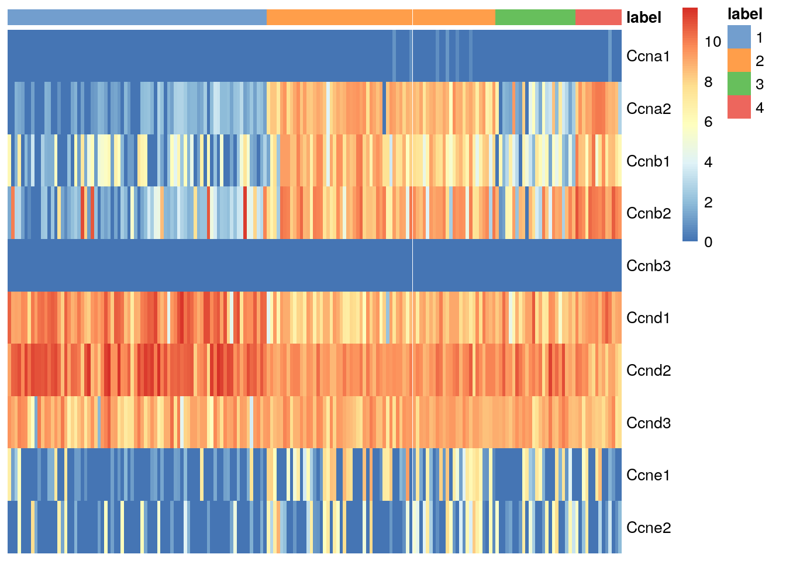
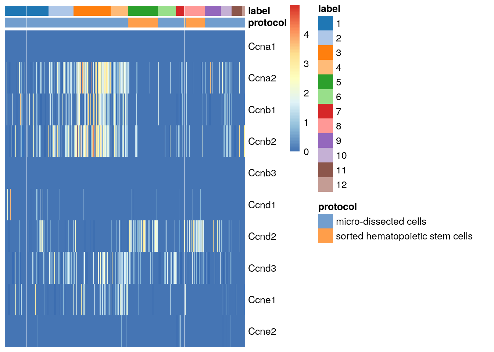
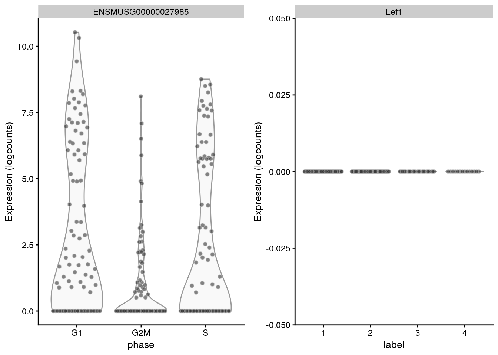
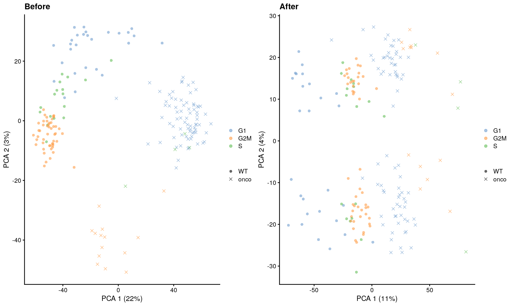
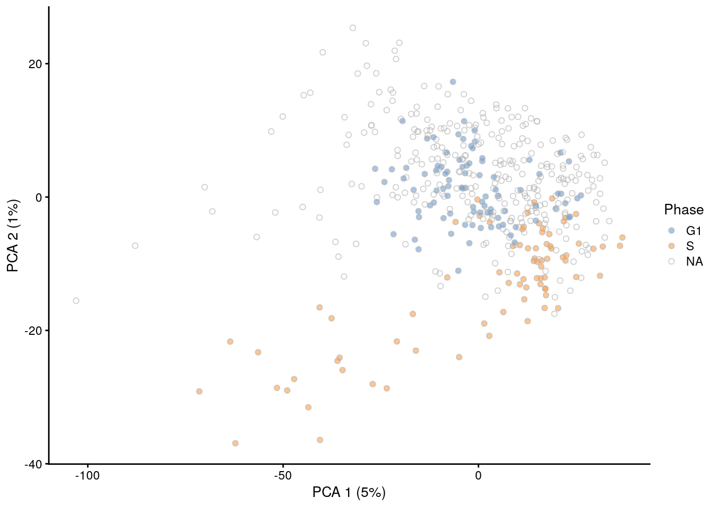
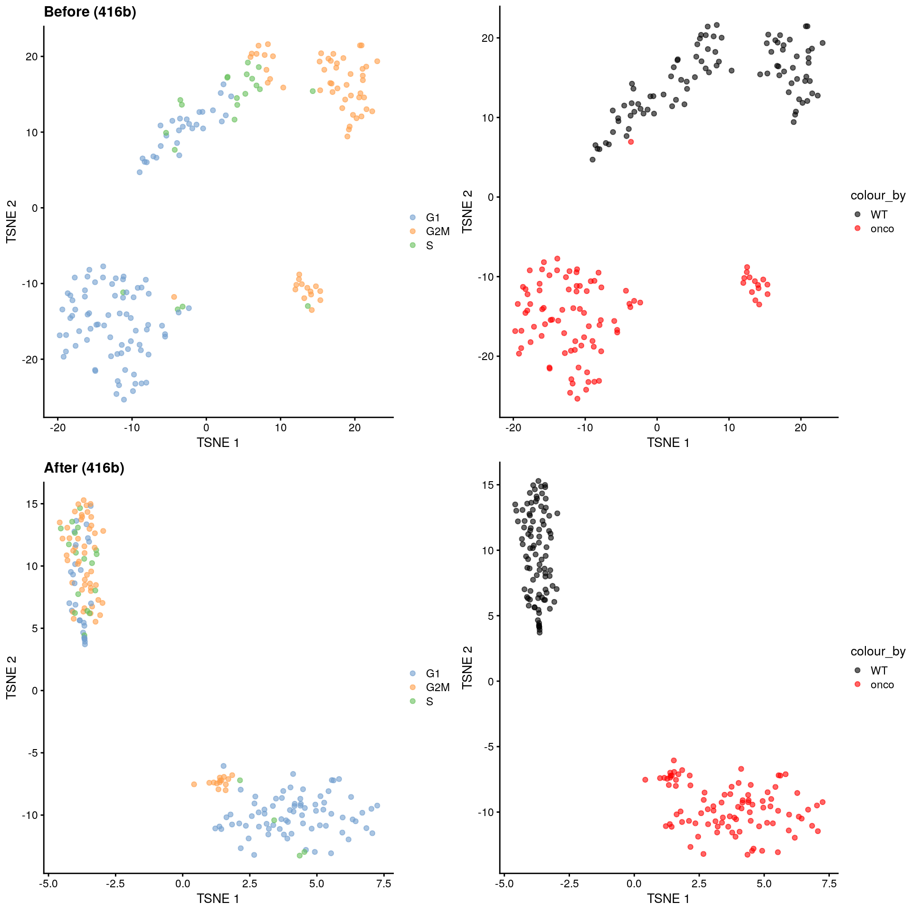

# Cell cycle assignment

<script>
document.addEventListener("click", function (event) {
    if (event.target.classList.contains("rebook-collapse")) {
        event.target.classList.toggle("active");
        var content = event.target.nextElementSibling;
        if (content.style.display === "block") {
            content.style.display = "none";
        } else {
            content.style.display = "block";
        }
    }
})
</script>

<style>
.rebook-collapse {
  background-color: #eee;
  color: #444;
  cursor: pointer;
  padding: 18px;
  width: 100%;
  border: none;
  text-align: left;
  outline: none;
  font-size: 15px;
}

.rebook-content {
  padding: 0 18px;
  display: none;
  overflow: hidden;
  background-color: #f1f1f1;
}
</style>

## Motivation

On occasion, it can be desirable to determine cell cycle activity from scRNA-seq data.
In and of itself, the distribution of cells across phases of the cell cycle is not usually informative, but we can use this to determine if there are differences in proliferation between subpopulations or across treatment conditions.
Many of the key events in the cell cycle (e.g., passage through checkpoints) are driven by post-translational mechanisms and thus not directly visible in transcriptomic data; nonetheless, there are enough changes in expression that can be exploited to determine cell cycle phase.
We demonstrate using the 416B dataset, which is known to contain actively cycling cells after oncogene induction.

<button class="rebook-collapse">View history</button>
<div class="rebook-content">
   
```r
#--- loading ---#
library(scRNAseq)
sce.416b <- LunSpikeInData(which="416b") 
sce.416b$block <- factor(sce.416b$block)

#--- gene-annotation ---#
library(AnnotationHub)
ens.mm.v97 <- AnnotationHub()[["AH73905"]]
rowData(sce.416b)$ENSEMBL <- rownames(sce.416b)
rowData(sce.416b)$SYMBOL <- mapIds(ens.mm.v97, keys=rownames(sce.416b),
    keytype="GENEID", column="SYMBOL")
rowData(sce.416b)$SEQNAME <- mapIds(ens.mm.v97, keys=rownames(sce.416b),
    keytype="GENEID", column="SEQNAME")

library(scater)
rownames(sce.416b) <- uniquifyFeatureNames(rowData(sce.416b)$ENSEMBL, 
    rowData(sce.416b)$SYMBOL)

#--- quality-control ---#
mito <- which(rowData(sce.416b)$SEQNAME=="MT")
stats <- perCellQCMetrics(sce.416b, subsets=list(Mt=mito))
qc <- quickPerCellQC(stats, percent_subsets=c("subsets_Mt_percent",
    "altexps_ERCC_percent"), batch=sce.416b$block)
sce.416b <- sce.416b[,!qc$discard]

#--- normalization ---#
library(scran)
sce.416b <- computeSumFactors(sce.416b)
sce.416b <- logNormCounts(sce.416b)

#--- variance-modelling ---#
dec.416b <- modelGeneVarWithSpikes(sce.416b, "ERCC", block=sce.416b$block)
chosen.hvgs <- getTopHVGs(dec.416b, prop=0.1)

#--- batch-correction ---#
library(limma)
assay(sce.416b, "corrected") <- removeBatchEffect(logcounts(sce.416b), 
    design=model.matrix(~sce.416b$phenotype), batch=sce.416b$block)

#--- dimensionality-reduction ---#
sce.416b <- runPCA(sce.416b, ncomponents=10, subset_row=chosen.hvgs,
    exprs_values="corrected", BSPARAM=BiocSingular::ExactParam())

set.seed(1010)
sce.416b <- runTSNE(sce.416b, dimred="PCA", perplexity=10)

#--- clustering ---#
my.dist <- dist(reducedDim(sce.416b, "PCA"))
my.tree <- hclust(my.dist, method="ward.D2")

library(dynamicTreeCut)
my.clusters <- unname(cutreeDynamic(my.tree, distM=as.matrix(my.dist),
    minClusterSize=10, verbose=0))
colLabels(sce.416b) <- factor(my.clusters)
```

</div>


```r
sce.416b
```

```
## class: SingleCellExperiment 
## dim: 46604 185 
## metadata(0):
## assays(3): counts logcounts corrected
## rownames(46604): 4933401J01Rik Gm26206 ... CAAA01147332.1
##   CBFB-MYH11-mcherry
## rowData names(4): Length ENSEMBL SYMBOL SEQNAME
## colnames(185): SLX-9555.N701_S502.C89V9ANXX.s_1.r_1
##   SLX-9555.N701_S503.C89V9ANXX.s_1.r_1 ...
##   SLX-11312.N712_S507.H5H5YBBXX.s_8.r_1
##   SLX-11312.N712_S517.H5H5YBBXX.s_8.r_1
## colData names(11): Source Name cell line ... sizeFactor label
## reducedDimNames(2): PCA TSNE
## altExpNames(2): ERCC SIRV
```

## Using the cyclins

The cyclins control progression through the cell cycle and have well-characterized patterns of expression across cell cycle phases.
Cyclin D is expressed throughout but peaks at G1; cyclin E is expressed highest in the G1/S transition; cyclin A is expressed across S and G2; and cyclin B is expressed highest in late G2 and mitosis [@morgan2007cell].
The expression of cyclins can help to determine the relative cell cycle activity in each cluster (Figure \@ref(fig:heat-cyclin)).
For example, most cells in cluster 1 are likely to be in G1 while the other clusters are scattered across the later phases.


```r
library(scater)
cyclin.genes <- grep("^Ccn[abde][0-9]$", rowData(sce.416b)$SYMBOL)
cyclin.genes <- rownames(sce.416b)[cyclin.genes]
cyclin.genes
```

```
##  [1] "Ccnb3" "Ccna2" "Ccna1" "Ccne2" "Ccnd2" "Ccne1" "Ccnd1" "Ccnb2" "Ccnb1"
## [10] "Ccnd3"
```

```r
plotHeatmap(sce.416b, order_columns_by="label", 
    cluster_rows=FALSE, features=sort(cyclin.genes))
```

<div class="figure">

<p class="caption">(\#fig:heat-cyclin)Heatmap of the log-normalized expression values of the cyclin genes in the 416B dataset. Each column represents a cell that is sorted by the cluster of origin.</p>
</div>


We quantify these observations with standard DE methods (Chapter \@ref(marker-detection)) to test for upregulation of each cyclin between clusters, which would imply that a subpopulation contains more cells in the corresponding cell cycle phase.
The same logic applies to comparisons between treatment conditions as described in Chapter \@ref(multi-sample-comparisons).
For example, we can infer that cluster 4 has the highest proportion of cells in the S and G2 phases based on higher expression of cyclins A2 and B1, respectively.


```r
library(scran)
markers <- findMarkers(sce.416b, subset.row=cyclin.genes, 
    test.type="wilcox", direction="up")
markers[[4]]
```

```
## DataFrame with 10 rows and 7 columns
##             Top     p.value         FDR summary.AUC     AUC.1     AUC.2
##       <integer>   <numeric>   <numeric>   <numeric> <numeric> <numeric>
## Ccna2         1 4.47082e-09 4.47082e-08    0.996337  0.996337  0.641822
## Ccnd1         1 2.27713e-04 5.69283e-04    0.822981  0.368132  0.822981
## Ccnb1         1 1.19027e-07 5.95137e-07    0.949634  0.949634  0.519669
## Ccnb2         2 3.87799e-07 1.29266e-06    0.934066  0.934066  0.781573
## Ccna1         4 2.96992e-02 5.93985e-02    0.535714  0.535714  0.495342
## Ccne2         5 6.56983e-02 1.09497e-01    0.641941  0.641941  0.447205
## Ccne1         6 5.85979e-01 8.37113e-01    0.564103  0.564103  0.366460
## Ccnd3         7 9.94578e-01 1.00000e+00    0.402930  0.402930  0.283644
## Ccnd2         8 9.99993e-01 1.00000e+00    0.306548  0.134615  0.327122
## Ccnb3        10 1.00000e+00 1.00000e+00    0.500000  0.500000  0.500000
##           AUC.3
##       <numeric>
## Ccna2  0.925595
## Ccnd1  0.776786
## Ccnb1  0.934524
## Ccnb2  0.898810
## Ccna1  0.535714
## Ccne2  0.455357
## Ccne1  0.473214
## Ccnd3  0.273810
## Ccnd2  0.306548
## Ccnb3  0.500000
```


While straightforward to implement and interpret,
this approach assumes that cyclin expression is unaffected by biological processes other than the cell cycle.
This is a strong assumption in highly heterogeneous populations where cyclins may perform cell-type-specific roles.
For example, using the Grun HSC dataset [@grun2016denovo], we see an upregulation of cyclin D2 in sorted HSCs (Figure \@ref(fig:heat-cyclin-grun)) that is consistent with a particular reliance on D-type cyclins in these cells [@steinman2002cell;@kozar2004mouse].
Similar arguments apply to other genes with annotated functions in cell cycle, e.g., from relevant Gene Ontology terms.

<button class="rebook-collapse">View history</button>
<div class="rebook-content">
   
```r
#--- data-loading ---#
library(scRNAseq)
sce.grun.hsc <- GrunHSCData(ensembl=TRUE)

#--- gene-annotation ---#
library(AnnotationHub)
ens.mm.v97 <- AnnotationHub()[["AH73905"]]
anno <- select(ens.mm.v97, keys=rownames(sce.grun.hsc), 
    keytype="GENEID", columns=c("SYMBOL", "SEQNAME"))
rowData(sce.grun.hsc) <- anno[match(rownames(sce.grun.hsc), anno$GENEID),]

#--- quality-control ---#
library(scuttle)
stats <- perCellQCMetrics(sce.grun.hsc)
qc <- quickPerCellQC(stats, batch=sce.grun.hsc$protocol,
    subset=grepl("sorted", sce.grun.hsc$protocol))
sce.grun.hsc <- sce.grun.hsc[,!qc$discard]

#--- normalization ---#
library(scran)
set.seed(101000110)
clusters <- quickCluster(sce.grun.hsc)
sce.grun.hsc <- computeSumFactors(sce.grun.hsc, clusters=clusters)
sce.grun.hsc <- logNormCounts(sce.grun.hsc)

#--- variance-modelling ---#
set.seed(00010101)
dec.grun.hsc <- modelGeneVarByPoisson(sce.grun.hsc) 
top.grun.hsc <- getTopHVGs(dec.grun.hsc, prop=0.1)

#--- dimensionality-reduction ---#
set.seed(101010011)
sce.grun.hsc <- denoisePCA(sce.grun.hsc, technical=dec.grun.hsc, subset.row=top.grun.hsc)
sce.grun.hsc <- runTSNE(sce.grun.hsc, dimred="PCA")

#--- clustering ---#
snn.gr <- buildSNNGraph(sce.grun.hsc, use.dimred="PCA")
colLabels(sce.grun.hsc) <- factor(igraph::cluster_walktrap(snn.gr)$membership)
```

</div>


```r
# Switching the row names for a nicer plot.
rownames(sce.grun.hsc) <- uniquifyFeatureNames(rownames(sce.grun.hsc),
    rowData(sce.grun.hsc)$SYMBOL)

cyclin.genes <- grep("^Ccn[abde][0-9]$", rowData(sce.grun.hsc)$SYMBOL)
cyclin.genes <- rownames(sce.grun.hsc)[cyclin.genes]

plotHeatmap(sce.grun.hsc, order_columns_by="label",
    cluster_rows=FALSE, features=sort(cyclin.genes),
    colour_columns_by="protocol")
```

<div class="figure">

<p class="caption">(\#fig:heat-cyclin-grun)Heatmap of the log-normalized expression values of the cyclin genes in the Grun HSC dataset. Each column represents a cell that is sorted by the cluster of origin and extraction protocol.</p>
</div>


Admittedly, this is merely a symptom of a more fundamental issue -
that the cell cycle is not independent of the other processes that are occurring in a cell.
This will be a recurring theme throughout the chapter, which suggests that cell cycle inferences are best used in comparisons between closely related cell types where there are fewer changes elsewhere that might interfere with interpretation.

## Using reference profiles

Cell cycle assignment can be considered a specialized case of cell annotation, which suggests that the strategies described in Chapter \@ref(cell-type-annotation) can also be applied here.
Given a reference dataset containing cells of known cell cycle phase, we could use methods like *[SingleR](https://bioconductor.org/packages/3.12/SingleR)* to determine the phase of each cell in a test dataset.
We demonstrate on a reference of mouse ESCs from @buettner2015computational that were sorted by cell cycle phase prior to scRNA-seq.


```r
library(scRNAseq)
sce.ref <- BuettnerESCData()
sce.ref <- logNormCounts(sce.ref)
sce.ref
```

```
## class: SingleCellExperiment 
## dim: 38293 288 
## metadata(0):
## assays(2): counts logcounts
## rownames(38293): ENSMUSG00000000001 ENSMUSG00000000003 ...
##   ENSMUSG00000097934 ENSMUSG00000097935
## rowData names(3): EnsemblTranscriptID AssociatedGeneName GeneLength
## colnames(288): G1_cell1_count G1_cell2_count ... G2M_cell95_count
##   G2M_cell96_count
## colData names(2): phase sizeFactor
## reducedDimNames(0):
## altExpNames(1): ERCC
```

We will restrict the annotation process to a subset of genes with _a priori_ known roles in cell cycle.
This aims to avoid detecting markers for other biological processes that happen to be correlated with the cell cycle in the reference dataset, which would reduce classification performance if those processes are absent or uncorrelated in the test dataset.


```r
# Find genes that are cell cycle-related.
library(org.Mm.eg.db)
cycle.anno <- select(org.Mm.eg.db, keytype="GOALL", keys="GO:0007049", 
    columns="ENSEMBL")[,"ENSEMBL"]
str(cycle.anno)
```

```
##  chr [1:2726] "ENSMUSG00000026842" "ENSMUSG00000026842" ...
```

We use the `SingleR()` function to assign labels to the 416B data based on the cell cycle phases in the ESC reference.
Cluster 1 mostly consists of G1 cells while the other clusters have more cells in the other phases, which is broadly consistent with our conclusions from the cyclin-based analysis.
Unlike the cyclin-based analysis, this approach yields "absolute" assignments of cell cycle phase that do not need to be interpreted relative to other cells in the same dataset.


```r
# Switching row names back to Ensembl to match the reference.
test.data <- logcounts(sce.416b)
rownames(test.data) <- rowData(sce.416b)$ENSEMBL

library(SingleR)
assignments <- SingleR(test.data, ref=sce.ref, label=sce.ref$phase, 
    de.method="wilcox", restrict=cycle.anno)

tab <- table(assignments$labels, colLabels(sce.416b))
tab
```

```
##      
##        1  2  3  4
##   G1  71  7 19  1
##   G2M  2 60  1 13
##   S    5  2  4  0
```


The key assumption here is that, again, the cell cycle is orthogonal to cell type and other aspects of cell behavior.
This justifies the use of a reference involving cell types that are quite different from the cells in the test dataset, provided that the cell cycle transcriptional program is conserved across datasets [@bertoli2013control;@conboy2007cell].
However, it is not difficult to find routine violations of this assumption - for example, _Lef1_ is detected as one of the top markers to distinguish between G1 from G2/M in the reference but has no detectable expression in the 416B dataset (Figure \@ref(fig:dist-lef1)).


```r
gridExtra::grid.arrange(
    plotExpression(sce.ref, features="ENSMUSG00000027985", x="phase"),
    plotExpression(sce.416b, features="Lef1", x="label"),
    ncol=2)
```

<div class="figure">

<p class="caption">(\#fig:dist-lef1)Distribution of log-normalized expression values for _Lef1_ in the reference dataset (left) and in the 416B dataset (right).</p>
</div>


Thus, a healthy dose of skepticism is required when interpreting these assignments.
Our hope is that any systematic assignment error is consistent across clusters and conditions such that they cancel out in comparisons of phase frequencies, which is the more interesting analysis anyway. 
Indeed, while the availability of absolute phase calls may be more appealing, it may not make much practical difference to the conclusions if the frequencies are ultimately interpreted in a relative sense (e.g., using a chi-squared test). 


```r
# Test for differences in phase distributions between clusters 1 and 2.
chisq.test(tab[,1:2])
```

```
## 
## 	Pearson's Chi-squared test
## 
## data:  tab[, 1:2]
## X-squared = 108, df = 2, p-value <2e-16
```

## Using the `cyclone()` classifier

The method described by @scialdone2015computational is yet another approach for classifying cells into cell cycle phases.
Using a reference dataset, we first compute the sign of the difference in expression between each pair of genes.
Pairs with changes in the sign across cell cycle phases are chosen as markers.
Cells in a test dataset can then be classified into the appropriate phase, based on whether the observed sign for each marker pair is consistent with one phase or another.
This approach is implemented in the `cyclone()` function from the *[scran](https://bioconductor.org/packages/3.12/scran)* package, which also contains pre-trained set of marker pairs for mouse and human data.


```r
set.seed(100)
library(scran)
mm.pairs <- readRDS(system.file("exdata", "mouse_cycle_markers.rds", 
    package="scran"))

# Using Ensembl IDs to match up with the annotation in 'mm.pairs'.
assignments <- cyclone(sce.416b, mm.pairs, gene.names=rowData(sce.416b)$ENSEMBL)
```

The phase assignment result for each cell in the 416B dataset is shown in Figure \@ref(fig:phaseplot416b).
For each cell, a higher score for a phase corresponds to a higher probability that the cell is in that phase.
We focus on the G1 and G2/M scores as these are the most informative for classification.


```r
plot(assignments$score$G1, assignments$score$G2M,
    xlab="G1 score", ylab="G2/M score", pch=16)
```

<div class="figure">

<p class="caption">(\#fig:phaseplot416b)Cell cycle phase scores from applying the pair-based classifier on the 416B dataset. Each point represents a cell, plotted according to its scores for G1 and G2/M phases.</p>
</div>

Cells are classified as being in G1 phase if the G1 score is above 0.5 and greater than the G2/M score;
    in G2/M phase if the G2/M score is above 0.5 and greater than the G1 score;
    and in S phase if neither score is above 0.5.
We see that the results are quite similar to those from `SingleR()`, which is reassuring.


```r
table(assignments$phases, colLabels(sce.416b))
```

```
##      
##        1  2  3  4
##   G1  74  8 20  0
##   G2M  1 48  0 13
##   S    3 13  4  1
```


The same considerations and caveats described for the *[SingleR](https://bioconductor.org/packages/3.12/SingleR)*-based approach are also applicable here.
From a practical perspective, `cyclone()` takes much longer but does not require an explicit reference as the marker pairs are already computed.

## Removing cell cycle effects 

### Comments

For some time, it was popular to regress out the cell cycle phase prior to downstream analyses like clustering.
The aim was to remove uninteresting variation due to cell cycle, thus improving resolution of other biological processes. 
With the benefit of hindsight, we do not consider cell cycle adjustment to be necessary for routine applications.
In most scenarios, the cell cycle is a minor factor of variation, secondary to stronger factors like cell type identity.
Moreover, most strategies for removal assume that the cell cycle effect is orthogonal to other biological processes, and violations of this assumption will remove interesting signal if cell cycle activity varies across clusters or conditions.
This is not uncommon with, e.g., increased proliferation of T cells upon activation [@richard2018tcell], changes in cell cycle phase progression across developmental stages [@roccio2013predicting] and correlations between cell cycle and cell fate decisions [@soufi2016cycling].
Nonetheless, we will discuss some approaches for mitigating the cell cycle effect in this section.

### With linear regression and friends

Here, we treat each phase as a separate batch and apply any of the batch correction strategies described in Chapter \@ref(data-integration).
The most common approach is to use a linear model to simply regress out any effect associated with the assigned phases, as shown below in Figure \@ref(fig:cell-cycle-regression) via `regressBatches()`.
Similarly, any functions that support blocking can use the phase assignments as a blocking factor, e.g., `block=` in `modelGeneVarWithSpikes()`.
The obvious downside is that any correlated processes will also be removed; in the absence of orthogonality, regression is also capable of introducing spurious signal that interferes with any interpretation of subtle variation.


```r
library(batchelor)
dec.nocycle <- modelGeneVarWithSpikes(sce.416b, "ERCC", block=assignments$phases)
sce.nocycle <- regressBatches(sce.416b, batch=assignments$phases)
sce.nocycle <- runPCA(sce.nocycle, exprs_values="corrected",
    subset_row=getTopHVGs(dec.nocycle, prop=0.1))

# Shape points by induction status.
relabel <- c("onco", "WT")[factor(sce.416b$phenotype)]
scaled <- scale_shape_manual(values=c(onco=4, WT=16))

gridExtra::grid.arrange(
    plotPCA(sce.416b, colour_by=I(assignments$phases), shape_by=I(relabel)) + 
        ggtitle("Before") + scaled,
    plotPCA(sce.nocycle, colour_by=I(assignments$phases), shape_by=I(relabel)) + 
        ggtitle("After") + scaled,
    ncol=2
)
```

<div class="figure">

<p class="caption">(\#fig:cell-cycle-regression)PCA plots before and after regression of the cell cycle effect in the 416B dataset. Each point is a cell and is colored by its inferred phase.</p>
</div>

If this type of adjustment is truly necessary, it would be safest to apply it separately to the subset of cells in each cluster.
This avoids the worst violations of the orthogonality assumption caused by cluster-specific differences in the magnitude of cell cycle effects and the distribution of cells in each phase. 
Similarly, gene-based analyses should use the uncorrected data with blocking where possible (Section \@ref(using-corrected-values)), which provides a sanity check that protects against distortions introduced by the adjustment.

### Removing cell cycle-related genes

A gentler alternative to regression is to remove the genes that are associated with cell cycle.
This can be done using either the known cell cycle phase in controlled experiments, inferred phase assignments from methods like `cyclone()`, or even cluster identities based on the presence of known cell cycle genes in the marker lists.
Here, we identify the marker genes that separate the groups of cells corresponding to different phases of the cell cycle, and we remove those genes from dataset prior to further downstream analyses.
We demonstrate below with the @leng2015oscope dataset containing phase-sorted ESCs, where removal of marker genes detected between phases eliminates the separation between G1 and S populations (Figure \@ref(fig:leng-nocycle)).


```r
library(scRNAseq)
sce.leng <- LengESCData(ensembl=TRUE)
sce.leng <- logNormCounts(sce.leng, assay.type="normcounts")
dec.leng <- modelGeneVar(sce.leng)
top.hvgs <- getTopHVGs(dec.leng, n=1000)
sce.leng <- runPCA(sce.leng, subset_row=top.hvgs)

# Identifying the cell cycle genes between phases.
diff <- findMarkers(sce.leng, sce.leng$Phase, direction="up",
    row.data=rowData(sce.leng)[,"originalName",drop=FALSE])
# TODO: make this easier in getTopMarkers().
top.cycle.markers <- unlist(lapply(diff, function(x) rownames(x)[x$FDR <= 0.05]))

top.hvgs2 <- getTopHVGs(dec.leng[!rownames(dec.leng) %in% top.cycle.markers,], n=1000)
sce.nocycle <- runPCA(sce.leng, subset_row=top.hvgs2)

fill <- geom_point(pch=21, colour="grey") # Color the NA points.
gridExtra::grid.arrange(
    plotPCA(sce.leng, colour_by="Phase") + ggtitle("Before") + fill,
    plotPCA(sce.nocycle, colour_by="Phase") + ggtitle("After") + fill,
    ncol=2
)
```

<div class="figure">

<p class="caption">(\#fig:leng-nocycle)PCA plots of the Leng ESC dataset, generated before and after removal of cell cycle-related genes. Each point corresponds to a cell that is colored by the sorted cell cycle phase.</p>
</div>

The assumptions of this approach are largely the same as those of regression so any violations will continue to cause problems.
However, it is more amenable to fine-tuning: any lost heterogeneity can be easily identified by examining the discarded genes, and users can choose to recover interesting genes even if they are correlated with known/inferred cell cycle phase.
Direct removal of genes is also less likely to introduce spurious signal than regression when orthogonality does not hold.

### Using contrastive PCA

Alternatively, we might consider a more sophisticated approach called contrastive PCA [@abid2018exploring].
This aims to identify patterns that are enriched in our test dataset - in this case, the 416B data - compared to a control dataset in which cell cycle is the dominant factor of variation.
We demonstrate below using the *[scPCA](https://bioconductor.org/packages/3.12/scPCA)* package [@boileau2020exploring] where we use the subset of wild-type 416B cells as our control based on the expectation that an untreated cell line in culture has little else to do but divide.
This yields low-dimensional coordinates in which the cell cycle effect within the oncogene-induced and wild-type groups is reduced without removing the difference between groups (Figure \@ref(fig:cell-cycle-contrastive)).


```r
top.hvgs <- getTopHVGs(dec.416b, p=0.1)
wild <- sce.416b$phenotype=="wild type phenotype"

set.seed(100)
# NOTE: my god, this takes a long time. Need to fix.  
library(scPCA)
con.out <- scPCA(
    target=t(logcounts(sce.416b)[top.hvgs,]),
    background=t(logcounts(sce.416b)[top.hvgs,wild]),
    alg="rand_var_proj", penalties=1e-8, n_centers=5, n_eigen=10)
```

```
##  num [1:1067, 1:10] 0.0516 0.0604 -0.0714 0.0687 -0.0573 ...
## NULL
##  num [1:1067, 1:10] 0.0517 0.0606 -0.0712 0.069 -0.0572 ...
## NULL
##  num [1:1067, 1:10] 0.0518 0.0609 -0.0709 0.0695 -0.0571 ...
## NULL
##  num [1:1067, 1:10] 0.052 0.0612 -0.0706 0.07 -0.0569 ...
## NULL
##  num [1:1067, 1:10] 0.0521 0.0616 -0.0702 0.0707 -0.0567 ...
## NULL
##  num [1:1067, 1:10] 0.0524 0.0622 -0.0696 0.0715 -0.0564 ...
## NULL
##  num [1:1067, 1:10] 0.0526 0.0629 -0.0689 0.0726 -0.056 ...
## NULL
##  num [1:1067, 1:10] 0.053 0.0637 -0.0679 0.074 -0.0554 ...
## NULL
##  num [1:1067, 1:10] 0.0534 0.0648 -0.0667 0.0758 -0.0548 ...
## NULL
##  num [1:1067, 1:10] 0.0539 0.0662 -0.0651 0.078 -0.0539 ...
## NULL
##  num [1:1067, 1:10] 0.0545 0.0678 -0.0631 0.0807 -0.0527 ...
## NULL
##  num [1:1067, 1:10] 0.0551 0.0698 -0.0604 0.084 -0.0511 ...
## NULL
##  num [1:1067, 1:10] 0.0557 0.0721 -0.0571 0.088 -0.0491 ...
## NULL
##  num [1:1067, 1:10] 0.0562 0.0746 -0.0529 0.0926 -0.0466 ...
## NULL
##  num [1:1067, 1:10] 0.0564 0.0772 -0.0478 0.0976 -0.0435 ...
## NULL
##  num [1:1067, 1:10] 0.0562 0.0795 -0.0422 0.1027 -0.04 ...
## NULL
##  num [1:1067, 1:10] 0.0554 0.0813 -0.0363 0.1073 -0.0363 ...
## NULL
##  num [1:1067, 1:10] 0.0539 0.0823 -0.0306 0.1113 -0.0328 ...
## NULL
##  num [1:1067, 1:10] 0.0519 0.0824 -0.0255 0.1144 -0.0297 ...
## NULL
##  num [1:1067, 1:10] 0.0495 0.0819 -0.0212 0.1167 -0.0272 ...
## NULL
##  num [1:1067, 1:10] 0.0468 0.0807 -0.0177 0.1183 -0.0253 ...
## NULL
##  num [1:1067, 1:10] 0.044 0.0792 -0.0149 0.1193 -0.024 ...
## NULL
##  num [1:1067, 1:10] 0.0413 0.0774 -0.0127 0.1199 -0.0231 ...
## NULL
##  num [1:1067, 1:10] 0.0387 0.0756 -0.0109 0.1202 -0.0226 ...
## NULL
##  num [1:1067, 1:10] 0.0362 0.07371 -0.00949 0.12037 -0.02235 ...
## NULL
##  num [1:1067, 1:10] 0.03397 0.07195 -0.00837 0.12041 -0.02222 ...
## NULL
##  num [1:1067, 1:10] 0.03199 0.07033 -0.00747 0.12036 -0.02219 ...
## NULL
##  num [1:1067, 1:10] -0.03028 -0.06888 0.00676 -0.12029 0.02221 ...
## NULL
##  num [1:1067, 1:10] 0.02881 0.0676 -0.00618 0.12019 -0.02226 ...
## NULL
##  num [1:1067, 1:10] 0.02756 0.0665 -0.00572 0.12009 -0.02232 ...
## NULL
##  num [1:1067, 1:10] 0.02653 0.06557 -0.00534 0.12 -0.02238 ...
## NULL
##  num [1:1067, 1:10] 0.02568 0.06479 -0.00504 0.11991 -0.02243 ...
## NULL
##  num [1:1067, 1:10] 0.025 0.0641 -0.0048 0.1198 -0.0225 ...
## NULL
##  num [1:1067, 1:10] 0.02441 0.06361 -0.00461 0.11977 -0.02252 ...
## NULL
##  num [1:1067, 1:10] 0.02395 0.06318 -0.00445 0.11972 -0.02256 ...
## NULL
##  num [1:1067, 1:10] 0.02358 0.06283 -0.00433 0.11967 -0.02258 ...
## NULL
##  num [1:1067, 1:10] 0.02329 0.06255 -0.00423 0.11964 -0.02261 ...
## NULL
##  num [1:1067, 1:10] 0.02305 0.06233 -0.00415 0.11961 -0.02262 ...
## NULL
##  num [1:1067, 1:10] 0.02286 0.06215 -0.00409 0.11958 -0.02264 ...
## NULL
##  num [1:1067, 1:10] 0.02271 0.062 -0.00404 0.11956 -0.02265 ...
## NULL
```

```r
# Visualizing the results in a t-SNE.
sce.con <- sce.416b
reducedDim(sce.con, "cPCA") <- con.out$x
sce.con <- runTSNE(sce.con, dimred="cPCA")

# Making the labels easier to read.
relabel <- c("onco", "WT")[factor(sce.416b$phenotype)]
scaled <- scale_color_manual(values=c(onco="red", WT="black"))

gridExtra::grid.arrange(
    plotTSNE(sce.416b, colour_by=I(assignments$phases)) + ggtitle("Before (416b)"),
    plotTSNE(sce.416b, colour_by=I(relabel)) + scaled,
    plotTSNE(sce.con, colour_by=I(assignments$phases)) + ggtitle("After (416b)"),
    plotTSNE(sce.con, colour_by=I(relabel)) + scaled, 
    ncol=2
)
```

<div class="figure">

<p class="caption">(\#fig:cell-cycle-contrastive)$t$-SNE plots for the 416B dataset before and after contrastive PCA. Each point is a cell and is colored according to its inferred cell cycle phase (left) or oncogene induction status (right).</p>
</div>


The strength of this approach lies in its ability to accurately remove the cell cycle effect based on its magnitude in the control dataset.
This avoids loss of heterogeneity associated with other processes that happen to be correlated with the cell cycle.
The requirements for the control dataset are also quite loose - there is no need to know the cell cycle phase of each cell _a priori_, and indeed, we can manufacture a like-for-like control by subsetting our dataset to a homogeneous cluster in which the only detectable factor of variation is the cell cycle.
In fact, any consistent but uninteresting variation can be eliminated in this manner as long as it is captured by the control.

The downside is that the magnitude of variation in the control dataset must accurately reflect that in the test dataset, requiring more care in choosing the former.
As a result, the procedure is more sensitive to quantitative differences between datasets compared to `SingleR()` or `cyclone()` during cell cycle phase assignment.
This makes it difficult to use control datasets from different scRNA-seq technologies or biological systems, as a mismatch in the covariance structure may lead to insufficient or excessive correction.
At worst, any interesting variation that is inadvertently contained in the control will also be removed.

## Session Info {-}

<button class="rebook-collapse">View session info</button>
<div class="rebook-content">
```
R version 4.0.0 Patched (2020-05-01 r78341)
Platform: x86_64-pc-linux-gnu (64-bit)
Running under: Ubuntu 18.04.5 LTS

Matrix products: default
BLAS:   /home/luna/Software/R/R-4-0-branch-dev/lib/libRblas.so
LAPACK: /home/luna/Software/R/R-4-0-branch-dev/lib/libRlapack.so

locale:
 [1] LC_CTYPE=en_US.UTF-8       LC_NUMERIC=C              
 [3] LC_TIME=en_US.UTF-8        LC_COLLATE=en_US.UTF-8    
 [5] LC_MONETARY=en_US.UTF-8    LC_MESSAGES=en_US.UTF-8   
 [7] LC_PAPER=en_US.UTF-8       LC_NAME=C                 
 [9] LC_ADDRESS=C               LC_TELEPHONE=C            
[11] LC_MEASUREMENT=en_US.UTF-8 LC_IDENTIFICATION=C       

attached base packages:
[1] parallel  stats4    stats     graphics  grDevices utils     datasets 
[8] methods   base     

other attached packages:
 [1] scPCA_1.3.4                 batchelor_1.5.2            
 [3] bluster_0.99.1              SingleR_1.3.7              
 [5] org.Mm.eg.db_3.11.4         ensembldb_2.13.1           
 [7] AnnotationFilter_1.13.0     GenomicFeatures_1.41.2     
 [9] AnnotationDbi_1.51.3        scRNAseq_2.3.12            
[11] scran_1.17.15               scater_1.17.4              
[13] ggplot2_3.3.2               SingleCellExperiment_1.11.6
[15] SummarizedExperiment_1.19.6 DelayedArray_0.15.7        
[17] matrixStats_0.56.0          Matrix_1.2-18              
[19] Biobase_2.49.0              GenomicRanges_1.41.6       
[21] GenomeInfoDb_1.25.10        IRanges_2.23.10            
[23] S4Vectors_0.27.12           BiocGenerics_0.35.4        
[25] BiocStyle_2.17.0            rebook_0.99.4              

loaded via a namespace (and not attached):
  [1] AnnotationHub_2.21.2          BiocFileCache_1.13.1         
  [3] igraph_1.2.5                  lazyeval_0.2.2               
  [5] listenv_0.8.0                 BiocParallel_1.23.2          
  [7] digest_0.6.25                 htmltools_0.5.0              
  [9] viridis_0.5.1                 magrittr_1.5                 
 [11] memoise_1.1.0                 cluster_2.1.0                
 [13] limma_3.45.10                 globals_0.12.5               
 [15] Biostrings_2.57.2             askpass_1.1                  
 [17] prettyunits_1.1.1             colorspace_1.4-1             
 [19] blob_1.2.1                    rappdirs_0.3.1               
 [21] xfun_0.16                     dplyr_1.0.1                  
 [23] callr_3.4.3                   crayon_1.3.4                 
 [25] RCurl_1.98-1.2                graph_1.67.1                 
 [27] glue_1.4.1                    gtable_0.3.0                 
 [29] zlibbioc_1.35.0               XVector_0.29.3               
 [31] coop_0.6-2                    kernlab_0.9-29               
 [33] BiocSingular_1.5.0            future.apply_1.6.0           
 [35] abind_1.4-5                   scales_1.1.1                 
 [37] pheatmap_1.0.12               DBI_1.1.0                    
 [39] edgeR_3.31.4                  bibtex_0.4.2.2               
 [41] Rcpp_1.0.5                    viridisLite_0.3.0            
 [43] xtable_1.8-4                  progress_1.2.2               
 [45] dqrng_0.2.1                   bit_4.0.4                    
 [47] rsvd_1.0.3                    httr_1.4.2                   
 [49] RColorBrewer_1.1-2            ellipsis_0.3.1               
 [51] pkgconfig_2.0.3               XML_3.99-0.5                 
 [53] farver_2.0.3                  scuttle_0.99.13              
 [55] CodeDepends_0.6.5             dbplyr_1.4.4                 
 [57] locfit_1.5-9.4                tidyselect_1.1.0             
 [59] labeling_0.3                  rlang_0.4.7                  
 [61] later_1.1.0.1                 munsell_0.5.0                
 [63] BiocVersion_3.12.0            tools_4.0.0                  
 [65] generics_0.0.2                RSQLite_2.2.0                
 [67] ExperimentHub_1.15.1          evaluate_0.14                
 [69] stringr_1.4.0                 fastmap_1.0.1                
 [71] yaml_2.2.1                    processx_3.4.3               
 [73] knitr_1.29                    bit64_4.0.2                  
 [75] purrr_0.3.4                   future_1.18.0                
 [77] mime_0.9                      origami_1.0.3                
 [79] biomaRt_2.45.2                compiler_4.0.0               
 [81] beeswarm_0.2.3                curl_4.3                     
 [83] interactiveDisplayBase_1.27.5 tibble_3.0.3                 
 [85] statmod_1.4.34                stringi_1.4.6                
 [87] highr_0.8                     ps_1.3.4                     
 [89] RSpectra_0.16-0               lattice_0.20-41              
 [91] ProtGenerics_1.21.0           vctrs_0.3.2                  
 [93] pillar_1.4.6                  lifecycle_0.2.0              
 [95] BiocManager_1.30.10           Rdpack_1.0.0                 
 [97] BiocNeighbors_1.7.0           data.table_1.13.0            
 [99] cowplot_1.0.0                 bitops_1.0-6                 
[101] irlba_2.3.3                   gbRd_0.4-11                  
[103] httpuv_1.5.4                  rtracklayer_1.49.5           
[105] R6_2.4.1                      bookdown_0.20                
[107] promises_1.1.1                gridExtra_2.3                
[109] vipor_0.4.5                   codetools_0.2-16             
[111] assertthat_0.2.1              openssl_1.4.2                
[113] sparsepca_0.1.2               withr_2.2.0                  
[115] GenomicAlignments_1.25.3      Rsamtools_2.5.3              
[117] GenomeInfoDbData_1.2.3        hms_0.5.3                    
[119] grid_4.0.0                    rmarkdown_2.3                
[121] DelayedMatrixStats_1.11.1     Rtsne_0.15                   
[123] shiny_1.5.0                   ggbeeswarm_0.6.0             
```
</div>
