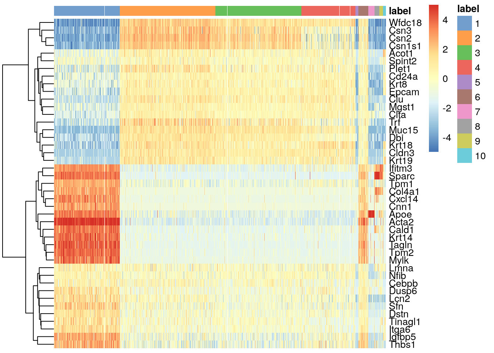
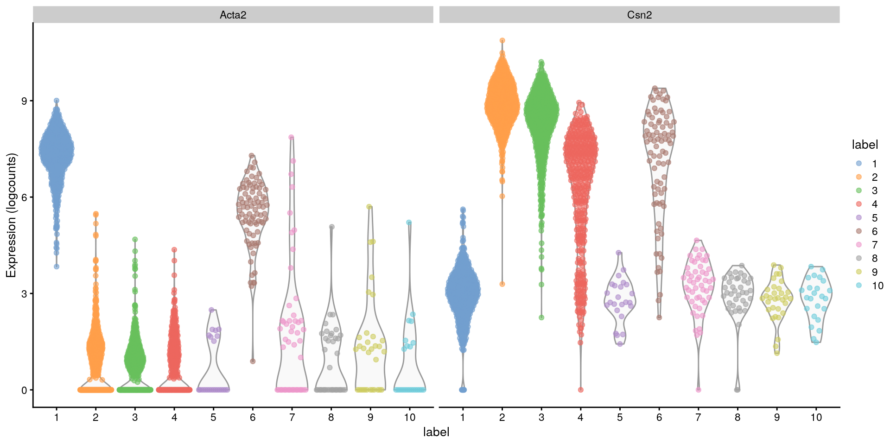
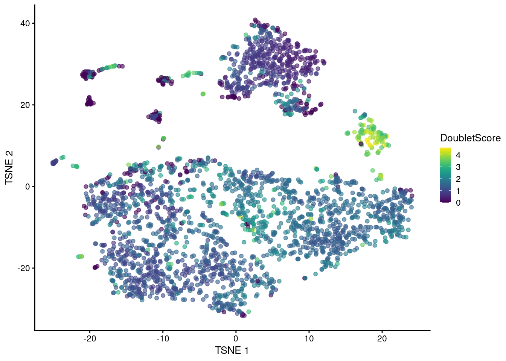
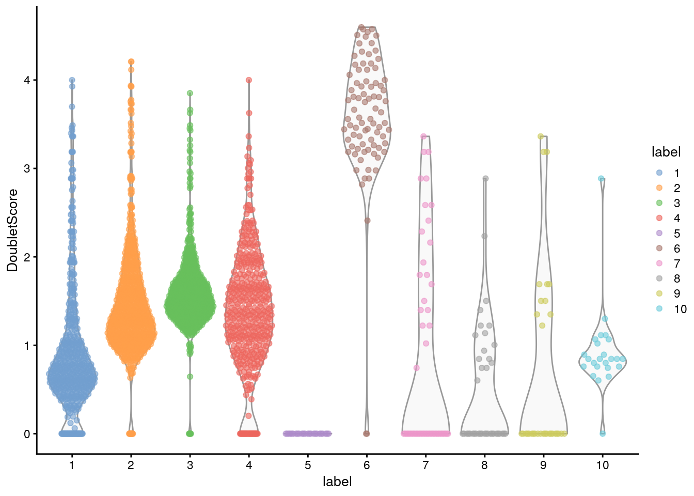
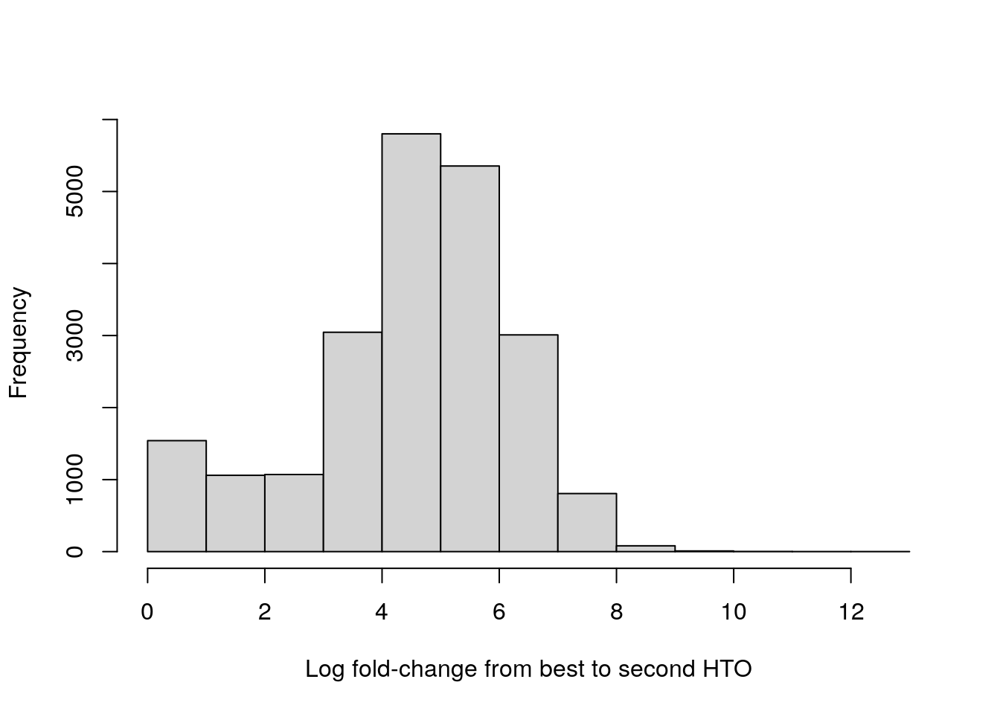
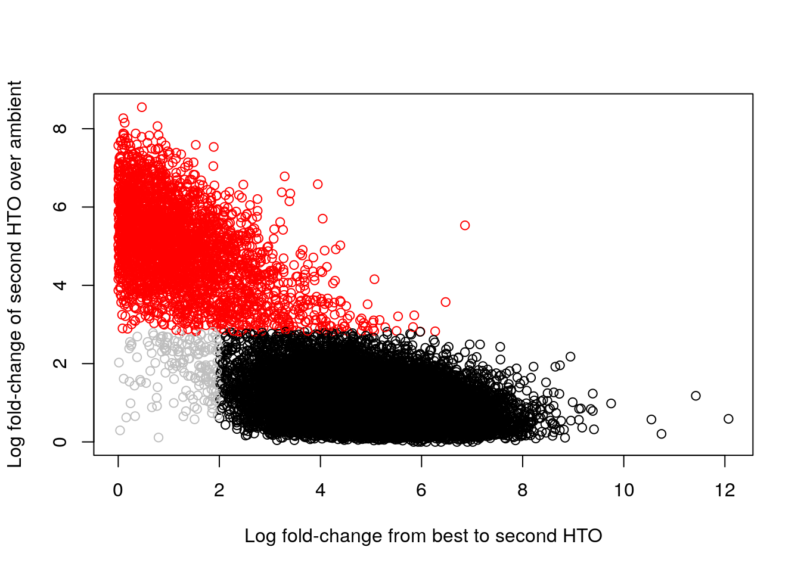
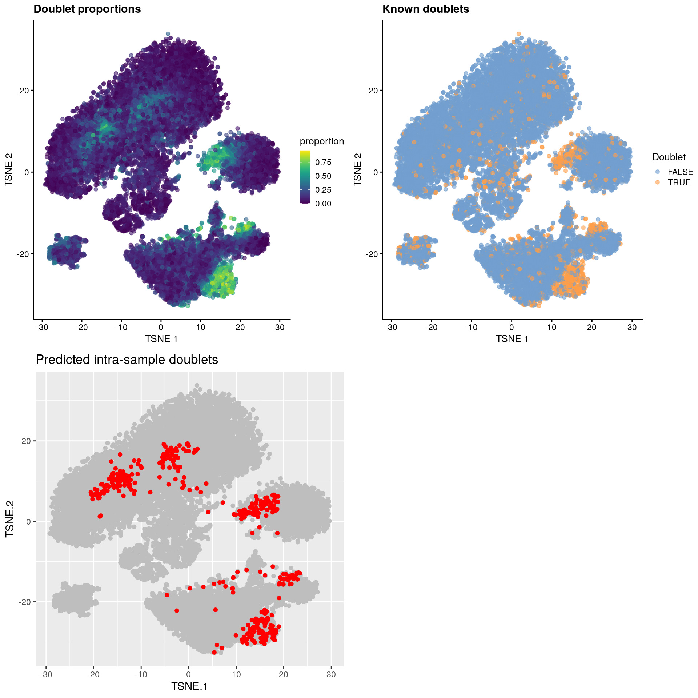
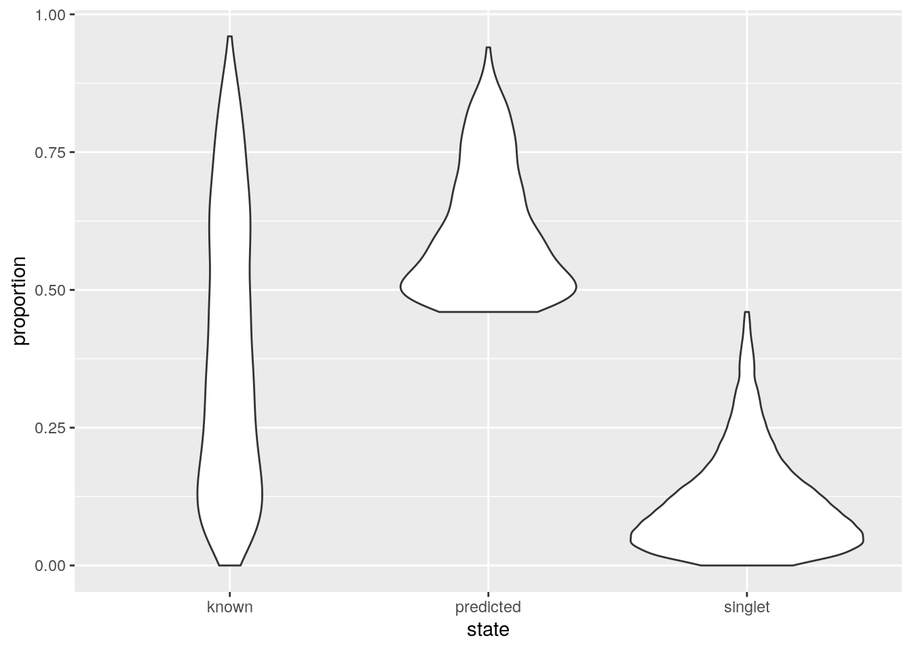

---
output:
  html_document
bibliography: ref.bib
---

# Doublet detection 

<script>
document.addEventListener("click", function (event) {
    if (event.target.classList.contains("rebook-collapse")) {
        event.target.classList.toggle("active");
        var content = event.target.nextElementSibling;
        if (content.style.display === "block") {
            content.style.display = "none";
        } else {
            content.style.display = "block";
        }
    }
})
</script>

<style>
.rebook-collapse {
  background-color: #eee;
  color: #444;
  cursor: pointer;
  padding: 18px;
  width: 100%;
  border: none;
  text-align: left;
  outline: none;
  font-size: 15px;
}

.rebook-content {
  padding: 0 18px;
  display: none;
  overflow: hidden;
  background-color: #f1f1f1;
}
</style>

## Overview

In single-cell RNA sequencing (scRNA-seq) experiments, doublets are artifactual libraries generated from two cells.
They typically arise due to errors in cell sorting or capture, especially in droplet-based protocols [@zheng2017massively] involving thousands of cells.
Doublets are obviously undesirable when the aim is to characterize populations at the single-cell level.
In particular, doublets can be mistaken for intermediate populations or transitory states that do not actually exist.
Thus, it is desirable to identify and remove doublet libraries so that they do not compromise interpretation of the results.

Several experimental strategies are available for doublet removal.
One approach exploits natural genetic variation when pooling cells from multiple donor individuals [@kang2018multiplexed].
Doublets can be identified as libraries with allele combinations that do not exist in any single donor.
Another approach is to mark a subset of cells (e.g., all cells from one sample) with an antibody conjugated to a different oligonucleotide [@stoeckius2017hashing].
Upon pooling, libraries that are observed to have different oligonucleotides are considered to be doublets and removed.
These approaches can be highly effective but rely on experimental information that may not be available.

A more general approach is to infer doublets from the expression profiles alone [@dahlin2018single].
In this workflow, we will describe two purely computational approaches for detecting doublets from scRNA-seq data.
The main difference between these two methods is whether or not they need cluster information beforehand.
We will demonstrate the use of these methods on 10X Genomics data from a droplet-based scRNA-seq study of the mouse mammary gland [@bach2017differentiation].

<button class="rebook-collapse">View history</button>
<div class="rebook-content">
   
```r
#--- loading ---#
library(scRNAseq)
sce.mam <- BachMammaryData(samples="G_1")

#--- gene-annotation ---#
library(scater)
rownames(sce.mam) <- uniquifyFeatureNames(
    rowData(sce.mam)$Ensembl, rowData(sce.mam)$Symbol)

library(AnnotationHub)
ens.mm.v97 <- AnnotationHub()[["AH73905"]]
rowData(sce.mam)$SEQNAME <- mapIds(ens.mm.v97, keys=rowData(sce.mam)$Ensembl,
    keytype="GENEID", column="SEQNAME")

#--- quality-control ---#
is.mito <- rowData(sce.mam)$SEQNAME == "MT"
stats <- perCellQCMetrics(sce.mam, subsets=list(Mito=which(is.mito)))
qc <- quickPerCellQC(stats, percent_subsets="subsets_Mito_percent")
sce.mam <- sce.mam[,!qc$discard]

#--- normalization ---#
library(scran)
set.seed(101000110)
clusters <- quickCluster(sce.mam)
sce.mam <- computeSumFactors(sce.mam, clusters=clusters)
sce.mam <- logNormCounts(sce.mam)

#--- variance-modelling ---#
set.seed(00010101)
dec.mam <- modelGeneVarByPoisson(sce.mam)
top.mam <- getTopHVGs(dec.mam, prop=0.1)

#--- dimensionality-reduction ---#
library(BiocSingular)
set.seed(101010011)
sce.mam <- denoisePCA(sce.mam, technical=dec.mam, subset.row=top.mam)
sce.mam <- runTSNE(sce.mam, dimred="PCA")

#--- clustering ---#
snn.gr <- buildSNNGraph(sce.mam, use.dimred="PCA", k=25)
colLabels(sce.mam) <- factor(igraph::cluster_walktrap(snn.gr)$membership)
```

</div>


```r
sce.mam
```

```
## class: SingleCellExperiment 
## dim: 27998 2772 
## metadata(0):
## assays(2): counts logcounts
## rownames(27998): Xkr4 Gm1992 ... Vmn2r122 CAAA01147332.1
## rowData names(3): Ensembl Symbol SEQNAME
## colnames: NULL
## colData names(5): Barcode Sample Condition sizeFactor label
## reducedDimNames(2): PCA TSNE
## altExpNames(0):
```

## Doublet detection with clusters

The `doubletCluster()` function identifies clusters with expression profiles lying between two other clusters [@bach2017differentiation].
We consider every possible triplet of clusters consisting of a query cluster and two putative "source" clusters.
Under the null hypothesis that the query consists of doublets from the two sources, we then compute a number of statistics:

- The number of genes (`N`) that are differentially expressed in the same direction in the query cluster compared to _both_ of the source clusters.
Such genes would be unique markers for the query cluster and provide evidence against the null hypothesis.
Clusters with few unique genes are more likely to be composed of doublets.
- The ratio of the median library size in each source to the median library size in the query (`lib.size` fields).
Doublet libraries are generated from a larger initial pool of RNA compared to libraries for single cells, and thus the former should have larger library sizes.
Library size ratios much greater than unity are inconsistent with a doublet identity for the query.
- The proportion of cells in the query cluster should also be reasonable - typically less than 5% of all cells, depending on how many cells were loaded onto the 10X Genomics device.

For each query cluster, the best pair of sources is identified based solely on the lowest `N`.
(This means that any `lib.size*` above unity is not definitive evidence against a doublet identity for a query cluster, as there may be a pair of sources with slightly higher `N` but both `lib.size*` values below unity.)
If more detail is necessary, the `all.pairs` field contains statistics on all possible source pairs for a given query cluster.


```r
# Like 'findMarkers', this function will automatically
# retrieve cluster assignments from 'colLabels'.
library(scran)
dbl.out <- doubletCluster(sce.mam)
dbl.out
```

```
## DataFrame with 10 rows and 9 columns
##        source1     source2         N        best     p.value lib.size1
##    <character> <character> <integer> <character>   <numeric> <numeric>
## 6            2           1        13       Pcbp2 1.28336e-03  0.811531
## 2           10           3       109        Pigr 4.34790e-21  0.619865
## 4            6           5       111       Cotl1 1.09709e-08  1.540751
## 5           10           7       139        Gde1 9.30195e-12  1.125474
## 10           8           5       191       Krt18 5.54539e-20  0.888432
## 7            8           5       270    AF251705 3.29661e-24  0.856192
## 9            8           5       295       Fabp4 2.21523e-32  0.655624
## 8           10           9       388      Col1a1 6.82664e-32  1.125578
## 1            8           6       513       Acta2 1.07294e-24  0.865449
## 3            6           5       530      Sapcd2 6.08574e-16  0.872951
##    lib.size2       prop                                 all.pairs
##    <numeric>  <numeric>                           <DataFrameList>
## 6   0.516399 0.03030303      2:1:13:...,4:1:14:...,3:1:28:...,...
## 2   1.411579 0.28823954  10:3:109:...,5:3:194:...,8:3:205:...,...
## 4   0.688651 0.16305916  6:5:111:...,10:6:146:...,6:2:209:...,...
## 5   1.167854 0.00865801 10:7:139:...,9:7:153:...,10:9:168:...,...
## 10  0.888514 0.00865801   8:5:191:...,9:5:224:...,6:5:229:...,...
## 7   0.856271 0.01875902  8:5:270:...,9:5:337:...,10:5:362:...,...
## 9   0.655685 0.01154401  8:5:295:...,10:8:323:...,5:1:338:...,...
## 8   1.525264 0.01406926 10:9:388:...,9:7:400:...,10:7:436:...,...
## 1   1.936489 0.19841270   8:6:513:...,9:6:609:...,6:5:854:...,...
## 3   0.390173 0.25829726   6:5:530:...,5:2:593:...,5:4:700:...,...
```

Clusters are then ranked by `N` in the output of `doubletClusters()`, allowing us to prioritize high-risk clusters that require careful investigation.
If a more concrete threshold is necessary, we can identify clusters that have unusually low `N` using an outlier-based approach. 


```r
library(scater)
chosen.doublet <- rownames(dbl.out)[isOutlier(dbl.out$N, 
    type="lower", log=TRUE)]
chosen.doublet
```

```
## [1] "6"
```


Examination of the output of `doubletCluster()` indicates that cluster 6 has the fewest unique genes and library sizes that are comparable to or greater than its sources.
We see that every gene detected in this cluster is also expressed in either of the two proposed source clusters (Figure \@ref(fig:heatclust)).


```r
markers <- findMarkers(sce.mam, direction="up")
dbl.markers <- markers[[chosen.doublet]]

library(scater)
chosen <- rownames(dbl.markers)[dbl.markers$Top <= 10]
plotHeatmap(sce.mam, order_columns_by="label", features=chosen, 
    center=TRUE, symmetric=TRUE, zlim=c(-5, 5))
```

<div class="figure">

<p class="caption">(\#fig:heatclust)Heatmap of mean-centered and normalized log-expression values for the top set of markers for cluster 6 in the mammary gland dataset. Column colours represent the cluster to which each cell is assigned, as indicated by the legend.</p>
</div>


Closer examination of some known markers suggests that the offending cluster consists of doublets of basal cells (_Acta2_) and alveolar cells (_Csn2_) (Figure \@ref(fig:markerexprs)).
Indeed, no cell type is known to strongly express both of these genes at the same time, which supports the hypothesis that this cluster consists solely of doublets rather than being an entirely novel cell type.


```r
plotExpression(sce.mam, features=c("Acta2", "Csn2"), 
    x="label", colour_by="label")
```

<div class="figure">

<p class="caption">(\#fig:markerexprs)Distribution of log-normalized expression values for _Acta2_ and _Csn2_ in each cluster. Each point represents a cell.</p>
</div>

The strength of `doubletCluster()` lies in its simplicity and ease of interpretation.
Suspect clusters can be quickly flagged based on the metrics returned by the function.
However, it is obviously dependent on the quality of the clustering.
Clusters that are too coarse will fail to separate doublets from other cells, while clusters that are too fine will complicate interpretation.
The method is also somewhat biased towards clusters with fewer cells, where the reduction in power is more likely to result in a low `N`.
(Fortunately, this is a desirable effect as doublets should be rare in a properly performed scRNA-seq experiment.)

## Doublet detection by simulation {#doublet-simulation}

The other doublet detection strategy involves _in silico_ simulation of doublets from the single-cell expression profiles [@dahlin2018single].
This is performed using the `doubletCells()` function from *[scran](https://bioconductor.org/packages/3.12/scran)*, which will:

1. Simulate thousands of doublets by adding together two randomly chosen single-cell profiles.
2. For each original cell, compute the density of simulated doublets in the surrounding neighborhood.
3. For each original cell, compute the density of other observed cells in the neighborhood.
4. Return the ratio between the two densities as a "doublet score" for each cell.

This approach assumes that the simulated doublets are good approximations for real doublets.
The use of random selection accounts for the relative abundances of different subpopulations, which affect the likelihood of their involvement in doublets;
and the calculation of a ratio avoids high scores for non-doublet cells in highly abundant subpopulations.

We see the function in action below.
To speed up the density calculations, `doubletCells()` will perform a PCA on the log-expression matrix, and we perform some (optional) parametrization to ensure that the computed PCs are consistent with that from our previous analysis on this dataset.


```r
library(BiocSingular)
set.seed(100)

# Setting up the parameters for consistency with denoisePCA();
# this can be changed depending on your feature selection scheme.
dbl.dens <- doubletCells(sce.mam, subset.row=top.mam, 
    d=ncol(reducedDim(sce.mam)))
summary(dbl.dens)
```

```
##    Min. 1st Qu.  Median    Mean 3rd Qu.    Max. 
##       0       8      21     395      49   39573
```

The highest doublet scores are concentrated in a single cluster of cells in the center of Figure \@ref(fig:denstsne).


```r
sce.mam$DoubletScore <- log10(dbl.dens+1)
plotTSNE(sce.mam, colour_by="DoubletScore")
```

<div class="figure">

<p class="caption">(\#fig:denstsne)t-SNE plot of the mammary gland data set. Each point is a cell coloured according to its doublet density.</p>
</div>

From the clustering information, we see that the affected cells belong to the same cluster that was identified using `doubletCluster()` (Figure \@ref(fig:densclust)), which is reassuring.


```r
plotColData(sce.mam, x="label", y="DoubletScore", colour_by="label")
```

<div class="figure">

<p class="caption">(\#fig:densclust)Distribution of doublet scores for each cluster in the mammary gland data set. Each point is a cell.</p>
</div>

The advantage of `doubletCells()` is that it does not depend on clusters, reducing the sensitivity of the results to clustering quality.
The downside is that it requires some strong assumptions about how doublets form, such as the combining proportions and the sampling from pure subpopulations.
In particular, `doubletCells()` treats the library size of each cell as an accurate proxy for its total RNA content.
If this is not true, the simulation will not combine expression profiles from different cells in the correct proportions.
This means that the simulated doublets will be systematically shifted away from the real doublets, resulting in doublet scores that are too low.

Simply removing cells with high doublet scores will not be sufficient to eliminate real doublets from the data set.
In some cases, only a subset of the cells in the putative doublet cluster actually have high scores, and removing these would still leave enough cells in that cluster to mislead downstream analyses.
In fact, even defining a threshold on the doublet score is difficult as the interpretation of the score is relative.
There is no general definition for a fixed threshold above which libraries are to be considered doublets.

We recommend interpreting the `doubletCells()` scores in the context of cluster annotation.
All cells from a cluster with a large average doublet score should be considered suspect, and close neighbors of problematic clusters should also be treated with caution.
In contrast, a cluster containing a small proportion of high-scoring cells is probably safe provided that any interesting results are not being driven by those cells (e.g., checking that DE in an interesting gene is not driven solely by cells with high doublet scores).
While clustering is still required, this approach is more robust than `doubletClusters()` to the quality of the clustering as the scores are computed on a per-cell basis.

(As an aside, the issue of unknown combining proportions can be solved completely if spike-in information is available, e.g., in plate-based protocols.
This will provide an accurate estimate of the total RNA content of each cell.
To this end, spike-in-based size factors from Section \@ref(spike-norm) can be supplied to the `doubletCells()` function via the `size.factors.content=` argument.
This will use the spike-in size factors to scale the contribution of each cell to a doublet library.)

## Doublet detection in multiplexed experiments

### Background

For multiplexed samples [@kang2018multiplexed;@stoekius2018hashing], we can identify doublet cells based on the cells that have multiple labels.
The idea here is that cells from the same sample are labelled in a unique manner, either implicitly with genotype information or experimentally with hashing tag oligos (HTOs).
Cells from all samples are then mixed together and the multiplexed pool is subjected to scRNA-seq, avoiding batch effects and simplifying the logistics of processing a large number of samples.
Importantly, most per-cell libraries are expected to contain one label that can be used to assign that cell to its sample of origin.
Cell libraries containing two labels are thus likely to be doublets of cells from different samples. 

To demonstrate, we will use some data from the original cell hashing study [@stoekius2018hashing].
Each sample's cells were stained with an antibody against a ubiquitous surface protein, where the antibody was conjugated to a sample-specific HTO.
Sequencing of the HTO-derived cDNA library ultimately yields a count matrix where each row corresponds to a HTO and each column corresponds to a cell barcode.


```r
library(scRNAseq)
hto.sce <- StoeckiusHashingData(mode="hto")
dim(hto.sce)
```

```
## [1]     8 65000
```

### Identifying inter-sample doublets

Before we proceed to doublet detection, we simplify the problem by first identifying the barcodes that contain cells.
This is most conventionally done using the gene expression matrix for the same set of barcodes, as shown in Section \@ref(qc-droplets).
Here, though, we will keep things simple and apply `emptyDrops()` directly on the HTO count matrix.
The considerations are largely the same as that for gene expression matrices; the main difference is that the default `lower=` is often too low for deeply sequenced HTOs, so we instead estimate the ambient profile by excluding the top `by.rank=` barcodes with the largest totals (under the assumption that no more than `by.rank=` cells were loaded).
The barcode-rank plots are quite similar to what one might expect from gene expression data (Figure \@ref(fig:hash-barcode-rank)).


```r
library(DropletUtils)

set.seed(101)
hash.calls <- emptyDrops(counts(hto.sce), by.rank=40000)
is.cell <- which(hash.calls$FDR <= 0.001)
length(is.cell)
```

```
## [1] 21782
```

```r
par(mfrow=c(1,2))
r <- rank(-hash.calls$Total)
plot(r, hash.calls$Total, log="xy", xlab="Rank", ylab="Total HTO count", main="")
hist(log10(hash.calls$Total[is.cell]), xlab="Log[10] HTO count", main="")
```

<div class="figure">

<p class="caption">(\#fig:hash-barcode-rank)Cell-calling statistics from running `emptyDrops()` on the HTO counts in the cell hashing study. Left: Barcode rank plot of the HTO counts in the cell hashing study. Right: distribution of log-total counts for libraries identified as cells.</p>
</div>

We then run `hashedDrops()` on the subset of cell barcode libraries that actually contain cells.
This returns the likely sample of origin for each barcode library based on its most abundant HTO,
using abundances adjusted for ambient contamination in the `ambient=` argument.
(The adjustment process itself involves a fair number of assumptions that we will not discuss here; see `?hashedDrops` for more details.)
For quality control, it returns the log-fold change between the first and second-most abundant HTOs in each barcode libary (Figure \@ref(fig:hto-1to2-hist)), allowing us to quantify the certainty of each assignment.
Confidently assigned singlets are marked using the `Confident` field in the output.


```r
hash.stats <- hashedDrops(counts(hto.sce)[,is.cell],
    ambient=metadata(hash.calls)$ambient)

hist(hash.stats$LogFC, xlab="Log fold-change from best to second HTO", main="")
```

<div class="figure">

<p class="caption">(\#fig:hto-1to2-hist)Distribution of log-fold changes from the first to second-most abundant HTO in each cell.</p>
</div>

```r
# Raw assignments:
table(hash.stats$Best)
```

```
## 
##    1    2    3    4    5    6    7    8 
## 2703 3276 2753 2782 2494 2381 2586 2807
```

```r
# Confident assignments based on (i) a large log-fold change 
# and (ii) not being a doublet, see below.
table(hash.stats$Best[hash.stats$Confident])
```

```
## 
##    1    2    3    4    5    6    7    8 
## 2349 2779 2458 2275 2091 1994 2176 2458
```

Of greater interest here is how we can use the hashing information to detect doublets.
This is achieved by reporting the log-fold change between the count for the second HTO and the estimated contribution from ambient contamination.
A large log-fold change indicates that the second HTO still has an above-expected abundance, consistent with a doublet containing HTOs from two samples.
We use outlier detection to explicitly identify putative doublets as those barcode libraries that have large log-fold changes;
this is visualized in Figure \@ref(fig:hto-2to3-hash), which shows a clear separation between the putative singlets and doublets.


```r
summary(hash.stats$Doublet)
```

```
##    Mode   FALSE    TRUE 
## logical   18744    3038
```

```r
colors <- rep("grey", nrow(hash.stats))
colors[hash.stats$Doublet] <- "red"
colors[hash.stats$Confident] <- "black"

plot(hash.stats$LogFC, hash.stats$LogFC2,
    xlab="Log fold-change from best to second HTO",
    ylab="Log fold-change of second HTO over ambient",
    col=colors)
```

<div class="figure">

<p class="caption">(\#fig:hto-2to3-hash)Log-fold change of the second-most abundant HTO over ambient contamination, compared to the log-fold change of the first HTO over the second HTO. Each point represents a cell where potential doublets are shown in red while confidently assigned singlets are shown in black.</p>
</div>

### Guilt by association for unmarked doublets

One obvious limitation of this approach is that doublets of cells marked with the same HTO are not detected.
In a simple multiplexing experiment involving $N$ samples with similar numbers of cells,
we would expect around $1/N$ of all doublets to involve cells from the same sample.
For typical values of $N$ of 5 to 12, this may still be enough to cause the formation of misleading doublet clusters even after the majority of known doublets are removed.
To avoid this, we recover the remaining intra-sample doublets based on their similarity with known doublets in gene expression space (hence, "guilt by association").
We illustrate by loading the gene expression data for this study:


```r
sce.hash <- StoeckiusHashingData(mode="human")

# Subsetting to all barcodes detected as cells. Requires an intersection,
# because `hto.sce` and `sce.hash` are not the same dimensions! 
common <- intersect(colnames(sce.hash), rownames(hash.stats))
sce.hash <- sce.hash[,common]
colData(sce.hash) <- hash.stats[common,]

sce.hash
```

```
## class: SingleCellExperiment 
## dim: 27679 20830 
## metadata(0):
## assays(1): counts
## rownames(27679): A1BG A1BG-AS1 ... hsa-mir-8072 snoU2-30
## rowData names(0):
## colnames(20830): ACTGCTCAGGTGTTAA ATGAGGGAGATGTTAG ... CACCAGGCACACAGAG
##   CTCGGAGTCTAACTCT
## colData names(7): Total Best ... Doublet Confident
## reducedDimNames(0):
## altExpNames(0):
```

For each cell, we calculate the proportion of its nearest neighbors that are known doublets.
Intra-sample doublets should have high proportions under the assumption that their gene expression profiles are similar to inter-sample doublets involving the same combination of cell states/types.
Unlike in Section \@ref(doublet-simulation), the use of experimentally derived doublet calls avoids any assumptions about the relative quantity of total RNA or the probability of doublet formation across different cell types.


```r
# Performing a quick-and-dirty analysis to get some PCs to use
# for nearest neighbor detection inside doubletRecovery().
library(scran)
sce.hash <- logNormCounts(sce.hash)
dec.hash <- modelGeneVar(sce.hash)
top.hash <- getTopHVGs(dec.hash, n=1000)
set.seed(1011110)
sce.hash <- runPCA(sce.hash, subset_row=top.hash, ncomponents=20)

# Recovering the intra-sample doublets:
hashed.doublets <- doubletRecovery(sce.hash, use.dimred="PCA",
    doublets=sce.hash$Doublet, samples=table(sce.hash$Best))
hashed.doublets
```

```
## DataFrame with 20830 rows and 3 columns
##       proportion     known predicted
##        <numeric> <logical> <logical>
## 1           0.10      TRUE     FALSE
## 2           0.02     FALSE     FALSE
## 3           0.14     FALSE     FALSE
## 4           0.08     FALSE     FALSE
## 5           0.18     FALSE     FALSE
## ...          ...       ...       ...
## 20826       0.04     FALSE     FALSE
## 20827       0.04     FALSE     FALSE
## 20828       0.02     FALSE     FALSE
## 20829       0.04     FALSE     FALSE
## 20830       0.10     FALSE     FALSE
```

The `doubletRecovery()` function also returns explicit intra-sample doublet predictions based on the doublet neighbor proportions.
Given the distribution of cells across multiplexed samples in `samples=`, we estimate the fraction of doublets that would not be observed from the HTO counts.
This is converted into an absolute number based on the number of observed doublets; the top set of libraries with the highest proportions are then marked as intra-sample doublets (Figure \@ref(fig:tsne-hash))


```r
set.seed(1000101001)
sce.hash <- runTSNE(sce.hash, dimred="PCA")
sce.hash$proportion <- hashed.doublets$proportion
sce.hash$predicted <- hashed.doublets$predicted

gridExtra::grid.arrange(
    plotTSNE(sce.hash, colour_by="proportion") + ggtitle("Doublet proportions"),
    plotTSNE(sce.hash, colour_by="Doublet") + ggtitle("Known doublets"),
    ggcells(sce.hash) +
        geom_point(aes(x=TSNE.1, y=TSNE.2), color="grey") +
        geom_point(aes(x=TSNE.1, y=TSNE.2), color="red", 
            data=function(x) x[x$predicted,]) +
        ggtitle("Predicted intra-sample doublets"),
    ncol=2        
)
```

<div class="figure">

<p class="caption">(\#fig:tsne-hash)$t$-SNE plots for gene expression data from the cell hashing study, where each point is a cell and is colored by the doublet proportion (top left), whether or not it is a known inter-sample doublet (top right) and whether it is a predicted intra-sample doublet (bottom left).</p>
</div>

As an aside, it is worth noting that even known doublets may not necessarily have high doublet neighbor proportions.
This is typically observed for doublets involving cells of the same type or state, which are effectively intermixed in gene expression space with the corresponding singlets.
The latter are much more abundant in most (well-controlled) experiments, which results in low proportions for the doublets involved (Figure \@ref(fig:doublet-prop-hash-dist)).
This effect can generally be ignored given the mostly harmless nature of these doublets.


```r
state <- ifelse(hashed.doublets$predicted, "predicted",
    ifelse(hashed.doublets$known, "known", "singlet"))
ggplot(as.data.frame(hashed.doublets)) + 
    geom_violin(aes(x=state, y=proportion)) 
```

<div class="figure">

<p class="caption">(\#fig:doublet-prop-hash-dist)Distribution of doublet neighbor proportions for all cells in the cell hashing study, stratified by doublet detection status.</p>
</div>

## Further comments 

Doublet detection procedures should only be applied to libraries generated in the same experimental batch.
It is obviously impossible for doublets to form between two cells that were captured separately.
Thus, some understanding of the experimental design is required prior to the use of the above functions.
This avoids unnecessary concerns about the validity of batch-specific clusters that cannot possibly consist of doublets.

It is also difficult to interpret doublet predictions in data containing cellular trajectories.
By definition, cells in the middle of a trajectory are always intermediate between other cells and are liable to be incorrectly detected as doublets.
Some protection is provided by the non-linear nature of many real trajectories, which reduces the risk of simulated doublets coinciding with real cells in `doubletCells()`.
One can also put more weight on the relative library sizes in `doubletCluster()` instead of relying solely on `N`, 
under the assumption that sudden spikes in RNA content are unlikely in a continuous biological process.

The best solution to the doublet problem is experimental - that is, to avoid generating them in the first place.
This should be a consideration when designing scRNA-seq experiments, where the desire to obtain large numbers of cells at minimum cost should be weighed against the general deterioration in data quality and reliability when doublets become more frequent.

## Session Info {-}

<button class="rebook-collapse">View session info</button>
<div class="rebook-content">
```
R version 4.0.0 Patched (2020-05-01 r78341)
Platform: x86_64-pc-linux-gnu (64-bit)
Running under: Ubuntu 18.04.5 LTS

Matrix products: default
BLAS:   /home/luna/Software/R/R-4-0-branch-dev/lib/libRblas.so
LAPACK: /home/luna/Software/R/R-4-0-branch-dev/lib/libRlapack.so

locale:
 [1] LC_CTYPE=en_US.UTF-8       LC_NUMERIC=C              
 [3] LC_TIME=en_US.UTF-8        LC_COLLATE=en_US.UTF-8    
 [5] LC_MONETARY=en_US.UTF-8    LC_MESSAGES=en_US.UTF-8   
 [7] LC_PAPER=en_US.UTF-8       LC_NAME=C                 
 [9] LC_ADDRESS=C               LC_TELEPHONE=C            
[11] LC_MEASUREMENT=en_US.UTF-8 LC_IDENTIFICATION=C       

attached base packages:
[1] parallel  stats4    stats     graphics  grDevices utils     datasets 
[8] methods   base     

other attached packages:
 [1] DropletUtils_1.9.10         scRNAseq_2.3.12            
 [3] BiocSingular_1.5.0          scater_1.17.4              
 [5] ggplot2_3.3.2               scran_1.17.15              
 [7] SingleCellExperiment_1.11.6 SummarizedExperiment_1.19.6
 [9] DelayedArray_0.15.7         matrixStats_0.56.0         
[11] Matrix_1.2-18               Biobase_2.49.0             
[13] GenomicRanges_1.41.6        GenomeInfoDb_1.25.10       
[15] IRanges_2.23.10             S4Vectors_0.27.12          
[17] BiocGenerics_0.35.4         BiocStyle_2.17.0           
[19] rebook_0.99.4              

loaded via a namespace (and not attached):
  [1] Rtsne_0.15                    ggbeeswarm_0.6.0             
  [3] colorspace_1.4-1              ellipsis_0.3.1               
  [5] scuttle_0.99.13               bluster_0.99.1               
  [7] XVector_0.29.3                BiocNeighbors_1.7.0          
  [9] farver_2.0.3                  bit64_4.0.2                  
 [11] AnnotationDbi_1.51.3          interactiveDisplayBase_1.27.5
 [13] R.methodsS3_1.8.0             codetools_0.2-16             
 [15] knitr_1.29                    dbplyr_1.4.4                 
 [17] R.oo_1.23.0                   pheatmap_1.0.12              
 [19] graph_1.67.1                  HDF5Array_1.17.3             
 [21] shiny_1.5.0                   BiocManager_1.30.10          
 [23] compiler_4.0.0                httr_1.4.2                   
 [25] dqrng_0.2.1                   assertthat_0.2.1             
 [27] fastmap_1.0.1                 limma_3.45.10                
 [29] later_1.1.0.1                 htmltools_0.5.0              
 [31] tools_4.0.0                   rsvd_1.0.3                   
 [33] igraph_1.2.5                  gtable_0.3.0                 
 [35] glue_1.4.1                    GenomeInfoDbData_1.2.3       
 [37] dplyr_1.0.1                   rappdirs_0.3.1               
 [39] Rcpp_1.0.5                    rhdf5filters_1.1.2           
 [41] vctrs_0.3.2                   ExperimentHub_1.15.1         
 [43] DelayedMatrixStats_1.11.1     xfun_0.16                    
 [45] stringr_1.4.0                 ps_1.3.4                     
 [47] mime_0.9                      lifecycle_0.2.0              
 [49] irlba_2.3.3                   statmod_1.4.34               
 [51] XML_3.99-0.5                  AnnotationHub_2.21.2         
 [53] edgeR_3.31.4                  zlibbioc_1.35.0              
 [55] scales_1.1.1                  promises_1.1.1               
 [57] rhdf5_2.33.7                  RColorBrewer_1.1-2           
 [59] yaml_2.2.1                    curl_4.3                     
 [61] memoise_1.1.0                 gridExtra_2.3                
 [63] stringi_1.4.6                 RSQLite_2.2.0                
 [65] BiocVersion_3.12.0            highr_0.8                    
 [67] BiocParallel_1.23.2           rlang_0.4.7                  
 [69] pkgconfig_2.0.3               bitops_1.0-6                 
 [71] evaluate_0.14                 lattice_0.20-41              
 [73] Rhdf5lib_1.11.3               purrr_0.3.4                  
 [75] CodeDepends_0.6.5             labeling_0.3                 
 [77] cowplot_1.0.0                 bit_4.0.4                    
 [79] processx_3.4.3                tidyselect_1.1.0             
 [81] magrittr_1.5                  bookdown_0.20                
 [83] R6_2.4.1                      generics_0.0.2               
 [85] DBI_1.1.0                     pillar_1.4.6                 
 [87] withr_2.2.0                   RCurl_1.98-1.2               
 [89] tibble_3.0.3                  crayon_1.3.4                 
 [91] BiocFileCache_1.13.1          rmarkdown_2.3                
 [93] viridis_0.5.1                 locfit_1.5-9.4               
 [95] grid_4.0.0                    blob_1.2.1                   
 [97] callr_3.4.3                   digest_0.6.25                
 [99] xtable_1.8-4                  httpuv_1.5.4                 
[101] R.utils_2.9.2                 munsell_0.5.0                
[103] beeswarm_0.2.3                viridisLite_0.3.0            
[105] vipor_0.4.5                  
```
</div>
