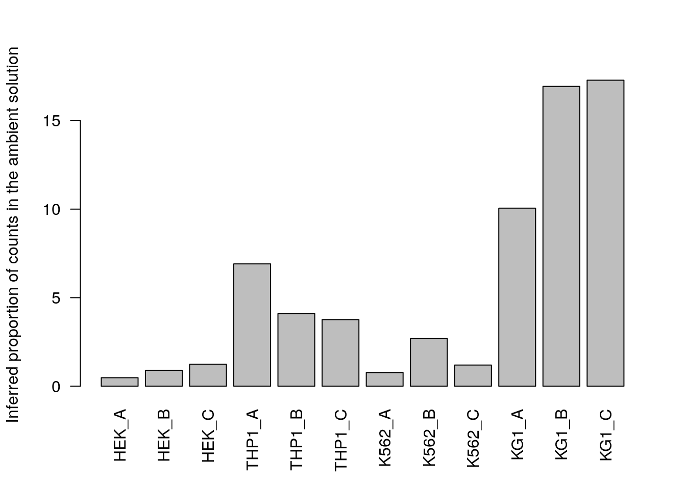

---
output:
  html_document
bibliography: ref.bib
---

# Droplet processing

<script>
document.addEventListener("click", function (event) {
    if (event.target.classList.contains("aaron-collapse")) {
        event.target.classList.toggle("active");
        var content = event.target.nextElementSibling;
        if (content.style.display === "block") {
            content.style.display = "none";
        } else {
            content.style.display = "block";
        }
    }
})
</script>

<style>
.aaron-collapse {
  background-color: #eee;
  color: #444;
  cursor: pointer;
  padding: 18px;
  width: 100%;
  border: none;
  text-align: left;
  outline: none;
  font-size: 15px;
}

.aaron-content {
  padding: 0 18px;
  display: none;
  overflow: hidden;
  background-color: #f1f1f1;
}
</style>

## Motivation

Droplet-based single-cell protocols aim to isolate each cell inside its own droplet in a water-in-oil emulsion, such that each droplet serves as a miniature reaction chamber for highly multiplexed library preparation [@macosko2015highly;@klein2015droplet].
Upon sequencing, reads are assigned to individual cells based on the presence of droplet-specific barcodes.
This enables a massive increase in the number of cells that can be processed in typical scRNA-seq experiments, contributing to the dominance^[As of time of writing.] of technologies such as the 10X Genomics platform [@zheng2017massively].
However, as the allocation of cells to droplets is not known in advance, the data analysis requires some special steps to determine what each droplet actually contains.
This chapter explores some of the more common preprocessing procedures that might be applied to the count matrices generated from droplet protocols.

## Calling cells from empty droplets {#qc-droplets}

### Background

An unique aspect of droplet-based data is that we have no prior knowledge about whether a particular library (i.e., cell barcode) corresponds to cell-containing or empty droplets.
Thus, we need to call cells from empty droplets based on the observed expression profiles.
This is not entirely straightforward as empty droplets can contain ambient (i.e., extracellular) RNA that can be captured and sequenced, resulting in non-zero counts for libraries that do not contain any cell.
To demonstrate, we obtain the **unfiltered** count matrix for the PBMC dataset from 10X Genomics.

<button class="aaron-collapse">View history</button>
<div class="aaron-content">
   
```r
#--- loading ---#
library(BiocFileCache)
bfc <- BiocFileCache("raw_data", ask = FALSE)
raw.path <- bfcrpath(bfc, file.path("http://cf.10xgenomics.com/samples",
    "cell-exp/2.1.0/pbmc4k/pbmc4k_raw_gene_bc_matrices.tar.gz"))
untar(raw.path, exdir=file.path(tempdir(), "pbmc4k"))

library(DropletUtils)
fname <- file.path(tempdir(), "pbmc4k/raw_gene_bc_matrices/GRCh38")
sce.pbmc <- read10xCounts(fname, col.names=TRUE)
```

</div>


```r
sce.pbmc
```

```
## class: SingleCellExperiment 
## dim: 33694 737280 
## metadata(1): Samples
## assays(1): counts
## rownames(33694): ENSG00000243485 ENSG00000237613 ... ENSG00000277475
##   ENSG00000268674
## rowData names(2): ID Symbol
## colnames(737280): AAACCTGAGAAACCAT-1 AAACCTGAGAAACCGC-1 ...
##   TTTGTCATCTTTAGTC-1 TTTGTCATCTTTCCTC-1
## colData names(2): Sample Barcode
## reducedDimNames(0):
## altExpNames(0):
```

The distribution of total counts exhibits a sharp transition between barcodes with large and small total counts (Figure \@ref(fig:rankplot)), probably corresponding to cell-containing and empty droplets respectively.
A simple approach would be to apply a threshold on the total count to only retain those barcodes with large totals.
However, this unnecessarily discards libraries derived from cell types with low RNA content.


```r
library(DropletUtils)
bcrank <- barcodeRanks(counts(sce.pbmc))

# Only showing unique points for plotting speed.
uniq <- !duplicated(bcrank$rank)
plot(bcrank$rank[uniq], bcrank$total[uniq], log="xy",
    xlab="Rank", ylab="Total UMI count", cex.lab=1.2)

abline(h=metadata(bcrank)$inflection, col="darkgreen", lty=2)
abline(h=metadata(bcrank)$knee, col="dodgerblue", lty=2)

legend("bottomleft", legend=c("Inflection", "Knee"), 
        col=c("darkgreen", "dodgerblue"), lty=2, cex=1.2)
```

<div class="figure">

<p class="caption">(\#fig:rankplot)Total UMI count for each barcode in the PBMC dataset, plotted against its rank (in decreasing order of total counts). The inferred locations of the inflection and knee points are also shown.</p>
</div>

### Testing for empty droplets

We use the `emptyDrops()` function to test whether the expression profile for each cell barcode is significantly different from the ambient RNA pool [@lun2018distinguishing].
Any significant deviation indicates that the barcode corresponds to a cell-containing droplet.
This allows us to discriminate between well-sequenced empty droplets and droplets derived from cells with little RNA, both of which would have similar total counts in Figure \@ref(fig:rankplot).
We call cells at a false discovery rate (FDR) of 0.1%, meaning that no more than 0.1% of our called barcodes should be empty droplets on average.


```r
# emptyDrops performs Monte Carlo simulations to compute p-values,
# so we need to set the seed to obtain reproducible results.
set.seed(100)
e.out <- emptyDrops(counts(sce.pbmc))

# See ?emptyDrops for an explanation of why there are NA values.
summary(e.out$FDR <= 0.001)
```

```
##    Mode   FALSE    TRUE    NA's 
## logical     989    4300  731991
```

`emptyDrops()` uses Monte Carlo simulations to compute $p$-values for the multinomial sampling transcripts from the ambient pool.
The number of Monte Carlo iterations determines the lower bound for the $p$-values [@phipson2010permutation].
The `Limited` field in the output indicates whether or not the computed $p$-value for a particular barcode is bounded by the number of iterations.
If any non-significant barcodes are `TRUE` for `Limited`, we may need to increase the number of iterations.
A larger number of iterations will result in a lower $p$-value for these barcodes, which may allow them to be detected after correcting for multiple testing.


```r
table(Sig=e.out$FDR <= 0.001, Limited=e.out$Limited)
```

```
##        Limited
## Sig     FALSE TRUE
##   FALSE   989    0
##   TRUE   1728 2572
```

As mentioned above, `emptyDrops()` assumes that barcodes with low total UMI counts are empty droplets.
Thus, the null hypothesis should be true for all of these barcodes. 
We can check whether the hypothesis testing procedure holds its size by examining the distribution of $p$-values for low-total barcodes with `test.ambient=TRUE`.
Ideally, the distribution should be close to uniform (Figure \@ref(fig:ambientpvalhist)).
Large peaks near zero indicate that barcodes with total counts below `lower` are not all ambient in origin.
This can be resolved by decreasing `lower` further to ensure that barcodes corresponding to droplets with very small cells are not used to estimate the ambient profile.


```r
set.seed(100)
limit <- 100   
all.out <- emptyDrops(counts(sce.pbmc), lower=limit, test.ambient=TRUE)
hist(all.out$PValue[all.out$Total <= limit & all.out$Total > 0],
    xlab="P-value", main="", col="grey80") 
```

<div class="figure">

<p class="caption">(\#fig:ambientpvalhist)Distribution of $p$-values for the assumed empty droplets.</p>
</div>

Once we are satisfied with the performance of `emptyDrops()`, we subset our `SingleCellExperiment` object to retain only the detected cells.
Discerning readers will notice the use of `which()`, which conveniently removes the `NA`s prior to the subsetting.
 

```r
sce.pbmc <- sce.pbmc[,which(e.out$FDR <= 0.001)]
```

It is worth pointing out that, at this point, we do not attempt to remove the ambient contamination from each library.
Accurate quantification of the contamination rate in each cell is difficult as it generally requires some prior biological knowledge about genes that are expected to have mutually exclusive expression profiles _and_ are highly abundant in the ambient solution [@young2018soupx].
Fortunately, ambient contamination usually has little effect on the downstream conclusions for routine analyses; cell type identities are usually easy enough to determine from the affected genes, notwithstanding a (mostly harmless) low background level of expression for marker genes that should be unique to a cell type.
However, more susceptible analyses may require specific remedies like those discussed in Section \@ref(ambient-problems).

### Relationship with other QC metrics

While `emptyDrops()` will distinguish cells from empty droplets, it makes no statement about the quality of the cells.
It is entirely possible for droplets to contain damaged or dying cells, which need to be removed prior to downstream analysis.
This is achieved using the same outlier-based strategy described in Section \@ref(quality-control-outlier).
Filtering on the mitochondrial proportion provides the most additional benefit in this situation, provided that we check that we are not removing a subpopulation of metabolically active cells (Figure \@ref(fig:qc-mito-pbmc)). 


```r
library(scuttle)
is.mito <- grep("^MT-", rowData(sce.pbmc)$Symbol)
pbmc.qc <- perCellQCMetrics(sce.pbmc, subsets=list(MT=is.mito))
discard.mito <- isOutlier(pbmc.qc$subsets_MT_percent, type="higher")
summary(discard.mito)
```

```
##    Mode   FALSE    TRUE 
## logical    3985     315
```

```r
plot(pbmc.qc$sum, pbmc.qc$subsets_MT_percent, log="x",
    xlab="Total count", ylab='Mitochondrial %')
abline(h=attr(discard.mito, "thresholds")["higher"], col="red")
```

<div class="figure">

<p class="caption">(\#fig:qc-mito-pbmc)Percentage of reads assigned to mitochondrial transcripts, plotted against the library size. The red line represents the upper threshold used for QC filtering.</p>
</div>

`emptyDrops()` already removes cells with very low library sizes or (by association) low numbers of expressed genes.
Thus, further filtering on these metrics is not strictly necessary.
It may still be desirable to filter on both of these metrics to remove non-empty droplets containing cell fragments or stripped nuclei that were not caught by the mitochondrial filter.
However, this should be weighed against the risk of losing genuine cell types as discussed in Section \@ref(outlier-assumptions).

Note that _CellRanger_ version 3 automatically performs cell calling using an algorithm similar to `emptyDrops()`.
If we had started our analysis with the **filtered** count matrix, we could go straight to computing other QC metrics.
We would not need to run `emptyDrops()` manually as shown here, and indeed, attempting to do so would lead to nonsensical results if not outright software errors.
Nonetheless, it may still be desirable to load the **unfiltered** matrix and apply `emptyDrops()` ourselves, on occasions where more detailed inspection or control of the cell-calling statistics is desired.

## Demultiplexing cell hashes {#cell-hashing}

### Background

Cell hashing [@stoekius2018hashing] is a useful technique that allows cells from different samples to be processed in a single run of a droplet-based protocol.
Cells from a single sample are first labelled with a unique hashing tag oligo (HTOs), usually via conjugation of the HTO to an antibody against a ubiquitous surface marker or a membrane-binding compound like cholesterol [@mcginnis2019multiseq].
Cells from different samples are then mixed together and the multiplexed pool is used for droplet-based library preparation; each cell is assigned back to its sample of origin based on its most abundant HTO.
By processing multiple samples together, we can avoid batch effects and simplify the logistics of studies with a large number of samples.

Sequencing of the HTO-derived cDNA library yields a count matrix where each row corresponds to a HTO and each column corresponds to a cell barcode.
This can be stored as an alternative Experiment in our `SingleCellExperiment`, alongside the main experiment containing the counts for the actual genes.
We demonstrate on some data from the original @stoekius2018hashing study, which contains counts for a mixture of 4 cell lines across 12 samples.


```r
library(scRNAseq)
hto.sce <- StoeckiusHashingData(type="mixed")
hto.sce # The full dataset
```

```
## class: SingleCellExperiment 
## dim: 25339 25088 
## metadata(0):
## assays(1): counts
## rownames(25339): A1BG A1BG-AS1 ... snoU2-30 snoZ178
## rowData names(0):
## colnames(25088): CAGATCAAGTAGGCCA CCTTTCTGTCGGATCC ... CGGTTATCCATCTGCT
##   CGGTTCACACGTCAGC
## colData names(0):
## reducedDimNames(0):
## altExpNames(1): hto
```

```r
altExp(hto.sce) # Contains the HTO counts
```

```
## class: SingleCellExperiment 
## dim: 12 25088 
## metadata(0):
## assays(1): counts
## rownames(12): HEK_A HEK_B ... KG1_B KG1_C
## rowData names(0):
## colnames(25088): CAGATCAAGTAGGCCA CCTTTCTGTCGGATCC ... CGGTTATCCATCTGCT
##   CGGTTCACACGTCAGC
## colData names(0):
## reducedDimNames(0):
## altExpNames(0):
```

```r
counts(altExp(hto.sce))[,1:3] # Preview of the count profiles
```

```
##        CAGATCAAGTAGGCCA CCTTTCTGTCGGATCC CATATGGCATGGAATA
## HEK_A                 1                0                0
## HEK_B               111                0                1
## HEK_C                 7                1                7
## THP1_A               15               19               16
## THP1_B               10                8                5
## THP1_C                4                3                6
## K562_A              118                0              245
## K562_B                5              530              131
## K562_C                1                3                4
## KG1_A                30               25               24
## KG1_B                40               14              239
## KG1_C                32               36               38
```

### Cell calling options

Our first task is to identify the libraries corresponding to cell-containing droplets.
This can be applied on the gene count matrix or the HTO count matrix, depending on what information we have available.
We start with the usual application of `emptyDrops()` on the gene count matrix of `hto.sce` (Figure \@ref(fig:barcode-rank-mix-genes)).


```r
set.seed(10010)
e.out.gene <- emptyDrops(counts(hto.sce))
is.cell <- e.out.gene$FDR <= 0.001
summary(is.cell)
```

```
##    Mode   FALSE    TRUE    NA's 
## logical    1384    7934   15770
```

```r
par(mfrow=c(1,2))
r <- rank(-e.out.gene$Total)
plot(r, e.out.gene$Total, log="xy", xlab="Rank", ylab="Total gene count", main="")
abline(h=metadata(e.out.gene)$retain, col="darkgrey", lty=2, lwd=2)
hist(log10(e.out.gene$Total[is.cell]), xlab="Log[10] gene count", main="")
```

<div class="figure">

<p class="caption">(\#fig:barcode-rank-mix-genes)Cell-calling statistics from running `emptyDrops()` on the gene count in the cell line mixture data. Left: Barcode rank plot with the estimated knee point in grey. Right: distribution of log-total counts for libraries identified as cells.</p>
</div>

Alternatively, we could also apply `emptyDrops()` to the HTO count matrix but this is slightly more complicated.
As HTOs are sequenced separately from the endogenous transcripts, the coverage of the former is less predictable across studies; this makes it difficult to determine an appropriate default value of `lower=` for estimation of the initial ambient profile.
We instead estimate the ambient profile by excluding the top `by.rank=` barcodes with the largest totals, under the assumption that no more than `by.rank=` cells were loaded.
Here we have chosen 12000, which is largely a guess to ensure that we can directly pick the knee point (Figure \@ref(fig:barcode-rank-mix-hto)) in this somewhat pre-filtered dataset.


```r
set.seed(10010)

# Setting lower= for correct knee point detection, 
# as the coverage in this dataset is particularly low.
e.out.hto <- emptyDrops(counts(altExp(hto.sce)), by.rank=12000, lower=10)
summary(is.cell.hto <- e.out.hto$FDR <= 0.001)
```

```
##    Mode   FALSE    TRUE    NA's 
## logical    2967    8955   13166
```

```r
par(mfrow=c(1,2))
r <- rank(-e.out.hto$Total)
plot(r, e.out.hto$Total, log="xy", xlab="Rank", ylab="Total HTO count", main="")
abline(h=metadata(e.out.hto)$retain, col="darkgrey", lty=2, lwd=2)
hist(log10(e.out.hto$Total[is.cell.hto]), xlab="Log[10] HTO count", main="")
```

<div class="figure">

<p class="caption">(\#fig:barcode-rank-mix-hto)Cell-calling statistics from running `emptyDrops()` on the HTO counts in the cell line mixture data. Left: Barcode rank plot with the knee point shown in grey. Right: distribution of log-total counts for libraries identified as cells.</p>
</div>

While both approaches are valid, we tend to favor the cell calls derived from the gene matrix as this directly indicates that a cell is present in the droplet.
Indeed, at least a few libraries have very high total HTO counts yet very low total gene counts (Figure \@ref(fig:hto-total-comp)), suggesting that the presence of HTOs may not always equate to successful capture of that cell's transcriptome.
HTO counts also tend to exhibit stronger overdispersion (i.e., lower `alpha` in the `emptyDrops()` calculations), increasing the risk of violating `emptyDrops()`'s distributional assumptions.


```r
table(HTO=is.cell.hto, Genes=is.cell, useNA="always")
```

```
##        Genes
## HTO     FALSE  TRUE  <NA>
##   FALSE   342   798  1827
##   TRUE    200  6777  1978
##   <NA>    842   359 11965
```

```r
plot(e.out.gene$Total, e.out.hto$Total, log="xy",
    xlab="Total gene count", ylab="Total HTO count")
abline(v=metadata(e.out.gene)$lower, col="red", lwd=2, lty=2)
abline(h=metadata(e.out.hto)$lower, col="blue", lwd=2, lty=2)
```

<div class="figure">

<p class="caption">(\#fig:hto-total-comp)Total HTO counts plotted against the total gene counts for each library in the cell line mixture dataset. Each point represents a library while the dotted lines represent the thresholds below which libraries were assumed to be empty droplets.</p>
</div>


Again, note that if we are picking up our analysis after processing with pipelines like _CellRanger_, it may be that the count matrix has already been subsetted to the cell-containing libraries.
If so, we can skip this section entirely and proceed straight to demultiplexing.

### Demultiplexing on HTO abundance

We run `hashedDrops()` to demultiplex the HTO count matrix for the subset of cell-containing libraries. 
This returns the likely sample of origin for each library based on its most abundant HTO after adjusting those abundances for ambient contamination.
For quality control, it returns the log-fold change between the first and second-most abundant HTOs in each barcode libary (Figure \@ref(fig:hto-1to2-hist)), allowing us to quantify the certainty of each assignment.


```r
hto.mat <- counts(altExp(hto.sce))[,which(is.cell)]
hash.stats <- hashedDrops(hto.mat, ambient=metadata(e.out.hto)$ambient)

hist(hash.stats$LogFC, xlab="Log fold-change from best to second HTO", main="")
```

<div class="figure">

<p class="caption">(\#fig:hto-1to2-hist)Distribution of log-fold changes from the first to second-most abundant HTO in each cell.</p>
</div>

Confidently assigned cells should have large log-fold changes between the best and second-best HTO abundances as there should be exactly one dominant HTO per cell.
These are marked as such by the `Confident` field in the output of `hashedDrops()`, which can be used to filter out ambiguous assignments prior to downstream analyses.


```r
# Raw assignments:
table(hash.stats$Best)
```

```
## 
##   1   2   3   4   5   6   7   8   9  10  11  12 
## 662 731 632 598 628 655 564 682 603 725 674 780
```

```r
# Confident assignments based on (i) a large log-fold change 
# and (ii) not being a doublet.
table(hash.stats$Best[hash.stats$Confident])
```

```
## 
##   1   2   3   4   5   6   7   8   9  10  11  12 
## 575 602 565 526 551 559 354 598 411 632 553 589
```

The ambient adjustment is necessary to account for systematic differences in HTO concentrations that could otherwise skew the log-fold changes.
For example, we observe an order-of-magnitude difference in the background levels of different HTOs in the cell line mixture data (Figure \@ref(fig:hto-ambient)).
The adjustment process itself involves a fair number of assumptions that we will not discuss here; see `?hashedDrops` for more details.


```r
barplot(metadata(e.out.hto)$ambient[,1], las=2,
    ylab="Proportion of counts in the ambient solution")
```

<div class="figure">

<p class="caption">(\#fig:hto-ambient)Proportion of each HTO in the ambient solution for the cell line mixture data, estimated from the low-count droplets in `emptyDrops()`.</p>
</div>


In the absence of an estimate of the ambient profile, `hashedDrops()` will attempt to estimate it from the count matrix.
This is done by assuming that each HTO has a bimodal distribution where the lower peak corresponds to ambient contamination in cells that do not belong to that HTO's sample.
Thus, by taking the average across all cells in the lower mode for each each HTO, we can obtain an estimate of the ambient profile that is often close to that from `emptyDrops()` or `estimateAmbience()` (Figure \@ref(fig:hto-ambient2)).


```r
hash.stats2 <- hashedDrops(hto.mat)
table(hash.stats2$Best[hash.stats2$Confident])
```

```
## 
##   1   2   3   4   5   6   7   8   9  10  11  12 
## 580 619 560 524 553 573 379 605 427 640 556 607
```

```r
barplot(metadata(hash.stats2)$ambient, las=2,
    ylab="Inferred proportion of counts in the ambient solution")
```

<div class="figure">

<p class="caption">(\#fig:hto-ambient2)Proportion of each HTO in the ambient solution for the cell line mixture data, estimated from the HTO counts of cell-containing droplets.</p>
</div>


## Further comments

After demultiplexing, it is a simple matter to subset the `SingleCellExperiment` to the confident assignments.
This actually involves two steps - the first is to subset to the libraries that were actually used in `hashedDrops()`, and the second is to subset to the libraries that were confidently assigned to a single sample.
Of course, we also include the putative sample of origin for each cell.


```r
sce <- hto.sce[,rownames(hash.stats)]
sce$sample <- hash.stats$Best
sce <- sce[,hash.stats$Confident]
```

We examine the success of the demultiplexing by performing a quick analysis.
Recall that this experiment involved 4 cell lines that were multiplexed together; we see that the separation between cell lines is preserved in Figure \@ref(fig:hto-mix-tsne), indicating that the cells were assigned to their correct samples of origin.


```r
library(scran)
library(scater)
sce <- logNormCounts(sce)
dec <- modelGeneVar(sce)

set.seed(100)
sce <- runPCA(sce, subset_row=getTopHVGs(dec, n=5000))
sce <- runTSNE(sce, dimred="PCA")

cell.lines <- sub("_.*", "", rownames(altExp(sce)))
sce$cell.line <- cell.lines[sce$sample]
plotTSNE(sce, colour_by="cell.line")
```

<div class="figure">

<p class="caption">(\#fig:hto-mix-tsne)The usual $t$-SNE plot of the cell line mixture data, where each point is a cell and is colored by the cell line corresponding to its sample of origin.</p>
</div>


Cell hashing information can also be used to detect doublets - see Chapter \@ref(doublet-detection) for more details.

## Session Info {-}

<button class="aaron-collapse">View session info</button>
<div class="aaron-content">
```
R version 4.0.2 (2020-06-22)
Platform: x86_64-pc-linux-gnu (64-bit)
Running under: Ubuntu 18.04.5 LTS

Matrix products: default
BLAS:   /home/biocbuild/bbs-3.12-bioc/R/lib/libRblas.so
LAPACK: /home/biocbuild/bbs-3.12-bioc/R/lib/libRlapack.so

locale:
 [1] LC_CTYPE=en_US.UTF-8       LC_NUMERIC=C              
 [3] LC_TIME=en_US.UTF-8        LC_COLLATE=C              
 [5] LC_MONETARY=en_US.UTF-8    LC_MESSAGES=en_US.UTF-8   
 [7] LC_PAPER=en_US.UTF-8       LC_NAME=C                 
 [9] LC_ADDRESS=C               LC_TELEPHONE=C            
[11] LC_MEASUREMENT=en_US.UTF-8 LC_IDENTIFICATION=C       

attached base packages:
[1] parallel  stats4    stats     graphics  grDevices utils     datasets 
[8] methods   base     

other attached packages:
 [1] scater_1.17.4               ggplot2_3.3.2              
 [3] scran_1.17.15               scRNAseq_2.3.12            
 [5] scuttle_0.99.12             DropletUtils_1.9.10        
 [7] SingleCellExperiment_1.11.6 SummarizedExperiment_1.19.6
 [9] DelayedArray_0.15.7         matrixStats_0.56.0         
[11] Matrix_1.2-18               Biobase_2.49.0             
[13] GenomicRanges_1.41.6        GenomeInfoDb_1.25.10       
[15] IRanges_2.23.10             S4Vectors_0.27.12          
[17] BiocGenerics_0.35.4         BiocStyle_2.17.0           
[19] simpleSingleCell_1.13.16   

loaded via a namespace (and not attached):
  [1] Rtsne_0.15                    ggbeeswarm_0.6.0             
  [3] colorspace_1.4-1              ellipsis_0.3.1               
  [5] bluster_0.99.1                XVector_0.29.3               
  [7] BiocNeighbors_1.7.0           farver_2.0.3                 
  [9] bit64_4.0.2                   interactiveDisplayBase_1.27.5
 [11] AnnotationDbi_1.51.3          codetools_0.2-16             
 [13] R.methodsS3_1.8.0             knitr_1.29                   
 [15] dbplyr_1.4.4                  R.oo_1.23.0                  
 [17] graph_1.67.1                  shiny_1.5.0                  
 [19] HDF5Array_1.17.3              BiocManager_1.30.10          
 [21] compiler_4.0.2                httr_1.4.2                   
 [23] dqrng_0.2.1                   assertthat_0.2.1             
 [25] fastmap_1.0.1                 limma_3.45.10                
 [27] later_1.1.0.1                 BiocSingular_1.5.0           
 [29] htmltools_0.5.0               tools_4.0.2                  
 [31] rsvd_1.0.3                    igraph_1.2.5                 
 [33] gtable_0.3.0                  glue_1.4.1                   
 [35] GenomeInfoDbData_1.2.3        dplyr_1.0.1                  
 [37] rappdirs_0.3.1                Rcpp_1.0.5                   
 [39] vctrs_0.3.2                   rhdf5filters_1.1.2           
 [41] ExperimentHub_1.15.1          DelayedMatrixStats_1.11.1    
 [43] xfun_0.16                     stringr_1.4.0                
 [45] ps_1.3.4                      mime_0.9                     
 [47] lifecycle_0.2.0               irlba_2.3.3                  
 [49] statmod_1.4.34                XML_3.99-0.5                 
 [51] AnnotationHub_2.21.2          edgeR_3.31.4                 
 [53] zlibbioc_1.35.0               scales_1.1.1                 
 [55] promises_1.1.1                rhdf5_2.33.7                 
 [57] yaml_2.2.1                    curl_4.3                     
 [59] memoise_1.1.0                 gridExtra_2.3                
 [61] stringi_1.4.6                 RSQLite_2.2.0                
 [63] BiocVersion_3.12.0            highr_0.8                    
 [65] BiocParallel_1.23.2           rlang_0.4.7                  
 [67] pkgconfig_2.0.3               bitops_1.0-6                 
 [69] evaluate_0.14                 lattice_0.20-41              
 [71] purrr_0.3.4                   Rhdf5lib_1.11.3              
 [73] labeling_0.3                  CodeDepends_0.6.5            
 [75] cowplot_1.0.0                 bit_4.0.4                    
 [77] processx_3.4.3                tidyselect_1.1.0             
 [79] magrittr_1.5                  bookdown_0.20                
 [81] R6_2.4.1                      generics_0.0.2               
 [83] DBI_1.1.0                     pillar_1.4.6                 
 [85] withr_2.2.0                   RCurl_1.98-1.2               
 [87] tibble_3.0.3                  crayon_1.3.4                 
 [89] BiocFileCache_1.13.1          rmarkdown_2.3                
 [91] viridis_0.5.1                 locfit_1.5-9.4               
 [93] grid_4.0.2                    blob_1.2.1                   
 [95] callr_3.4.3                   digest_0.6.25                
 [97] xtable_1.8-4                  httpuv_1.5.4                 
 [99] R.utils_2.9.2                 munsell_0.5.0                
[101] viridisLite_0.3.0             beeswarm_0.2.3               
[103] vipor_0.4.5                  
```
</div>
