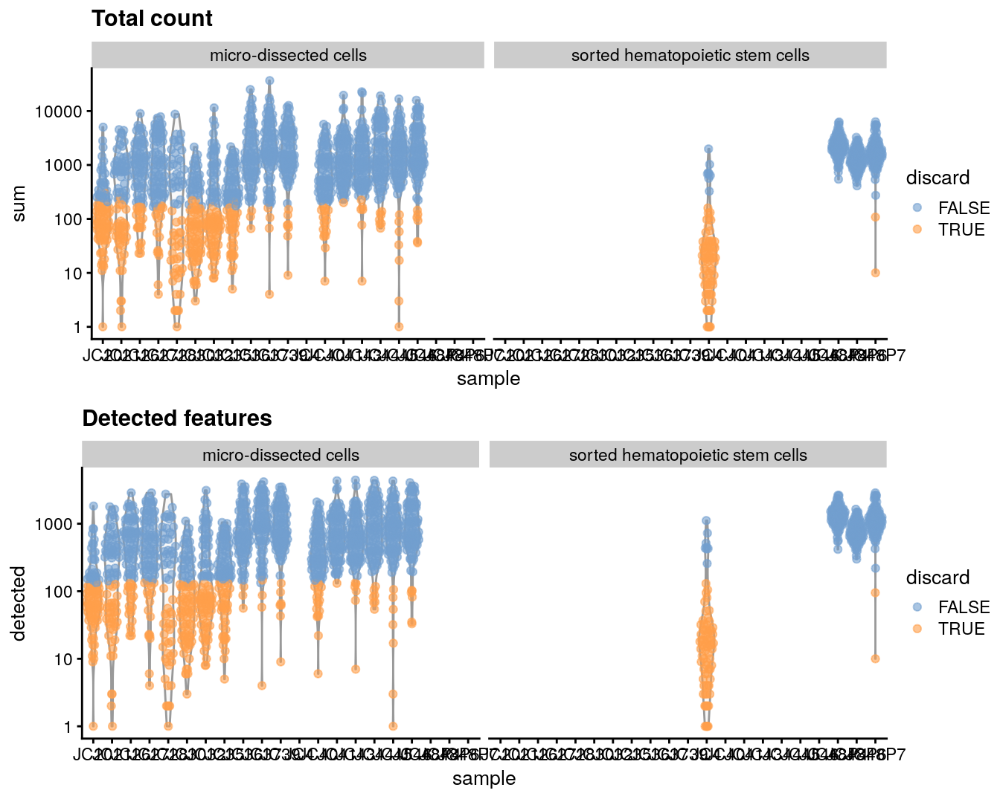
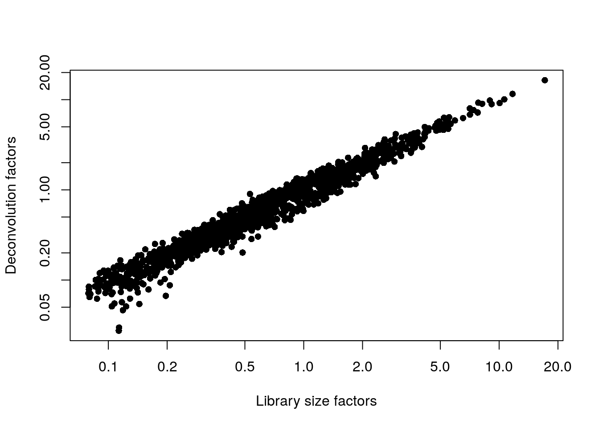
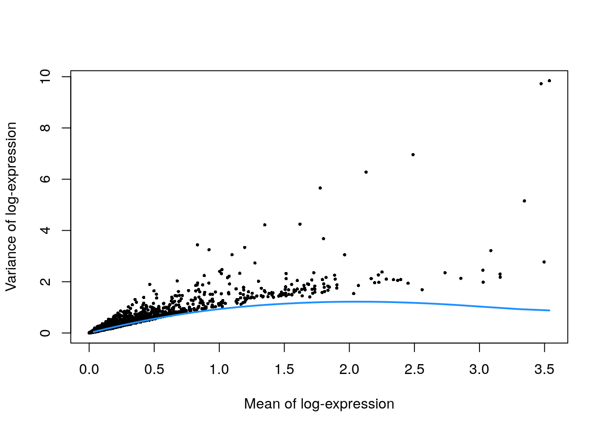
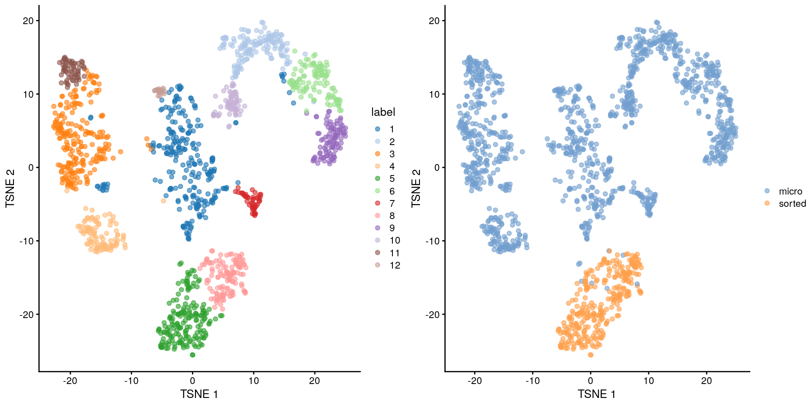
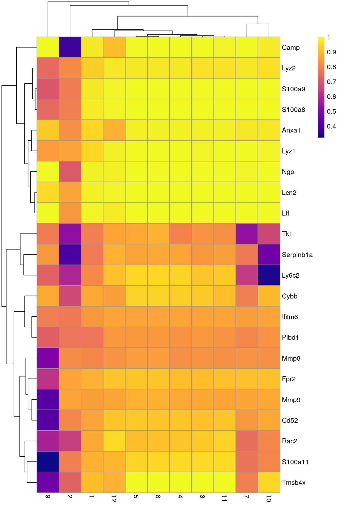

# Grun mouse HSC (CEL-seq) {#merged-hcsc}

<script>
document.addEventListener("click", function (event) {
    if (event.target.classList.contains("aaron-collapse")) {
        event.target.classList.toggle("active");
        var content = event.target.nextElementSibling;
        if (content.style.display === "block") {
            content.style.display = "none";
        } else {
            content.style.display = "block";
        }
    }
})
</script>

<style>
.aaron-collapse {
  background-color: #eee;
  color: #444;
  cursor: pointer;
  padding: 18px;
  width: 100%;
  border: none;
  text-align: left;
  outline: none;
  font-size: 15px;
}

.aaron-content {
  padding: 0 18px;
  display: none;
  overflow: hidden;
  background-color: #f1f1f1;
}
</style>

## Introduction

This performs an analysis of the mouse haematopoietic stem cell (HSC) dataset generated with CEL-seq [@grun2016denovo].
Despite its name, this dataset actually contains both sorted HSCs and a population of micro-dissected bone marrow cells.

## Data loading


```r
library(scRNAseq)
sce.grun.hsc <- GrunHSCData(ensembl=TRUE)
```


```r
library(AnnotationHub)
ens.mm.v97 <- AnnotationHub()[["AH73905"]]
anno <- select(ens.mm.v97, keys=rownames(sce.grun.hsc), 
    keytype="GENEID", columns=c("SYMBOL", "SEQNAME"))
rowData(sce.grun.hsc) <- anno[match(rownames(sce.grun.hsc), anno$GENEID),]
```

After loading and annotation, we inspect the resulting `SingleCellExperiment` object:


```r
sce.grun.hsc
```

```
## class: SingleCellExperiment 
## dim: 21817 1915 
## metadata(0):
## assays(1): counts
## rownames(21817): ENSMUSG00000109644 ENSMUSG00000007777 ...
##   ENSMUSG00000055670 ENSMUSG00000039068
## rowData names(3): GENEID SYMBOL SEQNAME
## colnames(1915): JC4_349_HSC_FE_S13_ JC4_350_HSC_FE_S13_ ...
##   JC48P6_1203_HSC_FE_S8_ JC48P6_1204_HSC_FE_S8_
## colData names(2): sample protocol
## reducedDimNames(0):
## altExpNames(0):
```

## Quality control


```r
unfiltered <- sce.grun.hsc
```

For some reason, no mitochondrial transcripts are available, and we have no spike-in transcripts, so we only use the number of detected genes and the library size for quality control.
We block on the protocol used for cell extraction, ignoring the micro-dissected cells when computing this threshold.
This is based on our judgement that a majority of micro-dissected plates consist of a majority of low-quality cells, compromising the assumptions of outlier detection.


```r
library(scuttle)
stats <- perCellQCMetrics(sce.grun.hsc)
qc <- quickPerCellQC(stats, batch=sce.grun.hsc$protocol,
    subset=grepl("sorted", sce.grun.hsc$protocol))
sce.grun.hsc <- sce.grun.hsc[,!qc$discard]
```

We examine the number of cells discarded for each reason.


```r
colSums(as.matrix(qc))
```

```
##   low_lib_size low_n_features        discard 
##            465            482            488
```

We create some diagnostic plots for each metric (Figure \@ref(fig:unref-hgrun-qc-dist)).
The library sizes are unusually low for many plates of micro-dissected cells; this may be attributable to damage induced by the extraction protocol compared to cell sorting.


```r
colData(unfiltered) <- cbind(colData(unfiltered), stats)
unfiltered$discard <- qc$discard

library(scater)
gridExtra::grid.arrange(
    plotColData(unfiltered, y="sum", x="sample", colour_by="discard", 
        other_fields="protocol") + scale_y_log10() + ggtitle("Total count") +
        facet_wrap(~protocol),
    plotColData(unfiltered, y="detected", x="sample", colour_by="discard",
        other_fields="protocol") + scale_y_log10() + 
        ggtitle("Detected features") + facet_wrap(~protocol),
    ncol=1
)
```

<div class="figure">

<p class="caption">(\#fig:unref-hgrun-qc-dist)Distribution of each QC metric across cells in the Grun HSC dataset. Each point represents a cell and is colored according to whether that cell was discarded.</p>
</div>

## Normalization


```r
library(scran)
set.seed(101000110)
clusters <- quickCluster(sce.grun.hsc)
sce.grun.hsc <- computeSumFactors(sce.grun.hsc, clusters=clusters)
sce.grun.hsc <- logNormCounts(sce.grun.hsc)
```

We examine some key metrics for the distribution of size factors, and compare it to the library sizes as a sanity check (Figure \@ref(fig:unref-hgrun-norm)).


```r
summary(sizeFactors(sce.grun.hsc))
```

```
##    Min. 1st Qu.  Median    Mean 3rd Qu.    Max. 
##   0.027   0.290   0.603   1.000   1.201  16.433
```


```r
plot(librarySizeFactors(sce.grun.hsc), sizeFactors(sce.grun.hsc), pch=16,
    xlab="Library size factors", ylab="Deconvolution factors", log="xy")
```

<div class="figure">

<p class="caption">(\#fig:unref-hgrun-norm)Relationship between the library size factors and the deconvolution size factors in the Grun HSC dataset.</p>
</div>

## Variance modelling

We create a mean-variance trend based on the expectation that UMI counts have Poisson technical noise.
We do not block on sample here as we want to preserve any difference between the micro-dissected cells and the sorted HSCs.


```r
set.seed(00010101)
dec.grun.hsc <- modelGeneVarByPoisson(sce.grun.hsc) 
top.grun.hsc <- getTopHVGs(dec.grun.hsc, prop=0.1)
```

The lack of a typical "bump" shape in Figure \@ref(fig:unref-hgrun-var) is caused by the low counts.


```r
plot(dec.grun.hsc$mean, dec.grun.hsc$total, pch=16, cex=0.5,
    xlab="Mean of log-expression", ylab="Variance of log-expression")
curfit <- metadata(dec.grun.hsc)
curve(curfit$trend(x), col='dodgerblue', add=TRUE, lwd=2)
```

<div class="figure">

<p class="caption">(\#fig:unref-hgrun-var)Per-gene variance as a function of the mean for the log-expression values in the Grun HSC dataset. Each point represents a gene (black) with the mean-variance trend (blue) fitted to the simulated Poisson-distributed noise.</p>
</div>

## Dimensionality reduction


```r
set.seed(101010011)
sce.grun.hsc <- denoisePCA(sce.grun.hsc, technical=dec.grun.hsc, subset.row=top.grun.hsc)
sce.grun.hsc <- runTSNE(sce.grun.hsc, dimred="PCA")
```

We check that the number of retained PCs is sensible.


```r
ncol(reducedDim(sce.grun.hsc, "PCA"))
```

```
## [1] 9
```

## Clustering


```r
snn.gr <- buildSNNGraph(sce.grun.hsc, use.dimred="PCA")
colLabels(sce.grun.hsc) <- factor(igraph::cluster_walktrap(snn.gr)$membership)
```


```r
table(colLabels(sce.grun.hsc))
```

```
## 
##   1   2   3   4   5   6   7   8   9  10  11  12 
## 259 148 221 103 177 108  48 122  98  63  62  18
```


```r
short <- ifelse(grepl("micro", sce.grun.hsc$protocol), "micro", "sorted")
gridExtra:::grid.arrange(
    plotTSNE(sce.grun.hsc, colour_by="label"),
    plotTSNE(sce.grun.hsc, colour_by=I(short)),
    ncol=2
)
```

<div class="figure">

<p class="caption">(\#fig:unref-hgrun-tsne)Obligatory $t$-SNE plot of the Grun HSC dataset, where each point represents a cell and is colored according to the assigned cluster (left) or extraction protocol (right).</p>
</div>

## Marker gene detection


```r
markers <- findMarkers(sce.grun.hsc, test.type="wilcox", direction="up",
    row.data=rowData(sce.grun.hsc)[,"SYMBOL",drop=FALSE])
```


To illustrate the manual annotation process, we examine the marker genes for one of the clusters.
Upregulation of _Camp_, _Lcn2_, _Ltf_ and lysozyme genes indicates that this cluster contains cells of neuronal origin.


```r
chosen <- markers[['6']]
best <- chosen[chosen$Top <= 10,]
aucs <- getMarkerEffects(best, prefix="AUC")
rownames(aucs) <- best$SYMBOL

library(pheatmap)
pheatmap(aucs, color=viridis::plasma(100))
```

<div class="figure">

<p class="caption">(\#fig:unref-heat-hgrun-markers)Heatmap of the AUCs for the top marker genes in cluster 6 compared to all other clusters in the Grun HSC dataset.</p>
</div>


## Session Info {-}

<button class="aaron-collapse">View session info</button>
<div class="aaron-content">
```
R version 4.0.2 (2020-06-22)
Platform: x86_64-pc-linux-gnu (64-bit)
Running under: Ubuntu 18.04.5 LTS

Matrix products: default
BLAS:   /home/biocbuild/bbs-3.12-bioc/R/lib/libRblas.so
LAPACK: /home/biocbuild/bbs-3.12-bioc/R/lib/libRlapack.so

locale:
 [1] LC_CTYPE=en_US.UTF-8       LC_NUMERIC=C              
 [3] LC_TIME=en_US.UTF-8        LC_COLLATE=C              
 [5] LC_MONETARY=en_US.UTF-8    LC_MESSAGES=en_US.UTF-8   
 [7] LC_PAPER=en_US.UTF-8       LC_NAME=C                 
 [9] LC_ADDRESS=C               LC_TELEPHONE=C            
[11] LC_MEASUREMENT=en_US.UTF-8 LC_IDENTIFICATION=C       

attached base packages:
[1] parallel  stats4    stats     graphics  grDevices utils     datasets 
[8] methods   base     

other attached packages:
 [1] pheatmap_1.0.12             scran_1.17.15              
 [3] scater_1.17.4               ggplot2_3.3.2              
 [5] scuttle_0.99.12             AnnotationHub_2.21.2       
 [7] BiocFileCache_1.13.1        dbplyr_1.4.4               
 [9] ensembldb_2.13.1            AnnotationFilter_1.13.0    
[11] GenomicFeatures_1.41.2      AnnotationDbi_1.51.3       
[13] scRNAseq_2.3.12             SingleCellExperiment_1.11.6
[15] SummarizedExperiment_1.19.6 DelayedArray_0.15.7        
[17] matrixStats_0.56.0          Matrix_1.2-18              
[19] Biobase_2.49.0              GenomicRanges_1.41.6       
[21] GenomeInfoDb_1.25.10        IRanges_2.23.10            
[23] S4Vectors_0.27.12           BiocGenerics_0.35.4        
[25] BiocStyle_2.17.0            simpleSingleCell_1.13.16   

loaded via a namespace (and not attached):
  [1] Rtsne_0.15                    ggbeeswarm_0.6.0             
  [3] colorspace_1.4-1              ellipsis_0.3.1               
  [5] bluster_0.99.1                XVector_0.29.3               
  [7] BiocNeighbors_1.7.0           farver_2.0.3                 
  [9] bit64_4.0.2                   interactiveDisplayBase_1.27.5
 [11] codetools_0.2-16              knitr_1.29                   
 [13] Rsamtools_2.5.3               graph_1.67.1                 
 [15] shiny_1.5.0                   BiocManager_1.30.10          
 [17] compiler_4.0.2                httr_1.4.2                   
 [19] dqrng_0.2.1                   assertthat_0.2.1             
 [21] fastmap_1.0.1                 lazyeval_0.2.2               
 [23] limma_3.45.10                 later_1.1.0.1                
 [25] BiocSingular_1.5.0            htmltools_0.5.0              
 [27] prettyunits_1.1.1             tools_4.0.2                  
 [29] igraph_1.2.5                  rsvd_1.0.3                   
 [31] gtable_0.3.0                  glue_1.4.1                   
 [33] GenomeInfoDbData_1.2.3        dplyr_1.0.1                  
 [35] rappdirs_0.3.1                Rcpp_1.0.5                   
 [37] vctrs_0.3.2                   Biostrings_2.57.2            
 [39] ExperimentHub_1.15.1          rtracklayer_1.49.5           
 [41] DelayedMatrixStats_1.11.1     xfun_0.16                    
 [43] stringr_1.4.0                 ps_1.3.4                     
 [45] mime_0.9                      lifecycle_0.2.0              
 [47] irlba_2.3.3                   statmod_1.4.34               
 [49] XML_3.99-0.5                  edgeR_3.31.4                 
 [51] zlibbioc_1.35.0               scales_1.1.1                 
 [53] hms_0.5.3                     promises_1.1.1               
 [55] ProtGenerics_1.21.0           RColorBrewer_1.1-2           
 [57] yaml_2.2.1                    curl_4.3                     
 [59] memoise_1.1.0                 gridExtra_2.3                
 [61] biomaRt_2.45.2                stringi_1.4.6                
 [63] RSQLite_2.2.0                 BiocVersion_3.12.0           
 [65] highr_0.8                     BiocParallel_1.23.2          
 [67] rlang_0.4.7                   pkgconfig_2.0.3              
 [69] bitops_1.0-6                  evaluate_0.14                
 [71] lattice_0.20-41               purrr_0.3.4                  
 [73] labeling_0.3                  GenomicAlignments_1.25.3     
 [75] CodeDepends_0.6.5             cowplot_1.0.0                
 [77] bit_4.0.4                     processx_3.4.3               
 [79] tidyselect_1.1.0              magrittr_1.5                 
 [81] bookdown_0.20                 R6_2.4.1                     
 [83] generics_0.0.2                DBI_1.1.0                    
 [85] pillar_1.4.6                  withr_2.2.0                  
 [87] RCurl_1.98-1.2                tibble_3.0.3                 
 [89] crayon_1.3.4                  rmarkdown_2.3                
 [91] viridis_0.5.1                 progress_1.2.2               
 [93] locfit_1.5-9.4                grid_4.0.2                   
 [95] blob_1.2.1                    callr_3.4.3                  
 [97] digest_0.6.25                 xtable_1.8-4                 
 [99] httpuv_1.5.4                  openssl_1.4.2                
[101] munsell_0.5.0                 beeswarm_0.2.3               
[103] viridisLite_0.3.0             vipor_0.4.5                  
[105] askpass_1.1                  
```
</div>
