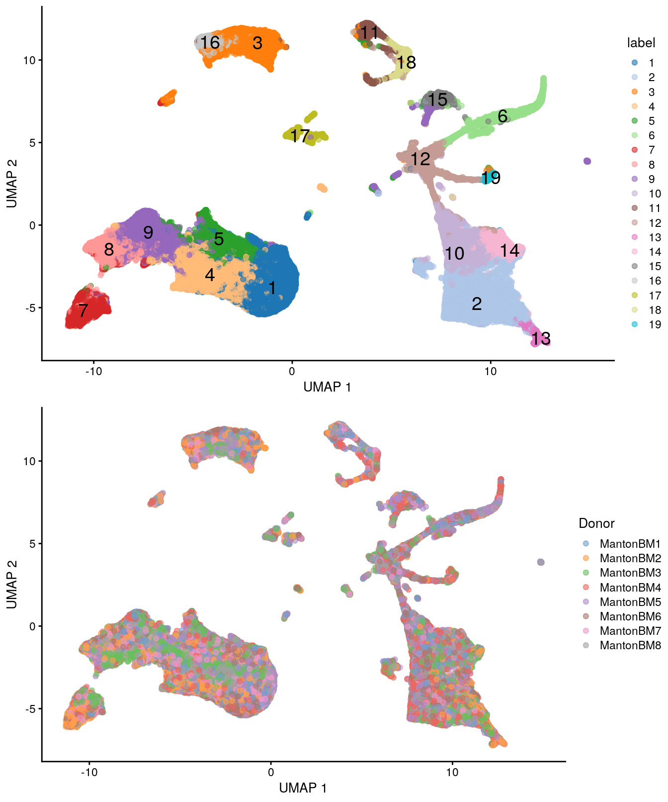

# HCA human bone marrow (10X Genomics) 

<script>
document.addEventListener("click", function (event) {
    if (event.target.classList.contains("aaron-collapse")) {
        event.target.classList.toggle("active");
        var content = event.target.nextElementSibling;
        if (content.style.display === "block") {
            content.style.display = "none";
        } else {
            content.style.display = "block";
        }
    }
})
</script>

<style>
.aaron-collapse {
  background-color: #eee;
  color: #444;
  cursor: pointer;
  padding: 18px;
  width: 100%;
  border: none;
  text-align: left;
  outline: none;
  font-size: 15px;
}

.aaron-content {
  padding: 0 18px;
  display: none;
  overflow: hidden;
  background-color: #f1f1f1;
}
</style>

## Introduction

Here, we use an example dataset from the [Human Cell Atlas immune cell profiling project on bone marrow](https://preview.data.humancellatlas.org), which contains scRNA-seq data for 380,000 cells generated using the 10X Genomics technology.
This is a fairly big dataset that represents a good use case for the techniques in Chapter \@ref(dealing-with-big-data).

## Data loading

This dataset is loaded via the *[HCAData](https://bioconductor.org/packages/3.12/HCAData)* package, which provides a ready-to-use `SingleCellExperiment` object. 


```r
library(HCAData)
sce.bone <- HCAData('ica_bone_marrow')
sce.bone$Donor <- sub("_.*", "", sce.bone$Barcode)
```

We use symbols in place of IDs for easier interpretation later.


```r
library(EnsDb.Hsapiens.v86)
rowData(sce.bone)$Chr <- mapIds(EnsDb.Hsapiens.v86, keys=rownames(sce.bone),
    column="SEQNAME", keytype="GENEID")

library(scater)
rownames(sce.bone) <- uniquifyFeatureNames(rowData(sce.bone)$ID,
    names = rowData(sce.bone)$Symbol)
```

## Quality control

Cell calling was not performed (see [here](https://s3.amazonaws.com/preview-ica-expression-data/Brief+ICA+Read+Me.pdf)) so we will perform QC using all metrics and block on the donor of origin during outlier detection.
We perform the calculation across multiple cores to speed things up.


```r
library(BiocParallel)
bpp <- MulticoreParam(8)
sce.bone <- unfiltered <- addPerCellQC(sce.bone, BPPARAM=bpp,
    subsets=list(Mito=which(rowData(sce.bone)$Chr=="MT")))

qc <- quickPerCellQC(colData(sce.bone), batch=sce.bone$Donor,
    sub.fields="subsets_Mito_percent")
sce.bone <- sce.bone[,!qc$discard]
```


```r
unfiltered$discard <- qc$discard

gridExtra::grid.arrange(
    plotColData(unfiltered, x="Donor", y="sum", colour_by="discard") +
        scale_y_log10() + ggtitle("Total count"),
    plotColData(unfiltered, x="Donor", y="detected", colour_by="discard") +
        scale_y_log10() + ggtitle("Detected features"),
    plotColData(unfiltered, x="Donor", y="subsets_Mito_percent",
        colour_by="discard") + ggtitle("Mito percent"),
    ncol=2
)
```

<div class="figure">

<p class="caption">(\#fig:unref-hca-bone-qc)Distribution of QC metrics in the HCA bone marrow dataset. Each point represents a cell and is colored according to whether it was discarded.</p>
</div>


```r
plotColData(unfiltered, x="sum", y="subsets_Mito_percent", 
    colour_by="discard") + scale_x_log10()
```

<div class="figure">

<p class="caption">(\#fig:unref-hca-bone-mito)Percentage of mitochondrial reads in each cell in the HCA bone marrow dataset compared to its total count. Each point represents a cell and is colored according to whether that cell was discarded.</p>
</div>

## Normalization

For a minor speed-up, we use already-computed library sizes rather than re-computing them from the column sums.


```r
sce.bone <- logNormCounts(sce.bone, size_factors = sce.bone$sum)
```


```r
summary(sizeFactors(sce.bone))
```

```
##    Min. 1st Qu.  Median    Mean 3rd Qu.    Max. 
##    0.05    0.47    0.65    1.00    0.89   42.38
```

## Variance modeling

We block on the donor of origin to mitigate batch effects during HVG selection.
We select a larger number of HVGs to capture any batch-specific variation that might be present.


```r
library(scran)
set.seed(1010010101)
dec.bone <- modelGeneVarByPoisson(sce.bone, 
    block=sce.bone$Donor, BPPARAM=bpp)
top.bone <- getTopHVGs(dec.bone, n=5000)
```


```r
par(mfrow=c(4,2))
blocked.stats <- dec.bone$per.block
for (i in colnames(blocked.stats)) {
    current <- blocked.stats[[i]]
    plot(current$mean, current$total, main=i, pch=16, cex=0.5,
        xlab="Mean of log-expression", ylab="Variance of log-expression")
    curfit <- metadata(current)
    curve(curfit$trend(x), col='dodgerblue', add=TRUE, lwd=2)
}
```

<div class="figure">

<p class="caption">(\#fig:unref-hca-bone-var)Per-gene variance as a function of the mean for the log-expression values in the HCA bone marrow dataset. Each point represents a gene (black) with the mean-variance trend (blue) fitted to the variances.</p>
</div>

## Data integration

Here we use multiple cores, randomized SVD and approximate nearest-neighbor detection to speed up this step.


```r
library(batchelor)
library(BiocNeighbors)

set.seed(1010001)
merged.bone <- fastMNN(sce.bone, batch = sce.bone$Donor, subset.row = top.bone,
     BSPARAM=BiocSingular::RandomParam(deferred = TRUE), 
     BNPARAM=AnnoyParam(),
     BPPARAM=bpp)

reducedDim(sce.bone, 'MNN') <- reducedDim(merged.bone, 'corrected')
```

We use the percentage of variance lost as a diagnostic measure:


```r
metadata(merged.bone)$merge.info$lost.var
```

```
##      MantonBM1 MantonBM2 MantonBM3 MantonBM4 MantonBM5 MantonBM6 MantonBM7
## [1,]  0.006925  0.006387  0.000000  0.000000  0.000000  0.000000  0.000000
## [2,]  0.006376  0.006853  0.023099  0.000000  0.000000  0.000000  0.000000
## [3,]  0.005068  0.003070  0.005132  0.019471  0.000000  0.000000  0.000000
## [4,]  0.002006  0.001873  0.001898  0.001780  0.023112  0.000000  0.000000
## [5,]  0.002445  0.002009  0.001780  0.002923  0.002634  0.023804  0.000000
## [6,]  0.003106  0.003178  0.003068  0.002581  0.003283  0.003363  0.024562
## [7,]  0.001939  0.001677  0.002427  0.002013  0.001555  0.002270  0.001969
##      MantonBM8
## [1,]   0.00000
## [2,]   0.00000
## [3,]   0.00000
## [4,]   0.00000
## [5,]   0.00000
## [6,]   0.00000
## [7,]   0.03213
```

## Dimensionality reduction

We set `external_neighbors=TRUE` to replace the internal nearest neighbor search in the UMAP implementation with our parallelized approximate search.
We also set the number of threads to be used in the UMAP iterations.


```r
set.seed(01010100)
sce.bone <- runUMAP(sce.bone, dimred="MNN",
    external_neighbors=TRUE, 
    BNPARAM=AnnoyParam(),
    BPPARAM=bpp,
    n_threads=bpnworkers(bpp))
```

## Clustering

Graph-based clustering generates an excessively large intermediate graph so we will instead use a two-step approach with $k$-means.
We generate 1000 small clusters that are subsequently aggregated into more interpretable groups with a graph-based method.


```r
set.seed(1000)
clust.bone <- clusterSNNGraph(sce.bone, use.dimred="MNN", 
    use.kmeans=TRUE, kmeans.centers=1000, k=5)
colLabels(sce.bone) <- factor(clust.bone)
table(colLabels(sce.bone))
```

```
## 
##     1     2     3     4     5     6     7     8     9    10    11    12    13 
## 65896 47244 30659 37110  7039 10193 18585 17064 26262  8870  7993  7968  3732 
##    14    15    16    17    18    19 
##  3685  4993 11048  3161  3024  2199
```

We observe mostly balanced contributions from different samples to each cluster (Figure \@ref(fig:unref-hca-bone-ab)), consistent with the expectation that all samples are replicates from different donors.


```r
tab <- table(Cluster=colLabels(sce.bone), Donor=sce.bone$Donor)
library(pheatmap)
pheatmap(log10(tab+10), color=viridis::viridis(100))
```

<div class="figure">

<p class="caption">(\#fig:unref-hca-bone-ab)Heatmap of log~10~-number of cells in each cluster (row) from each sample (column).</p>
</div>


```r
# TODO: add scrambling option in scater's plotting functions.
scrambled <- sample(ncol(sce.bone))

gridExtra::grid.arrange(
    plotUMAP(sce.bone, colour_by="label", text_by="label"),
    plotUMAP(sce.bone[,scrambled], colour_by="Donor")
)
```

<div class="figure">

<p class="caption">(\#fig:unref-hca-bone-umap)UMAP plots of the HCA bone marrow dataset after merging. Each point represents a cell and is colored according to the assigned cluster (top) or the donor of origin (bottom).</p>
</div>

## Differential expression

We identify marker genes for each cluster while blocking on the donor.


```r
markers.bone <- findMarkers(sce.bone, block = sce.bone$Donor, 
    direction = 'up', lfc = 1, BPPARAM=bpp)
```

We visualize the top markers for a randomly chosen cluster using a "dot plot" in Figure \@ref(fig:unref-hca-bone-dotplot).
The presence of upregulated genes like _LYZ_, _S100A8_ and _VCAN_ is consistent with a monocyte identity for this cluster.


```r
top.markers <- markers.bone[["2"]]
best <- top.markers[top.markers$Top <= 10,]
lfcs <- getMarkerEffects(best)

library(pheatmap)
pheatmap(lfcs, breaks=seq(-5, 5, length.out=101))
```

<div class="figure">

<p class="caption">(\#fig:unref-hca-bone-dotplot)Heatmap of log~2~-fold changes for the top marker genes (rows) of cluster 2 compared to all other clusters (columns).</p>
</div>


## Cell type classification

We perform automated cell type classification using a reference dataset to annotate each cluster based on its pseudo-bulk profile. 
This is faster than the per-cell approaches described in Chapter \@ref(cell-type-annotation) at the cost of the resolution required to detect heterogeneity inside a cluster.
Nonetheless, it is often sufficient for a quick assignment of cluster identity, and indeed, cluster 2 is also identified as consisting of monocytes from this analysis.


```r
se.aggregated <- sumCountsAcrossCells(sce.bone, id=colLabels(sce.bone))

library(celldex)
hpc <- HumanPrimaryCellAtlasData()

library(SingleR)
anno.single <- SingleR(se.aggregated, ref = hpc, labels = hpc$label.main,
    assay.type.test="sum")
anno.single
```

```
## DataFrame with 19 rows and 5 columns
##                             scores     first.labels      tuning.scores
##                           <matrix>      <character>        <DataFrame>
## 1   0.325925:0.652679:0.575563:...          T_cells 0.691160:0.1929391
## 2   0.296605:0.741579:0.529038:... Pre-B_cell_CD34- 0.565504:0.2473908
## 3   0.311871:0.672003:0.539219:...           B_cell 0.621882:0.0147466
## 4   0.335035:0.658920:0.580926:...          T_cells 0.643977:0.3972014
## 5   0.333016:0.614727:0.522212:...          T_cells 0.603456:0.4050120
## ...                            ...              ...                ...
## 15  0.380959:0.683493:0.784153:...              MEP  0.376779:0.374257
## 16  0.309959:0.666660:0.548568:...           B_cell  0.775892:0.716429
## 17  0.367825:0.654503:0.580287:...           B_cell  0.530394:0.327330
## 18  0.409967:0.708583:0.643723:... Pro-B_cell_CD34+  0.851223:0.780534
## 19  0.331292:0.671789:0.555484:... Pre-B_cell_CD34-  0.139321:0.121342
##               labels    pruned.labels
##          <character>      <character>
## 1            T_cells          T_cells
## 2           Monocyte         Monocyte
## 3             B_cell           B_cell
## 4            T_cells          T_cells
## 5            T_cells          T_cells
## ...              ...              ...
## 15        BM & Prog.       BM & Prog.
## 16            B_cell           B_cell
## 17            B_cell               NA
## 18  Pro-B_cell_CD34+ Pro-B_cell_CD34+
## 19               GMP              GMP
```


<!-- ```{r saveRDS, include=FALSE} -->
<!-- ## TEMP FIX -->
<!-- saveRDS(sce.bone, 'sce.bone.rds') -->
<!-- saveRDS(markers.bone, 'markers.bone.rds') -->

<!-- sce.bone <- readRDS('sce.bone.rds') -->
<!-- markers.bone <- readRDS('markers.bone.rds') -->
<!-- ``` -->

<!--
## Gene set Enrichment Analysis

To interpret differential expression (DE) results, gene set enrichment analysis (GSEA) can be performed to annotate DE results. The first step is to acquire a mapping of ENTREZID to gene symbol.


```r
## Get mappings of ENTREZID to Symbol
library(org.Hs.eg.db)
keys_entrez <- keys(org.Hs.eg.db, 'ENTREZID')
mapping_es <- AnnotationDbi::select(org.Hs.eg.db,
                                    keys = keys_entrez,
                                    columns = c('ENTREZID', 'SYMBOL'),
                                    keytype = 'ENTREZID')
mapping_es$ENTREZID <- as.integer(mapping_es$ENTREZID)
```

The next is to parse the gene sets (here we use a "tidy" representation of MSigDB gene sets) and remap them.


```r
## Get pathways of interest - convert to list with symbol
## devtools::install_github('stephenturner/msigdf') # "tidy" MSigDB genesets
library(msigdf)
library(dplyr)
mdb <- dplyr::inner_join(msigdf.human, mapping_es,
                         by = c('entrez' = 'ENTREZID')) %>%
    dplyr::filter(collection == 'c7') %>%
    dplyr::select(-collection, -entrez) %>%
    dplyr::group_nest(geneset)
pathways <- purrr::map(mdb$data, function(x) {
    as.character(x$SYMBOL)
})
names(pathways) <- mdb$geneset
```

Finally, the DE results from the `findMarkers()` function are used to test for differential gene set enrichment using the `fgsea` package. Here we compare cluster 3 against cluster 15, which are at opposite ends of a UMAP group.


```r
## Get stats based on markers search
## Compare cluster 3 (Dendritic cells) and 15 (HSCs)
stats <- markers.bone[[3]]$logFC.15
names(stats) <- rownames(markers.bone[[3]])

## Run fast gene set enrichment analysis
## Returns a data.table object
library(fgsea)
gse <- fgsea(pathways = pathways, 
             stats = stats,
             minSize = 15,
             maxSize = 500,
             nperm = 5000)
```

The enrichment scores of the top up and down pathways can then be plotted as a table:


```r
## Get top up and down pathways based on NES
gse.up <- gse[order(gse$NES, decreasing = TRUE)[1:2], ]$pathway
gse.dn <- gse[order(gse$NES)[1:2], ]$pathway
topPathways <- c(gse.up, rev(gse.dn))

## Plot the GSEA table
plotGseaTable(pathways[topPathways], stats,
              gse, 
              gseaParam = 0.5)
```

Or select pathways can also be plotted as a more traditional running score plot:


```r
## Traditional GSEA plot
plotEnrichment(pathways[[topPathways[1]]],
               stats)
```

### Trajectory analysis

Slingshot relies on providing a set of clusters on which to construct a trajectory.


```r
library(slingshot)

## Clusters to attempt trajectory on:
slc.clusters <- c(15, 22, 11, 7, 1, 3)

## Subsample dataset for speed
slc.dat <- sce.bone[, sce.bone$cluster %in% slc.clusters]
slc.subdat <- slc.dat[, sample(ncol(slc.dat), 20000)]

## Run slingshot
slc <- slingshot(slc.subdat,
                 clusterLabels = 'cluster',
                 reducedDim = 'UMAP')
```

The calculated principal curve can then be visualized on the UMAP space.


```r
## Slingshot trajectory plot
library(RColorBrewer)
colors <- colorRampPalette(brewer.pal(11, 'Spectral')[-6])(100)
plotcol <- colors[cut(slc$slingPseudotime_1, breaks = 100)]
plot(reducedDims(slc)$UMAP, col = plotcol, pch=16, asp = 1)
lines(SlingshotDataSet(slc), lwd = 2, col = 'black')
```
-->

## Session Info {-}

<button class="aaron-collapse">View session info</button>
<div class="aaron-content">
```
R version 4.0.2 (2020-06-22)
Platform: x86_64-pc-linux-gnu (64-bit)
Running under: Ubuntu 18.04.4 LTS

Matrix products: default
BLAS:   /home/biocbuild/bbs-3.12-bioc/R/lib/libRblas.so
LAPACK: /home/biocbuild/bbs-3.12-bioc/R/lib/libRlapack.so

locale:
 [1] LC_CTYPE=en_US.UTF-8       LC_NUMERIC=C              
 [3] LC_TIME=en_US.UTF-8        LC_COLLATE=C              
 [5] LC_MONETARY=en_US.UTF-8    LC_MESSAGES=en_US.UTF-8   
 [7] LC_PAPER=en_US.UTF-8       LC_NAME=C                 
 [9] LC_ADDRESS=C               LC_TELEPHONE=C            
[11] LC_MEASUREMENT=en_US.UTF-8 LC_IDENTIFICATION=C       

attached base packages:
[1] parallel  stats4    stats     graphics  grDevices utils     datasets 
[8] methods   base     

other attached packages:
 [1] SingleR_1.3.6               celldex_0.99.1             
 [3] pheatmap_1.0.12             BiocNeighbors_1.7.0        
 [5] batchelor_1.5.1             scran_1.17.3               
 [7] BiocParallel_1.23.0         scater_1.17.2              
 [9] ggplot2_3.3.2               EnsDb.Hsapiens.v86_2.99.0  
[11] ensembldb_2.13.1            AnnotationFilter_1.13.0    
[13] GenomicFeatures_1.41.0      AnnotationDbi_1.51.1       
[15] rhdf5_2.33.4                HCAData_1.5.1              
[17] SingleCellExperiment_1.11.6 SummarizedExperiment_1.19.5
[19] DelayedArray_0.15.6         matrixStats_0.56.0         
[21] Matrix_1.2-18               Biobase_2.49.0             
[23] GenomicRanges_1.41.5        GenomeInfoDb_1.25.5        
[25] IRanges_2.23.10             S4Vectors_0.27.12          
[27] BiocGenerics_0.35.4         BiocStyle_2.17.0           
[29] simpleSingleCell_1.13.5    

loaded via a namespace (and not attached):
  [1] AnnotationHub_2.21.1          BiocFileCache_1.13.0         
  [3] igraph_1.2.5                  lazyeval_0.2.2               
  [5] digest_0.6.25                 htmltools_0.5.0              
  [7] viridis_0.5.1                 magrittr_1.5                 
  [9] memoise_1.1.0                 limma_3.45.7                 
 [11] Biostrings_2.57.2             askpass_1.1                  
 [13] prettyunits_1.1.1             colorspace_1.4-1             
 [15] blob_1.2.1                    rappdirs_0.3.1               
 [17] xfun_0.15                     dplyr_1.0.0                  
 [19] callr_3.4.3                   crayon_1.3.4                 
 [21] RCurl_1.98-1.2                graph_1.67.1                 
 [23] glue_1.4.1                    gtable_0.3.0                 
 [25] zlibbioc_1.35.0               XVector_0.29.3               
 [27] BiocSingular_1.5.0            Rhdf5lib_1.11.2              
 [29] HDF5Array_1.17.3              scales_1.1.1                 
 [31] DBI_1.1.0                     edgeR_3.31.4                 
 [33] Rcpp_1.0.4.6                  viridisLite_0.3.0            
 [35] xtable_1.8-4                  progress_1.2.2               
 [37] dqrng_0.2.1                   bit_1.1-15.2                 
 [39] rsvd_1.0.3                    httr_1.4.1                   
 [41] RColorBrewer_1.1-2            ellipsis_0.3.1               
 [43] pkgconfig_2.0.3               XML_3.99-0.3                 
 [45] farver_2.0.3                  scuttle_0.99.10              
 [47] CodeDepends_0.6.5             uwot_0.1.8                   
 [49] dbplyr_1.4.4                  locfit_1.5-9.4               
 [51] tidyselect_1.1.0              labeling_0.3                 
 [53] rlang_0.4.6                   later_1.1.0.1                
 [55] munsell_0.5.0                 BiocVersion_3.12.0           
 [57] tools_4.0.2                   generics_0.0.2               
 [59] RSQLite_2.2.0                 ExperimentHub_1.15.0         
 [61] evaluate_0.14                 stringr_1.4.0                
 [63] fastmap_1.0.1                 yaml_2.2.1                   
 [65] processx_3.4.2                knitr_1.29                   
 [67] bit64_0.9-7                   purrr_0.3.4                  
 [69] mime_0.9                      biomaRt_2.45.1               
 [71] compiler_4.0.2                beeswarm_0.2.3               
 [73] curl_4.3                      interactiveDisplayBase_1.27.5
 [75] tibble_3.0.1                  statmod_1.4.34               
 [77] stringi_1.4.6                 highr_0.8                    
 [79] ps_1.3.3                      RSpectra_0.16-0              
 [81] lattice_0.20-41               ProtGenerics_1.21.0          
 [83] vctrs_0.3.1                   pillar_1.4.4                 
 [85] lifecycle_0.2.0               rhdf5filters_1.1.1           
 [87] BiocManager_1.30.10           cowplot_1.0.0                
 [89] bitops_1.0-6                  irlba_2.3.3                  
 [91] httpuv_1.5.4                  rtracklayer_1.49.3           
 [93] R6_2.4.1                      bookdown_0.20                
 [95] promises_1.1.1                gridExtra_2.3                
 [97] vipor_0.4.5                   codetools_0.2-16             
 [99] assertthat_0.2.1              openssl_1.4.2                
[101] withr_2.2.0                   GenomicAlignments_1.25.3     
[103] Rsamtools_2.5.3               GenomeInfoDbData_1.2.3       
[105] hms_0.5.3                     grid_4.0.2                   
[107] rmarkdown_2.3                 DelayedMatrixStats_1.11.1    
[109] shiny_1.5.0                   ggbeeswarm_0.6.0             
```
</div>
