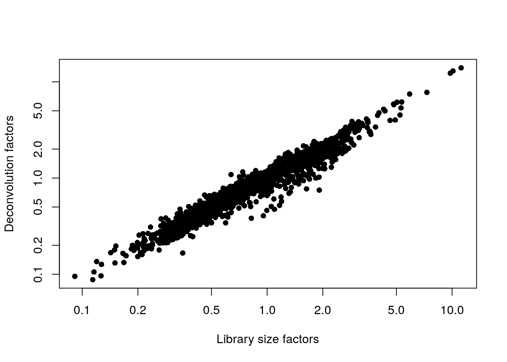

# Muraro human pancreas (CEL-seq)

<script>
document.addEventListener("click", function (event) {
    if (event.target.classList.contains("rebook-collapse")) {
        event.target.classList.toggle("active");
        var content = event.target.nextElementSibling;
        if (content.style.display === "block") {
            content.style.display = "none";
        } else {
            content.style.display = "block";
        }
    }
})
</script>

<style>
.rebook-collapse {
  background-color: #eee;
  color: #444;
  cursor: pointer;
  padding: 18px;
  width: 100%;
  border: none;
  text-align: left;
  outline: none;
  font-size: 15px;
}

.rebook-content {
  padding: 0 18px;
  display: none;
  overflow: hidden;
  background-color: #f1f1f1;
}
</style>

## Introduction

This performs an analysis of the @muraro2016singlecell CEL-seq dataset,
consisting of human pancreas cells from various donors.

## Data loading


```r
library(scRNAseq)
sce.muraro <- MuraroPancreasData()
```

Converting back to Ensembl identifiers.


```r
library(AnnotationHub)
edb <- AnnotationHub()[["AH73881"]]
gene.symb <- sub("__chr.*$", "", rownames(sce.muraro))
gene.ids <- mapIds(edb, keys=gene.symb, 
    keytype="SYMBOL", column="GENEID")

# Removing duplicated genes or genes without Ensembl IDs.
keep <- !is.na(gene.ids) & !duplicated(gene.ids)
sce.muraro <- sce.muraro[keep,]
rownames(sce.muraro) <- gene.ids[keep]
```

## Quality control


```r
unfiltered <- sce.muraro
```

This dataset lacks mitochondrial genes so we will do without.
For the one batch that seems to have a high proportion of low-quality cells, we compute an appropriate filter threshold using a shared median and MAD from the other batches (Figure \@ref(fig:unref-muraro-qc-dist)).


```r
library(scater)
stats <- perCellQCMetrics(sce.muraro)
qc <- quickPerCellQC(stats, percent_subsets="altexps_ERCC_percent",
    batch=sce.muraro$donor, subset=sce.muraro$donor!="D28")
sce.muraro <- sce.muraro[,!qc$discard]
```


```r
colData(unfiltered) <- cbind(colData(unfiltered), stats)
unfiltered$discard <- qc$discard

gridExtra::grid.arrange(
    plotColData(unfiltered, x="donor", y="sum", colour_by="discard") +
        scale_y_log10() + ggtitle("Total count"),
    plotColData(unfiltered, x="donor", y="detected", colour_by="discard") +
        scale_y_log10() + ggtitle("Detected features"),
    plotColData(unfiltered, x="donor", y="altexps_ERCC_percent",
        colour_by="discard") + ggtitle("ERCC percent"),
    ncol=2
)
```

<div class="figure">

<p class="caption">(\#fig:unref-muraro-qc-dist)Distribution of each QC metric across cells from each donor in the Muraro pancreas dataset. Each point represents a cell and is colored according to whether that cell was discarded.</p>
</div>

We have a look at the causes of removal:


```r
colSums(as.matrix(qc))
```

```
##              low_lib_size            low_n_features high_altexps_ERCC_percent 
##                       663                       700                       738 
##                   discard 
##                       773
```

## Normalization


```r
library(scran)
set.seed(1000)
clusters <- quickCluster(sce.muraro)
sce.muraro <- computeSumFactors(sce.muraro, clusters=clusters)
sce.muraro <- logNormCounts(sce.muraro)
```


```r
summary(sizeFactors(sce.muraro))
```

```
##    Min. 1st Qu.  Median    Mean 3rd Qu.    Max. 
##   0.088   0.541   0.821   1.000   1.211  13.987
```


```r
plot(librarySizeFactors(sce.muraro), sizeFactors(sce.muraro), pch=16,
    xlab="Library size factors", ylab="Deconvolution factors", log="xy")
```

<div class="figure">

<p class="caption">(\#fig:unref-muraro-norm)Relationship between the library size factors and the deconvolution size factors in the Muraro pancreas dataset.</p>
</div>

## Variance modelling

We block on a combined plate and donor factor.


```r
block <- paste0(sce.muraro$plate, "_", sce.muraro$donor)
dec.muraro <- modelGeneVarWithSpikes(sce.muraro, "ERCC", block=block)
top.muraro <- getTopHVGs(dec.muraro, prop=0.1)
```


```r
par(mfrow=c(8,4))
blocked.stats <- dec.muraro$per.block
for (i in colnames(blocked.stats)) {
    current <- blocked.stats[[i]]
    plot(current$mean, current$total, main=i, pch=16, cex=0.5,
        xlab="Mean of log-expression", ylab="Variance of log-expression")
    curfit <- metadata(current)
    points(curfit$mean, curfit$var, col="red", pch=16)
    curve(curfit$trend(x), col='dodgerblue', add=TRUE, lwd=2)
}
```

<div class="figure">

<p class="caption">(\#fig:unref-muraro-variance)Per-gene variance as a function of the mean for the log-expression values in the Muraro pancreas dataset. Each point represents a gene (black) with the mean-variance trend (blue) fitted to the spike-in transcripts (red) separately for each donor.</p>
</div>

## Data integration


```r
library(batchelor)
set.seed(1001010)
merged.muraro <- fastMNN(sce.muraro, subset.row=top.muraro, 
    batch=sce.muraro$donor)
```

We use the proportion of variance lost as a diagnostic measure:


```r
metadata(merged.muraro)$merge.info$lost.var
```

```
##           D28      D29      D30     D31
## [1,] 0.060847 0.024121 0.000000 0.00000
## [2,] 0.002646 0.003018 0.062421 0.00000
## [3,] 0.003449 0.002641 0.002598 0.08162
```

## Dimensionality reduction


```r
set.seed(100111)
merged.muraro <- runTSNE(merged.muraro, dimred="corrected")
```

## Clustering


```r
snn.gr <- buildSNNGraph(merged.muraro, use.dimred="corrected")
colLabels(merged.muraro) <- factor(igraph::cluster_walktrap(snn.gr)$membership)
```


```r
tab <- table(Cluster=colLabels(merged.muraro), CellType=sce.muraro$label)
library(pheatmap)
pheatmap(log10(tab+10), color=viridis::viridis(100))
```

<div class="figure">

<p class="caption">(\#fig:unref-seger-heat)Heatmap of the frequency of cells from each cell type label in each cluster.</p>
</div>


```r
table(Cluster=colLabels(merged.muraro), Donor=merged.muraro$batch)
```

```
##        Donor
## Cluster D28 D29 D30 D31
##      1  104   6  57 112
##      2   59  21  77  97
##      3   12  75  64  43
##      4   28 149 126 120
##      5   87 261 277 214
##      6   21   7  54  26
##      7    1   6   6  37
##      8    6   6   5   2
##      9   11  68   5  30
##      10   4   2   5   8
```


```r
gridExtra::grid.arrange(
    plotTSNE(merged.muraro, colour_by="label"),
    plotTSNE(merged.muraro, colour_by="batch"),
    ncol=2
)
```

<div class="figure">

<p class="caption">(\#fig:unref-muraro-tsne)Obligatory $t$-SNE plots of the Muraro pancreas dataset. Each point represents a cell that is colored by cluster (left) or batch (right).</p>
</div>

## Session Info {-}

<button class="rebook-collapse">View session info</button>
<div class="rebook-content">
```
R version 4.0.0 Patched (2020-05-01 r78341)
Platform: x86_64-pc-linux-gnu (64-bit)
Running under: Ubuntu 18.04.5 LTS

Matrix products: default
BLAS:   /home/luna/Software/R/R-4-0-branch-dev/lib/libRblas.so
LAPACK: /home/luna/Software/R/R-4-0-branch-dev/lib/libRlapack.so

locale:
 [1] LC_CTYPE=en_US.UTF-8       LC_NUMERIC=C              
 [3] LC_TIME=en_US.UTF-8        LC_COLLATE=en_US.UTF-8    
 [5] LC_MONETARY=en_US.UTF-8    LC_MESSAGES=en_US.UTF-8   
 [7] LC_PAPER=en_US.UTF-8       LC_NAME=C                 
 [9] LC_ADDRESS=C               LC_TELEPHONE=C            
[11] LC_MEASUREMENT=en_US.UTF-8 LC_IDENTIFICATION=C       

attached base packages:
[1] parallel  stats4    stats     graphics  grDevices utils     datasets 
[8] methods   base     

other attached packages:
 [1] pheatmap_1.0.12             batchelor_1.5.2            
 [3] scran_1.17.15               scater_1.17.4              
 [5] ggplot2_3.3.2               ensembldb_2.13.1           
 [7] AnnotationFilter_1.13.0     GenomicFeatures_1.41.2     
 [9] AnnotationDbi_1.51.3        AnnotationHub_2.21.2       
[11] BiocFileCache_1.13.1        dbplyr_1.4.4               
[13] scRNAseq_2.3.12             SingleCellExperiment_1.11.6
[15] SummarizedExperiment_1.19.6 DelayedArray_0.15.7        
[17] matrixStats_0.56.0          Matrix_1.2-18              
[19] Biobase_2.49.0              GenomicRanges_1.41.6       
[21] GenomeInfoDb_1.25.10        IRanges_2.23.10            
[23] S4Vectors_0.27.12           BiocGenerics_0.35.4        
[25] BiocStyle_2.17.0            rebook_0.99.4              

loaded via a namespace (and not attached):
  [1] Rtsne_0.15                    ggbeeswarm_0.6.0             
  [3] colorspace_1.4-1              ellipsis_0.3.1               
  [5] scuttle_0.99.13               bluster_0.99.1               
  [7] XVector_0.29.3                BiocNeighbors_1.7.0          
  [9] farver_2.0.3                  bit64_4.0.2                  
 [11] interactiveDisplayBase_1.27.5 codetools_0.2-16             
 [13] knitr_1.29                    Rsamtools_2.5.3              
 [15] graph_1.67.1                  shiny_1.5.0                  
 [17] BiocManager_1.30.10           compiler_4.0.0               
 [19] httr_1.4.2                    dqrng_0.2.1                  
 [21] assertthat_0.2.1              fastmap_1.0.1                
 [23] lazyeval_0.2.2                limma_3.45.10                
 [25] later_1.1.0.1                 BiocSingular_1.5.0           
 [27] htmltools_0.5.0               prettyunits_1.1.1            
 [29] tools_4.0.0                   igraph_1.2.5                 
 [31] rsvd_1.0.3                    gtable_0.3.0                 
 [33] glue_1.4.1                    GenomeInfoDbData_1.2.3       
 [35] dplyr_1.0.1                   rappdirs_0.3.1               
 [37] Rcpp_1.0.5                    vctrs_0.3.2                  
 [39] Biostrings_2.57.2             ExperimentHub_1.15.1         
 [41] rtracklayer_1.49.5            DelayedMatrixStats_1.11.1    
 [43] xfun_0.16                     stringr_1.4.0                
 [45] ps_1.3.4                      mime_0.9                     
 [47] lifecycle_0.2.0               irlba_2.3.3                  
 [49] statmod_1.4.34                XML_3.99-0.5                 
 [51] edgeR_3.31.4                  zlibbioc_1.35.0              
 [53] scales_1.1.1                  hms_0.5.3                    
 [55] promises_1.1.1                ProtGenerics_1.21.0          
 [57] RColorBrewer_1.1-2            yaml_2.2.1                   
 [59] curl_4.3                      memoise_1.1.0                
 [61] gridExtra_2.3                 biomaRt_2.45.2               
 [63] stringi_1.4.6                 RSQLite_2.2.0                
 [65] highr_0.8                     BiocVersion_3.12.0           
 [67] BiocParallel_1.23.2           rlang_0.4.7                  
 [69] pkgconfig_2.0.3               bitops_1.0-6                 
 [71] evaluate_0.14                 lattice_0.20-41              
 [73] purrr_0.3.4                   labeling_0.3                 
 [75] GenomicAlignments_1.25.3      CodeDepends_0.6.5            
 [77] cowplot_1.0.0                 bit_4.0.4                    
 [79] processx_3.4.3                tidyselect_1.1.0             
 [81] magrittr_1.5                  bookdown_0.20                
 [83] R6_2.4.1                      generics_0.0.2               
 [85] DBI_1.1.0                     pillar_1.4.6                 
 [87] withr_2.2.0                   RCurl_1.98-1.2               
 [89] tibble_3.0.3                  crayon_1.3.4                 
 [91] rmarkdown_2.3                 viridis_0.5.1                
 [93] progress_1.2.2                locfit_1.5-9.4               
 [95] grid_4.0.0                    blob_1.2.1                   
 [97] callr_3.4.3                   digest_0.6.25                
 [99] xtable_1.8-4                  httpuv_1.5.4                 
[101] openssl_1.4.2                 munsell_0.5.0                
[103] beeswarm_0.2.3                viridisLite_0.3.0            
[105] vipor_0.4.5                   askpass_1.1                  
```
</div>
