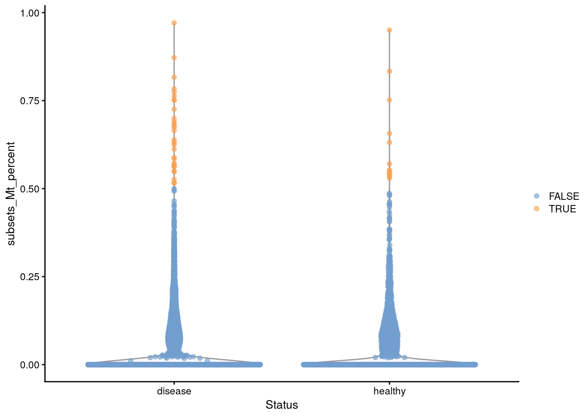
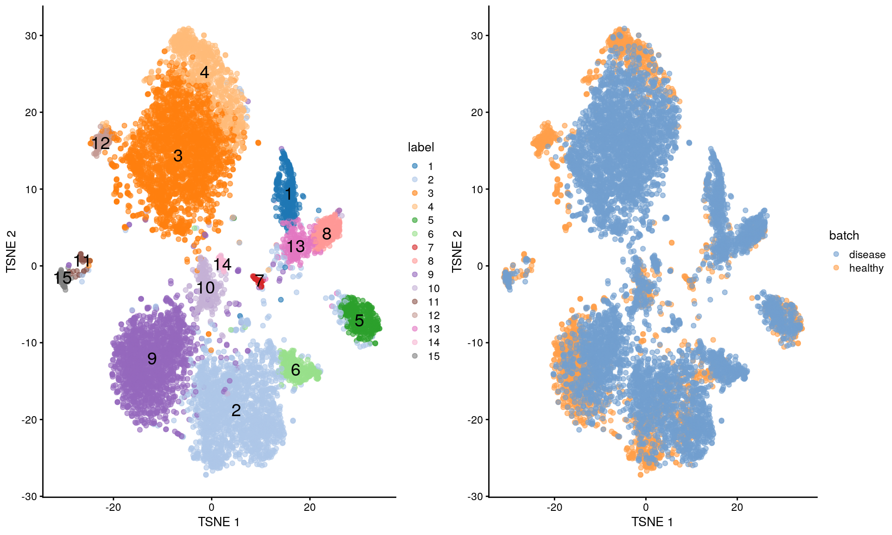
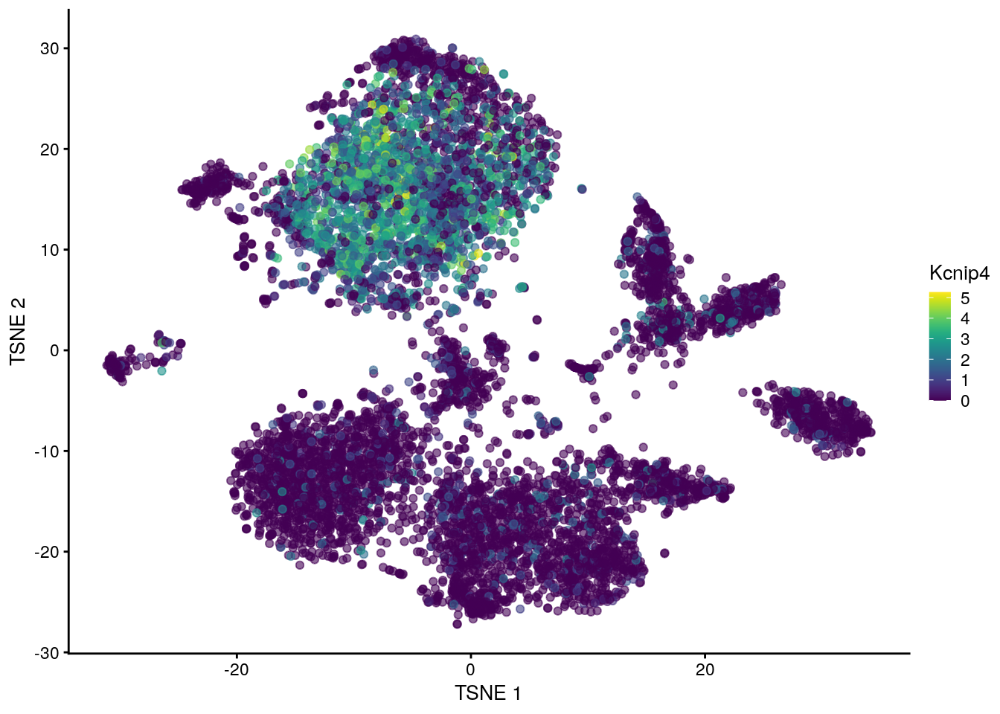

# Single-nuclei RNA-seq processing

<script>
document.addEventListener("click", function (event) {
    if (event.target.classList.contains("aaron-collapse")) {
        event.target.classList.toggle("active");
        var content = event.target.nextElementSibling;
        if (content.style.display === "block") {
            content.style.display = "none";
        } else {
            content.style.display = "block";
        }
    }
})
</script>

<style>
.aaron-collapse {
  background-color: #eee;
  color: #444;
  cursor: pointer;
  padding: 18px;
  width: 100%;
  border: none;
  text-align: left;
  outline: none;
  font-size: 15px;
}

.aaron-content {
  padding: 0 18px;
  display: none;
  overflow: hidden;
  background-color: #f1f1f1;
}
</style>

## Introduction

Single-nuclei RNA-seq (snRNA-seq) provides another strategy for performing single-cell transcriptomics where individual nuclei instead of cells are captured and sequenced.
The major advantage of snRNA-seq over scRNA-seq is that the former does not require the preservation of cellular integrity during sample preparation, especially dissociation.
We only need to extract nuclei in an intact state, meaning that snRNA-seq can be applied to cell types, tissues and samples that are not amenable to dissociation and later processing.
The cost of this flexibility is the loss of transcripts that are primarily located in the cytoplasm, potentially limiting the availability of biological signal for genes with little nuclear localization.

The computational analysis of snRNA-seq data is very much like that of scRNA-seq data.
We have a matrix of (UMI) counts for genes by cells that requires quality control, normalization and so on.
(Technically, the columsn correspond to nuclei but we will use these two terms interchangeably in this chapter.)
In fact, the biggest difference in processing occurs in the construction of the count matrix itself, where intronic regions must be included in the annotation for each gene to account for the increased abundance of unspliced transcripts.
The rest of the analysis only requires a few minor adjustments to account for the loss of cytoplasmic transcripts.
We demonstrate using a dataset from @wu2019advantages involving snRNA-seq on healthy and fibrotic mouse kidneys.


```r
library(scRNAseq)
sce <- WuKidneyData()
sce <- sce[,sce$Technology=="sNuc-10x"]
sce
```

```
## class: SingleCellExperiment 
## dim: 18249 8231 
## metadata(0):
## assays(1): counts
## rownames(18249): mt-Cytb mt-Nd6 ... Gm44613 Gm38304
## rowData names(0):
## colnames(8231): sNuc-10x_AAACCTGAGTCCGGTC sNuc-10x_AAACCTGCACAGACAG ...
##   UUO_TTGCCGTCACAAGACG UUO_TTTGTCATCTGCTGTC
## colData names(2): Technology Status
## reducedDimNames(0):
## altExpNames(0):
```

## Quality control for stripped nuclei

The loss of the cytoplasm means that the stripped nuclei should not contain any mitochondrial transcripts.
This means that the mitochondrial proportion becomes an excellent QC metric for the efficacy of the stripping process.
Unlike scRNA-seq, there is no need to worry about variations in mitochondrial content due to genuine biology.
High-quality nuclei should not contain any mitochondrial transcripts; the presence of any mitochondrial counts in a library indicates that the removal of the cytoplasm was not complete, possibly introducing irrelevant heterogeneity in downstream analyses.


```r
library(scuttle)
sce <- addPerCellQC(sce, subsets=list(Mt=grep("^mt-", rownames(sce))))
summary(sce$subsets_Mt_percent == 0)
```

```
##    Mode   FALSE    TRUE 
## logical    2264    5967
```

We apply a simple filter to remove libraries corresponding to incompletely stripped nuclei.
The outlier-based approach described in Section \@ref(quality-control) can be used here, but some caution is required in low-coverage experiments where a majority of cells have zero mitochondrial counts.
In such cases, the MAD may also be zero such that other libraries with very low but non-zero mitochondrial counts are removed.
This is typically too conservative as such transcripts may be present due to sporadic ambient contamination rather than incomplete stripping.


```r
stats <- quickPerCellQC(colData(sce), sub.fields="subsets_Mt_percent")
colSums(as.matrix(stats))
```

```
##            low_lib_size          low_n_features high_subsets_Mt_percent 
##                       0                       0                    2264 
##                 discard 
##                    2264
```

Instead, we enforce a minimum difference between the threshold and the median in `isOutlier()` (Figure \@ref(fig:nuclei-qc)).
We arbitrarily choose +0.5% here, which takes precedence over the outlier-based threshold if the latter is too low.
In this manner, we avoid discarding libraries with a very modest amount of contamination; the same code will automatically fall back to the outlier-based threshold in datasets where the stripping was systematically less effective.


```r
stats$high_subsets_Mt_percent <- isOutlier(sce$subsets_Mt_percent, 
    type="higher", min.diff=0.5)
stats$discard <- Reduce("|", stats[,colnames(stats)!="discard"])
colSums(as.matrix(stats))
```

```
##            low_lib_size          low_n_features high_subsets_Mt_percent 
##                       0                       0                      42 
##                 discard 
##                      42
```

```r
library(scater)
plotColData(sce, x="Status", y="subsets_Mt_percent",
    colour_by=I(stats$high_subsets_Mt_percent))
```

<div class="figure">

<p class="caption">(\#fig:nuclei-qc)Distribution of the mitochondrial proportions in the Wu kidney dataset. Each point represents a cell and is colored according to whether it was considered to be of low quality and discarded.</p>
</div>

## Comments on downstream analyses

The rest of the analysis can then be performed using the same strategies discussed for scRNA-seq (Figure \@ref(fig:nuclei-tsne)).
Despite the loss of cytoplasmic transcripts, there is usually still enough biological signal to characterize population heterogeneity [@bakken2018single;@wu2019advantages].
In fact, one could even say that snRNA-seq has a higher signal-to-noise ratio as sequencing coverage is not spent on highly abundant but typically uninteresting transcripts for mitochondrial and ribosomal protein genes.
It also has the not inconsiderable advantage of being able to recover subpopulations that are not amenable to dissociation and would be lost by scRNA-seq protocols.


```r
library(scran)
set.seed(111)

sce <- logNormCounts(sce[,!stats$discard])
dec <- modelGeneVarByPoisson(sce)
sce <- runPCA(sce, subset_row=getTopHVGs(dec, n=4000))
sce <- runTSNE(sce, dimred="PCA")

library(bluster)
colLabels(sce) <- clusterRows(reducedDim(sce, "PCA"), NNGraphParam())
gridExtra::grid.arrange(
    plotTSNE(sce, colour_by="label", text_by="label"),
    plotTSNE(sce, colour_by="Status"),
    ncol=2
)    
```

<div class="figure">

<p class="caption">(\#fig:nuclei-tsne)$t$-SNE plots of the Wu kidney dataset. Each point is a cell and is colored by its cluster assignment (left) or its disease status (right).</p>
</div>

We can also apply more complex procedures such as batch correction (Section \@ref(integrating-datasets)).
Here, we eliminate the disease effect to identify shared clusters (Figure \@ref(fig:nuclei-tsne-merged)).


```r
library(batchelor)
set.seed(1101)

merged <- multiBatchNorm(sce, batch=sce$Status)
merged <- correctExperiments(merged, batch=merged$Status, PARAM=FastMnnParam())
merged <- runTSNE(merged, dimred="corrected")
colLabels(merged) <- clusterRows(reducedDim(merged, "corrected"), NNGraphParam())

gridExtra::grid.arrange(
    plotTSNE(merged, colour_by="label", text_by="label"),
    plotTSNE(merged, colour_by="batch"),
    ncol=2
)
```

<div class="figure">

<p class="caption">(\#fig:nuclei-tsne-merged)More $t$-SNE plots of the Wu kidney dataset after applying MNN correction across diseases.</p>
</div>

Similarly, we can perform marker detection on the snRNA-seq expression values as discussed in Section \@ref(marker-detection).
For the most part, interpretation of these DE results makes the simplifying assumption that nuclear abundances are a good proxy for the overall expression profile.
This is generally reasonable but may not always be true, resulting in some discrepancies in the marker sets between snRNA-seq and scRNA-seq datasets.
For example, transcripts for strongly expressed genes are more likely to localize to the cytoplasm for efficient translation and subsequently lost upon stripping, while genes with the same overall expression but differences in the rate of nuclear export may appear to be differentially expressed between clusters.
In the most pathological case, higher snRNA-seq abundances may indicate nuclear sequestration of transcripts for protein-coding genes and reduced activity of the relevant biological process, contrary to the usual interpretation of the effect of upregulation.


```r
markers <- findMarkers(merged, block=merged$Status, direction="up")
markers[["3"]][1:10,1:3]
```

```
## DataFrame with 10 rows and 3 columns
##              Top      p.value          FDR
##        <integer>    <numeric>    <numeric>
## Sorcs1         1 8.31936e-262 1.51820e-258
## Ltn1           1  7.85490e-83  1.07778e-80
## Bmp6           1  0.00000e+00  0.00000e+00
## Il34           1  0.00000e+00  0.00000e+00
## Them7          1 9.46508e-208 8.22516e-205
## Pak1           1 1.35170e-184 8.22241e-182
## Kcnip4         1  0.00000e+00  0.00000e+00
## Mecom          1  5.30105e-20  7.11838e-19
## Pakap          1  0.00000e+00  0.00000e+00
## Wdr17          1 1.34668e-202 1.11707e-199
```

```r
plotTSNE(merged, colour_by="Kcnip4")
```




Other analyses described for scRNA-seq require more care when they are applied to snRNA-seq data.
Most obviously, cell type annotation based on reference profiles (Section \@ref(cell-type-annotation)) should be treated with some caution as the majority of existing references are constructed from bulk or single-cell datasets with cytoplasmic transcripts.
Interpretation of RNA velocity results may also be complicated by variation in the rate of nuclear export of spliced transcripts.

## Tricks with ambient contamination 

The expected absence of genuine mitochondrial expression can also be exploited to estimate the level of ambient contamination (Section \@ref(ambient-problems)).
We demonstrate on mouse brain snRNA-seq data from 10X Genomics [@zheng2017massively], using the raw count matrix prior to any filtering for nuclei-containing barcodes.


```r
library(BiocFileCache)
bfc <- BiocFileCache("raw_data", ask = FALSE)
raw.path <- bfcrpath(bfc, file.path("http://cf.10xgenomics.com/samples",
    "cell-exp/2.0.1/nuclei_900/nuclei_900_raw_gene_bc_matrices.tar.gz"))
untar(raw.path, exdir=file.path(tempdir(), "nuclei"))

library(DropletUtils)
fname <- file.path(tempdir(), "nuclei/raw_gene_bc_matrices/mm10")
sce.brain <- read10xCounts(fname, col.names=TRUE)
sce.brain
```

```
## class: SingleCellExperiment 
## dim: 27998 737280 
## metadata(1): Samples
## assays(1): counts
## rownames(27998): ENSMUSG00000051951 ENSMUSG00000089699 ...
##   ENSMUSG00000096730 ENSMUSG00000095742
## rowData names(2): ID Symbol
## colnames(737280): AAACCTGAGAAACCAT-1 AAACCTGAGAAACCGC-1 ...
##   TTTGTCATCTTTAGTC-1 TTTGTCATCTTTCCTC-1
## colData names(2): Sample Barcode
## reducedDimNames(0):
## altExpNames(0):
```

We call non-empty droplets using `emptyDrops()` as previously described (Section \@ref(qc-droplets)). 


```r
library(DropletUtils)
e.out <- emptyDrops(counts(sce.brain))
summary(e.out$FDR <= 0.001)
```

```
##    Mode   FALSE    TRUE    NA's 
## logical    2324    1712  733244
```

If our libraries are of high quality, we can assume that any mitochondrial "expression" is due to contamination from the ambient solution.
We then use the `controlAmbience()` function to estimate the proportion of ambient contamination for each gene, allowing us to mark potentially problematic genes in the DE results (Figure \@ref(fig:nuclei-contamination)).
In fact, we can use this information even earlier to remove these genes during dimensionality reduction and clustering.
This is not generally possible for scRNA-seq as any notable contaminating transcripts may originate from a subpopulation that actually expresses that gene and thus cannot be blindly removed.


```r
ambient <- estimateAmbience(counts(sce.brain), round=FALSE, good.turing=FALSE)
nuclei <- rowSums(counts(sce.brain)[,which(e.out$FDR <= 0.001)])

is.mito <- grepl("mt-", rowData(sce.brain)$Symbol)
contam <- controlAmbience(nuclei, ambient, features=is.mito, mode="proportion")

plot(log10(nuclei+1), contam*100, col=ifelse(is.mito, "red", "grey"), pch=16,
    xlab="Log-nuclei expression", ylab="Contamination (%)")
```

<div class="figure">

<p class="caption">(\#fig:nuclei-contamination)Percentage of counts in the nuclei of the 10X brain dataset that are attributed to contamination from the ambient solution. Each point represents a gene and mitochondrial genes are highlighted in red.</p>
</div>

## Session Info {-}

<button class="aaron-collapse">View session info</button>
<div class="aaron-content">
```
R version 4.0.2 (2020-06-22)
Platform: x86_64-pc-linux-gnu (64-bit)
Running under: Ubuntu 18.04.5 LTS

Matrix products: default
BLAS:   /home/biocbuild/bbs-3.12-bioc/R/lib/libRblas.so
LAPACK: /home/biocbuild/bbs-3.12-bioc/R/lib/libRlapack.so

locale:
 [1] LC_CTYPE=en_US.UTF-8       LC_NUMERIC=C              
 [3] LC_TIME=en_US.UTF-8        LC_COLLATE=C              
 [5] LC_MONETARY=en_US.UTF-8    LC_MESSAGES=en_US.UTF-8   
 [7] LC_PAPER=en_US.UTF-8       LC_NAME=C                 
 [9] LC_ADDRESS=C               LC_TELEPHONE=C            
[11] LC_MEASUREMENT=en_US.UTF-8 LC_IDENTIFICATION=C       

attached base packages:
[1] parallel  stats4    stats     graphics  grDevices utils     datasets 
[8] methods   base     

other attached packages:
 [1] DropletUtils_1.9.10         BiocFileCache_1.13.1       
 [3] dbplyr_1.4.4                batchelor_1.5.2            
 [5] bluster_0.99.1              scran_1.17.15              
 [7] scater_1.17.4               ggplot2_3.3.2              
 [9] scuttle_0.99.12             scRNAseq_2.3.12            
[11] SingleCellExperiment_1.11.6 SummarizedExperiment_1.19.6
[13] DelayedArray_0.15.7         matrixStats_0.56.0         
[15] Matrix_1.2-18               Biobase_2.49.0             
[17] GenomicRanges_1.41.6        GenomeInfoDb_1.25.10       
[19] IRanges_2.23.10             S4Vectors_0.27.12          
[21] BiocGenerics_0.35.4         BiocStyle_2.17.0           
[23] simpleSingleCell_1.13.16   

loaded via a namespace (and not attached):
  [1] Rtsne_0.15                    ggbeeswarm_0.6.0             
  [3] colorspace_1.4-1              ellipsis_0.3.1               
  [5] XVector_0.29.3                BiocNeighbors_1.7.0          
  [7] farver_2.0.3                  bit64_4.0.2                  
  [9] interactiveDisplayBase_1.27.5 AnnotationDbi_1.51.3         
 [11] R.methodsS3_1.8.0             codetools_0.2-16             
 [13] knitr_1.29                    R.oo_1.23.0                  
 [15] graph_1.67.1                  shiny_1.5.0                  
 [17] HDF5Array_1.17.3              BiocManager_1.30.10          
 [19] compiler_4.0.2                httr_1.4.2                   
 [21] dqrng_0.2.1                   assertthat_0.2.1             
 [23] fastmap_1.0.1                 limma_3.45.10                
 [25] later_1.1.0.1                 BiocSingular_1.5.0           
 [27] htmltools_0.5.0               tools_4.0.2                  
 [29] rsvd_1.0.3                    igraph_1.2.5                 
 [31] gtable_0.3.0                  glue_1.4.1                   
 [33] GenomeInfoDbData_1.2.3        dplyr_1.0.1                  
 [35] rappdirs_0.3.1                Rcpp_1.0.5                   
 [37] rhdf5filters_1.1.2            vctrs_0.3.2                  
 [39] ExperimentHub_1.15.1          DelayedMatrixStats_1.11.1    
 [41] xfun_0.16                     stringr_1.4.0                
 [43] ps_1.3.4                      mime_0.9                     
 [45] lifecycle_0.2.0               irlba_2.3.3                  
 [47] statmod_1.4.34                XML_3.99-0.5                 
 [49] AnnotationHub_2.21.2          edgeR_3.31.4                 
 [51] zlibbioc_1.35.0               scales_1.1.1                 
 [53] promises_1.1.1                rhdf5_2.33.7                 
 [55] yaml_2.2.1                    curl_4.3                     
 [57] memoise_1.1.0                 gridExtra_2.3                
 [59] stringi_1.4.6                 RSQLite_2.2.0                
 [61] BiocVersion_3.12.0            highr_0.8                    
 [63] BiocParallel_1.23.2           rlang_0.4.7                  
 [65] pkgconfig_2.0.3               bitops_1.0-6                 
 [67] evaluate_0.14                 lattice_0.20-41              
 [69] Rhdf5lib_1.11.3               purrr_0.3.4                  
 [71] CodeDepends_0.6.5             labeling_0.3                 
 [73] cowplot_1.0.0                 bit_4.0.4                    
 [75] processx_3.4.3                tidyselect_1.1.0             
 [77] magrittr_1.5                  bookdown_0.20                
 [79] R6_2.4.1                      generics_0.0.2               
 [81] DBI_1.1.0                     pillar_1.4.6                 
 [83] withr_2.2.0                   RCurl_1.98-1.2               
 [85] tibble_3.0.3                  crayon_1.3.4                 
 [87] rmarkdown_2.3                 viridis_0.5.1                
 [89] locfit_1.5-9.4                grid_4.0.2                   
 [91] blob_1.2.1                    callr_3.4.3                  
 [93] digest_0.6.25                 xtable_1.8-4                 
 [95] httpuv_1.5.4                  R.utils_2.9.2                
 [97] munsell_0.5.0                 beeswarm_0.2.3               
 [99] viridisLite_0.3.0             vipor_0.4.5                  
```
</div>
