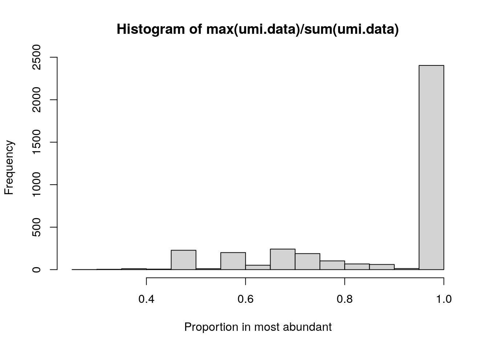

---
output:
  html_document
bibliography: ref.bib
---

# Analyzing repertoire sequencing data {#repertoire-seq}

<script>
document.addEventListener("click", function (event) {
    if (event.target.classList.contains("aaron-collapse")) {
        event.target.classList.toggle("active");
        var content = event.target.nextElementSibling;
        if (content.style.display === "block") {
            content.style.display = "none";
        } else {
            content.style.display = "block";
        }
    }
})
</script>

<style>
.aaron-collapse {
  background-color: #eee;
  color: #444;
  cursor: pointer;
  padding: 18px;
  width: 100%;
  border: none;
  text-align: left;
  outline: none;
  font-size: 15px;
}

.aaron-content {
  padding: 0 18px;
  display: none;
  overflow: hidden;
  background-color: #f1f1f1;
}
</style>

<div class="figure">

<p class="caption">(\#fig:unnamed-chunk-1)This page is under construction.</p>
</div>

## Motivation

An organism's immune repertoire is defined as the set of T and B cell subtypes that contain genetic diversity in the T cell receptor (TCR) components or immunoglobin chains, respectively.
This diversity is important for ensuring that the adaptive immune system can respond effectively to a wide range of antigens.
We can profile the immune repertoire by simply sequencing the relevant transcripts [@georgiou2014promise;@rosati2017overview], a procedure that can be combined with previously mentioned technologies [@zheng2017massively] to achieve single-cell resolution.
This data can then be used to characterize an individual's immune response based on the expansion of T or B cell clones, i.e., multiple cells with the same sequences for each TCR component or immunoglobulin chain.

By itself, single-cell repertoire sequencing data can be readily analyzed with a variety of tools such as those from the [ImmCantation suite](https://immcantation.readthedocs.io/en/stable/).
For example, the *[alakazam](https://CRAN.R-project.org/package=alakazam)* package provides functions to perform common analyses to quantify clonal diversity, reconstruct lineages, examine amino acid properties and so on.
We will not attempt to regurgitate their documentation in this chapter; rather, we will focus on how we can integrate repertoire sequencing data structures into our existing `SingleCellExperiment` framework.
This is not entirely trivial as each cell may have zero, one or multiple sequences for any given repertoire component, whereas we only obtain a single expression profile for that cell.

We would like to define a single data structure that captures both the expression profile and repertoire state for each cell.
This ensures synchronization during operations like subsetting (as previously discussed for the `SingleCellExperiment` class) and reduces book-keeping errors throughout the course of an interactive analysis.
We achieve this using the `SplitDataFrameList` class from the *[IRanges](https://bioconductor.org/packages/3.12/IRanges)* package, which allows us to accommodate repertoire sequencing data into existing Bioconductor classes while retaining compatibility with functions from external analysis tools.
We demonstrate on a publicly available 10X Genomics dataset using mouse PBMCs, for which the expression and ADT data have already been processed below:

<button class="aaron-collapse">View history</button>
<div class="aaron-content">
   
```r
#--- loading ---#
library(BiocFileCache)
bfc <- BiocFileCache(ask=FALSE)
exprs.data <- bfcrpath(bfc, file.path(
    "http://cf.10xgenomics.com/samples/cell-vdj/3.1.0",
    "vdj_v1_hs_pbmc3",
    "vdj_v1_hs_pbmc3_filtered_feature_bc_matrix.tar.gz"))
untar(exprs.data, exdir=tempdir())

library(DropletUtils)
sce.pbmc <- read10xCounts(file.path(tempdir(), "filtered_feature_bc_matrix"))
sce.pbmc <- splitAltExps(sce.pbmc, rowData(sce.pbmc)$Type)

#--- quality-control ---#
library(scater)
is.mito <- grep("^MT-", rowData(sce.pbmc)$Symbol)
stats <- perCellQCMetrics(sce.pbmc, subsets=list(Mito=is.mito))

high.mito <- isOutlier(stats$subsets_Mito_percent, type="higher")
low.adt <- stats$`altexps_Antibody Capture_detected` < nrow(altExp(sce.pbmc))/2

discard <- high.mito | low.adt
sce.pbmc <- sce.pbmc[,!discard]

#--- normalization ---#
library(scran)

set.seed(1000)
clusters <- quickCluster(sce.pbmc)
sce.pbmc <- computeSumFactors(sce.pbmc, cluster=clusters)
altExp(sce.pbmc) <- computeMedianFactors(altExp(sce.pbmc))
sce.pbmc <- logNormCounts(sce.pbmc, use_altexps=TRUE)

#--- dimensionality-reduction ---#
set.seed(100000)
altExp(sce.pbmc) <- runTSNE(altExp(sce.pbmc))

set.seed(1000000)
altExp(sce.pbmc) <- runUMAP(altExp(sce.pbmc))

#--- clustering ---#
g.adt <- buildSNNGraph(altExp(sce.pbmc), k=10, d=NA)
clust.adt <- igraph::cluster_walktrap(g.adt)$membership
colLabels(altExp(sce.pbmc)) <- factor(clust.adt)
```

</div>


```r
sce.pbmc
```

```
## class: SingleCellExperiment 
## dim: 33538 6660 
## metadata(1): Samples
## assays(2): counts logcounts
## rownames(33538): ENSG00000243485 ENSG00000237613 ... ENSG00000277475
##   ENSG00000268674
## rowData names(3): ID Symbol Type
## colnames: NULL
## colData names(3): Sample Barcode sizeFactor
## reducedDimNames(0):
## altExpNames(1): Antibody Capture
```

```r
# Moving ADT-based clustering to the top level for convenience.
colLabels(sce.pbmc) <- colLabels(altExp(sce.pbmc))
```

## Loading the TCR repertoire

First, we obtain the filtered TCR contig annotations for the same set of cells.
Each row of the resulting data frame contains information about a single TCR component sequence in one cell, broken down into the alleles of the V(D)J genes making up that component (`v_gene`, `d_gene`, `j_gene`) where possible. 
The number of reads and UMIs supporting the set of allele assignments for a cell is also shown, though only the UMI count should be used for quantifying expression of a particular TCR sequence.
Each cell is assigned to a clonotype (`raw_clonotype_id`) based on the combination of the $\alpha$-chain (TRA) and $\beta$-chain (TRB) sequences in that cell.


```r
library(BiocFileCache)
bfc <- BiocFileCache(ask=FALSE)
tcr.data <- bfcrpath(bfc, file.path(
    "http://cf.10xgenomics.com/samples/cell-vdj/3.1.0",
    "vdj_v1_hs_pbmc3/vdj_v1_hs_pbmc3_t_filtered_contig_annotations.csv"))
tcr <- read.csv(tcr.data, stringsAsFactors=FALSE)
nrow(tcr)
```

```
## [1] 10121
```

```r
head(tcr)
```

```
##              barcode is_cell                   contig_id high_confidence length
## 1 AAACCTGAGATCTGAA-1    True AAACCTGAGATCTGAA-1_contig_1            True    521
## 2 AAACCTGAGATCTGAA-1    True AAACCTGAGATCTGAA-1_contig_2            True    474
## 3 AAACCTGAGGAACTGC-1    True AAACCTGAGGAACTGC-1_contig_1            True    496
## 4 AAACCTGAGGAACTGC-1    True AAACCTGAGGAACTGC-1_contig_2            True    505
## 5 AAACCTGAGGAGTCTG-1    True AAACCTGAGGAGTCTG-1_contig_1            True    495
## 6 AAACCTGAGGAGTCTG-1    True AAACCTGAGGAGTCTG-1_contig_2            True    526
##   chain     v_gene d_gene  j_gene c_gene full_length productive
## 1   TRB   TRBV20-1   None TRBJ2-7  TRBC2        True       True
## 2   TRA   TRAV13-1   None  TRAJ44   TRAC        True       True
## 3   TRB    TRBV7-2   None TRBJ2-1  TRBC2        True       True
## 4   TRA TRAV23/DV6   None  TRAJ34   TRAC        True       True
## 5   TRA      TRAV2   None  TRAJ38   TRAC        True       True
## 6   TRB    TRBV6-2   None TRBJ1-1  TRBC1        True       True
##                 cdr3                                                cdr3_nt
## 1     CSARDKGLSYEQYF             TGCAGTGCTAGAGACAAGGGGCTTAGCTACGAGCAGTACTTC
## 2 CAASIGPLGTGTASKLTF TGTGCAGCAAGTATCGGCCCCCTAGGAACCGGCACTGCCAGTAAACTCACCTTT
## 3      CASSLGPSGEQFF                TGTGCCAGCAGCTTGGGACCATCGGGTGAGCAGTTCTTC
## 4       CAASDNTDKLIF                   TGTGCAGCAAGCGATAACACCGACAAGCTCATCTTT
## 5   CAVEANNAGNNRKLIW       TGTGCTGTGGAGGCTAATAATGCTGGCAACAACCGTAAGCTGATTTGG
## 6      CASSRTGGTEAFF                TGTGCCAGCAGTCGGACAGGGGGCACTGAAGCTTTCTTT
##   reads umis raw_clonotype_id         raw_consensus_id
## 1  9327   12     clonotype100 clonotype100_consensus_1
## 2  3440    3     clonotype100 clonotype100_consensus_2
## 3 32991   29     clonotype101 clonotype101_consensus_2
## 4 10714    9     clonotype101 clonotype101_consensus_1
## 5  1734    3     clonotype102 clonotype102_consensus_1
## 6 15530   13     clonotype102 clonotype102_consensus_2
```

The challenge in incorporating all of these data structures into a single object lies in the fact that each cell may have zero, one or many TCR sequences.
This precludes direct storage of repertoire information in the `colData()` of the `SingleCellExperiment`, which would be expecting a 1:1 mapping from each cell to each repertoire sequence.
Instead, we store the repertoire data as a `SplitDataFrameList` object where each cell is represented by a variable-row `DataFrame` containing information for zero-to-many sequences.
This is easily done by:

1. Converting our `data.frame` to a `DataFrame` from the *[S4Vectors](https://bioconductor.org/packages/3.12/S4Vectors)* package.
We demonstrate this process below for the alpha chain:

    
    ```r
    tra <- tcr[tcr$chain=="TRA",]
    tra <- DataFrame(tra)
    ```

2. Defining a factor of cell identities, using cells that are present in `sce.pbmc` as our levels.
This ensures that, in the resulting `SplitDataFrameList`, we always have one entry per cell in `sce.pbmc`,
even if those entries consist of zero-row `DataFrame`s.

    
    ```r
    cell.id <- factor(tra$barcode, sce.pbmc$Barcode)
    ```

3. Using the `split()` function to break up `tra` into one `DataFrame` per cell, forming the desired `SplitDataFrameList`.

    
    ```r
    tra.list <- split(tra, cell.id)
    class(tra.list)
    ```
    
    ```
    ## [1] "CompressedSplitDFrameList"
    ## attr(,"package")
    ## [1] "IRanges"
    ```

Put together, this is as simple as the following stretch of code (repeated for the beta chain):


```r
trb <- tcr[tcr$chain=="TRB",]
trb.list <- split(DataFrame(trb), factor(trb$barcode, sce.pbmc$Barcode))
length(trb.list)
```

```
## [1] 6660
```

Both of these objects are guaranteed to have a 1:1 mapping to the columns of `sce.pbmc`, allowing us to directly store them in the `colData` as additional metadata fields.
This ensures that any subsetting applied to the `SingleCellExperiment` is synchronized across both gene expression and repertoire data.
For example, an obvious step might be to subset `sce.pbmc` to only contain T cells so that the TCR analysis is not distorted by other irrelevant cell types.


```r
sce.pbmc$TRA <- tra.list
sce.pbmc$TRB <- trb.list
```

## Leveraging `List` semantics

At this point, it is worth spending some time on the power of the `SplitDataFrameList` and the `List` grammar.
In the simplest case, the `SplitDataFrameList` can be treated as an ordinary list of `DataFrame`s with one entry per cell.


```r
sce.pbmc$TRA[[1]] # for the first cell.
```

```
## DataFrame with 1 row and 18 columns
##              barcode     is_cell              contig_id high_confidence
##          <character> <character>            <character>     <character>
## 1 AAACCTGAGATCTGAA-1        True AAACCTGAGATCTGAA-1_c..            True
##      length       chain      v_gene      d_gene      j_gene      c_gene
##   <integer> <character> <character> <character> <character> <character>
## 1       474         TRA    TRAV13-1        None      TRAJ44        TRAC
##   full_length  productive               cdr3                cdr3_nt     reads
##   <character> <character>        <character>            <character> <integer>
## 1        True        True CAASIGPLGTGTASKLTF TGTGCAGCAAGTATCGGCCC..      3440
##        umis raw_clonotype_id       raw_consensus_id
##   <integer>      <character>            <character>
## 1         3     clonotype100 clonotype100_consens..
```

```r
sce.pbmc$TRA[[2]] # for the second cell.
```

```
## DataFrame with 1 row and 18 columns
##              barcode     is_cell              contig_id high_confidence
##          <character> <character>            <character>     <character>
## 1 AAACCTGAGGAACTGC-1        True AAACCTGAGGAACTGC-1_c..            True
##      length       chain      v_gene      d_gene      j_gene      c_gene
##   <integer> <character> <character> <character> <character> <character>
## 1       505         TRA  TRAV23/DV6        None      TRAJ34        TRAC
##   full_length  productive         cdr3                cdr3_nt     reads
##   <character> <character>  <character>            <character> <integer>
## 1        True        True CAASDNTDKLIF TGTGCAGCAAGCGATAACAC..     10714
##        umis raw_clonotype_id       raw_consensus_id
##   <integer>      <character>            <character>
## 1         9     clonotype101 clonotype101_consens..
```

```r
sce.pbmc$TRA[3:5] # for the third-to-fifth cells.
```

```
## SplitDataFrameList of length 3
## $`AAACCTGAGGAGTCTG-1`
## DataFrame with 1 row and 18 columns
##              barcode     is_cell              contig_id high_confidence
##          <character> <character>            <character>     <character>
## 1 AAACCTGAGGAGTCTG-1        True AAACCTGAGGAGTCTG-1_c..            True
##      length       chain      v_gene      d_gene      j_gene      c_gene
##   <integer> <character> <character> <character> <character> <character>
## 1       495         TRA       TRAV2        None      TRAJ38        TRAC
##   full_length  productive             cdr3                cdr3_nt     reads
##   <character> <character>      <character>            <character> <integer>
## 1        True        True CAVEANNAGNNRKLIW TGTGCTGTGGAGGCTAATAA..      1734
##        umis raw_clonotype_id       raw_consensus_id
##   <integer>      <character>            <character>
## 1         3     clonotype102 clonotype102_consens..
## 
## $`AAACCTGAGGCTCTTA-1`
## DataFrame with 2 rows and 18 columns
##              barcode     is_cell              contig_id high_confidence
##          <character> <character>            <character>     <character>
## 1 AAACCTGAGGCTCTTA-1        True AAACCTGAGGCTCTTA-1_c..            True
## 2 AAACCTGAGGCTCTTA-1        True AAACCTGAGGCTCTTA-1_c..            True
##      length       chain      v_gene      d_gene      j_gene      c_gene
##   <integer> <character> <character> <character> <character> <character>
## 1       501         TRA    TRAV12-3        None      TRAJ37        TRAC
## 2       493         TRA      TRAV25        None      TRAJ29        TRAC
##   full_length  productive           cdr3                cdr3_nt     reads
##   <character> <character>    <character>            <character> <integer>
## 1        True        True CAMSSSGNTGKLIF TGTGCAATGAGCTCCTCTGG..      4325
## 2        True       False           None                   None      2600
##        umis raw_clonotype_id       raw_consensus_id
##   <integer>      <character>            <character>
## 1         3     clonotype103 clonotype103_consens..
## 2         2     clonotype103                   None
## 
## $`AAACCTGAGTACGTTC-1`
## DataFrame with 0 rows and 18 columns
```

```r
head(lengths(sce.pbmc$TRA)) # number of sequences per cell.
```

```
## AAACCTGAGATCTGAA-1 AAACCTGAGGAACTGC-1 AAACCTGAGGAGTCTG-1 AAACCTGAGGCTCTTA-1 
##                  1                  1                  1                  2 
## AAACCTGAGTACGTTC-1 AAACCTGGTCTTGTCC-1 
##                  0                  0
```

However, it is also possible to treat a `SplitDataFrameList` like a giant `DataFrame` with respect to its columns.
When constructed in the manner described above, all entries of the `SplitDataFrameList` have the same columns;
this allows us to use column-subsetting semantics to extract the same column from all of the internal `DataFrame`s.


```r
# Create a new SplitDataFrameList consisting only
# of the columns 'reads' and 'umis'.
sce.pbmc$TRA[,c("reads", "umis")]
```

```
## SplitDataFrameList of length 6660
## $`AAACCTGAGATCTGAA-1`
## DataFrame with 1 row and 2 columns
##       reads      umis
##   <integer> <integer>
## 1      3440         3
## 
## $`AAACCTGAGGAACTGC-1`
## DataFrame with 1 row and 2 columns
##       reads      umis
##   <integer> <integer>
## 1     10714         9
## 
## $`AAACCTGAGGAGTCTG-1`
## DataFrame with 1 row and 2 columns
##       reads      umis
##   <integer> <integer>
## 1      1734         3
## 
## ...
## <6657 more elements>
```

```r
# Extract a single column as a new List.
sce.pbmc$TRA[,"reads"]
```

```
## IntegerList of length 6660
## [["AAACCTGAGATCTGAA-1"]] 3440
## [["AAACCTGAGGAACTGC-1"]] 10714
## [["AAACCTGAGGAGTCTG-1"]] 1734
## [["AAACCTGAGGCTCTTA-1"]] 4325 2600
## [["AAACCTGAGTACGTTC-1"]] integer(0)
## [["AAACCTGGTCTTGTCC-1"]] integer(0)
## [["AAACCTGGTTGCGTTA-1"]] integer(0)
## [["AAACCTGTCAACGGGA-1"]] 5355 1686
## [["AAACCTGTCACTGGGC-1"]] integer(0)
## [["AAACCTGTCAGCTGGC-1"]] integer(0)
## ...
## <6650 more elements>
```

For the `"reads"` column, the above subsetting yields an `IntegerList` where each entry corresponds to the integer vector that would have been extracted from the corresponding entry of the `SplitDataFrameList`.
This is equivalent to looping over the `SplitDataFrameList` and column-subsetting each individual `DataFrame`, though the actual implementation is much more efficient.
The `IntegerList` and its type counterparts (e.g., `CharacterList`, `LogicalList`) are convenient structures as they support a number of vector-like operations in the expected manner.
For example, a boolean operation will convert an `IntegerList` into a `LogicalList`:


```r
sce.pbmc$TRA[,"umis"] > 2
```

```
## LogicalList of length 6660
## [["AAACCTGAGATCTGAA-1"]] TRUE
## [["AAACCTGAGGAACTGC-1"]] TRUE
## [["AAACCTGAGGAGTCTG-1"]] TRUE
## [["AAACCTGAGGCTCTTA-1"]] TRUE FALSE
## [["AAACCTGAGTACGTTC-1"]] logical(0)
## [["AAACCTGGTCTTGTCC-1"]] logical(0)
## [["AAACCTGGTTGCGTTA-1"]] logical(0)
## [["AAACCTGTCAACGGGA-1"]] TRUE FALSE
## [["AAACCTGTCACTGGGC-1"]] logical(0)
## [["AAACCTGTCAGCTGGC-1"]] logical(0)
## ...
## <6650 more elements>
```

This is where the final mode of `SplitDataFrameList` subsetting comes into play.
If we use a `LogicalList` to subset a `SplitDataFrameList`, we can subset on the individual sequences _within_ each cell.
This is functionally equivalent to looping over both the `LogicalList` and `SplitDataFrameList` simultaneously and using each logical vector to subset the corresponding `DataFrame`. 
For example, we can filter our `SplitDataFrameList` so that each per-cell `DataFrame` only contains sequences with more than 2 UMIs.


```r
more.than.2 <- sce.pbmc$TRA[sce.pbmc$TRA[,"umis"] > 2]
head(lengths(more.than.2))
```

```
## AAACCTGAGATCTGAA-1 AAACCTGAGGAACTGC-1 AAACCTGAGGAGTCTG-1 AAACCTGAGGCTCTTA-1 
##                  1                  1                  1                  1 
## AAACCTGAGTACGTTC-1 AAACCTGGTCTTGTCC-1 
##                  0                  0
```

We can exploit these semantics to quickly assemble complex queries without the need for any other packages.
Say we want to determine the proportion of cells in each cluster that have at least one productive sequence of a TCR component, i.e., contigs that are likely to produce a functional protein.
Clusters with large counts are most likely to be T cells, though some background level of TCR expression may be observed in other clusters due to a mixture of clustering uncertainty, ambient contamination, doublet formation and potential expression in other cell types.
This quantification is easily achieved with the built-in `List` semantics for both the alpha and beta chains (Figure \@ref(fig:tcr-prop-cluster-prod)).


```r
# Generate a LogicalList class where each entry corresponds to a cell and is
# a logical vector specifying which of that cell's sequences are productive.
is.prod.A <- sce.pbmc$TRA[,"productive"]=="True" 

# We can apply operations to this LogicalList that mimic looping over a logical
# vector. For example, `any()` will return a logical vector of length equal to 
# the number of cells, with a value of TRUE if any sequence is productive.
has.prod.A <- any(is.prod.A)

# And then we simply count the number of cells in each cluster.
tra.counts.prod <- table(colLabels(sce.pbmc)[has.prod.A])

is.prod.B <- sce.pbmc$TRB[,"productive"]=="True"
has.prod.B <- any(is.prod.B)
trb.counts.prod <- table(colLabels(sce.pbmc)[has.prod.B])

ncells <- table(colLabels(sce.pbmc))
barplot(rbind(TRA=tra.counts.prod/ncells, TRB=trb.counts.prod/ncells),
    legend=TRUE, beside=TRUE)
```

<div class="figure">

<p class="caption">(\#fig:tcr-prop-cluster-prod)Proportion of cells in each cluster that express at least one productive sequence of the TCR $\alpha$ (dark) or $\beta$-chains (light).</p>
</div>

Alternatively, we may wish to determine the proportion of UMIs assigned to the most abundant sequence in each cell.
This is easily achieved by applying the `max()` and `sum()` functions on the UMI count "column" 
(Figure \@ref(fig:tcr-prop-most-abundant)).


```r
umi.data <- sce.pbmc$TRA[,"umis"]
hist(max(umi.data)/sum(umi.data), xlab="Proportion in most abundant")
```

<div class="figure">

<p class="caption">(\#fig:tcr-prop-most-abundant)Proportion of UMIs assigned to the most abundant sequence in each cell.</p>
</div>

We can also apply boolean operations on our `LogicalList` objects to perform per-sequence queries.
The example below filters to retain sequences that are full-length, productive and have the largest UMI count in the cell.


```r
tra <- sce.pbmc$TRA # assigning to a variable for brevity

keep <- tra[,"full_length"]=="True" &
    tra[,"productive"]=="True" &
    tra[,"umis"] == max(tra[,"umis"])
tra.sub <- tra[keep]

# How many cells have at least one sequence satisfying all requirements?
summary(sum(keep) >= 1) 
```

```
##    Mode   FALSE    TRUE 
## logical    3369    3291
```

## Converting back to `DataFrame`s

If an operation must be performed on the original sequence-level data frame, 
we can efficiently recover it by calling `unlist()` on our `SplitDataFrameList`.
It is similarly straightforward to regenerate our `SplitDataFrameList` from the data frame by using the `relist()` function.
This framework permits users to quickly switch between sequence level and cell level perspectives of the repertoire data depending on which is most convenient at any given point in the analysis.


```r
tra.seq <- unlist(tra)
dim(tra.seq) # Each row represents a sequence now.
```

```
## [1] 4863   18
```

```r
# Adding some arbitrary extra annotation (mocked up here).
extra.anno <- DataFrame(anno=sample(LETTERS, nrow(tra.seq), replace=TRUE))
tra.seq <- cbind(tra.seq, extra.anno)

# Regenerating the SplitDataFrameList from the modified DataFrame.
tra2 <- relist(tra.seq, tra)
length(tra2) # Each element represents a cell again.
```

```
## [1] 6660
```

While the `SplitDataFrameList` provides a natural representation of the 1:many mapping of cells to sequences,
many applications require a 1:1 relationship in order to function properly.
This includes plotting where each cell is a point that is to be colored by a single property,
or any function that requires cells to be grouped by their characteristics (e.g., DE analysis, aggregation).
We can use a combination of `List` and `DataFrame` semantics to choose a single representative sequence in cells where multiple sequences are available and fill in the row with `NA`s for cells where no sequences are available.


```r
# We identify the sequence with the most UMIs per cell. 
best.per.cell <- which.max(tra[,"umis"])

# We convert this into an IntegerList:
best.per.cell <- as(best.per.cell, "IntegerList")

# And then we use it to subset our SplitDataFrameList:
collapsed <- tra[best.per.cell]

# Finally unlisting to obtain a DataFrame:
collapsed <- unlist(collapsed)

collapsed[,1:5]
```

```
## DataFrame with 6660 rows and 5 columns
##                               barcode     is_cell              contig_id
##                           <character> <character>            <character>
## AAACCTGAGATCTGAA-1 AAACCTGAGATCTGAA-1        True AAACCTGAGATCTGAA-1_c..
## AAACCTGAGGAACTGC-1 AAACCTGAGGAACTGC-1        True AAACCTGAGGAACTGC-1_c..
## AAACCTGAGGAGTCTG-1 AAACCTGAGGAGTCTG-1        True AAACCTGAGGAGTCTG-1_c..
## AAACCTGAGGCTCTTA-1 AAACCTGAGGCTCTTA-1        True AAACCTGAGGCTCTTA-1_c..
## AAACCTGAGTACGTTC-1                 NA          NA                     NA
## ...                               ...         ...                    ...
## TTTGTCATCACGGTTA-1 TTTGTCATCACGGTTA-1        True TTTGTCATCACGGTTA-1_c..
## TTTGTCATCCCTTGTG-1 TTTGTCATCCCTTGTG-1        True TTTGTCATCCCTTGTG-1_c..
## TTTGTCATCGGAAATA-1                 NA          NA                     NA
## TTTGTCATCTAGAGTC-1                 NA          NA                     NA
## TTTGTCATCTCGCATC-1                 NA          NA                     NA
##                    high_confidence    length
##                        <character> <integer>
## AAACCTGAGATCTGAA-1            True       474
## AAACCTGAGGAACTGC-1            True       505
## AAACCTGAGGAGTCTG-1            True       495
## AAACCTGAGGCTCTTA-1            True       501
## AAACCTGAGTACGTTC-1              NA        NA
## ...                            ...       ...
## TTTGTCATCACGGTTA-1            True       541
## TTTGTCATCCCTTGTG-1            True       522
## TTTGTCATCGGAAATA-1              NA        NA
## TTTGTCATCTAGAGTC-1              NA        NA
## TTTGTCATCTCGCATC-1              NA        NA
```

This can be easily combined with more sophisticated strategies for choosing a representative sequence per cell.
For example, we might only consider sequences that are full-length and productive to be valid representatives.


```r
# The above code compressed into a one-liner:
collapsed2 <- unlist(tra.sub[as(which.max(tra.sub[,"umis"]), "IntegerList")])
nrow(collapsed2)
```

```
## [1] 6660
```

The `collapsed` objects can then be stored in the `colData` of our `SingleCellExperiment` alongside the `SplitDataFrameList`s for easy retrieval in downstream functions.
We assume that downstream applications are tolerant of `NA` values for cells that have no sequences.

## Case study for clonotype analyses

Quantification of clonal expansion is the most obvious application of repertoire sequencing data.
Cells with the same T cell clonotype are assumed to target the same antigen, and any increase in the frequency of a clonotype provides evidence for T cell activation and proliferation upon stimulation by the corresponding antigen.
Thus, we can gain some insights into the immune activity of each T cell cluster by counting the number of expanded clonotypes in each cluster.


```r
# INSERT ALAKAZAM CODE HERE.
```

## Repeating for immunoglobulins

The process for the immunoglobulin (Ig) repertoire is largely the same as that for the TCR chains.
The biggest difference is that now we have three chains - heavy (IGH), lambda (IGL) and kappa (IGK).
We first pull down the dataset and load in the data frame, noting that it contains one sequence per row.


```r
library(BiocFileCache)
bfc <- BiocFileCache(ask=FALSE)
ig.data <- bfcrpath(bfc, file.path(
    "http://cf.10xgenomics.com/samples/cell-vdj/3.1.0",
    "vdj_v1_hs_pbmc3/vdj_v1_hs_pbmc3_b_filtered_contig_annotations.csv"))
ig <- read.csv(ig.data, stringsAsFactors=FALSE)
nrow(ig)
```

```
## [1] 2059
```

```r
head(ig)
```

```
##              barcode is_cell                   contig_id high_confidence length
## 1 AAACCTGTCACTGGGC-1    True AAACCTGTCACTGGGC-1_contig_1            True    556
## 2 AAACCTGTCACTGGGC-1    True AAACCTGTCACTGGGC-1_contig_2            True    516
## 3 AAACCTGTCACTGGGC-1    True AAACCTGTCACTGGGC-1_contig_3            True    569
## 4 AAACCTGTCAGGTAAA-1    True AAACCTGTCAGGTAAA-1_contig_1            True    548
## 5 AAACCTGTCAGGTAAA-1    True AAACCTGTCAGGTAAA-1_contig_2            True    555
## 6 AAACCTGTCAGGTAAA-1    True AAACCTGTCAGGTAAA-1_contig_3            True    518
##   chain    v_gene d_gene j_gene c_gene full_length productive             cdr3
## 1   IGK IGKV1D-33   None  IGKJ4   IGKC        True       True      CQQYDNLPLTF
## 2   IGH  IGHV4-59   None  IGHJ5   IGHM        True       True     CARGGNSGLDPW
## 3   IGK IGKV2D-30   None  IGKJ1   IGKC        True      False CWGLLLHARYTLAWTF
## 4   IGK  IGKV1-12   None  IGKJ4   IGKC        True       True      CQQANSFPLTF
## 5   IGK  IGKV3-15   None  IGKJ2   IGKC        True       True     CQQYDNWPPYTF
## 6   IGL  IGLV5-45   None  IGLJ2  IGLC2        True      False      CMIWHSSASVF
##                                            cdr3_nt reads umis raw_clonotype_id
## 1                TGTCAACAGTATGATAATCTCCCGCTCACTTTC  7410   61       clonotype7
## 2             TGTGCGAGAGGCGGGAACAGTGGCTTAGACCCCTGG  1458   18       clonotype7
## 3 TGTTGGGGTTTATTACTGCATGCAAGGTACACACTGGCCTGGACGTTC  2045   17       clonotype7
## 4                TGTCAACAGGCTAACAGTTTCCCGCTCACTTTC   140    1       clonotype2
## 5             TGTCAGCAGTATGATAACTGGCCTCCGTACACTTTT   274    2       clonotype2
## 6                TGTATGATTTGGCACAGCAGTGCTTCGGTATTC    46    2       clonotype2
##         raw_consensus_id
## 1 clonotype7_consensus_1
## 2 clonotype7_consensus_2
## 3                   None
## 4 clonotype2_consensus_2
## 5 clonotype2_consensus_1
## 6                   None
```

We then loop over all of the chains and create a `SplitDataFrameList` for each chain,
storing it in the `colData` of our `SingleCellExperiment` as previously described.


```r
for (chain in c("IGH", "IGL", "IGK")) {
    current <- ig[ig$chain=="IGH",]
    x <- split(DataFrame(current), factor(current$barcode, sce.pbmc$Barcode))
    colData(sce.pbmc)[[chain]] <- x
}
colnames(colData(sce.pbmc))
```

```
## [1] "Sample"     "Barcode"    "sizeFactor" "label"      "TRA"       
## [6] "TRB"        "IGH"        "IGL"        "IGK"
```

One can see how we have managed to pack all of the information about this experiment -
gene expression, protein abundance and repertoire information for both TCR and Ig chains -
into a single object for convenient handling throughout the rest of the analysis.


```r
sce.pbmc
```

```
## class: SingleCellExperiment 
## dim: 33538 6660 
## metadata(1): Samples
## assays(2): counts logcounts
## rownames(33538): ENSG00000243485 ENSG00000237613 ... ENSG00000277475
##   ENSG00000268674
## rowData names(3): ID Symbol Type
## colnames: NULL
## colData names(9): Sample Barcode ... IGL IGK
## reducedDimNames(0):
## altExpNames(1): Antibody Capture
```

Many of the analyses that can be performed on the TCR data can also be applied to the Ig repertoire.
The most interesting difference between the two stems from the fact that immunoglobulins undergo hypersomatic mutation,
providing additional sequence variation beyond that of the V(D)J rearrangements.
This allows us to use sequence similarity to create lineage trees involving cells of the same clonotype,
particularly useful for characterizing Ig microevolution in response to immune challenges like vaccination.
In practice, this is difficult to achieve in single-cell data as it requires enough cells per clonotype to create a reasonably interesting tree.


```r
# INSERT ALAKAZAM CODE HERE?
```

## Session Info {-}

<button class="aaron-collapse">View session info</button>
<div class="aaron-content">
```
R version 4.0.2 (2020-06-22)
Platform: x86_64-pc-linux-gnu (64-bit)
Running under: Ubuntu 18.04.4 LTS

Matrix products: default
BLAS:   /home/biocbuild/bbs-3.12-bioc/R/lib/libRblas.so
LAPACK: /home/biocbuild/bbs-3.12-bioc/R/lib/libRlapack.so

locale:
 [1] LC_CTYPE=en_US.UTF-8       LC_NUMERIC=C              
 [3] LC_TIME=en_US.UTF-8        LC_COLLATE=C              
 [5] LC_MONETARY=en_US.UTF-8    LC_MESSAGES=en_US.UTF-8   
 [7] LC_PAPER=en_US.UTF-8       LC_NAME=C                 
 [9] LC_ADDRESS=C               LC_TELEPHONE=C            
[11] LC_MEASUREMENT=en_US.UTF-8 LC_IDENTIFICATION=C       

attached base packages:
[1] parallel  stats4    stats     graphics  grDevices utils     datasets 
[8] methods   base     

other attached packages:
 [1] BiocFileCache_1.13.0        dbplyr_1.4.4               
 [3] SingleCellExperiment_1.11.6 SummarizedExperiment_1.19.5
 [5] DelayedArray_0.15.6         matrixStats_0.56.0         
 [7] Matrix_1.2-18               Biobase_2.49.0             
 [9] GenomicRanges_1.41.5        GenomeInfoDb_1.25.5        
[11] IRanges_2.23.10             S4Vectors_0.27.12          
[13] BiocGenerics_0.35.4         BiocStyle_2.17.0           
[15] simpleSingleCell_1.13.5    

loaded via a namespace (and not attached):
 [1] Rcpp_1.0.4.6           lattice_0.20-41        ps_1.3.3              
 [4] assertthat_0.2.1       digest_0.6.25          R6_2.4.1              
 [7] RSQLite_2.2.0          evaluate_0.14          httr_1.4.1            
[10] highr_0.8              pillar_1.4.4           zlibbioc_1.35.0       
[13] rlang_0.4.6            curl_4.3               callr_3.4.3           
[16] blob_1.2.1             rmarkdown_2.3          stringr_1.4.0         
[19] RCurl_1.98-1.2         bit_1.1-15.2           compiler_4.0.2        
[22] xfun_0.15              pkgconfig_2.0.3        CodeDepends_0.6.5     
[25] htmltools_0.5.0        tidyselect_1.1.0       tibble_3.0.1          
[28] GenomeInfoDbData_1.2.3 bookdown_0.20          codetools_0.2-16      
[31] XML_3.99-0.3           crayon_1.3.4           dplyr_1.0.0           
[34] bitops_1.0-6           rappdirs_0.3.1         grid_4.0.2            
[37] lifecycle_0.2.0        DBI_1.1.0              magrittr_1.5          
[40] graph_1.67.1           stringi_1.4.6          XVector_0.29.3        
[43] ellipsis_0.3.1         generics_0.0.2         vctrs_0.3.1           
[46] tools_4.0.2            bit64_0.9-7            glue_1.4.1            
[49] purrr_0.3.4            processx_3.4.2         yaml_2.2.1            
[52] BiocManager_1.30.10    memoise_1.1.0          knitr_1.29            
```
</div>
