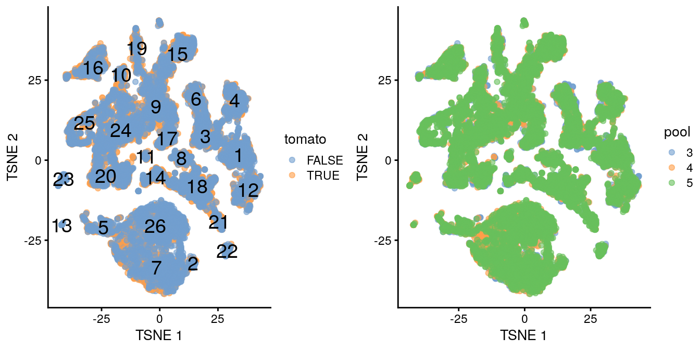
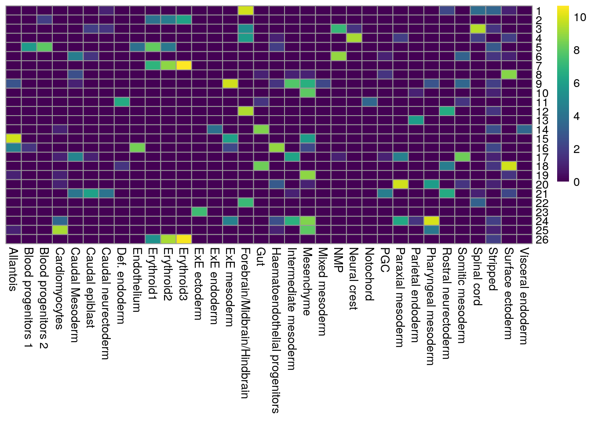
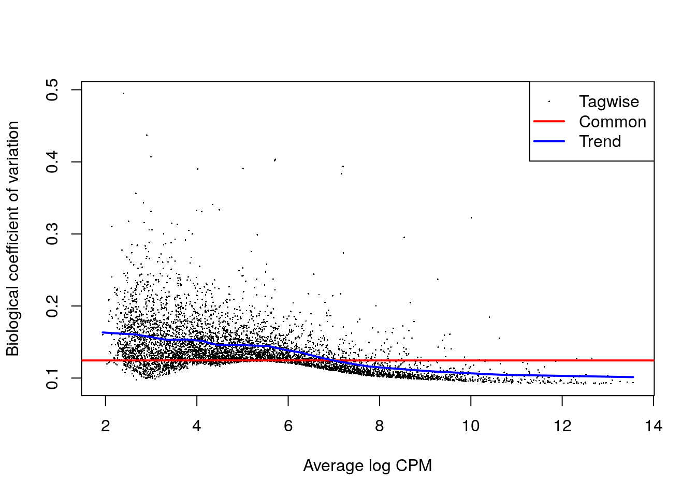
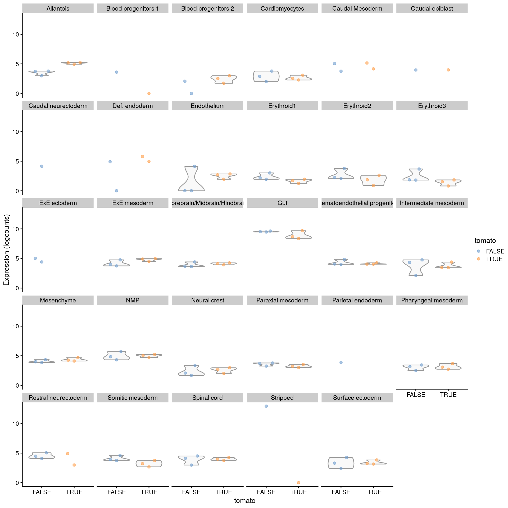
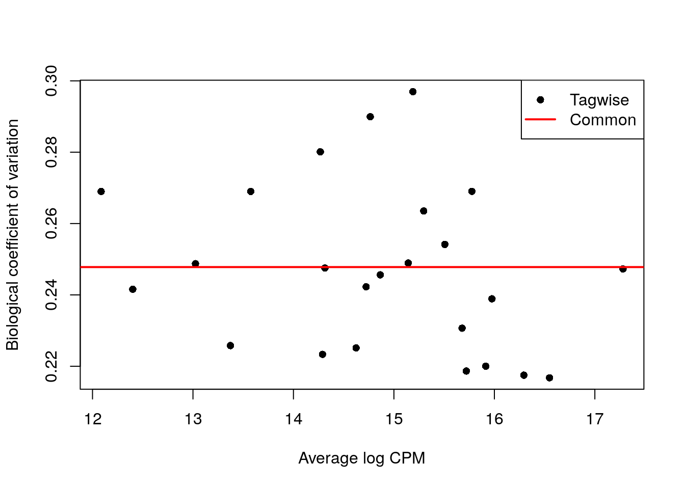

---
output:
  html_document
bibliography: ../ref.bib
---

# Multi-sample comparisons

<script>
document.addEventListener("click", function (event) {
    if (event.target.classList.contains("aaron-collapse")) {
        event.target.classList.toggle("active");
        var content = event.target.nextElementSibling;
        if (content.style.display === "block") {
            content.style.display = "none";
        } else {
            content.style.display = "block";
        }
    }
})
</script>

<style>
.aaron-collapse {
  background-color: #eee;
  color: #444;
  cursor: pointer;
  padding: 18px;
  width: 100%;
  border: none;
  text-align: left;
  outline: none;
  font-size: 15px;
}

.aaron-content {
  padding: 0 18px;
  display: none;
  overflow: hidden;
  background-color: #f1f1f1;
}
</style>

## Motivation

A powerful use of scRNA-seq technology lies in the design of replicated multi-condition experiments to detect changes in composition or expression between conditions.
For example, a researcher could use this strategy to detect changes in cell type abundance after drug treatment [@richard2018tcell] or genetic modifications [@scialdone2016resolving].
This provides more biological insight than conventional scRNA-seq experiments involving only one biological condition, especially if we can relate population changes to specific experimental perturbations.

Differential analyses of multi-condition scRNA-seq experiments can be broadly split into two categories - differential expression (DE) and differential abundance (DA) analyses.
The former tests for changes in expression between conditions for cells of the same type that are present in both conditions,
while the latter tests for changes in the composition of cell types (or states, etc.) between conditions.
In this chapter, we will demonstrate both analyses using data from a study of the early mouse embryo [@pijuansala2019single].

## Setting up the data

Our demonstration scRNA-seq dataset was generated from chimeric mouse embryos at the E8.5 developmental stage.
Each chimeric embryo was generated by injecting td-Tomato-positive embryonic stem cells (ESCs) into a wild-type (WT) blastocyst.
Unlike in previous experiments [@scialdone2016resolving], there is no genetic difference between the injected and background cells other than the expression of td-Tomato in the former.
Instead, the aim of this "wild-type chimera" study is to determine whether the injection procedure itself introduces differences in lineage commitment compared to the background cells.

The experiment used a paired design with three replicate batches of two samples each.
Specifically, each batch contains one sample consisting of td-Tomato positive cells and another consisting of negative cells,
obtained by fluorescence-activated cell sorting from a single pool of dissociated cells from 6-7 chimeric embryos.
For each sample, scRNA-seq data was generated using the 10X Genomics protocol [@zheng2017massively] to obtain 2000-7000 cells.

<button class="aaron-collapse">View history</button>
<div class="aaron-content">
   
```r
#--- loading ---#
library(MouseGastrulationData)
sce.chimera <- WTChimeraData(samples=5:10)
sce.chimera

#--- feature-annotation ---#
library(scater)
rownames(sce.chimera) <- uniquifyFeatureNames(
    rowData(sce.chimera)$ENSEMBL, rowData(sce.chimera)$SYMBOL)

#--- quality-control ---#
drop <- sce.chimera$celltype.mapped %in% c("stripped", "Doublet")
sce.chimera <- sce.chimera[,!drop]

#--- normalization ---#
sce.chimera <- logNormCounts(sce.chimera)

#--- variance-modelling ---#
library(scran)
dec.chimera <- modelGeneVar(sce.chimera, block=sce.chimera$sample)
chosen.hvgs <- dec.chimera$bio > 0

#--- merging ---#
library(batchelor)
set.seed(01001001)
merged <- correctExperiments(sce.chimera, 
    batch=sce.chimera$sample, 
    subset.row=chosen.hvgs,
    PARAM=FastMnnParam(
        merge.order=list(
            list(1,3,5), # WT (3 replicates)
            list(2,4,6)  # td-Tomato (3 replicates)
        )
    )
)

#--- clustering ---#
g <- buildSNNGraph(merged, use.dimred="corrected")
clusters <- igraph::cluster_louvain(g)
colLabels(merged) <- factor(clusters$membership)

#--- dimensionality-reduction ---#
merged <- runTSNE(merged, dimred="corrected", external_neighbors=TRUE)
merged <- runUMAP(merged, dimred="corrected", external_neighbors=TRUE)
```

</div>


```r
merged
```

```
## class: SingleCellExperiment 
## dim: 14699 19426 
## metadata(1): merge.info
## assays(3): reconstructed counts logcounts
## rownames(14699): Xkr4 Rp1 ... Vmn2r122 CAAA01147332.1
## rowData names(3): ENSEMBL SYMBOL rotation
## colnames(19426): cell_9769 cell_9770 ... cell_30701 cell_30702
## colData names(13): batch cell ... sizeFactor label
## reducedDimNames(3): corrected TSNE UMAP
## altExpNames(0):
```

The differential analyses in this chapter will be predicated on many of the pre-processing steps covered previously.
For brevity, we will not explicitly repeat them here,
only noting that we have already merged cells from all samples into the same coordinate system (Chapter \@ref(data-integration))
and clustered the merged dataset to obtain a common partitioning across all samples (Chapter \@ref(clustering)).
A brief inspection of the results indicates that clusters contain similar contributions from all batches with only modest differences associated with td-Tomato expression (Figure \@ref(fig:tsne-initial)).


```r
library(scater)
table(colLabels(merged), merged$tomato)
```

```
##     
##      FALSE TRUE
##   1    546  401
##   2     60   52
##   3    470  398
##   4    469  211
##   5    335  271
##   6    258  249
##   7   1241  967
##   8    203  221
##   9    630  629
##   10    71  181
##   11    47   57
##   12   417  310
##   13    58    0
##   14   209  214
##   15   414  630
##   16   363  509
##   17   234  198
##   18   657  607
##   19   151  303
##   20   579  443
##   21   137   74
##   22    82   78
##   23   155    1
##   24   762  878
##   25   363  497
##   26  1420  716
```

```r
table(colLabels(merged), merged$pool)
```

```
##     
##         3    4    5
##   1   224  173  550
##   2    26   30   56
##   3   226  172  470
##   4    78  162  440
##   5    99  227  280
##   6   187  116  204
##   7   300  909  999
##   8    69  134  221
##   9   229  423  607
##   10  114   54   84
##   11   16   31   57
##   12  179  169  379
##   13    2   51    5
##   14   77   97  249
##   15  114  289  641
##   16  183  242  447
##   17  157   81  194
##   18  123  308  833
##   19  106  118  230
##   20  236  238  548
##   21    3   10  198
##   22   27   29  104
##   23    6   84   66
##   24  217  455  968
##   25  132  172  556
##   26  194  870 1072
```

```r
gridExtra::grid.arrange(
    plotTSNE(merged, colour_by="tomato", text_by="label"),
    plotTSNE(merged, colour_by=data.frame(pool=factor(merged$pool))),
    ncol=2
)
```

<div class="figure">

<p class="caption">(\#fig:tsne-initial)$t$-SNE plot of the WT chimeric dataset, where each point represents a cell and is colored according to td-Tomato expression (left) or batch of origin (right). Cluster numbers are superimposed based on the median coordinate of cells assigned to that cluster.</p>
</div>


Ordinarily, we would be obliged to perform marker detection to assign biological meaning to these clusters.
For simplicity, we will skip this step by directly using the cell type labels provided by @pijuansala2019single.
These were obtained by mapping the cells in this dataset to a larger, pre-annotated "atlas" of mouse early embryonic development.
While broadly consistent, many of our clusters map to multiple labels (Figure \@ref(fig:heat-cluster-label}), which reflects the difficulties in unambiguously resolving cell types undergoing differentiation.


```r
by.label <- table(colLabels(merged), merged$celltype.mapped)
pheatmap::pheatmap(log2(by.label+1), cluster_cols=FALSE, cluster_rows=FALSE,
    color=viridis::viridis(101))
```

<div class="figure">

<p class="caption">(\#fig:heat-cluster-label)Heatmap showing the abundance of cells with each combination of cluster (row) and cell type label (column). The color scale represents the log~2~-count for each combination.</p>
</div>

## Differential expression between conditions

### Creating pseudo-bulk samples

The most obvious differential analysis is to look for changes in expression between conditions.
We perform the DE analysis separately for each label to identify cell type-specific transcriptional effects of injection.
The actual DE testing is performed on "pseudo-bulk" expression profiles [@tung2017batch], 
generated by summing counts together for all cells with the same combination of label and sample.
This leverages the resolution offered by single-cell technologies to define the labels,
and combines it with the statistical rigor of existing methods for DE analyses involving a small number of samples.


```r
# Using 'label' and 'sample' as our two factors; each column of the output
# corresponds to one unique combination of these two factors.
summed <- aggregateAcrossCells(merged, 
    id=colData(merged)[,c("celltype.mapped", "sample")])
summed
```

```
## class: SingleCellExperiment 
## dim: 14699 186 
## metadata(1): merge.info
## assays(1): counts
## rownames(14699): Xkr4 Rp1 ... Vmn2r122 CAAA01147332.1
## rowData names(3): ENSEMBL SYMBOL rotation
## colnames: NULL
## colData names(16): batch cell ... sample ncells
## reducedDimNames(3): corrected TSNE UMAP
## altExpNames(0):
```

At this point, it is worth reflecting on the motivations behind the use of pseudo-bulking:

- Larger counts are more amenable to standard DE analysis pipelines designed for bulk RNA-seq data.
Normalization is more straightforward and certain statistical approximations are more accurate 
e.g., the saddlepoint approximation for quasi-likelihood methods or normality for linear models.
- Collapsing cells into samples reflects the fact that our biological replication occurs at the sample level [@lun2017overcoming].
Each sample is represented no more than once for each condition, avoiding problems from unmodelled correlations between samples. 
Supplying the per-cell counts directly to a DE analysis pipeline would imply that each cell is an independent biological replicate, which is not true from an experimental perspective.
(A mixed effects model can handle this variance structure but involves extra [statistical and computational complexity](https://bbolker.github.io/mixedmodels-misc/glmmFAQ.html) for little benefit, see @crowell2019discovery.)
- Variance between cells within each sample is masked, provided it does not affect variance across (replicate) samples.
This avoids penalizing DEGs that are not uniformly up- or down-regulated for all cells in all samples of one condition.
Masking is generally desirable as DEGs - unlike marker genes - do not need to have low within-sample variance to be interesting, e.g., if the treatment effect is consistent across replicate populations but heterogeneous on a per-cell basis.
(Of course, high per-cell variability will still result in weaker DE if it affects the variability across populations, while homogeneous per-cell responses will result in stronger DE due to a larger population-level log-fold change.
These effects are also largely desirable.)

### Performing the DE analysis

#### Introduction

The DE analysis will be performed using quasi-likelihood (QL) methods from the *[edgeR](https://bioconductor.org/packages/3.12/edgeR)* package [@robinson2010edgeR;@chen2016reads].
This uses a negative binomial generalized linear model (NB GLM) to handle overdispersed count data in experiments with limited replication.
In our case, we have biological variation with three paired replicates per condition, so *[edgeR](https://bioconductor.org/packages/3.12/edgeR)* (or its contemporaries) is a natural choice for the analysis.

We do not use all labels for GLM fitting as the strong DE between labels makes it difficult to compute a sensible average abundance to model the mean-dispersion trend.
Moreover, label-specific batch effects would not be easily handled with a single additive term in the design matrix for the batch.
Instead, we arbitrarily pick one of the labels to use for this demonstration.


```r
label <- "Mesenchyme"
current <- summed[,label==summed$celltype.mapped]

# Creating up a DGEList object for use in edgeR:
library(edgeR)
y <- DGEList(counts(current), samples=colData(current))
y
```

```
## An object of class "DGEList"
## $counts
##        Sample1 Sample2 Sample3 Sample4 Sample5 Sample6
## Xkr4         2       0       0       0       3       0
## Rp1          0       0       1       0       0       0
## Sox17        7       0       3       0      14       9
## Mrpl15    1420     271    1009     379    1578     749
## Rgs20        3       0       1       1       0       0
## 14694 more rows ...
## 
## $samples
##         group lib.size norm.factors batch cell barcode sample stage tomato pool
## Sample1     1  4607053            1     5 <NA>    <NA>      5  E8.5   TRUE    3
## Sample2     1  1064970            1     6 <NA>    <NA>      6  E8.5  FALSE    3
## Sample3     1  2494010            1     7 <NA>    <NA>      7  E8.5   TRUE    4
## Sample4     1  1028668            1     8 <NA>    <NA>      8  E8.5  FALSE    4
## Sample5     1  4290221            1     9 <NA>    <NA>      9  E8.5   TRUE    5
## Sample6     1  1950840            1    10 <NA>    <NA>     10  E8.5  FALSE    5
##         stage.mapped celltype.mapped closest.cell doub.density sizeFactor label
## Sample1         <NA>      Mesenchyme         <NA>           NA         NA    NA
## Sample2         <NA>      Mesenchyme         <NA>           NA         NA    NA
## Sample3         <NA>      Mesenchyme         <NA>           NA         NA    NA
## Sample4         <NA>      Mesenchyme         <NA>           NA         NA    NA
## Sample5         <NA>      Mesenchyme         <NA>           NA         NA    NA
## Sample6         <NA>      Mesenchyme         <NA>           NA         NA    NA
##         celltype.mapped.1 sample.1 ncells
## Sample1        Mesenchyme        5    286
## Sample2        Mesenchyme        6     55
## Sample3        Mesenchyme        7    243
## Sample4        Mesenchyme        8    134
## Sample5        Mesenchyme        9    478
## Sample6        Mesenchyme       10    299
```

#### Pre-processing

A typical step in bulk RNA-seq data analyses is to remove samples with very low library sizes due to failed library preparation or sequencing.
The very low counts in these samples can be troublesome in downstream steps such as normalization (Chapter \@ref(normalization)) or for some statistical approximations used in the DE analysis.
In our situation, this is equivalent to removing label-sample combinations that have very few or lowly-sequenced cells.
The exact definition of "very low" will vary, but in this case, we remove combinations containing fewer than 20 cells [@crowell2019discovery].
Alternatively, we could apply the outlier-based strategy described in Chapter \@ref(quality-control), but this makes the strong assumption that all label-sample combinations have similar numbers of cells that are sequenced to similar depth.


```r
discarded <- current$ncells < 20
y <- y[,!discarded]
summary(discarded)
```

```
##    Mode   FALSE 
## logical       6
```

Another typical step in bulk RNA-seq analyses is to remove genes that are lowly expressed.
This reduces computational work, improves the accuracy of mean-variance trend modelling and decreases the severity of the multiple testing correction.
Genes are discarded if they are not expressed above a log-CPM threshold in a minimum number of samples (determined from the size of the smallest treatment group in the experimental design). 


```r
keep <- filterByExpr(y, group=current$tomato)
y <- y[keep,]
summary(keep)
```

```
##    Mode   FALSE    TRUE 
## logical    9011    5688
```

Finally, we correct for composition biases by computing normalization factors with the trimmed mean of M-values method [@robinson2010scaling].
We do not need the bespoke single-cell methods described in Chapter \@ref(normalization), as the counts for our pseudo-bulk samples are large enough to apply bulk normalization methods.
(Readers should be aware that *[edgeR](https://bioconductor.org/packages/3.12/edgeR)* normalization factors are closely related but _not the same_ as the size factors described elsewhere in this book.)


```r
y <- calcNormFactors(y)
y$samples
```

```
##         group lib.size norm.factors batch cell barcode sample stage tomato pool
## Sample1     1  4607053    1.0683392     5 <NA>    <NA>      5  E8.5   TRUE    3
## Sample2     1  1064970    1.0487418     6 <NA>    <NA>      6  E8.5  FALSE    3
## Sample3     1  2494010    0.9582296     7 <NA>    <NA>      7  E8.5   TRUE    4
## Sample4     1  1028668    0.9774156     8 <NA>    <NA>      8  E8.5  FALSE    4
## Sample5     1  4290221    0.9707300     9 <NA>    <NA>      9  E8.5   TRUE    5
## Sample6     1  1950840    0.9816914    10 <NA>    <NA>     10  E8.5  FALSE    5
##         stage.mapped celltype.mapped closest.cell doub.density sizeFactor label
## Sample1         <NA>      Mesenchyme         <NA>           NA         NA    NA
## Sample2         <NA>      Mesenchyme         <NA>           NA         NA    NA
## Sample3         <NA>      Mesenchyme         <NA>           NA         NA    NA
## Sample4         <NA>      Mesenchyme         <NA>           NA         NA    NA
## Sample5         <NA>      Mesenchyme         <NA>           NA         NA    NA
## Sample6         <NA>      Mesenchyme         <NA>           NA         NA    NA
##         celltype.mapped.1 sample.1 ncells
## Sample1        Mesenchyme        5    286
## Sample2        Mesenchyme        6     55
## Sample3        Mesenchyme        7    243
## Sample4        Mesenchyme        8    134
## Sample5        Mesenchyme        9    478
## Sample6        Mesenchyme       10    299
```

#### Statistical modelling

We set up the design matrix to block on the batch-to-batch differences across different embryo pools,
while retaining an additive term that represents the effect of injection. 
The latter is represented in our model as the log-fold change in gene expression in td-Tomato-positive cells over their negative counterparts within the same label.
Our aim is to test whether this log-fold change is significantly different from zero.


```r
design <- model.matrix(~factor(pool) + factor(tomato), y$samples)
design
```

```
##         (Intercept) factor(pool)4 factor(pool)5 factor(tomato)TRUE
## Sample1           1             0             0                  1
## Sample2           1             0             0                  0
## Sample3           1             1             0                  1
## Sample4           1             1             0                  0
## Sample5           1             0             1                  1
## Sample6           1             0             1                  0
## attr(,"assign")
## [1] 0 1 1 2
## attr(,"contrasts")
## attr(,"contrasts")$`factor(pool)`
## [1] "contr.treatment"
## 
## attr(,"contrasts")$`factor(tomato)`
## [1] "contr.treatment"
```

We estimate the negative binomial (NB) dispersions with `estimateDisp()`.
The role of the NB dispersion is to model the mean-variance trend (Figure \@ref(fig:bcvplot)),
which is not easily accommodated by QL dispersions alone due to the quadratic nature of the NB mean-variance trend.


```r
y <- estimateDisp(y, design)
summary(y$trended.dispersion)
```

```
##    Min. 1st Qu.  Median    Mean 3rd Qu.    Max. 
## 0.01026 0.01670 0.02128 0.02020 0.02349 0.02665
```

```r
plotBCV(y)
```

<div class="figure">

<p class="caption">(\#fig:bcvplot)Biological coefficient of variation (BCV) for each gene as a function of the average abundance. The BCV is computed as the square root of the NB dispersion after empirical Bayes shrinkage towards the trend. Trended and common BCV estimates are shown in blue and red, respectively.</p>
</div>

We also estimate the quasi-likelihood dispersions with `glmQLFit()` [@chen2016reads].
This fits a GLM to the counts for each gene and estimates the QL dispersion from the GLM deviance.
We set `robust=TRUE` to avoid distortions from highly variable clusters [@phipson2016robust].
The QL dispersion models the uncertainty and variability of the per-gene variance (Figure \@ref(fig:qlplot)) - which is not well handled by the NB dispersions, so the two dispersion types complement each other in the final analysis.


```r
fit <- glmQLFit(y, design, robust=TRUE)
summary(fit$var.prior)
```

```
##    Min. 1st Qu.  Median    Mean 3rd Qu.    Max. 
##  0.3179  0.7143  0.8538  0.8045  0.9128  1.0665
```

```r
summary(fit$df.prior)
```

```
##    Min. 1st Qu.  Median    Mean 3rd Qu.    Max. 
##  0.2267 12.6749 12.6749 12.3390 12.6749 12.6749
```

```r
plotQLDisp(fit)
```

<div class="figure">

<p class="caption">(\#fig:qlplot)QL dispersion estimates for each gene as a function of abundance. Raw estimates (black) are shrunk towards the trend (blue) to yield squeezed estimates (red).</p>
</div>

We test for differences in expression due to injection using `glmQLFTest()`.
DEGs are defined as those with non-zero log-fold changes at a false discovery rate of 5%.
Very few genes are significantly DE, indicating that injection has little effect on the transcriptome of mesenchyme cells.
(Note that this logic is somewhat circular, 
as a large transcriptional effect may have caused cells of this type to be re-assigned to a different label.
We discuss this in more detail in Section \@ref(de-da-duality) below.)


```r
res <- glmQLFTest(fit, coef=ncol(design))
summary(decideTests(res))
```

```
##        factor(tomato)TRUE
## Down                    8
## NotSig               5672
## Up                      8
```

```r
topTags(res)
```

```
## Coefficient:  factor(tomato)TRUE 
##               logFC   logCPM          F       PValue          FDR
## Phlda2   -4.3873546 9.934130 1638.59469 1.812293e-16 1.030832e-12
## Erdr1     2.0690698 8.832662  356.36590 1.060836e-11 3.017019e-08
## Mid1      1.5190728 6.931325  120.14656 1.844351e-08 3.496889e-05
## H13      -1.0596020 7.540121   80.79795 2.373001e-07 2.526790e-04
## Kcnq1ot1  1.3762700 7.241651   83.30701 2.392052e-07 2.526790e-04
## Akr1e1   -1.7205826 5.127802   79.31386 2.665390e-07 2.526790e-04
## Zdbf2     1.8008336 6.797367   83.66324 6.808994e-07 5.532794e-04
## Asb4     -0.9234911 7.340648   53.44578 2.918297e-06 2.074909e-03
## Impact    0.8516300 7.353208   50.31429 4.145416e-06 2.619903e-03
## Lum      -0.6031413 9.274529   41.67104 1.204523e-05 6.851324e-03
```


### Putting it all together

Now that we have laid out the theory underlying the DE analysis,
we repeat this process for each of the labels to identify injection-induced DE in each cell type.
This is conveniently done using the `pseudoBulkDGE()` function from *[scran](https://bioconductor.org/packages/3.12/scran)*,
which will loop over all labels and apply the exact analysis described above to each label.
To prepare for this, we filter out all sample-label combinations with insufficient cells.


```r
summed.filt <- summed[,summed$ncells >= 20]
```

We construct a common design matrix that will be used in the analysis for each label.
Here, we will re-use our previous additive design involving the batch (`pool`) and injection effects (`tomato`).
Recall that this matrix should have one row per unique sample (and named as such), 
reflecting the fact that we are modelling counts on the sample level instead of the cell level.


```r
# Pulling out a sample-level 'targets' data.frame:
targets <- colData(merged)[!duplicated(merged$sample),]

# Constructing the design matrix:
design <-  model.matrix(~factor(pool) + factor(tomato), data=targets)
rownames(design) <- targets$sample
```

We then apply the `pseudoBulkDGE()` function to obtain a list of injection-induced DE genes for each label.
This function puts some additional effort into automatically dealing with labels that are not represented in both injected and background cells, for which a DE analysis between conditions is meaningless;
or are not represented in a sufficient number of replicate samples to enable modelling of biological variability.


```r
library(scran)
de.results <- pseudoBulkDGE(summed.filt, 
    sample=summed.filt$sample,
    label=summed.filt$celltype.mapped,
    design=design,
    coef=ncol(design),

    # 'condition' sets the group size for filterByExpr(),
    # to perfectly mimic our previous manual analysis.
    condition=targets$tomato 
)
```

We examine the numbers of DEGs at a FDR of 5% for each label using the `decideTestsPerLabel()` function.
In general, there seems to be very little differential expression that is introduced by injection.
Note that genes listed as `NA` were either filtered out as low-abundance genes for a given label's analysis,
or the comparison of interest was not possible for a particular label,
e.g., due to lack of residual degrees of freedom or an absence of samples from both conditions.


```r
is.de <- decideTestsPerLabel(de.results, threshold=0.05)
summarizeTestsPerLabel(is.de)
```

```
##                                -1    0  1    NA
## Allantois                      69 5048 66  9516
## Blood progenitors 2             1 2472  2 12224
## Cardiomyocytes                  6 4361  5 10327
## Caudal epiblast                 0    0  0 14699
## Caudal Mesoderm                 0    0  0 14699
## Def. endoderm                   0    0  0 14699
## Endothelium                     3 3222  6 11468
## Erythroid1                     12 3035 25 11627
## Erythroid2                      5 3389  8 11297
## Erythroid3                     13 5048 16  9622
## ExE ectoderm                    0    0  0 14699
## ExE mesoderm                    2 5097 10  9590
## Forebrain/Midbrain/Hindbrain    8 6226 11  8454
## Gut                             5 4482  6 10206
## Haematoendothelial progenitors  7 4347 17 10328
## Intermediate mesoderm           6 3256  8 11429
## Mesenchyme                      8 5672  8  9011
## Neural crest                    6 3311  8 11374
## NMP                             6 4107 10 10576
## Paraxial mesoderm               4 4756  5  9934
## Parietal endoderm               0    0  0 14699
## Pharyngeal mesoderm             2 5082  9  9606
## Rostral neurectoderm            0    0  0 14699
## Somitic mesoderm                7 2948 13 11731
## Spinal cord                     7 4591  7 10094
## Surface ectoderm                9 5556  8  9126
```


For each gene, we compute the percentage of cell types in which that gene is upregulated or downregulated upon injection.
(Here, we consider a gene to be non-DE if it is not retained after filtering.)
We see that _Xist_ is consistently downregulated in the injected cells; 
this is consistent with the fact that the injected cells are male while the background cells are derived from pools of male and female embryos (due to experimental difficulties with resolving sex at this stage).
The consistent downregulation of _Phlda2_ and _Cdkn1c_ in the injected cells is also interesting given that both are imprinted genes. 


```r
# Upregulated across most cell types.
up.de <- is.de > 0 & !is.na(is.de)
head(sort(rowMeans(up.de), decreasing=TRUE), 10)
```

```
##      Mid1     Erdr1    Impact     Mcts2      Nnat  Kcnq1ot1   Slc38a4     Zdbf2 
## 0.7692308 0.6538462 0.5384615 0.5000000 0.5000000 0.5000000 0.3846154 0.3461538 
##      Hopx      Peg3 
## 0.3461538 0.2307692
```

```r
# Downregulated across cell types.
down.de <- is.de < 0 & !is.na(is.de)
head(sort(rowMeans(down.de), decreasing=TRUE), 10)
```

```
##        Akr1e1          Xist        Cdkn1c        Phlda2           H13 
##    0.61538462    0.57692308    0.57692308    0.57692308    0.46153846 
##         Wfdc2         Hbb-y         Grb10 B930036N10Rik         Pink1 
##    0.19230769    0.11538462    0.11538462    0.07692308    0.07692308
```


We further identify label-specific DE genes that are significant in our label of interest yet not DE in any other label.
As hypothesis tests are not typically geared towards identifying genes that are not DE,
we use an _ad hoc_ approach where we consider a gene to be consistent with the null hypothesis for a label 
if it fails to be detected even at a generous FDR threshold of 50%.
We demonstrate this approach below by identifying injection-induced DE genes that are unique to the allantois,
though differences in power between labels suggest that this should be interpreted with some caution;
for example, Figure \@ref(fig:exprs-unique-de-allantois) shows that the top-ranked allantois-specific gene exhibits some evidence of DE in other labels but was not detected for various reasons like low abundance or insufficient replicates.


```r
remotely.de <- decideTestsPerLabel(de.results, threshold=0.5)
not.de <- remotely.de==0 | is.na(remotely.de)

other.labels <- setdiff(colnames(not.de), "Allantois")
unique.degs <- is.de[,"Allantois"]!=0 & rowMeans(not.de[,other.labels])==1
unique.degs <- names(which(unique.degs))
unique.degs
```

```
##  [1] "Cfc1"      "Ddb2"      "Ddx27"     "Gm21887"   "Postn"     "S100a6"   
##  [7] "BC028528"  "Gar1"      "Cyr61"     "Fbxl4"     "Gja4"      "Zfp593"   
## [13] "Smarcd3"   "Plac8"     "Tbx3"      "Pdgfa"     "Tril"      "H2afj"    
## [19] "Aamdc"     "Slc22a18"  "Zfpm1"     "Dbndd1"    "Egln1"     "Cryab"    
## [25] "Hcn4"      "C1qbp"     "H3f3b"     "Hist1h1b"  "Hist1h2ap" "Dlk1"     
## [31] "Kif26a"    "Ly6e"      "Prr5"      "Pus7l"     "Hoxc10"    "Popdc2"   
## [37] "Alcam"     "Sh3bgr"    "Ezr"       "Eif2s3y"   "Etf1"      "Txnl4a"   
## [43] "Bad"       "Rbp4"
```

```r
# Choosing the top-ranked gene for inspection:
de.allantois <- de.results$Allantois
de.allantois <- de.allantois[order(de.allantois$PValue),]
de.allantois <- de.allantois[rownames(de.allantois) %in% unique.degs,]

sizeFactors(summed.filt) <- NULL
plotExpression(logNormCounts(summed.filt), 
    features=rownames(de.allantois)[1],
    x="tomato", colour_by="tomato", 
    other_fields="celltype.mapped") + 
    facet_wrap(~celltype.mapped)
```

<div class="figure">

<p class="caption">(\#fig:exprs-unique-de-allantois)Distribution of summed log-expression values for each label in the chimeric embryo dataset. Each facet represents a label with distributions stratified by injection status.</p>
</div>

We also list the labels that were skipped due to the absence of replicates or contrasts.
If it is necessary to extract statistics in the absence of replicates, several strategies can be applied such as reducing the complexity of the model or using a predefined value for the NB dispersion.
We refer readers to the *[edgeR](https://bioconductor.org/packages/3.12/edgeR)* user's guide for more details.


```r
metadata(de.results)$failed
```

```
## [1] "Caudal epiblast"      "Caudal Mesoderm"      "Def. endoderm"       
## [4] "ExE ectoderm"         "Parietal endoderm"    "Rostral neurectoderm"
```

## Differential abundance between conditions {#differential-abundance}

### Overview

In a DA analysis, we test for significant changes in per-label cell abundance across conditions.
This will reveal which cell types are depleted or enriched upon treatment, which is arguably just as interesting as changes in expression within each cell type.
The DA analysis has a long history in flow cytometry [@finak2014opencyto;@lun2017testing] where it is routinely used to examine the effects of different conditions on the composition of complex cell populations.
By performing it here, we effectively treat scRNA-seq as a "super-FACS" technology for defining relevant subpopulations using the entire transcriptome.

We prepare for the DA analysis by quantifying the number of cells assigned to each label (or cluster).
In this case, we are aiming to identify labels that change in abundance among the compartment of injected cells compared to the background.


```r
abundances <- table(merged$celltype.mapped, merged$sample) 
abundances <- unclass(abundances) 
head(abundances)
```

```
##                      
##                        5  6   7   8   9  10
##   Allantois           97 15 139 127 318 259
##   Blood progenitors 1  6  3  16   6   8  17
##   Blood progenitors 2 31  8  28  21  43 114
##   Cardiomyocytes      85 21  79  31 174 211
##   Caudal epiblast      2  2   0   0  22  45
##   Caudal Mesoderm     10 10   9   3  10  29
```

### Performing the DA analysis

Our DA analysis will again be performed with the *[edgeR](https://bioconductor.org/packages/3.12/edgeR)* package.
This allows us to take advantage of the NB GLM methods to model overdispersed count data in the presence of limited replication - 
except that the counts are not of reads per gene, but of cells per label [@lun2017testing].
The aim is to share information across labels to improve our estimates of the biological variability in cell abundance between replicates.


```r
# Attaching some column metadata.
extra.info <- colData(merged)[match(colnames(abundances), merged$sample),]
y.ab <- DGEList(abundances, samples=extra.info)
y.ab
```

```
## An object of class "DGEList"
## $counts
##                      
##                        5  6   7   8   9  10
##   Allantois           97 15 139 127 318 259
##   Blood progenitors 1  6  3  16   6   8  17
##   Blood progenitors 2 31  8  28  21  43 114
##   Cardiomyocytes      85 21  79  31 174 211
##   Caudal epiblast      2  2   0   0  22  45
## 29 more rows ...
## 
## $samples
##    group lib.size norm.factors batch       cell          barcode sample stage
## 5      1     2298            1     5  cell_9769 AAACCTGAGACTGTAA      5  E8.5
## 6      1     1026            1     6 cell_12180 AAACCTGCAGATGGCA      6  E8.5
## 7      1     2740            1     7 cell_13227 AAACCTGAGACAAGCC      7  E8.5
## 8      1     2904            1     8 cell_16234 AAACCTGCAAACCCAT      8  E8.5
## 9      1     4057            1     9 cell_19332 AAACCTGCAACGATCT      9  E8.5
## 10     1     6401            1    10 cell_23875 AAACCTGAGGCATGTG     10  E8.5
##    tomato pool stage.mapped              celltype.mapped closest.cell
## 5    TRUE    3        E8.25                   Mesenchyme   cell_24159
## 6   FALSE    3        E8.25             Somitic mesoderm   cell_63247
## 7    TRUE    4         E8.5             Somitic mesoderm   cell_25454
## 8   FALSE    4        E8.25                 ExE mesoderm  cell_139075
## 9    TRUE    5         E8.0                 ExE mesoderm  cell_116116
## 10  FALSE    5         E8.5 Forebrain/Midbrain/Hindbrain   cell_39343
##    doub.density sizeFactor label
## 5    0.02985045  1.6348759    19
## 6    0.29191572  2.5980769     6
## 7    0.60173979  1.5939009    17
## 8    0.00473259  0.8707367     9
## 9    0.07941464  0.8932525    15
## 10   0.04074704  0.3947355     1
```

We filter out low-abundance labels as previously described.
This avoids cluttering the result table with very rare subpopulations that contain only a handful of cells.
For a DA analysis of cluster abundances, filtering is generally not required as most clusters will not be of low-abundance (otherwise there would not have been enough evidence to define the cluster in the first place).


```r
keep <- filterByExpr(y.ab, group=y.ab$samples$tomato)
y.ab <- y.ab[keep,]
summary(keep)
```

```
##    Mode   FALSE    TRUE 
## logical      10      24
```

Unlike DE analyses, we do not perform an additional normalization step with `calcNormFactors()`.
This means that we are only normalizing based on the "library size", i.e., the total number of cells in each sample.
Any changes we detect between conditions will subsequently represent differences in the proportion of cells in each cluster.
The motivation behind this decision is discussed in more detail in Section \@ref(composition-effects).

We formulate the design matrix with a blocking factor for the batch of origin for each sample and an additive term for the td-Tomato status (i.e., injection effect).
Here, the log-fold change in our model refers to the change in cell abundance after injection, rather than the change in gene expression.


```r
design <- model.matrix(~factor(pool) + factor(tomato), y.ab$samples)
```

We use the `estimateDisp()` function to estimate the NB dipersion for each cluster (Figure \@ref(fig:abplotbcv)).
We turn off the trend as we do not have enough points for its stable estimation. 


```r
y.ab <- estimateDisp(y.ab, design, trend="none")
summary(y.ab$common.dispersion)
```

```
##    Min. 1st Qu.  Median    Mean 3rd Qu.    Max. 
##  0.0614  0.0614  0.0614  0.0614  0.0614  0.0614
```

```r
plotBCV(y.ab, cex=1)
```

<div class="figure">

<p class="caption">(\#fig:abplotbcv)Biological coefficient of variation (BCV) for each label with respect to its average abundance. BCVs are defined as the square root of the NB dispersion. Common dispersion estimates are shown in red.</p>
</div>

We repeat this process with the QL dispersion, again disabling the trend (Figure \@ref(fig:abplotql)).


```r
fit.ab <- glmQLFit(y.ab, design, robust=TRUE, abundance.trend=FALSE)
summary(fit.ab$var.prior)
```

```
##    Min. 1st Qu.  Median    Mean 3rd Qu.    Max. 
##   1.254   1.254   1.254   1.254   1.254   1.254
```

```r
summary(fit.ab$df.prior)
```

```
##    Min. 1st Qu.  Median    Mean 3rd Qu.    Max. 
##     Inf     Inf     Inf     Inf     Inf     Inf
```

```r
plotQLDisp(fit.ab, cex=1)
```

<div class="figure">

<p class="caption">(\#fig:abplotql)QL dispersion estimates for each label with respect to its average abundance. Quarter-root values of the raw estimates are shown in black while the shrunken estimates are shown in red. Shrinkage is performed towards the common dispersion in blue.</p>
</div>

We test for differences in abundance between td-Tomato-positive and negative samples using `glmQLFTest()`.
We see that extra-embryonic ectoderm is strongly depleted in the injected cells. 
This is consistent with the expectation that cells injected into the blastocyst should not contribute to extra-embryonic tissue.
The injected cells also contribute more to the mesenchyme, which may also be of interest.


```r
res <- glmQLFTest(fit.ab, coef=ncol(design))
summary(decideTests(res))
```

```
##        factor(tomato)TRUE
## Down                    1
## NotSig                 22
## Up                      1
```

```r
topTags(res)
```

```
## Coefficient:  factor(tomato)TRUE 
##                                     logFC   logCPM         F       PValue
## ExE ectoderm                   -6.5663339 13.02497 66.266874 1.352022e-10
## Mesenchyme                      1.1651500 16.29382 11.290523 1.534506e-03
## Allantois                       0.8345294 15.50702  5.312163 2.554581e-02
## Cardiomyocytes                  0.8484008 14.86430  5.203963 2.701306e-02
## Neural crest                   -0.7706378 14.76462  4.106177 4.830292e-02
## Endothelium                     0.7518608 14.28905  3.911511 5.371320e-02
## Erythroid3                     -0.6430834 17.28041  3.603666 6.367366e-02
## Haematoendothelial progenitors  0.6581135 14.72323  3.123946 8.350641e-02
## ExE mesoderm                    0.3805309 15.67835  1.180627 2.826550e-01
## Pharyngeal mesoderm             0.3793160 15.72073  1.169279 2.849523e-01
##                                         FDR
## ExE ectoderm                   3.244852e-09
## Mesenchyme                     1.841407e-02
## Allantois                      1.620784e-01
## Cardiomyocytes                 1.620784e-01
## Neural crest                   2.148528e-01
## Endothelium                    2.148528e-01
## Erythroid3                     2.183097e-01
## Haematoendothelial progenitors 2.505192e-01
## ExE mesoderm                   6.257608e-01
## Pharyngeal mesoderm            6.257608e-01
```


### Handling composition effects {#composition-effects}

#### Background

As mentioned above, we do not use `calcNormFactors()` in our default DA analysis.
This normalization step assumes that most of the input features are not different between conditions.
While this assumption is reasonable for most types of gene expression data, it is generally too strong for cell type abundance - most experiments consist of only a few cell types that may all change in abundance upon perturbation.
Thus, our default approach is to only normalize based on the total number of cells in each sample, which means that we are effectively testing for differential proportions between conditions.

Unfortunately, the use of the total number of cells leaves us susceptible to composition effects.
For example, a large increase in abundance for one cell subpopulation will introduce decreases in proportion for all other subpopulations - which is technically correct, but may be misleading if one concludes that those other subpopulations are decreasing in abundance of their own volition.
If composition biases are proving problematic for interpretation of DA results, we have several avenues for removing them or mitigating their impact by leveraging _a priori_ biological knowledge.

#### Assuming most labels do not change

If it is possible to assume that most labels (i.e., cell types) do not change in abundance, we can use `calcNormFactors()` to compute normalization factors.
This seems to be a fairly reasonable assumption for the WT chimeras where the injection is expected to have only a modest effect at most.


```r
y.ab2 <- calcNormFactors(y.ab)
y.ab2$samples$norm.factors
```

```
## [1] 1.0055014 1.0832868 1.1658013 0.7613537 1.0615834 0.9743361
```

We then proceed with the remainder of the *[edgeR](https://bioconductor.org/packages/3.12/edgeR)* analysis, shown below in condensed format.
Many of the positive log-fold changes are shifted towards zero, consistent with the removal of composition biases from the presence of extra-embryonic ectoderm in only background cells.
In particular, the mesenchyme is no longer significantly DA after injection.


```r
y.ab2 <- estimateDisp(y.ab2, design, trend="none")
fit.ab2 <- glmQLFit(y.ab2, design, robust=TRUE, abundance.trend=FALSE)
res2 <- glmQLFTest(fit.ab2, coef=ncol(design))
topTags(res2, n=10)
```

```
## Coefficient:  factor(tomato)TRUE 
##                                     logFC   logCPM         F       PValue
## ExE ectoderm                   -6.9215053 13.17310 70.364441 5.737569e-11
## Mesenchyme                      0.9512514 16.26914  6.786568 1.219244e-02
## Neural crest                   -1.0031930 14.78020  6.463970 1.428911e-02
## Erythroid3                     -0.8503855 17.34945  5.517254 2.299442e-02
## Cardiomyocytes                  0.6400437 14.83561  2.734575 1.047239e-01
## Allantois                       0.6054049 15.51064  2.502557 1.202293e-01
## Forebrain/Midbrain/Hindbrain   -0.4943126 16.54751  1.928484 1.713349e-01
## Endothelium                     0.5481902 14.26928  1.916766 1.726164e-01
## Erythroid2                     -0.4818165 16.00028  1.677363 2.014700e-01
## Haematoendothelial progenitors  0.4262409 14.73329  1.184785 2.818191e-01
##                                         FDR
## ExE ectoderm                   1.377017e-09
## Mesenchyme                     1.143129e-01
## Neural crest                   1.143129e-01
## Erythroid3                     1.379665e-01
## Cardiomyocytes                 4.809171e-01
## Allantois                      4.809171e-01
## Forebrain/Midbrain/Hindbrain   5.178491e-01
## Endothelium                    5.178491e-01
## Erythroid2                     5.372534e-01
## Haematoendothelial progenitors 6.239689e-01
```


#### Removing the offending labels

Another approach is to repeat the analysis after removing DA clusters containing many cells.
This provides a clearer picture of the changes in abundance among the remaining clusters.
Here, we remove the extra-embryonic ectoderm and reset the total number of cells for all samples with `keep.lib.sizes=FALSE`.


```r
offenders <- "ExE ectoderm"
y.ab3 <- y.ab[setdiff(rownames(y.ab), offenders),, keep.lib.sizes=FALSE]
y.ab3$samples   
```

```
##    group lib.size norm.factors batch       cell          barcode sample stage
## 5      1     2268            1     5  cell_9769 AAACCTGAGACTGTAA      5  E8.5
## 6      1      993            1     6 cell_12180 AAACCTGCAGATGGCA      6  E8.5
## 7      1     2708            1     7 cell_13227 AAACCTGAGACAAGCC      7  E8.5
## 8      1     2749            1     8 cell_16234 AAACCTGCAAACCCAT      8  E8.5
## 9      1     4009            1     9 cell_19332 AAACCTGCAACGATCT      9  E8.5
## 10     1     6224            1    10 cell_23875 AAACCTGAGGCATGTG     10  E8.5
##    tomato pool stage.mapped              celltype.mapped closest.cell
## 5    TRUE    3        E8.25                   Mesenchyme   cell_24159
## 6   FALSE    3        E8.25             Somitic mesoderm   cell_63247
## 7    TRUE    4         E8.5             Somitic mesoderm   cell_25454
## 8   FALSE    4        E8.25                 ExE mesoderm  cell_139075
## 9    TRUE    5         E8.0                 ExE mesoderm  cell_116116
## 10  FALSE    5         E8.5 Forebrain/Midbrain/Hindbrain   cell_39343
##    doub.density sizeFactor label
## 5    0.02985045  1.6348759    19
## 6    0.29191572  2.5980769     6
## 7    0.60173979  1.5939009    17
## 8    0.00473259  0.8707367     9
## 9    0.07941464  0.8932525    15
## 10   0.04074704  0.3947355     1
```

```r
y.ab3 <- estimateDisp(y.ab3, design, trend="none")
fit.ab3 <- glmQLFit(y.ab3, design, robust=TRUE, abundance.trend=FALSE)
res3 <- glmQLFTest(fit.ab3, coef=ncol(design))
topTags(res3, n=10)
```

```
## Coefficient:  factor(tomato)TRUE 
##                                     logFC   logCPM         F      PValue
## Mesenchyme                      1.1273676 16.32364 11.500591 0.001438179
## Allantois                       0.7950021 15.54087  5.231036 0.026836234
## Cardiomyocytes                  0.8104480 14.89525  5.151667 0.027956411
## Neural crest                   -0.8085349 14.80374  4.903456 0.031797636
## Erythroid3                     -0.6808430 17.32343  4.387347 0.041743200
## Endothelium                     0.7151421 14.31988  3.829515 0.056442770
## Haematoendothelial progenitors  0.6189006 14.75818  2.992844 0.090338383
## Def. endoderm                   0.4910584 12.43440  1.083539 0.303347413
## ExE mesoderm                    0.3418509 15.71309  1.036082 0.314058396
## Pharyngeal mesoderm             0.3406974 15.75566  1.025040 0.316622575
##                                       FDR
## Mesenchyme                     0.03307812
## Allantois                      0.18283641
## Cardiomyocytes                 0.18283641
## Neural crest                   0.18283641
## Erythroid3                     0.19201872
## Endothelium                    0.21636395
## Haematoendothelial progenitors 0.29682612
## Def. endoderm                  0.67818078
## ExE mesoderm                   0.67818078
## Pharyngeal mesoderm            0.67818078
```

A similar strategy can be used to focus on proportional changes within a single subpopulation of a very heterogeneous data set.
For example, if we collected a whole blood data set, we could subset to T cells and test for changes in T cell subtypes (memory, killer, regulatory, etc.) using the total number of T cells in each sample as the library size.
This avoids detecting changes in T cell subsets that are driven by compositional effects from changes in abundance of, say, B cells in the same sample.

#### Testing against a log-fold change threshold

Here, we assume that composition bias introduces a spurious log~2~-fold change of no more than $\tau$ for a non-DA label.
This can be roughly interpreted as the maximum log-fold change in the total number of cells caused by DA in other labels.
(By comparison, fold-differences in the totals due to differences in capture efficiency or the size of the original cell population are not attributable to composition bias and should not be considered when choosing $\tau$.)
We then mitigate the effect of composition biases by testing each label for changes in abundance beyond $\tau$ [@mccarthy2009treat;@lun2017testing].


```r
res.lfc <- glmTreat(fit.ab, coef=ncol(design), lfc=1)
summary(decideTests(res.lfc))
```

```
##        factor(tomato)TRUE
## Down                    1
## NotSig                 23
## Up                      0
```

```r
topTags(res.lfc)
```

```
## Coefficient:  factor(tomato)TRUE 
##                                     logFC unshrunk.logFC   logCPM       PValue
## ExE ectoderm                   -6.5663339     -7.0014662 13.02497 2.626129e-09
## Mesenchyme                      1.1651500      1.1657834 16.29382 1.323301e-01
## Cardiomyocytes                  0.8484008      0.8498209 14.86430 3.795840e-01
## Allantois                       0.8345294      0.8353651 15.50702 3.974675e-01
## Neural crest                   -0.7706378     -0.7719154 14.76462 4.501007e-01
## Endothelium                     0.7518608      0.7536317 14.28905 4.665427e-01
## Haematoendothelial progenitors  0.6581135      0.6591452 14.72323 5.621684e-01
## Def. endoderm                   0.5262140      0.5310753 12.40076 5.933582e-01
## Erythroid3                     -0.6430834     -0.6432463 17.28041 6.118154e-01
## Caudal Mesoderm                -0.3996254     -0.4035521 12.08574 6.827271e-01
##                                         FDR
## ExE ectoderm                   6.302709e-08
## Mesenchyme                     9.950204e-01
## Cardiomyocytes                 9.950204e-01
## Allantois                      9.950204e-01
## Neural crest                   9.950204e-01
## Endothelium                    9.950204e-01
## Haematoendothelial progenitors 9.950204e-01
## Def. endoderm                  9.950204e-01
## Erythroid3                     9.950204e-01
## Caudal Mesoderm                9.950204e-01
```

The choice of $\tau$ can be loosely motivated by external experimental data.
For example, if we observe a doubling of cell numbers in an _in vitro_ system after treatment, we might be inclined to set $\tau=1$.
This ensures that any non-DA subpopulation is not reported as being depleted after treatment.
Some caution is still required, though - even if the external numbers are accurate, we need to assume that cell capture efficiency is (on average) equal between conditions to justify their use as $\tau$.
And obviously, the use of a non-zero $\tau$ will reduce power to detect real changes when the composition bias is not present.

## Comments on interpretation

### DE or DA? Two sides of the same coin {#de-da-duality}

While useful, the distinction between DA and DE analyses is inherently artificial for scRNA-seq data.
This is because the labels used in the former are defined based on the genes to be tested in the latter.
To illustrate, consider a scRNA-seq experiment involving two biological conditions with several shared cell types.
We focus on a cell type $X$ that is present in both conditions but contains some DEGs between conditions.
This leads to two possible outcomes:

1. The DE between conditions causes $X$ to form two separate clusters (say, $X_1$ and $X_2$) in expression space.
This manifests as DA where $X_1$ is enriched in one condition and $X_2$ is enriched in the other condition.
2. The DE between conditions is not sufficient to split $X$ into two separate clusters, 
e.g., because the data integration procedure identifies them as corresponding cell types and merges them together.
This means that the differences between conditions manifest as DE within the single cluster corresponding to $X$.

We have described the example above in terms of clustering, but the same arguments apply for any labelling strategy based on the expression profiles, e.g., automated cell type assignment (Chapter \@ref(cell-type-annotation)). 
Moreover, the choice between outcomes 1 and 2 is made implicitly by the combined effect of the data merging, clustering and label assignment procedures.
For example, differences between conditions are more likely to manifest as DE for coarser clusters and as DA for finer clusters, but this is difficult to predict reliably.

The moral of the story is that DA and DE analyses are simply two different perspectives on the same phenomena.
For any comprehensive characterization of differences between populations, it is usually necessary to consider both analyses.
Indeed, they complement each other almost by definition, e.g., clustering parameters that reduce DE will increase DA and vice versa.

### Sacrificing biology by integration {#sacrificing-differences}

Earlier in this chapter, we defined clusters from corrected values after applying `fastMNN()` to cells from all samples in the chimera dataset.
Alert readers may realize that this would result in the removal of biological differences between our conditions. 
Any systematic difference in expression caused by injection would be treated as a batch effect and lost when cells from different samples are aligned to the same coordinate space.
Now, one may not consider injection to be an interesting biological effect, but the same reasoning applies for other conditions, e.g., integration of wild-type and knock-out samples (Section \@ref(ambient-problems)) would result in the loss of any knock-out effect in the corrected values.

This loss is both expected and desirable.
As we mentioned in Section \@ref(using-corrected-values), the main motivation for performing batch correction is to enable us to characterize population heterogeneity in a consistent manner across samples.
This remains true in situations with multiple conditions where we would like one set of clusters and annotations that can be used as common labels for the DE or DA analyses described above.
The alternative would be to cluster each condition separately and to attempt to identify matching clusters across conditions - not straightforward for poorly separated clusters in contexts like differentiation.

It may seem distressing to some that a (potentially very interesting) biological difference between conditions is lost during correction.
However, this concern is largely misplaced as the correction is only ever used for defining common clusters and annotations.
The DE analysis itself is performed on pseudo-bulk samples created from the uncorrected counts, preserving the biological difference and ensuring that it manifests in the list of DE genes for affected cell types.
Of course, if the DE is strong enough, it may result in a new condition-specific cluster that would be captured by a DA analysis as discussed in Section \@ref(de-da-duality).

One final consideration is the interaction of condition-specific expression with the assumptions of each batch correction method.
For example, MNN correction assumes that the differences between samples are orthogonal to the variation within samples.
Arguably, this assumption is becomes more questionable if the between-sample differences are biological in nature, e.g., a treatment effect that makes one cell type seem more transcriptionally similar to another may cause the wrong clusters to be aligned across conditions.
As usual, users will benefit from the diagnostics described in Chapter \@ref(integrating-datasets) and a healthy dose of skepticism.

## Avoiding problems with ambient RNA {#ambient-problems}

### Motivation

Ambient contamination is a phenomenon that is generally most pronounced in massively multiplexed scRNA-seq protocols.
Briefly, extracellular RNA (most commonly released upon cell lysis) is captured along with each cell in its reaction chamber, contributing counts to genes that are not otherwise expressed in that cell (see Section \@ref(qc-droplets)).
Differences in the ambient profile across samples are not uncommon when dealing with strong experimental perturbations where strong expression of a gene in a condition-specific cell type can "bleed over" into all other cell types in the same sample.
This is problematic for DE analyses between conditions, as DEGs detected for a particular cell type may be driven by differences in the ambient profiles rather than any intrinsic change in gene regulation. 

To illustrate, we consider the _Tal1_-knockout (KO) chimera data from @pijuansala2019single.
This is very similar to the WT chimera dataset we previously examined, only differing in that the _Tal1_ gene was knocked out in the injected cells.
_Tal1_ is a transcription factor that has known roles in erythroid differentiation; the aim of the experiment was to determine if blocking of the erythroid lineage diverted cells to other developmental fates.
(To cut a long story short: yes, it did.)


```r
library(MouseGastrulationData)
sce.tal1 <- Tal1ChimeraData()

library(scuttle)
rownames(sce.tal1) <- uniquifyFeatureNames(
    rowData(sce.tal1)$ENSEMBL, 
    rowData(sce.tal1)$SYMBOL
)
sce.tal1
```

```
## class: SingleCellExperiment 
## dim: 29453 56122 
## metadata(0):
## assays(1): counts
## rownames(29453): Xkr4 Gm1992 ... CAAA01147332.1 tomato-td
## rowData names(2): ENSEMBL SYMBOL
## colnames(56122): cell_1 cell_2 ... cell_56121 cell_56122
## colData names(9): cell barcode ... pool sizeFactor
## reducedDimNames(1): pca.corrected
## altExpNames(0):
```

We will perform a DE analysis between WT and KO cells labelled as "neural crest".
We observe that the strongest DEGs are the hemoglobins, which are downregulated in the injected cells.
This is rather surprising as these cells are distinct from the erythroid lineage and should not express hemoglobins at all. 
The most sober explanation is that the background samples contain more hemoglobin transcripts in the ambient solution due to leakage from erythrocytes (or their precursors) during sorting and dissociation.


```r
summed.tal1 <- aggregateAcrossCells(sce.tal1, 
    ids=DataFrame(sample=sce.tal1$sample,
        label=sce.tal1$celltype.mapped)
)
summed.neural <- summed.tal1[,summed.tal1$label=="Neural crest"]
summed.neural
```

```
## class: SingleCellExperiment 
## dim: 29453 4 
## metadata(0):
## assays(1): counts
## rownames(29453): Xkr4 Gm1992 ... CAAA01147332.1 tomato-td
## rowData names(2): ENSEMBL SYMBOL
## colnames: NULL
## colData names(12): cell barcode ... label ncells
## reducedDimNames(1): pca.corrected
## altExpNames(0):
```

```r
# Standard edgeR analysis, as described above.
y.neural <- DGEList(counts(summed.neural), samples=colData(summed.neural))
keep.neural <- filterByExpr(y.neural, group=y.neural$samples$tomato)
y.neural <- y.neural[keep.neural,]
y.neural <- calcNormFactors(y.neural)

block <- y.neural$samples$sample %% 2 == 0
design <- model.matrix(~factor(block) + factor(tomato), y.neural$samples)
y.neural <- estimateDisp(y.neural, design)
fit.neural <- glmQLFit(y.neural, design, robust=TRUE)
res.neural <- glmQLFTest(fit.neural, coef=ncol(design))
summary(decideTests(res.neural))
```

```
##        factor(tomato)TRUE
## Down                  351
## NotSig               9818
## Up                    481
```

```r
topTags(res.neural, n=10)
```

```
## Coefficient:  factor(tomato)TRUE 
##             logFC   logCPM          F        PValue           FDR
## Hba-a1  -8.596706 6.744291  2756.5730  0.000000e+00  0.000000e+00
## Hbb-y   -8.415622 8.357047  7364.2897  0.000000e+00  0.000000e+00
## Hbb-bh1 -8.091042 9.159723 10758.2563  0.000000e+00  0.000000e+00
## Hba-x   -7.724803 8.532843  7896.4567  0.000000e+00  0.000000e+00
## Xist    -7.555686 8.212319  6657.2984  0.000000e+00  0.000000e+00
## Hba-a2  -8.866232 5.813004  1517.7259 1.723785e-310 3.059718e-307
## Erdr1    1.889536 7.615930  1407.1122 2.346783e-289 3.570463e-286
## Cdkn1c  -8.864528 4.960967   814.9364 8.799796e-173 1.171473e-169
## Uba52   -0.879668 8.386176   424.1907  1.865845e-92  2.207916e-89
## Grb10   -1.403427 6.583140   401.3530  1.138985e-87  1.213019e-84
```


As an aside, it is worth mentioning that the "replicates" in this study are more technical than biological,
so some exaggeration of the significance of the effects is to be expected.
Nonetheless, it is a useful dataset to demonstrate some strategies for mitigating issues caused by ambient contamination.

### Discarding ambient DEGs

As shown above, the presence of ambient contamination makes it difficult to interpret multi-condition DE analyses.
To mitigate its effects, we need to obtain an estimate of the ambient "expression" profile from the raw count matrix for each sample.
We follow the approach used in `emptyDrops()` [@lun2018distinguishing] and consider all barcodes with total counts below 100 to represent empty droplets.
We then sum the counts for each gene across these barcodes to obtain an expression vector representing the ambient profile for each sample.


```r
library(DropletUtils)
ambient <- vector("list", ncol(summed.neural))

# Looping over all raw (unfiltered) count matrices and
# computing the ambient profile based on its low-count barcodes.
# Turning off rounding, as we know this is count data.
for (s in seq_along(ambient)) {
    raw.tal1 <- Tal1ChimeraData(type="raw", samples=s)[[1]]
    ambient[[s]] <- estimateAmbience(counts(raw.tal1), 
        good.turing=FALSE, round=FALSE)
}

# Cleaning up the output for pretty printing.
ambient <- do.call(cbind, ambient)
colnames(ambient) <- seq_len(ncol(ambient))
rownames(ambient) <- uniquifyFeatureNames(
    rowData(raw.tal1)$ENSEMBL, 
    rowData(raw.tal1)$SYMBOL
)
head(ambient)
```

```
##          1  2  3  4
## Xkr4     1  0  0  0
## Gm1992   0  0  0  0
## Gm37381  1  0  1  0
## Rp1      0  1  0  1
## Sox17   76 76 31 53
## Gm37323  0  0  0  0
```


For each sample, we determine the maximum proportion of the count for each gene that could be attributed to ambient contamination.
This is done by scaling the ambient profile in `ambient` to obtain a per-gene expected count from ambient contamination, with which we compute the $p$-value for observing a count equal to or lower than that in `summed.neural`. 
We perform this for a range of scaling factors and identify the largest factor that yields a $p$-value above a given threshold.
The scaled ambient profile represents the upper bound of the contribution to each sample from ambient contamination.
We deliberately use an upper bound so that our next step will aggressively remove any gene that is potentially problematic.


```r
# Looping over all samples and computing the maximum proportion of 
# counts explained by ambient contamination in each sample.
max.ambient <- list()
for (i in seq_len(ncol(ambient))) {
    max.ambient[[i]] <- maximumAmbience(counts(summed.neural)[,i], 
        ambient[,i], mode="proportion")
}

max.ambient <- do.call(cbind, max.ambient)
dimnames(max.ambient) <- dimnames(ambient)
head(max.ambient)
```

```
##                 1         2         3   4
## Xkr4          NaN       NaN       NaN NaN
## Gm1992        NaN       NaN       NaN NaN
## Gm37381       NaN       NaN       NaN NaN
## Rp1           NaN       NaN       NaN NaN
## Sox17   0.1775295 0.1833289 0.4680235   1
## Gm37323       NaN       NaN       NaN NaN
```

Genes in which over 10% of the counts are ambient-derived (averaged across samples) are subsequently discarded from our analysis.
For balanced designs, this threshold prevents ambient contribution from biasing the true fold-change by more than 10%, which is a tolerable margin of error for most applications.
(Unbalanced designs may warrant the use of a weighted average to account for sample size differences between groups.)
This approach yields a slightly smaller list of DEGs without the hemoglobins, which is  encouraging as it suggests that any other (less obvious) effects of ambient contamination have also been removed.


```r
non.ambient <- rowMeans(max.ambient, na.rm=TRUE) <= 0.1
summary(non.ambient)
```

```
##    Mode   FALSE    TRUE    NA's 
## logical    1475   15306   12672
```

```r
okay.genes <- names(non.ambient)[which(non.ambient)]
res.neural2 <- res.neural[rownames(res.neural) %in% okay.genes,]
summary(decideTests(res.neural2))
```

```
##        factor(tomato)TRUE
## Down                  315
## NotSig               9606
## Up                    449
```

```r
topTags(res.neural2)
```

```
## Coefficient:  factor(tomato)TRUE 
##                    logFC    logCPM         F        PValue           FDR
## Xist          -7.5556862  8.212319 6657.2984  0.000000e+00  0.000000e+00
## Erdr1          1.8895361  7.615930 1407.1122 2.346783e-289 1.216807e-285
## Uba52         -0.8796680  8.386176  424.1907  1.865845e-92  6.449603e-89
## Grb10         -1.4034273  6.583140  401.3530  1.138985e-87  2.952818e-84
## Gt(ROSA)26Sor  1.4812935  5.716166  351.9402  2.800719e-77  5.808691e-74
## Fdps           0.9813884  7.218053  337.1586  3.676550e-74  6.354304e-71
## Mest           0.5493493 10.982691  319.6971  1.798324e-70  2.664089e-67
## Impact         1.3966656  5.718008  314.7000  2.050571e-69  2.658053e-66
## H13           -1.4816581  5.909020  301.6749  1.173722e-66  1.352388e-63
## Msmo1          1.4937714  5.439231  301.0658  1.579834e-66  1.638288e-63
```


An alternative approach to estimating the ambient proportions involves the use of prior knowledge of mutually exclusive gene expression profiles [@young2018soupx].
In this case, we assume (reasonably) that hemoglobins should not be expressed in neural crest cells and use this to estimate the contamination in each sample.
Specifically, we scale `ambient.hb` so that the hemoglobin coverage is the same as the corresponding sample of `neural.hb`; 
this represents an direct estimate of the contaminating counts in each pseudo-bulk sample, unlike the upper bound provided by `maximumAmbience()`.
It is then straightforward to use this to filter out genes in the same manner as described above.


```r
is.hbb <- grep("^Hb[ab]-", rownames(summed.neural))
neural.hb <- colSums(counts(summed.neural)[is.hbb,])
ambient.hb <- colSums(ambient[is.hbb,])
scaled.ambient <- t(t(ambient) * neural.hb/ambient.hb)
head(scaled.ambient)
```

```
##                   1           2         3          4
## Xkr4    0.003565198 0.000000000 0.0000000 0.00000000
## Gm1992  0.000000000 0.000000000 0.0000000 0.00000000
## Gm37381 0.003565198 0.000000000 0.0773581 0.00000000
## Rp1     0.000000000 0.004630344 0.0000000 0.07028513
## Sox17   0.270955018 0.351906158 2.3981011 3.72511196
## Gm37323 0.000000000 0.000000000 0.0000000 0.00000000
```

```r
alt.prop <- scaled.ambient/counts(summed.neural)
alt.prop[!is.finite(alt.prop)] <- NA
alt.non.ambient <- rowMeans(alt.prop, na.rm=TRUE) <= 0.1
summary(alt.non.ambient)
```

```
##    Mode   FALSE    TRUE    NA's 
## logical    1388   15393   12672
```

Any highly expressed cell type-specific gene is a good candidate for this procedure,
most typically in cell types that are highly specialized towards manufacturing a protein product.
Aside from hemoglobin, we have immunoglobulins in populations containing B cells,
or insulin and glucagon in pancreas datasets (Figure \@ref(fig:viol-gcg-lawlor)).
The experimental setting may also provide some genes that must only be present in the ambient solution;
for example, the mitochondrial transcripts can be used to estimate ambient contamination in single-nucleus RNA-seq,
while _Xist_ can be used for datasets involving mixtures of male and female cells
(assuming that the rate of contamination does not differ by sex).

### Subtracting ambient counts

It is worth commenting on the seductive idea of subtracting the ambient counts from the pseudo-bulk samples.
This may seem like the most obvious approach for removing ambient contamination, but unfortunately, subtracted counts have unpredictable statistical properties due the distortion of the mean-variance relationship.
Minor relative fluctuations at very large counts become large fold-changes after subtraction, manifesting as spurious DE in genes where a substantial proportion of counts is derived from the ambient solution.
For example, several hemoglobin genes retain strong DE even after subtraction of the scaled ambient profile.


```r
subtracted <- counts(summed.neural) - scaled.ambient
subtracted <- round(subtracted)
subtracted[subtracted < 0] <- 0
subtracted[is.hbb,]
```

```
##         [,1] [,2] [,3] [,4]
## Hbb-bt     0    0    7   18
## Hbb-bs     1    2   31   42
## Hbb-bh2    0    0    0    0
## Hbb-bh1    2    0    0    0
## Hbb-y      0    0   39  107
## Hba-x      1    1    0    0
## Hba-a1     0    0  365  452
## Hba-a2     0    0  314  329
```

Another tempting approach is to use interaction models to implicitly subtract the ambient effect during GLM fitting.
The assumption is that, for a genuine DEG, the log-fold change within cells is larger in magnitude than that in the ambient solution.
This is based on the expectation that any DE in the latter is "diluted" by contributions from cell types where that gene is not DE.
Unfortunately, this is not always the case; a DE analysis of the ambient counts indicates that the hemoglobin log-fold change is actually stronger in the neural crest cells compared to the ambient solution, which leads to the rather awkward conclusion that the WT neural crest cells are expressing hemoglobin beyond that explained by ambient contamination.


```r
# Re-using keep.neural to simplify comparison.
y.ambient <- DGEList(ambient)
y.ambient <- y.ambient[keep.neural,]
y.ambient <- calcNormFactors(y.ambient)
y.ambient <- estimateDisp(y.ambient, design)
fit.ambient <- glmQLFit(y.ambient, design, robust=TRUE)
res.ambient <- glmQLFTest(fit.ambient, coef=ncol(design))
summary(decideTests(res.ambient))
```

```
##        factor(tomato)TRUE
## Down                 1744
## NotSig               7388
## Up                   1518
```

```r
topTags(res.ambient, n=10)
```

```
## Coefficient:  factor(tomato)TRUE 
##             logFC    logCPM         F PValue FDR
## Hbb-y   -5.264642 12.801878 13988.712      0   0
## Gypa    -5.135445  7.212652  3372.190      0   0
## Hbb-bh1 -5.072497 13.723493 13971.667      0   0
## Hbb-bs  -4.938881  7.208200  3270.821      0   0
## Snca    -4.932156  5.927167  1710.676      0   0
## Hba-x   -4.824607 13.120984 12652.347      0   0
## Cited4  -4.670161  7.181243  3085.772      0   0
## Hba-a1  -4.659419 10.732972  9902.504      0   0
## Alas2   -4.556286  6.227442  1841.931      0   0
## Hba-a2  -4.518519  9.478764  7409.562      0   0
```


One possible explanation is that erythrocyte fragments are present in the cell-containing libraries but are not used to estimate the ambient profile, presumably because the UMI counts are too high for fragment-containing libraries to be treated as empty.
Technically speaking, this is not incorrect as, after all, those libraries are not actually empty (Section \@ref(qc-droplets)).
In effect, every cell in the WT sample is a fractional multiplet with partial erythrocyte identity from the included fragments, which results in stronger log-fold changes between genotypes for hemoglobin compared to those for the ambient solution.

That aside, there are other issues with implicit subtraction in the fitted GLM that warrant caution with its use.
This strategy precludes detection of DEGs that are common to all cell types as there is no longer a dilution effect being applied to the log-fold change in the ambient solution.
It requires inclusion of the ambient profiles in the model, which is cause for at least some concern as they are unlikely to have the same degree of variability as the cell-derived pseudo-bulk profiles.
Interpretation is also complicated by the fact that we are only interested in log-fold changes that are more extreme in the cells compared to the ambient solution; a non-zero interaction term is not sufficient for removing spurious DE.

<!--
Full interaction code, in case anyone's unconvinced.


```r
s <- factor(rep(1:4, 2))
new.geno <- rep(rep(c("KO", "WT"), each=2), 2)
is.ambient <- rep(c("N", "Y"), each=4)
design.amb <- model.matrix(~0 + s + new.geno:is.ambient)

# Get to full rank:
design.amb <- design.amb[,!grepl("is.ambientY", colnames(design.amb))] 

# Syntactically valid colnames:
colnames(design.amb) <- make.names(colnames(design.amb)) 
design.amb
```


```r
y.amb <- DGEList(cbind(counts(summed.neural), ambient)
y.amb <- y.amb[filterByExpr(y.amb, group=s),]
y.amb <- calcNormFactors(y.amb)
y.amb <- estimateDisp(y.amb, design.amb)
fit.amb <- glmQLFit(y.amb, design.amb, robust=TRUE)    

res.ko <- glmTreat(fit.amb, coef="new.genoKO.is.ambientN")
summary(decideTests(res.ko))
topTags(res.ko, n=10)

res.wt <- glmTreat(fit.amb, coef="new.genoWT.is.ambientN")
summary(decideTests(res.wt))
topTags(res.wt, n=10)

con <- makeContrasts(new.genoKO.is.ambientN - new.genoWT.is.ambientN, levels=design.amb)
res.amb <- glmTreat(fit.amb, contrast=con)
summary(decideTests(res.amb))
topTags(res.amb, n=10)
```


```r
tab.exp <- res.exp$table
tab.amb <- res.amb$table
okay <- sign(tab.exp$logFC)==sign(tab.amb$logFC)
summary(okay)
iut.p <- pmax(tab.exp$PValue, tab.amb$PValue)
iut.p[!okay] <- 1
final <- data.frame(row.names=rownames(tab.exp),
    logFC=tab.exp$logFC, interaction=tab.amb$logFC,
    PValue=iut.p, FDR=p.adjust(iut.p, method="BH"))
final <- final[order(final$PValue),]
sum(final$FDR <= 0.05)
head(final, 10)
```
-->

## Session Info {-}

<button class="aaron-collapse">View session info</button>
<div class="aaron-content">
```
R version 4.0.0 Patched (2020-05-01 r78341)
Platform: x86_64-pc-linux-gnu (64-bit)
Running under: Ubuntu 18.04.4 LTS

Matrix products: default
BLAS:   /home/luna/Software/R/R-4-0-branch-dev/lib/libRblas.so
LAPACK: /home/luna/Software/R/R-4-0-branch-dev/lib/libRlapack.so

locale:
 [1] LC_CTYPE=en_US.UTF-8       LC_NUMERIC=C              
 [3] LC_TIME=en_US.UTF-8        LC_COLLATE=en_US.UTF-8    
 [5] LC_MONETARY=en_US.UTF-8    LC_MESSAGES=en_US.UTF-8   
 [7] LC_PAPER=en_US.UTF-8       LC_NAME=C                 
 [9] LC_ADDRESS=C               LC_TELEPHONE=C            
[11] LC_MEASUREMENT=en_US.UTF-8 LC_IDENTIFICATION=C       

attached base packages:
[1] parallel  stats4    stats     graphics  grDevices utils     datasets 
[8] methods   base     

other attached packages:
 [1] DropletUtils_1.9.0          scran_1.17.1               
 [3] edgeR_3.31.1                limma_3.45.0               
 [5] scater_1.17.1               ggplot2_3.3.1              
 [7] BiocSingular_1.5.0          rebook_0.99.0              
 [9] scuttle_0.99.8              MouseGastrulationData_1.3.0
[11] SingleCellExperiment_1.11.2 SummarizedExperiment_1.19.4
[13] DelayedArray_0.15.1         matrixStats_0.56.0         
[15] Biobase_2.49.0              GenomicRanges_1.41.1       
[17] GenomeInfoDb_1.25.0         IRanges_2.23.6             
[19] S4Vectors_0.27.10           BiocGenerics_0.35.2        
[21] BiocStyle_2.17.0           

loaded via a namespace (and not attached):
 [1] bitops_1.0-6                  bit64_0.9-7                  
 [3] httr_1.4.1                    tools_4.0.0                  
 [5] R6_2.4.1                      irlba_2.3.3                  
 [7] HDF5Array_1.17.0              vipor_0.4.5                  
 [9] DBI_1.1.0                     colorspace_1.4-1             
[11] withr_2.2.0                   gridExtra_2.3                
[13] tidyselect_1.1.0              processx_3.4.2               
[15] bit_1.1-15.2                  curl_4.3                     
[17] compiler_4.0.0                graph_1.67.1                 
[19] BiocNeighbors_1.7.0           bookdown_0.19                
[21] scales_1.1.1                  callr_3.4.3                  
[23] rappdirs_0.3.1                stringr_1.4.0                
[25] digest_0.6.25                 R.utils_2.9.2                
[27] rmarkdown_2.2                 XVector_0.29.1               
[29] pkgconfig_2.0.3               htmltools_0.4.0              
[31] dbplyr_1.4.4                  fastmap_1.0.1                
[33] rlang_0.4.6                   RSQLite_2.2.0                
[35] shiny_1.4.0.2                 DelayedMatrixStats_1.11.0    
[37] generics_0.0.2                BiocParallel_1.23.0          
[39] R.oo_1.23.0                   dplyr_1.0.0                  
[41] RCurl_1.98-1.2                magrittr_1.5                 
[43] GenomeInfoDbData_1.2.3        Matrix_1.2-18                
[45] Rhdf5lib_1.11.0               Rcpp_1.0.4.6                 
[47] ggbeeswarm_0.6.0              munsell_0.5.0                
[49] viridis_0.5.1                 R.methodsS3_1.8.0            
[51] lifecycle_0.2.0               stringi_1.4.6                
[53] yaml_2.2.1                    zlibbioc_1.35.0              
[55] rhdf5_2.33.0                  BiocFileCache_1.13.0         
[57] AnnotationHub_2.21.0          grid_4.0.0                   
[59] blob_1.2.1                    dqrng_0.2.1                  
[61] promises_1.1.0                ExperimentHub_1.15.0         
[63] crayon_1.3.4                  lattice_0.20-41              
[65] splines_4.0.0                 locfit_1.5-9.4               
[67] CodeDepends_0.6.5             knitr_1.28                   
[69] ps_1.3.3                      pillar_1.4.4                 
[71] igraph_1.2.5                  codetools_0.2-16             
[73] XML_3.99-0.3                  glue_1.4.1                   
[75] BiocVersion_3.12.0            evaluate_0.14                
[77] BiocManager_1.30.10           vctrs_0.3.0                  
[79] httpuv_1.5.3.1                gtable_0.3.0                 
[81] purrr_0.3.4                   assertthat_0.2.1             
[83] xfun_0.14                     rsvd_1.0.3                   
[85] mime_0.9                      xtable_1.8-4                 
[87] later_1.0.0                   viridisLite_0.3.0            
[89] tibble_3.0.1                  beeswarm_0.2.3               
[91] AnnotationDbi_1.51.0          memoise_1.1.0                
[93] statmod_1.4.34                ellipsis_0.3.1               
[95] interactiveDisplayBase_1.27.5
```
</div>
