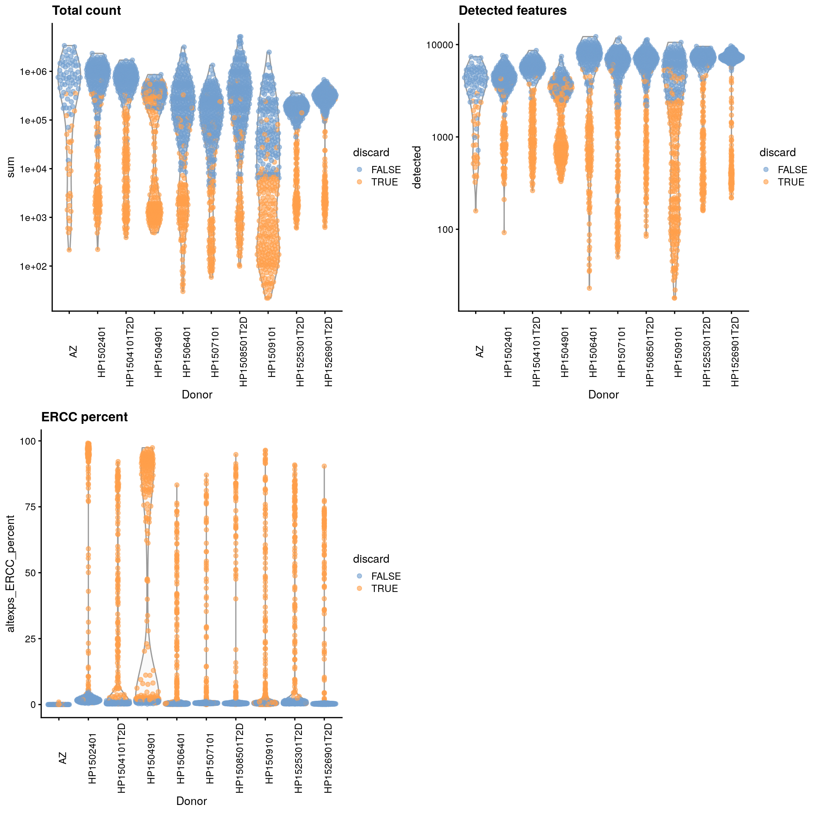
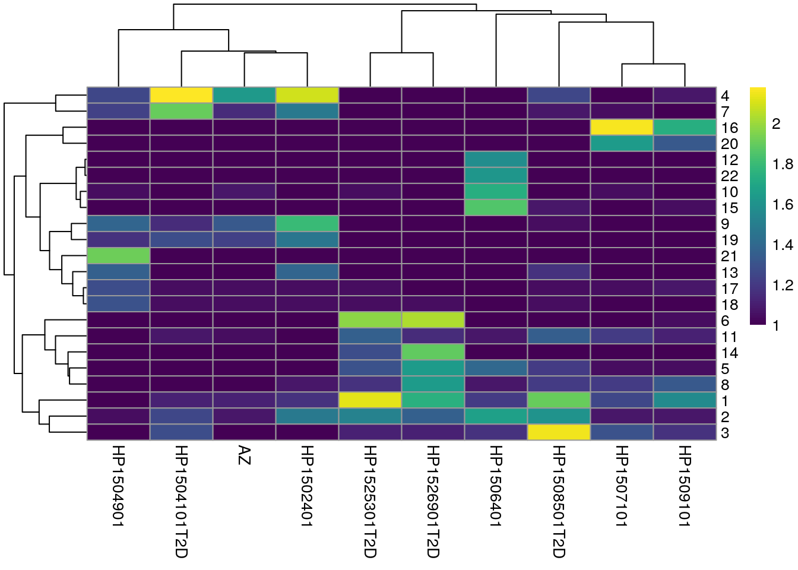
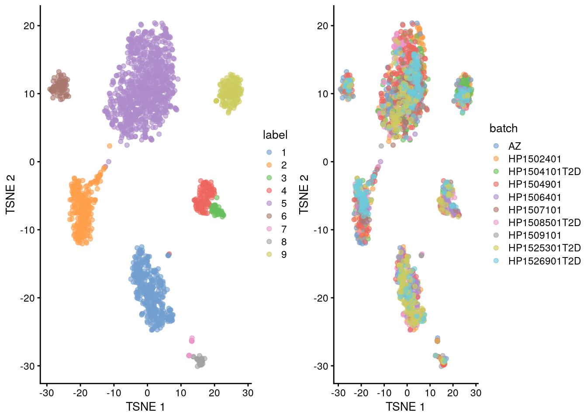

# Segerstolpe human pancreas (Smart-seq2)

<script>
document.addEventListener("click", function (event) {
    if (event.target.classList.contains("aaron-collapse")) {
        event.target.classList.toggle("active");
        var content = event.target.nextElementSibling;
        if (content.style.display === "block") {
            content.style.display = "none";
        } else {
            content.style.display = "block";
        }
    }
})
</script>

<style>
.aaron-collapse {
  background-color: #eee;
  color: #444;
  cursor: pointer;
  padding: 18px;
  width: 100%;
  border: none;
  text-align: left;
  outline: none;
  font-size: 15px;
}

.aaron-content {
  padding: 0 18px;
  display: none;
  overflow: hidden;
  background-color: #f1f1f1;
}
</style>

## Introduction

This performs an analysis of the @segerstolpe2016singlecell dataset,
consisting of human pancreas cells from various donors.

## Data loading


```r
library(scRNAseq)
sce.seger <- SegerstolpePancreasData()
```


```r
library(AnnotationHub)
edb <- AnnotationHub()[["AH73881"]]
symbols <- rowData(sce.seger)$symbol
ens.id <- mapIds(edb, keys=symbols, keytype="SYMBOL", column="GENEID")
ens.id <- ifelse(is.na(ens.id), symbols, ens.id)

# Removing duplicated rows.
keep <- !duplicated(ens.id)
sce.seger <- sce.seger[keep,]
rownames(sce.seger) <- ens.id[keep]
```

We simplify the names of some of the relevant column metadata fields for ease of access.
Some editing of the cell type labels is necessary for consistency with other data sets.


```r
emtab.meta <- colData(sce.seger)[,c("cell type", "disease",
    "individual", "single cell well quality")]
colnames(emtab.meta) <- c("CellType", "Disease", "Donor", "Quality")
colData(sce.seger) <- emtab.meta

sce.seger$CellType <- gsub(" cell", "", sce.seger$CellType)
sce.seger$CellType <- paste0(
    toupper(substr(sce.seger$CellType, 1, 1)),
    substring(sce.seger$CellType, 2))
```

## Quality control


```r
unfiltered <- sce.seger
```

We remove low quality cells that were marked by the authors.
We then perform additional quality control as some of the remaining cells still have very low counts and numbers of detected features.
For some batches that seem to have a majority of low-quality cells (Figure \@ref(fig:unref-seger-qc-dist)), we use the other batches to define an appropriate threshold via `subset=`.


```r
low.qual <- sce.seger$Quality == "low quality cell"

library(scater)
stats <- perCellQCMetrics(sce.seger)
qc <- quickPerCellQC(stats, percent_subsets="altexps_ERCC_percent",
    batch=sce.seger$Donor,
    subset=!sce.seger$Donor %in% c("HP1504901", "HP1509101"))

sce.seger <- sce.seger[,!(qc$discard | low.qual)]
```


```r
colData(unfiltered) <- cbind(colData(unfiltered), stats)
unfiltered$discard <- qc$discard

gridExtra::grid.arrange(
    plotColData(unfiltered, x="Donor", y="sum", colour_by="discard") +
        scale_y_log10() + ggtitle("Total count") +
        theme(axis.text.x = element_text(angle = 90)),
    plotColData(unfiltered, x="Donor", y="detected", colour_by="discard") +
        scale_y_log10() + ggtitle("Detected features") +
        theme(axis.text.x = element_text(angle = 90)),
    plotColData(unfiltered, x="Donor", y="altexps_ERCC_percent",
        colour_by="discard") + ggtitle("ERCC percent") +
        theme(axis.text.x = element_text(angle = 90)),
    ncol=2
)
```

<div class="figure">

<p class="caption">(\#fig:unref-seger-qc-dist)Distribution of each QC metric across cells from each donor of the Segerstolpe pancreas dataset. Each point represents a cell and is colored according to whether that cell was discarded.</p>
</div>


```r
colSums(as.matrix(qc))
```

```
##              low_lib_size            low_n_features high_altexps_ERCC_percent 
##                       788                      1056                      1031 
##                   discard 
##                      1246
```

## Normalization

We don't normalize the spike-ins at this point as there are some cells with no spike-in counts.


```r
library(scran)
clusters <- quickCluster(sce.seger)
sce.seger <- computeSumFactors(sce.seger, clusters=clusters)
sce.seger <- logNormCounts(sce.seger) 
```


```r
summary(sizeFactors(sce.seger))
```

```
##    Min. 1st Qu.  Median    Mean 3rd Qu.    Max. 
##   0.014   0.390   0.708   1.000   1.332  11.182
```


```r
plot(librarySizeFactors(sce.seger), sizeFactors(sce.seger), pch=16,
    xlab="Library size factors", ylab="Deconvolution factors", log="xy")
```

<div class="figure">

<p class="caption">(\#fig:unref-seger-norm)Relationship between the library size factors and the deconvolution size factors in the Segerstolpe pancreas dataset.</p>
</div>

## Variance modelling

We do not use cells with no spike-ins for variance modelling.
Donor AZ also has very low spike-in counts and is subsequently ignored.


```r
for.hvg <- sce.seger[,librarySizeFactors(altExp(sce.seger)) > 0 & sce.seger$Donor!="AZ"]
dec.seger <- modelGeneVarWithSpikes(for.hvg, "ERCC", block=for.hvg$Donor)
chosen.hvgs <- getTopHVGs(dec.seger, n=2000)
```


```r
par(mfrow=c(3,3))
blocked.stats <- dec.seger$per.block
for (i in colnames(blocked.stats)) {
    current <- blocked.stats[[i]]
    plot(current$mean, current$total, main=i, pch=16, cex=0.5,
        xlab="Mean of log-expression", ylab="Variance of log-expression")
    curfit <- metadata(current)
    points(curfit$mean, curfit$var, col="red", pch=16)
    curve(curfit$trend(x), col='dodgerblue', add=TRUE, lwd=2)
}
```

<div class="figure">

<p class="caption">(\#fig:unref-seger-variance)Per-gene variance as a function of the mean for the log-expression values in the Grun pancreas dataset. Each point represents a gene (black) with the mean-variance trend (blue) fitted to the spike-in transcripts (red) separately for each donor.</p>
</div>

## Dimensionality reduction

We pick the first 25 PCs for downstream analyses, as it's a nice square number. 


```r
library(BiocSingular)
set.seed(101011001)
sce.seger <- runPCA(sce.seger, subset_row=chosen.hvgs, ncomponents=25)
sce.seger <- runTSNE(sce.seger, dimred="PCA")
```

## Clustering


```r
library(bluster)
clust.out <- clusterRows(reducedDim(sce.seger, "PCA"), NNGraphParam(), full=TRUE)
snn.gr <- clust.out$objects$graph
colLabels(sce.seger) <- clust.out$clusters
```

We see a strong donor effect in Figures \@ref(fig:unref-seger-heat-1) and \@ref(fig:unref-grun-tsne).
This might be due to differences in cell type composition between donors,
but the more likely explanation is that of a technical difference in plate processing or uninteresting genotypic differences.
The implication is that we should have called `fastMNN()` at some point.


```r
tab <- table(Cluster=colLabels(sce.seger), Donor=sce.seger$Donor)
library(pheatmap)
pheatmap(log10(tab+10), color=viridis::viridis(100))
```

<div class="figure">

<p class="caption">(\#fig:unref-seger-heat-1)Heatmap of the frequency of cells from each donor in each cluster.</p>
</div>


```r
gridExtra::grid.arrange(
    plotTSNE(sce.seger, colour_by="label"),
    plotTSNE(sce.seger, colour_by="Donor"),
    ncol=2
)
```

<div class="figure">

<p class="caption">(\#fig:unref-seger-tsne)Obligatory $t$-SNE plots of the Segerstolpe pancreas dataset. Each point represents a cell that is colored by cluster (left) or batch (right).</p>
</div>


## Data integration

We repeat the clustering after running `fastMNN()` on the donors.
This yields a more coherent set of clusters in Figure \@ref(fig:unref-seger-tsne-correct) where each cluster contains contributions from all donors.


```r
library(batchelor)

set.seed(10001010)
corrected <- fastMNN(sce.seger, batch=sce.seger$Donor, subset.row=chosen.hvgs)

set.seed(10000001)
corrected <- runTSNE(corrected, dimred="corrected")

colLabels(corrected) <- clusterRows(reducedDim(corrected, "corrected"), NNGraphParam())

tab <- table(Cluster=colLabels(corrected), Donor=corrected$batch)
tab
```

```
##        Donor
## Cluster  AZ HP1502401 HP1504101T2D HP1504901 HP1506401 HP1507101 HP1508501T2D
##       1   3        19            3        11        67         8           78
##       2  14        53           13        19        37        41           20
##       3   2         2            1         1        44         1            1
##       4   2        18            7         3        36         2           28
##       5  29       114          140        72        26       136          121
##       6   8        21            9         6         2         6            6
##       7   1         1            1         9         0         1            2
##       8   2         1            3        10         2         6           12
##       9   4        20           70         8        16         2            8
##        Donor
## Cluster HP1509101 HP1525301T2D HP1526901T2D
##       1        27          124           46
##       2        14           11           70
##       3         0            1            4
##       4         2           23            9
##       5        49           85           96
##       6        11            5           34
##       7         2            2            1
##       8         3           13            4
##       9         1           10           34
```


```r
gridExtra::grid.arrange(
    plotTSNE(corrected, colour_by="label"),
    plotTSNE(corrected, colour_by="batch"),
    ncol=2
)
```

<div class="figure">

<p class="caption">(\#fig:unref-seger-tsne-correct)Yet another $t$-SNE plot of the Segerstolpe dataset, this time after batch correction across donors. Each point represents a cell and is colored by the assigned cluster identity.</p>
</div>


## Multi-sample comparisons {#segerstolpe-comparison}

This particular dataset contains both healthy donors and those with type II diabetes.
It is thus of some interest to identify genes that are differentially expressed upon disease in each cell type.
To keep things simple, we use the author-provided annotation rather than determining the cell type for each of our clusters.


```r
summed <- aggregateAcrossCells(sce.seger, 
    ids=colData(sce.seger)[,c("Donor", "CellType")])
summed
```

```
## class: SingleCellExperiment 
## dim: 25454 105 
## metadata(0):
## assays(1): counts
## rownames(25454): ENSG00000118473 ENSG00000142920 ... ENSG00000278306
##   eGFP
## rowData names(2): symbol refseq
## colnames: NULL
## colData names(9): CellType Disease ... CellType ncells
## reducedDimNames(2): PCA TSNE
## altExpNames(1): ERCC
```

Here, we will use the `voom` pipeline from the *[limma](https://bioconductor.org/packages/3.12/limma)* package instead of the QL approach with *[edgeR](https://bioconductor.org/packages/3.12/edgeR)*.
This allows us to use sample weights to better account for the variation in the precision of each pseudo-bulk profile.
We see that insulin is downregulated in beta cells in the disease state, which is sensible enough.


```r
summed.beta <- summed[,summed$CellType=="Beta"]

library(edgeR)
y.beta <- DGEList(counts(summed.beta), samples=colData(summed.beta),
    genes=rowData(summed.beta)[,"symbol",drop=FALSE])
y.beta <- y.beta[filterByExpr(y.beta, group=y.beta$samples$Disease),]
y.beta <- calcNormFactors(y.beta)

design <- model.matrix(~Disease, y.beta$samples)
v.beta <- voomWithQualityWeights(y.beta, design)
fit.beta <- lmFit(v.beta)
fit.beta <- eBayes(fit.beta, robust=TRUE)

res.beta <- topTable(fit.beta, sort.by="p", n=Inf,
    coef="Diseasetype II diabetes mellitus")
head(res.beta)
```

```
##                    symbol  logFC AveExpr      t   P.Value adj.P.Val     B
## ENSG00000254647       INS -2.728  16.680 -7.671 3.191e-06   0.03902 4.842
## ENSG00000137731     FXYD2 -2.595   7.265 -6.705 1.344e-05   0.08219 3.353
## ENSG00000169297     NR0B1 -2.092   6.790 -5.789 5.810e-05   0.09916 1.984
## ENSG00000181029   TRAPPC5 -2.127   7.046 -5.678 7.007e-05   0.09916 1.877
## ENSG00000105707       HPN -1.803   6.118 -5.654 7.298e-05   0.09916 1.740
## LOC284889       LOC284889 -2.113   6.652 -5.515 9.259e-05   0.09916 1.571
```


We also create some diagnostic plots to check for potential problems in the analysis.
The MA plots exhibit the expected shape (Figure \@ref(fig:unref-ma-plots))
while the differences in the sample weights in Figure \@ref(fig:unref-voom-plots) justify the use of `voom()` in this context.


```r
par(mfrow=c(5, 2))
for (i in colnames(y.beta)) {
    plotMD(y.beta, column=i)
}
```

<div class="figure">

<p class="caption">(\#fig:unref-ma-plots)MA plots for the beta cell pseudo-bulk profiles. Each MA plot is generated by comparing the corresponding pseudo-bulk profile against the average of all other profiles</p>
</div>


```r
# Easier to just re-run it with plot=TRUE than
# to try to make the plot from 'v.beta'.
voomWithQualityWeights(y.beta, design, plot=TRUE)
```

<div class="figure">

<p class="caption">(\#fig:unref-voom-plots)Diagnostic plots for `voom` after estimating observation and quality weights from the beta cell pseudo-bulk profiles. The left plot shows the mean-variance trend used to estimate the observation weights, while the right plot shows the per-sample quality weights.</p>
</div>


## Session Info {-}

<button class="aaron-collapse">View session info</button>
<div class="aaron-content">
```
R version 4.0.2 (2020-06-22)
Platform: x86_64-pc-linux-gnu (64-bit)
Running under: Ubuntu 18.04.5 LTS

Matrix products: default
BLAS:   /home/biocbuild/bbs-3.12-bioc/R/lib/libRblas.so
LAPACK: /home/biocbuild/bbs-3.12-bioc/R/lib/libRlapack.so

locale:
 [1] LC_CTYPE=en_US.UTF-8       LC_NUMERIC=C              
 [3] LC_TIME=en_US.UTF-8        LC_COLLATE=C              
 [5] LC_MONETARY=en_US.UTF-8    LC_MESSAGES=en_US.UTF-8   
 [7] LC_PAPER=en_US.UTF-8       LC_NAME=C                 
 [9] LC_ADDRESS=C               LC_TELEPHONE=C            
[11] LC_MEASUREMENT=en_US.UTF-8 LC_IDENTIFICATION=C       

attached base packages:
[1] parallel  stats4    stats     graphics  grDevices utils     datasets 
[8] methods   base     

other attached packages:
 [1] edgeR_3.31.4                limma_3.45.10              
 [3] batchelor_1.5.2             pheatmap_1.0.12            
 [5] bluster_0.99.1              BiocSingular_1.5.0         
 [7] scran_1.17.15               scater_1.17.4              
 [9] ggplot2_3.3.2               ensembldb_2.13.1           
[11] AnnotationFilter_1.13.0     GenomicFeatures_1.41.2     
[13] AnnotationDbi_1.51.3        AnnotationHub_2.21.2       
[15] BiocFileCache_1.13.1        dbplyr_1.4.4               
[17] scRNAseq_2.3.12             SingleCellExperiment_1.11.6
[19] SummarizedExperiment_1.19.6 DelayedArray_0.15.7        
[21] matrixStats_0.56.0          Matrix_1.2-18              
[23] Biobase_2.49.0              GenomicRanges_1.41.6       
[25] GenomeInfoDb_1.25.10        IRanges_2.23.10            
[27] S4Vectors_0.27.12           BiocGenerics_0.35.4        
[29] BiocStyle_2.17.0            simpleSingleCell_1.13.16   

loaded via a namespace (and not attached):
  [1] Rtsne_0.15                    ggbeeswarm_0.6.0             
  [3] colorspace_1.4-1              ellipsis_0.3.1               
  [5] scuttle_0.99.12               XVector_0.29.3               
  [7] BiocNeighbors_1.7.0           farver_2.0.3                 
  [9] bit64_4.0.2                   interactiveDisplayBase_1.27.5
 [11] codetools_0.2-16              knitr_1.29                   
 [13] Rsamtools_2.5.3               graph_1.67.1                 
 [15] shiny_1.5.0                   BiocManager_1.30.10          
 [17] compiler_4.0.2                httr_1.4.2                   
 [19] dqrng_0.2.1                   assertthat_0.2.1             
 [21] fastmap_1.0.1                 lazyeval_0.2.2               
 [23] later_1.1.0.1                 htmltools_0.5.0              
 [25] prettyunits_1.1.1             tools_4.0.2                  
 [27] igraph_1.2.5                  rsvd_1.0.3                   
 [29] gtable_0.3.0                  glue_1.4.1                   
 [31] GenomeInfoDbData_1.2.3        dplyr_1.0.1                  
 [33] rappdirs_0.3.1                Rcpp_1.0.5                   
 [35] vctrs_0.3.2                   Biostrings_2.57.2            
 [37] ExperimentHub_1.15.1          rtracklayer_1.49.5           
 [39] DelayedMatrixStats_1.11.1     xfun_0.16                    
 [41] stringr_1.4.0                 ps_1.3.4                     
 [43] mime_0.9                      lifecycle_0.2.0              
 [45] irlba_2.3.3                   statmod_1.4.34               
 [47] XML_3.99-0.5                  zlibbioc_1.35.0              
 [49] scales_1.1.1                  hms_0.5.3                    
 [51] promises_1.1.1                ProtGenerics_1.21.0          
 [53] RColorBrewer_1.1-2            yaml_2.2.1                   
 [55] curl_4.3                      memoise_1.1.0                
 [57] gridExtra_2.3                 biomaRt_2.45.2               
 [59] stringi_1.4.6                 RSQLite_2.2.0                
 [61] highr_0.8                     BiocVersion_3.12.0           
 [63] BiocParallel_1.23.2           rlang_0.4.7                  
 [65] pkgconfig_2.0.3               bitops_1.0-6                 
 [67] evaluate_0.14                 lattice_0.20-41              
 [69] purrr_0.3.4                   labeling_0.3                 
 [71] GenomicAlignments_1.25.3      CodeDepends_0.6.5            
 [73] cowplot_1.0.0                 bit_4.0.4                    
 [75] processx_3.4.3                tidyselect_1.1.0             
 [77] magrittr_1.5                  bookdown_0.20                
 [79] R6_2.4.1                      generics_0.0.2               
 [81] DBI_1.1.0                     pillar_1.4.6                 
 [83] withr_2.2.0                   RCurl_1.98-1.2               
 [85] tibble_3.0.3                  crayon_1.3.4                 
 [87] rmarkdown_2.3                 viridis_0.5.1                
 [89] progress_1.2.2                locfit_1.5-9.4               
 [91] grid_4.0.2                    blob_1.2.1                   
 [93] callr_3.4.3                   digest_0.6.25                
 [95] xtable_1.8-4                  httpuv_1.5.4                 
 [97] openssl_1.4.2                 munsell_0.5.0                
 [99] beeswarm_0.2.3                viridisLite_0.3.0            
[101] vipor_0.4.5                   askpass_1.1                  
```
</div>
