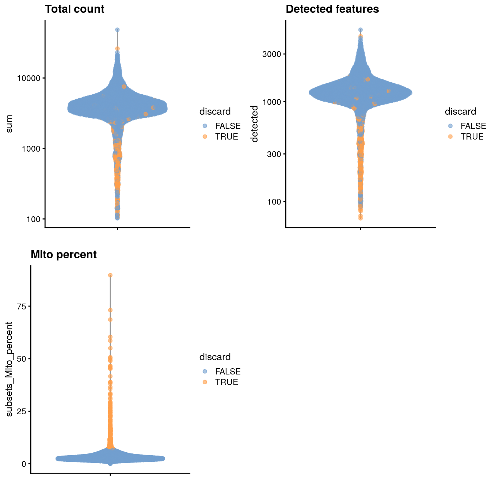
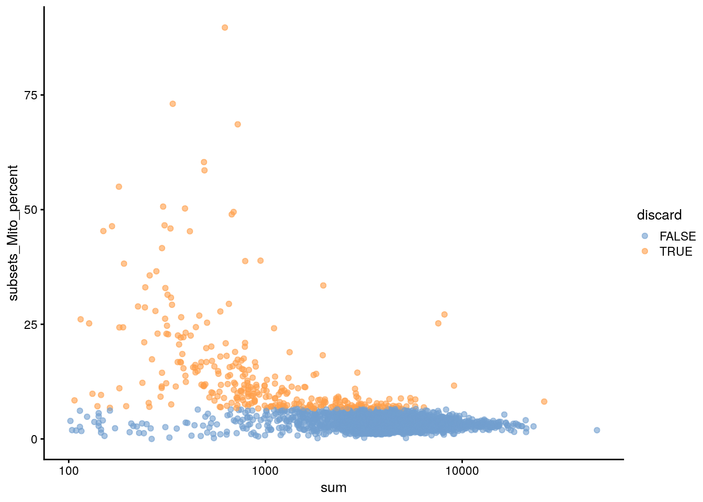
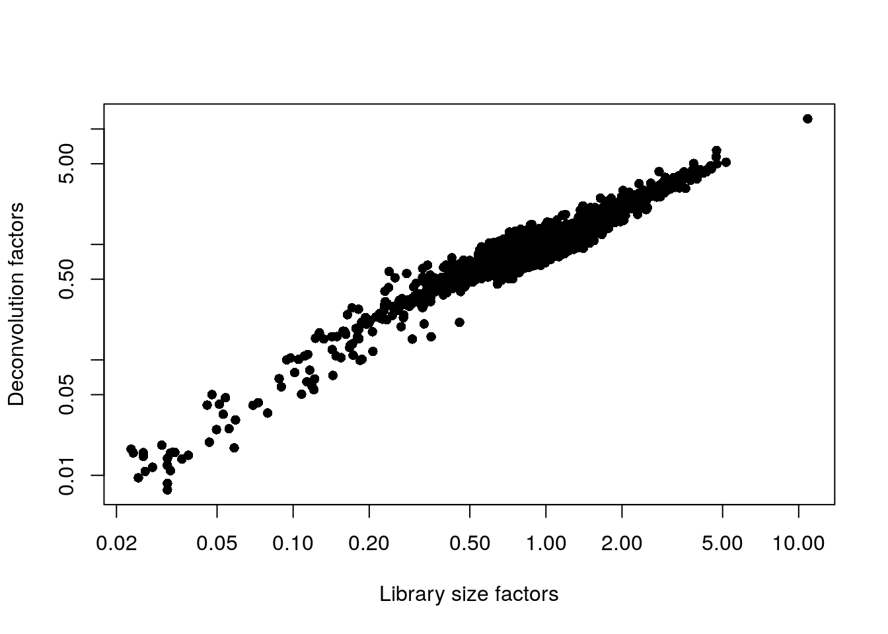
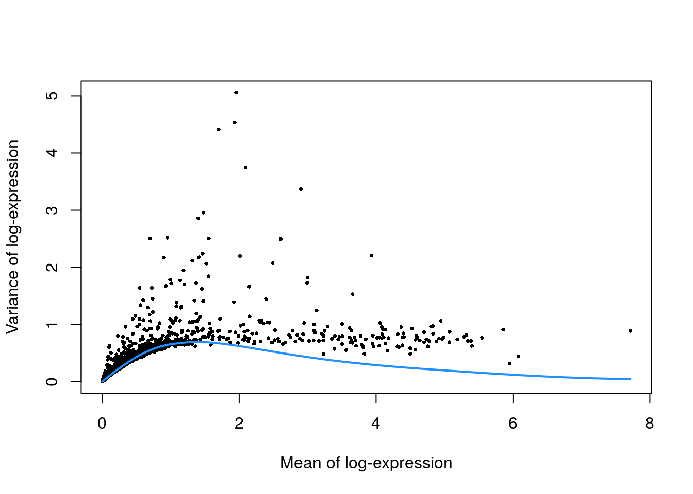
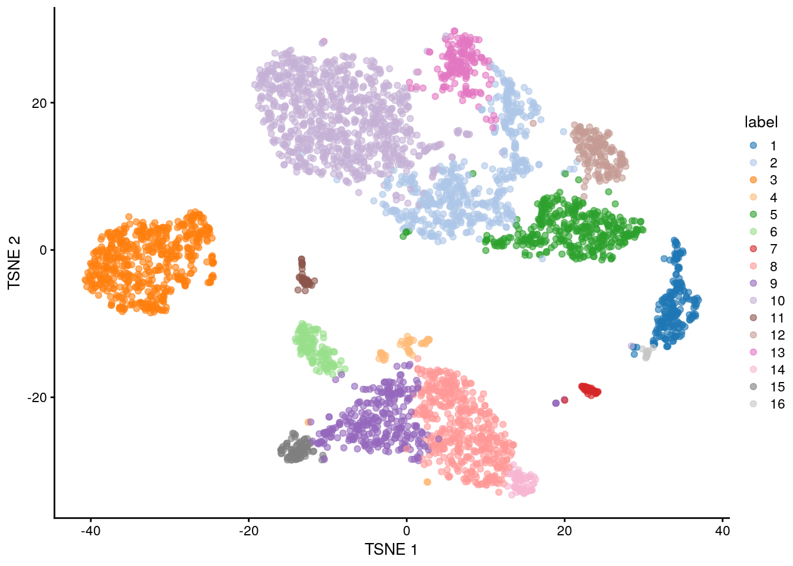
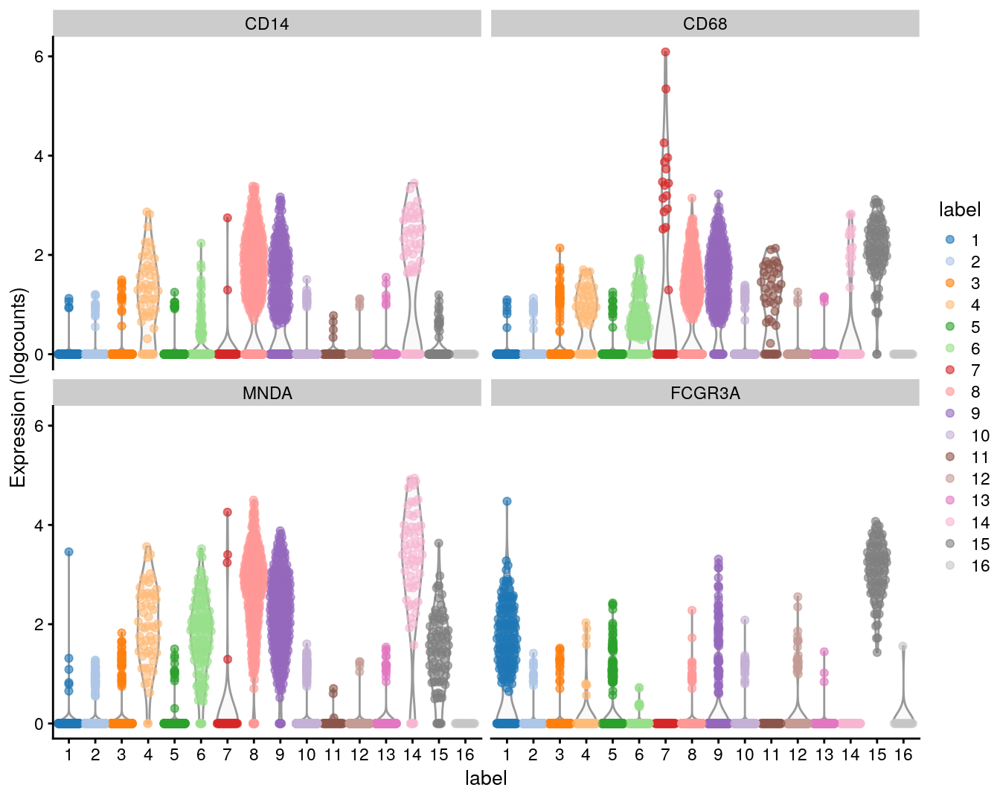

# Unfiltered human PBMCs (10X Genomics)

<script>
document.addEventListener("click", function (event) {
    if (event.target.classList.contains("aaron-collapse")) {
        event.target.classList.toggle("active");
        var content = event.target.nextElementSibling;
        if (content.style.display === "block") {
            content.style.display = "none";
        } else {
            content.style.display = "block";
        }
    }
})
</script>

<style>
.aaron-collapse {
  background-color: #eee;
  color: #444;
  cursor: pointer;
  padding: 18px;
  width: 100%;
  border: none;
  text-align: left;
  outline: none;
  font-size: 15px;
}

.aaron-content {
  padding: 0 18px;
  display: none;
  overflow: hidden;
  background-color: #f1f1f1;
}
</style>

## Introduction

Here, we describe a brief analysis of the peripheral blood mononuclear cell (PBMC) dataset from 10X Genomics [@zheng2017massively].
The data are publicly available from the [10X Genomics website](https://support.10xgenomics.com/single-cell-gene-expression/datasets/2.1.0/pbmc4k),
from which we download the raw gene/barcode count matrices, i.e., before cell calling from the _CellRanger_ pipeline.

## Data loading


```r
library(BiocFileCache)
bfc <- BiocFileCache("raw_data", ask = FALSE)
raw.path <- bfcrpath(bfc, file.path("http://cf.10xgenomics.com/samples",
    "cell-exp/2.1.0/pbmc4k/pbmc4k_raw_gene_bc_matrices.tar.gz"))
untar(raw.path, exdir=file.path(tempdir(), "pbmc4k"))

library(DropletUtils)
fname <- file.path(tempdir(), "pbmc4k/raw_gene_bc_matrices/GRCh38")
sce.pbmc <- read10xCounts(fname, col.names=TRUE)
```


```r
library(scater)
rownames(sce.pbmc) <- uniquifyFeatureNames(
    rowData(sce.pbmc)$ID, rowData(sce.pbmc)$Symbol)

library(EnsDb.Hsapiens.v86)
location <- mapIds(EnsDb.Hsapiens.v86, keys=rowData(sce.pbmc)$ID, 
    column="SEQNAME", keytype="GENEID")
```

## Quality control

We perform cell detection using the `emptyDrops()` algorithm, as discussed in Section \@ref(qc-droplets).


```r
set.seed(100)
e.out <- emptyDrops(counts(sce.pbmc))
sce.pbmc <- sce.pbmc[,which(e.out$FDR <= 0.001)]
```


```r
unfiltered <- sce.pbmc
```

We use a relaxed QC strategy and only remove cells with large mitochondrial proportions, using it as a proxy for cell damage.
This reduces the risk of removing cell types with low RNA content, especially in a heterogeneous PBMC population with many different cell types.


```r
stats <- perCellQCMetrics(sce.pbmc, subsets=list(Mito=which(location=="MT")))
high.mito <- isOutlier(stats$subsets_Mito_percent, type="higher")
sce.pbmc <- sce.pbmc[,!high.mito]
```


```r
summary(high.mito)
```

```
##    Mode   FALSE    TRUE 
## logical    3985     315
```


```r
colData(unfiltered) <- cbind(colData(unfiltered), stats)
unfiltered$discard <- high.mito

gridExtra::grid.arrange(
    plotColData(unfiltered, y="sum", colour_by="discard") +
        scale_y_log10() + ggtitle("Total count"),
    plotColData(unfiltered, y="detected", colour_by="discard") +
        scale_y_log10() + ggtitle("Detected features"),
    plotColData(unfiltered, y="subsets_Mito_percent",
        colour_by="discard") + ggtitle("Mito percent"),
    ncol=2
)
```

<div class="figure">

<p class="caption">(\#fig:unref-unfiltered-pbmc-qc)Distribution of various QC metrics in the PBMC dataset after cell calling. Each point is a cell and is colored according to whether it was discarded by the mitochondrial filter.</p>
</div>


```r
plotColData(unfiltered, x="sum", y="subsets_Mito_percent",
    colour_by="discard") + scale_x_log10()
```

<div class="figure">

<p class="caption">(\#fig:unref-unfiltered-pbmc-mito)Proportion of mitochondrial reads in each cell of the PBMC dataset compared to its total count.</p>
</div>

## Normalization


```r
library(scran)
set.seed(1000)
clusters <- quickCluster(sce.pbmc)
sce.pbmc <- computeSumFactors(sce.pbmc, cluster=clusters)
sce.pbmc <- logNormCounts(sce.pbmc)
```


```r
summary(sizeFactors(sce.pbmc))
```

```
##    Min. 1st Qu.  Median    Mean 3rd Qu.    Max. 
##   0.007   0.712   0.875   1.000   1.099  12.254
```


```r
plot(librarySizeFactors(sce.pbmc), sizeFactors(sce.pbmc), pch=16,
    xlab="Library size factors", ylab="Deconvolution factors", log="xy")
```

<div class="figure">

<p class="caption">(\#fig:unref-unfiltered-pbmc-norm)Relationship between the library size factors and the deconvolution size factors in the PBMC dataset.</p>
</div>

## Variance modelling


```r
set.seed(1001)
dec.pbmc <- modelGeneVarByPoisson(sce.pbmc)
top.pbmc <- getTopHVGs(dec.pbmc, prop=0.1)
```


```r
plot(dec.pbmc$mean, dec.pbmc$total, pch=16, cex=0.5,
    xlab="Mean of log-expression", ylab="Variance of log-expression")
curfit <- metadata(dec.pbmc)
curve(curfit$trend(x), col='dodgerblue', add=TRUE, lwd=2)
```

<div class="figure">

<p class="caption">(\#fig:unref-unfiltered-pbmc-var)Per-gene variance as a function of the mean for the log-expression values in the PBMC dataset. Each point represents a gene (black) with the mean-variance trend (blue) fitted to simulated Poisson counts.</p>
</div>

## Dimensionality reduction


```r
set.seed(10000)
sce.pbmc <- denoisePCA(sce.pbmc, subset.row=top.pbmc, technical=dec.pbmc)

set.seed(100000)
sce.pbmc <- runTSNE(sce.pbmc, dimred="PCA")

set.seed(1000000)
sce.pbmc <- runUMAP(sce.pbmc, dimred="PCA")
```

We verify that a reasonable number of PCs is retained.


```r
ncol(reducedDim(sce.pbmc, "PCA"))
```

```
## [1] 9
```

## Clustering


```r
g <- buildSNNGraph(sce.pbmc, k=10, use.dimred = 'PCA')
clust <- igraph::cluster_walktrap(g)$membership
colLabels(sce.pbmc) <- factor(clust)
```


```r
table(colLabels(sce.pbmc))
```

```
## 
##   1   2   3   4   5   6   7   8   9  10  11  12  13  14  15  16 
## 205 508 541  56 374 125  46 432 302 867  47 155 166  61  84  16
```


```r
plotTSNE(sce.pbmc, colour_by="label")
```

<div class="figure">

<p class="caption">(\#fig:unref-unfiltered-pbmc-tsne)Obligatory $t$-SNE plot of the PBMC dataset, where each point represents a cell and is colored according to the assigned cluster.</p>
</div>

## Interpretation


```r
markers <- findMarkers(sce.pbmc, pval.type="some", direction="up")
```

We examine the markers for cluster 8 in more detail.
High expression of _CD14_, _CD68_ and _MNDA_ combined with low expression of _CD16_ suggests that this cluster contains monocytes,
compared to macrophages in cluster 15 (Figure \@ref(fig:unref-mono-pbmc-markers)).


```r
marker.set <- markers[["8"]]
as.data.frame(marker.set[1:30,1:3])
```

```
##                  p.value        FDR summary.logFC
## CSTA          7.171e-222 2.016e-217        2.4179
## MNDA          1.197e-221 2.016e-217        2.6615
## FCN1          2.376e-213 2.669e-209        2.6381
## S100A12       4.393e-212 3.701e-208        3.0809
## VCAN          1.711e-199 1.153e-195        2.2604
## TYMP          1.174e-154 6.590e-151        2.0238
## AIF1          3.674e-149 1.768e-145        2.4604
## LGALS2        4.005e-137 1.687e-133        1.8928
## MS4A6A        5.640e-134 2.111e-130        1.5457
## FGL2          2.045e-124 6.889e-121        1.3859
## RP11-1143G9.4 6.892e-122 2.111e-118        2.8042
## AP1S2         1.786e-112 5.015e-109        1.7704
## CD14          1.195e-110 3.098e-107        1.4260
## CFD           6.870e-109 1.654e-105        1.3560
## GPX1          9.049e-107 2.033e-103        2.4014
## TNFSF13B       3.920e-95  8.256e-92        1.1151
## KLF4           3.310e-94  6.560e-91        1.2049
## GRN            4.801e-91  8.987e-88        1.3815
## NAMPT          2.490e-90  4.415e-87        1.1439
## CLEC7A         7.736e-88  1.303e-84        1.0616
## S100A8         3.125e-84  5.014e-81        4.8052
## SERPINA1       1.580e-82  2.420e-79        1.3843
## CD36           8.018e-79  1.175e-75        1.0538
## MPEG1          8.482e-79  1.191e-75        0.9778
## CD68           5.119e-78  6.899e-75        0.9481
## CYBB           1.201e-77  1.556e-74        1.0300
## S100A11        1.175e-72  1.466e-69        1.8962
## RBP7           2.467e-71  2.969e-68        0.9666
## BLVRB          3.763e-71  4.372e-68        0.9701
## CD302          9.859e-71  1.107e-67        0.8792
```


```r
plotExpression(sce.pbmc, features=c("CD14", "CD68",
    "MNDA", "FCGR3A"), x="label", colour_by="label")
```

<div class="figure">

<p class="caption">(\#fig:unref-mono-pbmc-markers)Distribution of expression values for monocyte and macrophage markers across clusters in the PBMC dataset.</p>
</div>

## Session Info {-}

<button class="aaron-collapse">View session info</button>
<div class="aaron-content">
```
R version 4.0.2 (2020-06-22)
Platform: x86_64-pc-linux-gnu (64-bit)
Running under: Ubuntu 18.04.5 LTS

Matrix products: default
BLAS:   /home/biocbuild/bbs-3.12-bioc/R/lib/libRblas.so
LAPACK: /home/biocbuild/bbs-3.12-bioc/R/lib/libRlapack.so

locale:
 [1] LC_CTYPE=en_US.UTF-8       LC_NUMERIC=C              
 [3] LC_TIME=en_US.UTF-8        LC_COLLATE=C              
 [5] LC_MONETARY=en_US.UTF-8    LC_MESSAGES=en_US.UTF-8   
 [7] LC_PAPER=en_US.UTF-8       LC_NAME=C                 
 [9] LC_ADDRESS=C               LC_TELEPHONE=C            
[11] LC_MEASUREMENT=en_US.UTF-8 LC_IDENTIFICATION=C       

attached base packages:
[1] parallel  stats4    stats     graphics  grDevices utils     datasets 
[8] methods   base     

other attached packages:
 [1] scran_1.17.15               EnsDb.Hsapiens.v86_2.99.0  
 [3] ensembldb_2.13.1            AnnotationFilter_1.13.0    
 [5] GenomicFeatures_1.41.2      AnnotationDbi_1.51.3       
 [7] scater_1.17.4               ggplot2_3.3.2              
 [9] DropletUtils_1.9.10         SingleCellExperiment_1.11.6
[11] SummarizedExperiment_1.19.6 DelayedArray_0.15.7        
[13] matrixStats_0.56.0          Matrix_1.2-18              
[15] Biobase_2.49.0              GenomicRanges_1.41.6       
[17] GenomeInfoDb_1.25.10        IRanges_2.23.10            
[19] S4Vectors_0.27.12           BiocGenerics_0.35.4        
[21] BiocFileCache_1.13.1        dbplyr_1.4.4               
[23] BiocStyle_2.17.0            simpleSingleCell_1.13.16   

loaded via a namespace (and not attached):
  [1] Rtsne_0.15                ggbeeswarm_0.6.0         
  [3] colorspace_1.4-1          ellipsis_0.3.1           
  [5] scuttle_0.99.12           bluster_0.99.1           
  [7] XVector_0.29.3            BiocNeighbors_1.7.0      
  [9] farver_2.0.3              bit64_4.0.2              
 [11] RSpectra_0.16-0           codetools_0.2-16         
 [13] R.methodsS3_1.8.0         knitr_1.29               
 [15] Rsamtools_2.5.3           R.oo_1.23.0              
 [17] uwot_0.1.8                graph_1.67.1             
 [19] HDF5Array_1.17.3          BiocManager_1.30.10      
 [21] compiler_4.0.2            httr_1.4.2               
 [23] dqrng_0.2.1               assertthat_0.2.1         
 [25] lazyeval_0.2.2            limma_3.45.10            
 [27] BiocSingular_1.5.0        htmltools_0.5.0          
 [29] prettyunits_1.1.1         tools_4.0.2              
 [31] igraph_1.2.5              rsvd_1.0.3               
 [33] gtable_0.3.0              glue_1.4.1               
 [35] GenomeInfoDbData_1.2.3    dplyr_1.0.1              
 [37] rappdirs_0.3.1            Rcpp_1.0.5               
 [39] vctrs_0.3.2               Biostrings_2.57.2        
 [41] rhdf5filters_1.1.2        rtracklayer_1.49.5       
 [43] DelayedMatrixStats_1.11.1 xfun_0.16                
 [45] stringr_1.4.0             ps_1.3.4                 
 [47] lifecycle_0.2.0           irlba_2.3.3              
 [49] statmod_1.4.34            XML_3.99-0.5             
 [51] edgeR_3.31.4              zlibbioc_1.35.0          
 [53] scales_1.1.1              hms_0.5.3                
 [55] ProtGenerics_1.21.0       rhdf5_2.33.7             
 [57] yaml_2.2.1                curl_4.3                 
 [59] memoise_1.1.0             gridExtra_2.3            
 [61] biomaRt_2.45.2            stringi_1.4.6            
 [63] RSQLite_2.2.0             highr_0.8                
 [65] BiocParallel_1.23.2       rlang_0.4.7              
 [67] pkgconfig_2.0.3           bitops_1.0-6             
 [69] evaluate_0.14             lattice_0.20-41          
 [71] purrr_0.3.4               Rhdf5lib_1.11.3          
 [73] labeling_0.3              GenomicAlignments_1.25.3 
 [75] CodeDepends_0.6.5         cowplot_1.0.0            
 [77] bit_4.0.4                 processx_3.4.3           
 [79] tidyselect_1.1.0          magrittr_1.5             
 [81] bookdown_0.20             R6_2.4.1                 
 [83] generics_0.0.2            DBI_1.1.0                
 [85] pillar_1.4.6              withr_2.2.0              
 [87] RCurl_1.98-1.2            tibble_3.0.3             
 [89] crayon_1.3.4              rmarkdown_2.3            
 [91] viridis_0.5.1             progress_1.2.2           
 [93] locfit_1.5-9.4            grid_4.0.2               
 [95] FNN_1.1.3                 blob_1.2.1               
 [97] callr_3.4.3               digest_0.6.25            
 [99] R.utils_2.9.2             openssl_1.4.2            
[101] munsell_0.5.0             beeswarm_0.2.3           
[103] viridisLite_0.3.0         vipor_0.4.5              
[105] askpass_1.1              
```
</div>
