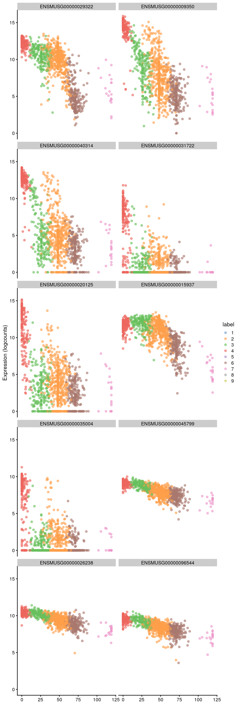
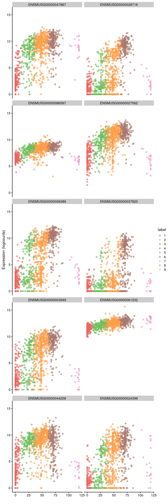

---
output:
  html_document
bibliography: ref.bib
---

# Trajectory Analysis

<script>
document.addEventListener("click", function (event) {
    if (event.target.classList.contains("rebook-collapse")) {
        event.target.classList.toggle("active");
        var content = event.target.nextElementSibling;
        if (content.style.display === "block") {
            content.style.display = "none";
        } else {
            content.style.display = "block";
        }
    }
})
</script>

<style>
.rebook-collapse {
  background-color: #eee;
  color: #444;
  cursor: pointer;
  padding: 18px;
  width: 100%;
  border: none;
  text-align: left;
  outline: none;
  font-size: 15px;
}

.rebook-content {
  padding: 0 18px;
  display: none;
  overflow: hidden;
  background-color: #f1f1f1;
}
</style>

## Overview

Many biological processes manifest as a continuum of dynamic changes in the cellular state.
The most obvious example is that of differentiation into increasingly specialized cell subtypes, but we might also consider phenomena like the cell cycle or immune cell activation that are accompanied by gradual changes in the cell's transcriptome.
We characterize these processes from single-cell expression data by identifying a "trajectory", i.e., a path through the high-dimensional expression space that traverses the various cellular states associated with a continuous process like differentiation.
In the simplest case, a trajectory will be a simple path from one point to another,
but we can also observe more complex trajectories that branch to multiple endpoints.

The "pseudotime" is defined as the positioning of cells along the trajectory that quantifies the relative activity or progression of the underlying biological process.
For example, the pseudotime for a differentiation trajectory might represent the degree of differentiation from a pluripotent cell to a terminal state where cells with larger pseudotime values are more differentiated.
This metric allows us to tackle questions related to the global population structure in a more quantitative manner.
The most common application is to fit models to gene expression against the pseudotime to identify the genes responsible for generating the trajectory in the first place, especially around interesting branch events.

In this section, we will demonstrate several different approaches to trajectory analysis using the haematopoietic stem cell (HSC) dataset from @nestorowa2016singlecell.

<button class="rebook-collapse">View history</button>
<div class="rebook-content">
   
```r
#--- data-loading ---#
library(scRNAseq)
sce.nest <- NestorowaHSCData()

#--- gene-annotation ---#
library(AnnotationHub)
ens.mm.v97 <- AnnotationHub()[["AH73905"]]
anno <- select(ens.mm.v97, keys=rownames(sce.nest), 
    keytype="GENEID", columns=c("SYMBOL", "SEQNAME"))
rowData(sce.nest) <- anno[match(rownames(sce.nest), anno$GENEID),]

#--- quality-control-grun ---#
library(scater)
stats <- perCellQCMetrics(sce.nest)
qc <- quickPerCellQC(stats, percent_subsets="altexps_ERCC_percent")
sce.nest <- sce.nest[,!qc$discard]

#--- normalization ---#
library(scran)
set.seed(101000110)
clusters <- quickCluster(sce.nest)
sce.nest <- computeSumFactors(sce.nest, clusters=clusters)
sce.nest <- logNormCounts(sce.nest)

#--- variance-modelling ---#
set.seed(00010101)
dec.nest <- modelGeneVarWithSpikes(sce.nest, "ERCC")
top.nest <- getTopHVGs(dec.nest, prop=0.1)

#--- dimensionality-reduction ---#
set.seed(101010011)
sce.nest <- denoisePCA(sce.nest, technical=dec.nest, subset.row=top.nest)
sce.nest <- runTSNE(sce.nest, dimred="PCA")

#--- clustering ---#
snn.gr <- buildSNNGraph(sce.nest, use.dimred="PCA")
colLabels(sce.nest) <- factor(igraph::cluster_walktrap(snn.gr)$membership)
```

</div>


```r
sce.nest
```

```
## class: SingleCellExperiment 
## dim: 46078 1656 
## metadata(0):
## assays(2): counts logcounts
## rownames(46078): ENSMUSG00000000001 ENSMUSG00000000003 ...
##   ENSMUSG00000107391 ENSMUSG00000107392
## rowData names(3): GENEID SYMBOL SEQNAME
## colnames(1656): HSPC_025 HSPC_031 ... Prog_852 Prog_810
## colData names(4): cell.type FACS sizeFactor label
## reducedDimNames(3): diffusion PCA TSNE
## altExpNames(1): ERCC
```

## Obtaining pseudotime orderings

### Overview

The pseudotime is simply a number describing the relative position of a cell in the trajectory,
where cells with larger values are consider to be "after" their counterparts with smaller values.
Branched trajectories will typically be associated with multiple pseudotimes, one per path through the trajectory;
these values are not usually comparable across paths.
It is worth noting that "pseudotime" is a rather unfortunate term as it may not have much to do with real-life time.
For example, one can imagine a continuum of stress states where cells move in either direction (or not) over time
but the pseudotime simply describes the transition from one end of the continuum to the other.
In trajectories describing time-dependent processes like differentiation, a cell's pseudotime value may be used as a proxy for its relative age, but only if directionality can be inferred (see Section \@ref(finding-the-root)).

The big question is how to identify the trajectory from high-dimensional expression data and map individual cells onto it.
A massive variety of different algorithms are available for doing so [@sealens2019comparison], and while we will demonstrate only a few specific methods below, many of the concepts apply generally to all trajectory inference strategies.
A more philosophical question is whether a trajectory even exists in the dataset.
One can intepret a continuum of states as a series of closely related (but distinct) subpopulations, or two well-separated clusters as the endpoints of a trajectory with rare intermediates.
The choice between these two perspectives is left to the analyst based on which is more useful, convenient or biologically sensible.

### Cluster-based minimum spanning tree

The *[TSCAN](https://bioconductor.org/packages/3.12/TSCAN)* algorithm uses a simple yet effective approach to trajectory reconstruction.
It uses the clustering to summarize the data into a smaller set of discrete units, computes cluster centroids by averaging the coordinates of its member cells, and then forms the minimum spanning tree (MST) across those centroids.
The MST is simply an undirected acyclic graph that passes through each centroid exactly once and can be thought of as the most parsimonious structure that captures the transitions between clusters.
We demonstrate below on the Nestorowa dataset, computing the cluster centroids in the low-dimensional PC space to take advantage of data compaction and denoising (Chapter \@ref(dimensionality-reduction)).


```r
library(scater)
by.cluster <- aggregateAcrossCells(sce.nest, ids=colLabels(sce.nest))
centroids <- reducedDim(by.cluster, "PCA")

# Using an implementation of the TSCAN algorithm in scran:
library(scran)
mst <- createClusterMST(centroids)
mst
```

```
## IGRAPH 1545408 UNW- 9 8 -- 
## + attr: name (v/c), weight (e/n), gain (e/n)
## + edges from 1545408 (vertex names):
## [1] 1--3 1--9 2--3 2--6 3--4 5--8 5--9 6--7
```

For reference, we can draw the same lines between the centroids in a $t$-SNE plot (Figure \@ref(fig:tscan-nest-tsne)).
This allows us to identify interesting clusters such as those at bifurcations or endpoints.
Note that the MST is generated from distances in the PC space and is merely being visualized in the $t$-SNE space,
for the same reasons as discussed in Section \@ref(visualization-interpretation);
this may occasionally result in some visually unappealing plots if the original ordering of clusters is not preserved in the plot.


```r
line.data <- connectClusterMST(reducedDim(by.cluster, "TSNE"), mst=mst)
plotTSNE(sce.nest, colour_by="label") + 
    geom_line(data=line.data, mapping=aes(x=dim1, y=dim2, group=edge))
```

<div class="figure">

<p class="caption">(\#fig:tscan-nest-tsne)$t$-SNE plot of the Nestorowa HSC dataset, where each point is a cell and is colored according to its cluster assignment. The MST obtained using a _TSCAN_-like algorithm is overlaid on top.</p>
</div>

We obtain a pseudotime ordering by projecting the cells onto the MST with `orderClusterMST()`.
More specifically, we move each cell onto the closest edge of the MST;
the pseudotime is then calculated as the distance along the MST to this new position from a "root node".
For our purposes, we will arbitrarily pick one of the endpoint nodes as the root,
though a more careful choice based on the biological annotation of each node may yield more relevant orderings
(e.g., picking a node corresponding to a more pluripotent state).
Here, multiple sets of pseudotimes are reported for a branched trajectory where each ordering corresponds 
to one path from the root node to one of the terminal nodes.


```r
tscan.pseudo <- orderClusterMST(reducedDim(sce.nest, "PCA"), 
    ids=colLabels(sce.nest), centers=centroids, mst=mst)
head(tscan.pseudo)
```

```
##          7  8
## [1,] 33.90 NA
## [2,] 53.34 NA
## [3,] 47.95 NA
## [4,] 59.92 NA
## [5,] 54.36 NA
## [6,] 70.73 NA
```

```r
# Taking the rowMeans just gives us a single pseudo-time for all cells. Cells
# in segments that are shared across paths have the same pseudo-time value for
# those paths anyway, so the rowMeans doesn't change anything.
common.pseudo <- rowMeans(tscan.pseudo, na.rm=TRUE)
plotTSNE(sce.nest, colour_by=I(common.pseudo), 
        text_by="label", text_colour="red") +
    geom_line(data=line.data, mapping=aes(x=dim1, y=dim2, group=edge))
```

<div class="figure">

<p class="caption">(\#fig:tscan-nest-pseudo)$t$-SNE plot of the Nestorowa HSC dataset, where each point is a cell and is colored according to its pseudotime value. The MST obtained using a _TSCAN_-like algorithm is overlaid on top.</p>
</div>


Alternatively, this entire series of calculations can be conveniently performed with the `quickPseudotime()` wrapper.
This executes all steps from `aggregateAcrossCells()` to `orderClusterMST()` and returns a list with the output from each step.


```r
pseudo.all <- quickPseudotime(sce.nest, use="PCA")
head(pseudo.all$ordering)
```

```
##          7  8
## [1,] 33.90 NA
## [2,] 53.34 NA
## [3,] 47.95 NA
## [4,] 59.92 NA
## [5,] 54.36 NA
## [6,] 70.73 NA
```

The MST can also be constructed with an "outgroup" to avoid connecting unrelated populations in the dataset.
Based on the OMEGA cluster concept from @street2018slingshot,
the outgroup is an artificial cluster that is equidistant from all real clusters at some threshold value.
If the original MST _sans_ the outgroup contains an edge that is longer than twice the threshold,
the MST computed with the edge will instead be routed through the outgroup.
We can subsequently break up the MST into subcomponents (i.e., a minimum spanning forest) by removing the outgroup.
We set `outgroup=TRUE` to introduce an outgroup with an automatically determined threwshold distance,
which breaks off up our previous MST into two components (Figure \@ref(fig:tscan-nest-omega)).


```r
pseudo.og <- quickPseudotime(sce.nest, use="PCA", outgroup=TRUE)
set.seed(10101)
plot(pseudo.og$mst)
```

<div class="figure">

<p class="caption">(\#fig:tscan-nest-omega)Minimum spanning tree of the Nestorowa clusters after introducing an outgroup.</p>
</div>


The *[TSCAN](https://bioconductor.org/packages/3.12/TSCAN)* approach derives several advantages from using clusters to form the MST.
The most obvious is that of computational speed as calculations are performed over clusters rather than cells.
The relative coarseness of clusters protects against the per-cell noise that would otherwise reduce the stability of the MST.
The interpretation of the MST is also straightforward as it uses the same clusters as the rest of the analysis,
allowing us to recycle previous knowledge about the biological annotations assigned to each cluster.

However, the reliance on clustering is a double-edged sword.
If the clusters are not sufficiently granular, 
it is possible for *[TSCAN](https://bioconductor.org/packages/3.12/TSCAN)* to overlook variation that occurs inside a single cluster.
The MST is obliged to pass through each cluster exactly once, which can lead to excessively circuitous paths in overclustered datasets as well as the formation of irrelevant paths between distinct cell subpopulations.
The MST also fails to handle more complex events such as "bubbles" (i.e., a bifurcation and then a merging) or cycles.

### Principal curves

To identify a trajectory, one might imagine simply "fitting" a one-dimensional curve 
so that it passes through the cloud of cells in the high-dimensional expression space.
This is the idea behind principal curves [@hastie1989principal], 
effectively a non-linear generalization of PCA where the axes of most variation are allowed to bend.
We use the *[slingshot](https://bioconductor.org/packages/3.12/slingshot)* package [@street2018slingshot] to fit a single principal curve to the Nestorowa dataset,
again using the low-dimensional PC coordinates for denoising and speed.
This yields a pseudotime ordering of cells based on their relative positions when projected onto the curve.


```r
library(slingshot)
sce.sling <- slingshot(sce.nest, reducedDim='PCA')
head(sce.sling$slingPseudotime_1)
```

```
## [1] 89.44 76.34 87.88 76.93 82.41 72.10
```

We can then visualize the path taken by the fitted curve in any desired space with `embedCurves()`.
For example, Figure \@ref(fig:traj-princurve-tsne-nest) shows the behavior of the principle curve on the $t$-SNE plot.
Again, users should note that this may not always yield aesthetically pleasing plots if the $t$-SNE algorithm decides to arrange clusters so that they no longer match the ordering of the pseudotimes.


```r
embedded <- embedCurves(sce.sling, "TSNE")
embedded <- slingCurves(embedded)[[1]] # only 1 path.
embedded <- data.frame(embedded$s[embedded$ord,])

plotTSNE(sce.sling, colour_by="slingPseudotime_1") +
    geom_path(data=embedded, aes(x=Dim.1, y=Dim.2), size=1.2)
```

<div class="figure">

<p class="caption">(\#fig:traj-princurve-tsne-nest)$t$-SNE plot of the Nestorowa HSC dataset where each point is a cell and is colored by the _slingshot_ pseudotime ordering. The fitted principal curve is shown in black.</p>
</div>

The previous call to `slingshot()` assumed that all cells in the dataset were part of a single curve.
To accommodate more complex events like bifurcations, we use our previously computed cluster assignments to build a rough sketch for the global structure in the form of a MST across the cluster centroids.
Each path through the MST from a designated root node is treated as a lineage that contains cells from the associated clusters.
Principal curves are then simultaneously fitted to all lineages with some averaging across curves to encourage consistency in shared clusters across lineages.
This process yields a matrix of pseudotimes where each column corresponds to a lineage and contains the pseudotimes of all cells assigned to that lineage.


```r
sce.sling2 <- slingshot(sce.nest, cluster=colLabels(sce.nest), reducedDim='PCA')
pseudo.paths <- slingPseudotime(sce.sling2)
head(pseudo.paths)
```

```
##          curve1 curve2 curve3
## HSPC_025 107.11     NA     NA
## HSPC_031  95.38  101.6  117.1
## HSPC_037 103.74  104.1  109.3
## HSPC_008  99.25  115.7  103.9
## HSPC_014 103.07  111.0  105.7
## HSPC_020     NA  124.0     NA
```

By using the MST as a scaffold for the global structure, `slingshot()` can accommodate branching events based on divergence in the principal curves (Figure \@ref(fig:traj-princurve-clustered-nest)).
However, unlike *[TSCAN](https://bioconductor.org/packages/3.12/TSCAN)*, the MST here is only used as a rough guide and does not define the final pseudotime.


```r
sce.nest <- runUMAP(sce.nest, dimred="PCA")
reducedDim(sce.sling2, "UMAP") <- reducedDim(sce.nest, "UMAP")
shared.pseudo <- rowMeans(pseudo.paths, na.rm=TRUE)

# Need to loop over the paths and add each one separately.
gg <- plotUMAP(sce.sling2, colour_by=I(shared.pseudo))
embedded <- embedCurves(sce.sling2, "UMAP")
embedded <- slingCurves(embedded)
for (path in embedded) {
    embedded <- data.frame(path$s[path$ord,])
    gg <- gg + geom_path(data=embedded, aes(x=Dim.1, y=Dim.2), size=1.2)
}

gg
```

<div class="figure">

<p class="caption">(\#fig:traj-princurve-clustered-nest)UMAP plot of the Nestorowa HSC dataset where each point is a cell and is colored by the average _slingshot_ pseudotime across paths. The principal curves fitted to each lineage are shown in black.</p>
</div>

We can use `slingshotBranchID()` to determine whether a particular cell is shared across multiple curves or is unique to a subset of curves (i.e., is located "after" branching).
In this case, we can see that most cells jump directly from a global common segment (`1,2,3`) to one of the curves (`1`, `2`, `3`) without any further hierarchy, i.e., no noticeable internal branch points.


```r
curve.assignments <- slingBranchID(sce.sling2)
table(curve.assignments)
```

```
## curve.assignments
##     1   1,2 1,2,3   1,3     2   2,3     3 
##   435     6   892     2   222    39    60
```


For larger datasets, we can speed up the algorithm by approximating each principal curve with a fixed number of points.
By default, `slingshot()` uses one point per cell to define the curve, which is unnecessarily precise when the number of cells is large.
Applying an approximation with `approx_points=` reduces computational work without any major loss of precision in the pseudotime estimates.


```r
sce.sling3 <- slingshot(sce.nest, cluster=colLabels(sce.nest), 
    reducedDim='PCA', approx_points=100)
pseudo.paths3 <- slingPseudotime(sce.sling3)
head(pseudo.paths3)
```

```
##          curve1 curve2 curve3
## HSPC_025 106.84     NA     NA
## HSPC_031  95.37  101.8  117.1
## HSPC_037 103.07  104.1  109.0
## HSPC_008  98.72  115.5  103.7
## HSPC_014 103.07  110.9  105.3
## HSPC_020     NA  123.5     NA
```


The MST can also be constructed with an OMEGA cluster to avoid connecting unrelated trajectories.
This operates in the same manner as (and was the inspiration for) the outgroup for *[scran](https://bioconductor.org/packages/3.12/scran)*'s MST,
Principal curves are fitted through each component individually, 
manifesting in the pseudotime matrix as paths that do not share any cells.


```r
sce.sling4 <- slingshot(sce.nest, cluster=colLabels(sce.nest), 
    reducedDim='PCA', approx_points=100, omega=TRUE)
pseudo.paths4 <- slingPseudotime(sce.sling4)
head(pseudo.paths4)
```

```
##          curve1 curve2 curve3
## HSPC_025 111.83     NA     NA
## HSPC_031  96.16  99.78     NA
## HSPC_037 105.49 105.08     NA
## HSPC_008 102.00 117.28     NA
## HSPC_014 105.49 112.70     NA
## HSPC_020     NA 126.08     NA
```

```r
shared.pseudo <- rowMeans(pseudo.paths, na.rm=TRUE)
gg <- plotUMAP(sce.sling4, colour_by=I(shared.pseudo))
embedded <- embedCurves(sce.sling4, "UMAP")
embedded <- slingCurves(embedded)
for (path in embedded) {
    embedded <- data.frame(path$s[path$ord,])
    gg <- gg + geom_path(data=embedded, aes(x=Dim.1, y=Dim.2), size=1.2)
}
gg
```

<div class="figure">

<p class="caption">(\#fig:traj-princurve-omag-nest)UMAP plot of the Nestorowa HSC dataset where each point is a cell and is colored by the average _slingshot_ pseudotime across paths. The principal curves (black lines) were constructed with an OMEGA cluster.</p>
</div>


The use of principal curves adds an extra layer of sophistication that complements the deficiencies of the cluster-based MST.
The principal curve has the opportunity to model variation within clusters that would otherwise be overlooked;
for example, *[slingshot](https://bioconductor.org/packages/3.12/slingshot)* could build a trajectory out of one cluster while a _TSCAN_-like algorithm cannot.
Conversely, the principal curves can "smooth out" circuitous paths in the MST for overclustered data,
ignoring small differences between fine clusters that are unlikely to be relevant to the overall trajectory.

That said, the structure of the initial MST is still fundamentally dependent on the resolution of the clusters.
One can arbitrarily change the number of branches from *[slingshot](https://bioconductor.org/packages/3.12/slingshot)* by tuning the cluster granularity,
making it difficult to use the output as evidence for the presence/absence of subtle branch events.
If the variation within clusters is uninteresting, the greater sensitivity of the curve fitting to such variation may yield irrelevant trajectories where the differences between clusters are masked.
Moreover, *[slingshot](https://bioconductor.org/packages/3.12/slingshot)* is no longer obliged to separate clusters in pseudotime,
which may complicate intepretation of the trajectory with respect to existing cluster annotations.

## Characterizing trajectories

### Overview

Once we have constructed a trajectory, the next step is to characterize the underlying biology based on its DE genes.
The aim here is to find the genes that exhibit significant changes in expression across pseudotime,
as these are the most likely to have driven the formation of the trajectory in the first place.
The overall strategy is to fit a model to the per-gene expression with respect to pseudotime,
allowing us to obtain inferences about the significance of any association.
We can then prioritize interesting genes as those with low $p$-values for further investigation.
A diversity of options are available for model fitting but we will focus on the simplest strategy of fitting a linear model to the log-expression values with respect to the pseudotime; we will discuss some of the more advanced models later.

### Changes along a trajectory

To demonstrate, we will identify genes with significant changes with respect to one of the TSCAN pseudotimes in the Nestorowa data.
We use the `testPseudotime()` utility to fit a natural spline to the expression of each gene,
allowing us to model a range of non-linear relationships in the data.
We then perform an analysis of variance (ANOVA) to determine if any of the spline coefficients are significantly non-zero,
i.e., there is some significant trend with respect to pseudotime.


```r
library(scran)
pseudo <- testPseudotime(sce.nest, pseudotime=tscan.pseudo[,1])
pseudo$SYMBOL <- rowData(sce.nest)$SYMBOL
pseudo[order(pseudo$p.value),]
```

```
## DataFrame with 46078 rows and 4 columns
##                         logFC      p.value          FDR      SYMBOL
##                     <numeric>    <numeric>    <numeric> <character>
## ENSMUSG00000029322 -0.0872517  0.00000e+00  0.00000e+00       Plac8
## ENSMUSG00000105231  0.0158450  0.00000e+00  0.00000e+00       Iglj3
## ENSMUSG00000076608  0.0118768 2.76194e-310 3.91579e-306       Igkj5
## ENSMUSG00000106668  0.0153919 2.59403e-300 2.75829e-296       Iglj1
## ENSMUSG00000022496  0.0229337 4.90552e-297 4.17293e-293    Tnfrsf17
## ...                       ...          ...          ...         ...
## ENSMUSG00000107367          0          NaN          NaN      Mir192
## ENSMUSG00000107372          0          NaN          NaN          NA
## ENSMUSG00000107381          0          NaN          NaN          NA
## ENSMUSG00000107382          0          NaN          NaN     Gm37714
## ENSMUSG00000107391          0          NaN          NaN        Rian
```

In practice, it is helpful to pair the ANOVA results with a fit from a much simpler model
where we assume that there exists a linear relationship between expression and the pseudotime.
This yields an interpretable summary of the overall direction of change in the `logFC` field above,
complementing the more poweful spline-based model used to populate the `p.value` field.
(In contrast, the magnitude and sign of the spline coefficients cannot be easily interpreted.)


To simplify the results, we will repeat our DE analysis after filtering out cluster 7.
This cluster seems to contain a set of B cell precursors that are located at one end of the trajectory,
causing immunoglobulins to dominate the set of DE genes and mask other interesting effects.
(Incidentally, this is the same cluster that was split into a separate component in the outgroup-based MST.)


```r
discard <- "7"
keep <- colLabels(sce.nest)!=discard
pseudo <- testPseudotime(sce.nest[,keep], pseudotime=tscan.pseudo[keep,1])
pseudo$SYMBOL <- rowData(sce.nest)$SYMBOL
sorted <- pseudo[order(pseudo$p.value),]
```


Examination of the top downregulated genes suggests that this pseudotime represents a transition away from myeloid identity,
based on the decrease in expression of genes such as _Mpo_ and _Plac8_ (Figure \@ref(fig:nest-1-simple-down)).


```r
up.left <- sorted[sorted$logFC < 0,]
head(up.left, 10)
```

```
## DataFrame with 10 rows and 4 columns
##                         logFC      p.value          FDR      SYMBOL
##                     <numeric>    <numeric>    <numeric> <character>
## ENSMUSG00000029322 -0.0951619  0.00000e+00  0.00000e+00       Plac8
## ENSMUSG00000009350 -0.1230460 5.84393e-245 1.24154e-240         Mpo
## ENSMUSG00000040314 -0.1247572 4.88021e-231 6.91200e-227        Ctsg
## ENSMUSG00000031722 -0.0772702 3.46421e-217 3.67985e-213          Hp
## ENSMUSG00000020125 -0.1055643 2.16570e-211 1.84042e-207       Elane
## ENSMUSG00000015937 -0.0439171 7.20289e-204 5.10085e-200       H2afy
## ENSMUSG00000035004 -0.0770322 7.79177e-201 4.72961e-197       Igsf6
## ENSMUSG00000045799 -0.0270218 8.81597e-197 4.68238e-193      Gm9800
## ENSMUSG00000026238 -0.0255206 1.30289e-194 6.15111e-191        Ptma
## ENSMUSG00000096544 -0.0264184 3.68479e-177 1.56567e-173      Gm4617
```

```r
best <- head(rownames(up.left), 10)
plotExpression(sce.nest, features=best,
    x=I(tscan.pseudo[,1]), colour_by="label")
```

<div class="figure">

<p class="caption">(\#fig:nest-1-simple-down)Expression of the top 10 genes that decrease in expression with increasing pseudotime along the first path in the MST of the Nestorowa dataset. Each point represents a cell that is mapped to this path and is colored by the assigned cluster.</p>
</div>


Conversely, the later parts of the pseudotime may correspond to a more stem-like state based on upregulation of genes like _Hlf_.
There is also increased expression of genes associated with the lymphoid lineage (e.g., _Ltb_),
consistent with reduced commitment to the myeloid lineage at earlier pseudotime values. 


```r
up.right <- sorted[sorted$logFC > 0,]
head(up.right, 10)
```

```
## DataFrame with 10 rows and 4 columns
##                        logFC      p.value          FDR      SYMBOL
##                    <numeric>    <numeric>    <numeric> <character>
## ENSMUSG00000047867 0.0869463 1.07588e-173 4.15581e-170      Gimap6
## ENSMUSG00000028716 0.1023233 4.34777e-172 1.53947e-168    Pdzk1ip1
## ENSMUSG00000086567 0.0294706 9.70407e-165 2.57704e-161      Gm2830
## ENSMUSG00000027562 0.0646994 5.71870e-156 1.01245e-152        Car2
## ENSMUSG00000006389 0.1096438 4.35705e-151 7.12043e-148         Mpl
## ENSMUSG00000037820 0.0702660 1.80951e-135 1.78805e-132        Tgm2
## ENSMUSG00000003949 0.0934931 3.07301e-126 2.37404e-123         Hlf
## ENSMUSG00000061232 0.0191498 1.23937e-125 9.40368e-123       H2-K1
## ENSMUSG00000044258 0.0557909 3.64193e-121 2.38070e-118      Ctla2a
## ENSMUSG00000024399 0.0998322 5.51208e-116 3.16498e-113         Ltb
```

```r
best <- head(rownames(up.right), 10)
plotExpression(sce.nest, features=best, 
    x=I(tscan.pseudo[,1]), colour_by="label")
```

<div class="figure">

<p class="caption">(\#fig:nest-1-simple-up)Expression of the top 10 genes that increase in expression with increasing pseudotime along the first path in the MST of the Nestorowa dataset. Each point represents a cell that is mapped to this path and is colored by the assigned cluster.</p>
</div>


### Changes between paths

A more advanced analysis involves looking for differences in expression between paths of a branched trajectory.
This is most interesting for cells close to the branch point between two or more paths
where the differential expression analysis may highlight genes is responsible for the branching event.
The general strategy here is to fit one trend to the unique part of each path immediately following the branch point,
followed by a comparison of the fits between paths.

To this end, a particularly tempting approach is to perform another ANOVA with our spline-based model
and test for significant differences in the spline parameters between paths.
While this can be done with `testPseudotime()`, 
we do not do so because the magnitude of the pseudotime has little meaning across lineages.
A pseudotime value in one path of the MST does not, in general, have any relation to the same value in another path;
this compromises any comparison of trends as we cannot reliably say that they are being fitted to comparable $x$-axes. 

Rather, we employ the much simpler _ad hoc_ approach of fitting a spline to each trajectory and comparing the sets of DE genes.
To demonstrate, we focus on the cluster containing the branch point in the Nestorowa-derived MST.
We recompute the pseudotimes so that changes in expression are detected with respect to separation of paths from each other,
allowing us to detect genes that are associated with the divergence of the branches.


```r
starter <- "3"
tscan.pseudo2 <- orderClusterMST(reducedDim(sce.nest, "PCA"), 
    ids=colLabels(sce.nest), centers=centroids, mst=mst, 
    start=starter)
```


We then apply `testPseudotime()` to each path involving cluster 3.
We subset our analysis to only that cluster's cells so as to focus on DE events close to the branch point.
Because we are operating over a relatively short pseudotime interval, we do not expect complex trends
and so we set `df=1` (i.e., a linear trend) to avoid problems from overfitting. 


```r
keep <- colLabels(sce.nest) == starter
sub.nest <- sce.nest[,keep]

pseudo1 <- testPseudotime(sub.nest, df=1, pseudotime=tscan.pseudo2[keep,1])
pseudo1$SYMBOL <- rowData(sce.nest)$SYMBOL
pseudo1[order(pseudo1$p.value),]
```

```
## DataFrame with 46078 rows and 5 columns
##                        logFC   logFC.1     p.value         FDR        SYMBOL
##                    <numeric> <numeric>   <numeric>   <numeric>   <character>
## ENSMUSG00000009350  0.332855  0.332855 2.67471e-18 9.59018e-14           Mpo
## ENSMUSG00000040314  0.475509  0.475509 5.65148e-16 1.01317e-11          Ctsg
## ENSMUSG00000064147  0.449444  0.449444 3.76156e-15 4.49569e-11         Rab44
## ENSMUSG00000026581  0.379946  0.379946 3.86978e-14 3.46877e-10          Sell
## ENSMUSG00000085611  0.266637  0.266637 7.51248e-12 5.38720e-08     Ap3s1-ps1
## ...                      ...       ...         ...         ...           ...
## ENSMUSG00000107380         0         0         NaN         NaN     Vmn1r-ps6
## ENSMUSG00000107381         0         0         NaN         NaN            NA
## ENSMUSG00000107382         0         0         NaN         NaN       Gm37714
## ENSMUSG00000107387         0         0         NaN         NaN 5430435K18Rik
## ENSMUSG00000107391         0         0         NaN         NaN          Rian
```

```r
pseudo2 <- testPseudotime(sub.nest, df=1, pseudotime=tscan.pseudo2[keep,2])
pseudo2$SYMBOL <- rowData(sce.nest)$SYMBOL
pseudo2[order(pseudo2$p.value),]
```

```
## DataFrame with 46078 rows and 5 columns
##                         logFC    logFC.1     p.value         FDR      SYMBOL
##                     <numeric>  <numeric>   <numeric>   <numeric> <character>
## ENSMUSG00000027342 -0.1265815 -0.1265815 1.14035e-11 4.01425e-07        Pcna
## ENSMUSG00000025747 -0.3693852 -0.3693852 5.06241e-09 6.43725e-05        Tyms
## ENSMUSG00000020358 -0.1001289 -0.1001289 6.95055e-09 6.43725e-05     Hnrnpab
## ENSMUSG00000035198 -0.4166721 -0.4166721 7.31465e-09 6.43725e-05       Tubg1
## ENSMUSG00000045799 -0.0452833 -0.0452833 5.43487e-08 3.19298e-04      Gm9800
## ...                       ...        ...         ...         ...         ...
## ENSMUSG00000107380          0          0         NaN         NaN   Vmn1r-ps6
## ENSMUSG00000107381          0          0         NaN         NaN          NA
## ENSMUSG00000107382          0          0         NaN         NaN     Gm37714
## ENSMUSG00000107386          0          0         NaN         NaN     Gm42800
## ENSMUSG00000107391          0          0         NaN         NaN        Rian
```

```r
pseudo3 <- testPseudotime(sub.nest, df=1, pseudotime=tscan.pseudo2[keep,3])
pseudo3$SYMBOL <- rowData(sce.nest)$SYMBOL
pseudo3[order(pseudo3$p.value),]
```

```
## DataFrame with 46078 rows and 5 columns
##                        logFC   logFC.1     p.value         FDR        SYMBOL
##                    <numeric> <numeric>   <numeric>   <numeric>   <character>
## ENSMUSG00000042817 -0.411375 -0.411375 7.83960e-14 2.00860e-09          Flt3
## ENSMUSG00000015937 -0.163091 -0.163091 1.18901e-13 2.00860e-09         H2afy
## ENSMUSG00000002985  0.351661  0.351661 7.64160e-13 8.60597e-09          Apoe
## ENSMUSG00000053168 -0.398684 -0.398684 8.17626e-12 6.90608e-08 9030619P08Rik
## ENSMUSG00000029247 -0.137079 -0.137079 1.78997e-10 1.06448e-06         Paics
## ...                      ...       ...         ...         ...           ...
## ENSMUSG00000107381         0         0         NaN         NaN            NA
## ENSMUSG00000107382         0         0         NaN         NaN       Gm37714
## ENSMUSG00000107384         0         0         NaN         NaN       Gm42557
## ENSMUSG00000107387         0         0         NaN         NaN 5430435K18Rik
## ENSMUSG00000107391         0         0         NaN         NaN          Rian
```

We informally compare these results by looking for genes that are significant 
in our path of interest and are not significant or changing in the opposite direction in the other paths.
We use the raw $p$-values to look for non-significant genes 
in order to increase the stringency of the definition of unique genes in our path.


```r
only3 <- pseudo3[which(pseudo3$FDR <= 0.05 & 
    (pseudo2$p.value >= 0.05 | sign(pseudo1$logFC)!=sign(pseudo3$logFC)) &
    (pseudo2$p.value >= 0.05 | sign(pseudo2$logFC)!=sign(pseudo3$logFC))),]
only3[order(only3$p.value),]
```

```
## DataFrame with 64 rows and 5 columns
##                        logFC   logFC.1     p.value         FDR      SYMBOL
##                    <numeric> <numeric>   <numeric>   <numeric> <character>
## ENSMUSG00000042817 -0.411375 -0.411375 7.83960e-14 2.00860e-09        Flt3
## ENSMUSG00000002985  0.351661  0.351661 7.64160e-13 8.60597e-09        Apoe
## ENSMUSG00000016494 -0.248953 -0.248953 1.89039e-10 1.06448e-06        Cd34
## ENSMUSG00000000486 -0.217213 -0.217213 1.24423e-09 5.25468e-06       Sept1
## ENSMUSG00000021728 -0.293032 -0.293032 3.56762e-09 1.20535e-05         Emb
## ...                      ...       ...         ...         ...         ...
## ENSMUSG00000004609 -0.205262 -0.205262 0.000118937   0.0422992        Cd33
## ENSMUSG00000083657  0.100788  0.100788 0.000145710   0.0484448     Gm12245
## ENSMUSG00000023942 -0.144269 -0.144269 0.000146255   0.0484448     Slc29a1
## ENSMUSG00000091408 -0.149411 -0.149411 0.000157634   0.0499154      Gm6728
## ENSMUSG00000053559  0.135833  0.135833 0.000159559   0.0499154       Smagp
```

We observe upregulation of interesting genes such as _Gata2_, _Cd9_ and _Apoe_ in this path,
along with downregulation of _Flt3_ (Figure \@ref(fig:nest-3-versus)).
One might speculate that this path leads to a less differentiated HSC state compared to the other directions.


```r
# Showing only the lines to/from our cluster of interest.
line.data.sub <- line.data[grepl("^3--", line.data$edge) |
    grepl("--3$", line.data$edge),]
ggline <- geom_line(data=line.data.sub, 
    mapping=aes(x=dim1, y=dim2, group=edge))

gridExtra::grid.arrange(
    plotTSNE(sub.nest, colour_by="ENSMUSG00000042817") + 
        ggtitle("Flt3") + ggline,
    plotTSNE(sub.nest, colour_by="ENSMUSG00000002985") + 
        ggtitle("Apoe") + ggline,
    plotTSNE(sub.nest, colour_by="ENSMUSG00000015053") + 
        ggtitle("Gata2") + ggline,
    plotTSNE(sub.nest, colour_by="ENSMUSG00000030342") + 
        ggtitle("Cd9") + ggline
)
```

<div class="figure">

<p class="caption">(\#fig:nest-3-versus)$t$-SNE plots of cells in the cluster containing the branch point of the MST in the Nestorowa dataset. Each point is a cell colored by the expression of a gene of interest and the relevant edges of the MST are overlaid on top.</p>
</div>


While simple and practical, this comparison strategy is even less statistically defensible than usual.
The differential testing machinery is not suited to making inferences on the absence of differences,
and we should not have used the non-significant genes to draw any conclusions.
Another limitation is that this approach cannot detect differences in the magnitude of the gradient of the trend between paths; 
a gene that is significantly upregulated in each of two paths but with a sharper gradient in one of the paths will not be DE.
(Of course, this is only a limitation if the pseudotimes were comparable in the first place.)

### Further comments

The magnitudes of the $p$-values reported here should be treated with some skepticism.
The same fundamental problems discussed in Section \@ref(p-value-invalidity) remain;
the $p$-values are computed from the same data used to define the trajectory,
and there is only a sample size of 1 in this analysis regardless of the number of cells.
Nonetheless, the $p$-value is still useful for prioritizing interesting genes 
in the same manner that it is used to identify markers between clusters.

The previous sections have focused on a very simple and efficient - but largely effective - approach to trend fitting.
Alternatively, we can use more complex strategies that involve various generalizations to the concept of linear models.
For example, generalized additive models (GAMs) are quite popular for pseudotime-based DE analyses 
as they are able to handle non-normal noise distributions and a greater diversity of non-linear trends.
We demonstrate the use of the GAM implementation from the *[tradeSeq](https://bioconductor.org/packages/3.12/tradeSeq)* package on the Nestorowa dataset below.
Specifically, we will take a leap of faith and assume that our pseudotime values are comparable across paths of the MST,
allowing us to use the `patternTest()` function to test for significant differences in expression between paths.


```r
# Getting rid of the NA's; using the cell weights
# to indicate which cell belongs on which path.
nonna.pseudo <- tscan.pseudo
nonna.pseudo[is.na(nonna.pseudo)] <- 0
cell.weights <- !is.na(tscan.pseudo)
storage.mode(cell.weights) <- "numeric"

# Fitting a GAM on the subset of genes for speed.
library(tradeSeq)
fit <- fitGAM(counts(sce.nest)[1:100,], 
    pseudotime=nonna.pseudo,
    cellWeights=cell.weights)

res <- patternTest(fit)
res$Symbol <- rowData(sce.nest)[1:100,"SYMBOL"]
res <- res[order(res$pvalue),]
head(res, 10)
```

```
##                    waldStat df pvalue fcMedian Symbol
## ENSMUSG00000000028   273.19  6      0   1.5128  Cdc45
## ENSMUSG00000000058   137.21  6      0   1.4706   Cav2
## ENSMUSG00000000078   189.79  6      0   0.9596   Klf6
## ENSMUSG00000000088   123.48  6      0   0.5417  Cox5a
## ENSMUSG00000000120    88.91  6      0   0.6077   Ngfr
## ENSMUSG00000000184   214.84  6      0   0.2120  Ccnd2
## ENSMUSG00000000247   111.97  6      0   0.2798   Lhx2
## ENSMUSG00000000248   121.37  6      0   1.0634 Clec2g
## ENSMUSG00000000278   202.90  6      0   2.0066 Scpep1
## ENSMUSG00000000303   113.22  6      0   1.1142   Cdh1
```

From a statistical perspective, the GAM is superior to linear models as the former uses the raw counts.
This accounts for the idiosyncrasies of the mean-variance relationship for low counts and avoids some problems with spurious trajectories introduced by the log-transformation (Section \@ref(normalization-transformation)).
However, this sophistication comes at the cost of increased complexity and compute time,
requiring parallelization via *[BiocParallel](https://bioconductor.org/packages/3.12/BiocParallel)* even for relatively small datasets.

When a trajectory consists of a series of clusters (as in the Nestorowa dataset),
pseudotime-based DE tests can be considered a continuous generalization of cluster-based marker detection.
One would expect to identify similar genes by performing an ANOVA on the per-cluster expression values,
and indeed, this may be a more interpretable approach as it avoids imposing the assumption that a trajectory exists at all.
The main benefit of pseudotime-based tests is that they encourage expression to be a smooth function of pseudotime,
assuming that the degrees of freedom in the trend fit prevents overfitting.
This smoothness reflects an expectation that changes in expression along a trajectory should be gradual. 

## Finding the root

### Overview

The pseudotime calculations rely on some specification of the root of the trajectory to define "position zero".
In some cases, this choice has little effect beyond flipping the sign of the gradients of the DE genes.
In other cases, this choice may necessarily arbitrary depending on the questions being asked,
e.g., what are the genes driving the transition to or from a particular part of the trajectory?
However, in situations where the trajectory is associated with a time-dependent biological process, 
the position on the trajectory corresponding to the earliest timepoint is clearly the best default choice for the root.
This simplifies interpretation by allowing the pseudotime to be treated as a proxy for real time.

<!--
The task of finding a root has some analogies in other fields such as phylogenetics,
where practitioners typically root a tree using outgroups or midpoints.
However, the problem here is fundamentally different; the ancestral nodes are not directly observed in phylogenetic trees
whereas all states of a trajectory are present in a single-cell dataset.
This precludes the use of existing phylogenetic methods (e.g., midpoint rooting makes little sense for a trajectory)
and requires some more bespoke approaches that will be discussed below.
-->

### Entropy-based methods

Trajectories are commonly used to characterize differentiation where branches are interpreted as multiple lineages.
In this setting, the root of the trajectory is best set to the "start" of the differentiation process,
i.e., the most undifferentiated state that is observed in the dataset.
It is usually possible to identify this state based on the genes that are expressed at each point of the trajectory.
However, when such prior biological knowledge is not available, we can fall back to the more general concept that undifferentiated cells have more diverse expression profiles [@gulati2020singlecell].
The assumption is that terminally differentiated cells have expression profiles that are highly specialized for their function while multipotent cells have no such constraints - and indeed, may need to have active expression programs for many lineages in preparation for commitment to any of them.


We quantify the diversity of expression by computing the entropy of the expression profile within each cell [@grun2016denovo;@guo2017slice;@teschendorff2017singlecell], with higher entropy corresponding to greater diversity and thus reduced differentiation.
To demonstrate, we examine the entropies for each cluster in the Nestorowa HSC dataset (Figure \@ref(fig:entropy-nest)).
We observe that clusters 5 and 8 have the highest entropies, 
which suggests that they represent the least differentiated state within the trajectory.
It is also reassuring that these two clusters are adjacent on the MST (Figure \@ref(fig:tscan-nest-tsne)),
which is consistent with branched differentiation "away" from a single root.


```r
# TODO: shovel this into a function somewhere.
library(scuttle)
nzero <- whichNonZero(counts(sce.nest)) 
p <- nzero$x / colSums(counts(sce.nest))[nzero$j]
entropy <- - p * log(p)
entropy <- by(entropy, INDICES=nzero$j, FUN=sum)

ent.data <- data.frame(cluster=colLabels(sce.nest), 
    entropy=as.vector(entropy))
ggplot(ent.data, aes(x=cluster, y=entropy)) + geom_violin() +
    stat_summary(fun=median, geom="point")
```

<div class="figure">

<p class="caption">(\#fig:entropy-nest)Distribution of per-cell entropies for each cluster in the Nestorowa dataset. The median entropy for each cluster is shown as a point in the violin plot.</p>
</div>


Of course, this interpretation is fully dependent on whether the underlying assumption is reasonable.
While the association between diversity and differentiation potential is likely to be generally applicable,
it may not be sufficiently precise to enable claims on the relative potency of closely related subpopulations.
Indeed, other processes such as stress or metabolic responses may interfere with the entropy comparisons.
Furthermore, at low counts, the magnitude of the entropy is dependent on sequencing depth 
in a manner that cannot be corrected by scaling normalization.
Cells with lower coverage will have lower entropy even if the underlying transcriptional diversity is the same,
which may confound the interpretation of entropy as a measure of potency.


### RNA velocity

Another strategy is to use the concept of "RNA velocity" to identify the root [@lamanno2018rna].
For a given gene, a high ratio of unspliced to spliced transcripts indicates that that gene is being actively upregulated, 
under the assumption that the increase in transcription exceeds the capability of the splicing machinery to process the pre-mRNA.
Conversely, a low ratio indicates that the gene is being downregulated as the rate of production and processing of pre-mRNAs cannot compensate for the degradation of mature transcripts. 
Thus, we can infer that cells with high and low ratios are moving towards a high- and low-expression state, respectively, 
allowing us to assign directionality to any trajectory or even individual cells.

To demonstrate, we will use matrices of spliced and unspliced counts from **INSERT DATASET HERE**.
The spliced count matrix can be generated in the standard manner
while the unspliced count matrix considers the entire genomic sequence of the nascent transcript.
Conveniently, both matrices have the same shape and thus can be stored as separate assays in our usual `SingleCellExperiment`.


```r
library(scuttle)
sce1 <- mockSCE()
sce2 <- mockSCE()

exonic <- counts(sce1)
unspliced <- counts(sce2)
```

We use the [scvelo](https://pypi.org/project/scvelo) Python package [@bergen2019generalizing] to perform the velocity calculations.
This offers some improvements over the original implementation by @lamanno2018rna, most notably eliminating the need for observed subpopulations at steady state (i.e., where the rates of transcription, splicing and degradation are equal).
We use the *[basilisk](https://bioconductor.org/packages/3.12/basilisk)* package to provision a Python environment with which we can run [scvelo](https://pypi.org/project/scvelo) via *[reticulate](https://CRAN.R-project.org/package=reticulate)*.
We refer readers to the [relevant documentation](https://scvelo.readthedocs.io/) for more details about the Python function calls.


```r
library(basilisk)
setupBasiliskEnv("scvelo", packages=NULL, pip="scvelo==0.2.1")
```

```
## [1] TRUE
```

```r
output <- basiliskRun(env="scvelo", fun=function(exonic, unspliced) {
    and <- reticulate::import("anndata")
    scv <- reticulate::import("scvelo")

    adata <- and$AnnData(exonic, 
        layers=list(spliced=exonic, unspliced=unspliced))
    scv$pp$filter_and_normalize(adata)
    scv$pp$moments(adata) 

    scv$tl$velocity(adata, mode='stochastic')
    scv$tl$velocity_graph(adata)
    scv$tl$velocity_pseudotime(adata)

    list(pseudotime=adata$obs$velocity_pseudotime,
        roots=adata$obs$root_cells,
        endpoints=adata$obs$end_points)
}, exonic=counts(sce1), unspliced=counts(sce2))
```

**Say something about the results here when we actually get some data.**


```r
str(output)
```

```
## List of 3
##  $ pseudotime: num [1:2000] 0.646 0.899 0.935 0.562 0.251 ...
##  $ roots     : num [1:2000] 0 0 0 0 0 0 0 0 0 0 ...
##  $ endpoints : num [1:2000] 4.49e-08 6.73e-01 6.85e-01 1.51e-07 8.46e-07 ...
```

Needless to say, this lunch is not entirely free.
The inferences rely on a somewhat sophisticated mathematical model that has a few assumptions,
the most obvious of which being that the transcriptional dynamics are the same across subpopulations.
The use of unspliced counts increases the sensitivity of the analysis to novel transcripts (e.g., microRNAs in the gene body), 
intron retention events, annotation errors or quantification ambiguities [@soneson2020preprocessing] 
that could interfere with the velocity calculations.
There is also the question of whether there is enough intronic coverage to reliably estimate the velocity for the relevant genes for the process of interest, and if not, whether this lack of information may bias the resulting velocity estimates.
From a purely practical perspective, the main difficulty with RNA velocity is that the unspliced counts are often unavailable.

<!--
Other assumptions that didn't make the cut to be mentioned:

- Velocities can be reversed to construct the pseudotime,
i.e., the past location of a cell is defined as the location of other cells that are moving towards that cell.
Most obviously not the case if there are no longer any observed cells in the past location,
though this represents a common weakness of all trajectory inference methods.

- The velocity-inferred pseudotime is not a proxy for real time, which I didn't think needed to be said.
Obviously, these cells were all collected at the same time, so it cannot be a proxy for real time!
At best it is a proxy for the age of the cells as for other pseudotime values,
though with the added benefit that it gets past the directionality difficulty.

- There are enough cells still in transit to obtain meaningful pseudotime orderings.
If this is not the case, the pseudotimes are scrambled, which is not wrong but not useful either.
Related is the assumption that the velocity-defined pseudotime lies along the relevant continuum.
A continuum in a steady-state population would simply not be captured.

With respect to bias, the most obvious example is that of a trajectory driven by a few genes, all of which lack intronic counts. 
What happens then?
The trajectory is still there but who knows where the arrows might point?
-->

### Real timepoints

There does, however, exist a gold-standard approach to rooting a trajectory:
simply collect multiple real-life timepoints over the course of a biological process
and use the population(s) at the earliest time point as the root.
This approach experimentally defines a link between pseudotime and real time without requiring any further assumptions.
To demonstrate, we will use the activated T cell dataset from @richard2018tcell
where they collected CD8^+^ T cells at various time points after ovalbumin stimulation.


```r
library(scRNAseq)
sce.richard <- RichardTCellData()
sce.richard <- sce.richard[,sce.richard$`single cell quality`=="OK"]

# Only using cells treated with the highest affinity peptide 
# plus the unstimulated cells as time zero.
sub.richard <- sce.richard[,sce.richard$stimulus %in%
    c("OT-I high affinity peptide N4 (SIINFEKL)", "unstimulated")]
sub.richard$time[is.na(sub.richard$time)] <- 0
table(sub.richard$time)
```

```
## 
##  0  1  3  6 
## 44 51 64 91
```

We run through the standard workflow for single-cell data with spike-ins -
see Sections \@ref(spike-norm) and \@ref(sec:spikeins) for more details.


```r
sub.richard <- computeSpikeFactors(sub.richard, "ERCC")
sub.richard <- logNormCounts(sub.richard)
dec.richard <- modelGeneVarWithSpikes(sub.richard, "ERCC")
top.hvgs <- getTopHVGs(dec.richard, prop=0.2)
sub.richard <- denoisePCA(sub.richard, technical=dec.richard, subset.row=top.hvgs)
```

We can then run our trajectory inference method of choice.
As we expecting a fairly simple trajectory, we will keep matters simple and use `slingshot()` without any clusters.
This yields a pseudotime that is strongly associated with real time (Figure \@ref(fig:tcell-pseudotime))
and from which it is straightforward to identify the best location of the root.
The rooted trajectory can then be used to determine the "real time equivalent" of other activation stimuli,
see @richard2018tcell for more details.


```r
sub.richard <- slingshot(sub.richard, reducedDim="PCA")
plot(sub.richard$time, sub.richard$slingPseudotime_1, 
    xlab="Time (hours)", ylab="Pseudotime")
```

<div class="figure">

<p class="caption">(\#fig:tcell-pseudotime)Pseudotime as a function of real time in the Richard T cell dataset.</p>
</div>


Of course, this strategy relies on careful experimental design to ensure that multiple timepoints are actually collected.
This requires more planning and resources (i.e., cost!) and is frequently absent from many scRNA-seq studies that only consider a single "snapshot" of the system.
Generation of multiple timepoints also requires an amenable experimental system where the initiation of the process of interest can be tightly controlled.
This is often more complex to set up than a strictly observational study, though having causal information arguably makes the data more useful for making inferences.

## Session information {-}

<button class="rebook-collapse">View session info</button>
<div class="rebook-content">
```
R version 4.0.0 Patched (2020-05-01 r78341)
Platform: x86_64-pc-linux-gnu (64-bit)
Running under: Ubuntu 18.04.5 LTS

Matrix products: default
BLAS:   /home/luna/Software/R/R-4-0-branch-dev/lib/libRblas.so
LAPACK: /home/luna/Software/R/R-4-0-branch-dev/lib/libRlapack.so

locale:
 [1] LC_CTYPE=en_US.UTF-8       LC_NUMERIC=C              
 [3] LC_TIME=en_US.UTF-8        LC_COLLATE=en_US.UTF-8    
 [5] LC_MONETARY=en_US.UTF-8    LC_MESSAGES=en_US.UTF-8   
 [7] LC_PAPER=en_US.UTF-8       LC_NAME=C                 
 [9] LC_ADDRESS=C               LC_TELEPHONE=C            
[11] LC_MEASUREMENT=en_US.UTF-8 LC_IDENTIFICATION=C       

attached base packages:
[1] parallel  stats4    stats     graphics  grDevices utils     datasets 
[8] methods   base     

other attached packages:
 [1] ensembldb_2.13.1            AnnotationFilter_1.13.0    
 [3] GenomicFeatures_1.41.2      AnnotationDbi_1.51.3       
 [5] scRNAseq_2.3.12             basilisk_1.1.9             
 [7] scuttle_0.99.13             tradeSeq_1.3.13            
 [9] slingshot_1.7.3             princurve_2.1.4            
[11] scran_1.17.15               scater_1.17.4              
[13] ggplot2_3.3.2               SingleCellExperiment_1.11.6
[15] SummarizedExperiment_1.19.6 DelayedArray_0.15.7        
[17] matrixStats_0.56.0          Matrix_1.2-18              
[19] Biobase_2.49.0              GenomicRanges_1.41.6       
[21] GenomeInfoDb_1.25.10        IRanges_2.23.10            
[23] S4Vectors_0.27.12           BiocGenerics_0.35.4        
[25] BiocStyle_2.17.0            rebook_0.99.4              

loaded via a namespace (and not attached):
  [1] AnnotationHub_2.21.2          VGAM_1.1-3                   
  [3] BiocFileCache_1.13.1          plyr_1.8.6                   
  [5] igraph_1.2.5                  lazyeval_0.2.2               
  [7] splines_4.0.0                 BiocParallel_1.23.2          
  [9] densityClust_0.3              fastICA_1.2-2                
 [11] digest_0.6.25                 htmltools_0.5.0              
 [13] viridis_0.5.1                 magrittr_1.5                 
 [15] memoise_1.1.0                 cluster_2.1.0                
 [17] limma_3.45.10                 Biostrings_2.57.2            
 [19] docopt_0.7.1                  askpass_1.1                  
 [21] prettyunits_1.1.1             colorspace_1.4-1             
 [23] blob_1.2.1                    rappdirs_0.3.1               
 [25] ggrepel_0.8.2                 xfun_0.16                    
 [27] dplyr_1.0.1                   sparsesvd_0.2                
 [29] callr_3.4.3                   crayon_1.3.4                 
 [31] RCurl_1.98-1.2                jsonlite_1.7.0               
 [33] graph_1.67.1                  ape_5.4-1                    
 [35] glue_1.4.1                    gtable_0.3.0                 
 [37] zlibbioc_1.35.0               XVector_0.29.3               
 [39] BiocSingular_1.5.0            scales_1.1.1                 
 [41] pheatmap_1.0.12               DBI_1.1.0                    
 [43] edgeR_3.31.4                  Rcpp_1.0.5                   
 [45] progress_1.2.2                xtable_1.8-4                 
 [47] viridisLite_0.3.0             reticulate_1.16              
 [49] dqrng_0.2.1                   bit_4.0.4                    
 [51] rsvd_1.0.3                    httr_1.4.2                   
 [53] FNN_1.1.3                     RColorBrewer_1.1-2           
 [55] ellipsis_0.3.1                pkgconfig_2.0.3              
 [57] XML_3.99-0.5                  farver_2.0.3                 
 [59] dbplyr_1.4.4                  CodeDepends_0.6.5            
 [61] uwot_0.1.8                    locfit_1.5-9.4               
 [63] later_1.1.0.1                 tidyselect_1.1.0             
 [65] labeling_0.3                  rlang_0.4.7                  
 [67] reshape2_1.4.4                munsell_0.5.0                
 [69] BiocVersion_3.12.0            tools_4.0.0                  
 [71] generics_0.0.2                RSQLite_2.2.0                
 [73] ExperimentHub_1.15.1          fastmap_1.0.1                
 [75] evaluate_0.14                 stringr_1.4.0                
 [77] yaml_2.2.1                    processx_3.4.3               
 [79] knitr_1.29                    bit64_4.0.2                  
 [81] DDRTree_0.1.5                 purrr_0.3.4                  
 [83] RANN_2.6.1                    pbapply_1.4-2                
 [85] nlme_3.1-148                  mime_0.9                     
 [87] monocle_2.17.0                slam_0.1-47                  
 [89] biomaRt_2.45.2                compiler_4.0.0               
 [91] interactiveDisplayBase_1.27.5 curl_4.3                     
 [93] beeswarm_0.2.3                tibble_3.0.3                 
 [95] statmod_1.4.34                stringi_1.4.6                
 [97] highr_0.8                     basilisk.utils_1.1.7         
 [99] ps_1.3.4                      RSpectra_0.16-0              
[101] lattice_0.20-41               bluster_0.99.1               
[103] ProtGenerics_1.21.0           HSMMSingleCell_1.9.0         
[105] vctrs_0.3.2                   pillar_1.4.6                 
[107] lifecycle_0.2.0               BiocManager_1.30.10          
[109] combinat_0.0-8                BiocNeighbors_1.7.0          
[111] cowplot_1.0.0                 bitops_1.0-6                 
[113] irlba_2.3.3                   rtracklayer_1.49.5           
[115] httpuv_1.5.4                  R6_2.4.1                     
[117] promises_1.1.1                bookdown_0.20                
[119] gridExtra_2.3                 vipor_0.4.5                  
[121] codetools_0.2-16              assertthat_0.2.1             
[123] openssl_1.4.2                 withr_2.2.0                  
[125] GenomicAlignments_1.25.3      Rsamtools_2.5.3              
[127] qlcMatrix_0.9.7               GenomeInfoDbData_1.2.3       
[129] hms_0.5.3                     mgcv_1.8-31                  
[131] grid_4.0.0                    rmarkdown_2.3                
[133] DelayedMatrixStats_1.11.1     Rtsne_0.15                   
[135] shiny_1.5.0                   ggbeeswarm_0.6.0             
```
</div>
